# auth.061.001.02

```mermaid
classDiagram
    class Hiperspace.Edge {
        # From  : Hiperspace.Node
        # To  : Hiperspace.Node
        # TypeName  : String
        + Name  : String
    }
    class ISO20022.Auth061001.ActiveCurrencyAnd24Amount {
        + Value  : Decimal
        + Ccy  : String
    }
    class ISO20022.Auth061001.ActiveCurrencyAndAmount {
        + Value  : Decimal
        + Ccy  : String
    }
    class ISO20022.Auth061001.CCPInvestmentsReportV02 {
        + SplmtryData  : global::System.Collections.Generic.List~ISO20022.Auth061001.SupplementaryData1~
        + Invstmt  : global::System.Collections.Generic.List~ISO20022.Auth061001.Investment2Choice~
    }
    ISO20022.Auth061001.CCPInvestmentsReportV02 *-- ISO20022.Auth061001.SupplementaryData1
    ISO20022.Auth061001.CCPInvestmentsReportV02 *-- ISO20022.Auth061001.Investment2Choice
    class ISO20022.Auth061001.DebtIssuerType1Code {
        SVGN = 1
        SUPR = 2
        SPVS = 3
        MUNI = 4
        CORP = 5
    }
    class ISO20022.Auth061001.Deposit1 {
        + CtrPtyId  : String
        + Val  : ISO20022.Auth061001.ActiveCurrencyAndAmount
        + MtrtyDt  : DateTime
    }
    ISO20022.Auth061001.Deposit1 *-- ISO20022.Auth061001.ActiveCurrencyAndAmount
    class ISO20022.Auth061001.FinancialInstrument59 {
        + Sctr  : String
        + Issr  : String
        + Id  : String
    }
    class ISO20022.Auth061001.GeneralCollateral3 {
        + ElgblFinInstrmId  : global::System.Collections.Generic.List~String~
        + FinInstrmId  : global::System.Collections.Generic.List~ISO20022.Auth061001.FinancialInstrument59~
    }
    ISO20022.Auth061001.GeneralCollateral3 *-- ISO20022.Auth061001.FinancialInstrument59
    class ISO20022.Auth061001.Investment2Choice {
        + OutrghtInvstmt  : ISO20022.Auth061001.SecurityIdentificationAndAmount2
        + OthrInvstmts  : ISO20022.Auth061001.OtherInvestment1
        + RpAgrmt  : ISO20022.Auth061001.RepurchaseAgreement2
        + CntrlBkDpst  : ISO20022.Auth061001.Deposit1
        + UscrdCshDpst  : ISO20022.Auth061001.Deposit1
    }
    ISO20022.Auth061001.Investment2Choice *-- ISO20022.Auth061001.SecurityIdentificationAndAmount2
    ISO20022.Auth061001.Investment2Choice *-- ISO20022.Auth061001.OtherInvestment1
    ISO20022.Auth061001.Investment2Choice *-- ISO20022.Auth061001.RepurchaseAgreement2
    ISO20022.Auth061001.Investment2Choice *-- ISO20022.Auth061001.Deposit1
    ISO20022.Auth061001.Investment2Choice *-- ISO20022.Auth061001.Deposit1
    class ISO20022.Auth061001.OtherInvestment1 {
        + Amt  : ISO20022.Auth061001.ActiveCurrencyAndAmount
        + Desc  : String
    }
    ISO20022.Auth061001.OtherInvestment1 *-- ISO20022.Auth061001.ActiveCurrencyAndAmount
    class ISO20022.Auth061001.ProductType6Code {
        EQUI = 1
        OTHR = 2
        CASH = 3
        BOND = 4
    }
    class ISO20022.Auth061001.RepurchaseAgreement2 {
        + TrptyAgtId  : String
        + RpAgrmtTp  : ISO20022.Auth061001.RepurchaseAgreementType3Choice
        + CtrPty  : String
        + CollMktVal  : ISO20022.Auth061001.ActiveCurrencyAndAmount
        + ScndLegPric  : ISO20022.Auth061001.ActiveCurrencyAndAmount
        + MtrtyDt  : DateTime
    }
    ISO20022.Auth061001.RepurchaseAgreement2 *-- ISO20022.Auth061001.RepurchaseAgreementType3Choice
    ISO20022.Auth061001.RepurchaseAgreement2 *-- ISO20022.Auth061001.ActiveCurrencyAndAmount
    ISO20022.Auth061001.RepurchaseAgreement2 *-- ISO20022.Auth061001.ActiveCurrencyAndAmount
    class ISO20022.Auth061001.RepurchaseAgreementType3Choice {
        + GnlColl  : ISO20022.Auth061001.GeneralCollateral3
        + SpcfcColl  : ISO20022.Auth061001.SpecificCollateral2
    }
    ISO20022.Auth061001.RepurchaseAgreementType3Choice *-- ISO20022.Auth061001.GeneralCollateral3
    ISO20022.Auth061001.RepurchaseAgreementType3Choice *-- ISO20022.Auth061001.SpecificCollateral2
    class ISO20022.Auth061001.SecurityIdentificationAndAmount2 {
        + DebtIssrTp  : String
        + FinInstrmTp  : String
        + MktVal  : ISO20022.Auth061001.ActiveCurrencyAnd24Amount
        + Id  : String
    }
    ISO20022.Auth061001.SecurityIdentificationAndAmount2 *-- ISO20022.Auth061001.ActiveCurrencyAnd24Amount
    class ISO20022.Auth061001.SpecificCollateral2 {
        + FinInstrmId  : ISO20022.Auth061001.FinancialInstrument59
    }
    ISO20022.Auth061001.SpecificCollateral2 *-- ISO20022.Auth061001.FinancialInstrument59
    class ISO20022.Auth061001.SupplementaryData1 {
        + Envlp  : ISO20022.Auth061001.SupplementaryDataEnvelope1
        + PlcAndNm  : String
    }
    ISO20022.Auth061001.SupplementaryData1 *-- ISO20022.Auth061001.SupplementaryDataEnvelope1
    class ISO20022.Auth061001.SupplementaryDataEnvelope1 {
    }
    class Hiperspace.Node {
        # SKey  : String
        + TypeName  : String
        + Name  : String
        + Froms (From = this) : Hiperspace.Edge
        + Tos (To = this) : Hiperspace.Edge
    }
```

> The tables below contain descriptions of the members of each Element. 
> The first column indicates the type of the member:
> A ‘#’ indicates that the field is a key to the element, and a ‘+’ indicates that the field is a value.
> The ‘*’ column contains a description for the element member.  
> The ‘@’ column contains any properties for the member.
> The ‘=’ column contains calculated values; or in the case of an enum, the serialized value.

---

## View Hiperspace.Edge
edge between nodes

| |Name|Type|*|@|=|
|-|-|-|-|-|-|
|#|From|Hiperspace.Node||||
|#|To|Hiperspace.Node||||
|#|TypeName|String||||
|+|Name|String||||

---

## Value ISO20022.Auth061001.ActiveCurrencyAnd24Amount

| |Name|Type|*|@|=|
|-|-|-|-|-|-|
|+|Value|Decimal||XmlElement()||
|+|Ccy|String||XmlAttribute()||
||Validation|Some(String)||XmlIgnore(), JsonIgnore()|validation(validRequired("""Value""",Value),validRequired("""Ccy""",Ccy),validPattern("""Ccy""",Ccy,"""[A-Z]{3,3}"""))|

---

## Value ISO20022.Auth061001.ActiveCurrencyAndAmount

| |Name|Type|*|@|=|
|-|-|-|-|-|-|
|+|Value|Decimal||XmlElement()||
|+|Ccy|String||XmlAttribute()||
||Validation|Some(String)||XmlIgnore(), JsonIgnore()|validation(validRequired("""Value""",Value),validRequired("""Ccy""",Ccy),validPattern("""Ccy""",Ccy,"""[A-Z]{3,3}"""))|

---

## Aspect ISO20022.Auth061001.CCPInvestmentsReportV02

| |Name|Type|*|@|=|
|-|-|-|-|-|-|
|+|SplmtryData|global::System.Collections.Generic.List<ISO20022.Auth061001.SupplementaryData1>||XmlElement()||
|+|Invstmt|global::System.Collections.Generic.List<ISO20022.Auth061001.Investment2Choice>||XmlElement()||
||Validation|Some(String)||XmlIgnore(), JsonIgnore()|validation(validList("""SplmtryData""",SplmtryData),validElement(SplmtryData),validRequired("""Invstmt""",Invstmt),validList("""Invstmt""",Invstmt),validElement(Invstmt))|

---

## Enum ISO20022.Auth061001.DebtIssuerType1Code

| |Name|Type|*|@|=|
|-|-|-|-|-|-|
||SVGN|Int32||XmlEnum("""SVGN""")|1|
||SUPR|Int32||XmlEnum("""SUPR""")|2|
||SPVS|Int32||XmlEnum("""SPVS""")|3|
||MUNI|Int32||XmlEnum("""MUNI""")|4|
||CORP|Int32||XmlEnum("""CORP""")|5|

---

## Value ISO20022.Auth061001.Deposit1

| |Name|Type|*|@|=|
|-|-|-|-|-|-|
|+|CtrPtyId|String||XmlElement()||
|+|Val|ISO20022.Auth061001.ActiveCurrencyAndAmount||XmlElement()||
|+|MtrtyDt|DateTime||XmlElement()||
||Validation|Some(String)||XmlIgnore(), JsonIgnore()|validation(validPattern("""CtrPtyId""",CtrPtyId,"""[A-Z0-9]{18,18}[0-9]{2,2}"""),validElement(Val))|

---

## Type ISO20022.Auth061001.Document

| |Name|Type|*|@|=|
|-|-|-|-|-|-|
|+|CCPInvstmtsRpt|ISO20022.Auth061001.CCPInvestmentsReportV02||XmlElement()||
||Validation|Some(String)||XmlIgnore(), JsonIgnore()|validation(validElement(CCPInvstmtsRpt))|

---

## Value ISO20022.Auth061001.FinancialInstrument59

| |Name|Type|*|@|=|
|-|-|-|-|-|-|
|+|Sctr|String||XmlElement()||
|+|Issr|String||XmlElement()||
|+|Id|String||XmlElement()||
||Validation|Some(String)||XmlIgnore(), JsonIgnore()|validation(validPattern("""Issr""",Issr,"""[A-Z0-9]{18,18}[0-9]{2,2}"""),validPattern("""Id""",Id,"""[A-Z]{2,2}[A-Z0-9]{9,9}[0-9]{1,1}"""))|

---

## Value ISO20022.Auth061001.GeneralCollateral3

| |Name|Type|*|@|=|
|-|-|-|-|-|-|
|+|ElgblFinInstrmId|global::System.Collections.Generic.List<String>||XmlElement()||
|+|FinInstrmId|global::System.Collections.Generic.List<ISO20022.Auth061001.FinancialInstrument59>||XmlElement()||
||Validation|Some(String)||XmlIgnore(), JsonIgnore()|validation(validPattern("""ElgblFinInstrmId""",ElgblFinInstrmId,"""[A-Z]{2,2}[A-Z0-9]{9,9}[0-9]{1,1}"""),validList("""FinInstrmId""",FinInstrmId),validElement(FinInstrmId))|

---

## Value ISO20022.Auth061001.Investment2Choice

| |Name|Type|*|@|=|
|-|-|-|-|-|-|
|+|OutrghtInvstmt|ISO20022.Auth061001.SecurityIdentificationAndAmount2||XmlElement()||
|+|OthrInvstmts|ISO20022.Auth061001.OtherInvestment1||XmlElement()||
|+|RpAgrmt|ISO20022.Auth061001.RepurchaseAgreement2||XmlElement()||
|+|CntrlBkDpst|ISO20022.Auth061001.Deposit1||XmlElement()||
|+|UscrdCshDpst|ISO20022.Auth061001.Deposit1||XmlElement()||
||Validation|Some(String)||XmlIgnore(), JsonIgnore()|validation(validElement(OutrghtInvstmt),validElement(OthrInvstmts),validElement(RpAgrmt),validElement(CntrlBkDpst),validElement(UscrdCshDpst),validChoice(OutrghtInvstmt,OthrInvstmts,RpAgrmt,CntrlBkDpst,UscrdCshDpst))|

---

## Value ISO20022.Auth061001.OtherInvestment1

| |Name|Type|*|@|=|
|-|-|-|-|-|-|
|+|Amt|ISO20022.Auth061001.ActiveCurrencyAndAmount||XmlElement()||
|+|Desc|String||XmlElement()||
||Validation|Some(String)||XmlIgnore(), JsonIgnore()|validation(validElement(Amt))|

---

## Enum ISO20022.Auth061001.ProductType6Code

| |Name|Type|*|@|=|
|-|-|-|-|-|-|
||EQUI|Int32||XmlEnum("""EQUI""")|1|
||OTHR|Int32||XmlEnum("""OTHR""")|2|
||CASH|Int32||XmlEnum("""CASH""")|3|
||BOND|Int32||XmlEnum("""BOND""")|4|

---

## Value ISO20022.Auth061001.RepurchaseAgreement2

| |Name|Type|*|@|=|
|-|-|-|-|-|-|
|+|TrptyAgtId|String||XmlElement()||
|+|RpAgrmtTp|ISO20022.Auth061001.RepurchaseAgreementType3Choice||XmlElement()||
|+|CtrPty|String||XmlElement()||
|+|CollMktVal|ISO20022.Auth061001.ActiveCurrencyAndAmount||XmlElement()||
|+|ScndLegPric|ISO20022.Auth061001.ActiveCurrencyAndAmount||XmlElement()||
|+|MtrtyDt|DateTime||XmlElement()||
||Validation|Some(String)||XmlIgnore(), JsonIgnore()|validation(validPattern("""TrptyAgtId""",TrptyAgtId,"""[A-Z0-9]{18,18}[0-9]{2,2}"""),validElement(RpAgrmtTp),validPattern("""CtrPty""",CtrPty,"""[A-Z0-9]{18,18}[0-9]{2,2}"""),validElement(CollMktVal),validElement(ScndLegPric))|

---

## Value ISO20022.Auth061001.RepurchaseAgreementType3Choice

| |Name|Type|*|@|=|
|-|-|-|-|-|-|
|+|GnlColl|ISO20022.Auth061001.GeneralCollateral3||XmlElement()||
|+|SpcfcColl|ISO20022.Auth061001.SpecificCollateral2||XmlElement()||
||Validation|Some(String)||XmlIgnore(), JsonIgnore()|validation(validElement(GnlColl),validElement(SpcfcColl),validChoice(GnlColl,SpcfcColl))|

---

## Value ISO20022.Auth061001.SecurityIdentificationAndAmount2

| |Name|Type|*|@|=|
|-|-|-|-|-|-|
|+|DebtIssrTp|String||XmlElement()||
|+|FinInstrmTp|String||XmlElement()||
|+|MktVal|ISO20022.Auth061001.ActiveCurrencyAnd24Amount||XmlElement()||
|+|Id|String||XmlElement()||
||Validation|Some(String)||XmlIgnore(), JsonIgnore()|validation(validElement(MktVal),validPattern("""Id""",Id,"""[A-Z]{2,2}[A-Z0-9]{9,9}[0-9]{1,1}"""))|

---

## Value ISO20022.Auth061001.SpecificCollateral2

| |Name|Type|*|@|=|
|-|-|-|-|-|-|
|+|FinInstrmId|ISO20022.Auth061001.FinancialInstrument59||XmlElement()||
||Validation|Some(String)||XmlIgnore(), JsonIgnore()|validation(validElement(FinInstrmId))|

---

## Value ISO20022.Auth061001.SupplementaryData1

| |Name|Type|*|@|=|
|-|-|-|-|-|-|
|+|Envlp|ISO20022.Auth061001.SupplementaryDataEnvelope1||XmlElement()||
|+|PlcAndNm|String||XmlElement()||
||Validation|Some(String)||XmlIgnore(), JsonIgnore()|validation(validElement(Envlp))|

---

## Value ISO20022.Auth061001.SupplementaryDataEnvelope1

| |Name|Type|*|@|=|
|-|-|-|-|-|-|
||Validation|Some(String)||XmlIgnore(), JsonIgnore()|""|

---

## View Hiperspace.Node
node in a graph view of data

| |Name|Type|*|@|=|
|-|-|-|-|-|-|
|#|SKey|String||||
|+|TypeName|String||||
|+|Name|String||||
||Froms|Hiperspace.Edge|||From = this|
||Tos|Hiperspace.Edge|||To = this|

