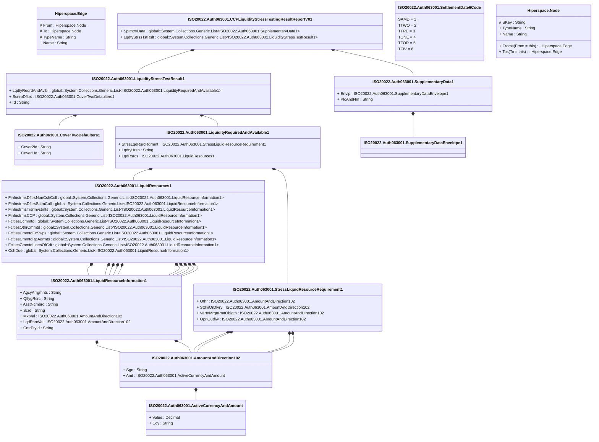

# auth.063.001.01

> The tables below contain descriptions of the members of each Element. 
> The first column indicates the type of the member:
> A ‘#’ indicates that the field is a key to the element, and a ‘+’ indicates that the field is a value.
> The ‘*’ column contains a description for the element member.  
> The ‘@’ column contains any properties for the member.
> The ‘=’ column contains calculated values; or in the case of an enum, the serialized value.

---

## View Hiperspace.Edge
edge between nodes

| |Name|Type|*|@|=|
|-|-|-|-|-|-|
|#|From|Hiperspace.Node||||
|#|To|Hiperspace.Node||||
|#|TypeName|String||||
|+|Name|String||||

---

## Value ISO20022.Auth063001.ActiveCurrencyAndAmount

| |Name|Type|*|@|=|
|-|-|-|-|-|-|
|+|Value|Decimal||XmlElement()||
|+|Ccy|String||XmlAttribute()||
||Validation|Some(String)||XmlIgnore(), JsonIgnore()|validation(validRequired("""Value""",Value),validRequired("""Ccy""",Ccy),validPattern("""Ccy""",Ccy,"""[A-Z]{3,3}"""))|

---

## Value ISO20022.Auth063001.AmountAndDirection102

| |Name|Type|*|@|=|
|-|-|-|-|-|-|
|+|Sgn|String||XmlElement()||
|+|Amt|ISO20022.Auth063001.ActiveCurrencyAndAmount||XmlElement()||
||Validation|Some(String)||XmlIgnore(), JsonIgnore()|validation(validElement(Amt))|

---

## Aspect ISO20022.Auth063001.CCPLiquidityStressTestingResultReportV01

| |Name|Type|*|@|=|
|-|-|-|-|-|-|
|+|SplmtryData|global::System.Collections.Generic.List<ISO20022.Auth063001.SupplementaryData1>||XmlElement()||
|+|LqdtyStrssTstRslt|global::System.Collections.Generic.List<ISO20022.Auth063001.LiquidityStressTestResult1>||XmlElement()||
||Validation|Some(String)||XmlIgnore(), JsonIgnore()|validation(validList("""SplmtryData""",SplmtryData),validElement(SplmtryData),validRequired("""LqdtyStrssTstRslt""",LqdtyStrssTstRslt),validList("""LqdtyStrssTstRslt""",LqdtyStrssTstRslt),validElement(LqdtyStrssTstRslt))|

---

## Value ISO20022.Auth063001.CoverTwoDefaulters1

| |Name|Type|*|@|=|
|-|-|-|-|-|-|
|+|Cover2Id|String||XmlElement()||
|+|Cover1Id|String||XmlElement()||
||Validation|Some(String)||XmlIgnore(), JsonIgnore()|validation(validPattern("""Cover2Id""",Cover2Id,"""[A-Z0-9]{18,18}[0-9]{2,2}"""),validPattern("""Cover1Id""",Cover1Id,"""[A-Z0-9]{18,18}[0-9]{2,2}"""))|

---

## Type ISO20022.Auth063001.Document

| |Name|Type|*|@|=|
|-|-|-|-|-|-|
|+|CCPLqdtyStrssTstgRsltRpt|ISO20022.Auth063001.CCPLiquidityStressTestingResultReportV01||XmlElement()||
||Validation|Some(String)||XmlIgnore(), JsonIgnore()|validation(validElement(CCPLqdtyStrssTstgRsltRpt))|

---

## Value ISO20022.Auth063001.LiquidResourceInformation1

| |Name|Type|*|@|=|
|-|-|-|-|-|-|
|+|AgcyArrgmnts|String||XmlElement()||
|+|QlfygRsrc|String||XmlElement()||
|+|AsstNcmbrd|String||XmlElement()||
|+|Scrd|String||XmlElement()||
|+|MktVal|ISO20022.Auth063001.AmountAndDirection102||XmlElement()||
|+|LqdRsrcVal|ISO20022.Auth063001.AmountAndDirection102||XmlElement()||
|+|CntrPtyId|String||XmlElement()||
||Validation|Some(String)||XmlIgnore(), JsonIgnore()|validation(validElement(MktVal),validElement(LqdRsrcVal))|

---

## Value ISO20022.Auth063001.LiquidResources1

| |Name|Type|*|@|=|
|-|-|-|-|-|-|
|+|FinInstrmsDfltrsNonCshColl|global::System.Collections.Generic.List<ISO20022.Auth063001.LiquidResourceInformation1>||XmlElement()||
|+|FinInstrmsDfltrsSttlmColl|global::System.Collections.Generic.List<ISO20022.Auth063001.LiquidResourceInformation1>||XmlElement()||
|+|FinInstrmsTrsrInvstmts|global::System.Collections.Generic.List<ISO20022.Auth063001.LiquidResourceInformation1>||XmlElement()||
|+|FinInstrmsCCP|global::System.Collections.Generic.List<ISO20022.Auth063001.LiquidResourceInformation1>||XmlElement()||
|+|FcltiesUcmmtd|global::System.Collections.Generic.List<ISO20022.Auth063001.LiquidResourceInformation1>||XmlElement()||
|+|FcltiesOthrCmmtd|global::System.Collections.Generic.List<ISO20022.Auth063001.LiquidResourceInformation1>||XmlElement()||
|+|FcltiesCmmtdFxSwps|global::System.Collections.Generic.List<ISO20022.Auth063001.LiquidResourceInformation1>||XmlElement()||
|+|FcltiesCmmtdRpAgrmts|global::System.Collections.Generic.List<ISO20022.Auth063001.LiquidResourceInformation1>||XmlElement()||
|+|FcltiesCmmtdLinesOfCdt|global::System.Collections.Generic.List<ISO20022.Auth063001.LiquidResourceInformation1>||XmlElement()||
|+|CshDue|global::System.Collections.Generic.List<ISO20022.Auth063001.LiquidResourceInformation1>||XmlElement()||
||Validation|Some(String)||XmlIgnore(), JsonIgnore()|validation(validList("""FinInstrmsDfltrsNonCshColl""",FinInstrmsDfltrsNonCshColl),validElement(FinInstrmsDfltrsNonCshColl),validList("""FinInstrmsDfltrsSttlmColl""",FinInstrmsDfltrsSttlmColl),validElement(FinInstrmsDfltrsSttlmColl),validList("""FinInstrmsTrsrInvstmts""",FinInstrmsTrsrInvstmts),validElement(FinInstrmsTrsrInvstmts),validList("""FinInstrmsCCP""",FinInstrmsCCP),validElement(FinInstrmsCCP),validList("""FcltiesUcmmtd""",FcltiesUcmmtd),validElement(FcltiesUcmmtd),validList("""FcltiesOthrCmmtd""",FcltiesOthrCmmtd),validElement(FcltiesOthrCmmtd),validList("""FcltiesCmmtdFxSwps""",FcltiesCmmtdFxSwps),validElement(FcltiesCmmtdFxSwps),validList("""FcltiesCmmtdRpAgrmts""",FcltiesCmmtdRpAgrmts),validElement(FcltiesCmmtdRpAgrmts),validList("""FcltiesCmmtdLinesOfCdt""",FcltiesCmmtdLinesOfCdt),validElement(FcltiesCmmtdLinesOfCdt),validRequired("""CshDue""",CshDue),validList("""CshDue""",CshDue),validElement(CshDue))|

---

## Value ISO20022.Auth063001.LiquidityRequiredAndAvailable1

| |Name|Type|*|@|=|
|-|-|-|-|-|-|
|+|StrssLqdRsrcRqrmnt|ISO20022.Auth063001.StressLiquidResourceRequirement1||XmlElement()||
|+|LqdtyHrzn|String||XmlElement()||
|+|LqdRsrcs|ISO20022.Auth063001.LiquidResources1||XmlElement()||
||Validation|Some(String)||XmlIgnore(), JsonIgnore()|validation(validElement(StrssLqdRsrcRqrmnt),validElement(LqdRsrcs))|

---

## Value ISO20022.Auth063001.LiquidityStressTestResult1

| |Name|Type|*|@|=|
|-|-|-|-|-|-|
|+|LqdtyReqrdAndAvlbl|global::System.Collections.Generic.List<ISO20022.Auth063001.LiquidityRequiredAndAvailable1>||XmlElement()||
|+|ScnroDfltrs|ISO20022.Auth063001.CoverTwoDefaulters1||XmlElement()||
|+|Id|String||XmlElement()||
||Validation|Some(String)||XmlIgnore(), JsonIgnore()|validation(validList("""LqdtyReqrdAndAvlbl""",LqdtyReqrdAndAvlbl),validListMin("""LqdtyReqrdAndAvlbl""",LqdtyReqrdAndAvlbl,6),validListMax("""LqdtyReqrdAndAvlbl""",LqdtyReqrdAndAvlbl,6),validElement(LqdtyReqrdAndAvlbl),validElement(ScnroDfltrs))|

---

## Enum ISO20022.Auth063001.SettlementDate6Code

| |Name|Type|*|@|=|
|-|-|-|-|-|-|
||SAMD|Int32||XmlEnum("""SAMD""")|1|
||TTWO|Int32||XmlEnum("""TTWO""")|2|
||TTRE|Int32||XmlEnum("""TTRE""")|3|
||TONE|Int32||XmlEnum("""TONE""")|4|
||TFOR|Int32||XmlEnum("""TFOR""")|5|
||TFIV|Int32||XmlEnum("""TFIV""")|6|

---

## Value ISO20022.Auth063001.StressLiquidResourceRequirement1

| |Name|Type|*|@|=|
|-|-|-|-|-|-|
|+|Othr|ISO20022.Auth063001.AmountAndDirection102||XmlElement()||
|+|SttlmOrDlvry|ISO20022.Auth063001.AmountAndDirection102||XmlElement()||
|+|VartnMrgnPmtOblgtn|ISO20022.Auth063001.AmountAndDirection102||XmlElement()||
|+|OprlOutflw|ISO20022.Auth063001.AmountAndDirection102||XmlElement()||
||Validation|Some(String)||XmlIgnore(), JsonIgnore()|validation(validElement(Othr),validElement(SttlmOrDlvry),validElement(VartnMrgnPmtOblgtn),validElement(OprlOutflw))|

---

## Value ISO20022.Auth063001.SupplementaryData1

| |Name|Type|*|@|=|
|-|-|-|-|-|-|
|+|Envlp|ISO20022.Auth063001.SupplementaryDataEnvelope1||XmlElement()||
|+|PlcAndNm|String||XmlElement()||
||Validation|Some(String)||XmlIgnore(), JsonIgnore()|validation(validElement(Envlp))|

---

## Value ISO20022.Auth063001.SupplementaryDataEnvelope1

| |Name|Type|*|@|=|
|-|-|-|-|-|-|
||Validation|Some(String)||XmlIgnore(), JsonIgnore()|""|

---

## View Hiperspace.Node
node in a graph view of data

| |Name|Type|*|@|=|
|-|-|-|-|-|-|
|#|SKey|String||||
|+|TypeName|String||||
|+|Name|String||||
||Froms|Hiperspace.Edge|||From = this|
||Tos|Hiperspace.Edge|||To = this|

