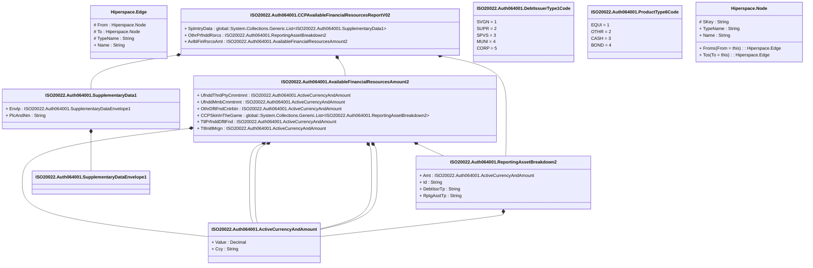

# auth.064.001.02

> The tables below contain descriptions of the members of each Element. 
> The first column indicates the type of the member:
> A ‘#’ indicates that the field is a key to the element, and a ‘+’ indicates that the field is a value.
> The ‘*’ column contains a description for the element member.  
> The ‘@’ column contains any properties for the member.
> The ‘=’ column contains calculated values; or in the case of an enum, the serialized value.

---

## View Hiperspace.Edge
edge between nodes

| |Name|Type|*|@|=|
|-|-|-|-|-|-|
|#|From|Hiperspace.Node||||
|#|To|Hiperspace.Node||||
|#|TypeName|String||||
|+|Name|String||||

---

## Value ISO20022.Auth064001.ActiveCurrencyAndAmount

| |Name|Type|*|@|=|
|-|-|-|-|-|-|
|+|Value|Decimal||XmlElement()||
|+|Ccy|String||XmlAttribute()||
||Validation|Some(String)||XmlIgnore(), JsonIgnore()|validation(validRequired("""Value""",Value),validRequired("""Ccy""",Ccy),validPattern("""Ccy""",Ccy,"""[A-Z]{3,3}"""))|

---

## Value ISO20022.Auth064001.AvailableFinancialResourcesAmount2

| |Name|Type|*|@|=|
|-|-|-|-|-|-|
|+|UfnddThrdPtyCmmtmnt|ISO20022.Auth064001.ActiveCurrencyAndAmount||XmlElement()||
|+|UfnddMmbCmmtmnt|ISO20022.Auth064001.ActiveCurrencyAndAmount||XmlElement()||
|+|OthrDfltFndCntrbtn|ISO20022.Auth064001.ActiveCurrencyAndAmount||XmlElement()||
|+|CCPSkinInTheGame|global::System.Collections.Generic.List<ISO20022.Auth064001.ReportingAssetBreakdown2>||XmlElement()||
|+|TtlPrfnddDfltFnd|ISO20022.Auth064001.ActiveCurrencyAndAmount||XmlElement()||
|+|TtlInitlMrgn|ISO20022.Auth064001.ActiveCurrencyAndAmount||XmlElement()||
||Validation|Some(String)||XmlIgnore(), JsonIgnore()|validation(validElement(UfnddThrdPtyCmmtmnt),validElement(UfnddMmbCmmtmnt),validElement(OthrDfltFndCntrbtn),validRequired("""CCPSkinInTheGame""",CCPSkinInTheGame),validList("""CCPSkinInTheGame""",CCPSkinInTheGame),validElement(CCPSkinInTheGame),validElement(TtlPrfnddDfltFnd),validElement(TtlInitlMrgn))|

---

## Aspect ISO20022.Auth064001.CCPAvailableFinancialResourcesReportV02

| |Name|Type|*|@|=|
|-|-|-|-|-|-|
|+|SplmtryData|global::System.Collections.Generic.List<ISO20022.Auth064001.SupplementaryData1>||XmlElement()||
|+|OthrPrfnddRsrcs|ISO20022.Auth064001.ReportingAssetBreakdown2||XmlElement()||
|+|AvlblFinRsrcsAmt|ISO20022.Auth064001.AvailableFinancialResourcesAmount2||XmlElement()||
||Validation|Some(String)||XmlIgnore(), JsonIgnore()|validation(validList("""SplmtryData""",SplmtryData),validElement(SplmtryData),validElement(OthrPrfnddRsrcs),validElement(AvlblFinRsrcsAmt))|

---

## Enum ISO20022.Auth064001.DebtIssuerType1Code

| |Name|Type|*|@|=|
|-|-|-|-|-|-|
||SVGN|Int32||XmlEnum("""SVGN""")|1|
||SUPR|Int32||XmlEnum("""SUPR""")|2|
||SPVS|Int32||XmlEnum("""SPVS""")|3|
||MUNI|Int32||XmlEnum("""MUNI""")|4|
||CORP|Int32||XmlEnum("""CORP""")|5|

---

## Type ISO20022.Auth064001.Document

| |Name|Type|*|@|=|
|-|-|-|-|-|-|
|+|CCPAvlblFinRsrcsRpt|ISO20022.Auth064001.CCPAvailableFinancialResourcesReportV02||XmlElement()||
||Validation|Some(String)||XmlIgnore(), JsonIgnore()|validation(validElement(CCPAvlblFinRsrcsRpt))|

---

## Enum ISO20022.Auth064001.ProductType6Code

| |Name|Type|*|@|=|
|-|-|-|-|-|-|
||EQUI|Int32||XmlEnum("""EQUI""")|1|
||OTHR|Int32||XmlEnum("""OTHR""")|2|
||CASH|Int32||XmlEnum("""CASH""")|3|
||BOND|Int32||XmlEnum("""BOND""")|4|

---

## Value ISO20022.Auth064001.ReportingAssetBreakdown2

| |Name|Type|*|@|=|
|-|-|-|-|-|-|
|+|Amt|ISO20022.Auth064001.ActiveCurrencyAndAmount||XmlElement()||
|+|Id|String||XmlElement()||
|+|DebtIssrTp|String||XmlElement()||
|+|RptgAsstTp|String||XmlElement()||
||Validation|Some(String)||XmlIgnore(), JsonIgnore()|validation(validElement(Amt))|

---

## Value ISO20022.Auth064001.SupplementaryData1

| |Name|Type|*|@|=|
|-|-|-|-|-|-|
|+|Envlp|ISO20022.Auth064001.SupplementaryDataEnvelope1||XmlElement()||
|+|PlcAndNm|String||XmlElement()||
||Validation|Some(String)||XmlIgnore(), JsonIgnore()|validation(validElement(Envlp))|

---

## Value ISO20022.Auth064001.SupplementaryDataEnvelope1

| |Name|Type|*|@|=|
|-|-|-|-|-|-|
||Validation|Some(String)||XmlIgnore(), JsonIgnore()|""|

---

## View Hiperspace.Node
node in a graph view of data

| |Name|Type|*|@|=|
|-|-|-|-|-|-|
|#|SKey|String||||
|+|TypeName|String||||
|+|Name|String||||
||Froms|Hiperspace.Edge|||From = this|
||Tos|Hiperspace.Edge|||To = this|

