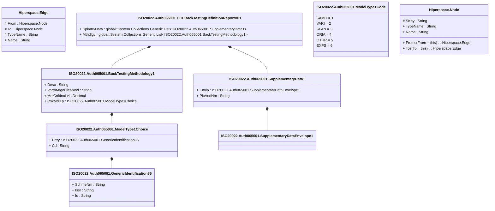

# auth.065.001.01

> The tables below contain descriptions of the members of each Element. 
> The first column indicates the type of the member:
> A ‘#’ indicates that the field is a key to the element, and a ‘+’ indicates that the field is a value.
> The ‘*’ column contains a description for the element member.  
> The ‘@’ column contains any properties for the member.
> The ‘=’ column contains calculated values; or in the case of an enum, the serialized value.

---

## View Hiperspace.Edge
edge between nodes

| |Name|Type|*|@|=|
|-|-|-|-|-|-|
|#|From|Hiperspace.Node||||
|#|To|Hiperspace.Node||||
|#|TypeName|String||||
|+|Name|String||||

---

## Value ISO20022.Auth065001.BackTestingMethodology1

| |Name|Type|*|@|=|
|-|-|-|-|-|-|
|+|Desc|String||XmlElement()||
|+|VartnMrgnCleanInd|String||XmlElement()||
|+|MdlCnfdncLvl|Decimal||XmlElement()||
|+|RskMdlTp|ISO20022.Auth065001.ModelType1Choice||XmlElement()||
||Validation|Some(String)||XmlIgnore(), JsonIgnore()|validation(validElement(RskMdlTp))|

---

## Aspect ISO20022.Auth065001.CCPBackTestingDefinitionReportV01

| |Name|Type|*|@|=|
|-|-|-|-|-|-|
|+|SplmtryData|global::System.Collections.Generic.List<ISO20022.Auth065001.SupplementaryData1>||XmlElement()||
|+|Mthdlgy|global::System.Collections.Generic.List<ISO20022.Auth065001.BackTestingMethodology1>||XmlElement()||
||Validation|Some(String)||XmlIgnore(), JsonIgnore()|validation(validList("""SplmtryData""",SplmtryData),validElement(SplmtryData),validRequired("""Mthdlgy""",Mthdlgy),validList("""Mthdlgy""",Mthdlgy),validElement(Mthdlgy))|

---

## Type ISO20022.Auth065001.Document

| |Name|Type|*|@|=|
|-|-|-|-|-|-|
|+|CCPBckTstgDefRpt|ISO20022.Auth065001.CCPBackTestingDefinitionReportV01||XmlElement()||
||Validation|Some(String)||XmlIgnore(), JsonIgnore()|validation(validElement(CCPBckTstgDefRpt))|

---

## Value ISO20022.Auth065001.GenericIdentification36

| |Name|Type|*|@|=|
|-|-|-|-|-|-|
|+|SchmeNm|String||XmlElement()||
|+|Issr|String||XmlElement()||
|+|Id|String||XmlElement()||
||Validation|Some(String)||XmlIgnore(), JsonIgnore()|""|

---

## Value ISO20022.Auth065001.ModelType1Choice

| |Name|Type|*|@|=|
|-|-|-|-|-|-|
|+|Prtry|ISO20022.Auth065001.GenericIdentification36||XmlElement()||
|+|Cd|String||XmlElement()||
||Validation|Some(String)||XmlIgnore(), JsonIgnore()|validation(validElement(Prtry),validChoice(Prtry,Cd))|

---

## Enum ISO20022.Auth065001.ModelType1Code

| |Name|Type|*|@|=|
|-|-|-|-|-|-|
||SAMO|Int32||XmlEnum("""SAMO""")|1|
||VARI|Int32||XmlEnum("""VARI""")|2|
||SPAN|Int32||XmlEnum("""SPAN""")|3|
||ORIA|Int32||XmlEnum("""ORIA""")|4|
||OTHR|Int32||XmlEnum("""OTHR""")|5|
||EXPS|Int32||XmlEnum("""EXPS""")|6|

---

## Value ISO20022.Auth065001.SupplementaryData1

| |Name|Type|*|@|=|
|-|-|-|-|-|-|
|+|Envlp|ISO20022.Auth065001.SupplementaryDataEnvelope1||XmlElement()||
|+|PlcAndNm|String||XmlElement()||
||Validation|Some(String)||XmlIgnore(), JsonIgnore()|validation(validElement(Envlp))|

---

## Value ISO20022.Auth065001.SupplementaryDataEnvelope1

| |Name|Type|*|@|=|
|-|-|-|-|-|-|
||Validation|Some(String)||XmlIgnore(), JsonIgnore()|""|

---

## View Hiperspace.Node
node in a graph view of data

| |Name|Type|*|@|=|
|-|-|-|-|-|-|
|#|SKey|String||||
|+|TypeName|String||||
|+|Name|String||||
||Froms|Hiperspace.Edge|||From = this|
||Tos|Hiperspace.Edge|||To = this|

