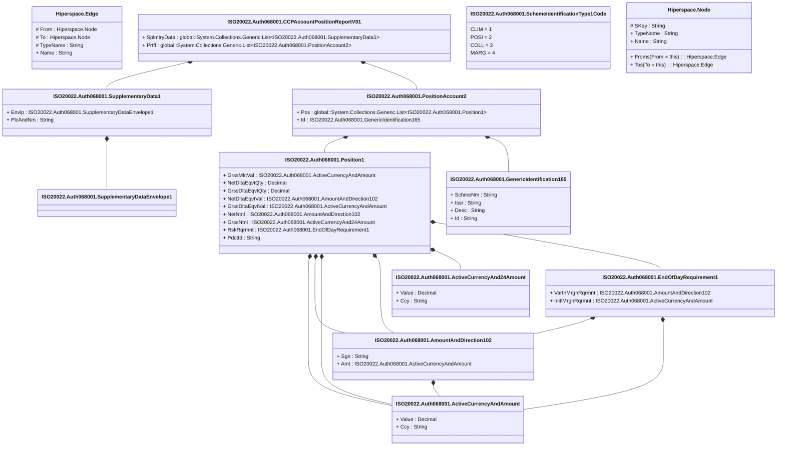

# auth.068.001.01

> The tables below contain descriptions of the members of each Element. 
> The first column indicates the type of the member:
> A ‘#’ indicates that the field is a key to the element, and a ‘+’ indicates that the field is a value.
> The ‘*’ column contains a description for the element member.  
> The ‘@’ column contains any properties for the member.
> The ‘=’ column contains calculated values; or in the case of an enum, the serialized value.

---

## View Hiperspace.Edge
edge between nodes

| |Name|Type|*|@|=|
|-|-|-|-|-|-|
|#|From|Hiperspace.Node||||
|#|To|Hiperspace.Node||||
|#|TypeName|String||||
|+|Name|String||||

---

## Value ISO20022.Auth068001.ActiveCurrencyAnd24Amount

| |Name|Type|*|@|=|
|-|-|-|-|-|-|
|+|Value|Decimal||XmlElement()||
|+|Ccy|String||XmlAttribute()||
||Validation|Some(String)||XmlIgnore(), JsonIgnore()|validation(validRequired("""Value""",Value),validRequired("""Ccy""",Ccy),validPattern("""Ccy""",Ccy,"""[A-Z]{3,3}"""))|

---

## Value ISO20022.Auth068001.ActiveCurrencyAndAmount

| |Name|Type|*|@|=|
|-|-|-|-|-|-|
|+|Value|Decimal||XmlElement()||
|+|Ccy|String||XmlAttribute()||
||Validation|Some(String)||XmlIgnore(), JsonIgnore()|validation(validRequired("""Value""",Value),validRequired("""Ccy""",Ccy),validPattern("""Ccy""",Ccy,"""[A-Z]{3,3}"""))|

---

## Value ISO20022.Auth068001.AmountAndDirection102

| |Name|Type|*|@|=|
|-|-|-|-|-|-|
|+|Sgn|String||XmlElement()||
|+|Amt|ISO20022.Auth068001.ActiveCurrencyAndAmount||XmlElement()||
||Validation|Some(String)||XmlIgnore(), JsonIgnore()|validation(validElement(Amt))|

---

## Aspect ISO20022.Auth068001.CCPAccountPositionReportV01

| |Name|Type|*|@|=|
|-|-|-|-|-|-|
|+|SplmtryData|global::System.Collections.Generic.List<ISO20022.Auth068001.SupplementaryData1>||XmlElement()||
|+|Prtfl|global::System.Collections.Generic.List<ISO20022.Auth068001.PositionAccount2>||XmlElement()||
||Validation|Some(String)||XmlIgnore(), JsonIgnore()|validation(validList("""SplmtryData""",SplmtryData),validElement(SplmtryData),validRequired("""Prtfl""",Prtfl),validList("""Prtfl""",Prtfl),validElement(Prtfl))|

---

## Type ISO20022.Auth068001.Document

| |Name|Type|*|@|=|
|-|-|-|-|-|-|
|+|CCPAcctPosRpt|ISO20022.Auth068001.CCPAccountPositionReportV01||XmlElement()||
||Validation|Some(String)||XmlIgnore(), JsonIgnore()|validation(validElement(CCPAcctPosRpt))|

---

## Value ISO20022.Auth068001.EndOfDayRequirement1

| |Name|Type|*|@|=|
|-|-|-|-|-|-|
|+|VartnMrgnRqrmnt|ISO20022.Auth068001.AmountAndDirection102||XmlElement()||
|+|InitlMrgnRqrmnt|ISO20022.Auth068001.ActiveCurrencyAndAmount||XmlElement()||
||Validation|Some(String)||XmlIgnore(), JsonIgnore()|validation(validElement(VartnMrgnRqrmnt),validElement(InitlMrgnRqrmnt))|

---

## Value ISO20022.Auth068001.GenericIdentification165

| |Name|Type|*|@|=|
|-|-|-|-|-|-|
|+|SchmeNm|String||XmlElement()||
|+|Issr|String||XmlElement()||
|+|Desc|String||XmlElement()||
|+|Id|String||XmlElement()||
||Validation|Some(String)||XmlIgnore(), JsonIgnore()|""|

---

## Value ISO20022.Auth068001.Position1

| |Name|Type|*|@|=|
|-|-|-|-|-|-|
|+|GrssMktVal|ISO20022.Auth068001.ActiveCurrencyAndAmount||XmlElement()||
|+|NetDltaEqvtQty|Decimal||XmlElement()||
|+|GrssDltaEqvtQty|Decimal||XmlElement()||
|+|NetDltaEqvtVal|ISO20022.Auth068001.AmountAndDirection102||XmlElement()||
|+|GrssDltaEqvtVal|ISO20022.Auth068001.ActiveCurrencyAndAmount||XmlElement()||
|+|NetNtnl|ISO20022.Auth068001.AmountAndDirection102||XmlElement()||
|+|GrssNtnl|ISO20022.Auth068001.ActiveCurrencyAnd24Amount||XmlElement()||
|+|RskRqrmnt|ISO20022.Auth068001.EndOfDayRequirement1||XmlElement()||
|+|PdctId|String||XmlElement()||
||Validation|Some(String)||XmlIgnore(), JsonIgnore()|validation(validElement(GrssMktVal),validElement(NetDltaEqvtVal),validElement(GrssDltaEqvtVal),validElement(NetNtnl),validElement(GrssNtnl),validElement(RskRqrmnt))|

---

## Value ISO20022.Auth068001.PositionAccount2

| |Name|Type|*|@|=|
|-|-|-|-|-|-|
|+|Pos|global::System.Collections.Generic.List<ISO20022.Auth068001.Position1>||XmlElement()||
|+|Id|ISO20022.Auth068001.GenericIdentification165||XmlElement()||
||Validation|Some(String)||XmlIgnore(), JsonIgnore()|validation(validRequired("""Pos""",Pos),validList("""Pos""",Pos),validElement(Pos),validElement(Id))|

---

## Enum ISO20022.Auth068001.SchemeIdentificationType1Code

| |Name|Type|*|@|=|
|-|-|-|-|-|-|
||CLIM|Int32||XmlEnum("""CLIM""")|1|
||POSI|Int32||XmlEnum("""POSI""")|2|
||COLL|Int32||XmlEnum("""COLL""")|3|
||MARG|Int32||XmlEnum("""MARG""")|4|

---

## Value ISO20022.Auth068001.SupplementaryData1

| |Name|Type|*|@|=|
|-|-|-|-|-|-|
|+|Envlp|ISO20022.Auth068001.SupplementaryDataEnvelope1||XmlElement()||
|+|PlcAndNm|String||XmlElement()||
||Validation|Some(String)||XmlIgnore(), JsonIgnore()|validation(validElement(Envlp))|

---

## Value ISO20022.Auth068001.SupplementaryDataEnvelope1

| |Name|Type|*|@|=|
|-|-|-|-|-|-|
||Validation|Some(String)||XmlIgnore(), JsonIgnore()|""|

---

## View Hiperspace.Node
node in a graph view of data

| |Name|Type|*|@|=|
|-|-|-|-|-|-|
|#|SKey|String||||
|+|TypeName|String||||
|+|Name|String||||
||Froms|Hiperspace.Edge|||From = this|
||Tos|Hiperspace.Edge|||To = this|

