# auth.069.001.02

```mermaid
classDiagram
    class Hiperspace.Edge {
        # From  : Hiperspace.Node
        # To  : Hiperspace.Node
        # TypeName  : String
        + Name  : String
    }
    class ISO20022.Auth069001.ActiveCurrencyAnd24Amount {
        + Value  : Decimal
        + Ccy  : String
    }
    class ISO20022.Auth069001.ActiveCurrencyAndAmount {
        + Value  : Decimal
        + Ccy  : String
    }
    class ISO20022.Auth069001.CCPClearedProductReportV02 {
        + SplmtryData  : global::System.Collections.Generic.List~ISO20022.Auth069001.SupplementaryData1~
        + ClrdPdct  : global::System.Collections.Generic.List~ISO20022.Auth069001.ClearedProduct2~
    }
    ISO20022.Auth069001.CCPClearedProductReportV02 *-- ISO20022.Auth069001.SupplementaryData1
    ISO20022.Auth069001.CCPClearedProductReportV02 *-- ISO20022.Auth069001.ClearedProduct2
    class ISO20022.Auth069001.ClearedProduct2 {
        + ClrdGrssNtnlAmt  : ISO20022.Auth069001.ActiveCurrencyAnd24Amount
        + TrdsClrd  : Decimal
        + OpnIntrst  : ISO20022.Auth069001.OpenInterest1
        + Pdct  : ISO20022.Auth069001.Product1Choice
        + UvrslPdctId  : ISO20022.Auth069001.GenericIdentification168
        + CCPPdctId  : ISO20022.Auth069001.GenericIdentification168
        + TradgVn  : global::System.Collections.Generic.List~String~
    }
    ISO20022.Auth069001.ClearedProduct2 *-- ISO20022.Auth069001.ActiveCurrencyAnd24Amount
    ISO20022.Auth069001.ClearedProduct2 *-- ISO20022.Auth069001.OpenInterest1
    ISO20022.Auth069001.ClearedProduct2 *-- ISO20022.Auth069001.Product1Choice
    ISO20022.Auth069001.ClearedProduct2 *-- ISO20022.Auth069001.GenericIdentification168
    ISO20022.Auth069001.ClearedProduct2 *-- ISO20022.Auth069001.GenericIdentification168
    class ISO20022.Auth069001.ContractSize1 {
        + Unit  : ISO20022.Auth069001.UnitOfMeasure5Choice
        + LotSz  : Decimal
    }
    ISO20022.Auth069001.ContractSize1 *-- ISO20022.Auth069001.UnitOfMeasure5Choice
    class ISO20022.Auth069001.DefinedAttributes1Choice {
        + ValDfndAttrbts  : ISO20022.Auth069001.FinancialInstrumentAttributes90
        + QtyDfndAttrbts  : ISO20022.Auth069001.FinancialInstrumentAttributes89
    }
    ISO20022.Auth069001.DefinedAttributes1Choice *-- ISO20022.Auth069001.FinancialInstrumentAttributes90
    ISO20022.Auth069001.DefinedAttributes1Choice *-- ISO20022.Auth069001.FinancialInstrumentAttributes89
    class ISO20022.Auth069001.Derivative3 {
        + OptnAttrbts  : ISO20022.Auth069001.Option14
        + DerivUndrlygLeg  : global::System.Collections.Generic.List~ISO20022.Auth069001.DerivativeUnderlyingLeg1~
        + DerivClssfctn  : ISO20022.Auth069001.DerivativeClassification1
    }
    ISO20022.Auth069001.Derivative3 *-- ISO20022.Auth069001.Option14
    ISO20022.Auth069001.Derivative3 *-- ISO20022.Auth069001.DerivativeUnderlyingLeg1
    ISO20022.Auth069001.Derivative3 *-- ISO20022.Auth069001.DerivativeClassification1
    class ISO20022.Auth069001.DerivativeClassification1 {
        + TxTp  : String
        + SubCmmdty  : String
        + SubPdct  : String
        + BasePdct  : String
        + AsstClss  : String
    }
    class ISO20022.Auth069001.DerivativeUnderlyingLeg1 {
        + DfndAttrbts  : ISO20022.Auth069001.DefinedAttributes1Choice
        + CtrctAttrbts  : ISO20022.Auth069001.FinancialInstrumentAttributes88
    }
    ISO20022.Auth069001.DerivativeUnderlyingLeg1 *-- ISO20022.Auth069001.DefinedAttributes1Choice
    ISO20022.Auth069001.DerivativeUnderlyingLeg1 *-- ISO20022.Auth069001.FinancialInstrumentAttributes88
    class ISO20022.Auth069001.ExoticOptionStyle1Code {
        VANI = 1
        NOTO = 2
        DIGI = 3
        BINA = 4
    }
    class ISO20022.Auth069001.FinancialInstrument59 {
        + Sctr  : String
        + Issr  : String
        + Id  : String
    }
    class ISO20022.Auth069001.FinancialInstrumentAttributes88 {
        + PmtFrqcy  : String
        + Stdstn  : global::System.Collections.Generic.List~String~
        + CtrctTerm  : ISO20022.Auth069001.InterestRateContractTerm1
    }
    ISO20022.Auth069001.FinancialInstrumentAttributes88 *-- ISO20022.Auth069001.InterestRateContractTerm1
    class ISO20022.Auth069001.FinancialInstrumentAttributes89 {
        + PricCcy  : String
        + UndrlygId  : ISO20022.Auth069001.GenericIdentification165
        + DlvryTp  : String
        + CtrctSz  : ISO20022.Auth069001.ContractSize1
    }
    ISO20022.Auth069001.FinancialInstrumentAttributes89 *-- ISO20022.Auth069001.GenericIdentification165
    ISO20022.Auth069001.FinancialInstrumentAttributes89 *-- ISO20022.Auth069001.ContractSize1
    class ISO20022.Auth069001.FinancialInstrumentAttributes90 {
        + IntrstRateTerms  : String
        + IndxUnit  : String
        + IndxId  : ISO20022.Auth069001.GenericIdentification168
        + UnitVal  : ISO20022.Auth069001.ActiveCurrencyAndAmount
        + Ntnl  : ISO20022.Auth069001.ActiveCurrencyAndAmount
    }
    ISO20022.Auth069001.FinancialInstrumentAttributes90 *-- ISO20022.Auth069001.GenericIdentification168
    ISO20022.Auth069001.FinancialInstrumentAttributes90 *-- ISO20022.Auth069001.ActiveCurrencyAndAmount
    ISO20022.Auth069001.FinancialInstrumentAttributes90 *-- ISO20022.Auth069001.ActiveCurrencyAndAmount
    class ISO20022.Auth069001.Frequency11Code {
        CRED = 1
        WEEK = 2
        UPFR = 3
        MIAN = 4
        QURT = 5
        OVNG = 6
        EXPI = 7
        MNTH = 8
        DAIL = 9
        YEAR = 10
    }
    class ISO20022.Auth069001.GeneralCollateral2 {
        + ElgblFinInstrmId  : global::System.Collections.Generic.List~String~
    }
    class ISO20022.Auth069001.GenericIdentification165 {
        + SchmeNm  : String
        + Issr  : String
        + Desc  : String
        + Id  : String
    }
    class ISO20022.Auth069001.GenericIdentification168 {
        + SchmeNm  : String
        + Issr  : String
        + Desc  : String
        + Id  : String
    }
    class ISO20022.Auth069001.GenericIdentification36 {
        + SchmeNm  : String
        + Issr  : String
        + Id  : String
    }
    class ISO20022.Auth069001.InterestComputationMethod2Code {
        NARR = 1
        A014 = 2
        A013 = 3
        A012 = 4
        A011 = 5
        A010 = 6
        A009 = 7
        A008 = 8
        A007 = 9
        A006 = 10
        A005 = 11
        A004 = 12
        A003 = 13
        A002 = 14
        A001 = 15
    }
    class ISO20022.Auth069001.InterestRateContractTerm1 {
        + Val  : Decimal
        + Unit  : String
    }
    class ISO20022.Auth069001.OpenInterest1 {
        + NbOfLots  : Decimal
        + GrssNtnlAmt  : ISO20022.Auth069001.ActiveCurrencyAnd24Amount
    }
    ISO20022.Auth069001.OpenInterest1 *-- ISO20022.Auth069001.ActiveCurrencyAnd24Amount
    class ISO20022.Auth069001.Option14 {
        + EvtTp  : ISO20022.Auth069001.OptionEvent2
        + BrrrInd  : String
        + OptnTp  : String
        + OptnStyle  : String
        + XprtnStyle  : global::System.Collections.Generic.List~String~
    }
    ISO20022.Auth069001.Option14 *-- ISO20022.Auth069001.OptionEvent2
    class ISO20022.Auth069001.OptionEvent2 {
        + Desc  : String
        + Tp  : ISO20022.Auth069001.OptionEventType1Choice
    }
    ISO20022.Auth069001.OptionEvent2 *-- ISO20022.Auth069001.OptionEventType1Choice
    class ISO20022.Auth069001.OptionEventType1Choice {
        + Prtry  : ISO20022.Auth069001.GenericIdentification36
        + Cd  : String
    }
    ISO20022.Auth069001.OptionEventType1Choice *-- ISO20022.Auth069001.GenericIdentification36
    class ISO20022.Auth069001.OptionEventType1Code {
        TRIG = 1
        OTHR = 2
        KNOC = 3
        KNIN = 4
        CONF = 5
        CLST = 6
    }
    class ISO20022.Auth069001.OptionStyle5Code {
        EURO = 1
        BERM = 2
        ASIA = 3
        AMER = 4
    }
    class ISO20022.Auth069001.OptionType1Code {
        PUTO = 1
        CALL = 2
    }
    class ISO20022.Auth069001.PhysicalTransferType4Code {
        CASH = 1
        OPTL = 2
        PHYS = 3
    }
    class ISO20022.Auth069001.Product1Choice {
        + Scty  : ISO20022.Auth069001.FinancialInstrument59
        + SctiesFincgTx  : ISO20022.Auth069001.RepurchaseAgreement3
        + Deriv  : ISO20022.Auth069001.Derivative3
    }
    ISO20022.Auth069001.Product1Choice *-- ISO20022.Auth069001.FinancialInstrument59
    ISO20022.Auth069001.Product1Choice *-- ISO20022.Auth069001.RepurchaseAgreement3
    ISO20022.Auth069001.Product1Choice *-- ISO20022.Auth069001.Derivative3
    class ISO20022.Auth069001.ProductClassification1 {
        + TxTp  : String
        + SubCmmdty  : String
        + SubPdct  : String
        + BasePdct  : String
        + AsstClss  : String
    }
    class ISO20022.Auth069001.RateBasis1Code {
        YEAR = 1
        WEEK = 2
        MNTH = 3
        DAYS = 4
    }
    class ISO20022.Auth069001.RepurchaseAgreement3 {
        + TrptyAgt  : String
        + RpAgrmtTp  : ISO20022.Auth069001.RepurchaseAgreementType1Choice
        + PdctClssfctn  : ISO20022.Auth069001.ProductClassification1
    }
    ISO20022.Auth069001.RepurchaseAgreement3 *-- ISO20022.Auth069001.RepurchaseAgreementType1Choice
    ISO20022.Auth069001.RepurchaseAgreement3 *-- ISO20022.Auth069001.ProductClassification1
    class ISO20022.Auth069001.RepurchaseAgreementType1Choice {
        + GnlColl  : ISO20022.Auth069001.GeneralCollateral2
        + SpcfcColl  : ISO20022.Auth069001.SpecificCollateral2
    }
    ISO20022.Auth069001.RepurchaseAgreementType1Choice *-- ISO20022.Auth069001.GeneralCollateral2
    ISO20022.Auth069001.RepurchaseAgreementType1Choice *-- ISO20022.Auth069001.SpecificCollateral2
    class ISO20022.Auth069001.SchemeIdentificationType1Code {
        CLIM = 1
        POSI = 2
        COLL = 3
        MARG = 4
    }
    class ISO20022.Auth069001.SpecificCollateral2 {
        + FinInstrmId  : ISO20022.Auth069001.FinancialInstrument59
    }
    ISO20022.Auth069001.SpecificCollateral2 *-- ISO20022.Auth069001.FinancialInstrument59
    class ISO20022.Auth069001.Standardisation1Code {
        STAN = 1
        NSTA = 2
        FLEX = 3
    }
    class ISO20022.Auth069001.SupplementaryData1 {
        + Envlp  : ISO20022.Auth069001.SupplementaryDataEnvelope1
        + PlcAndNm  : String
    }
    ISO20022.Auth069001.SupplementaryData1 *-- ISO20022.Auth069001.SupplementaryDataEnvelope1
    class ISO20022.Auth069001.SupplementaryDataEnvelope1 {
    }
    class ISO20022.Auth069001.UnitOfMeasure5Choice {
        + Prtry  : ISO20022.Auth069001.GenericIdentification36
        + Cd  : String
    }
    ISO20022.Auth069001.UnitOfMeasure5Choice *-- ISO20022.Auth069001.GenericIdentification36
    class ISO20022.Auth069001.UnitOfMeasure8Code {
        USTN = 1
        FUTU = 2
        IPNT = 3
        INCH = 4
        HUWG = 5
        HECT = 6
        GRAM = 7
        GBQA = 8
        GBPI = 9
        GBOU = 10
        GBGA = 11
        GGEU = 12
        FOOT = 13
        ENVO = 14
        ENVC = 15
        DMET = 16
        DGEU = 17
        DAYS = 18
        CBME = 19
        CLRT = 20
        CEER = 21
        CMET = 22
        CELI = 23
        BUSL = 24
        BDFT = 25
        BCUF = 26
        BARL = 27
        ARES = 28
        ACCY = 29
        ALOW = 30
        ACRE = 31
        YARD = 32
        USQA = 33
        USPI = 34
        USOU = 35
        UCWT = 36
        USGA = 37
        OZTR = 38
        TOCD = 39
        TONS = 40
        THMS = 41
        SQYA = 42
        SMIL = 43
        SQMI = 44
        SMET = 45
        SQKI = 46
        SQIN = 47
        SQFO = 48
        SCMT = 49
        SHAS = 50
        PWRD = 51
        PUND = 52
        PIEC = 53
        MBTU = 54
        MIBA = 55
        MMET = 56
        MILI = 57
        MILE = 58
        TONE = 59
        METR = 60
        MWYC = 61
        MMOC = 62
        MWMC = 63
        MWHC = 64
        MWHO = 65
        MWDC = 66
        LITR = 67
        KWYC = 68
        KWMC = 69
        KMOC = 70
        KWHC = 71
        KWHO = 72
        KWDC = 73
        KMET = 74
        KILO = 75
    }
    class Hiperspace.Node {
        # SKey  : String
        + TypeName  : String
        + Name  : String
        + Froms (From = this) : Hiperspace.Edge
        + Tos (To = this) : Hiperspace.Edge
    }
```

> The tables below contain descriptions of the members of each Element. 
> The first column indicates the type of the member:
> A ‘#’ indicates that the field is a key to the element, and a ‘+’ indicates that the field is a value.
> The ‘*’ column contains a description for the element member.  
> The ‘@’ column contains any properties for the member.
> The ‘=’ column contains calculated values; or in the case of an enum, the serialized value.

---

## View Hiperspace.Edge
edge between nodes

| |Name|Type|*|@|=|
|-|-|-|-|-|-|
|#|From|Hiperspace.Node||||
|#|To|Hiperspace.Node||||
|#|TypeName|String||||
|+|Name|String||||

---

## Value ISO20022.Auth069001.ActiveCurrencyAnd24Amount

| |Name|Type|*|@|=|
|-|-|-|-|-|-|
|+|Value|Decimal||XmlElement()||
|+|Ccy|String||XmlAttribute()||
||Validation|Some(String)||XmlIgnore(), JsonIgnore()|validation(validRequired("""Value""",Value),validRequired("""Ccy""",Ccy),validPattern("""Ccy""",Ccy,"""[A-Z]{3,3}"""))|

---

## Value ISO20022.Auth069001.ActiveCurrencyAndAmount

| |Name|Type|*|@|=|
|-|-|-|-|-|-|
|+|Value|Decimal||XmlElement()||
|+|Ccy|String||XmlAttribute()||
||Validation|Some(String)||XmlIgnore(), JsonIgnore()|validation(validRequired("""Value""",Value),validRequired("""Ccy""",Ccy),validPattern("""Ccy""",Ccy,"""[A-Z]{3,3}"""))|

---

## Aspect ISO20022.Auth069001.CCPClearedProductReportV02

| |Name|Type|*|@|=|
|-|-|-|-|-|-|
|+|SplmtryData|global::System.Collections.Generic.List<ISO20022.Auth069001.SupplementaryData1>||XmlElement()||
|+|ClrdPdct|global::System.Collections.Generic.List<ISO20022.Auth069001.ClearedProduct2>||XmlElement()||
||Validation|Some(String)||XmlIgnore(), JsonIgnore()|validation(validList("""SplmtryData""",SplmtryData),validElement(SplmtryData),validRequired("""ClrdPdct""",ClrdPdct),validList("""ClrdPdct""",ClrdPdct),validElement(ClrdPdct))|

---

## Value ISO20022.Auth069001.ClearedProduct2

| |Name|Type|*|@|=|
|-|-|-|-|-|-|
|+|ClrdGrssNtnlAmt|ISO20022.Auth069001.ActiveCurrencyAnd24Amount||XmlElement()||
|+|TrdsClrd|Decimal||XmlElement()||
|+|OpnIntrst|ISO20022.Auth069001.OpenInterest1||XmlElement()||
|+|Pdct|ISO20022.Auth069001.Product1Choice||XmlElement()||
|+|UvrslPdctId|ISO20022.Auth069001.GenericIdentification168||XmlElement()||
|+|CCPPdctId|ISO20022.Auth069001.GenericIdentification168||XmlElement()||
|+|TradgVn|global::System.Collections.Generic.List<String>||XmlElement()||
||Validation|Some(String)||XmlIgnore(), JsonIgnore()|validation(validElement(ClrdGrssNtnlAmt),validElement(OpnIntrst),validElement(Pdct),validElement(UvrslPdctId),validElement(CCPPdctId),validRequired("""TradgVn""",TradgVn),validPattern("""TradgVn""",TradgVn,"""[A-Z0-9]{4,4}"""))|

---

## Value ISO20022.Auth069001.ContractSize1

| |Name|Type|*|@|=|
|-|-|-|-|-|-|
|+|Unit|ISO20022.Auth069001.UnitOfMeasure5Choice||XmlElement()||
|+|LotSz|Decimal||XmlElement()||
||Validation|Some(String)||XmlIgnore(), JsonIgnore()|validation(validElement(Unit))|

---

## Value ISO20022.Auth069001.DefinedAttributes1Choice

| |Name|Type|*|@|=|
|-|-|-|-|-|-|
|+|ValDfndAttrbts|ISO20022.Auth069001.FinancialInstrumentAttributes90||XmlElement()||
|+|QtyDfndAttrbts|ISO20022.Auth069001.FinancialInstrumentAttributes89||XmlElement()||
||Validation|Some(String)||XmlIgnore(), JsonIgnore()|validation(validElement(ValDfndAttrbts),validElement(QtyDfndAttrbts),validChoice(ValDfndAttrbts,QtyDfndAttrbts))|

---

## Value ISO20022.Auth069001.Derivative3

| |Name|Type|*|@|=|
|-|-|-|-|-|-|
|+|OptnAttrbts|ISO20022.Auth069001.Option14||XmlElement()||
|+|DerivUndrlygLeg|global::System.Collections.Generic.List<ISO20022.Auth069001.DerivativeUnderlyingLeg1>||XmlElement()||
|+|DerivClssfctn|ISO20022.Auth069001.DerivativeClassification1||XmlElement()||
||Validation|Some(String)||XmlIgnore(), JsonIgnore()|validation(validElement(OptnAttrbts),validRequired("""DerivUndrlygLeg""",DerivUndrlygLeg),validList("""DerivUndrlygLeg""",DerivUndrlygLeg),validListMax("""DerivUndrlygLeg""",DerivUndrlygLeg,2),validElement(DerivUndrlygLeg),validElement(DerivClssfctn))|

---

## Value ISO20022.Auth069001.DerivativeClassification1

| |Name|Type|*|@|=|
|-|-|-|-|-|-|
|+|TxTp|String||XmlElement()||
|+|SubCmmdty|String||XmlElement()||
|+|SubPdct|String||XmlElement()||
|+|BasePdct|String||XmlElement()||
|+|AsstClss|String||XmlElement()||
||Validation|Some(String)||XmlIgnore(), JsonIgnore()|""|

---

## Value ISO20022.Auth069001.DerivativeUnderlyingLeg1

| |Name|Type|*|@|=|
|-|-|-|-|-|-|
|+|DfndAttrbts|ISO20022.Auth069001.DefinedAttributes1Choice||XmlElement()||
|+|CtrctAttrbts|ISO20022.Auth069001.FinancialInstrumentAttributes88||XmlElement()||
||Validation|Some(String)||XmlIgnore(), JsonIgnore()|validation(validElement(DfndAttrbts),validElement(CtrctAttrbts))|

---

## Type ISO20022.Auth069001.Document

| |Name|Type|*|@|=|
|-|-|-|-|-|-|
|+|CCPClrdPdctRpt|ISO20022.Auth069001.CCPClearedProductReportV02||XmlElement()||
||Validation|Some(String)||XmlIgnore(), JsonIgnore()|validation(validElement(CCPClrdPdctRpt))|

---

## Enum ISO20022.Auth069001.ExoticOptionStyle1Code

| |Name|Type|*|@|=|
|-|-|-|-|-|-|
||VANI|Int32||XmlEnum("""VANI""")|1|
||NOTO|Int32||XmlEnum("""NOTO""")|2|
||DIGI|Int32||XmlEnum("""DIGI""")|3|
||BINA|Int32||XmlEnum("""BINA""")|4|

---

## Value ISO20022.Auth069001.FinancialInstrument59

| |Name|Type|*|@|=|
|-|-|-|-|-|-|
|+|Sctr|String||XmlElement()||
|+|Issr|String||XmlElement()||
|+|Id|String||XmlElement()||
||Validation|Some(String)||XmlIgnore(), JsonIgnore()|validation(validPattern("""Issr""",Issr,"""[A-Z0-9]{18,18}[0-9]{2,2}"""),validPattern("""Id""",Id,"""[A-Z]{2,2}[A-Z0-9]{9,9}[0-9]{1,1}"""))|

---

## Value ISO20022.Auth069001.FinancialInstrumentAttributes88

| |Name|Type|*|@|=|
|-|-|-|-|-|-|
|+|PmtFrqcy|String||XmlElement()||
|+|Stdstn|global::System.Collections.Generic.List<String>||XmlElement()||
|+|CtrctTerm|ISO20022.Auth069001.InterestRateContractTerm1||XmlElement()||
||Validation|Some(String)||XmlIgnore(), JsonIgnore()|validation(validListMax("""Stdstn""",Stdstn,3),validElement(CtrctTerm))|

---

## Value ISO20022.Auth069001.FinancialInstrumentAttributes89

| |Name|Type|*|@|=|
|-|-|-|-|-|-|
|+|PricCcy|String||XmlElement()||
|+|UndrlygId|ISO20022.Auth069001.GenericIdentification165||XmlElement()||
|+|DlvryTp|String||XmlElement()||
|+|CtrctSz|ISO20022.Auth069001.ContractSize1||XmlElement()||
||Validation|Some(String)||XmlIgnore(), JsonIgnore()|validation(validPattern("""PricCcy""",PricCcy,"""[A-Z]{3,3}"""),validElement(UndrlygId),validElement(CtrctSz))|

---

## Value ISO20022.Auth069001.FinancialInstrumentAttributes90

| |Name|Type|*|@|=|
|-|-|-|-|-|-|
|+|IntrstRateTerms|String||XmlElement()||
|+|IndxUnit|String||XmlElement()||
|+|IndxId|ISO20022.Auth069001.GenericIdentification168||XmlElement()||
|+|UnitVal|ISO20022.Auth069001.ActiveCurrencyAndAmount||XmlElement()||
|+|Ntnl|ISO20022.Auth069001.ActiveCurrencyAndAmount||XmlElement()||
||Validation|Some(String)||XmlIgnore(), JsonIgnore()|validation(validElement(IndxId),validElement(UnitVal),validElement(Ntnl))|

---

## Enum ISO20022.Auth069001.Frequency11Code

| |Name|Type|*|@|=|
|-|-|-|-|-|-|
||CRED|Int32||XmlEnum("""CRED""")|1|
||WEEK|Int32||XmlEnum("""WEEK""")|2|
||UPFR|Int32||XmlEnum("""UPFR""")|3|
||MIAN|Int32||XmlEnum("""MIAN""")|4|
||QURT|Int32||XmlEnum("""QURT""")|5|
||OVNG|Int32||XmlEnum("""OVNG""")|6|
||EXPI|Int32||XmlEnum("""EXPI""")|7|
||MNTH|Int32||XmlEnum("""MNTH""")|8|
||DAIL|Int32||XmlEnum("""DAIL""")|9|
||YEAR|Int32||XmlEnum("""YEAR""")|10|

---

## Value ISO20022.Auth069001.GeneralCollateral2

| |Name|Type|*|@|=|
|-|-|-|-|-|-|
|+|ElgblFinInstrmId|global::System.Collections.Generic.List<String>||XmlElement()||
||Validation|Some(String)||XmlIgnore(), JsonIgnore()|validation(validRequired("""ElgblFinInstrmId""",ElgblFinInstrmId))|

---

## Value ISO20022.Auth069001.GenericIdentification165

| |Name|Type|*|@|=|
|-|-|-|-|-|-|
|+|SchmeNm|String||XmlElement()||
|+|Issr|String||XmlElement()||
|+|Desc|String||XmlElement()||
|+|Id|String||XmlElement()||
||Validation|Some(String)||XmlIgnore(), JsonIgnore()|""|

---

## Value ISO20022.Auth069001.GenericIdentification168

| |Name|Type|*|@|=|
|-|-|-|-|-|-|
|+|SchmeNm|String||XmlElement()||
|+|Issr|String||XmlElement()||
|+|Desc|String||XmlElement()||
|+|Id|String||XmlElement()||
||Validation|Some(String)||XmlIgnore(), JsonIgnore()|""|

---

## Value ISO20022.Auth069001.GenericIdentification36

| |Name|Type|*|@|=|
|-|-|-|-|-|-|
|+|SchmeNm|String||XmlElement()||
|+|Issr|String||XmlElement()||
|+|Id|String||XmlElement()||
||Validation|Some(String)||XmlIgnore(), JsonIgnore()|""|

---

## Enum ISO20022.Auth069001.InterestComputationMethod2Code

| |Name|Type|*|@|=|
|-|-|-|-|-|-|
||NARR|Int32||XmlEnum("""NARR""")|1|
||A014|Int32||XmlEnum("""A014""")|2|
||A013|Int32||XmlEnum("""A013""")|3|
||A012|Int32||XmlEnum("""A012""")|4|
||A011|Int32||XmlEnum("""A011""")|5|
||A010|Int32||XmlEnum("""A010""")|6|
||A009|Int32||XmlEnum("""A009""")|7|
||A008|Int32||XmlEnum("""A008""")|8|
||A007|Int32||XmlEnum("""A007""")|9|
||A006|Int32||XmlEnum("""A006""")|10|
||A005|Int32||XmlEnum("""A005""")|11|
||A004|Int32||XmlEnum("""A004""")|12|
||A003|Int32||XmlEnum("""A003""")|13|
||A002|Int32||XmlEnum("""A002""")|14|
||A001|Int32||XmlEnum("""A001""")|15|

---

## Value ISO20022.Auth069001.InterestRateContractTerm1

| |Name|Type|*|@|=|
|-|-|-|-|-|-|
|+|Val|Decimal||XmlElement()||
|+|Unit|String||XmlElement()||
||Validation|Some(String)||XmlIgnore(), JsonIgnore()|""|

---

## Value ISO20022.Auth069001.OpenInterest1

| |Name|Type|*|@|=|
|-|-|-|-|-|-|
|+|NbOfLots|Decimal||XmlElement()||
|+|GrssNtnlAmt|ISO20022.Auth069001.ActiveCurrencyAnd24Amount||XmlElement()||
||Validation|Some(String)||XmlIgnore(), JsonIgnore()|validation(validElement(GrssNtnlAmt))|

---

## Value ISO20022.Auth069001.Option14

| |Name|Type|*|@|=|
|-|-|-|-|-|-|
|+|EvtTp|ISO20022.Auth069001.OptionEvent2||XmlElement()||
|+|BrrrInd|String||XmlElement()||
|+|OptnTp|String||XmlElement()||
|+|OptnStyle|String||XmlElement()||
|+|XprtnStyle|global::System.Collections.Generic.List<String>||XmlElement()||
||Validation|Some(String)||XmlIgnore(), JsonIgnore()|validation(validElement(EvtTp),validRequired("""XprtnStyle""",XprtnStyle),validListMax("""XprtnStyle""",XprtnStyle,4))|

---

## Value ISO20022.Auth069001.OptionEvent2

| |Name|Type|*|@|=|
|-|-|-|-|-|-|
|+|Desc|String||XmlElement()||
|+|Tp|ISO20022.Auth069001.OptionEventType1Choice||XmlElement()||
||Validation|Some(String)||XmlIgnore(), JsonIgnore()|validation(validElement(Tp))|

---

## Value ISO20022.Auth069001.OptionEventType1Choice

| |Name|Type|*|@|=|
|-|-|-|-|-|-|
|+|Prtry|ISO20022.Auth069001.GenericIdentification36||XmlElement()||
|+|Cd|String||XmlElement()||
||Validation|Some(String)||XmlIgnore(), JsonIgnore()|validation(validElement(Prtry),validChoice(Prtry,Cd))|

---

## Enum ISO20022.Auth069001.OptionEventType1Code

| |Name|Type|*|@|=|
|-|-|-|-|-|-|
||TRIG|Int32||XmlEnum("""TRIG""")|1|
||OTHR|Int32||XmlEnum("""OTHR""")|2|
||KNOC|Int32||XmlEnum("""KNOC""")|3|
||KNIN|Int32||XmlEnum("""KNIN""")|4|
||CONF|Int32||XmlEnum("""CONF""")|5|
||CLST|Int32||XmlEnum("""CLST""")|6|

---

## Enum ISO20022.Auth069001.OptionStyle5Code

| |Name|Type|*|@|=|
|-|-|-|-|-|-|
||EURO|Int32||XmlEnum("""EURO""")|1|
||BERM|Int32||XmlEnum("""BERM""")|2|
||ASIA|Int32||XmlEnum("""ASIA""")|3|
||AMER|Int32||XmlEnum("""AMER""")|4|

---

## Enum ISO20022.Auth069001.OptionType1Code

| |Name|Type|*|@|=|
|-|-|-|-|-|-|
||PUTO|Int32||XmlEnum("""PUTO""")|1|
||CALL|Int32||XmlEnum("""CALL""")|2|

---

## Enum ISO20022.Auth069001.PhysicalTransferType4Code

| |Name|Type|*|@|=|
|-|-|-|-|-|-|
||CASH|Int32||XmlEnum("""CASH""")|1|
||OPTL|Int32||XmlEnum("""OPTL""")|2|
||PHYS|Int32||XmlEnum("""PHYS""")|3|

---

## Value ISO20022.Auth069001.Product1Choice

| |Name|Type|*|@|=|
|-|-|-|-|-|-|
|+|Scty|ISO20022.Auth069001.FinancialInstrument59||XmlElement()||
|+|SctiesFincgTx|ISO20022.Auth069001.RepurchaseAgreement3||XmlElement()||
|+|Deriv|ISO20022.Auth069001.Derivative3||XmlElement()||
||Validation|Some(String)||XmlIgnore(), JsonIgnore()|validation(validElement(Scty),validElement(SctiesFincgTx),validElement(Deriv),validChoice(Scty,SctiesFincgTx,Deriv))|

---

## Value ISO20022.Auth069001.ProductClassification1

| |Name|Type|*|@|=|
|-|-|-|-|-|-|
|+|TxTp|String||XmlElement()||
|+|SubCmmdty|String||XmlElement()||
|+|SubPdct|String||XmlElement()||
|+|BasePdct|String||XmlElement()||
|+|AsstClss|String||XmlElement()||
||Validation|Some(String)||XmlIgnore(), JsonIgnore()|""|

---

## Enum ISO20022.Auth069001.RateBasis1Code

| |Name|Type|*|@|=|
|-|-|-|-|-|-|
||YEAR|Int32||XmlEnum("""YEAR""")|1|
||WEEK|Int32||XmlEnum("""WEEK""")|2|
||MNTH|Int32||XmlEnum("""MNTH""")|3|
||DAYS|Int32||XmlEnum("""DAYS""")|4|

---

## Value ISO20022.Auth069001.RepurchaseAgreement3

| |Name|Type|*|@|=|
|-|-|-|-|-|-|
|+|TrptyAgt|String||XmlElement()||
|+|RpAgrmtTp|ISO20022.Auth069001.RepurchaseAgreementType1Choice||XmlElement()||
|+|PdctClssfctn|ISO20022.Auth069001.ProductClassification1||XmlElement()||
||Validation|Some(String)||XmlIgnore(), JsonIgnore()|validation(validPattern("""TrptyAgt""",TrptyAgt,"""[A-Z0-9]{18,18}[0-9]{2,2}"""),validElement(RpAgrmtTp),validElement(PdctClssfctn))|

---

## Value ISO20022.Auth069001.RepurchaseAgreementType1Choice

| |Name|Type|*|@|=|
|-|-|-|-|-|-|
|+|GnlColl|ISO20022.Auth069001.GeneralCollateral2||XmlElement()||
|+|SpcfcColl|ISO20022.Auth069001.SpecificCollateral2||XmlElement()||
||Validation|Some(String)||XmlIgnore(), JsonIgnore()|validation(validElement(GnlColl),validElement(SpcfcColl),validChoice(GnlColl,SpcfcColl))|

---

## Enum ISO20022.Auth069001.SchemeIdentificationType1Code

| |Name|Type|*|@|=|
|-|-|-|-|-|-|
||CLIM|Int32||XmlEnum("""CLIM""")|1|
||POSI|Int32||XmlEnum("""POSI""")|2|
||COLL|Int32||XmlEnum("""COLL""")|3|
||MARG|Int32||XmlEnum("""MARG""")|4|

---

## Value ISO20022.Auth069001.SpecificCollateral2

| |Name|Type|*|@|=|
|-|-|-|-|-|-|
|+|FinInstrmId|ISO20022.Auth069001.FinancialInstrument59||XmlElement()||
||Validation|Some(String)||XmlIgnore(), JsonIgnore()|validation(validElement(FinInstrmId))|

---

## Enum ISO20022.Auth069001.Standardisation1Code

| |Name|Type|*|@|=|
|-|-|-|-|-|-|
||STAN|Int32||XmlEnum("""STAN""")|1|
||NSTA|Int32||XmlEnum("""NSTA""")|2|
||FLEX|Int32||XmlEnum("""FLEX""")|3|

---

## Value ISO20022.Auth069001.SupplementaryData1

| |Name|Type|*|@|=|
|-|-|-|-|-|-|
|+|Envlp|ISO20022.Auth069001.SupplementaryDataEnvelope1||XmlElement()||
|+|PlcAndNm|String||XmlElement()||
||Validation|Some(String)||XmlIgnore(), JsonIgnore()|validation(validElement(Envlp))|

---

## Value ISO20022.Auth069001.SupplementaryDataEnvelope1

| |Name|Type|*|@|=|
|-|-|-|-|-|-|
||Validation|Some(String)||XmlIgnore(), JsonIgnore()|""|

---

## Value ISO20022.Auth069001.UnitOfMeasure5Choice

| |Name|Type|*|@|=|
|-|-|-|-|-|-|
|+|Prtry|ISO20022.Auth069001.GenericIdentification36||XmlElement()||
|+|Cd|String||XmlElement()||
||Validation|Some(String)||XmlIgnore(), JsonIgnore()|validation(validElement(Prtry),validChoice(Prtry,Cd))|

---

## Enum ISO20022.Auth069001.UnitOfMeasure8Code

| |Name|Type|*|@|=|
|-|-|-|-|-|-|
||USTN|Int32||XmlEnum("""USTN""")|1|
||FUTU|Int32||XmlEnum("""FUTU""")|2|
||IPNT|Int32||XmlEnum("""IPNT""")|3|
||INCH|Int32||XmlEnum("""INCH""")|4|
||HUWG|Int32||XmlEnum("""HUWG""")|5|
||HECT|Int32||XmlEnum("""HECT""")|6|
||GRAM|Int32||XmlEnum("""GRAM""")|7|
||GBQA|Int32||XmlEnum("""GBQA""")|8|
||GBPI|Int32||XmlEnum("""GBPI""")|9|
||GBOU|Int32||XmlEnum("""GBOU""")|10|
||GBGA|Int32||XmlEnum("""GBGA""")|11|
||GGEU|Int32||XmlEnum("""GGEU""")|12|
||FOOT|Int32||XmlEnum("""FOOT""")|13|
||ENVO|Int32||XmlEnum("""ENVO""")|14|
||ENVC|Int32||XmlEnum("""ENVC""")|15|
||DMET|Int32||XmlEnum("""DMET""")|16|
||DGEU|Int32||XmlEnum("""DGEU""")|17|
||DAYS|Int32||XmlEnum("""DAYS""")|18|
||CBME|Int32||XmlEnum("""CBME""")|19|
||CLRT|Int32||XmlEnum("""CLRT""")|20|
||CEER|Int32||XmlEnum("""CEER""")|21|
||CMET|Int32||XmlEnum("""CMET""")|22|
||CELI|Int32||XmlEnum("""CELI""")|23|
||BUSL|Int32||XmlEnum("""BUSL""")|24|
||BDFT|Int32||XmlEnum("""BDFT""")|25|
||BCUF|Int32||XmlEnum("""BCUF""")|26|
||BARL|Int32||XmlEnum("""BARL""")|27|
||ARES|Int32||XmlEnum("""ARES""")|28|
||ACCY|Int32||XmlEnum("""ACCY""")|29|
||ALOW|Int32||XmlEnum("""ALOW""")|30|
||ACRE|Int32||XmlEnum("""ACRE""")|31|
||YARD|Int32||XmlEnum("""YARD""")|32|
||USQA|Int32||XmlEnum("""USQA""")|33|
||USPI|Int32||XmlEnum("""USPI""")|34|
||USOU|Int32||XmlEnum("""USOU""")|35|
||UCWT|Int32||XmlEnum("""UCWT""")|36|
||USGA|Int32||XmlEnum("""USGA""")|37|
||OZTR|Int32||XmlEnum("""OZTR""")|38|
||TOCD|Int32||XmlEnum("""TOCD""")|39|
||TONS|Int32||XmlEnum("""TONS""")|40|
||THMS|Int32||XmlEnum("""THMS""")|41|
||SQYA|Int32||XmlEnum("""SQYA""")|42|
||SMIL|Int32||XmlEnum("""SMIL""")|43|
||SQMI|Int32||XmlEnum("""SQMI""")|44|
||SMET|Int32||XmlEnum("""SMET""")|45|
||SQKI|Int32||XmlEnum("""SQKI""")|46|
||SQIN|Int32||XmlEnum("""SQIN""")|47|
||SQFO|Int32||XmlEnum("""SQFO""")|48|
||SCMT|Int32||XmlEnum("""SCMT""")|49|
||SHAS|Int32||XmlEnum("""SHAS""")|50|
||PWRD|Int32||XmlEnum("""PWRD""")|51|
||PUND|Int32||XmlEnum("""PUND""")|52|
||PIEC|Int32||XmlEnum("""PIEC""")|53|
||MBTU|Int32||XmlEnum("""MBTU""")|54|
||MIBA|Int32||XmlEnum("""MIBA""")|55|
||MMET|Int32||XmlEnum("""MMET""")|56|
||MILI|Int32||XmlEnum("""MILI""")|57|
||MILE|Int32||XmlEnum("""MILE""")|58|
||TONE|Int32||XmlEnum("""TONE""")|59|
||METR|Int32||XmlEnum("""METR""")|60|
||MWYC|Int32||XmlEnum("""MWYC""")|61|
||MMOC|Int32||XmlEnum("""MMOC""")|62|
||MWMC|Int32||XmlEnum("""MWMC""")|63|
||MWHC|Int32||XmlEnum("""MWHC""")|64|
||MWHO|Int32||XmlEnum("""MWHO""")|65|
||MWDC|Int32||XmlEnum("""MWDC""")|66|
||LITR|Int32||XmlEnum("""LITR""")|67|
||KWYC|Int32||XmlEnum("""KWYC""")|68|
||KWMC|Int32||XmlEnum("""KWMC""")|69|
||KMOC|Int32||XmlEnum("""KMOC""")|70|
||KWHC|Int32||XmlEnum("""KWHC""")|71|
||KWHO|Int32||XmlEnum("""KWHO""")|72|
||KWDC|Int32||XmlEnum("""KWDC""")|73|
||KMET|Int32||XmlEnum("""KMET""")|74|
||KILO|Int32||XmlEnum("""KILO""")|75|

---

## View Hiperspace.Node
node in a graph view of data

| |Name|Type|*|@|=|
|-|-|-|-|-|-|
|#|SKey|String||||
|+|TypeName|String||||
|+|Name|String||||
||Froms|Hiperspace.Edge|||From = this|
||Tos|Hiperspace.Edge|||To = this|

