# auth.070.001.02

```mermaid
classDiagram
    class Hiperspace.Edge {
        # From  : Hiperspace.Node
        # To  : Hiperspace.Node
        # TypeName  : String
        + Name  : String
    }
    class ISO20022.Auth070001.ActiveOrHistoricCurrencyAndAmount {
        + Value  : Decimal
        + Ccy  : String
    }
    class ISO20022.Auth070001.CollateralMarginCorrection6 {
        + SplmtryData  : global::System.Collections.Generic.List~ISO20022.Auth070001.SupplementaryData1~
        + RcvdMrgnOrColl  : ISO20022.Auth070001.ReceivedMarginOrCollateral4
        + PstdMrgnOrColl  : ISO20022.Auth070001.PostedMarginOrCollateral4
        + CollPrtflId  : String
        + CtrPty  : ISO20022.Auth070001.Counterparty39
        + EvtDt  : DateTime
        + RptgDtTm  : DateTime
        + TechRcrdId  : String
    }
    ISO20022.Auth070001.CollateralMarginCorrection6 *-- ISO20022.Auth070001.SupplementaryData1
    ISO20022.Auth070001.CollateralMarginCorrection6 *-- ISO20022.Auth070001.ReceivedMarginOrCollateral4
    ISO20022.Auth070001.CollateralMarginCorrection6 *-- ISO20022.Auth070001.PostedMarginOrCollateral4
    ISO20022.Auth070001.CollateralMarginCorrection6 *-- ISO20022.Auth070001.Counterparty39
    class ISO20022.Auth070001.CollateralMarginError4 {
        + SplmtryData  : global::System.Collections.Generic.List~ISO20022.Auth070001.SupplementaryData1~
        + CollPrtflId  : String
        + CtrPty  : ISO20022.Auth070001.Counterparty39
        + RptgDtTm  : DateTime
        + TechRcrdId  : String
    }
    ISO20022.Auth070001.CollateralMarginError4 *-- ISO20022.Auth070001.SupplementaryData1
    ISO20022.Auth070001.CollateralMarginError4 *-- ISO20022.Auth070001.Counterparty39
    class ISO20022.Auth070001.CollateralMarginMarginUpdate5 {
        + SplmtryData  : global::System.Collections.Generic.List~ISO20022.Auth070001.SupplementaryData1~
        + RcvdMrgnOrColl  : ISO20022.Auth070001.ReceivedMarginOrCollateral4
        + PstdMrgnOrColl  : ISO20022.Auth070001.PostedMarginOrCollateral4
        + CollPrtflId  : String
        + CtrPty  : ISO20022.Auth070001.Counterparty39
        + EvtDt  : DateTime
        + RptgDtTm  : DateTime
        + TechRcrdId  : String
    }
    ISO20022.Auth070001.CollateralMarginMarginUpdate5 *-- ISO20022.Auth070001.SupplementaryData1
    ISO20022.Auth070001.CollateralMarginMarginUpdate5 *-- ISO20022.Auth070001.ReceivedMarginOrCollateral4
    ISO20022.Auth070001.CollateralMarginMarginUpdate5 *-- ISO20022.Auth070001.PostedMarginOrCollateral4
    ISO20022.Auth070001.CollateralMarginMarginUpdate5 *-- ISO20022.Auth070001.Counterparty39
    class ISO20022.Auth070001.Counterparty39 {
        + RptSubmitgNtty  : ISO20022.Auth070001.OrganisationIdentification15Choice
        + NttyRspnsblForRpt  : ISO20022.Auth070001.OrganisationIdentification15Choice
        + OthrCtrPty  : ISO20022.Auth070001.PartyIdentification236Choice
        + RptgCtrPty  : ISO20022.Auth070001.OrganisationIdentification15Choice
    }
    ISO20022.Auth070001.Counterparty39 *-- ISO20022.Auth070001.OrganisationIdentification15Choice
    ISO20022.Auth070001.Counterparty39 *-- ISO20022.Auth070001.OrganisationIdentification15Choice
    ISO20022.Auth070001.Counterparty39 *-- ISO20022.Auth070001.PartyIdentification236Choice
    ISO20022.Auth070001.Counterparty39 *-- ISO20022.Auth070001.OrganisationIdentification15Choice
    class ISO20022.Auth070001.GenericIdentification175 {
        + Issr  : String
        + SchmeNm  : String
        + Id  : String
    }
    class ISO20022.Auth070001.NaturalPersonIdentification2 {
        + Dmcl  : String
        + Nm  : String
        + Id  : ISO20022.Auth070001.GenericIdentification175
    }
    ISO20022.Auth070001.NaturalPersonIdentification2 *-- ISO20022.Auth070001.GenericIdentification175
    class ISO20022.Auth070001.OrganisationIdentification15Choice {
        + AnyBIC  : String
        + Othr  : ISO20022.Auth070001.OrganisationIdentification38
        + LEI  : String
    }
    ISO20022.Auth070001.OrganisationIdentification15Choice *-- ISO20022.Auth070001.OrganisationIdentification38
    class ISO20022.Auth070001.OrganisationIdentification38 {
        + Dmcl  : String
        + Nm  : String
        + Id  : ISO20022.Auth070001.GenericIdentification175
    }
    ISO20022.Auth070001.OrganisationIdentification38 *-- ISO20022.Auth070001.GenericIdentification175
    class ISO20022.Auth070001.PartyIdentification236Choice {
        + Ntrl  : ISO20022.Auth070001.NaturalPersonIdentification2
        + Lgl  : ISO20022.Auth070001.OrganisationIdentification15Choice
    }
    ISO20022.Auth070001.PartyIdentification236Choice *-- ISO20022.Auth070001.NaturalPersonIdentification2
    ISO20022.Auth070001.PartyIdentification236Choice *-- ISO20022.Auth070001.OrganisationIdentification15Choice
    class ISO20022.Auth070001.PostedMarginOrCollateral4 {
        + XcssCollPstd  : ISO20022.Auth070001.ActiveOrHistoricCurrencyAndAmount
        + VartnMrgnPstd  : ISO20022.Auth070001.ActiveOrHistoricCurrencyAndAmount
        + InitlMrgnPstd  : ISO20022.Auth070001.ActiveOrHistoricCurrencyAndAmount
    }
    ISO20022.Auth070001.PostedMarginOrCollateral4 *-- ISO20022.Auth070001.ActiveOrHistoricCurrencyAndAmount
    ISO20022.Auth070001.PostedMarginOrCollateral4 *-- ISO20022.Auth070001.ActiveOrHistoricCurrencyAndAmount
    ISO20022.Auth070001.PostedMarginOrCollateral4 *-- ISO20022.Auth070001.ActiveOrHistoricCurrencyAndAmount
    class ISO20022.Auth070001.ReceivedMarginOrCollateral4 {
        + XcssCollRcvd  : ISO20022.Auth070001.ActiveOrHistoricCurrencyAndAmount
        + VartnMrgnRcvd  : ISO20022.Auth070001.ActiveOrHistoricCurrencyAndAmount
        + InitlMrgnRcvd  : ISO20022.Auth070001.ActiveOrHistoricCurrencyAndAmount
    }
    ISO20022.Auth070001.ReceivedMarginOrCollateral4 *-- ISO20022.Auth070001.ActiveOrHistoricCurrencyAndAmount
    ISO20022.Auth070001.ReceivedMarginOrCollateral4 *-- ISO20022.Auth070001.ActiveOrHistoricCurrencyAndAmount
    ISO20022.Auth070001.ReceivedMarginOrCollateral4 *-- ISO20022.Auth070001.ActiveOrHistoricCurrencyAndAmount
    class ISO20022.Auth070001.ReportPeriodActivity1Code {
        NOTX = 1
    }
    class ISO20022.Auth070001.SecuritiesFinancingReportingTransactionMarginDataReportV02 {
        + SplmtryData  : global::System.Collections.Generic.List~ISO20022.Auth070001.SupplementaryData1~
        + TradData  : ISO20022.Auth070001.TradeData39Choice
    }
    ISO20022.Auth070001.SecuritiesFinancingReportingTransactionMarginDataReportV02 *-- ISO20022.Auth070001.SupplementaryData1
    ISO20022.Auth070001.SecuritiesFinancingReportingTransactionMarginDataReportV02 *-- ISO20022.Auth070001.TradeData39Choice
    class ISO20022.Auth070001.SupplementaryData1 {
        + Envlp  : ISO20022.Auth070001.SupplementaryDataEnvelope1
        + PlcAndNm  : String
    }
    ISO20022.Auth070001.SupplementaryData1 *-- ISO20022.Auth070001.SupplementaryDataEnvelope1
    class ISO20022.Auth070001.SupplementaryDataEnvelope1 {
    }
    class ISO20022.Auth070001.TradeData39Choice {
        + Rpt  : global::System.Collections.Generic.List~ISO20022.Auth070001.TradeReport21Choice~
        + DataSetActn  : String
    }
    ISO20022.Auth070001.TradeData39Choice *-- ISO20022.Auth070001.TradeReport21Choice
    class ISO20022.Auth070001.TradeReport21Choice {
        + TradUpd  : ISO20022.Auth070001.CollateralMarginMarginUpdate5
        + Crrctn  : ISO20022.Auth070001.CollateralMarginCorrection6
        + Err  : ISO20022.Auth070001.CollateralMarginError4
        + New  : ISO20022.Auth070001.CollateralMarginCorrection6
    }
    ISO20022.Auth070001.TradeReport21Choice *-- ISO20022.Auth070001.CollateralMarginMarginUpdate5
    ISO20022.Auth070001.TradeReport21Choice *-- ISO20022.Auth070001.CollateralMarginCorrection6
    ISO20022.Auth070001.TradeReport21Choice *-- ISO20022.Auth070001.CollateralMarginError4
    ISO20022.Auth070001.TradeReport21Choice *-- ISO20022.Auth070001.CollateralMarginCorrection6
    class Hiperspace.Node {
        # SKey  : String
        + TypeName  : String
        + Name  : String
        + Froms (From = this) : Hiperspace.Edge
        + Tos (To = this) : Hiperspace.Edge
    }
```

> The tables below contain descriptions of the members of each Element. 
> The first column indicates the type of the member:
> A ‘#’ indicates that the field is a key to the element, and a ‘+’ indicates that the field is a value.
> The ‘*’ column contains a description for the element member.  
> The ‘@’ column contains any properties for the member.
> The ‘=’ column contains calculated values; or in the case of an enum, the serialized value.

---

## View Hiperspace.Edge
edge between nodes

| |Name|Type|*|@|=|
|-|-|-|-|-|-|
|#|From|Hiperspace.Node||||
|#|To|Hiperspace.Node||||
|#|TypeName|String||||
|+|Name|String||||

---

## Value ISO20022.Auth070001.ActiveOrHistoricCurrencyAndAmount

| |Name|Type|*|@|=|
|-|-|-|-|-|-|
|+|Value|Decimal||XmlElement()||
|+|Ccy|String||XmlAttribute()||
||Validation|Some(String)||XmlIgnore(), JsonIgnore()|validation(validRequired("""Value""",Value),validRequired("""Ccy""",Ccy),validPattern("""Ccy""",Ccy,"""[A-Z]{3,3}"""))|

---

## Value ISO20022.Auth070001.CollateralMarginCorrection6

| |Name|Type|*|@|=|
|-|-|-|-|-|-|
|+|SplmtryData|global::System.Collections.Generic.List<ISO20022.Auth070001.SupplementaryData1>||XmlElement()||
|+|RcvdMrgnOrColl|ISO20022.Auth070001.ReceivedMarginOrCollateral4||XmlElement()||
|+|PstdMrgnOrColl|ISO20022.Auth070001.PostedMarginOrCollateral4||XmlElement()||
|+|CollPrtflId|String||XmlElement()||
|+|CtrPty|ISO20022.Auth070001.Counterparty39||XmlElement()||
|+|EvtDt|DateTime||XmlElement()||
|+|RptgDtTm|DateTime||XmlElement()||
|+|TechRcrdId|String||XmlElement()||
||Validation|Some(String)||XmlIgnore(), JsonIgnore()|validation(validList("""SplmtryData""",SplmtryData),validElement(SplmtryData),validElement(RcvdMrgnOrColl),validElement(PstdMrgnOrColl),validElement(CtrPty))|

---

## Value ISO20022.Auth070001.CollateralMarginError4

| |Name|Type|*|@|=|
|-|-|-|-|-|-|
|+|SplmtryData|global::System.Collections.Generic.List<ISO20022.Auth070001.SupplementaryData1>||XmlElement()||
|+|CollPrtflId|String||XmlElement()||
|+|CtrPty|ISO20022.Auth070001.Counterparty39||XmlElement()||
|+|RptgDtTm|DateTime||XmlElement()||
|+|TechRcrdId|String||XmlElement()||
||Validation|Some(String)||XmlIgnore(), JsonIgnore()|validation(validList("""SplmtryData""",SplmtryData),validElement(SplmtryData),validElement(CtrPty))|

---

## Value ISO20022.Auth070001.CollateralMarginMarginUpdate5

| |Name|Type|*|@|=|
|-|-|-|-|-|-|
|+|SplmtryData|global::System.Collections.Generic.List<ISO20022.Auth070001.SupplementaryData1>||XmlElement()||
|+|RcvdMrgnOrColl|ISO20022.Auth070001.ReceivedMarginOrCollateral4||XmlElement()||
|+|PstdMrgnOrColl|ISO20022.Auth070001.PostedMarginOrCollateral4||XmlElement()||
|+|CollPrtflId|String||XmlElement()||
|+|CtrPty|ISO20022.Auth070001.Counterparty39||XmlElement()||
|+|EvtDt|DateTime||XmlElement()||
|+|RptgDtTm|DateTime||XmlElement()||
|+|TechRcrdId|String||XmlElement()||
||Validation|Some(String)||XmlIgnore(), JsonIgnore()|validation(validList("""SplmtryData""",SplmtryData),validElement(SplmtryData),validElement(RcvdMrgnOrColl),validElement(PstdMrgnOrColl),validElement(CtrPty))|

---

## Value ISO20022.Auth070001.Counterparty39

| |Name|Type|*|@|=|
|-|-|-|-|-|-|
|+|RptSubmitgNtty|ISO20022.Auth070001.OrganisationIdentification15Choice||XmlElement()||
|+|NttyRspnsblForRpt|ISO20022.Auth070001.OrganisationIdentification15Choice||XmlElement()||
|+|OthrCtrPty|ISO20022.Auth070001.PartyIdentification236Choice||XmlElement()||
|+|RptgCtrPty|ISO20022.Auth070001.OrganisationIdentification15Choice||XmlElement()||
||Validation|Some(String)||XmlIgnore(), JsonIgnore()|validation(validElement(RptSubmitgNtty),validElement(NttyRspnsblForRpt),validElement(OthrCtrPty),validElement(RptgCtrPty))|

---

## Type ISO20022.Auth070001.Document

| |Name|Type|*|@|=|
|-|-|-|-|-|-|
|+|SctiesFincgRptgTxMrgnDataRpt|ISO20022.Auth070001.SecuritiesFinancingReportingTransactionMarginDataReportV02||XmlElement()||
||Validation|Some(String)||XmlIgnore(), JsonIgnore()|validation(validElement(SctiesFincgRptgTxMrgnDataRpt))|

---

## Value ISO20022.Auth070001.GenericIdentification175

| |Name|Type|*|@|=|
|-|-|-|-|-|-|
|+|Issr|String||XmlElement()||
|+|SchmeNm|String||XmlElement()||
|+|Id|String||XmlElement()||
||Validation|Some(String)||XmlIgnore(), JsonIgnore()|""|

---

## Value ISO20022.Auth070001.NaturalPersonIdentification2

| |Name|Type|*|@|=|
|-|-|-|-|-|-|
|+|Dmcl|String||XmlElement()||
|+|Nm|String||XmlElement()||
|+|Id|ISO20022.Auth070001.GenericIdentification175||XmlElement()||
||Validation|Some(String)||XmlIgnore(), JsonIgnore()|validation(validElement(Id))|

---

## Value ISO20022.Auth070001.OrganisationIdentification15Choice

| |Name|Type|*|@|=|
|-|-|-|-|-|-|
|+|AnyBIC|String||XmlElement()||
|+|Othr|ISO20022.Auth070001.OrganisationIdentification38||XmlElement()||
|+|LEI|String||XmlElement()||
||Validation|Some(String)||XmlIgnore(), JsonIgnore()|validation(validPattern("""AnyBIC""",AnyBIC,"""[A-Z0-9]{4,4}[A-Z]{2,2}[A-Z0-9]{2,2}([A-Z0-9]{3,3}){0,1}"""),validElement(Othr),validPattern("""LEI""",LEI,"""[A-Z0-9]{18,18}[0-9]{2,2}"""),validChoice(AnyBIC,Othr,LEI))|

---

## Value ISO20022.Auth070001.OrganisationIdentification38

| |Name|Type|*|@|=|
|-|-|-|-|-|-|
|+|Dmcl|String||XmlElement()||
|+|Nm|String||XmlElement()||
|+|Id|ISO20022.Auth070001.GenericIdentification175||XmlElement()||
||Validation|Some(String)||XmlIgnore(), JsonIgnore()|validation(validElement(Id))|

---

## Value ISO20022.Auth070001.PartyIdentification236Choice

| |Name|Type|*|@|=|
|-|-|-|-|-|-|
|+|Ntrl|ISO20022.Auth070001.NaturalPersonIdentification2||XmlElement()||
|+|Lgl|ISO20022.Auth070001.OrganisationIdentification15Choice||XmlElement()||
||Validation|Some(String)||XmlIgnore(), JsonIgnore()|validation(validElement(Ntrl),validElement(Lgl),validChoice(Ntrl,Lgl))|

---

## Value ISO20022.Auth070001.PostedMarginOrCollateral4

| |Name|Type|*|@|=|
|-|-|-|-|-|-|
|+|XcssCollPstd|ISO20022.Auth070001.ActiveOrHistoricCurrencyAndAmount||XmlElement()||
|+|VartnMrgnPstd|ISO20022.Auth070001.ActiveOrHistoricCurrencyAndAmount||XmlElement()||
|+|InitlMrgnPstd|ISO20022.Auth070001.ActiveOrHistoricCurrencyAndAmount||XmlElement()||
||Validation|Some(String)||XmlIgnore(), JsonIgnore()|validation(validElement(XcssCollPstd),validElement(VartnMrgnPstd),validElement(InitlMrgnPstd))|

---

## Value ISO20022.Auth070001.ReceivedMarginOrCollateral4

| |Name|Type|*|@|=|
|-|-|-|-|-|-|
|+|XcssCollRcvd|ISO20022.Auth070001.ActiveOrHistoricCurrencyAndAmount||XmlElement()||
|+|VartnMrgnRcvd|ISO20022.Auth070001.ActiveOrHistoricCurrencyAndAmount||XmlElement()||
|+|InitlMrgnRcvd|ISO20022.Auth070001.ActiveOrHistoricCurrencyAndAmount||XmlElement()||
||Validation|Some(String)||XmlIgnore(), JsonIgnore()|validation(validElement(XcssCollRcvd),validElement(VartnMrgnRcvd),validElement(InitlMrgnRcvd))|

---

## Enum ISO20022.Auth070001.ReportPeriodActivity1Code

| |Name|Type|*|@|=|
|-|-|-|-|-|-|
||NOTX|Int32||XmlEnum("""NOTX""")|1|

---

## Aspect ISO20022.Auth070001.SecuritiesFinancingReportingTransactionMarginDataReportV02

| |Name|Type|*|@|=|
|-|-|-|-|-|-|
|+|SplmtryData|global::System.Collections.Generic.List<ISO20022.Auth070001.SupplementaryData1>||XmlElement()||
|+|TradData|ISO20022.Auth070001.TradeData39Choice||XmlElement()||
||Validation|Some(String)||XmlIgnore(), JsonIgnore()|validation(validList("""SplmtryData""",SplmtryData),validElement(SplmtryData),validElement(TradData))|

---

## Value ISO20022.Auth070001.SupplementaryData1

| |Name|Type|*|@|=|
|-|-|-|-|-|-|
|+|Envlp|ISO20022.Auth070001.SupplementaryDataEnvelope1||XmlElement()||
|+|PlcAndNm|String||XmlElement()||
||Validation|Some(String)||XmlIgnore(), JsonIgnore()|validation(validElement(Envlp))|

---

## Value ISO20022.Auth070001.SupplementaryDataEnvelope1

| |Name|Type|*|@|=|
|-|-|-|-|-|-|
||Validation|Some(String)||XmlIgnore(), JsonIgnore()|""|

---

## Value ISO20022.Auth070001.TradeData39Choice

| |Name|Type|*|@|=|
|-|-|-|-|-|-|
|+|Rpt|global::System.Collections.Generic.List<ISO20022.Auth070001.TradeReport21Choice>||XmlElement()||
|+|DataSetActn|String||XmlElement()||
||Validation|Some(String)||XmlIgnore(), JsonIgnore()|validation(validRequired("""Rpt""",Rpt),validList("""Rpt""",Rpt),validElement(Rpt),validChoice(Rpt,DataSetActn))|

---

## Value ISO20022.Auth070001.TradeReport21Choice

| |Name|Type|*|@|=|
|-|-|-|-|-|-|
|+|TradUpd|ISO20022.Auth070001.CollateralMarginMarginUpdate5||XmlElement()||
|+|Crrctn|ISO20022.Auth070001.CollateralMarginCorrection6||XmlElement()||
|+|Err|ISO20022.Auth070001.CollateralMarginError4||XmlElement()||
|+|New|ISO20022.Auth070001.CollateralMarginCorrection6||XmlElement()||
||Validation|Some(String)||XmlIgnore(), JsonIgnore()|validation(validElement(TradUpd),validElement(Crrctn),validElement(Err),validElement(New),validChoice(TradUpd,Crrctn,Err,New))|

---

## View Hiperspace.Node
node in a graph view of data

| |Name|Type|*|@|=|
|-|-|-|-|-|-|
|#|SKey|String||||
|+|TypeName|String||||
|+|Name|String||||
||Froms|Hiperspace.Edge|||From = this|
||Tos|Hiperspace.Edge|||To = this|

