# auth.071.001.02

```mermaid
classDiagram
    class Hiperspace.Edge {
        # From  : Hiperspace.Node
        # To  : Hiperspace.Node
        # TypeName  : String
        + Name  : String
    }
    class ISO20022.Auth071001.ActiveOrHistoricCurrencyAndAmount {
        + Value  : Decimal
        + Ccy  : String
    }
    class ISO20022.Auth071001.AmountAndDirection53 {
        + Sgn  : String
        + Amt  : ISO20022.Auth071001.ActiveOrHistoricCurrencyAndAmount
    }
    ISO20022.Auth071001.AmountAndDirection53 *-- ISO20022.Auth071001.ActiveOrHistoricCurrencyAndAmount
    class ISO20022.Auth071001.CashReuseData1 {
        + CshRinvstmtRate  : Decimal
        + RinvstdCsh  : global::System.Collections.Generic.List~ISO20022.Auth071001.ReinvestedCashTypeAndAmount1~
    }
    ISO20022.Auth071001.CashReuseData1 *-- ISO20022.Auth071001.ReinvestedCashTypeAndAmount1
    class ISO20022.Auth071001.CollateralType19 {
        + Csh  : global::System.Collections.Generic.List~ISO20022.Auth071001.CashReuseData1~
        + Scty  : global::System.Collections.Generic.List~ISO20022.Auth071001.SecurityReuseData1~
    }
    ISO20022.Auth071001.CollateralType19 *-- ISO20022.Auth071001.CashReuseData1
    ISO20022.Auth071001.CollateralType19 *-- ISO20022.Auth071001.SecurityReuseData1
    class ISO20022.Auth071001.CounterpartyData87 {
        + NttyRspnsblForRpt  : ISO20022.Auth071001.OrganisationIdentification15Choice
        + RptgCtrPty  : ISO20022.Auth071001.OrganisationIdentification15Choice
        + RptSubmitgNtty  : ISO20022.Auth071001.OrganisationIdentification15Choice
    }
    ISO20022.Auth071001.CounterpartyData87 *-- ISO20022.Auth071001.OrganisationIdentification15Choice
    ISO20022.Auth071001.CounterpartyData87 *-- ISO20022.Auth071001.OrganisationIdentification15Choice
    ISO20022.Auth071001.CounterpartyData87 *-- ISO20022.Auth071001.OrganisationIdentification15Choice
    class ISO20022.Auth071001.FundingSource3 {
        + MktVal  : ISO20022.Auth071001.AmountAndDirection53
        + Tp  : String
    }
    ISO20022.Auth071001.FundingSource3 *-- ISO20022.Auth071001.AmountAndDirection53
    class ISO20022.Auth071001.FundingSourceType1Code {
        UBOR = 1
        REPO = 2
        CSHS = 3
        BSHS = 4
        OTHR = 5
        FREE = 6
        SECL = 7
    }
    class ISO20022.Auth071001.GenericIdentification175 {
        + Issr  : String
        + SchmeNm  : String
        + Id  : String
    }
    class ISO20022.Auth071001.OrganisationIdentification15Choice {
        + AnyBIC  : String
        + Othr  : ISO20022.Auth071001.OrganisationIdentification38
        + LEI  : String
    }
    ISO20022.Auth071001.OrganisationIdentification15Choice *-- ISO20022.Auth071001.OrganisationIdentification38
    class ISO20022.Auth071001.OrganisationIdentification38 {
        + Dmcl  : String
        + Nm  : String
        + Id  : ISO20022.Auth071001.GenericIdentification175
    }
    ISO20022.Auth071001.OrganisationIdentification38 *-- ISO20022.Auth071001.GenericIdentification175
    class ISO20022.Auth071001.ReinvestedCashTypeAndAmount1 {
        + RinvstdCshAmt  : ISO20022.Auth071001.ActiveOrHistoricCurrencyAndAmount
        + Tp  : String
    }
    ISO20022.Auth071001.ReinvestedCashTypeAndAmount1 *-- ISO20022.Auth071001.ActiveOrHistoricCurrencyAndAmount
    class ISO20022.Auth071001.ReinvestmentType1Code {
        SDPU = 1
        REPM = 2
        MMFT = 3
        OCMP = 4
        OTHR = 5
    }
    class ISO20022.Auth071001.ReportPeriodActivity1Code {
        NOTX = 1
    }
    class ISO20022.Auth071001.ReuseDataReport6Choice {
        + CollReuseUpd  : ISO20022.Auth071001.ReuseDataReportCorrection14
        + Crrctn  : ISO20022.Auth071001.ReuseDataReportCorrection14
        + Err  : ISO20022.Auth071001.ReuseDataReportError5
        + New  : ISO20022.Auth071001.ReuseDataReportNew6
    }
    ISO20022.Auth071001.ReuseDataReport6Choice *-- ISO20022.Auth071001.ReuseDataReportCorrection14
    ISO20022.Auth071001.ReuseDataReport6Choice *-- ISO20022.Auth071001.ReuseDataReportCorrection14
    ISO20022.Auth071001.ReuseDataReport6Choice *-- ISO20022.Auth071001.ReuseDataReportError5
    ISO20022.Auth071001.ReuseDataReport6Choice *-- ISO20022.Auth071001.ReuseDataReportNew6
    class ISO20022.Auth071001.ReuseDataReportCorrection14 {
        + SplmtryData  : global::System.Collections.Generic.List~ISO20022.Auth071001.SupplementaryData1~
        + FndgSrc  : global::System.Collections.Generic.List~ISO20022.Auth071001.FundingSource3~
        + EvtDay  : DateTime
        + CollCmpnt  : global::System.Collections.Generic.List~ISO20022.Auth071001.CollateralType19~
        + CtrPty  : ISO20022.Auth071001.CounterpartyData87
        + RptgDtTm  : DateTime
        + TechRcrdId  : String
    }
    ISO20022.Auth071001.ReuseDataReportCorrection14 *-- ISO20022.Auth071001.SupplementaryData1
    ISO20022.Auth071001.ReuseDataReportCorrection14 *-- ISO20022.Auth071001.FundingSource3
    ISO20022.Auth071001.ReuseDataReportCorrection14 *-- ISO20022.Auth071001.CollateralType19
    ISO20022.Auth071001.ReuseDataReportCorrection14 *-- ISO20022.Auth071001.CounterpartyData87
    class ISO20022.Auth071001.ReuseDataReportError5 {
        + SplmtryData  : global::System.Collections.Generic.List~ISO20022.Auth071001.SupplementaryData1~
        + CtrPty  : ISO20022.Auth071001.CounterpartyData87
        + RptgDtTm  : DateTime
        + TechRcrdId  : String
    }
    ISO20022.Auth071001.ReuseDataReportError5 *-- ISO20022.Auth071001.SupplementaryData1
    ISO20022.Auth071001.ReuseDataReportError5 *-- ISO20022.Auth071001.CounterpartyData87
    class ISO20022.Auth071001.ReuseDataReportNew6 {
        + SplmtryData  : global::System.Collections.Generic.List~ISO20022.Auth071001.SupplementaryData1~
        + FndgSrc  : global::System.Collections.Generic.List~ISO20022.Auth071001.FundingSource3~
        + EvtDay  : DateTime
        + CollCmpnt  : global::System.Collections.Generic.List~ISO20022.Auth071001.CollateralType19~
        + CtrPty  : ISO20022.Auth071001.CounterpartyData87
        + RptgDtTm  : DateTime
        + TechRcrdId  : String
    }
    ISO20022.Auth071001.ReuseDataReportNew6 *-- ISO20022.Auth071001.SupplementaryData1
    ISO20022.Auth071001.ReuseDataReportNew6 *-- ISO20022.Auth071001.FundingSource3
    ISO20022.Auth071001.ReuseDataReportNew6 *-- ISO20022.Auth071001.CollateralType19
    ISO20022.Auth071001.ReuseDataReportNew6 *-- ISO20022.Auth071001.CounterpartyData87
    class ISO20022.Auth071001.ReuseValue1Choice {
        + Estmtd  : ISO20022.Auth071001.ActiveOrHistoricCurrencyAndAmount
        + Actl  : ISO20022.Auth071001.ActiveOrHistoricCurrencyAndAmount
    }
    ISO20022.Auth071001.ReuseValue1Choice *-- ISO20022.Auth071001.ActiveOrHistoricCurrencyAndAmount
    ISO20022.Auth071001.ReuseValue1Choice *-- ISO20022.Auth071001.ActiveOrHistoricCurrencyAndAmount
    class ISO20022.Auth071001.SecuritiesFinancingReportingTransactionReusedCollateralDataReportV02 {
        + SplmtryData  : global::System.Collections.Generic.List~ISO20022.Auth071001.SupplementaryData1~
        + TradData  : ISO20022.Auth071001.TradeData36Choice
    }
    ISO20022.Auth071001.SecuritiesFinancingReportingTransactionReusedCollateralDataReportV02 *-- ISO20022.Auth071001.SupplementaryData1
    ISO20022.Auth071001.SecuritiesFinancingReportingTransactionReusedCollateralDataReportV02 *-- ISO20022.Auth071001.TradeData36Choice
    class ISO20022.Auth071001.SecurityReuseData1 {
        + ReuseVal  : ISO20022.Auth071001.ReuseValue1Choice
        + ISIN  : String
    }
    ISO20022.Auth071001.SecurityReuseData1 *-- ISO20022.Auth071001.ReuseValue1Choice
    class ISO20022.Auth071001.SupplementaryData1 {
        + Envlp  : ISO20022.Auth071001.SupplementaryDataEnvelope1
        + PlcAndNm  : String
    }
    ISO20022.Auth071001.SupplementaryData1 *-- ISO20022.Auth071001.SupplementaryDataEnvelope1
    class ISO20022.Auth071001.SupplementaryDataEnvelope1 {
    }
    class ISO20022.Auth071001.TradeData36Choice {
        + Rpt  : global::System.Collections.Generic.List~ISO20022.Auth071001.ReuseDataReport6Choice~
        + DataSetActn  : String
    }
    ISO20022.Auth071001.TradeData36Choice *-- ISO20022.Auth071001.ReuseDataReport6Choice
    class Hiperspace.Node {
        # SKey  : String
        + TypeName  : String
        + Name  : String
        + Froms (From = this) : Hiperspace.Edge
        + Tos (To = this) : Hiperspace.Edge
    }
```

> The tables below contain descriptions of the members of each Element. 
> The first column indicates the type of the member:
> A ‘#’ indicates that the field is a key to the element, and a ‘+’ indicates that the field is a value.
> The ‘*’ column contains a description for the element member.  
> The ‘@’ column contains any properties for the member.
> The ‘=’ column contains calculated values; or in the case of an enum, the serialized value.

---

## View Hiperspace.Edge
edge between nodes

| |Name|Type|*|@|=|
|-|-|-|-|-|-|
|#|From|Hiperspace.Node||||
|#|To|Hiperspace.Node||||
|#|TypeName|String||||
|+|Name|String||||

---

## Value ISO20022.Auth071001.ActiveOrHistoricCurrencyAndAmount

| |Name|Type|*|@|=|
|-|-|-|-|-|-|
|+|Value|Decimal||XmlElement()||
|+|Ccy|String||XmlAttribute()||
||Validation|Some(String)||XmlIgnore(), JsonIgnore()|validation(validRequired("""Value""",Value),validRequired("""Ccy""",Ccy),validPattern("""Ccy""",Ccy,"""[A-Z]{3,3}"""))|

---

## Value ISO20022.Auth071001.AmountAndDirection53

| |Name|Type|*|@|=|
|-|-|-|-|-|-|
|+|Sgn|String||XmlElement()||
|+|Amt|ISO20022.Auth071001.ActiveOrHistoricCurrencyAndAmount||XmlElement()||
||Validation|Some(String)||XmlIgnore(), JsonIgnore()|validation(validElement(Amt))|

---

## Value ISO20022.Auth071001.CashReuseData1

| |Name|Type|*|@|=|
|-|-|-|-|-|-|
|+|CshRinvstmtRate|Decimal||XmlElement()||
|+|RinvstdCsh|global::System.Collections.Generic.List<ISO20022.Auth071001.ReinvestedCashTypeAndAmount1>||XmlElement()||
||Validation|Some(String)||XmlIgnore(), JsonIgnore()|validation(validRequired("""RinvstdCsh""",RinvstdCsh),validList("""RinvstdCsh""",RinvstdCsh),validElement(RinvstdCsh))|

---

## Value ISO20022.Auth071001.CollateralType19

| |Name|Type|*|@|=|
|-|-|-|-|-|-|
|+|Csh|global::System.Collections.Generic.List<ISO20022.Auth071001.CashReuseData1>||XmlElement()||
|+|Scty|global::System.Collections.Generic.List<ISO20022.Auth071001.SecurityReuseData1>||XmlElement()||
||Validation|Some(String)||XmlIgnore(), JsonIgnore()|validation(validList("""Csh""",Csh),validElement(Csh),validList("""Scty""",Scty),validElement(Scty))|

---

## Value ISO20022.Auth071001.CounterpartyData87

| |Name|Type|*|@|=|
|-|-|-|-|-|-|
|+|NttyRspnsblForRpt|ISO20022.Auth071001.OrganisationIdentification15Choice||XmlElement()||
|+|RptgCtrPty|ISO20022.Auth071001.OrganisationIdentification15Choice||XmlElement()||
|+|RptSubmitgNtty|ISO20022.Auth071001.OrganisationIdentification15Choice||XmlElement()||
||Validation|Some(String)||XmlIgnore(), JsonIgnore()|validation(validElement(NttyRspnsblForRpt),validElement(RptgCtrPty),validElement(RptSubmitgNtty))|

---

## Type ISO20022.Auth071001.Document

| |Name|Type|*|@|=|
|-|-|-|-|-|-|
|+|SctiesFincgRptgTxReusdCollDataRpt|ISO20022.Auth071001.SecuritiesFinancingReportingTransactionReusedCollateralDataReportV02||XmlElement()||
||Validation|Some(String)||XmlIgnore(), JsonIgnore()|validation(validElement(SctiesFincgRptgTxReusdCollDataRpt))|

---

## Value ISO20022.Auth071001.FundingSource3

| |Name|Type|*|@|=|
|-|-|-|-|-|-|
|+|MktVal|ISO20022.Auth071001.AmountAndDirection53||XmlElement()||
|+|Tp|String||XmlElement()||
||Validation|Some(String)||XmlIgnore(), JsonIgnore()|validation(validElement(MktVal))|

---

## Enum ISO20022.Auth071001.FundingSourceType1Code

| |Name|Type|*|@|=|
|-|-|-|-|-|-|
||UBOR|Int32||XmlEnum("""UBOR""")|1|
||REPO|Int32||XmlEnum("""REPO""")|2|
||CSHS|Int32||XmlEnum("""CSHS""")|3|
||BSHS|Int32||XmlEnum("""BSHS""")|4|
||OTHR|Int32||XmlEnum("""OTHR""")|5|
||FREE|Int32||XmlEnum("""FREE""")|6|
||SECL|Int32||XmlEnum("""SECL""")|7|

---

## Value ISO20022.Auth071001.GenericIdentification175

| |Name|Type|*|@|=|
|-|-|-|-|-|-|
|+|Issr|String||XmlElement()||
|+|SchmeNm|String||XmlElement()||
|+|Id|String||XmlElement()||
||Validation|Some(String)||XmlIgnore(), JsonIgnore()|""|

---

## Value ISO20022.Auth071001.OrganisationIdentification15Choice

| |Name|Type|*|@|=|
|-|-|-|-|-|-|
|+|AnyBIC|String||XmlElement()||
|+|Othr|ISO20022.Auth071001.OrganisationIdentification38||XmlElement()||
|+|LEI|String||XmlElement()||
||Validation|Some(String)||XmlIgnore(), JsonIgnore()|validation(validPattern("""AnyBIC""",AnyBIC,"""[A-Z0-9]{4,4}[A-Z]{2,2}[A-Z0-9]{2,2}([A-Z0-9]{3,3}){0,1}"""),validElement(Othr),validPattern("""LEI""",LEI,"""[A-Z0-9]{18,18}[0-9]{2,2}"""),validChoice(AnyBIC,Othr,LEI))|

---

## Value ISO20022.Auth071001.OrganisationIdentification38

| |Name|Type|*|@|=|
|-|-|-|-|-|-|
|+|Dmcl|String||XmlElement()||
|+|Nm|String||XmlElement()||
|+|Id|ISO20022.Auth071001.GenericIdentification175||XmlElement()||
||Validation|Some(String)||XmlIgnore(), JsonIgnore()|validation(validElement(Id))|

---

## Value ISO20022.Auth071001.ReinvestedCashTypeAndAmount1

| |Name|Type|*|@|=|
|-|-|-|-|-|-|
|+|RinvstdCshAmt|ISO20022.Auth071001.ActiveOrHistoricCurrencyAndAmount||XmlElement()||
|+|Tp|String||XmlElement()||
||Validation|Some(String)||XmlIgnore(), JsonIgnore()|validation(validElement(RinvstdCshAmt))|

---

## Enum ISO20022.Auth071001.ReinvestmentType1Code

| |Name|Type|*|@|=|
|-|-|-|-|-|-|
||SDPU|Int32||XmlEnum("""SDPU""")|1|
||REPM|Int32||XmlEnum("""REPM""")|2|
||MMFT|Int32||XmlEnum("""MMFT""")|3|
||OCMP|Int32||XmlEnum("""OCMP""")|4|
||OTHR|Int32||XmlEnum("""OTHR""")|5|

---

## Enum ISO20022.Auth071001.ReportPeriodActivity1Code

| |Name|Type|*|@|=|
|-|-|-|-|-|-|
||NOTX|Int32||XmlEnum("""NOTX""")|1|

---

## Value ISO20022.Auth071001.ReuseDataReport6Choice

| |Name|Type|*|@|=|
|-|-|-|-|-|-|
|+|CollReuseUpd|ISO20022.Auth071001.ReuseDataReportCorrection14||XmlElement()||
|+|Crrctn|ISO20022.Auth071001.ReuseDataReportCorrection14||XmlElement()||
|+|Err|ISO20022.Auth071001.ReuseDataReportError5||XmlElement()||
|+|New|ISO20022.Auth071001.ReuseDataReportNew6||XmlElement()||
||Validation|Some(String)||XmlIgnore(), JsonIgnore()|validation(validElement(CollReuseUpd),validElement(Crrctn),validElement(Err),validElement(New),validChoice(CollReuseUpd,Crrctn,Err,New))|

---

## Value ISO20022.Auth071001.ReuseDataReportCorrection14

| |Name|Type|*|@|=|
|-|-|-|-|-|-|
|+|SplmtryData|global::System.Collections.Generic.List<ISO20022.Auth071001.SupplementaryData1>||XmlElement()||
|+|FndgSrc|global::System.Collections.Generic.List<ISO20022.Auth071001.FundingSource3>||XmlElement()||
|+|EvtDay|DateTime||XmlElement()||
|+|CollCmpnt|global::System.Collections.Generic.List<ISO20022.Auth071001.CollateralType19>||XmlElement()||
|+|CtrPty|ISO20022.Auth071001.CounterpartyData87||XmlElement()||
|+|RptgDtTm|DateTime||XmlElement()||
|+|TechRcrdId|String||XmlElement()||
||Validation|Some(String)||XmlIgnore(), JsonIgnore()|validation(validList("""SplmtryData""",SplmtryData),validElement(SplmtryData),validList("""FndgSrc""",FndgSrc),validElement(FndgSrc),validList("""CollCmpnt""",CollCmpnt),validElement(CollCmpnt),validElement(CtrPty))|

---

## Value ISO20022.Auth071001.ReuseDataReportError5

| |Name|Type|*|@|=|
|-|-|-|-|-|-|
|+|SplmtryData|global::System.Collections.Generic.List<ISO20022.Auth071001.SupplementaryData1>||XmlElement()||
|+|CtrPty|ISO20022.Auth071001.CounterpartyData87||XmlElement()||
|+|RptgDtTm|DateTime||XmlElement()||
|+|TechRcrdId|String||XmlElement()||
||Validation|Some(String)||XmlIgnore(), JsonIgnore()|validation(validList("""SplmtryData""",SplmtryData),validElement(SplmtryData),validElement(CtrPty))|

---

## Value ISO20022.Auth071001.ReuseDataReportNew6

| |Name|Type|*|@|=|
|-|-|-|-|-|-|
|+|SplmtryData|global::System.Collections.Generic.List<ISO20022.Auth071001.SupplementaryData1>||XmlElement()||
|+|FndgSrc|global::System.Collections.Generic.List<ISO20022.Auth071001.FundingSource3>||XmlElement()||
|+|EvtDay|DateTime||XmlElement()||
|+|CollCmpnt|global::System.Collections.Generic.List<ISO20022.Auth071001.CollateralType19>||XmlElement()||
|+|CtrPty|ISO20022.Auth071001.CounterpartyData87||XmlElement()||
|+|RptgDtTm|DateTime||XmlElement()||
|+|TechRcrdId|String||XmlElement()||
||Validation|Some(String)||XmlIgnore(), JsonIgnore()|validation(validList("""SplmtryData""",SplmtryData),validElement(SplmtryData),validList("""FndgSrc""",FndgSrc),validElement(FndgSrc),validList("""CollCmpnt""",CollCmpnt),validElement(CollCmpnt),validElement(CtrPty))|

---

## Value ISO20022.Auth071001.ReuseValue1Choice

| |Name|Type|*|@|=|
|-|-|-|-|-|-|
|+|Estmtd|ISO20022.Auth071001.ActiveOrHistoricCurrencyAndAmount||XmlElement()||
|+|Actl|ISO20022.Auth071001.ActiveOrHistoricCurrencyAndAmount||XmlElement()||
||Validation|Some(String)||XmlIgnore(), JsonIgnore()|validation(validElement(Estmtd),validElement(Actl),validChoice(Estmtd,Actl))|

---

## Aspect ISO20022.Auth071001.SecuritiesFinancingReportingTransactionReusedCollateralDataReportV02

| |Name|Type|*|@|=|
|-|-|-|-|-|-|
|+|SplmtryData|global::System.Collections.Generic.List<ISO20022.Auth071001.SupplementaryData1>||XmlElement()||
|+|TradData|ISO20022.Auth071001.TradeData36Choice||XmlElement()||
||Validation|Some(String)||XmlIgnore(), JsonIgnore()|validation(validList("""SplmtryData""",SplmtryData),validElement(SplmtryData),validElement(TradData))|

---

## Value ISO20022.Auth071001.SecurityReuseData1

| |Name|Type|*|@|=|
|-|-|-|-|-|-|
|+|ReuseVal|ISO20022.Auth071001.ReuseValue1Choice||XmlElement()||
|+|ISIN|String||XmlElement()||
||Validation|Some(String)||XmlIgnore(), JsonIgnore()|validation(validElement(ReuseVal),validPattern("""ISIN""",ISIN,"""[A-Z]{2,2}[A-Z0-9]{9,9}[0-9]{1,1}"""))|

---

## Value ISO20022.Auth071001.SupplementaryData1

| |Name|Type|*|@|=|
|-|-|-|-|-|-|
|+|Envlp|ISO20022.Auth071001.SupplementaryDataEnvelope1||XmlElement()||
|+|PlcAndNm|String||XmlElement()||
||Validation|Some(String)||XmlIgnore(), JsonIgnore()|validation(validElement(Envlp))|

---

## Value ISO20022.Auth071001.SupplementaryDataEnvelope1

| |Name|Type|*|@|=|
|-|-|-|-|-|-|
||Validation|Some(String)||XmlIgnore(), JsonIgnore()|""|

---

## Value ISO20022.Auth071001.TradeData36Choice

| |Name|Type|*|@|=|
|-|-|-|-|-|-|
|+|Rpt|global::System.Collections.Generic.List<ISO20022.Auth071001.ReuseDataReport6Choice>||XmlElement()||
|+|DataSetActn|String||XmlElement()||
||Validation|Some(String)||XmlIgnore(), JsonIgnore()|validation(validRequired("""Rpt""",Rpt),validList("""Rpt""",Rpt),validElement(Rpt),validChoice(Rpt,DataSetActn))|

---

## View Hiperspace.Node
node in a graph view of data

| |Name|Type|*|@|=|
|-|-|-|-|-|-|
|#|SKey|String||||
|+|TypeName|String||||
|+|Name|String||||
||Froms|Hiperspace.Edge|||From = this|
||Tos|Hiperspace.Edge|||To = this|

