# auth.072.001.01

```mermaid
classDiagram
    class Hiperspace.Edge {
        # From  : Hiperspace.Node
        # To  : Hiperspace.Node
        # TypeName  : String
        + Name  : String
    }
    class ISO20022.Auth072001.ContactDetails4 {
        + Fctn  : String
        + EmailAdr  : String
        + PhneNb  : String
        + Nm  : String
    }
    class ISO20022.Auth072001.InternalisationData1 {
        + FaildRate  : ISO20022.Auth072001.InternalisationDataRate1
        + Aggt  : ISO20022.Auth072001.InternalisationData2
    }
    ISO20022.Auth072001.InternalisationData1 *-- ISO20022.Auth072001.InternalisationDataRate1
    ISO20022.Auth072001.InternalisationData1 *-- ISO20022.Auth072001.InternalisationData2
    class ISO20022.Auth072001.InternalisationData2 {
        + Ttl  : ISO20022.Auth072001.InternalisationDataVolume1
        + Faild  : ISO20022.Auth072001.InternalisationDataVolume1
        + Sttld  : ISO20022.Auth072001.InternalisationDataVolume1
    }
    ISO20022.Auth072001.InternalisationData2 *-- ISO20022.Auth072001.InternalisationDataVolume1
    ISO20022.Auth072001.InternalisationData2 *-- ISO20022.Auth072001.InternalisationDataVolume1
    ISO20022.Auth072001.InternalisationData2 *-- ISO20022.Auth072001.InternalisationDataVolume1
    class ISO20022.Auth072001.InternalisationDataRate1 {
        + Val  : Decimal
        + VolPctg  : Decimal
    }
    class ISO20022.Auth072001.InternalisationDataVolume1 {
        + Val  : Decimal
        + Vol  : Decimal
    }
    class ISO20022.Auth072001.IssuerCSDIdentification1 {
        + Ctry  : String
        + FrstTwoCharsInstrmId  : String
        + LEI  : String
    }
    class ISO20022.Auth072001.IssuerCSDReport1 {
        + TtlCshTrf  : ISO20022.Auth072001.InternalisationData1
        + ClntTp  : ISO20022.Auth072001.SettlementInternaliserClientType1
        + TxTp  : ISO20022.Auth072001.SettlementInternaliserTransactionType1
        + FinInstrm  : ISO20022.Auth072001.SettlementInternaliserFinancialInstrument1
        + OvrllTtl  : ISO20022.Auth072001.InternalisationData1
        + Id  : ISO20022.Auth072001.IssuerCSDIdentification1
    }
    ISO20022.Auth072001.IssuerCSDReport1 *-- ISO20022.Auth072001.InternalisationData1
    ISO20022.Auth072001.IssuerCSDReport1 *-- ISO20022.Auth072001.SettlementInternaliserClientType1
    ISO20022.Auth072001.IssuerCSDReport1 *-- ISO20022.Auth072001.SettlementInternaliserTransactionType1
    ISO20022.Auth072001.IssuerCSDReport1 *-- ISO20022.Auth072001.SettlementInternaliserFinancialInstrument1
    ISO20022.Auth072001.IssuerCSDReport1 *-- ISO20022.Auth072001.InternalisationData1
    ISO20022.Auth072001.IssuerCSDReport1 *-- ISO20022.Auth072001.IssuerCSDIdentification1
    class ISO20022.Auth072001.SettlementInternaliser1 {
        + TtlCshTrf  : ISO20022.Auth072001.InternalisationData1
        + ClntTp  : ISO20022.Auth072001.SettlementInternaliserClientType1
        + TxTp  : ISO20022.Auth072001.SettlementInternaliserTransactionType1
        + FinInstrm  : ISO20022.Auth072001.SettlementInternaliserFinancialInstrument1
        + OvrllTtl  : ISO20022.Auth072001.InternalisationData1
        + Id  : ISO20022.Auth072001.SettlementInternaliserIdentification1
    }
    ISO20022.Auth072001.SettlementInternaliser1 *-- ISO20022.Auth072001.InternalisationData1
    ISO20022.Auth072001.SettlementInternaliser1 *-- ISO20022.Auth072001.SettlementInternaliserClientType1
    ISO20022.Auth072001.SettlementInternaliser1 *-- ISO20022.Auth072001.SettlementInternaliserTransactionType1
    ISO20022.Auth072001.SettlementInternaliser1 *-- ISO20022.Auth072001.SettlementInternaliserFinancialInstrument1
    ISO20022.Auth072001.SettlementInternaliser1 *-- ISO20022.Auth072001.InternalisationData1
    ISO20022.Auth072001.SettlementInternaliser1 *-- ISO20022.Auth072001.SettlementInternaliserIdentification1
    class ISO20022.Auth072001.SettlementInternaliserClientType1 {
        + Rtl  : ISO20022.Auth072001.InternalisationData1
        + Prfssnl  : ISO20022.Auth072001.InternalisationData1
    }
    ISO20022.Auth072001.SettlementInternaliserClientType1 *-- ISO20022.Auth072001.InternalisationData1
    ISO20022.Auth072001.SettlementInternaliserClientType1 *-- ISO20022.Auth072001.InternalisationData1
    class ISO20022.Auth072001.SettlementInternaliserFinancialInstrument1 {
        + OthrFinInstrms  : ISO20022.Auth072001.InternalisationData1
        + EmssnAllwnc  : ISO20022.Auth072001.InternalisationData1
        + MnyMktInstrm  : ISO20022.Auth072001.InternalisationData1
        + CllctvInvstmtUdrtkgs  : ISO20022.Auth072001.InternalisationData1
        + XchgTradgFnds  : ISO20022.Auth072001.InternalisationData1
        + OthrTrfblScties  : ISO20022.Auth072001.InternalisationData1
        + Bd  : ISO20022.Auth072001.InternalisationData1
        + SvrgnDebt  : ISO20022.Auth072001.InternalisationData1
        + Eqty  : ISO20022.Auth072001.InternalisationData1
    }
    ISO20022.Auth072001.SettlementInternaliserFinancialInstrument1 *-- ISO20022.Auth072001.InternalisationData1
    ISO20022.Auth072001.SettlementInternaliserFinancialInstrument1 *-- ISO20022.Auth072001.InternalisationData1
    ISO20022.Auth072001.SettlementInternaliserFinancialInstrument1 *-- ISO20022.Auth072001.InternalisationData1
    ISO20022.Auth072001.SettlementInternaliserFinancialInstrument1 *-- ISO20022.Auth072001.InternalisationData1
    ISO20022.Auth072001.SettlementInternaliserFinancialInstrument1 *-- ISO20022.Auth072001.InternalisationData1
    ISO20022.Auth072001.SettlementInternaliserFinancialInstrument1 *-- ISO20022.Auth072001.InternalisationData1
    ISO20022.Auth072001.SettlementInternaliserFinancialInstrument1 *-- ISO20022.Auth072001.InternalisationData1
    ISO20022.Auth072001.SettlementInternaliserFinancialInstrument1 *-- ISO20022.Auth072001.InternalisationData1
    ISO20022.Auth072001.SettlementInternaliserFinancialInstrument1 *-- ISO20022.Auth072001.InternalisationData1
    class ISO20022.Auth072001.SettlementInternaliserIdentification1 {
        + BrnchId  : String
        + Ctry  : String
        + RspnsblPrsn  : ISO20022.Auth072001.ContactDetails4
        + LEI  : String
    }
    ISO20022.Auth072001.SettlementInternaliserIdentification1 *-- ISO20022.Auth072001.ContactDetails4
    class ISO20022.Auth072001.SettlementInternaliserReportHeader1 {
        + RptSts  : String
        + Ccy  : String
        + RptgDt  : DateTime
        + CreDtTm  : DateTime
    }
    class ISO20022.Auth072001.SettlementInternaliserReportV01 {
        + SplmtryData  : global::System.Collections.Generic.List~ISO20022.Auth072001.SupplementaryData1~
        + IssrCSD  : global::System.Collections.Generic.List~ISO20022.Auth072001.IssuerCSDReport1~
        + SttlmIntlr  : ISO20022.Auth072001.SettlementInternaliser1
        + RptHdr  : ISO20022.Auth072001.SettlementInternaliserReportHeader1
    }
    ISO20022.Auth072001.SettlementInternaliserReportV01 *-- ISO20022.Auth072001.SupplementaryData1
    ISO20022.Auth072001.SettlementInternaliserReportV01 *-- ISO20022.Auth072001.IssuerCSDReport1
    ISO20022.Auth072001.SettlementInternaliserReportV01 *-- ISO20022.Auth072001.SettlementInternaliser1
    ISO20022.Auth072001.SettlementInternaliserReportV01 *-- ISO20022.Auth072001.SettlementInternaliserReportHeader1
    class ISO20022.Auth072001.SettlementInternaliserTransactionType1 {
        + OthrTxs  : ISO20022.Auth072001.InternalisationData1
        + RpAgrmt  : ISO20022.Auth072001.InternalisationData1
        + SctiesLndgOrBrrwg  : ISO20022.Auth072001.InternalisationData1
        + CollMgmtOpr  : ISO20022.Auth072001.InternalisationData1
        + SctiesBuyOrSell  : ISO20022.Auth072001.InternalisationData1
    }
    ISO20022.Auth072001.SettlementInternaliserTransactionType1 *-- ISO20022.Auth072001.InternalisationData1
    ISO20022.Auth072001.SettlementInternaliserTransactionType1 *-- ISO20022.Auth072001.InternalisationData1
    ISO20022.Auth072001.SettlementInternaliserTransactionType1 *-- ISO20022.Auth072001.InternalisationData1
    ISO20022.Auth072001.SettlementInternaliserTransactionType1 *-- ISO20022.Auth072001.InternalisationData1
    ISO20022.Auth072001.SettlementInternaliserTransactionType1 *-- ISO20022.Auth072001.InternalisationData1
    class ISO20022.Auth072001.SupplementaryData1 {
        + Envlp  : ISO20022.Auth072001.SupplementaryDataEnvelope1
        + PlcAndNm  : String
    }
    ISO20022.Auth072001.SupplementaryData1 *-- ISO20022.Auth072001.SupplementaryDataEnvelope1
    class ISO20022.Auth072001.SupplementaryDataEnvelope1 {
    }
    class ISO20022.Auth072001.TransactionOperationType4Code {
        CANC = 1
        AMND = 2
        NEWT = 3
    }
    class Hiperspace.Node {
        # SKey  : String
        + TypeName  : String
        + Name  : String
        + Froms (From = this) : Hiperspace.Edge
        + Tos (To = this) : Hiperspace.Edge
    }
```

> The tables below contain descriptions of the members of each Element. 
> The first column indicates the type of the member:
> A ‘#’ indicates that the field is a key to the element, and a ‘+’ indicates that the field is a value.
> The ‘*’ column contains a description for the element member.  
> The ‘@’ column contains any properties for the member.
> The ‘=’ column contains calculated values; or in the case of an enum, the serialized value.

---

## View Hiperspace.Edge
edge between nodes

| |Name|Type|*|@|=|
|-|-|-|-|-|-|
|#|From|Hiperspace.Node||||
|#|To|Hiperspace.Node||||
|#|TypeName|String||||
|+|Name|String||||

---

## Value ISO20022.Auth072001.ContactDetails4

| |Name|Type|*|@|=|
|-|-|-|-|-|-|
|+|Fctn|String||XmlElement()||
|+|EmailAdr|String||XmlElement()||
|+|PhneNb|String||XmlElement()||
|+|Nm|String||XmlElement()||
||Validation|Some(String)||XmlIgnore(), JsonIgnore()|validation(validPattern("""PhneNb""",PhneNb,"""\+[0-9]{1,3}-[0-9()+\-]{1,30}"""))|

---

## Type ISO20022.Auth072001.Document

| |Name|Type|*|@|=|
|-|-|-|-|-|-|
|+|SttlmIntlrRpt|ISO20022.Auth072001.SettlementInternaliserReportV01||XmlElement()||
||Validation|Some(String)||XmlIgnore(), JsonIgnore()|validation(validElement(SttlmIntlrRpt))|

---

## Value ISO20022.Auth072001.InternalisationData1

| |Name|Type|*|@|=|
|-|-|-|-|-|-|
|+|FaildRate|ISO20022.Auth072001.InternalisationDataRate1||XmlElement()||
|+|Aggt|ISO20022.Auth072001.InternalisationData2||XmlElement()||
||Validation|Some(String)||XmlIgnore(), JsonIgnore()|validation(validElement(FaildRate),validElement(Aggt))|

---

## Value ISO20022.Auth072001.InternalisationData2

| |Name|Type|*|@|=|
|-|-|-|-|-|-|
|+|Ttl|ISO20022.Auth072001.InternalisationDataVolume1||XmlElement()||
|+|Faild|ISO20022.Auth072001.InternalisationDataVolume1||XmlElement()||
|+|Sttld|ISO20022.Auth072001.InternalisationDataVolume1||XmlElement()||
||Validation|Some(String)||XmlIgnore(), JsonIgnore()|validation(validElement(Ttl),validElement(Faild),validElement(Sttld))|

---

## Value ISO20022.Auth072001.InternalisationDataRate1

| |Name|Type|*|@|=|
|-|-|-|-|-|-|
|+|Val|Decimal||XmlElement()||
|+|VolPctg|Decimal||XmlElement()||
||Validation|Some(String)||XmlIgnore(), JsonIgnore()|""|

---

## Value ISO20022.Auth072001.InternalisationDataVolume1

| |Name|Type|*|@|=|
|-|-|-|-|-|-|
|+|Val|Decimal||XmlElement()||
|+|Vol|Decimal||XmlElement()||
||Validation|Some(String)||XmlIgnore(), JsonIgnore()|""|

---

## Value ISO20022.Auth072001.IssuerCSDIdentification1

| |Name|Type|*|@|=|
|-|-|-|-|-|-|
|+|Ctry|String||XmlElement()||
|+|FrstTwoCharsInstrmId|String||XmlElement()||
|+|LEI|String||XmlElement()||
||Validation|Some(String)||XmlIgnore(), JsonIgnore()|validation(validPattern("""Ctry""",Ctry,"""[A-Z]{2,2}"""),validPattern("""FrstTwoCharsInstrmId""",FrstTwoCharsInstrmId,"""[A-Z]{2}"""),validPattern("""LEI""",LEI,"""[A-Z0-9]{18,18}[0-9]{2,2}"""))|

---

## Value ISO20022.Auth072001.IssuerCSDReport1

| |Name|Type|*|@|=|
|-|-|-|-|-|-|
|+|TtlCshTrf|ISO20022.Auth072001.InternalisationData1||XmlElement()||
|+|ClntTp|ISO20022.Auth072001.SettlementInternaliserClientType1||XmlElement()||
|+|TxTp|ISO20022.Auth072001.SettlementInternaliserTransactionType1||XmlElement()||
|+|FinInstrm|ISO20022.Auth072001.SettlementInternaliserFinancialInstrument1||XmlElement()||
|+|OvrllTtl|ISO20022.Auth072001.InternalisationData1||XmlElement()||
|+|Id|ISO20022.Auth072001.IssuerCSDIdentification1||XmlElement()||
||Validation|Some(String)||XmlIgnore(), JsonIgnore()|validation(validElement(TtlCshTrf),validElement(ClntTp),validElement(TxTp),validElement(FinInstrm),validElement(OvrllTtl),validElement(Id))|

---

## Value ISO20022.Auth072001.SettlementInternaliser1

| |Name|Type|*|@|=|
|-|-|-|-|-|-|
|+|TtlCshTrf|ISO20022.Auth072001.InternalisationData1||XmlElement()||
|+|ClntTp|ISO20022.Auth072001.SettlementInternaliserClientType1||XmlElement()||
|+|TxTp|ISO20022.Auth072001.SettlementInternaliserTransactionType1||XmlElement()||
|+|FinInstrm|ISO20022.Auth072001.SettlementInternaliserFinancialInstrument1||XmlElement()||
|+|OvrllTtl|ISO20022.Auth072001.InternalisationData1||XmlElement()||
|+|Id|ISO20022.Auth072001.SettlementInternaliserIdentification1||XmlElement()||
||Validation|Some(String)||XmlIgnore(), JsonIgnore()|validation(validElement(TtlCshTrf),validElement(ClntTp),validElement(TxTp),validElement(FinInstrm),validElement(OvrllTtl),validElement(Id))|

---

## Value ISO20022.Auth072001.SettlementInternaliserClientType1

| |Name|Type|*|@|=|
|-|-|-|-|-|-|
|+|Rtl|ISO20022.Auth072001.InternalisationData1||XmlElement()||
|+|Prfssnl|ISO20022.Auth072001.InternalisationData1||XmlElement()||
||Validation|Some(String)||XmlIgnore(), JsonIgnore()|validation(validElement(Rtl),validElement(Prfssnl))|

---

## Value ISO20022.Auth072001.SettlementInternaliserFinancialInstrument1

| |Name|Type|*|@|=|
|-|-|-|-|-|-|
|+|OthrFinInstrms|ISO20022.Auth072001.InternalisationData1||XmlElement()||
|+|EmssnAllwnc|ISO20022.Auth072001.InternalisationData1||XmlElement()||
|+|MnyMktInstrm|ISO20022.Auth072001.InternalisationData1||XmlElement()||
|+|CllctvInvstmtUdrtkgs|ISO20022.Auth072001.InternalisationData1||XmlElement()||
|+|XchgTradgFnds|ISO20022.Auth072001.InternalisationData1||XmlElement()||
|+|OthrTrfblScties|ISO20022.Auth072001.InternalisationData1||XmlElement()||
|+|Bd|ISO20022.Auth072001.InternalisationData1||XmlElement()||
|+|SvrgnDebt|ISO20022.Auth072001.InternalisationData1||XmlElement()||
|+|Eqty|ISO20022.Auth072001.InternalisationData1||XmlElement()||
||Validation|Some(String)||XmlIgnore(), JsonIgnore()|validation(validElement(OthrFinInstrms),validElement(EmssnAllwnc),validElement(MnyMktInstrm),validElement(CllctvInvstmtUdrtkgs),validElement(XchgTradgFnds),validElement(OthrTrfblScties),validElement(Bd),validElement(SvrgnDebt),validElement(Eqty))|

---

## Value ISO20022.Auth072001.SettlementInternaliserIdentification1

| |Name|Type|*|@|=|
|-|-|-|-|-|-|
|+|BrnchId|String||XmlElement()||
|+|Ctry|String||XmlElement()||
|+|RspnsblPrsn|ISO20022.Auth072001.ContactDetails4||XmlElement()||
|+|LEI|String||XmlElement()||
||Validation|Some(String)||XmlIgnore(), JsonIgnore()|validation(validPattern("""BrnchId""",BrnchId,"""[A-Z]{2}"""),validPattern("""Ctry""",Ctry,"""[A-Z]{2,2}"""),validElement(RspnsblPrsn),validPattern("""LEI""",LEI,"""[A-Z0-9]{18,18}[0-9]{2,2}"""))|

---

## Value ISO20022.Auth072001.SettlementInternaliserReportHeader1

| |Name|Type|*|@|=|
|-|-|-|-|-|-|
|+|RptSts|String||XmlElement()||
|+|Ccy|String||XmlElement()||
|+|RptgDt|DateTime||XmlElement()||
|+|CreDtTm|DateTime||XmlElement()||
||Validation|Some(String)||XmlIgnore(), JsonIgnore()|validation(validPattern("""Ccy""",Ccy,"""[A-Z]{3,3}"""))|

---

## Aspect ISO20022.Auth072001.SettlementInternaliserReportV01

| |Name|Type|*|@|=|
|-|-|-|-|-|-|
|+|SplmtryData|global::System.Collections.Generic.List<ISO20022.Auth072001.SupplementaryData1>||XmlElement()||
|+|IssrCSD|global::System.Collections.Generic.List<ISO20022.Auth072001.IssuerCSDReport1>||XmlElement()||
|+|SttlmIntlr|ISO20022.Auth072001.SettlementInternaliser1||XmlElement()||
|+|RptHdr|ISO20022.Auth072001.SettlementInternaliserReportHeader1||XmlElement()||
||Validation|Some(String)||XmlIgnore(), JsonIgnore()|validation(validList("""SplmtryData""",SplmtryData),validElement(SplmtryData),validRequired("""IssrCSD""",IssrCSD),validList("""IssrCSD""",IssrCSD),validElement(IssrCSD),validElement(SttlmIntlr),validElement(RptHdr))|

---

## Value ISO20022.Auth072001.SettlementInternaliserTransactionType1

| |Name|Type|*|@|=|
|-|-|-|-|-|-|
|+|OthrTxs|ISO20022.Auth072001.InternalisationData1||XmlElement()||
|+|RpAgrmt|ISO20022.Auth072001.InternalisationData1||XmlElement()||
|+|SctiesLndgOrBrrwg|ISO20022.Auth072001.InternalisationData1||XmlElement()||
|+|CollMgmtOpr|ISO20022.Auth072001.InternalisationData1||XmlElement()||
|+|SctiesBuyOrSell|ISO20022.Auth072001.InternalisationData1||XmlElement()||
||Validation|Some(String)||XmlIgnore(), JsonIgnore()|validation(validElement(OthrTxs),validElement(RpAgrmt),validElement(SctiesLndgOrBrrwg),validElement(CollMgmtOpr),validElement(SctiesBuyOrSell))|

---

## Value ISO20022.Auth072001.SupplementaryData1

| |Name|Type|*|@|=|
|-|-|-|-|-|-|
|+|Envlp|ISO20022.Auth072001.SupplementaryDataEnvelope1||XmlElement()||
|+|PlcAndNm|String||XmlElement()||
||Validation|Some(String)||XmlIgnore(), JsonIgnore()|validation(validElement(Envlp))|

---

## Value ISO20022.Auth072001.SupplementaryDataEnvelope1

| |Name|Type|*|@|=|
|-|-|-|-|-|-|
||Validation|Some(String)||XmlIgnore(), JsonIgnore()|""|

---

## Enum ISO20022.Auth072001.TransactionOperationType4Code

| |Name|Type|*|@|=|
|-|-|-|-|-|-|
||CANC|Int32||XmlEnum("""CANC""")|1|
||AMND|Int32||XmlEnum("""AMND""")|2|
||NEWT|Int32||XmlEnum("""NEWT""")|3|

---

## View Hiperspace.Node
node in a graph view of data

| |Name|Type|*|@|=|
|-|-|-|-|-|-|
|#|SKey|String||||
|+|TypeName|String||||
|+|Name|String||||
||Froms|Hiperspace.Edge|||From = this|
||Tos|Hiperspace.Edge|||To = this|

