# auth.076.001.01

```mermaid
classDiagram
    class Hiperspace.Edge {
        # From  : Hiperspace.Node
        # To  : Hiperspace.Node
        # TypeName  : String
        + Name  : String
    }
    class ISO20022.Auth076001.AddressType2Code {
        DLVY = 1
        MLTO = 2
        BIZZ = 3
        HOME = 4
        PBOX = 5
        ADDR = 6
    }
    class ISO20022.Auth076001.CommunicationAddress7 {
        + URLAdr  : String
        + TlxAdr  : String
        + FaxNb  : String
        + MobNb  : String
        + PhneNb  : String
        + Email  : String
    }
    class ISO20022.Auth076001.FinancialSupervisedPartyIdentityReportV01 {
        + SplmtryData  : global::System.Collections.Generic.List~ISO20022.Auth076001.SupplementaryData1~
        + PtyData  : global::System.Collections.Generic.List~ISO20022.Auth076001.PartyReport1Choice~
    }
    ISO20022.Auth076001.FinancialSupervisedPartyIdentityReportV01 *-- ISO20022.Auth076001.SupplementaryData1
    ISO20022.Auth076001.FinancialSupervisedPartyIdentityReportV01 *-- ISO20022.Auth076001.PartyReport1Choice
    class ISO20022.Auth076001.GenericIdentification36 {
        + SchmeNm  : String
        + Issr  : String
        + Id  : String
    }
    class ISO20022.Auth076001.NameAndAddress5 {
        + Adr  : ISO20022.Auth076001.PostalAddress1
        + Nm  : String
    }
    ISO20022.Auth076001.NameAndAddress5 *-- ISO20022.Auth076001.PostalAddress1
    class ISO20022.Auth076001.PartyCancellation1 {
        + SplmtryData  : global::System.Collections.Generic.List~ISO20022.Auth076001.SupplementaryData1~
        + Id  : ISO20022.Auth076001.PartyIdentification136
        + TechRcrdId  : String
    }
    ISO20022.Auth076001.PartyCancellation1 *-- ISO20022.Auth076001.SupplementaryData1
    ISO20022.Auth076001.PartyCancellation1 *-- ISO20022.Auth076001.PartyIdentification136
    class ISO20022.Auth076001.PartyDetail1 {
        + Cmnt  : String
        + Ctct  : ISO20022.Auth076001.CommunicationAddress7
        + PstlAdr  : ISO20022.Auth076001.PostalAddress6
        + SprvsgAuthrty  : ISO20022.Auth076001.SupervisingAuthorityIdentification1Choice
        + PtyTp  : String
        + Ctry  : String
        + FullNm  : String
    }
    ISO20022.Auth076001.PartyDetail1 *-- ISO20022.Auth076001.CommunicationAddress7
    ISO20022.Auth076001.PartyDetail1 *-- ISO20022.Auth076001.PostalAddress6
    ISO20022.Auth076001.PartyDetail1 *-- ISO20022.Auth076001.SupervisingAuthorityIdentification1Choice
    class ISO20022.Auth076001.PartyIdentification120Choice {
        + NmAndAdr  : ISO20022.Auth076001.NameAndAddress5
        + PrtryId  : ISO20022.Auth076001.GenericIdentification36
        + AnyBIC  : String
    }
    ISO20022.Auth076001.PartyIdentification120Choice *-- ISO20022.Auth076001.NameAndAddress5
    ISO20022.Auth076001.PartyIdentification120Choice *-- ISO20022.Auth076001.GenericIdentification36
    class ISO20022.Auth076001.PartyIdentification136 {
        + LEI  : String
        + Id  : ISO20022.Auth076001.PartyIdentification120Choice
    }
    ISO20022.Auth076001.PartyIdentification136 *-- ISO20022.Auth076001.PartyIdentification120Choice
    class ISO20022.Auth076001.PartyReport1Choice {
        + Cxl  : ISO20022.Auth076001.PartyCancellation1
        + Upd  : ISO20022.Auth076001.PartyUpdate1
    }
    ISO20022.Auth076001.PartyReport1Choice *-- ISO20022.Auth076001.PartyCancellation1
    ISO20022.Auth076001.PartyReport1Choice *-- ISO20022.Auth076001.PartyUpdate1
    class ISO20022.Auth076001.PartyUpdate1 {
        + SplmtryData  : global::System.Collections.Generic.List~ISO20022.Auth076001.SupplementaryData1~
        + TechVldtyPrd  : ISO20022.Auth076001.Period4Choice
        + Sts  : global::System.Collections.Generic.List~ISO20022.Auth076001.StatusDetail1~
        + Othr  : ISO20022.Auth076001.PartyDetail1
        + PrvsId  : ISO20022.Auth076001.PartyIdentification136
        + Id  : ISO20022.Auth076001.PartyIdentification136
        + TechRcrdId  : String
    }
    ISO20022.Auth076001.PartyUpdate1 *-- ISO20022.Auth076001.SupplementaryData1
    ISO20022.Auth076001.PartyUpdate1 *-- ISO20022.Auth076001.Period4Choice
    ISO20022.Auth076001.PartyUpdate1 *-- ISO20022.Auth076001.StatusDetail1
    ISO20022.Auth076001.PartyUpdate1 *-- ISO20022.Auth076001.PartyDetail1
    ISO20022.Auth076001.PartyUpdate1 *-- ISO20022.Auth076001.PartyIdentification136
    ISO20022.Auth076001.PartyUpdate1 *-- ISO20022.Auth076001.PartyIdentification136
    class ISO20022.Auth076001.Period2 {
        + ToDt  : DateTime
        + FrDt  : DateTime
    }
    class ISO20022.Auth076001.Period4Choice {
        + FrDtToDt  : ISO20022.Auth076001.Period2
        + ToDt  : DateTime
        + FrDt  : DateTime
        + Dt  : DateTime
    }
    ISO20022.Auth076001.Period4Choice *-- ISO20022.Auth076001.Period2
    class ISO20022.Auth076001.PostalAddress1 {
        + Ctry  : String
        + CtrySubDvsn  : String
        + TwnNm  : String
        + PstCd  : String
        + BldgNb  : String
        + StrtNm  : String
        + AdrLine  : global::System.Collections.Generic.List~String~
        + AdrTp  : String
    }
    class ISO20022.Auth076001.PostalAddress6 {
        + AdrLine  : global::System.Collections.Generic.List~String~
        + Ctry  : String
        + CtrySubDvsn  : String
        + TwnNm  : String
        + PstCd  : String
        + BldgNb  : String
        + StrtNm  : String
        + SubDept  : String
        + Dept  : String
        + AdrTp  : String
    }
    class ISO20022.Auth076001.StatusDetail1 {
        + Cmnt  : String
        + ActvtyPrd  : ISO20022.Auth076001.Period4Choice
        + StsRsn  : String
        + Sts  : String
        + CmptntAuthrty  : ISO20022.Auth076001.SupervisingAuthorityIdentification1
        + Ctry  : String
    }
    ISO20022.Auth076001.StatusDetail1 *-- ISO20022.Auth076001.Period4Choice
    ISO20022.Auth076001.StatusDetail1 *-- ISO20022.Auth076001.SupervisingAuthorityIdentification1
    class ISO20022.Auth076001.SupervisingAuthorityIdentification1 {
        + LEI  : String
        + Id  : ISO20022.Auth076001.SupervisingAuthorityIdentification1Choice
    }
    ISO20022.Auth076001.SupervisingAuthorityIdentification1 *-- ISO20022.Auth076001.SupervisingAuthorityIdentification1Choice
    class ISO20022.Auth076001.SupervisingAuthorityIdentification1Choice {
        + FullNm  : String
        + PrtryId  : String
    }
    class ISO20022.Auth076001.SupplementaryData1 {
        + Envlp  : ISO20022.Auth076001.SupplementaryDataEnvelope1
        + PlcAndNm  : String
    }
    ISO20022.Auth076001.SupplementaryData1 *-- ISO20022.Auth076001.SupplementaryDataEnvelope1
    class ISO20022.Auth076001.SupplementaryDataEnvelope1 {
    }
    class Hiperspace.Node {
        # SKey  : String
        + TypeName  : String
        + Name  : String
        + Froms (From = this) : Hiperspace.Edge
        + Tos (To = this) : Hiperspace.Edge
    }
```

> The tables below contain descriptions of the members of each Element. 
> The first column indicates the type of the member:
> A ‘#’ indicates that the field is a key to the element, and a ‘+’ indicates that the field is a value.
> The ‘*’ column contains a description for the element member.  
> The ‘@’ column contains any properties for the member.
> The ‘=’ column contains calculated values; or in the case of an enum, the serialized value.

---

## View Hiperspace.Edge
edge between nodes

| |Name|Type|*|@|=|
|-|-|-|-|-|-|
|#|From|Hiperspace.Node||||
|#|To|Hiperspace.Node||||
|#|TypeName|String||||
|+|Name|String||||

---

## Enum ISO20022.Auth076001.AddressType2Code

| |Name|Type|*|@|=|
|-|-|-|-|-|-|
||DLVY|Int32||XmlEnum("""DLVY""")|1|
||MLTO|Int32||XmlEnum("""MLTO""")|2|
||BIZZ|Int32||XmlEnum("""BIZZ""")|3|
||HOME|Int32||XmlEnum("""HOME""")|4|
||PBOX|Int32||XmlEnum("""PBOX""")|5|
||ADDR|Int32||XmlEnum("""ADDR""")|6|

---

## Value ISO20022.Auth076001.CommunicationAddress7

| |Name|Type|*|@|=|
|-|-|-|-|-|-|
|+|URLAdr|String||XmlElement()||
|+|TlxAdr|String||XmlElement()||
|+|FaxNb|String||XmlElement()||
|+|MobNb|String||XmlElement()||
|+|PhneNb|String||XmlElement()||
|+|Email|String||XmlElement()||
||Validation|Some(String)||XmlIgnore(), JsonIgnore()|validation(validPattern("""FaxNb""",FaxNb,"""\+[0-9]{1,3}-[0-9()+\-]{1,30}"""),validPattern("""MobNb""",MobNb,"""\+[0-9]{1,3}-[0-9()+\-]{1,30}"""),validPattern("""PhneNb""",PhneNb,"""\+[0-9]{1,3}-[0-9()+\-]{1,30}"""))|

---

## Type ISO20022.Auth076001.Document

| |Name|Type|*|@|=|
|-|-|-|-|-|-|
|+|FinSprvsdPtyIdntyRpt|ISO20022.Auth076001.FinancialSupervisedPartyIdentityReportV01||XmlElement()||
||Validation|Some(String)||XmlIgnore(), JsonIgnore()|validation(validElement(FinSprvsdPtyIdntyRpt))|

---

## Aspect ISO20022.Auth076001.FinancialSupervisedPartyIdentityReportV01

| |Name|Type|*|@|=|
|-|-|-|-|-|-|
|+|SplmtryData|global::System.Collections.Generic.List<ISO20022.Auth076001.SupplementaryData1>||XmlElement()||
|+|PtyData|global::System.Collections.Generic.List<ISO20022.Auth076001.PartyReport1Choice>||XmlElement()||
||Validation|Some(String)||XmlIgnore(), JsonIgnore()|validation(validList("""SplmtryData""",SplmtryData),validElement(SplmtryData),validRequired("""PtyData""",PtyData),validList("""PtyData""",PtyData),validElement(PtyData))|

---

## Value ISO20022.Auth076001.GenericIdentification36

| |Name|Type|*|@|=|
|-|-|-|-|-|-|
|+|SchmeNm|String||XmlElement()||
|+|Issr|String||XmlElement()||
|+|Id|String||XmlElement()||
||Validation|Some(String)||XmlIgnore(), JsonIgnore()|""|

---

## Value ISO20022.Auth076001.NameAndAddress5

| |Name|Type|*|@|=|
|-|-|-|-|-|-|
|+|Adr|ISO20022.Auth076001.PostalAddress1||XmlElement()||
|+|Nm|String||XmlElement()||
||Validation|Some(String)||XmlIgnore(), JsonIgnore()|validation(validElement(Adr))|

---

## Value ISO20022.Auth076001.PartyCancellation1

| |Name|Type|*|@|=|
|-|-|-|-|-|-|
|+|SplmtryData|global::System.Collections.Generic.List<ISO20022.Auth076001.SupplementaryData1>||XmlElement()||
|+|Id|ISO20022.Auth076001.PartyIdentification136||XmlElement()||
|+|TechRcrdId|String||XmlElement()||
||Validation|Some(String)||XmlIgnore(), JsonIgnore()|validation(validList("""SplmtryData""",SplmtryData),validElement(SplmtryData),validElement(Id))|

---

## Value ISO20022.Auth076001.PartyDetail1

| |Name|Type|*|@|=|
|-|-|-|-|-|-|
|+|Cmnt|String||XmlElement()||
|+|Ctct|ISO20022.Auth076001.CommunicationAddress7||XmlElement()||
|+|PstlAdr|ISO20022.Auth076001.PostalAddress6||XmlElement()||
|+|SprvsgAuthrty|ISO20022.Auth076001.SupervisingAuthorityIdentification1Choice||XmlElement()||
|+|PtyTp|String||XmlElement()||
|+|Ctry|String||XmlElement()||
|+|FullNm|String||XmlElement()||
||Validation|Some(String)||XmlIgnore(), JsonIgnore()|validation(validElement(Ctct),validElement(PstlAdr),validElement(SprvsgAuthrty),validPattern("""Ctry""",Ctry,"""[A-Z]{2,2}"""))|

---

## Value ISO20022.Auth076001.PartyIdentification120Choice

| |Name|Type|*|@|=|
|-|-|-|-|-|-|
|+|NmAndAdr|ISO20022.Auth076001.NameAndAddress5||XmlElement()||
|+|PrtryId|ISO20022.Auth076001.GenericIdentification36||XmlElement()||
|+|AnyBIC|String||XmlElement()||
||Validation|Some(String)||XmlIgnore(), JsonIgnore()|validation(validElement(NmAndAdr),validElement(PrtryId),validPattern("""AnyBIC""",AnyBIC,"""[A-Z0-9]{4,4}[A-Z]{2,2}[A-Z0-9]{2,2}([A-Z0-9]{3,3}){0,1}"""),validChoice(NmAndAdr,PrtryId,AnyBIC))|

---

## Value ISO20022.Auth076001.PartyIdentification136

| |Name|Type|*|@|=|
|-|-|-|-|-|-|
|+|LEI|String||XmlElement()||
|+|Id|ISO20022.Auth076001.PartyIdentification120Choice||XmlElement()||
||Validation|Some(String)||XmlIgnore(), JsonIgnore()|validation(validPattern("""LEI""",LEI,"""[A-Z0-9]{18,18}[0-9]{2,2}"""),validElement(Id))|

---

## Value ISO20022.Auth076001.PartyReport1Choice

| |Name|Type|*|@|=|
|-|-|-|-|-|-|
|+|Cxl|ISO20022.Auth076001.PartyCancellation1||XmlElement()||
|+|Upd|ISO20022.Auth076001.PartyUpdate1||XmlElement()||
||Validation|Some(String)||XmlIgnore(), JsonIgnore()|validation(validElement(Cxl),validElement(Upd),validChoice(Cxl,Upd))|

---

## Value ISO20022.Auth076001.PartyUpdate1

| |Name|Type|*|@|=|
|-|-|-|-|-|-|
|+|SplmtryData|global::System.Collections.Generic.List<ISO20022.Auth076001.SupplementaryData1>||XmlElement()||
|+|TechVldtyPrd|ISO20022.Auth076001.Period4Choice||XmlElement()||
|+|Sts|global::System.Collections.Generic.List<ISO20022.Auth076001.StatusDetail1>||XmlElement()||
|+|Othr|ISO20022.Auth076001.PartyDetail1||XmlElement()||
|+|PrvsId|ISO20022.Auth076001.PartyIdentification136||XmlElement()||
|+|Id|ISO20022.Auth076001.PartyIdentification136||XmlElement()||
|+|TechRcrdId|String||XmlElement()||
||Validation|Some(String)||XmlIgnore(), JsonIgnore()|validation(validList("""SplmtryData""",SplmtryData),validElement(SplmtryData),validElement(TechVldtyPrd),validRequired("""Sts""",Sts),validList("""Sts""",Sts),validElement(Sts),validElement(Othr),validElement(PrvsId),validElement(Id))|

---

## Value ISO20022.Auth076001.Period2

| |Name|Type|*|@|=|
|-|-|-|-|-|-|
|+|ToDt|DateTime||XmlElement()||
|+|FrDt|DateTime||XmlElement()||
||Validation|Some(String)||XmlIgnore(), JsonIgnore()|""|

---

## Value ISO20022.Auth076001.Period4Choice

| |Name|Type|*|@|=|
|-|-|-|-|-|-|
|+|FrDtToDt|ISO20022.Auth076001.Period2||XmlElement()||
|+|ToDt|DateTime||XmlElement()||
|+|FrDt|DateTime||XmlElement()||
|+|Dt|DateTime||XmlElement()||
||Validation|Some(String)||XmlIgnore(), JsonIgnore()|validation(validElement(FrDtToDt),validChoice(FrDtToDt,ToDt,FrDt,Dt))|

---

## Value ISO20022.Auth076001.PostalAddress1

| |Name|Type|*|@|=|
|-|-|-|-|-|-|
|+|Ctry|String||XmlElement()||
|+|CtrySubDvsn|String||XmlElement()||
|+|TwnNm|String||XmlElement()||
|+|PstCd|String||XmlElement()||
|+|BldgNb|String||XmlElement()||
|+|StrtNm|String||XmlElement()||
|+|AdrLine|global::System.Collections.Generic.List<String>||XmlElement()||
|+|AdrTp|String||XmlElement()||
||Validation|Some(String)||XmlIgnore(), JsonIgnore()|validation(validPattern("""Ctry""",Ctry,"""[A-Z]{2,2}"""),validListMax("""AdrLine""",AdrLine,5))|

---

## Value ISO20022.Auth076001.PostalAddress6

| |Name|Type|*|@|=|
|-|-|-|-|-|-|
|+|AdrLine|global::System.Collections.Generic.List<String>||XmlElement()||
|+|Ctry|String||XmlElement()||
|+|CtrySubDvsn|String||XmlElement()||
|+|TwnNm|String||XmlElement()||
|+|PstCd|String||XmlElement()||
|+|BldgNb|String||XmlElement()||
|+|StrtNm|String||XmlElement()||
|+|SubDept|String||XmlElement()||
|+|Dept|String||XmlElement()||
|+|AdrTp|String||XmlElement()||
||Validation|Some(String)||XmlIgnore(), JsonIgnore()|validation(validListMax("""AdrLine""",AdrLine,7),validPattern("""Ctry""",Ctry,"""[A-Z]{2,2}"""))|

---

## Value ISO20022.Auth076001.StatusDetail1

| |Name|Type|*|@|=|
|-|-|-|-|-|-|
|+|Cmnt|String||XmlElement()||
|+|ActvtyPrd|ISO20022.Auth076001.Period4Choice||XmlElement()||
|+|StsRsn|String||XmlElement()||
|+|Sts|String||XmlElement()||
|+|CmptntAuthrty|ISO20022.Auth076001.SupervisingAuthorityIdentification1||XmlElement()||
|+|Ctry|String||XmlElement()||
||Validation|Some(String)||XmlIgnore(), JsonIgnore()|validation(validElement(ActvtyPrd),validElement(CmptntAuthrty),validPattern("""Ctry""",Ctry,"""[A-Z]{2,2}"""))|

---

## Value ISO20022.Auth076001.SupervisingAuthorityIdentification1

| |Name|Type|*|@|=|
|-|-|-|-|-|-|
|+|LEI|String||XmlElement()||
|+|Id|ISO20022.Auth076001.SupervisingAuthorityIdentification1Choice||XmlElement()||
||Validation|Some(String)||XmlIgnore(), JsonIgnore()|validation(validPattern("""LEI""",LEI,"""[A-Z0-9]{18,18}[0-9]{2,2}"""),validElement(Id))|

---

## Value ISO20022.Auth076001.SupervisingAuthorityIdentification1Choice

| |Name|Type|*|@|=|
|-|-|-|-|-|-|
|+|FullNm|String||XmlElement()||
|+|PrtryId|String||XmlElement()||
||Validation|Some(String)||XmlIgnore(), JsonIgnore()|validation(validChoice(FullNm,PrtryId))|

---

## Value ISO20022.Auth076001.SupplementaryData1

| |Name|Type|*|@|=|
|-|-|-|-|-|-|
|+|Envlp|ISO20022.Auth076001.SupplementaryDataEnvelope1||XmlElement()||
|+|PlcAndNm|String||XmlElement()||
||Validation|Some(String)||XmlIgnore(), JsonIgnore()|validation(validElement(Envlp))|

---

## Value ISO20022.Auth076001.SupplementaryDataEnvelope1

| |Name|Type|*|@|=|
|-|-|-|-|-|-|
||Validation|Some(String)||XmlIgnore(), JsonIgnore()|""|

---

## View Hiperspace.Node
node in a graph view of data

| |Name|Type|*|@|=|
|-|-|-|-|-|-|
|#|SKey|String||||
|+|TypeName|String||||
|+|Name|String||||
||Froms|Hiperspace.Edge|||From = this|
||Tos|Hiperspace.Edge|||To = this|

