# auth.077.001.01

```mermaid
classDiagram
    class Hiperspace.Edge {
        # From  : Hiperspace.Node
        # To  : Hiperspace.Node
        # TypeName  : String
        + Name  : String
    }
    class ISO20022.Auth077001.AddressType2Code {
        DLVY = 1
        MLTO = 2
        BIZZ = 3
        HOME = 4
        PBOX = 5
        ADDR = 6
    }
    class ISO20022.Auth077001.BenchmarkCancellation1 {
        + SplmtryData  : global::System.Collections.Generic.List~ISO20022.Auth077001.SupplementaryData1~
        + Id  : ISO20022.Auth077001.SecurityIdentification19
        + TechRcrdId  : String
    }
    ISO20022.Auth077001.BenchmarkCancellation1 *-- ISO20022.Auth077001.SupplementaryData1
    ISO20022.Auth077001.BenchmarkCancellation1 *-- ISO20022.Auth077001.SecurityIdentification19
    class ISO20022.Auth077001.BenchmarkCreate1 {
        + SplmtryData  : global::System.Collections.Generic.List~ISO20022.Auth077001.SupplementaryData1~
        + TechVldtyPrd  : ISO20022.Auth077001.Period4Choice
        + Sts  : ISO20022.Auth077001.StatusDetail1
        + NdrsngPty  : ISO20022.Auth077001.PartyIdentification136
        + Admstr  : ISO20022.Auth077001.PartyIdentification136
        + Othr  : ISO20022.Auth077001.BenchmarkDetail1
        + Id  : ISO20022.Auth077001.SecurityIdentification19
        + TechRcrdId  : String
    }
    ISO20022.Auth077001.BenchmarkCreate1 *-- ISO20022.Auth077001.SupplementaryData1
    ISO20022.Auth077001.BenchmarkCreate1 *-- ISO20022.Auth077001.Period4Choice
    ISO20022.Auth077001.BenchmarkCreate1 *-- ISO20022.Auth077001.StatusDetail1
    ISO20022.Auth077001.BenchmarkCreate1 *-- ISO20022.Auth077001.PartyIdentification136
    ISO20022.Auth077001.BenchmarkCreate1 *-- ISO20022.Auth077001.PartyIdentification136
    ISO20022.Auth077001.BenchmarkCreate1 *-- ISO20022.Auth077001.BenchmarkDetail1
    ISO20022.Auth077001.BenchmarkCreate1 *-- ISO20022.Auth077001.SecurityIdentification19
    class ISO20022.Auth077001.BenchmarkCurveName2Code {
        BBSW = 1
        BUBO = 2
        CDOR = 3
        CIBO = 4
        EONA = 5
        EONS = 6
        EURI = 7
        EUUS = 8
        EUCH = 9
        FUSW = 10
        GCFR = 11
        ISDA = 12
        JIBA = 13
        LIBI = 14
        LIBO = 15
        MOSP = 16
        MAAA = 17
        NIBO = 18
        PFAN = 19
        PRBO = 20
        STBO = 21
        SWAP = 22
        TLBO = 23
        TIBO = 24
        TREA = 25
        WIBO = 26
    }
    class ISO20022.Auth077001.BenchmarkDetail1 {
        + Cmnt  : String
        + Indx  : String
        + FullNm  : String
    }
    class ISO20022.Auth077001.BenchmarkReport1Choice {
        + Cxl  : ISO20022.Auth077001.BenchmarkCancellation1
        + Upd  : ISO20022.Auth077001.BenchmarkUpdate1
        + Cret  : ISO20022.Auth077001.BenchmarkCreate1
    }
    ISO20022.Auth077001.BenchmarkReport1Choice *-- ISO20022.Auth077001.BenchmarkCancellation1
    ISO20022.Auth077001.BenchmarkReport1Choice *-- ISO20022.Auth077001.BenchmarkUpdate1
    ISO20022.Auth077001.BenchmarkReport1Choice *-- ISO20022.Auth077001.BenchmarkCreate1
    class ISO20022.Auth077001.BenchmarkUpdate1 {
        + SplmtryData  : global::System.Collections.Generic.List~ISO20022.Auth077001.SupplementaryData1~
        + TechVldtyPrd  : ISO20022.Auth077001.Period4Choice
        + Sts  : ISO20022.Auth077001.StatusDetail1
        + NdrsngPty  : ISO20022.Auth077001.PartyIdentification136
        + Admstr  : ISO20022.Auth077001.PartyIdentification136
        + Othr  : ISO20022.Auth077001.BenchmarkDetail1
        + PrvsId  : ISO20022.Auth077001.SecurityIdentification19
        + Id  : ISO20022.Auth077001.SecurityIdentification19
        + TechRcrdId  : String
    }
    ISO20022.Auth077001.BenchmarkUpdate1 *-- ISO20022.Auth077001.SupplementaryData1
    ISO20022.Auth077001.BenchmarkUpdate1 *-- ISO20022.Auth077001.Period4Choice
    ISO20022.Auth077001.BenchmarkUpdate1 *-- ISO20022.Auth077001.StatusDetail1
    ISO20022.Auth077001.BenchmarkUpdate1 *-- ISO20022.Auth077001.PartyIdentification136
    ISO20022.Auth077001.BenchmarkUpdate1 *-- ISO20022.Auth077001.PartyIdentification136
    ISO20022.Auth077001.BenchmarkUpdate1 *-- ISO20022.Auth077001.BenchmarkDetail1
    ISO20022.Auth077001.BenchmarkUpdate1 *-- ISO20022.Auth077001.SecurityIdentification19
    ISO20022.Auth077001.BenchmarkUpdate1 *-- ISO20022.Auth077001.SecurityIdentification19
    class ISO20022.Auth077001.FinancialBenchmarkReportV01 {
        + SplmtryData  : global::System.Collections.Generic.List~ISO20022.Auth077001.SupplementaryData1~
        + BchmkData  : global::System.Collections.Generic.List~ISO20022.Auth077001.BenchmarkReport1Choice~
    }
    ISO20022.Auth077001.FinancialBenchmarkReportV01 *-- ISO20022.Auth077001.SupplementaryData1
    ISO20022.Auth077001.FinancialBenchmarkReportV01 *-- ISO20022.Auth077001.BenchmarkReport1Choice
    class ISO20022.Auth077001.GenericIdentification36 {
        + SchmeNm  : String
        + Issr  : String
        + Id  : String
    }
    class ISO20022.Auth077001.IdentificationSource3Choice {
        + Prtry  : String
        + Cd  : String
    }
    class ISO20022.Auth077001.NameAndAddress5 {
        + Adr  : ISO20022.Auth077001.PostalAddress1
        + Nm  : String
    }
    ISO20022.Auth077001.NameAndAddress5 *-- ISO20022.Auth077001.PostalAddress1
    class ISO20022.Auth077001.OtherIdentification1 {
        + Tp  : ISO20022.Auth077001.IdentificationSource3Choice
        + Sfx  : String
        + Id  : String
    }
    ISO20022.Auth077001.OtherIdentification1 *-- ISO20022.Auth077001.IdentificationSource3Choice
    class ISO20022.Auth077001.PartyIdentification120Choice {
        + NmAndAdr  : ISO20022.Auth077001.NameAndAddress5
        + PrtryId  : ISO20022.Auth077001.GenericIdentification36
        + AnyBIC  : String
    }
    ISO20022.Auth077001.PartyIdentification120Choice *-- ISO20022.Auth077001.NameAndAddress5
    ISO20022.Auth077001.PartyIdentification120Choice *-- ISO20022.Auth077001.GenericIdentification36
    class ISO20022.Auth077001.PartyIdentification136 {
        + LEI  : String
        + Id  : ISO20022.Auth077001.PartyIdentification120Choice
    }
    ISO20022.Auth077001.PartyIdentification136 *-- ISO20022.Auth077001.PartyIdentification120Choice
    class ISO20022.Auth077001.Period2 {
        + ToDt  : DateTime
        + FrDt  : DateTime
    }
    class ISO20022.Auth077001.Period4Choice {
        + FrDtToDt  : ISO20022.Auth077001.Period2
        + ToDt  : DateTime
        + FrDt  : DateTime
        + Dt  : DateTime
    }
    ISO20022.Auth077001.Period4Choice *-- ISO20022.Auth077001.Period2
    class ISO20022.Auth077001.PostalAddress1 {
        + Ctry  : String
        + CtrySubDvsn  : String
        + TwnNm  : String
        + PstCd  : String
        + BldgNb  : String
        + StrtNm  : String
        + AdrLine  : global::System.Collections.Generic.List~String~
        + AdrTp  : String
    }
    class ISO20022.Auth077001.SecurityIdentification19 {
        + Desc  : String
        + OthrId  : global::System.Collections.Generic.List~ISO20022.Auth077001.OtherIdentification1~
        + ISIN  : String
    }
    ISO20022.Auth077001.SecurityIdentification19 *-- ISO20022.Auth077001.OtherIdentification1
    class ISO20022.Auth077001.StatusDetail1 {
        + Cmnt  : String
        + ActvtyPrd  : ISO20022.Auth077001.Period4Choice
        + StsRsn  : String
        + Sts  : String
        + CmptntAuthrty  : ISO20022.Auth077001.SupervisingAuthorityIdentification1
        + Ctry  : String
    }
    ISO20022.Auth077001.StatusDetail1 *-- ISO20022.Auth077001.Period4Choice
    ISO20022.Auth077001.StatusDetail1 *-- ISO20022.Auth077001.SupervisingAuthorityIdentification1
    class ISO20022.Auth077001.SupervisingAuthorityIdentification1 {
        + LEI  : String
        + Id  : ISO20022.Auth077001.SupervisingAuthorityIdentification1Choice
    }
    ISO20022.Auth077001.SupervisingAuthorityIdentification1 *-- ISO20022.Auth077001.SupervisingAuthorityIdentification1Choice
    class ISO20022.Auth077001.SupervisingAuthorityIdentification1Choice {
        + FullNm  : String
        + PrtryId  : String
    }
    class ISO20022.Auth077001.SupplementaryData1 {
        + Envlp  : ISO20022.Auth077001.SupplementaryDataEnvelope1
        + PlcAndNm  : String
    }
    ISO20022.Auth077001.SupplementaryData1 *-- ISO20022.Auth077001.SupplementaryDataEnvelope1
    class ISO20022.Auth077001.SupplementaryDataEnvelope1 {
    }
    class Hiperspace.Node {
        # SKey  : String
        + TypeName  : String
        + Name  : String
        + Froms (From = this) : Hiperspace.Edge
        + Tos (To = this) : Hiperspace.Edge
    }
```

> The tables below contain descriptions of the members of each Element. 
> The first column indicates the type of the member:
> A ‘#’ indicates that the field is a key to the element, and a ‘+’ indicates that the field is a value.
> The ‘*’ column contains a description for the element member.  
> The ‘@’ column contains any properties for the member.
> The ‘=’ column contains calculated values; or in the case of an enum, the serialized value.

---

## View Hiperspace.Edge
edge between nodes

| |Name|Type|*|@|=|
|-|-|-|-|-|-|
|#|From|Hiperspace.Node||||
|#|To|Hiperspace.Node||||
|#|TypeName|String||||
|+|Name|String||||

---

## Enum ISO20022.Auth077001.AddressType2Code

| |Name|Type|*|@|=|
|-|-|-|-|-|-|
||DLVY|Int32||XmlEnum("""DLVY""")|1|
||MLTO|Int32||XmlEnum("""MLTO""")|2|
||BIZZ|Int32||XmlEnum("""BIZZ""")|3|
||HOME|Int32||XmlEnum("""HOME""")|4|
||PBOX|Int32||XmlEnum("""PBOX""")|5|
||ADDR|Int32||XmlEnum("""ADDR""")|6|

---

## Value ISO20022.Auth077001.BenchmarkCancellation1

| |Name|Type|*|@|=|
|-|-|-|-|-|-|
|+|SplmtryData|global::System.Collections.Generic.List<ISO20022.Auth077001.SupplementaryData1>||XmlElement()||
|+|Id|ISO20022.Auth077001.SecurityIdentification19||XmlElement()||
|+|TechRcrdId|String||XmlElement()||
||Validation|Some(String)||XmlIgnore(), JsonIgnore()|validation(validList("""SplmtryData""",SplmtryData),validElement(SplmtryData),validElement(Id))|

---

## Value ISO20022.Auth077001.BenchmarkCreate1

| |Name|Type|*|@|=|
|-|-|-|-|-|-|
|+|SplmtryData|global::System.Collections.Generic.List<ISO20022.Auth077001.SupplementaryData1>||XmlElement()||
|+|TechVldtyPrd|ISO20022.Auth077001.Period4Choice||XmlElement()||
|+|Sts|ISO20022.Auth077001.StatusDetail1||XmlElement()||
|+|NdrsngPty|ISO20022.Auth077001.PartyIdentification136||XmlElement()||
|+|Admstr|ISO20022.Auth077001.PartyIdentification136||XmlElement()||
|+|Othr|ISO20022.Auth077001.BenchmarkDetail1||XmlElement()||
|+|Id|ISO20022.Auth077001.SecurityIdentification19||XmlElement()||
|+|TechRcrdId|String||XmlElement()||
||Validation|Some(String)||XmlIgnore(), JsonIgnore()|validation(validList("""SplmtryData""",SplmtryData),validElement(SplmtryData),validElement(TechVldtyPrd),validElement(Sts),validElement(NdrsngPty),validElement(Admstr),validElement(Othr),validElement(Id))|

---

## Enum ISO20022.Auth077001.BenchmarkCurveName2Code

| |Name|Type|*|@|=|
|-|-|-|-|-|-|
||BBSW|Int32||XmlEnum("""BBSW""")|1|
||BUBO|Int32||XmlEnum("""BUBO""")|2|
||CDOR|Int32||XmlEnum("""CDOR""")|3|
||CIBO|Int32||XmlEnum("""CIBO""")|4|
||EONA|Int32||XmlEnum("""EONA""")|5|
||EONS|Int32||XmlEnum("""EONS""")|6|
||EURI|Int32||XmlEnum("""EURI""")|7|
||EUUS|Int32||XmlEnum("""EUUS""")|8|
||EUCH|Int32||XmlEnum("""EUCH""")|9|
||FUSW|Int32||XmlEnum("""FUSW""")|10|
||GCFR|Int32||XmlEnum("""GCFR""")|11|
||ISDA|Int32||XmlEnum("""ISDA""")|12|
||JIBA|Int32||XmlEnum("""JIBA""")|13|
||LIBI|Int32||XmlEnum("""LIBI""")|14|
||LIBO|Int32||XmlEnum("""LIBO""")|15|
||MOSP|Int32||XmlEnum("""MOSP""")|16|
||MAAA|Int32||XmlEnum("""MAAA""")|17|
||NIBO|Int32||XmlEnum("""NIBO""")|18|
||PFAN|Int32||XmlEnum("""PFAN""")|19|
||PRBO|Int32||XmlEnum("""PRBO""")|20|
||STBO|Int32||XmlEnum("""STBO""")|21|
||SWAP|Int32||XmlEnum("""SWAP""")|22|
||TLBO|Int32||XmlEnum("""TLBO""")|23|
||TIBO|Int32||XmlEnum("""TIBO""")|24|
||TREA|Int32||XmlEnum("""TREA""")|25|
||WIBO|Int32||XmlEnum("""WIBO""")|26|

---

## Value ISO20022.Auth077001.BenchmarkDetail1

| |Name|Type|*|@|=|
|-|-|-|-|-|-|
|+|Cmnt|String||XmlElement()||
|+|Indx|String||XmlElement()||
|+|FullNm|String||XmlElement()||
||Validation|Some(String)||XmlIgnore(), JsonIgnore()|""|

---

## Value ISO20022.Auth077001.BenchmarkReport1Choice

| |Name|Type|*|@|=|
|-|-|-|-|-|-|
|+|Cxl|ISO20022.Auth077001.BenchmarkCancellation1||XmlElement()||
|+|Upd|ISO20022.Auth077001.BenchmarkUpdate1||XmlElement()||
|+|Cret|ISO20022.Auth077001.BenchmarkCreate1||XmlElement()||
||Validation|Some(String)||XmlIgnore(), JsonIgnore()|validation(validElement(Cxl),validElement(Upd),validElement(Cret),validChoice(Cxl,Upd,Cret))|

---

## Value ISO20022.Auth077001.BenchmarkUpdate1

| |Name|Type|*|@|=|
|-|-|-|-|-|-|
|+|SplmtryData|global::System.Collections.Generic.List<ISO20022.Auth077001.SupplementaryData1>||XmlElement()||
|+|TechVldtyPrd|ISO20022.Auth077001.Period4Choice||XmlElement()||
|+|Sts|ISO20022.Auth077001.StatusDetail1||XmlElement()||
|+|NdrsngPty|ISO20022.Auth077001.PartyIdentification136||XmlElement()||
|+|Admstr|ISO20022.Auth077001.PartyIdentification136||XmlElement()||
|+|Othr|ISO20022.Auth077001.BenchmarkDetail1||XmlElement()||
|+|PrvsId|ISO20022.Auth077001.SecurityIdentification19||XmlElement()||
|+|Id|ISO20022.Auth077001.SecurityIdentification19||XmlElement()||
|+|TechRcrdId|String||XmlElement()||
||Validation|Some(String)||XmlIgnore(), JsonIgnore()|validation(validList("""SplmtryData""",SplmtryData),validElement(SplmtryData),validElement(TechVldtyPrd),validElement(Sts),validElement(NdrsngPty),validElement(Admstr),validElement(Othr),validElement(PrvsId),validElement(Id))|

---

## Type ISO20022.Auth077001.Document

| |Name|Type|*|@|=|
|-|-|-|-|-|-|
|+|FinBchmkRpt|ISO20022.Auth077001.FinancialBenchmarkReportV01||XmlElement()||
||Validation|Some(String)||XmlIgnore(), JsonIgnore()|validation(validElement(FinBchmkRpt))|

---

## Aspect ISO20022.Auth077001.FinancialBenchmarkReportV01

| |Name|Type|*|@|=|
|-|-|-|-|-|-|
|+|SplmtryData|global::System.Collections.Generic.List<ISO20022.Auth077001.SupplementaryData1>||XmlElement()||
|+|BchmkData|global::System.Collections.Generic.List<ISO20022.Auth077001.BenchmarkReport1Choice>||XmlElement()||
||Validation|Some(String)||XmlIgnore(), JsonIgnore()|validation(validList("""SplmtryData""",SplmtryData),validElement(SplmtryData),validRequired("""BchmkData""",BchmkData),validList("""BchmkData""",BchmkData),validElement(BchmkData))|

---

## Value ISO20022.Auth077001.GenericIdentification36

| |Name|Type|*|@|=|
|-|-|-|-|-|-|
|+|SchmeNm|String||XmlElement()||
|+|Issr|String||XmlElement()||
|+|Id|String||XmlElement()||
||Validation|Some(String)||XmlIgnore(), JsonIgnore()|""|

---

## Value ISO20022.Auth077001.IdentificationSource3Choice

| |Name|Type|*|@|=|
|-|-|-|-|-|-|
|+|Prtry|String||XmlElement()||
|+|Cd|String||XmlElement()||
||Validation|Some(String)||XmlIgnore(), JsonIgnore()|validation(validChoice(Prtry,Cd))|

---

## Value ISO20022.Auth077001.NameAndAddress5

| |Name|Type|*|@|=|
|-|-|-|-|-|-|
|+|Adr|ISO20022.Auth077001.PostalAddress1||XmlElement()||
|+|Nm|String||XmlElement()||
||Validation|Some(String)||XmlIgnore(), JsonIgnore()|validation(validElement(Adr))|

---

## Value ISO20022.Auth077001.OtherIdentification1

| |Name|Type|*|@|=|
|-|-|-|-|-|-|
|+|Tp|ISO20022.Auth077001.IdentificationSource3Choice||XmlElement()||
|+|Sfx|String||XmlElement()||
|+|Id|String||XmlElement()||
||Validation|Some(String)||XmlIgnore(), JsonIgnore()|validation(validElement(Tp))|

---

## Value ISO20022.Auth077001.PartyIdentification120Choice

| |Name|Type|*|@|=|
|-|-|-|-|-|-|
|+|NmAndAdr|ISO20022.Auth077001.NameAndAddress5||XmlElement()||
|+|PrtryId|ISO20022.Auth077001.GenericIdentification36||XmlElement()||
|+|AnyBIC|String||XmlElement()||
||Validation|Some(String)||XmlIgnore(), JsonIgnore()|validation(validElement(NmAndAdr),validElement(PrtryId),validPattern("""AnyBIC""",AnyBIC,"""[A-Z0-9]{4,4}[A-Z]{2,2}[A-Z0-9]{2,2}([A-Z0-9]{3,3}){0,1}"""),validChoice(NmAndAdr,PrtryId,AnyBIC))|

---

## Value ISO20022.Auth077001.PartyIdentification136

| |Name|Type|*|@|=|
|-|-|-|-|-|-|
|+|LEI|String||XmlElement()||
|+|Id|ISO20022.Auth077001.PartyIdentification120Choice||XmlElement()||
||Validation|Some(String)||XmlIgnore(), JsonIgnore()|validation(validPattern("""LEI""",LEI,"""[A-Z0-9]{18,18}[0-9]{2,2}"""),validElement(Id))|

---

## Value ISO20022.Auth077001.Period2

| |Name|Type|*|@|=|
|-|-|-|-|-|-|
|+|ToDt|DateTime||XmlElement()||
|+|FrDt|DateTime||XmlElement()||
||Validation|Some(String)||XmlIgnore(), JsonIgnore()|""|

---

## Value ISO20022.Auth077001.Period4Choice

| |Name|Type|*|@|=|
|-|-|-|-|-|-|
|+|FrDtToDt|ISO20022.Auth077001.Period2||XmlElement()||
|+|ToDt|DateTime||XmlElement()||
|+|FrDt|DateTime||XmlElement()||
|+|Dt|DateTime||XmlElement()||
||Validation|Some(String)||XmlIgnore(), JsonIgnore()|validation(validElement(FrDtToDt),validChoice(FrDtToDt,ToDt,FrDt,Dt))|

---

## Value ISO20022.Auth077001.PostalAddress1

| |Name|Type|*|@|=|
|-|-|-|-|-|-|
|+|Ctry|String||XmlElement()||
|+|CtrySubDvsn|String||XmlElement()||
|+|TwnNm|String||XmlElement()||
|+|PstCd|String||XmlElement()||
|+|BldgNb|String||XmlElement()||
|+|StrtNm|String||XmlElement()||
|+|AdrLine|global::System.Collections.Generic.List<String>||XmlElement()||
|+|AdrTp|String||XmlElement()||
||Validation|Some(String)||XmlIgnore(), JsonIgnore()|validation(validPattern("""Ctry""",Ctry,"""[A-Z]{2,2}"""),validListMax("""AdrLine""",AdrLine,5))|

---

## Value ISO20022.Auth077001.SecurityIdentification19

| |Name|Type|*|@|=|
|-|-|-|-|-|-|
|+|Desc|String||XmlElement()||
|+|OthrId|global::System.Collections.Generic.List<ISO20022.Auth077001.OtherIdentification1>||XmlElement()||
|+|ISIN|String||XmlElement()||
||Validation|Some(String)||XmlIgnore(), JsonIgnore()|validation(validList("""OthrId""",OthrId),validElement(OthrId),validPattern("""ISIN""",ISIN,"""[A-Z]{2,2}[A-Z0-9]{9,9}[0-9]{1,1}"""))|

---

## Value ISO20022.Auth077001.StatusDetail1

| |Name|Type|*|@|=|
|-|-|-|-|-|-|
|+|Cmnt|String||XmlElement()||
|+|ActvtyPrd|ISO20022.Auth077001.Period4Choice||XmlElement()||
|+|StsRsn|String||XmlElement()||
|+|Sts|String||XmlElement()||
|+|CmptntAuthrty|ISO20022.Auth077001.SupervisingAuthorityIdentification1||XmlElement()||
|+|Ctry|String||XmlElement()||
||Validation|Some(String)||XmlIgnore(), JsonIgnore()|validation(validElement(ActvtyPrd),validElement(CmptntAuthrty),validPattern("""Ctry""",Ctry,"""[A-Z]{2,2}"""))|

---

## Value ISO20022.Auth077001.SupervisingAuthorityIdentification1

| |Name|Type|*|@|=|
|-|-|-|-|-|-|
|+|LEI|String||XmlElement()||
|+|Id|ISO20022.Auth077001.SupervisingAuthorityIdentification1Choice||XmlElement()||
||Validation|Some(String)||XmlIgnore(), JsonIgnore()|validation(validPattern("""LEI""",LEI,"""[A-Z0-9]{18,18}[0-9]{2,2}"""),validElement(Id))|

---

## Value ISO20022.Auth077001.SupervisingAuthorityIdentification1Choice

| |Name|Type|*|@|=|
|-|-|-|-|-|-|
|+|FullNm|String||XmlElement()||
|+|PrtryId|String||XmlElement()||
||Validation|Some(String)||XmlIgnore(), JsonIgnore()|validation(validChoice(FullNm,PrtryId))|

---

## Value ISO20022.Auth077001.SupplementaryData1

| |Name|Type|*|@|=|
|-|-|-|-|-|-|
|+|Envlp|ISO20022.Auth077001.SupplementaryDataEnvelope1||XmlElement()||
|+|PlcAndNm|String||XmlElement()||
||Validation|Some(String)||XmlIgnore(), JsonIgnore()|validation(validElement(Envlp))|

---

## Value ISO20022.Auth077001.SupplementaryDataEnvelope1

| |Name|Type|*|@|=|
|-|-|-|-|-|-|
||Validation|Some(String)||XmlIgnore(), JsonIgnore()|""|

---

## View Hiperspace.Node
node in a graph view of data

| |Name|Type|*|@|=|
|-|-|-|-|-|-|
|#|SKey|String||||
|+|TypeName|String||||
|+|Name|String||||
||Froms|Hiperspace.Edge|||From = this|
||Tos|Hiperspace.Edge|||To = this|

