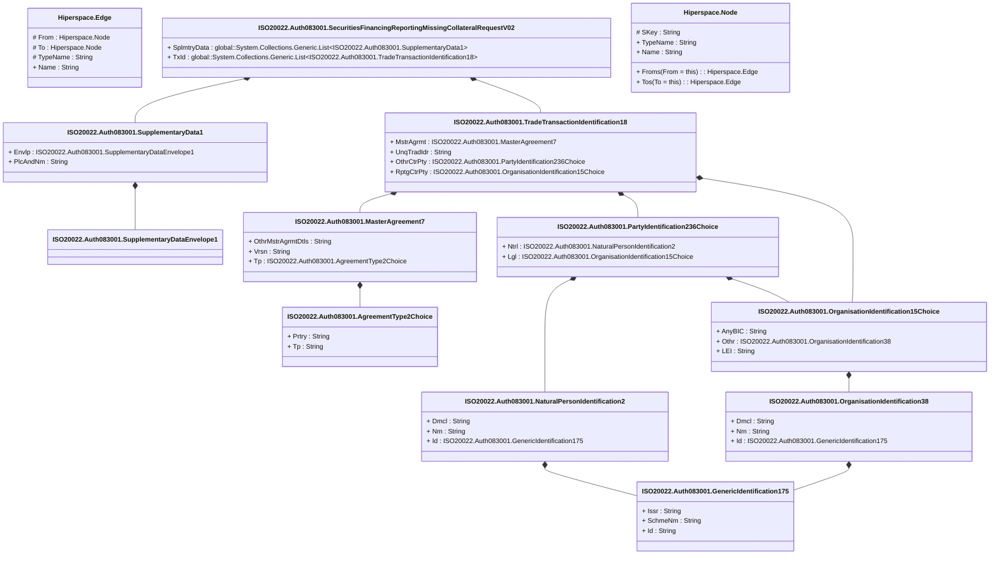

# auth.083.001.02

> The tables below contain descriptions of the members of each Element. 
> The first column indicates the type of the member:
> A ‘#’ indicates that the field is a key to the element, and a ‘+’ indicates that the field is a value.
> The ‘*’ column contains a description for the element member.  
> The ‘@’ column contains any properties for the member.
> The ‘=’ column contains calculated values; or in the case of an enum, the serialized value.

---

## View Hiperspace.Edge
edge between nodes

| |Name|Type|*|@|=|
|-|-|-|-|-|-|
|#|From|Hiperspace.Node||||
|#|To|Hiperspace.Node||||
|#|TypeName|String||||
|+|Name|String||||

---

## Value ISO20022.Auth083001.AgreementType2Choice

| |Name|Type|*|@|=|
|-|-|-|-|-|-|
|+|Prtry|String||XmlElement()||
|+|Tp|String||XmlElement()||
||Validation|Some(String)||XmlIgnore(), JsonIgnore()|validation(validChoice(Prtry,Tp))|

---

## Type ISO20022.Auth083001.Document

| |Name|Type|*|@|=|
|-|-|-|-|-|-|
|+|SctiesFincgRptgMssngCollReq|ISO20022.Auth083001.SecuritiesFinancingReportingMissingCollateralRequestV02||XmlElement()||
||Validation|Some(String)||XmlIgnore(), JsonIgnore()|validation(validElement(SctiesFincgRptgMssngCollReq))|

---

## Value ISO20022.Auth083001.GenericIdentification175

| |Name|Type|*|@|=|
|-|-|-|-|-|-|
|+|Issr|String||XmlElement()||
|+|SchmeNm|String||XmlElement()||
|+|Id|String||XmlElement()||
||Validation|Some(String)||XmlIgnore(), JsonIgnore()|""|

---

## Value ISO20022.Auth083001.MasterAgreement7

| |Name|Type|*|@|=|
|-|-|-|-|-|-|
|+|OthrMstrAgrmtDtls|String||XmlElement()||
|+|Vrsn|String||XmlElement()||
|+|Tp|ISO20022.Auth083001.AgreementType2Choice||XmlElement()||
||Validation|Some(String)||XmlIgnore(), JsonIgnore()|validation(validElement(Tp))|

---

## Value ISO20022.Auth083001.NaturalPersonIdentification2

| |Name|Type|*|@|=|
|-|-|-|-|-|-|
|+|Dmcl|String||XmlElement()||
|+|Nm|String||XmlElement()||
|+|Id|ISO20022.Auth083001.GenericIdentification175||XmlElement()||
||Validation|Some(String)||XmlIgnore(), JsonIgnore()|validation(validElement(Id))|

---

## Value ISO20022.Auth083001.OrganisationIdentification15Choice

| |Name|Type|*|@|=|
|-|-|-|-|-|-|
|+|AnyBIC|String||XmlElement()||
|+|Othr|ISO20022.Auth083001.OrganisationIdentification38||XmlElement()||
|+|LEI|String||XmlElement()||
||Validation|Some(String)||XmlIgnore(), JsonIgnore()|validation(validPattern("""AnyBIC""",AnyBIC,"""[A-Z0-9]{4,4}[A-Z]{2,2}[A-Z0-9]{2,2}([A-Z0-9]{3,3}){0,1}"""),validElement(Othr),validPattern("""LEI""",LEI,"""[A-Z0-9]{18,18}[0-9]{2,2}"""),validChoice(AnyBIC,Othr,LEI))|

---

## Value ISO20022.Auth083001.OrganisationIdentification38

| |Name|Type|*|@|=|
|-|-|-|-|-|-|
|+|Dmcl|String||XmlElement()||
|+|Nm|String||XmlElement()||
|+|Id|ISO20022.Auth083001.GenericIdentification175||XmlElement()||
||Validation|Some(String)||XmlIgnore(), JsonIgnore()|validation(validElement(Id))|

---

## Value ISO20022.Auth083001.PartyIdentification236Choice

| |Name|Type|*|@|=|
|-|-|-|-|-|-|
|+|Ntrl|ISO20022.Auth083001.NaturalPersonIdentification2||XmlElement()||
|+|Lgl|ISO20022.Auth083001.OrganisationIdentification15Choice||XmlElement()||
||Validation|Some(String)||XmlIgnore(), JsonIgnore()|validation(validElement(Ntrl),validElement(Lgl),validChoice(Ntrl,Lgl))|

---

## Aspect ISO20022.Auth083001.SecuritiesFinancingReportingMissingCollateralRequestV02

| |Name|Type|*|@|=|
|-|-|-|-|-|-|
|+|SplmtryData|global::System.Collections.Generic.List<ISO20022.Auth083001.SupplementaryData1>||XmlElement()||
|+|TxId|global::System.Collections.Generic.List<ISO20022.Auth083001.TradeTransactionIdentification18>||XmlElement()||
||Validation|Some(String)||XmlIgnore(), JsonIgnore()|validation(validList("""SplmtryData""",SplmtryData),validElement(SplmtryData),validRequired("""TxId""",TxId),validList("""TxId""",TxId),validElement(TxId))|

---

## Value ISO20022.Auth083001.SupplementaryData1

| |Name|Type|*|@|=|
|-|-|-|-|-|-|
|+|Envlp|ISO20022.Auth083001.SupplementaryDataEnvelope1||XmlElement()||
|+|PlcAndNm|String||XmlElement()||
||Validation|Some(String)||XmlIgnore(), JsonIgnore()|validation(validElement(Envlp))|

---

## Value ISO20022.Auth083001.SupplementaryDataEnvelope1

| |Name|Type|*|@|=|
|-|-|-|-|-|-|
||Validation|Some(String)||XmlIgnore(), JsonIgnore()|""|

---

## Value ISO20022.Auth083001.TradeTransactionIdentification18

| |Name|Type|*|@|=|
|-|-|-|-|-|-|
|+|MstrAgrmt|ISO20022.Auth083001.MasterAgreement7||XmlElement()||
|+|UnqTradIdr|String||XmlElement()||
|+|OthrCtrPty|ISO20022.Auth083001.PartyIdentification236Choice||XmlElement()||
|+|RptgCtrPty|ISO20022.Auth083001.OrganisationIdentification15Choice||XmlElement()||
||Validation|Some(String)||XmlIgnore(), JsonIgnore()|validation(validElement(MstrAgrmt),validElement(OthrCtrPty),validElement(RptgCtrPty))|

---

## View Hiperspace.Node
node in a graph view of data

| |Name|Type|*|@|=|
|-|-|-|-|-|-|
|#|SKey|String||||
|+|TypeName|String||||
|+|Name|String||||
||Froms|Hiperspace.Edge|||From = this|
||Tos|Hiperspace.Edge|||To = this|

