# auth.084.001.02

```mermaid
classDiagram
    class Hiperspace.Edge {
        # From  : Hiperspace.Node
        # To  : Hiperspace.Node
        # TypeName  : String
        + Name  : String
    }
    class ISO20022.Auth084001.AgreementType2Choice {
        + Prtry  : String
        + Tp  : String
    }
    class ISO20022.Auth084001.DetailedReportStatistics5 {
        + NbOfRptsRjctdPerErr  : global::System.Collections.Generic.List~ISO20022.Auth084001.NumberOfTransactionsPerValidationRule5~
        + TtlNbOfRptsRjctd  : String
        + TtlNbOfRptsAccptd  : String
        + TtlNbOfRpts  : String
    }
    ISO20022.Auth084001.DetailedReportStatistics5 *-- ISO20022.Auth084001.NumberOfTransactionsPerValidationRule5
    class ISO20022.Auth084001.DetailedTransactionStatistics13 {
        + TxsRjctnsRsn  : global::System.Collections.Generic.List~ISO20022.Auth084001.RejectionReason53~
        + TtlNbOfTxsRjctd  : String
        + TtlNbOfTxsAccptd  : String
        + TtlNbOfTxs  : String
    }
    ISO20022.Auth084001.DetailedTransactionStatistics13 *-- ISO20022.Auth084001.RejectionReason53
    class ISO20022.Auth084001.DetailedTransactionStatistics2Choice {
        + DtldSttstcs  : ISO20022.Auth084001.DetailedTransactionStatistics13
        + DataSetActn  : String
    }
    ISO20022.Auth084001.DetailedTransactionStatistics2Choice *-- ISO20022.Auth084001.DetailedTransactionStatistics13
    class ISO20022.Auth084001.GenericIdentification175 {
        + Issr  : String
        + SchmeNm  : String
        + Id  : String
    }
    class ISO20022.Auth084001.GenericValidationRuleIdentification1 {
        + Issr  : String
        + SchmeNm  : ISO20022.Auth084001.ValidationRuleSchemeName1Choice
        + Desc  : String
        + Id  : String
    }
    ISO20022.Auth084001.GenericValidationRuleIdentification1 *-- ISO20022.Auth084001.ValidationRuleSchemeName1Choice
    class ISO20022.Auth084001.MasterAgreement7 {
        + OthrMstrAgrmtDtls  : String
        + Vrsn  : String
        + Tp  : ISO20022.Auth084001.AgreementType2Choice
    }
    ISO20022.Auth084001.MasterAgreement7 *-- ISO20022.Auth084001.AgreementType2Choice
    class ISO20022.Auth084001.NaturalPersonIdentification2 {
        + Dmcl  : String
        + Nm  : String
        + Id  : ISO20022.Auth084001.GenericIdentification175
    }
    ISO20022.Auth084001.NaturalPersonIdentification2 *-- ISO20022.Auth084001.GenericIdentification175
    class ISO20022.Auth084001.NumberOfTransactionsPerValidationRule5 {
        + RptSts  : global::System.Collections.Generic.List~ISO20022.Auth084001.RejectionReason45~
        + DtldNb  : String
    }
    ISO20022.Auth084001.NumberOfTransactionsPerValidationRule5 *-- ISO20022.Auth084001.RejectionReason45
    class ISO20022.Auth084001.OrganisationIdentification15Choice {
        + AnyBIC  : String
        + Othr  : ISO20022.Auth084001.OrganisationIdentification38
        + LEI  : String
    }
    ISO20022.Auth084001.OrganisationIdentification15Choice *-- ISO20022.Auth084001.OrganisationIdentification38
    class ISO20022.Auth084001.OrganisationIdentification38 {
        + Dmcl  : String
        + Nm  : String
        + Id  : ISO20022.Auth084001.GenericIdentification175
    }
    ISO20022.Auth084001.OrganisationIdentification38 *-- ISO20022.Auth084001.GenericIdentification175
    class ISO20022.Auth084001.PartyIdentification236Choice {
        + Ntrl  : ISO20022.Auth084001.NaturalPersonIdentification2
        + Lgl  : ISO20022.Auth084001.OrganisationIdentification15Choice
    }
    ISO20022.Auth084001.PartyIdentification236Choice *-- ISO20022.Auth084001.NaturalPersonIdentification2
    ISO20022.Auth084001.PartyIdentification236Choice *-- ISO20022.Auth084001.OrganisationIdentification15Choice
    class ISO20022.Auth084001.RejectionReason45 {
        + DtldVldtnRule  : ISO20022.Auth084001.GenericValidationRuleIdentification1
        + Sts  : String
        + MsgRptId  : String
    }
    ISO20022.Auth084001.RejectionReason45 *-- ISO20022.Auth084001.GenericValidationRuleIdentification1
    class ISO20022.Auth084001.RejectionReason53 {
        + DtldVldtnRule  : global::System.Collections.Generic.List~ISO20022.Auth084001.GenericValidationRuleIdentification1~
        + Sts  : String
        + TxId  : ISO20022.Auth084001.TransactionIdentification3Choice
    }
    ISO20022.Auth084001.RejectionReason53 *-- ISO20022.Auth084001.GenericValidationRuleIdentification1
    ISO20022.Auth084001.RejectionReason53 *-- ISO20022.Auth084001.TransactionIdentification3Choice
    class ISO20022.Auth084001.ReportPeriodActivity1Code {
        NOTX = 1
    }
    class ISO20022.Auth084001.ReportingMessageStatus1Code {
        CRPT = 1
        INCF = 2
        WARN = 3
        RMDR = 4
        RJCT = 5
        RCVD = 6
        PART = 7
        ACTC = 8
        ACPT = 9
    }
    class ISO20022.Auth084001.SecuritiesFinancingReportingTransactionStatusAdviceV02 {
        + SplmtryData  : global::System.Collections.Generic.List~ISO20022.Auth084001.SupplementaryData1~
        + TxRptStsAndRsn  : global::System.Collections.Generic.List~ISO20022.Auth084001.TradeData35Choice~
    }
    ISO20022.Auth084001.SecuritiesFinancingReportingTransactionStatusAdviceV02 *-- ISO20022.Auth084001.SupplementaryData1
    ISO20022.Auth084001.SecuritiesFinancingReportingTransactionStatusAdviceV02 *-- ISO20022.Auth084001.TradeData35Choice
    class ISO20022.Auth084001.SupplementaryData1 {
        + Envlp  : ISO20022.Auth084001.SupplementaryDataEnvelope1
        + PlcAndNm  : String
    }
    ISO20022.Auth084001.SupplementaryData1 *-- ISO20022.Auth084001.SupplementaryDataEnvelope1
    class ISO20022.Auth084001.SupplementaryDataEnvelope1 {
    }
    class ISO20022.Auth084001.TradeData29 {
        + SplmtryData  : global::System.Collections.Generic.List~ISO20022.Auth084001.SupplementaryData1~
        + TxSttstcs  : global::System.Collections.Generic.List~ISO20022.Auth084001.DetailedTransactionStatistics2Choice~
        + RptSttstcs  : global::System.Collections.Generic.List~ISO20022.Auth084001.DetailedReportStatistics5~
    }
    ISO20022.Auth084001.TradeData29 *-- ISO20022.Auth084001.SupplementaryData1
    ISO20022.Auth084001.TradeData29 *-- ISO20022.Auth084001.DetailedTransactionStatistics2Choice
    ISO20022.Auth084001.TradeData29 *-- ISO20022.Auth084001.DetailedReportStatistics5
    class ISO20022.Auth084001.TradeData35Choice {
        + Rpt  : global::System.Collections.Generic.List~ISO20022.Auth084001.TradeData29~
        + DataSetActn  : String
    }
    ISO20022.Auth084001.TradeData35Choice *-- ISO20022.Auth084001.TradeData29
    class ISO20022.Auth084001.TradeTransactionIdentification16 {
        + CollPrtflId  : String
        + NttyRspnsblForRpt  : ISO20022.Auth084001.OrganisationIdentification15Choice
        + OthrCtrPty  : ISO20022.Auth084001.PartyIdentification236Choice
        + RptgCtrPty  : ISO20022.Auth084001.OrganisationIdentification15Choice
        + TechRcrdId  : String
    }
    ISO20022.Auth084001.TradeTransactionIdentification16 *-- ISO20022.Auth084001.OrganisationIdentification15Choice
    ISO20022.Auth084001.TradeTransactionIdentification16 *-- ISO20022.Auth084001.PartyIdentification236Choice
    ISO20022.Auth084001.TradeTransactionIdentification16 *-- ISO20022.Auth084001.OrganisationIdentification15Choice
    class ISO20022.Auth084001.TradeTransactionIdentification17 {
        + NttyRspnsblForRpt  : ISO20022.Auth084001.OrganisationIdentification15Choice
        + RptSubmitgNtty  : ISO20022.Auth084001.OrganisationIdentification15Choice
        + RptgCtrPty  : ISO20022.Auth084001.OrganisationIdentification15Choice
        + TechRcrdId  : String
    }
    ISO20022.Auth084001.TradeTransactionIdentification17 *-- ISO20022.Auth084001.OrganisationIdentification15Choice
    ISO20022.Auth084001.TradeTransactionIdentification17 *-- ISO20022.Auth084001.OrganisationIdentification15Choice
    ISO20022.Auth084001.TradeTransactionIdentification17 *-- ISO20022.Auth084001.OrganisationIdentification15Choice
    class ISO20022.Auth084001.TradeTransactionIdentification20 {
        + TrptyAgt  : ISO20022.Auth084001.OrganisationIdentification15Choice
        + AgtLndr  : ISO20022.Auth084001.OrganisationIdentification15Choice
        + MstrAgrmt  : ISO20022.Auth084001.MasterAgreement7
        + UnqTradIdr  : String
        + NttyRspnsblForRpt  : ISO20022.Auth084001.OrganisationIdentification15Choice
        + OthrCtrPty  : ISO20022.Auth084001.PartyIdentification236Choice
        + RptgCtrPty  : ISO20022.Auth084001.OrganisationIdentification15Choice
        + TechRcrdId  : String
    }
    ISO20022.Auth084001.TradeTransactionIdentification20 *-- ISO20022.Auth084001.OrganisationIdentification15Choice
    ISO20022.Auth084001.TradeTransactionIdentification20 *-- ISO20022.Auth084001.OrganisationIdentification15Choice
    ISO20022.Auth084001.TradeTransactionIdentification20 *-- ISO20022.Auth084001.MasterAgreement7
    ISO20022.Auth084001.TradeTransactionIdentification20 *-- ISO20022.Auth084001.OrganisationIdentification15Choice
    ISO20022.Auth084001.TradeTransactionIdentification20 *-- ISO20022.Auth084001.PartyIdentification236Choice
    ISO20022.Auth084001.TradeTransactionIdentification20 *-- ISO20022.Auth084001.OrganisationIdentification15Choice
    class ISO20022.Auth084001.TransactionIdentification3Choice {
        + CollReuse  : ISO20022.Auth084001.TradeTransactionIdentification17
        + MrgnRptg  : ISO20022.Auth084001.TradeTransactionIdentification16
        + Tx  : ISO20022.Auth084001.TradeTransactionIdentification20
    }
    ISO20022.Auth084001.TransactionIdentification3Choice *-- ISO20022.Auth084001.TradeTransactionIdentification17
    ISO20022.Auth084001.TransactionIdentification3Choice *-- ISO20022.Auth084001.TradeTransactionIdentification16
    ISO20022.Auth084001.TransactionIdentification3Choice *-- ISO20022.Auth084001.TradeTransactionIdentification20
    class ISO20022.Auth084001.ValidationRuleSchemeName1Choice {
        + Prtry  : String
        + Cd  : String
    }
    class Hiperspace.Node {
        # SKey  : String
        + TypeName  : String
        + Name  : String
        + Froms (From = this) : Hiperspace.Edge
        + Tos (To = this) : Hiperspace.Edge
    }
```

> The tables below contain descriptions of the members of each Element. 
> The first column indicates the type of the member:
> A ‘#’ indicates that the field is a key to the element, and a ‘+’ indicates that the field is a value.
> The ‘*’ column contains a description for the element member.  
> The ‘@’ column contains any properties for the member.
> The ‘=’ column contains calculated values; or in the case of an enum, the serialized value.

---

## View Hiperspace.Edge
edge between nodes

| |Name|Type|*|@|=|
|-|-|-|-|-|-|
|#|From|Hiperspace.Node||||
|#|To|Hiperspace.Node||||
|#|TypeName|String||||
|+|Name|String||||

---

## Value ISO20022.Auth084001.AgreementType2Choice

| |Name|Type|*|@|=|
|-|-|-|-|-|-|
|+|Prtry|String||XmlElement()||
|+|Tp|String||XmlElement()||
||Validation|Some(String)||XmlIgnore(), JsonIgnore()|validation(validChoice(Prtry,Tp))|

---

## Value ISO20022.Auth084001.DetailedReportStatistics5

| |Name|Type|*|@|=|
|-|-|-|-|-|-|
|+|NbOfRptsRjctdPerErr|global::System.Collections.Generic.List<ISO20022.Auth084001.NumberOfTransactionsPerValidationRule5>||XmlElement()||
|+|TtlNbOfRptsRjctd|String||XmlElement()||
|+|TtlNbOfRptsAccptd|String||XmlElement()||
|+|TtlNbOfRpts|String||XmlElement()||
||Validation|Some(String)||XmlIgnore(), JsonIgnore()|validation(validList("""NbOfRptsRjctdPerErr""",NbOfRptsRjctdPerErr),validElement(NbOfRptsRjctdPerErr),validPattern("""TtlNbOfRptsRjctd""",TtlNbOfRptsRjctd,"""[0-9]{1,15}"""),validPattern("""TtlNbOfRptsAccptd""",TtlNbOfRptsAccptd,"""[0-9]{1,15}"""),validPattern("""TtlNbOfRpts""",TtlNbOfRpts,"""[0-9]{1,15}"""))|

---

## Value ISO20022.Auth084001.DetailedTransactionStatistics13

| |Name|Type|*|@|=|
|-|-|-|-|-|-|
|+|TxsRjctnsRsn|global::System.Collections.Generic.List<ISO20022.Auth084001.RejectionReason53>||XmlElement()||
|+|TtlNbOfTxsRjctd|String||XmlElement()||
|+|TtlNbOfTxsAccptd|String||XmlElement()||
|+|TtlNbOfTxs|String||XmlElement()||
||Validation|Some(String)||XmlIgnore(), JsonIgnore()|validation(validList("""TxsRjctnsRsn""",TxsRjctnsRsn),validElement(TxsRjctnsRsn),validPattern("""TtlNbOfTxsRjctd""",TtlNbOfTxsRjctd,"""[0-9]{1,15}"""),validPattern("""TtlNbOfTxsAccptd""",TtlNbOfTxsAccptd,"""[0-9]{1,15}"""),validPattern("""TtlNbOfTxs""",TtlNbOfTxs,"""[0-9]{1,15}"""))|

---

## Value ISO20022.Auth084001.DetailedTransactionStatistics2Choice

| |Name|Type|*|@|=|
|-|-|-|-|-|-|
|+|DtldSttstcs|ISO20022.Auth084001.DetailedTransactionStatistics13||XmlElement()||
|+|DataSetActn|String||XmlElement()||
||Validation|Some(String)||XmlIgnore(), JsonIgnore()|validation(validElement(DtldSttstcs),validChoice(DtldSttstcs,DataSetActn))|

---

## Type ISO20022.Auth084001.Document

| |Name|Type|*|@|=|
|-|-|-|-|-|-|
|+|SctiesFincgRptgTxStsAdvc|ISO20022.Auth084001.SecuritiesFinancingReportingTransactionStatusAdviceV02||XmlElement()||
||Validation|Some(String)||XmlIgnore(), JsonIgnore()|validation(validElement(SctiesFincgRptgTxStsAdvc))|

---

## Value ISO20022.Auth084001.GenericIdentification175

| |Name|Type|*|@|=|
|-|-|-|-|-|-|
|+|Issr|String||XmlElement()||
|+|SchmeNm|String||XmlElement()||
|+|Id|String||XmlElement()||
||Validation|Some(String)||XmlIgnore(), JsonIgnore()|""|

---

## Value ISO20022.Auth084001.GenericValidationRuleIdentification1

| |Name|Type|*|@|=|
|-|-|-|-|-|-|
|+|Issr|String||XmlElement()||
|+|SchmeNm|ISO20022.Auth084001.ValidationRuleSchemeName1Choice||XmlElement()||
|+|Desc|String||XmlElement()||
|+|Id|String||XmlElement()||
||Validation|Some(String)||XmlIgnore(), JsonIgnore()|validation(validElement(SchmeNm))|

---

## Value ISO20022.Auth084001.MasterAgreement7

| |Name|Type|*|@|=|
|-|-|-|-|-|-|
|+|OthrMstrAgrmtDtls|String||XmlElement()||
|+|Vrsn|String||XmlElement()||
|+|Tp|ISO20022.Auth084001.AgreementType2Choice||XmlElement()||
||Validation|Some(String)||XmlIgnore(), JsonIgnore()|validation(validElement(Tp))|

---

## Value ISO20022.Auth084001.NaturalPersonIdentification2

| |Name|Type|*|@|=|
|-|-|-|-|-|-|
|+|Dmcl|String||XmlElement()||
|+|Nm|String||XmlElement()||
|+|Id|ISO20022.Auth084001.GenericIdentification175||XmlElement()||
||Validation|Some(String)||XmlIgnore(), JsonIgnore()|validation(validElement(Id))|

---

## Value ISO20022.Auth084001.NumberOfTransactionsPerValidationRule5

| |Name|Type|*|@|=|
|-|-|-|-|-|-|
|+|RptSts|global::System.Collections.Generic.List<ISO20022.Auth084001.RejectionReason45>||XmlElement()||
|+|DtldNb|String||XmlElement()||
||Validation|Some(String)||XmlIgnore(), JsonIgnore()|validation(validRequired("""RptSts""",RptSts),validList("""RptSts""",RptSts),validElement(RptSts),validPattern("""DtldNb""",DtldNb,"""[0-9]{1,15}"""))|

---

## Value ISO20022.Auth084001.OrganisationIdentification15Choice

| |Name|Type|*|@|=|
|-|-|-|-|-|-|
|+|AnyBIC|String||XmlElement()||
|+|Othr|ISO20022.Auth084001.OrganisationIdentification38||XmlElement()||
|+|LEI|String||XmlElement()||
||Validation|Some(String)||XmlIgnore(), JsonIgnore()|validation(validPattern("""AnyBIC""",AnyBIC,"""[A-Z0-9]{4,4}[A-Z]{2,2}[A-Z0-9]{2,2}([A-Z0-9]{3,3}){0,1}"""),validElement(Othr),validPattern("""LEI""",LEI,"""[A-Z0-9]{18,18}[0-9]{2,2}"""),validChoice(AnyBIC,Othr,LEI))|

---

## Value ISO20022.Auth084001.OrganisationIdentification38

| |Name|Type|*|@|=|
|-|-|-|-|-|-|
|+|Dmcl|String||XmlElement()||
|+|Nm|String||XmlElement()||
|+|Id|ISO20022.Auth084001.GenericIdentification175||XmlElement()||
||Validation|Some(String)||XmlIgnore(), JsonIgnore()|validation(validElement(Id))|

---

## Value ISO20022.Auth084001.PartyIdentification236Choice

| |Name|Type|*|@|=|
|-|-|-|-|-|-|
|+|Ntrl|ISO20022.Auth084001.NaturalPersonIdentification2||XmlElement()||
|+|Lgl|ISO20022.Auth084001.OrganisationIdentification15Choice||XmlElement()||
||Validation|Some(String)||XmlIgnore(), JsonIgnore()|validation(validElement(Ntrl),validElement(Lgl),validChoice(Ntrl,Lgl))|

---

## Value ISO20022.Auth084001.RejectionReason45

| |Name|Type|*|@|=|
|-|-|-|-|-|-|
|+|DtldVldtnRule|ISO20022.Auth084001.GenericValidationRuleIdentification1||XmlElement()||
|+|Sts|String||XmlElement()||
|+|MsgRptId|String||XmlElement()||
||Validation|Some(String)||XmlIgnore(), JsonIgnore()|validation(validElement(DtldVldtnRule))|

---

## Value ISO20022.Auth084001.RejectionReason53

| |Name|Type|*|@|=|
|-|-|-|-|-|-|
|+|DtldVldtnRule|global::System.Collections.Generic.List<ISO20022.Auth084001.GenericValidationRuleIdentification1>||XmlElement()||
|+|Sts|String||XmlElement()||
|+|TxId|ISO20022.Auth084001.TransactionIdentification3Choice||XmlElement()||
||Validation|Some(String)||XmlIgnore(), JsonIgnore()|validation(validList("""DtldVldtnRule""",DtldVldtnRule),validElement(DtldVldtnRule),validElement(TxId))|

---

## Enum ISO20022.Auth084001.ReportPeriodActivity1Code

| |Name|Type|*|@|=|
|-|-|-|-|-|-|
||NOTX|Int32||XmlEnum("""NOTX""")|1|

---

## Enum ISO20022.Auth084001.ReportingMessageStatus1Code

| |Name|Type|*|@|=|
|-|-|-|-|-|-|
||CRPT|Int32||XmlEnum("""CRPT""")|1|
||INCF|Int32||XmlEnum("""INCF""")|2|
||WARN|Int32||XmlEnum("""WARN""")|3|
||RMDR|Int32||XmlEnum("""RMDR""")|4|
||RJCT|Int32||XmlEnum("""RJCT""")|5|
||RCVD|Int32||XmlEnum("""RCVD""")|6|
||PART|Int32||XmlEnum("""PART""")|7|
||ACTC|Int32||XmlEnum("""ACTC""")|8|
||ACPT|Int32||XmlEnum("""ACPT""")|9|

---

## Aspect ISO20022.Auth084001.SecuritiesFinancingReportingTransactionStatusAdviceV02

| |Name|Type|*|@|=|
|-|-|-|-|-|-|
|+|SplmtryData|global::System.Collections.Generic.List<ISO20022.Auth084001.SupplementaryData1>||XmlElement()||
|+|TxRptStsAndRsn|global::System.Collections.Generic.List<ISO20022.Auth084001.TradeData35Choice>||XmlElement()||
||Validation|Some(String)||XmlIgnore(), JsonIgnore()|validation(validList("""SplmtryData""",SplmtryData),validElement(SplmtryData),validRequired("""TxRptStsAndRsn""",TxRptStsAndRsn),validList("""TxRptStsAndRsn""",TxRptStsAndRsn),validElement(TxRptStsAndRsn))|

---

## Value ISO20022.Auth084001.SupplementaryData1

| |Name|Type|*|@|=|
|-|-|-|-|-|-|
|+|Envlp|ISO20022.Auth084001.SupplementaryDataEnvelope1||XmlElement()||
|+|PlcAndNm|String||XmlElement()||
||Validation|Some(String)||XmlIgnore(), JsonIgnore()|validation(validElement(Envlp))|

---

## Value ISO20022.Auth084001.SupplementaryDataEnvelope1

| |Name|Type|*|@|=|
|-|-|-|-|-|-|
||Validation|Some(String)||XmlIgnore(), JsonIgnore()|""|

---

## Value ISO20022.Auth084001.TradeData29

| |Name|Type|*|@|=|
|-|-|-|-|-|-|
|+|SplmtryData|global::System.Collections.Generic.List<ISO20022.Auth084001.SupplementaryData1>||XmlElement()||
|+|TxSttstcs|global::System.Collections.Generic.List<ISO20022.Auth084001.DetailedTransactionStatistics2Choice>||XmlElement()||
|+|RptSttstcs|global::System.Collections.Generic.List<ISO20022.Auth084001.DetailedReportStatistics5>||XmlElement()||
||Validation|Some(String)||XmlIgnore(), JsonIgnore()|validation(validList("""SplmtryData""",SplmtryData),validElement(SplmtryData),validRequired("""TxSttstcs""",TxSttstcs),validList("""TxSttstcs""",TxSttstcs),validElement(TxSttstcs),validRequired("""RptSttstcs""",RptSttstcs),validList("""RptSttstcs""",RptSttstcs),validElement(RptSttstcs))|

---

## Value ISO20022.Auth084001.TradeData35Choice

| |Name|Type|*|@|=|
|-|-|-|-|-|-|
|+|Rpt|global::System.Collections.Generic.List<ISO20022.Auth084001.TradeData29>||XmlElement()||
|+|DataSetActn|String||XmlElement()||
||Validation|Some(String)||XmlIgnore(), JsonIgnore()|validation(validRequired("""Rpt""",Rpt),validList("""Rpt""",Rpt),validElement(Rpt),validChoice(Rpt,DataSetActn))|

---

## Value ISO20022.Auth084001.TradeTransactionIdentification16

| |Name|Type|*|@|=|
|-|-|-|-|-|-|
|+|CollPrtflId|String||XmlElement()||
|+|NttyRspnsblForRpt|ISO20022.Auth084001.OrganisationIdentification15Choice||XmlElement()||
|+|OthrCtrPty|ISO20022.Auth084001.PartyIdentification236Choice||XmlElement()||
|+|RptgCtrPty|ISO20022.Auth084001.OrganisationIdentification15Choice||XmlElement()||
|+|TechRcrdId|String||XmlElement()||
||Validation|Some(String)||XmlIgnore(), JsonIgnore()|validation(validElement(NttyRspnsblForRpt),validElement(OthrCtrPty),validElement(RptgCtrPty))|

---

## Value ISO20022.Auth084001.TradeTransactionIdentification17

| |Name|Type|*|@|=|
|-|-|-|-|-|-|
|+|NttyRspnsblForRpt|ISO20022.Auth084001.OrganisationIdentification15Choice||XmlElement()||
|+|RptSubmitgNtty|ISO20022.Auth084001.OrganisationIdentification15Choice||XmlElement()||
|+|RptgCtrPty|ISO20022.Auth084001.OrganisationIdentification15Choice||XmlElement()||
|+|TechRcrdId|String||XmlElement()||
||Validation|Some(String)||XmlIgnore(), JsonIgnore()|validation(validElement(NttyRspnsblForRpt),validElement(RptSubmitgNtty),validElement(RptgCtrPty))|

---

## Value ISO20022.Auth084001.TradeTransactionIdentification20

| |Name|Type|*|@|=|
|-|-|-|-|-|-|
|+|TrptyAgt|ISO20022.Auth084001.OrganisationIdentification15Choice||XmlElement()||
|+|AgtLndr|ISO20022.Auth084001.OrganisationIdentification15Choice||XmlElement()||
|+|MstrAgrmt|ISO20022.Auth084001.MasterAgreement7||XmlElement()||
|+|UnqTradIdr|String||XmlElement()||
|+|NttyRspnsblForRpt|ISO20022.Auth084001.OrganisationIdentification15Choice||XmlElement()||
|+|OthrCtrPty|ISO20022.Auth084001.PartyIdentification236Choice||XmlElement()||
|+|RptgCtrPty|ISO20022.Auth084001.OrganisationIdentification15Choice||XmlElement()||
|+|TechRcrdId|String||XmlElement()||
||Validation|Some(String)||XmlIgnore(), JsonIgnore()|validation(validElement(TrptyAgt),validElement(AgtLndr),validElement(MstrAgrmt),validElement(NttyRspnsblForRpt),validElement(OthrCtrPty),validElement(RptgCtrPty))|

---

## Value ISO20022.Auth084001.TransactionIdentification3Choice

| |Name|Type|*|@|=|
|-|-|-|-|-|-|
|+|CollReuse|ISO20022.Auth084001.TradeTransactionIdentification17||XmlElement()||
|+|MrgnRptg|ISO20022.Auth084001.TradeTransactionIdentification16||XmlElement()||
|+|Tx|ISO20022.Auth084001.TradeTransactionIdentification20||XmlElement()||
||Validation|Some(String)||XmlIgnore(), JsonIgnore()|validation(validElement(CollReuse),validElement(MrgnRptg),validElement(Tx),validChoice(CollReuse,MrgnRptg,Tx))|

---

## Value ISO20022.Auth084001.ValidationRuleSchemeName1Choice

| |Name|Type|*|@|=|
|-|-|-|-|-|-|
|+|Prtry|String||XmlElement()||
|+|Cd|String||XmlElement()||
||Validation|Some(String)||XmlIgnore(), JsonIgnore()|validation(validChoice(Prtry,Cd))|

---

## View Hiperspace.Node
node in a graph view of data

| |Name|Type|*|@|=|
|-|-|-|-|-|-|
|#|SKey|String||||
|+|TypeName|String||||
|+|Name|String||||
||Froms|Hiperspace.Edge|||From = this|
||Tos|Hiperspace.Edge|||To = this|

