# auth.092.001.04

```mermaid
classDiagram
    class Hiperspace.Edge {
        # From  : Hiperspace.Node
        # To  : Hiperspace.Node
        # TypeName  : String
        + Name  : String
    }
    class ISO20022.Auth092001.AgreementType2Choice {
        + Prtry  : String
        + Tp  : String
    }
    class ISO20022.Auth092001.CollateralPortfolioCode5Choice {
        + MrgnPrtflCd  : ISO20022.Auth092001.MarginPortfolio3
        + Prtfl  : ISO20022.Auth092001.PortfolioCode3Choice
    }
    ISO20022.Auth092001.CollateralPortfolioCode5Choice *-- ISO20022.Auth092001.MarginPortfolio3
    ISO20022.Auth092001.CollateralPortfolioCode5Choice *-- ISO20022.Auth092001.PortfolioCode3Choice
    class ISO20022.Auth092001.CounterpartyData92 {
        + NttyRspnsblForRpt  : ISO20022.Auth092001.OrganisationIdentification15Choice
        + RptSubmitgNtty  : ISO20022.Auth092001.OrganisationIdentification15Choice
        + RptgCtrPty  : ISO20022.Auth092001.OrganisationIdentification15Choice
    }
    ISO20022.Auth092001.CounterpartyData92 *-- ISO20022.Auth092001.OrganisationIdentification15Choice
    ISO20022.Auth092001.CounterpartyData92 *-- ISO20022.Auth092001.OrganisationIdentification15Choice
    ISO20022.Auth092001.CounterpartyData92 *-- ISO20022.Auth092001.OrganisationIdentification15Choice
    class ISO20022.Auth092001.DateAndDateTime2Choice {
        + DtTm  : DateTime
        + Dt  : DateTime
    }
    class ISO20022.Auth092001.DerivativeEventType3Code {
        UPDT = 1
        TRAD = 2
        PTNG = 3
        NOVA = 4
        INCP = 5
        EXER = 6
        ETRM = 7
        CREV = 8
        CORP = 9
        COMP = 10
        CLAL = 11
        CLRG = 12
        ALOC = 13
    }
    class ISO20022.Auth092001.DerivativesTradeRejectionStatisticalReportV04 {
        + SplmtryData  : global::System.Collections.Generic.List~ISO20022.Auth092001.SupplementaryData1~
        + RjctnSttstcs  : ISO20022.Auth092001.StatisticsPerCounterparty18Choice
    }
    ISO20022.Auth092001.DerivativesTradeRejectionStatisticalReportV04 *-- ISO20022.Auth092001.SupplementaryData1
    ISO20022.Auth092001.DerivativesTradeRejectionStatisticalReportV04 *-- ISO20022.Auth092001.StatisticsPerCounterparty18Choice
    class ISO20022.Auth092001.DetailedReportStatistics7 {
        + NbOfRptsRjctdPerErr  : global::System.Collections.Generic.List~ISO20022.Auth092001.NumberOfTransactionsPerValidationRule6~
        + TtlNbOfRptsRjctd  : Decimal
        + TtlNbOfRptsAccptd  : Decimal
        + TtlNbOfRpts  : Decimal
    }
    ISO20022.Auth092001.DetailedReportStatistics7 *-- ISO20022.Auth092001.NumberOfTransactionsPerValidationRule6
    class ISO20022.Auth092001.DetailedStatisticsPerCounterparty19 {
        + RjctnSttstcs  : global::System.Collections.Generic.List~ISO20022.Auth092001.RejectionStatistics9~
        + TtlCrrctdRjctns  : Decimal
        + TtlNbOfTxsRjctd  : Decimal
        + TtlNbOfTxsAccptd  : Decimal
        + TtlNbOfTxs  : Decimal
        + TtlNbOfRptsRjctd  : Decimal
        + TtlNbOfRptsAccptd  : Decimal
        + TtlNbOfRpts  : Decimal
        + RefDt  : DateTime
    }
    ISO20022.Auth092001.DetailedStatisticsPerCounterparty19 *-- ISO20022.Auth092001.RejectionStatistics9
    class ISO20022.Auth092001.DetailedTransactionStatistics30 {
        + TxsRjctnsRsn  : global::System.Collections.Generic.List~ISO20022.Auth092001.RejectionReason71~
        + TtlCrrctdRjctns  : Decimal
        + TtlNbOfTxsRjctd  : Decimal
        + TtlNbOfTxsAccptd  : Decimal
        + TtlNbOfTxs  : Decimal
    }
    ISO20022.Auth092001.DetailedTransactionStatistics30 *-- ISO20022.Auth092001.RejectionReason71
    class ISO20022.Auth092001.DetailedTransactionStatistics7Choice {
        + DtldSttstcs  : ISO20022.Auth092001.DetailedTransactionStatistics30
        + DataSetActn  : String
    }
    ISO20022.Auth092001.DetailedTransactionStatistics7Choice *-- ISO20022.Auth092001.DetailedTransactionStatistics30
    class ISO20022.Auth092001.GenericIdentification175 {
        + Issr  : String
        + SchmeNm  : String
        + Id  : String
    }
    class ISO20022.Auth092001.GenericValidationRuleIdentification1 {
        + Issr  : String
        + SchmeNm  : ISO20022.Auth092001.ValidationRuleSchemeName1Choice
        + Desc  : String
        + Id  : String
    }
    ISO20022.Auth092001.GenericValidationRuleIdentification1 *-- ISO20022.Auth092001.ValidationRuleSchemeName1Choice
    class ISO20022.Auth092001.LegalPersonIdentification1 {
        + Ctry  : String
        + Id  : ISO20022.Auth092001.OrganisationIdentification15Choice
    }
    ISO20022.Auth092001.LegalPersonIdentification1 *-- ISO20022.Auth092001.OrganisationIdentification15Choice
    class ISO20022.Auth092001.MarginPortfolio3 {
        + VartnMrgnPrtflCd  : ISO20022.Auth092001.PortfolioCode5Choice
        + InitlMrgnPrtflCd  : ISO20022.Auth092001.PortfolioCode5Choice
    }
    ISO20022.Auth092001.MarginPortfolio3 *-- ISO20022.Auth092001.PortfolioCode5Choice
    ISO20022.Auth092001.MarginPortfolio3 *-- ISO20022.Auth092001.PortfolioCode5Choice
    class ISO20022.Auth092001.MasterAgreement8 {
        + OthrMstrAgrmtDtls  : String
        + Vrsn  : String
        + Tp  : ISO20022.Auth092001.AgreementType2Choice
    }
    ISO20022.Auth092001.MasterAgreement8 *-- ISO20022.Auth092001.AgreementType2Choice
    class ISO20022.Auth092001.NaturalPersonIdentification2 {
        + Dmcl  : String
        + Nm  : String
        + Id  : ISO20022.Auth092001.GenericIdentification175
    }
    ISO20022.Auth092001.NaturalPersonIdentification2 *-- ISO20022.Auth092001.GenericIdentification175
    class ISO20022.Auth092001.NaturalPersonIdentification3 {
        + Ctry  : String
        + Id  : ISO20022.Auth092001.NaturalPersonIdentification2
    }
    ISO20022.Auth092001.NaturalPersonIdentification3 *-- ISO20022.Auth092001.NaturalPersonIdentification2
    class ISO20022.Auth092001.NotApplicable1Code {
        NOAP = 1
    }
    class ISO20022.Auth092001.NumberOfTransactionsPerValidationRule6 {
        + RptSts  : global::System.Collections.Generic.List~ISO20022.Auth092001.RejectionReason70~
        + DtldNb  : String
    }
    ISO20022.Auth092001.NumberOfTransactionsPerValidationRule6 *-- ISO20022.Auth092001.RejectionReason70
    class ISO20022.Auth092001.OrganisationIdentification15Choice {
        + AnyBIC  : String
        + Othr  : ISO20022.Auth092001.OrganisationIdentification38
        + LEI  : String
    }
    ISO20022.Auth092001.OrganisationIdentification15Choice *-- ISO20022.Auth092001.OrganisationIdentification38
    class ISO20022.Auth092001.OrganisationIdentification38 {
        + Dmcl  : String
        + Nm  : String
        + Id  : ISO20022.Auth092001.GenericIdentification175
    }
    ISO20022.Auth092001.OrganisationIdentification38 *-- ISO20022.Auth092001.GenericIdentification175
    class ISO20022.Auth092001.PartyIdentification248Choice {
        + Ntrl  : ISO20022.Auth092001.NaturalPersonIdentification3
        + Lgl  : ISO20022.Auth092001.LegalPersonIdentification1
    }
    ISO20022.Auth092001.PartyIdentification248Choice *-- ISO20022.Auth092001.NaturalPersonIdentification3
    ISO20022.Auth092001.PartyIdentification248Choice *-- ISO20022.Auth092001.LegalPersonIdentification1
    class ISO20022.Auth092001.PortfolioCode3Choice {
        + NoPrtfl  : String
        + Cd  : String
    }
    class ISO20022.Auth092001.PortfolioCode5Choice {
        + NoPrtfl  : String
        + Prtfl  : ISO20022.Auth092001.PortfolioIdentification3
    }
    ISO20022.Auth092001.PortfolioCode5Choice *-- ISO20022.Auth092001.PortfolioIdentification3
    class ISO20022.Auth092001.PortfolioIdentification3 {
        + PrtflTxXmptn  : String
        + Cd  : String
    }
    class ISO20022.Auth092001.RejectionReason70 {
        + DtldVldtnRule  : ISO20022.Auth092001.GenericValidationRuleIdentification1
        + Sts  : String
        + MsgRptId  : String
    }
    ISO20022.Auth092001.RejectionReason70 *-- ISO20022.Auth092001.GenericValidationRuleIdentification1
    class ISO20022.Auth092001.RejectionReason71 {
        + DtldVldtnRule  : global::System.Collections.Generic.List~ISO20022.Auth092001.GenericValidationRuleIdentification1~
        + Sts  : String
        + TxId  : ISO20022.Auth092001.TradeTransactionIdentification24
    }
    ISO20022.Auth092001.RejectionReason71 *-- ISO20022.Auth092001.GenericValidationRuleIdentification1
    ISO20022.Auth092001.RejectionReason71 *-- ISO20022.Auth092001.TradeTransactionIdentification24
    class ISO20022.Auth092001.RejectionStatistics9 {
        + DerivSttstcs  : ISO20022.Auth092001.DetailedTransactionStatistics7Choice
        + RptSttstcs  : ISO20022.Auth092001.DetailedReportStatistics7
        + CtrPtyId  : ISO20022.Auth092001.CounterpartyData92
    }
    ISO20022.Auth092001.RejectionStatistics9 *-- ISO20022.Auth092001.DetailedTransactionStatistics7Choice
    ISO20022.Auth092001.RejectionStatistics9 *-- ISO20022.Auth092001.DetailedReportStatistics7
    ISO20022.Auth092001.RejectionStatistics9 *-- ISO20022.Auth092001.CounterpartyData92
    class ISO20022.Auth092001.ReportPeriodActivity1Code {
        NOTX = 1
    }
    class ISO20022.Auth092001.ReportingMessageStatus2Code {
        NAUT = 1
        CRPT = 2
        INCF = 3
        RJCT = 4
        ACPT = 5
    }
    class ISO20022.Auth092001.StatisticsPerCounterparty18Choice {
        + Rpt  : ISO20022.Auth092001.DetailedStatisticsPerCounterparty19
        + DataSetActn  : String
    }
    ISO20022.Auth092001.StatisticsPerCounterparty18Choice *-- ISO20022.Auth092001.DetailedStatisticsPerCounterparty19
    class ISO20022.Auth092001.SupplementaryData1 {
        + Envlp  : ISO20022.Auth092001.SupplementaryDataEnvelope1
        + PlcAndNm  : String
    }
    ISO20022.Auth092001.SupplementaryData1 *-- ISO20022.Auth092001.SupplementaryDataEnvelope1
    class ISO20022.Auth092001.SupplementaryDataEnvelope1 {
    }
    class ISO20022.Auth092001.TradeTransactionIdentification24 {
        + CollPrtflCd  : ISO20022.Auth092001.CollateralPortfolioCode5Choice
        + MstrAgrmt  : ISO20022.Auth092001.MasterAgreement8
        + UnqIdr  : ISO20022.Auth092001.UniqueTransactionIdentifier2Choice
        + OthrCtrPty  : ISO20022.Auth092001.PartyIdentification248Choice
        + DerivEvtTmStmp  : ISO20022.Auth092001.DateAndDateTime2Choice
        + DerivEvtTp  : String
        + RptgTmStmp  : DateTime
        + ActnTp  : String
        + TechRcrdId  : String
    }
    ISO20022.Auth092001.TradeTransactionIdentification24 *-- ISO20022.Auth092001.CollateralPortfolioCode5Choice
    ISO20022.Auth092001.TradeTransactionIdentification24 *-- ISO20022.Auth092001.MasterAgreement8
    ISO20022.Auth092001.TradeTransactionIdentification24 *-- ISO20022.Auth092001.UniqueTransactionIdentifier2Choice
    ISO20022.Auth092001.TradeTransactionIdentification24 *-- ISO20022.Auth092001.PartyIdentification248Choice
    ISO20022.Auth092001.TradeTransactionIdentification24 *-- ISO20022.Auth092001.DateAndDateTime2Choice
    class ISO20022.Auth092001.TransactionOperationType10Code {
        PRTO = 1
        MARU = 2
        VALU = 3
        TERM = 4
        REVI = 5
        POSC = 6
        OTHR = 7
        NEWT = 8
        MODI = 9
        EROR = 10
        CORR = 11
        COMP = 12
    }
    class ISO20022.Auth092001.UniqueTransactionIdentifier2Choice {
        + Prtry  : ISO20022.Auth092001.GenericIdentification175
        + UnqTxIdr  : String
    }
    ISO20022.Auth092001.UniqueTransactionIdentifier2Choice *-- ISO20022.Auth092001.GenericIdentification175
    class ISO20022.Auth092001.ValidationRuleSchemeName1Choice {
        + Prtry  : String
        + Cd  : String
    }
    class Hiperspace.Node {
        # SKey  : String
        + TypeName  : String
        + Name  : String
        + Froms (From = this) : Hiperspace.Edge
        + Tos (To = this) : Hiperspace.Edge
    }
```

> The tables below contain descriptions of the members of each Element. 
> The first column indicates the type of the member:
> A ‘#’ indicates that the field is a key to the element, and a ‘+’ indicates that the field is a value.
> The ‘*’ column contains a description for the element member.  
> The ‘@’ column contains any properties for the member.
> The ‘=’ column contains calculated values; or in the case of an enum, the serialized value.

---

## View Hiperspace.Edge
edge between nodes

| |Name|Type|*|@|=|
|-|-|-|-|-|-|
|#|From|Hiperspace.Node||||
|#|To|Hiperspace.Node||||
|#|TypeName|String||||
|+|Name|String||||

---

## Value ISO20022.Auth092001.AgreementType2Choice

| |Name|Type|*|@|=|
|-|-|-|-|-|-|
|+|Prtry|String||XmlElement()||
|+|Tp|String||XmlElement()||
||Validation|Some(String)||XmlIgnore(), JsonIgnore()|validation(validChoice(Prtry,Tp))|

---

## Value ISO20022.Auth092001.CollateralPortfolioCode5Choice

| |Name|Type|*|@|=|
|-|-|-|-|-|-|
|+|MrgnPrtflCd|ISO20022.Auth092001.MarginPortfolio3||XmlElement()||
|+|Prtfl|ISO20022.Auth092001.PortfolioCode3Choice||XmlElement()||
||Validation|Some(String)||XmlIgnore(), JsonIgnore()|validation(validElement(MrgnPrtflCd),validElement(Prtfl),validChoice(MrgnPrtflCd,Prtfl))|

---

## Value ISO20022.Auth092001.CounterpartyData92

| |Name|Type|*|@|=|
|-|-|-|-|-|-|
|+|NttyRspnsblForRpt|ISO20022.Auth092001.OrganisationIdentification15Choice||XmlElement()||
|+|RptSubmitgNtty|ISO20022.Auth092001.OrganisationIdentification15Choice||XmlElement()||
|+|RptgCtrPty|ISO20022.Auth092001.OrganisationIdentification15Choice||XmlElement()||
||Validation|Some(String)||XmlIgnore(), JsonIgnore()|validation(validElement(NttyRspnsblForRpt),validElement(RptSubmitgNtty),validElement(RptgCtrPty))|

---

## Value ISO20022.Auth092001.DateAndDateTime2Choice

| |Name|Type|*|@|=|
|-|-|-|-|-|-|
|+|DtTm|DateTime||XmlElement()||
|+|Dt|DateTime||XmlElement()||
||Validation|Some(String)||XmlIgnore(), JsonIgnore()|validation(validChoice(DtTm,Dt))|

---

## Enum ISO20022.Auth092001.DerivativeEventType3Code

| |Name|Type|*|@|=|
|-|-|-|-|-|-|
||UPDT|Int32||XmlEnum("""UPDT""")|1|
||TRAD|Int32||XmlEnum("""TRAD""")|2|
||PTNG|Int32||XmlEnum("""PTNG""")|3|
||NOVA|Int32||XmlEnum("""NOVA""")|4|
||INCP|Int32||XmlEnum("""INCP""")|5|
||EXER|Int32||XmlEnum("""EXER""")|6|
||ETRM|Int32||XmlEnum("""ETRM""")|7|
||CREV|Int32||XmlEnum("""CREV""")|8|
||CORP|Int32||XmlEnum("""CORP""")|9|
||COMP|Int32||XmlEnum("""COMP""")|10|
||CLAL|Int32||XmlEnum("""CLAL""")|11|
||CLRG|Int32||XmlEnum("""CLRG""")|12|
||ALOC|Int32||XmlEnum("""ALOC""")|13|

---

## Aspect ISO20022.Auth092001.DerivativesTradeRejectionStatisticalReportV04

| |Name|Type|*|@|=|
|-|-|-|-|-|-|
|+|SplmtryData|global::System.Collections.Generic.List<ISO20022.Auth092001.SupplementaryData1>||XmlElement()||
|+|RjctnSttstcs|ISO20022.Auth092001.StatisticsPerCounterparty18Choice||XmlElement()||
||Validation|Some(String)||XmlIgnore(), JsonIgnore()|validation(validList("""SplmtryData""",SplmtryData),validElement(SplmtryData),validElement(RjctnSttstcs))|

---

## Value ISO20022.Auth092001.DetailedReportStatistics7

| |Name|Type|*|@|=|
|-|-|-|-|-|-|
|+|NbOfRptsRjctdPerErr|global::System.Collections.Generic.List<ISO20022.Auth092001.NumberOfTransactionsPerValidationRule6>||XmlElement()||
|+|TtlNbOfRptsRjctd|Decimal||XmlElement()||
|+|TtlNbOfRptsAccptd|Decimal||XmlElement()||
|+|TtlNbOfRpts|Decimal||XmlElement()||
||Validation|Some(String)||XmlIgnore(), JsonIgnore()|validation(validList("""NbOfRptsRjctdPerErr""",NbOfRptsRjctdPerErr),validElement(NbOfRptsRjctdPerErr))|

---

## Value ISO20022.Auth092001.DetailedStatisticsPerCounterparty19

| |Name|Type|*|@|=|
|-|-|-|-|-|-|
|+|RjctnSttstcs|global::System.Collections.Generic.List<ISO20022.Auth092001.RejectionStatistics9>||XmlElement()||
|+|TtlCrrctdRjctns|Decimal||XmlElement()||
|+|TtlNbOfTxsRjctd|Decimal||XmlElement()||
|+|TtlNbOfTxsAccptd|Decimal||XmlElement()||
|+|TtlNbOfTxs|Decimal||XmlElement()||
|+|TtlNbOfRptsRjctd|Decimal||XmlElement()||
|+|TtlNbOfRptsAccptd|Decimal||XmlElement()||
|+|TtlNbOfRpts|Decimal||XmlElement()||
|+|RefDt|DateTime||XmlElement()||
||Validation|Some(String)||XmlIgnore(), JsonIgnore()|validation(validRequired("""RjctnSttstcs""",RjctnSttstcs),validList("""RjctnSttstcs""",RjctnSttstcs),validElement(RjctnSttstcs))|

---

## Value ISO20022.Auth092001.DetailedTransactionStatistics30

| |Name|Type|*|@|=|
|-|-|-|-|-|-|
|+|TxsRjctnsRsn|global::System.Collections.Generic.List<ISO20022.Auth092001.RejectionReason71>||XmlElement()||
|+|TtlCrrctdRjctns|Decimal||XmlElement()||
|+|TtlNbOfTxsRjctd|Decimal||XmlElement()||
|+|TtlNbOfTxsAccptd|Decimal||XmlElement()||
|+|TtlNbOfTxs|Decimal||XmlElement()||
||Validation|Some(String)||XmlIgnore(), JsonIgnore()|validation(validList("""TxsRjctnsRsn""",TxsRjctnsRsn),validElement(TxsRjctnsRsn))|

---

## Value ISO20022.Auth092001.DetailedTransactionStatistics7Choice

| |Name|Type|*|@|=|
|-|-|-|-|-|-|
|+|DtldSttstcs|ISO20022.Auth092001.DetailedTransactionStatistics30||XmlElement()||
|+|DataSetActn|String||XmlElement()||
||Validation|Some(String)||XmlIgnore(), JsonIgnore()|validation(validElement(DtldSttstcs),validChoice(DtldSttstcs,DataSetActn))|

---

## Type ISO20022.Auth092001.Document

| |Name|Type|*|@|=|
|-|-|-|-|-|-|
|+|DerivsTradRjctnSttstclRpt|ISO20022.Auth092001.DerivativesTradeRejectionStatisticalReportV04||XmlElement()||
||Validation|Some(String)||XmlIgnore(), JsonIgnore()|validation(validElement(DerivsTradRjctnSttstclRpt))|

---

## Value ISO20022.Auth092001.GenericIdentification175

| |Name|Type|*|@|=|
|-|-|-|-|-|-|
|+|Issr|String||XmlElement()||
|+|SchmeNm|String||XmlElement()||
|+|Id|String||XmlElement()||
||Validation|Some(String)||XmlIgnore(), JsonIgnore()|""|

---

## Value ISO20022.Auth092001.GenericValidationRuleIdentification1

| |Name|Type|*|@|=|
|-|-|-|-|-|-|
|+|Issr|String||XmlElement()||
|+|SchmeNm|ISO20022.Auth092001.ValidationRuleSchemeName1Choice||XmlElement()||
|+|Desc|String||XmlElement()||
|+|Id|String||XmlElement()||
||Validation|Some(String)||XmlIgnore(), JsonIgnore()|validation(validElement(SchmeNm))|

---

## Value ISO20022.Auth092001.LegalPersonIdentification1

| |Name|Type|*|@|=|
|-|-|-|-|-|-|
|+|Ctry|String||XmlElement()||
|+|Id|ISO20022.Auth092001.OrganisationIdentification15Choice||XmlElement()||
||Validation|Some(String)||XmlIgnore(), JsonIgnore()|validation(validPattern("""Ctry""",Ctry,"""[A-Z]{2,2}"""),validElement(Id))|

---

## Value ISO20022.Auth092001.MarginPortfolio3

| |Name|Type|*|@|=|
|-|-|-|-|-|-|
|+|VartnMrgnPrtflCd|ISO20022.Auth092001.PortfolioCode5Choice||XmlElement()||
|+|InitlMrgnPrtflCd|ISO20022.Auth092001.PortfolioCode5Choice||XmlElement()||
||Validation|Some(String)||XmlIgnore(), JsonIgnore()|validation(validElement(VartnMrgnPrtflCd),validElement(InitlMrgnPrtflCd))|

---

## Value ISO20022.Auth092001.MasterAgreement8

| |Name|Type|*|@|=|
|-|-|-|-|-|-|
|+|OthrMstrAgrmtDtls|String||XmlElement()||
|+|Vrsn|String||XmlElement()||
|+|Tp|ISO20022.Auth092001.AgreementType2Choice||XmlElement()||
||Validation|Some(String)||XmlIgnore(), JsonIgnore()|validation(validElement(Tp))|

---

## Value ISO20022.Auth092001.NaturalPersonIdentification2

| |Name|Type|*|@|=|
|-|-|-|-|-|-|
|+|Dmcl|String||XmlElement()||
|+|Nm|String||XmlElement()||
|+|Id|ISO20022.Auth092001.GenericIdentification175||XmlElement()||
||Validation|Some(String)||XmlIgnore(), JsonIgnore()|validation(validElement(Id))|

---

## Value ISO20022.Auth092001.NaturalPersonIdentification3

| |Name|Type|*|@|=|
|-|-|-|-|-|-|
|+|Ctry|String||XmlElement()||
|+|Id|ISO20022.Auth092001.NaturalPersonIdentification2||XmlElement()||
||Validation|Some(String)||XmlIgnore(), JsonIgnore()|validation(validPattern("""Ctry""",Ctry,"""[A-Z]{2,2}"""),validElement(Id))|

---

## Enum ISO20022.Auth092001.NotApplicable1Code

| |Name|Type|*|@|=|
|-|-|-|-|-|-|
||NOAP|Int32||XmlEnum("""NOAP""")|1|

---

## Value ISO20022.Auth092001.NumberOfTransactionsPerValidationRule6

| |Name|Type|*|@|=|
|-|-|-|-|-|-|
|+|RptSts|global::System.Collections.Generic.List<ISO20022.Auth092001.RejectionReason70>||XmlElement()||
|+|DtldNb|String||XmlElement()||
||Validation|Some(String)||XmlIgnore(), JsonIgnore()|validation(validRequired("""RptSts""",RptSts),validList("""RptSts""",RptSts),validElement(RptSts),validPattern("""DtldNb""",DtldNb,"""[0-9]{1,15}"""))|

---

## Value ISO20022.Auth092001.OrganisationIdentification15Choice

| |Name|Type|*|@|=|
|-|-|-|-|-|-|
|+|AnyBIC|String||XmlElement()||
|+|Othr|ISO20022.Auth092001.OrganisationIdentification38||XmlElement()||
|+|LEI|String||XmlElement()||
||Validation|Some(String)||XmlIgnore(), JsonIgnore()|validation(validPattern("""AnyBIC""",AnyBIC,"""[A-Z0-9]{4,4}[A-Z]{2,2}[A-Z0-9]{2,2}([A-Z0-9]{3,3}){0,1}"""),validElement(Othr),validPattern("""LEI""",LEI,"""[A-Z0-9]{18,18}[0-9]{2,2}"""),validChoice(AnyBIC,Othr,LEI))|

---

## Value ISO20022.Auth092001.OrganisationIdentification38

| |Name|Type|*|@|=|
|-|-|-|-|-|-|
|+|Dmcl|String||XmlElement()||
|+|Nm|String||XmlElement()||
|+|Id|ISO20022.Auth092001.GenericIdentification175||XmlElement()||
||Validation|Some(String)||XmlIgnore(), JsonIgnore()|validation(validElement(Id))|

---

## Value ISO20022.Auth092001.PartyIdentification248Choice

| |Name|Type|*|@|=|
|-|-|-|-|-|-|
|+|Ntrl|ISO20022.Auth092001.NaturalPersonIdentification3||XmlElement()||
|+|Lgl|ISO20022.Auth092001.LegalPersonIdentification1||XmlElement()||
||Validation|Some(String)||XmlIgnore(), JsonIgnore()|validation(validElement(Ntrl),validElement(Lgl),validChoice(Ntrl,Lgl))|

---

## Value ISO20022.Auth092001.PortfolioCode3Choice

| |Name|Type|*|@|=|
|-|-|-|-|-|-|
|+|NoPrtfl|String||XmlElement()||
|+|Cd|String||XmlElement()||
||Validation|Some(String)||XmlIgnore(), JsonIgnore()|validation(validChoice(NoPrtfl,Cd))|

---

## Value ISO20022.Auth092001.PortfolioCode5Choice

| |Name|Type|*|@|=|
|-|-|-|-|-|-|
|+|NoPrtfl|String||XmlElement()||
|+|Prtfl|ISO20022.Auth092001.PortfolioIdentification3||XmlElement()||
||Validation|Some(String)||XmlIgnore(), JsonIgnore()|validation(validElement(Prtfl),validChoice(NoPrtfl,Prtfl))|

---

## Value ISO20022.Auth092001.PortfolioIdentification3

| |Name|Type|*|@|=|
|-|-|-|-|-|-|
|+|PrtflTxXmptn|String||XmlElement()||
|+|Cd|String||XmlElement()||
||Validation|Some(String)||XmlIgnore(), JsonIgnore()|""|

---

## Value ISO20022.Auth092001.RejectionReason70

| |Name|Type|*|@|=|
|-|-|-|-|-|-|
|+|DtldVldtnRule|ISO20022.Auth092001.GenericValidationRuleIdentification1||XmlElement()||
|+|Sts|String||XmlElement()||
|+|MsgRptId|String||XmlElement()||
||Validation|Some(String)||XmlIgnore(), JsonIgnore()|validation(validElement(DtldVldtnRule))|

---

## Value ISO20022.Auth092001.RejectionReason71

| |Name|Type|*|@|=|
|-|-|-|-|-|-|
|+|DtldVldtnRule|global::System.Collections.Generic.List<ISO20022.Auth092001.GenericValidationRuleIdentification1>||XmlElement()||
|+|Sts|String||XmlElement()||
|+|TxId|ISO20022.Auth092001.TradeTransactionIdentification24||XmlElement()||
||Validation|Some(String)||XmlIgnore(), JsonIgnore()|validation(validList("""DtldVldtnRule""",DtldVldtnRule),validElement(DtldVldtnRule),validElement(TxId))|

---

## Value ISO20022.Auth092001.RejectionStatistics9

| |Name|Type|*|@|=|
|-|-|-|-|-|-|
|+|DerivSttstcs|ISO20022.Auth092001.DetailedTransactionStatistics7Choice||XmlElement()||
|+|RptSttstcs|ISO20022.Auth092001.DetailedReportStatistics7||XmlElement()||
|+|CtrPtyId|ISO20022.Auth092001.CounterpartyData92||XmlElement()||
||Validation|Some(String)||XmlIgnore(), JsonIgnore()|validation(validElement(DerivSttstcs),validElement(RptSttstcs),validElement(CtrPtyId))|

---

## Enum ISO20022.Auth092001.ReportPeriodActivity1Code

| |Name|Type|*|@|=|
|-|-|-|-|-|-|
||NOTX|Int32||XmlEnum("""NOTX""")|1|

---

## Enum ISO20022.Auth092001.ReportingMessageStatus2Code

| |Name|Type|*|@|=|
|-|-|-|-|-|-|
||NAUT|Int32||XmlEnum("""NAUT""")|1|
||CRPT|Int32||XmlEnum("""CRPT""")|2|
||INCF|Int32||XmlEnum("""INCF""")|3|
||RJCT|Int32||XmlEnum("""RJCT""")|4|
||ACPT|Int32||XmlEnum("""ACPT""")|5|

---

## Value ISO20022.Auth092001.StatisticsPerCounterparty18Choice

| |Name|Type|*|@|=|
|-|-|-|-|-|-|
|+|Rpt|ISO20022.Auth092001.DetailedStatisticsPerCounterparty19||XmlElement()||
|+|DataSetActn|String||XmlElement()||
||Validation|Some(String)||XmlIgnore(), JsonIgnore()|validation(validElement(Rpt),validChoice(Rpt,DataSetActn))|

---

## Value ISO20022.Auth092001.SupplementaryData1

| |Name|Type|*|@|=|
|-|-|-|-|-|-|
|+|Envlp|ISO20022.Auth092001.SupplementaryDataEnvelope1||XmlElement()||
|+|PlcAndNm|String||XmlElement()||
||Validation|Some(String)||XmlIgnore(), JsonIgnore()|validation(validElement(Envlp))|

---

## Value ISO20022.Auth092001.SupplementaryDataEnvelope1

| |Name|Type|*|@|=|
|-|-|-|-|-|-|
||Validation|Some(String)||XmlIgnore(), JsonIgnore()|""|

---

## Value ISO20022.Auth092001.TradeTransactionIdentification24

| |Name|Type|*|@|=|
|-|-|-|-|-|-|
|+|CollPrtflCd|ISO20022.Auth092001.CollateralPortfolioCode5Choice||XmlElement()||
|+|MstrAgrmt|ISO20022.Auth092001.MasterAgreement8||XmlElement()||
|+|UnqIdr|ISO20022.Auth092001.UniqueTransactionIdentifier2Choice||XmlElement()||
|+|OthrCtrPty|ISO20022.Auth092001.PartyIdentification248Choice||XmlElement()||
|+|DerivEvtTmStmp|ISO20022.Auth092001.DateAndDateTime2Choice||XmlElement()||
|+|DerivEvtTp|String||XmlElement()||
|+|RptgTmStmp|DateTime||XmlElement()||
|+|ActnTp|String||XmlElement()||
|+|TechRcrdId|String||XmlElement()||
||Validation|Some(String)||XmlIgnore(), JsonIgnore()|validation(validElement(CollPrtflCd),validElement(MstrAgrmt),validElement(UnqIdr),validElement(OthrCtrPty),validElement(DerivEvtTmStmp))|

---

## Enum ISO20022.Auth092001.TransactionOperationType10Code

| |Name|Type|*|@|=|
|-|-|-|-|-|-|
||PRTO|Int32||XmlEnum("""PRTO""")|1|
||MARU|Int32||XmlEnum("""MARU""")|2|
||VALU|Int32||XmlEnum("""VALU""")|3|
||TERM|Int32||XmlEnum("""TERM""")|4|
||REVI|Int32||XmlEnum("""REVI""")|5|
||POSC|Int32||XmlEnum("""POSC""")|6|
||OTHR|Int32||XmlEnum("""OTHR""")|7|
||NEWT|Int32||XmlEnum("""NEWT""")|8|
||MODI|Int32||XmlEnum("""MODI""")|9|
||EROR|Int32||XmlEnum("""EROR""")|10|
||CORR|Int32||XmlEnum("""CORR""")|11|
||COMP|Int32||XmlEnum("""COMP""")|12|

---

## Value ISO20022.Auth092001.UniqueTransactionIdentifier2Choice

| |Name|Type|*|@|=|
|-|-|-|-|-|-|
|+|Prtry|ISO20022.Auth092001.GenericIdentification175||XmlElement()||
|+|UnqTxIdr|String||XmlElement()||
||Validation|Some(String)||XmlIgnore(), JsonIgnore()|validation(validElement(Prtry),validPattern("""UnqTxIdr""",UnqTxIdr,"""[A-Z0-9]{18}[0-9]{2}[A-Z0-9]{0,32}"""),validChoice(Prtry,UnqTxIdr))|

---

## Value ISO20022.Auth092001.ValidationRuleSchemeName1Choice

| |Name|Type|*|@|=|
|-|-|-|-|-|-|
|+|Prtry|String||XmlElement()||
|+|Cd|String||XmlElement()||
||Validation|Some(String)||XmlIgnore(), JsonIgnore()|validation(validChoice(Prtry,Cd))|

---

## View Hiperspace.Node
node in a graph view of data

| |Name|Type|*|@|=|
|-|-|-|-|-|-|
|#|SKey|String||||
|+|TypeName|String||||
|+|Name|String||||
||Froms|Hiperspace.Edge|||From = this|
||Tos|Hiperspace.Edge|||To = this|

