# auth.094.001.02

```mermaid
classDiagram
    class Hiperspace.Edge {
        # From  : Hiperspace.Node
        # To  : Hiperspace.Node
        # TypeName  : String
        + Name  : String
    }
    class ISO20022.Auth094001.AddressType2Code {
        DLVY = 1
        MLTO = 2
        BIZZ = 3
        HOME = 4
        PBOX = 5
        ADDR = 6
    }
    class ISO20022.Auth094001.AnyMIC1Code {
        ANYM = 1
    }
    class ISO20022.Auth094001.CollateralType6Code {
        STCF = 1
        SECU = 2
        PHYS = 3
        OTHR = 4
        LCRE = 5
        INSU = 6
        COMM = 7
        CASH = 8
        BOND = 9
        GBBK = 10
    }
    class ISO20022.Auth094001.CorporateSectorCriteria5 {
        + NotRptd  : String
        + NFISctr  : global::System.Collections.Generic.List~String~
        + FISctr  : global::System.Collections.Generic.List~String~
    }
    class ISO20022.Auth094001.DateOrBlankQuery2Choice {
        + NotRptd  : String
        + Rg  : ISO20022.Auth094001.DatePeriod1
    }
    ISO20022.Auth094001.DateOrBlankQuery2Choice *-- ISO20022.Auth094001.DatePeriod1
    class ISO20022.Auth094001.DatePeriod1 {
        + ToDt  : DateTime
        + FrDt  : DateTime
    }
    class ISO20022.Auth094001.DateTimePeriod1 {
        + ToDtTm  : DateTime
        + FrDtTm  : DateTime
    }
    class ISO20022.Auth094001.ExposureType10Code {
        REPO = 1
        SLEB = 2
        MGLD = 3
        SBSC = 4
    }
    class ISO20022.Auth094001.FinancialPartySectorType2Code {
        UCIT = 1
        REIN = 2
        INVF = 3
        ORPI = 4
        INUN = 5
        CDTI = 6
        CCPS = 7
        CSDS = 8
        AIFD = 9
    }
    class ISO20022.Auth094001.Frequency14Code {
        ADHO = 1
        MNTH = 2
        WEEK = 3
        DAIL = 4
    }
    class ISO20022.Auth094001.GenericIdentification1 {
        + Issr  : String
        + SchmeNm  : String
        + Id  : String
    }
    class ISO20022.Auth094001.NameAndAddress5 {
        + Adr  : ISO20022.Auth094001.PostalAddress1
        + Nm  : String
    }
    ISO20022.Auth094001.NameAndAddress5 *-- ISO20022.Auth094001.PostalAddress1
    class ISO20022.Auth094001.NotReported1Code {
        NORP = 1
    }
    class ISO20022.Auth094001.Operation3Code {
        ORRR = 1
        ANDD = 2
    }
    class ISO20022.Auth094001.PartyIdentification121Choice {
        + PrtryId  : ISO20022.Auth094001.GenericIdentification1
        + NmAndAdr  : ISO20022.Auth094001.NameAndAddress5
        + LglNttyIdr  : String
        + AnyBIC  : String
    }
    ISO20022.Auth094001.PartyIdentification121Choice *-- ISO20022.Auth094001.GenericIdentification1
    ISO20022.Auth094001.PartyIdentification121Choice *-- ISO20022.Auth094001.NameAndAddress5
    class ISO20022.Auth094001.PartyNatureType1Code {
        CCPS = 1
        FIIN = 2
        NFIN = 3
        OTHR = 4
    }
    class ISO20022.Auth094001.PostalAddress1 {
        + Ctry  : String
        + CtrySubDvsn  : String
        + TwnNm  : String
        + PstCd  : String
        + BldgNb  : String
        + StrtNm  : String
        + AdrLine  : global::System.Collections.Generic.List~String~
        + AdrTp  : String
    }
    class ISO20022.Auth094001.SecuritiesFinancingReportingTransactionQueryV02 {
        + SplmtryData  : global::System.Collections.Generic.List~ISO20022.Auth094001.SupplementaryData1~
        + TradQryData  : ISO20022.Auth094001.TradeReportQuery13Choice
        + RqstngAuthrty  : ISO20022.Auth094001.PartyIdentification121Choice
    }
    ISO20022.Auth094001.SecuritiesFinancingReportingTransactionQueryV02 *-- ISO20022.Auth094001.SupplementaryData1
    ISO20022.Auth094001.SecuritiesFinancingReportingTransactionQueryV02 *-- ISO20022.Auth094001.TradeReportQuery13Choice
    ISO20022.Auth094001.SecuritiesFinancingReportingTransactionQueryV02 *-- ISO20022.Auth094001.PartyIdentification121Choice
    class ISO20022.Auth094001.SecuritiesTradeVenueCriteria1Choice {
        + AnyMIC  : String
        + MIC  : global::System.Collections.Generic.List~String~
    }
    class ISO20022.Auth094001.SupplementaryData1 {
        + Envlp  : ISO20022.Auth094001.SupplementaryDataEnvelope1
        + PlcAndNm  : String
    }
    ISO20022.Auth094001.SupplementaryData1 *-- ISO20022.Auth094001.SupplementaryDataEnvelope1
    class ISO20022.Auth094001.SupplementaryDataEnvelope1 {
    }
    class ISO20022.Auth094001.TradeAdditionalQueryCriteria7 {
        + CorpSctr  : global::System.Collections.Generic.List~ISO20022.Auth094001.CorporateSectorCriteria5~
        + NtrOfCtrPty  : global::System.Collections.Generic.List~String~
        + ExctnVn  : ISO20022.Auth094001.SecuritiesTradeVenueCriteria1Choice
        + ActnTp  : global::System.Collections.Generic.List~String~
    }
    ISO20022.Auth094001.TradeAdditionalQueryCriteria7 *-- ISO20022.Auth094001.CorporateSectorCriteria5
    ISO20022.Auth094001.TradeAdditionalQueryCriteria7 *-- ISO20022.Auth094001.SecuritiesTradeVenueCriteria1Choice
    class ISO20022.Auth094001.TradeDateTimeQueryCriteria2 {
        + TermntnDt  : ISO20022.Auth094001.DateOrBlankQuery2Choice
        + MtrtyDt  : ISO20022.Auth094001.DateOrBlankQuery2Choice
        + ExctnDtTm  : ISO20022.Auth094001.DateTimePeriod1
        + RptgDtTm  : ISO20022.Auth094001.DateTimePeriod1
    }
    ISO20022.Auth094001.TradeDateTimeQueryCriteria2 *-- ISO20022.Auth094001.DateOrBlankQuery2Choice
    ISO20022.Auth094001.TradeDateTimeQueryCriteria2 *-- ISO20022.Auth094001.DateOrBlankQuery2Choice
    ISO20022.Auth094001.TradeDateTimeQueryCriteria2 *-- ISO20022.Auth094001.DateTimePeriod1
    ISO20022.Auth094001.TradeDateTimeQueryCriteria2 *-- ISO20022.Auth094001.DateTimePeriod1
    class ISO20022.Auth094001.TradePartyIdentificationQuery8 {
        + NotRptd  : String
        + ClntId  : global::System.Collections.Generic.List~String~
        + AnyBIC  : global::System.Collections.Generic.List~String~
        + LEI  : global::System.Collections.Generic.List~String~
    }
    class ISO20022.Auth094001.TradePartyIdentificationQuery9 {
        + NotRptd  : String
        + ClntId  : global::System.Collections.Generic.List~String~
        + AnyBIC  : global::System.Collections.Generic.List~String~
        + CtryCd  : global::System.Collections.Generic.List~String~
        + LEI  : global::System.Collections.Generic.List~String~
    }
    class ISO20022.Auth094001.TradePartyQueryCriteria5 {
        + TrptyAgt  : ISO20022.Auth094001.TradePartyIdentificationQuery8
        + AgtLndr  : ISO20022.Auth094001.TradePartyIdentificationQuery8
        + CCP  : ISO20022.Auth094001.TradePartyIdentificationQuery8
        + Brkr  : ISO20022.Auth094001.TradePartyIdentificationQuery8
        + SubmitgAgt  : ISO20022.Auth094001.TradePartyIdentificationQuery8
        + Bnfcry  : ISO20022.Auth094001.TradePartyIdentificationQuery8
        + OthrCtrPtyBrnch  : ISO20022.Auth094001.TradePartyIdentificationQuery9
        + OthrCtrPty  : ISO20022.Auth094001.TradePartyIdentificationQuery8
        + RptgCtrPtyBrnch  : ISO20022.Auth094001.TradePartyIdentificationQuery9
        + RptgCtrPty  : ISO20022.Auth094001.TradePartyIdentificationQuery8
        + Oprtr  : String
    }
    ISO20022.Auth094001.TradePartyQueryCriteria5 *-- ISO20022.Auth094001.TradePartyIdentificationQuery8
    ISO20022.Auth094001.TradePartyQueryCriteria5 *-- ISO20022.Auth094001.TradePartyIdentificationQuery8
    ISO20022.Auth094001.TradePartyQueryCriteria5 *-- ISO20022.Auth094001.TradePartyIdentificationQuery8
    ISO20022.Auth094001.TradePartyQueryCriteria5 *-- ISO20022.Auth094001.TradePartyIdentificationQuery8
    ISO20022.Auth094001.TradePartyQueryCriteria5 *-- ISO20022.Auth094001.TradePartyIdentificationQuery8
    ISO20022.Auth094001.TradePartyQueryCriteria5 *-- ISO20022.Auth094001.TradePartyIdentificationQuery8
    ISO20022.Auth094001.TradePartyQueryCriteria5 *-- ISO20022.Auth094001.TradePartyIdentificationQuery9
    ISO20022.Auth094001.TradePartyQueryCriteria5 *-- ISO20022.Auth094001.TradePartyIdentificationQuery8
    ISO20022.Auth094001.TradePartyQueryCriteria5 *-- ISO20022.Auth094001.TradePartyIdentificationQuery9
    ISO20022.Auth094001.TradePartyQueryCriteria5 *-- ISO20022.Auth094001.TradePartyIdentificationQuery8
    class ISO20022.Auth094001.TradeQueryCriteria10 {
        + OthrCrit  : ISO20022.Auth094001.TradeAdditionalQueryCriteria7
        + TmCrit  : ISO20022.Auth094001.TradeDateTimeQueryCriteria2
        + TradTpCrit  : ISO20022.Auth094001.TradeTypeQueryCriteria2
        + TradPtyCrit  : ISO20022.Auth094001.TradePartyQueryCriteria5
        + OutsdngTradInd  : String
        + TradLifeCyclHstry  : String
    }
    ISO20022.Auth094001.TradeQueryCriteria10 *-- ISO20022.Auth094001.TradeAdditionalQueryCriteria7
    ISO20022.Auth094001.TradeQueryCriteria10 *-- ISO20022.Auth094001.TradeDateTimeQueryCriteria2
    ISO20022.Auth094001.TradeQueryCriteria10 *-- ISO20022.Auth094001.TradeTypeQueryCriteria2
    ISO20022.Auth094001.TradeQueryCriteria10 *-- ISO20022.Auth094001.TradePartyQueryCriteria5
    class ISO20022.Auth094001.TradeQueryExecutionFrequency3 {
        + DayOfMnth  : global::System.Collections.Generic.List~Decimal~
        + DlvryDay  : global::System.Collections.Generic.List~String~
        + FrqcyTp  : String
    }
    class ISO20022.Auth094001.TradeRecurrentQuery5 {
        + VldUntil  : DateTime
        + Frqcy  : ISO20022.Auth094001.TradeQueryExecutionFrequency3
        + QryTp  : String
    }
    ISO20022.Auth094001.TradeRecurrentQuery5 *-- ISO20022.Auth094001.TradeQueryExecutionFrequency3
    class ISO20022.Auth094001.TradeReportQuery13Choice {
        + RcrntQry  : ISO20022.Auth094001.TradeRecurrentQuery5
        + AdHocQry  : ISO20022.Auth094001.TradeQueryCriteria10
    }
    ISO20022.Auth094001.TradeReportQuery13Choice *-- ISO20022.Auth094001.TradeRecurrentQuery5
    ISO20022.Auth094001.TradeReportQuery13Choice *-- ISO20022.Auth094001.TradeQueryCriteria10
    class ISO20022.Auth094001.TradeTypeQueryCriteria2 {
        + CollCmpntTp  : global::System.Collections.Generic.List~String~
        + SctiesFincgTxTp  : global::System.Collections.Generic.List~String~
        + Oprtr  : String
    }
    class ISO20022.Auth094001.TransactionOperationType6Code {
        EROR = 1
        MARU = 2
        MODI = 3
        NEWT = 4
        POSC = 5
        VALU = 6
        ETRM = 7
        CORR = 8
        COLU = 9
        REUU = 10
    }
    class ISO20022.Auth094001.WeekDay3Code {
        WEND = 1
        WDAY = 2
        WEDD = 3
        TUED = 4
        THUD = 5
        SUND = 6
        SATD = 7
        MOND = 8
        FRID = 9
        IBHL = 10
        XBHL = 11
        ALLD = 12
    }
    class Hiperspace.Node {
        # SKey  : String
        + TypeName  : String
        + Name  : String
        + Froms (From = this) : Hiperspace.Edge
        + Tos (To = this) : Hiperspace.Edge
    }
```

> The tables below contain descriptions of the members of each Element. 
> The first column indicates the type of the member:
> A ‘#’ indicates that the field is a key to the element, and a ‘+’ indicates that the field is a value.
> The ‘*’ column contains a description for the element member.  
> The ‘@’ column contains any properties for the member.
> The ‘=’ column contains calculated values; or in the case of an enum, the serialized value.

---

## View Hiperspace.Edge
edge between nodes

| |Name|Type|*|@|=|
|-|-|-|-|-|-|
|#|From|Hiperspace.Node||||
|#|To|Hiperspace.Node||||
|#|TypeName|String||||
|+|Name|String||||

---

## Enum ISO20022.Auth094001.AddressType2Code

| |Name|Type|*|@|=|
|-|-|-|-|-|-|
||DLVY|Int32||XmlEnum("""DLVY""")|1|
||MLTO|Int32||XmlEnum("""MLTO""")|2|
||BIZZ|Int32||XmlEnum("""BIZZ""")|3|
||HOME|Int32||XmlEnum("""HOME""")|4|
||PBOX|Int32||XmlEnum("""PBOX""")|5|
||ADDR|Int32||XmlEnum("""ADDR""")|6|

---

## Enum ISO20022.Auth094001.AnyMIC1Code

| |Name|Type|*|@|=|
|-|-|-|-|-|-|
||ANYM|Int32||XmlEnum("""ANYM""")|1|

---

## Enum ISO20022.Auth094001.CollateralType6Code

| |Name|Type|*|@|=|
|-|-|-|-|-|-|
||STCF|Int32||XmlEnum("""STCF""")|1|
||SECU|Int32||XmlEnum("""SECU""")|2|
||PHYS|Int32||XmlEnum("""PHYS""")|3|
||OTHR|Int32||XmlEnum("""OTHR""")|4|
||LCRE|Int32||XmlEnum("""LCRE""")|5|
||INSU|Int32||XmlEnum("""INSU""")|6|
||COMM|Int32||XmlEnum("""COMM""")|7|
||CASH|Int32||XmlEnum("""CASH""")|8|
||BOND|Int32||XmlEnum("""BOND""")|9|
||GBBK|Int32||XmlEnum("""GBBK""")|10|

---

## Value ISO20022.Auth094001.CorporateSectorCriteria5

| |Name|Type|*|@|=|
|-|-|-|-|-|-|
|+|NotRptd|String||XmlElement()||
|+|NFISctr|global::System.Collections.Generic.List<String>||XmlElement()||
|+|FISctr|global::System.Collections.Generic.List<String>||XmlElement()||
||Validation|Some(String)||XmlIgnore(), JsonIgnore()|validation(validPattern("""NFISctr""",NFISctr,"""[A-U]{1,1}"""))|

---

## Value ISO20022.Auth094001.DateOrBlankQuery2Choice

| |Name|Type|*|@|=|
|-|-|-|-|-|-|
|+|NotRptd|String||XmlElement()||
|+|Rg|ISO20022.Auth094001.DatePeriod1||XmlElement()||
||Validation|Some(String)||XmlIgnore(), JsonIgnore()|validation(validElement(Rg),validChoice(NotRptd,Rg))|

---

## Value ISO20022.Auth094001.DatePeriod1

| |Name|Type|*|@|=|
|-|-|-|-|-|-|
|+|ToDt|DateTime||XmlElement()||
|+|FrDt|DateTime||XmlElement()||
||Validation|Some(String)||XmlIgnore(), JsonIgnore()|""|

---

## Value ISO20022.Auth094001.DateTimePeriod1

| |Name|Type|*|@|=|
|-|-|-|-|-|-|
|+|ToDtTm|DateTime||XmlElement()||
|+|FrDtTm|DateTime||XmlElement()||
||Validation|Some(String)||XmlIgnore(), JsonIgnore()|""|

---

## Type ISO20022.Auth094001.Document

| |Name|Type|*|@|=|
|-|-|-|-|-|-|
|+|SctiesFincgRptgTxQry|ISO20022.Auth094001.SecuritiesFinancingReportingTransactionQueryV02||XmlElement()||
||Validation|Some(String)||XmlIgnore(), JsonIgnore()|validation(validElement(SctiesFincgRptgTxQry))|

---

## Enum ISO20022.Auth094001.ExposureType10Code

| |Name|Type|*|@|=|
|-|-|-|-|-|-|
||REPO|Int32||XmlEnum("""REPO""")|1|
||SLEB|Int32||XmlEnum("""SLEB""")|2|
||MGLD|Int32||XmlEnum("""MGLD""")|3|
||SBSC|Int32||XmlEnum("""SBSC""")|4|

---

## Enum ISO20022.Auth094001.FinancialPartySectorType2Code

| |Name|Type|*|@|=|
|-|-|-|-|-|-|
||UCIT|Int32||XmlEnum("""UCIT""")|1|
||REIN|Int32||XmlEnum("""REIN""")|2|
||INVF|Int32||XmlEnum("""INVF""")|3|
||ORPI|Int32||XmlEnum("""ORPI""")|4|
||INUN|Int32||XmlEnum("""INUN""")|5|
||CDTI|Int32||XmlEnum("""CDTI""")|6|
||CCPS|Int32||XmlEnum("""CCPS""")|7|
||CSDS|Int32||XmlEnum("""CSDS""")|8|
||AIFD|Int32||XmlEnum("""AIFD""")|9|

---

## Enum ISO20022.Auth094001.Frequency14Code

| |Name|Type|*|@|=|
|-|-|-|-|-|-|
||ADHO|Int32||XmlEnum("""ADHO""")|1|
||MNTH|Int32||XmlEnum("""MNTH""")|2|
||WEEK|Int32||XmlEnum("""WEEK""")|3|
||DAIL|Int32||XmlEnum("""DAIL""")|4|

---

## Value ISO20022.Auth094001.GenericIdentification1

| |Name|Type|*|@|=|
|-|-|-|-|-|-|
|+|Issr|String||XmlElement()||
|+|SchmeNm|String||XmlElement()||
|+|Id|String||XmlElement()||
||Validation|Some(String)||XmlIgnore(), JsonIgnore()|""|

---

## Value ISO20022.Auth094001.NameAndAddress5

| |Name|Type|*|@|=|
|-|-|-|-|-|-|
|+|Adr|ISO20022.Auth094001.PostalAddress1||XmlElement()||
|+|Nm|String||XmlElement()||
||Validation|Some(String)||XmlIgnore(), JsonIgnore()|validation(validElement(Adr))|

---

## Enum ISO20022.Auth094001.NotReported1Code

| |Name|Type|*|@|=|
|-|-|-|-|-|-|
||NORP|Int32||XmlEnum("""NORP""")|1|

---

## Enum ISO20022.Auth094001.Operation3Code

| |Name|Type|*|@|=|
|-|-|-|-|-|-|
||ORRR|Int32||XmlEnum("""ORRR""")|1|
||ANDD|Int32||XmlEnum("""ANDD""")|2|

---

## Value ISO20022.Auth094001.PartyIdentification121Choice

| |Name|Type|*|@|=|
|-|-|-|-|-|-|
|+|PrtryId|ISO20022.Auth094001.GenericIdentification1||XmlElement()||
|+|NmAndAdr|ISO20022.Auth094001.NameAndAddress5||XmlElement()||
|+|LglNttyIdr|String||XmlElement()||
|+|AnyBIC|String||XmlElement()||
||Validation|Some(String)||XmlIgnore(), JsonIgnore()|validation(validElement(PrtryId),validElement(NmAndAdr),validPattern("""LglNttyIdr""",LglNttyIdr,"""[A-Z0-9]{18,18}[0-9]{2,2}"""),validPattern("""AnyBIC""",AnyBIC,"""[A-Z0-9]{4,4}[A-Z]{2,2}[A-Z0-9]{2,2}([A-Z0-9]{3,3}){0,1}"""),validChoice(PrtryId,NmAndAdr,LglNttyIdr,AnyBIC))|

---

## Enum ISO20022.Auth094001.PartyNatureType1Code

| |Name|Type|*|@|=|
|-|-|-|-|-|-|
||CCPS|Int32||XmlEnum("""CCPS""")|1|
||FIIN|Int32||XmlEnum("""FIIN""")|2|
||NFIN|Int32||XmlEnum("""NFIN""")|3|
||OTHR|Int32||XmlEnum("""OTHR""")|4|

---

## Value ISO20022.Auth094001.PostalAddress1

| |Name|Type|*|@|=|
|-|-|-|-|-|-|
|+|Ctry|String||XmlElement()||
|+|CtrySubDvsn|String||XmlElement()||
|+|TwnNm|String||XmlElement()||
|+|PstCd|String||XmlElement()||
|+|BldgNb|String||XmlElement()||
|+|StrtNm|String||XmlElement()||
|+|AdrLine|global::System.Collections.Generic.List<String>||XmlElement()||
|+|AdrTp|String||XmlElement()||
||Validation|Some(String)||XmlIgnore(), JsonIgnore()|validation(validPattern("""Ctry""",Ctry,"""[A-Z]{2,2}"""),validListMax("""AdrLine""",AdrLine,5))|

---

## Aspect ISO20022.Auth094001.SecuritiesFinancingReportingTransactionQueryV02

| |Name|Type|*|@|=|
|-|-|-|-|-|-|
|+|SplmtryData|global::System.Collections.Generic.List<ISO20022.Auth094001.SupplementaryData1>||XmlElement()||
|+|TradQryData|ISO20022.Auth094001.TradeReportQuery13Choice||XmlElement()||
|+|RqstngAuthrty|ISO20022.Auth094001.PartyIdentification121Choice||XmlElement()||
||Validation|Some(String)||XmlIgnore(), JsonIgnore()|validation(validList("""SplmtryData""",SplmtryData),validElement(SplmtryData),validElement(TradQryData),validElement(RqstngAuthrty))|

---

## Value ISO20022.Auth094001.SecuritiesTradeVenueCriteria1Choice

| |Name|Type|*|@|=|
|-|-|-|-|-|-|
|+|AnyMIC|String||XmlElement()||
|+|MIC|global::System.Collections.Generic.List<String>||XmlElement()||
||Validation|Some(String)||XmlIgnore(), JsonIgnore()|validation(validRequired("""MIC""",MIC),validPattern("""MIC""",MIC,"""[A-Z0-9]{4,4}"""),validChoice(AnyMIC,MIC))|

---

## Value ISO20022.Auth094001.SupplementaryData1

| |Name|Type|*|@|=|
|-|-|-|-|-|-|
|+|Envlp|ISO20022.Auth094001.SupplementaryDataEnvelope1||XmlElement()||
|+|PlcAndNm|String||XmlElement()||
||Validation|Some(String)||XmlIgnore(), JsonIgnore()|validation(validElement(Envlp))|

---

## Value ISO20022.Auth094001.SupplementaryDataEnvelope1

| |Name|Type|*|@|=|
|-|-|-|-|-|-|
||Validation|Some(String)||XmlIgnore(), JsonIgnore()|""|

---

## Value ISO20022.Auth094001.TradeAdditionalQueryCriteria7

| |Name|Type|*|@|=|
|-|-|-|-|-|-|
|+|CorpSctr|global::System.Collections.Generic.List<ISO20022.Auth094001.CorporateSectorCriteria5>||XmlElement()||
|+|NtrOfCtrPty|global::System.Collections.Generic.List<String>||XmlElement()||
|+|ExctnVn|ISO20022.Auth094001.SecuritiesTradeVenueCriteria1Choice||XmlElement()||
|+|ActnTp|global::System.Collections.Generic.List<String>||XmlElement()||
||Validation|Some(String)||XmlIgnore(), JsonIgnore()|validation(validList("""CorpSctr""",CorpSctr),validElement(CorpSctr),validElement(ExctnVn))|

---

## Value ISO20022.Auth094001.TradeDateTimeQueryCriteria2

| |Name|Type|*|@|=|
|-|-|-|-|-|-|
|+|TermntnDt|ISO20022.Auth094001.DateOrBlankQuery2Choice||XmlElement()||
|+|MtrtyDt|ISO20022.Auth094001.DateOrBlankQuery2Choice||XmlElement()||
|+|ExctnDtTm|ISO20022.Auth094001.DateTimePeriod1||XmlElement()||
|+|RptgDtTm|ISO20022.Auth094001.DateTimePeriod1||XmlElement()||
||Validation|Some(String)||XmlIgnore(), JsonIgnore()|validation(validElement(TermntnDt),validElement(MtrtyDt),validElement(ExctnDtTm),validElement(RptgDtTm))|

---

## Value ISO20022.Auth094001.TradePartyIdentificationQuery8

| |Name|Type|*|@|=|
|-|-|-|-|-|-|
|+|NotRptd|String||XmlElement()||
|+|ClntId|global::System.Collections.Generic.List<String>||XmlElement()||
|+|AnyBIC|global::System.Collections.Generic.List<String>||XmlElement()||
|+|LEI|global::System.Collections.Generic.List<String>||XmlElement()||
||Validation|Some(String)||XmlIgnore(), JsonIgnore()|validation(validPattern("""AnyBIC""",AnyBIC,"""[A-Z0-9]{4,4}[A-Z]{2,2}[A-Z0-9]{2,2}([A-Z0-9]{3,3}){0,1}"""),validPattern("""LEI""",LEI,"""[A-Z0-9]{18,18}[0-9]{2,2}"""))|

---

## Value ISO20022.Auth094001.TradePartyIdentificationQuery9

| |Name|Type|*|@|=|
|-|-|-|-|-|-|
|+|NotRptd|String||XmlElement()||
|+|ClntId|global::System.Collections.Generic.List<String>||XmlElement()||
|+|AnyBIC|global::System.Collections.Generic.List<String>||XmlElement()||
|+|CtryCd|global::System.Collections.Generic.List<String>||XmlElement()||
|+|LEI|global::System.Collections.Generic.List<String>||XmlElement()||
||Validation|Some(String)||XmlIgnore(), JsonIgnore()|validation(validPattern("""AnyBIC""",AnyBIC,"""[A-Z0-9]{4,4}[A-Z]{2,2}[A-Z0-9]{2,2}([A-Z0-9]{3,3}){0,1}"""),validPattern("""CtryCd""",CtryCd,"""[A-Z]{2,2}"""),validPattern("""LEI""",LEI,"""[A-Z0-9]{18,18}[0-9]{2,2}"""))|

---

## Value ISO20022.Auth094001.TradePartyQueryCriteria5

| |Name|Type|*|@|=|
|-|-|-|-|-|-|
|+|TrptyAgt|ISO20022.Auth094001.TradePartyIdentificationQuery8||XmlElement()||
|+|AgtLndr|ISO20022.Auth094001.TradePartyIdentificationQuery8||XmlElement()||
|+|CCP|ISO20022.Auth094001.TradePartyIdentificationQuery8||XmlElement()||
|+|Brkr|ISO20022.Auth094001.TradePartyIdentificationQuery8||XmlElement()||
|+|SubmitgAgt|ISO20022.Auth094001.TradePartyIdentificationQuery8||XmlElement()||
|+|Bnfcry|ISO20022.Auth094001.TradePartyIdentificationQuery8||XmlElement()||
|+|OthrCtrPtyBrnch|ISO20022.Auth094001.TradePartyIdentificationQuery9||XmlElement()||
|+|OthrCtrPty|ISO20022.Auth094001.TradePartyIdentificationQuery8||XmlElement()||
|+|RptgCtrPtyBrnch|ISO20022.Auth094001.TradePartyIdentificationQuery9||XmlElement()||
|+|RptgCtrPty|ISO20022.Auth094001.TradePartyIdentificationQuery8||XmlElement()||
|+|Oprtr|String||XmlElement()||
||Validation|Some(String)||XmlIgnore(), JsonIgnore()|validation(validElement(TrptyAgt),validElement(AgtLndr),validElement(CCP),validElement(Brkr),validElement(SubmitgAgt),validElement(Bnfcry),validElement(OthrCtrPtyBrnch),validElement(OthrCtrPty),validElement(RptgCtrPtyBrnch),validElement(RptgCtrPty))|

---

## Value ISO20022.Auth094001.TradeQueryCriteria10

| |Name|Type|*|@|=|
|-|-|-|-|-|-|
|+|OthrCrit|ISO20022.Auth094001.TradeAdditionalQueryCriteria7||XmlElement()||
|+|TmCrit|ISO20022.Auth094001.TradeDateTimeQueryCriteria2||XmlElement()||
|+|TradTpCrit|ISO20022.Auth094001.TradeTypeQueryCriteria2||XmlElement()||
|+|TradPtyCrit|ISO20022.Auth094001.TradePartyQueryCriteria5||XmlElement()||
|+|OutsdngTradInd|String||XmlElement()||
|+|TradLifeCyclHstry|String||XmlElement()||
||Validation|Some(String)||XmlIgnore(), JsonIgnore()|validation(validElement(OthrCrit),validElement(TmCrit),validElement(TradTpCrit),validElement(TradPtyCrit))|

---

## Value ISO20022.Auth094001.TradeQueryExecutionFrequency3

| |Name|Type|*|@|=|
|-|-|-|-|-|-|
|+|DayOfMnth|global::System.Collections.Generic.List<Decimal>||XmlElement()||
|+|DlvryDay|global::System.Collections.Generic.List<String>||XmlElement()||
|+|FrqcyTp|String||XmlElement()||
||Validation|Some(String)||XmlIgnore(), JsonIgnore()|""|

---

## Value ISO20022.Auth094001.TradeRecurrentQuery5

| |Name|Type|*|@|=|
|-|-|-|-|-|-|
|+|VldUntil|DateTime||XmlElement()||
|+|Frqcy|ISO20022.Auth094001.TradeQueryExecutionFrequency3||XmlElement()||
|+|QryTp|String||XmlElement()||
||Validation|Some(String)||XmlIgnore(), JsonIgnore()|validation(validElement(Frqcy))|

---

## Value ISO20022.Auth094001.TradeReportQuery13Choice

| |Name|Type|*|@|=|
|-|-|-|-|-|-|
|+|RcrntQry|ISO20022.Auth094001.TradeRecurrentQuery5||XmlElement()||
|+|AdHocQry|ISO20022.Auth094001.TradeQueryCriteria10||XmlElement()||
||Validation|Some(String)||XmlIgnore(), JsonIgnore()|validation(validElement(RcrntQry),validElement(AdHocQry),validChoice(RcrntQry,AdHocQry))|

---

## Value ISO20022.Auth094001.TradeTypeQueryCriteria2

| |Name|Type|*|@|=|
|-|-|-|-|-|-|
|+|CollCmpntTp|global::System.Collections.Generic.List<String>||XmlElement()||
|+|SctiesFincgTxTp|global::System.Collections.Generic.List<String>||XmlElement()||
|+|Oprtr|String||XmlElement()||
||Validation|Some(String)||XmlIgnore(), JsonIgnore()|""|

---

## Enum ISO20022.Auth094001.TransactionOperationType6Code

| |Name|Type|*|@|=|
|-|-|-|-|-|-|
||EROR|Int32||XmlEnum("""EROR""")|1|
||MARU|Int32||XmlEnum("""MARU""")|2|
||MODI|Int32||XmlEnum("""MODI""")|3|
||NEWT|Int32||XmlEnum("""NEWT""")|4|
||POSC|Int32||XmlEnum("""POSC""")|5|
||VALU|Int32||XmlEnum("""VALU""")|6|
||ETRM|Int32||XmlEnum("""ETRM""")|7|
||CORR|Int32||XmlEnum("""CORR""")|8|
||COLU|Int32||XmlEnum("""COLU""")|9|
||REUU|Int32||XmlEnum("""REUU""")|10|

---

## Enum ISO20022.Auth094001.WeekDay3Code

| |Name|Type|*|@|=|
|-|-|-|-|-|-|
||WEND|Int32||XmlEnum("""WEND""")|1|
||WDAY|Int32||XmlEnum("""WDAY""")|2|
||WEDD|Int32||XmlEnum("""WEDD""")|3|
||TUED|Int32||XmlEnum("""TUED""")|4|
||THUD|Int32||XmlEnum("""THUD""")|5|
||SUND|Int32||XmlEnum("""SUND""")|6|
||SATD|Int32||XmlEnum("""SATD""")|7|
||MOND|Int32||XmlEnum("""MOND""")|8|
||FRID|Int32||XmlEnum("""FRID""")|9|
||IBHL|Int32||XmlEnum("""IBHL""")|10|
||XBHL|Int32||XmlEnum("""XBHL""")|11|
||ALLD|Int32||XmlEnum("""ALLD""")|12|

---

## View Hiperspace.Node
node in a graph view of data

| |Name|Type|*|@|=|
|-|-|-|-|-|-|
|#|SKey|String||||
|+|TypeName|String||||
|+|Name|String||||
||Froms|Hiperspace.Edge|||From = this|
||Tos|Hiperspace.Edge|||To = this|

