# auth.101.001.01

```mermaid
classDiagram
    class Hiperspace.Edge {
        # From  : Hiperspace.Node
        # To  : Hiperspace.Node
        # TypeName  : String
        + Name  : String
    }
    class ISO20022.Auth101001.Contact9 {
        + Fctn  : String
        + EmailAdr  : String
        + PhneNb  : String
        + Nm  : String
    }
    class ISO20022.Auth101001.DatePeriod2 {
        + ToDt  : DateTime
        + FrDt  : DateTime
    }
    class ISO20022.Auth101001.SecuritiesSettlementSystemIdentification2 {
        + RspnsblPty  : global::System.Collections.Generic.List~ISO20022.Auth101001.Contact9~
        + LEI  : String
        + CSDLglNm  : String
        + CtryOfJursdctn  : String
        + SysNm  : String
        + SysId  : String
    }
    ISO20022.Auth101001.SecuritiesSettlementSystemIdentification2 *-- ISO20022.Auth101001.Contact9
    class ISO20022.Auth101001.SettlementDataRate1Choice {
        + ValOfInstrs  : Decimal
        + NbOfInstrs  : Decimal
    }
    class ISO20022.Auth101001.SettlementDataRate2 {
        + Val  : Decimal
        + Vol  : Decimal
    }
    class ISO20022.Auth101001.SettlementDataVolume2 {
        + Val  : Decimal
        + Vol  : Decimal
    }
    class ISO20022.Auth101001.SettlementFailsAnnualReportV01 {
        + SplmtryData  : global::System.Collections.Generic.List~ISO20022.Auth101001.SupplementaryData1~
        + AnlAggt  : ISO20022.Auth101001.SettlementFailsData4
        + RptHdr  : ISO20022.Auth101001.SettlementFailsReportHeader2
    }
    ISO20022.Auth101001.SettlementFailsAnnualReportV01 *-- ISO20022.Auth101001.SupplementaryData1
    ISO20022.Auth101001.SettlementFailsAnnualReportV01 *-- ISO20022.Auth101001.SettlementFailsData4
    ISO20022.Auth101001.SettlementFailsAnnualReportV01 *-- ISO20022.Auth101001.SettlementFailsReportHeader2
    class ISO20022.Auth101001.SettlementFailsData4 {
        + ElgblForDrgtn  : ISO20022.Auth101001.SettlementFailsDerogation1
        + FailrRsn  : ISO20022.Auth101001.SettlementFailureReason3
        + Ttl  : ISO20022.Auth101001.SettlementTotalData1
    }
    ISO20022.Auth101001.SettlementFailsData4 *-- ISO20022.Auth101001.SettlementFailsDerogation1
    ISO20022.Auth101001.SettlementFailsData4 *-- ISO20022.Auth101001.SettlementFailureReason3
    ISO20022.Auth101001.SettlementFailsData4 *-- ISO20022.Auth101001.SettlementTotalData1
    class ISO20022.Auth101001.SettlementFailsDerogation1 {
        + Justfn  : ISO20022.Auth101001.SettlementFailsJustification1
        + ElgbltyInd  : String
    }
    ISO20022.Auth101001.SettlementFailsDerogation1 *-- ISO20022.Auth101001.SettlementFailsJustification1
    class ISO20022.Auth101001.SettlementFailsJustification1 {
        + Rate  : ISO20022.Auth101001.SettlementDataRate1Choice
        + Val  : Decimal
    }
    ISO20022.Auth101001.SettlementFailsJustification1 *-- ISO20022.Auth101001.SettlementDataRate1Choice
    class ISO20022.Auth101001.SettlementFailsReportHeader2 {
        + SctiesSttlmSys  : ISO20022.Auth101001.SecuritiesSettlementSystemIdentification2
        + RptSts  : String
        + Ccy  : String
        + RptgPrd  : ISO20022.Auth101001.DatePeriod2
        + CreDtTm  : DateTime
    }
    ISO20022.Auth101001.SettlementFailsReportHeader2 *-- ISO20022.Auth101001.SecuritiesSettlementSystemIdentification2
    ISO20022.Auth101001.SettlementFailsReportHeader2 *-- ISO20022.Auth101001.DatePeriod2
    class ISO20022.Auth101001.SettlementFailureReason2 {
        + EffcncyImprvmt  : String
        + MainRsns  : String
    }
    class ISO20022.Auth101001.SettlementFailureReason3 {
        + Desc  : global::System.Collections.Generic.List~ISO20022.Auth101001.SettlementFailureReason2~
        + AvrgDrtn  : Decimal
    }
    ISO20022.Auth101001.SettlementFailureReason3 *-- ISO20022.Auth101001.SettlementFailureReason2
    class ISO20022.Auth101001.SettlementTotalData1 {
        + FaildRate  : ISO20022.Auth101001.SettlementDataRate2
        + Ttl  : ISO20022.Auth101001.SettlementDataVolume2
        + Faild  : ISO20022.Auth101001.SettlementDataVolume2
        + Sttld  : ISO20022.Auth101001.SettlementDataVolume2
    }
    ISO20022.Auth101001.SettlementTotalData1 *-- ISO20022.Auth101001.SettlementDataRate2
    ISO20022.Auth101001.SettlementTotalData1 *-- ISO20022.Auth101001.SettlementDataVolume2
    ISO20022.Auth101001.SettlementTotalData1 *-- ISO20022.Auth101001.SettlementDataVolume2
    ISO20022.Auth101001.SettlementTotalData1 *-- ISO20022.Auth101001.SettlementDataVolume2
    class ISO20022.Auth101001.SupplementaryData1 {
        + Envlp  : ISO20022.Auth101001.SupplementaryDataEnvelope1
        + PlcAndNm  : String
    }
    ISO20022.Auth101001.SupplementaryData1 *-- ISO20022.Auth101001.SupplementaryDataEnvelope1
    class ISO20022.Auth101001.SupplementaryDataEnvelope1 {
    }
    class ISO20022.Auth101001.TransactionOperationType4Code {
        CANC = 1
        AMND = 2
        NEWT = 3
    }
    class Hiperspace.Node {
        # SKey  : String
        + TypeName  : String
        + Name  : String
        + Froms (From = this) : Hiperspace.Edge
        + Tos (To = this) : Hiperspace.Edge
    }
```

> The tables below contain descriptions of the members of each Element. 
> The first column indicates the type of the member:
> A ‘#’ indicates that the field is a key to the element, and a ‘+’ indicates that the field is a value.
> The ‘*’ column contains a description for the element member.  
> The ‘@’ column contains any properties for the member.
> The ‘=’ column contains calculated values; or in the case of an enum, the serialized value.

---

## View Hiperspace.Edge
edge between nodes

| |Name|Type|*|@|=|
|-|-|-|-|-|-|
|#|From|Hiperspace.Node||||
|#|To|Hiperspace.Node||||
|#|TypeName|String||||
|+|Name|String||||

---

## Value ISO20022.Auth101001.Contact9

| |Name|Type|*|@|=|
|-|-|-|-|-|-|
|+|Fctn|String||XmlElement()||
|+|EmailAdr|String||XmlElement()||
|+|PhneNb|String||XmlElement()||
|+|Nm|String||XmlElement()||
||Validation|Some(String)||XmlIgnore(), JsonIgnore()|validation(validPattern("""PhneNb""",PhneNb,"""\+[0-9]{1,3}-[0-9()+\-]{1,30}"""))|

---

## Value ISO20022.Auth101001.DatePeriod2

| |Name|Type|*|@|=|
|-|-|-|-|-|-|
|+|ToDt|DateTime||XmlElement()||
|+|FrDt|DateTime||XmlElement()||
||Validation|Some(String)||XmlIgnore(), JsonIgnore()|""|

---

## Type ISO20022.Auth101001.Document

| |Name|Type|*|@|=|
|-|-|-|-|-|-|
|+|SttlmFlsAnlRpt|ISO20022.Auth101001.SettlementFailsAnnualReportV01||XmlElement()||
||Validation|Some(String)||XmlIgnore(), JsonIgnore()|validation(validElement(SttlmFlsAnlRpt))|

---

## Value ISO20022.Auth101001.SecuritiesSettlementSystemIdentification2

| |Name|Type|*|@|=|
|-|-|-|-|-|-|
|+|RspnsblPty|global::System.Collections.Generic.List<ISO20022.Auth101001.Contact9>||XmlElement()||
|+|LEI|String||XmlElement()||
|+|CSDLglNm|String||XmlElement()||
|+|CtryOfJursdctn|String||XmlElement()||
|+|SysNm|String||XmlElement()||
|+|SysId|String||XmlElement()||
||Validation|Some(String)||XmlIgnore(), JsonIgnore()|validation(validList("""RspnsblPty""",RspnsblPty),validElement(RspnsblPty),validPattern("""LEI""",LEI,"""[A-Z0-9]{18,18}[0-9]{2,2}"""),validPattern("""CtryOfJursdctn""",CtryOfJursdctn,"""[A-Z]{2,2}"""))|

---

## Value ISO20022.Auth101001.SettlementDataRate1Choice

| |Name|Type|*|@|=|
|-|-|-|-|-|-|
|+|ValOfInstrs|Decimal||XmlElement()||
|+|NbOfInstrs|Decimal||XmlElement()||
||Validation|Some(String)||XmlIgnore(), JsonIgnore()|validation(validChoice(ValOfInstrs,NbOfInstrs))|

---

## Value ISO20022.Auth101001.SettlementDataRate2

| |Name|Type|*|@|=|
|-|-|-|-|-|-|
|+|Val|Decimal||XmlElement()||
|+|Vol|Decimal||XmlElement()||
||Validation|Some(String)||XmlIgnore(), JsonIgnore()|""|

---

## Value ISO20022.Auth101001.SettlementDataVolume2

| |Name|Type|*|@|=|
|-|-|-|-|-|-|
|+|Val|Decimal||XmlElement()||
|+|Vol|Decimal||XmlElement()||
||Validation|Some(String)||XmlIgnore(), JsonIgnore()|""|

---

## Aspect ISO20022.Auth101001.SettlementFailsAnnualReportV01

| |Name|Type|*|@|=|
|-|-|-|-|-|-|
|+|SplmtryData|global::System.Collections.Generic.List<ISO20022.Auth101001.SupplementaryData1>||XmlElement()||
|+|AnlAggt|ISO20022.Auth101001.SettlementFailsData4||XmlElement()||
|+|RptHdr|ISO20022.Auth101001.SettlementFailsReportHeader2||XmlElement()||
||Validation|Some(String)||XmlIgnore(), JsonIgnore()|validation(validList("""SplmtryData""",SplmtryData),validElement(SplmtryData),validElement(AnlAggt),validElement(RptHdr))|

---

## Value ISO20022.Auth101001.SettlementFailsData4

| |Name|Type|*|@|=|
|-|-|-|-|-|-|
|+|ElgblForDrgtn|ISO20022.Auth101001.SettlementFailsDerogation1||XmlElement()||
|+|FailrRsn|ISO20022.Auth101001.SettlementFailureReason3||XmlElement()||
|+|Ttl|ISO20022.Auth101001.SettlementTotalData1||XmlElement()||
||Validation|Some(String)||XmlIgnore(), JsonIgnore()|validation(validElement(ElgblForDrgtn),validElement(FailrRsn),validElement(Ttl))|

---

## Value ISO20022.Auth101001.SettlementFailsDerogation1

| |Name|Type|*|@|=|
|-|-|-|-|-|-|
|+|Justfn|ISO20022.Auth101001.SettlementFailsJustification1||XmlElement()||
|+|ElgbltyInd|String||XmlElement()||
||Validation|Some(String)||XmlIgnore(), JsonIgnore()|validation(validElement(Justfn))|

---

## Value ISO20022.Auth101001.SettlementFailsJustification1

| |Name|Type|*|@|=|
|-|-|-|-|-|-|
|+|Rate|ISO20022.Auth101001.SettlementDataRate1Choice||XmlElement()||
|+|Val|Decimal||XmlElement()||
||Validation|Some(String)||XmlIgnore(), JsonIgnore()|validation(validElement(Rate))|

---

## Value ISO20022.Auth101001.SettlementFailsReportHeader2

| |Name|Type|*|@|=|
|-|-|-|-|-|-|
|+|SctiesSttlmSys|ISO20022.Auth101001.SecuritiesSettlementSystemIdentification2||XmlElement()||
|+|RptSts|String||XmlElement()||
|+|Ccy|String||XmlElement()||
|+|RptgPrd|ISO20022.Auth101001.DatePeriod2||XmlElement()||
|+|CreDtTm|DateTime||XmlElement()||
||Validation|Some(String)||XmlIgnore(), JsonIgnore()|validation(validElement(SctiesSttlmSys),validPattern("""Ccy""",Ccy,"""[A-Z]{3,3}"""),validElement(RptgPrd))|

---

## Value ISO20022.Auth101001.SettlementFailureReason2

| |Name|Type|*|@|=|
|-|-|-|-|-|-|
|+|EffcncyImprvmt|String||XmlElement()||
|+|MainRsns|String||XmlElement()||
||Validation|Some(String)||XmlIgnore(), JsonIgnore()|""|

---

## Value ISO20022.Auth101001.SettlementFailureReason3

| |Name|Type|*|@|=|
|-|-|-|-|-|-|
|+|Desc|global::System.Collections.Generic.List<ISO20022.Auth101001.SettlementFailureReason2>||XmlElement()||
|+|AvrgDrtn|Decimal||XmlElement()||
||Validation|Some(String)||XmlIgnore(), JsonIgnore()|validation(validRequired("""Desc""",Desc),validList("""Desc""",Desc),validElement(Desc))|

---

## Value ISO20022.Auth101001.SettlementTotalData1

| |Name|Type|*|@|=|
|-|-|-|-|-|-|
|+|FaildRate|ISO20022.Auth101001.SettlementDataRate2||XmlElement()||
|+|Ttl|ISO20022.Auth101001.SettlementDataVolume2||XmlElement()||
|+|Faild|ISO20022.Auth101001.SettlementDataVolume2||XmlElement()||
|+|Sttld|ISO20022.Auth101001.SettlementDataVolume2||XmlElement()||
||Validation|Some(String)||XmlIgnore(), JsonIgnore()|validation(validElement(FaildRate),validElement(Ttl),validElement(Faild),validElement(Sttld))|

---

## Value ISO20022.Auth101001.SupplementaryData1

| |Name|Type|*|@|=|
|-|-|-|-|-|-|
|+|Envlp|ISO20022.Auth101001.SupplementaryDataEnvelope1||XmlElement()||
|+|PlcAndNm|String||XmlElement()||
||Validation|Some(String)||XmlIgnore(), JsonIgnore()|validation(validElement(Envlp))|

---

## Value ISO20022.Auth101001.SupplementaryDataEnvelope1

| |Name|Type|*|@|=|
|-|-|-|-|-|-|
||Validation|Some(String)||XmlIgnore(), JsonIgnore()|""|

---

## Enum ISO20022.Auth101001.TransactionOperationType4Code

| |Name|Type|*|@|=|
|-|-|-|-|-|-|
||CANC|Int32||XmlEnum("""CANC""")|1|
||AMND|Int32||XmlEnum("""AMND""")|2|
||NEWT|Int32||XmlEnum("""NEWT""")|3|

---

## View Hiperspace.Node
node in a graph view of data

| |Name|Type|*|@|=|
|-|-|-|-|-|-|
|#|SKey|String||||
|+|TypeName|String||||
|+|Name|String||||
||Froms|Hiperspace.Edge|||From = this|
||Tos|Hiperspace.Edge|||To = this|

