# auth.112.001.01

```mermaid
classDiagram
    class Hiperspace.Edge {
        # From  : Hiperspace.Node
        # To  : Hiperspace.Node
        # TypeName  : String
        + Name  : String
    }
    class ISO20022.Auth112001.ActiveCurrencyAnd24Amount {
        + Value  : Decimal
        + Ccy  : String
    }
    class ISO20022.Auth112001.ActiveCurrencyAndAmount {
        + Value  : Decimal
        + Ccy  : String
    }
    class ISO20022.Auth112001.AssetClassDetailedSubProductType16Code {
        ZINC = 1
        WTIO = 2
        WHSG = 3
        URAL = 4
        TTFG = 5
        TINN = 6
        TAPI = 7
        TNKR = 8
        STEL = 9
        SOYB = 10
        SLVR = 11
        ROBU = 12
        RICE = 13
        BRWN = 14
        RPSD = 15
        POTA = 16
        PTNM = 17
        PKLD = 18
        PLDM = 19
        OTHR = 20
        FITR = 21
        FWHT = 22
        EUAA = 23
        EUAE = 24
        ETHA = 25
        ESPO = 26
        ERUE = 27
        DUBA = 28
        DBCR = 29
        DSEL = 30
        COPR = 31
        CSHP = 32
        COND = 33
        CCOA = 34
        CBLT = 35
        CERE = 36
        CNDA = 37
        BRNX = 38
        BRNT = 39
        BDSL = 40
        BSLD = 41
        BAKK = 42
        ALUA = 43
        ALUM = 44
        OFFP = 45
        NICK = 46
        NGLO = 47
        NCGG = 48
        NASC = 49
        NBPG = 50
        NAPH = 51
        MOLY = 52
        MWHT = 53
        MARS = 54
        CORN = 55
        LNGG = 56
        LLSO = 57
        LEAD = 58
        LAMP = 59
        KERO = 60
        JTFL = 61
        IRON = 62
        HEAT = 63
        GASP = 64
        GSLN = 65
        GOIL = 66
        FOIL = 67
        FUEL = 68
        FXMJ = 69
        FXEM = 70
        FXCR = 71
    }
    class ISO20022.Auth112001.AssetClassDetailedSubProductType1Choice {
        + Prtry  : ISO20022.Auth112001.GenericIdentification36
        + Cd  : String
    }
    ISO20022.Auth112001.AssetClassDetailedSubProductType1Choice *-- ISO20022.Auth112001.GenericIdentification36
    class ISO20022.Auth112001.AssetHolding3 {
        + CollRqrmnt  : String
        + AsstTp  : ISO20022.Auth112001.AssetHolding3Choice
        + PstHrcutVal  : ISO20022.Auth112001.ActiveCurrencyAnd24Amount
    }
    ISO20022.Auth112001.AssetHolding3 *-- ISO20022.Auth112001.AssetHolding3Choice
    ISO20022.Auth112001.AssetHolding3 *-- ISO20022.Auth112001.ActiveCurrencyAnd24Amount
    class ISO20022.Auth112001.AssetHolding3Choice {
        + Cmmdty  : ISO20022.Auth112001.Commodity2
        + Grnt  : ISO20022.Auth112001.Guarantee1
        + Scty  : ISO20022.Auth112001.SecurityIdentificationAndAmount1
        + Csh  : ISO20022.Auth112001.ActiveCurrencyAndAmount
        + Trpty  : ISO20022.Auth112001.TripartyCollateralAndAmount1
        + Gold  : ISO20022.Auth112001.ActiveCurrencyAndAmount
    }
    ISO20022.Auth112001.AssetHolding3Choice *-- ISO20022.Auth112001.Commodity2
    ISO20022.Auth112001.AssetHolding3Choice *-- ISO20022.Auth112001.Guarantee1
    ISO20022.Auth112001.AssetHolding3Choice *-- ISO20022.Auth112001.SecurityIdentificationAndAmount1
    ISO20022.Auth112001.AssetHolding3Choice *-- ISO20022.Auth112001.ActiveCurrencyAndAmount
    ISO20022.Auth112001.AssetHolding3Choice *-- ISO20022.Auth112001.TripartyCollateralAndAmount1
    ISO20022.Auth112001.AssetHolding3Choice *-- ISO20022.Auth112001.ActiveCurrencyAndAmount
    class ISO20022.Auth112001.CCPInteroperabilityReportV01 {
        + SplmtryData  : global::System.Collections.Generic.List~ISO20022.Auth112001.SupplementaryData1~
        + IntrprbltyCCP  : global::System.Collections.Generic.List~ISO20022.Auth112001.InteroperabilityCCP1~
    }
    ISO20022.Auth112001.CCPInteroperabilityReportV01 *-- ISO20022.Auth112001.SupplementaryData1
    ISO20022.Auth112001.CCPInteroperabilityReportV01 *-- ISO20022.Auth112001.InteroperabilityCCP1
    class ISO20022.Auth112001.CollateralAccountType3Code {
        DFLT = 1
        MGIN = 2
    }
    class ISO20022.Auth112001.CollateralType22Choice {
        + SpcfcColl  : ISO20022.Auth112001.SpecificCollateral3
        + GnlColl  : ISO20022.Auth112001.GeneralCollateral4
    }
    ISO20022.Auth112001.CollateralType22Choice *-- ISO20022.Auth112001.SpecificCollateral3
    ISO20022.Auth112001.CollateralType22Choice *-- ISO20022.Auth112001.GeneralCollateral4
    class ISO20022.Auth112001.Commodity2 {
        + CmmdtyTp  : ISO20022.Auth112001.AssetClassDetailedSubProductType1Choice
        + MktVal  : ISO20022.Auth112001.ActiveCurrencyAnd24Amount
    }
    ISO20022.Auth112001.Commodity2 *-- ISO20022.Auth112001.AssetClassDetailedSubProductType1Choice
    ISO20022.Auth112001.Commodity2 *-- ISO20022.Auth112001.ActiveCurrencyAnd24Amount
    class ISO20022.Auth112001.FinancialInstrument104 {
        + Issr  : String
        + Id  : String
    }
    class ISO20022.Auth112001.GeneralCollateral4 {
        + MktVal  : ISO20022.Auth112001.ActiveCurrencyAnd24Amount
        + FinInstrmId  : global::System.Collections.Generic.List~ISO20022.Auth112001.FinancialInstrument104~
    }
    ISO20022.Auth112001.GeneralCollateral4 *-- ISO20022.Auth112001.ActiveCurrencyAnd24Amount
    ISO20022.Auth112001.GeneralCollateral4 *-- ISO20022.Auth112001.FinancialInstrument104
    class ISO20022.Auth112001.GenericIdentification168 {
        + SchmeNm  : String
        + Issr  : String
        + Desc  : String
        + Id  : String
    }
    class ISO20022.Auth112001.GenericIdentification36 {
        + SchmeNm  : String
        + Issr  : String
        + Id  : String
    }
    class ISO20022.Auth112001.Guarantee1 {
        + Amt  : ISO20022.Auth112001.ActiveCurrencyAndAmount
        + Prvdr  : ISO20022.Auth112001.PartyIdentification118Choice
    }
    ISO20022.Auth112001.Guarantee1 *-- ISO20022.Auth112001.ActiveCurrencyAndAmount
    ISO20022.Auth112001.Guarantee1 *-- ISO20022.Auth112001.PartyIdentification118Choice
    class ISO20022.Auth112001.InteroperabilityCCP1 {
        + AsstHldg  : global::System.Collections.Generic.List~ISO20022.Auth112001.AssetHolding3~
        + GrssNtnlAmt  : global::System.Collections.Generic.List~ISO20022.Auth112001.ActiveCurrencyAnd24Amount~
        + TrdsClrd  : Decimal
        + TtlInitlMrgn  : global::System.Collections.Generic.List~ISO20022.Auth112001.ActiveCurrencyAndAmount~
        + Id  : ISO20022.Auth112001.GenericIdentification168
    }
    ISO20022.Auth112001.InteroperabilityCCP1 *-- ISO20022.Auth112001.AssetHolding3
    ISO20022.Auth112001.InteroperabilityCCP1 *-- ISO20022.Auth112001.ActiveCurrencyAnd24Amount
    ISO20022.Auth112001.InteroperabilityCCP1 *-- ISO20022.Auth112001.ActiveCurrencyAndAmount
    ISO20022.Auth112001.InteroperabilityCCP1 *-- ISO20022.Auth112001.GenericIdentification168
    class ISO20022.Auth112001.PartyIdentification118Choice {
        + Prtry  : ISO20022.Auth112001.GenericIdentification168
        + LEI  : String
    }
    ISO20022.Auth112001.PartyIdentification118Choice *-- ISO20022.Auth112001.GenericIdentification168
    class ISO20022.Auth112001.ProductType7Code {
        OTHR = 1
        EQUI = 2
        SVGN = 3
    }
    class ISO20022.Auth112001.SecurityIdentificationAndAmount1 {
        + FinInstrmTp  : String
        + MktVal  : ISO20022.Auth112001.ActiveCurrencyAnd24Amount
        + Id  : String
    }
    ISO20022.Auth112001.SecurityIdentificationAndAmount1 *-- ISO20022.Auth112001.ActiveCurrencyAnd24Amount
    class ISO20022.Auth112001.SpecificCollateral3 {
        + MktVal  : ISO20022.Auth112001.ActiveCurrencyAnd24Amount
        + FinInstrmId  : ISO20022.Auth112001.FinancialInstrument104
    }
    ISO20022.Auth112001.SpecificCollateral3 *-- ISO20022.Auth112001.ActiveCurrencyAnd24Amount
    ISO20022.Auth112001.SpecificCollateral3 *-- ISO20022.Auth112001.FinancialInstrument104
    class ISO20022.Auth112001.SupplementaryData1 {
        + Envlp  : ISO20022.Auth112001.SupplementaryDataEnvelope1
        + PlcAndNm  : String
    }
    ISO20022.Auth112001.SupplementaryData1 *-- ISO20022.Auth112001.SupplementaryDataEnvelope1
    class ISO20022.Auth112001.SupplementaryDataEnvelope1 {
    }
    class ISO20022.Auth112001.TripartyCollateralAndAmount1 {
        + CollTp  : ISO20022.Auth112001.CollateralType22Choice
        + Trpty  : ISO20022.Auth112001.ActiveCurrencyAndAmount
    }
    ISO20022.Auth112001.TripartyCollateralAndAmount1 *-- ISO20022.Auth112001.CollateralType22Choice
    ISO20022.Auth112001.TripartyCollateralAndAmount1 *-- ISO20022.Auth112001.ActiveCurrencyAndAmount
    class Hiperspace.Node {
        # SKey  : String
        + TypeName  : String
        + Name  : String
        + Froms (From = this) : Hiperspace.Edge
        + Tos (To = this) : Hiperspace.Edge
    }
```

> The tables below contain descriptions of the members of each Element. 
> The first column indicates the type of the member:
> A ‘#’ indicates that the field is a key to the element, and a ‘+’ indicates that the field is a value.
> The ‘*’ column contains a description for the element member.  
> The ‘@’ column contains any properties for the member.
> The ‘=’ column contains calculated values; or in the case of an enum, the serialized value.

---

## View Hiperspace.Edge
edge between nodes

| |Name|Type|*|@|=|
|-|-|-|-|-|-|
|#|From|Hiperspace.Node||||
|#|To|Hiperspace.Node||||
|#|TypeName|String||||
|+|Name|String||||

---

## Value ISO20022.Auth112001.ActiveCurrencyAnd24Amount

| |Name|Type|*|@|=|
|-|-|-|-|-|-|
|+|Value|Decimal||XmlElement()||
|+|Ccy|String||XmlAttribute()||
||Validation|Some(String)||XmlIgnore(), JsonIgnore()|validation(validRequired("""Value""",Value),validRequired("""Ccy""",Ccy),validPattern("""Ccy""",Ccy,"""[A-Z]{3,3}"""))|

---

## Value ISO20022.Auth112001.ActiveCurrencyAndAmount

| |Name|Type|*|@|=|
|-|-|-|-|-|-|
|+|Value|Decimal||XmlElement()||
|+|Ccy|String||XmlAttribute()||
||Validation|Some(String)||XmlIgnore(), JsonIgnore()|validation(validRequired("""Value""",Value),validRequired("""Ccy""",Ccy),validPattern("""Ccy""",Ccy,"""[A-Z]{3,3}"""))|

---

## Enum ISO20022.Auth112001.AssetClassDetailedSubProductType16Code

| |Name|Type|*|@|=|
|-|-|-|-|-|-|
||ZINC|Int32||XmlEnum("""ZINC""")|1|
||WTIO|Int32||XmlEnum("""WTIO""")|2|
||WHSG|Int32||XmlEnum("""WHSG""")|3|
||URAL|Int32||XmlEnum("""URAL""")|4|
||TTFG|Int32||XmlEnum("""TTFG""")|5|
||TINN|Int32||XmlEnum("""TINN""")|6|
||TAPI|Int32||XmlEnum("""TAPI""")|7|
||TNKR|Int32||XmlEnum("""TNKR""")|8|
||STEL|Int32||XmlEnum("""STEL""")|9|
||SOYB|Int32||XmlEnum("""SOYB""")|10|
||SLVR|Int32||XmlEnum("""SLVR""")|11|
||ROBU|Int32||XmlEnum("""ROBU""")|12|
||RICE|Int32||XmlEnum("""RICE""")|13|
||BRWN|Int32||XmlEnum("""BRWN""")|14|
||RPSD|Int32||XmlEnum("""RPSD""")|15|
||POTA|Int32||XmlEnum("""POTA""")|16|
||PTNM|Int32||XmlEnum("""PTNM""")|17|
||PKLD|Int32||XmlEnum("""PKLD""")|18|
||PLDM|Int32||XmlEnum("""PLDM""")|19|
||OTHR|Int32||XmlEnum("""OTHR""")|20|
||FITR|Int32||XmlEnum("""FITR""")|21|
||FWHT|Int32||XmlEnum("""FWHT""")|22|
||EUAA|Int32||XmlEnum("""EUAA""")|23|
||EUAE|Int32||XmlEnum("""EUAE""")|24|
||ETHA|Int32||XmlEnum("""ETHA""")|25|
||ESPO|Int32||XmlEnum("""ESPO""")|26|
||ERUE|Int32||XmlEnum("""ERUE""")|27|
||DUBA|Int32||XmlEnum("""DUBA""")|28|
||DBCR|Int32||XmlEnum("""DBCR""")|29|
||DSEL|Int32||XmlEnum("""DSEL""")|30|
||COPR|Int32||XmlEnum("""COPR""")|31|
||CSHP|Int32||XmlEnum("""CSHP""")|32|
||COND|Int32||XmlEnum("""COND""")|33|
||CCOA|Int32||XmlEnum("""CCOA""")|34|
||CBLT|Int32||XmlEnum("""CBLT""")|35|
||CERE|Int32||XmlEnum("""CERE""")|36|
||CNDA|Int32||XmlEnum("""CNDA""")|37|
||BRNX|Int32||XmlEnum("""BRNX""")|38|
||BRNT|Int32||XmlEnum("""BRNT""")|39|
||BDSL|Int32||XmlEnum("""BDSL""")|40|
||BSLD|Int32||XmlEnum("""BSLD""")|41|
||BAKK|Int32||XmlEnum("""BAKK""")|42|
||ALUA|Int32||XmlEnum("""ALUA""")|43|
||ALUM|Int32||XmlEnum("""ALUM""")|44|
||OFFP|Int32||XmlEnum("""OFFP""")|45|
||NICK|Int32||XmlEnum("""NICK""")|46|
||NGLO|Int32||XmlEnum("""NGLO""")|47|
||NCGG|Int32||XmlEnum("""NCGG""")|48|
||NASC|Int32||XmlEnum("""NASC""")|49|
||NBPG|Int32||XmlEnum("""NBPG""")|50|
||NAPH|Int32||XmlEnum("""NAPH""")|51|
||MOLY|Int32||XmlEnum("""MOLY""")|52|
||MWHT|Int32||XmlEnum("""MWHT""")|53|
||MARS|Int32||XmlEnum("""MARS""")|54|
||CORN|Int32||XmlEnum("""CORN""")|55|
||LNGG|Int32||XmlEnum("""LNGG""")|56|
||LLSO|Int32||XmlEnum("""LLSO""")|57|
||LEAD|Int32||XmlEnum("""LEAD""")|58|
||LAMP|Int32||XmlEnum("""LAMP""")|59|
||KERO|Int32||XmlEnum("""KERO""")|60|
||JTFL|Int32||XmlEnum("""JTFL""")|61|
||IRON|Int32||XmlEnum("""IRON""")|62|
||HEAT|Int32||XmlEnum("""HEAT""")|63|
||GASP|Int32||XmlEnum("""GASP""")|64|
||GSLN|Int32||XmlEnum("""GSLN""")|65|
||GOIL|Int32||XmlEnum("""GOIL""")|66|
||FOIL|Int32||XmlEnum("""FOIL""")|67|
||FUEL|Int32||XmlEnum("""FUEL""")|68|
||FXMJ|Int32||XmlEnum("""FXMJ""")|69|
||FXEM|Int32||XmlEnum("""FXEM""")|70|
||FXCR|Int32||XmlEnum("""FXCR""")|71|

---

## Value ISO20022.Auth112001.AssetClassDetailedSubProductType1Choice

| |Name|Type|*|@|=|
|-|-|-|-|-|-|
|+|Prtry|ISO20022.Auth112001.GenericIdentification36||XmlElement()||
|+|Cd|String||XmlElement()||
||Validation|Some(String)||XmlIgnore(), JsonIgnore()|validation(validElement(Prtry),validChoice(Prtry,Cd))|

---

## Value ISO20022.Auth112001.AssetHolding3

| |Name|Type|*|@|=|
|-|-|-|-|-|-|
|+|CollRqrmnt|String||XmlElement()||
|+|AsstTp|ISO20022.Auth112001.AssetHolding3Choice||XmlElement()||
|+|PstHrcutVal|ISO20022.Auth112001.ActiveCurrencyAnd24Amount||XmlElement()||
||Validation|Some(String)||XmlIgnore(), JsonIgnore()|validation(validElement(AsstTp),validElement(PstHrcutVal))|

---

## Value ISO20022.Auth112001.AssetHolding3Choice

| |Name|Type|*|@|=|
|-|-|-|-|-|-|
|+|Cmmdty|ISO20022.Auth112001.Commodity2||XmlElement()||
|+|Grnt|ISO20022.Auth112001.Guarantee1||XmlElement()||
|+|Scty|ISO20022.Auth112001.SecurityIdentificationAndAmount1||XmlElement()||
|+|Csh|ISO20022.Auth112001.ActiveCurrencyAndAmount||XmlElement()||
|+|Trpty|ISO20022.Auth112001.TripartyCollateralAndAmount1||XmlElement()||
|+|Gold|ISO20022.Auth112001.ActiveCurrencyAndAmount||XmlElement()||
||Validation|Some(String)||XmlIgnore(), JsonIgnore()|validation(validElement(Cmmdty),validElement(Grnt),validElement(Scty),validElement(Csh),validElement(Trpty),validElement(Gold),validChoice(Cmmdty,Grnt,Scty,Csh,Trpty,Gold))|

---

## Aspect ISO20022.Auth112001.CCPInteroperabilityReportV01

| |Name|Type|*|@|=|
|-|-|-|-|-|-|
|+|SplmtryData|global::System.Collections.Generic.List<ISO20022.Auth112001.SupplementaryData1>||XmlElement()||
|+|IntrprbltyCCP|global::System.Collections.Generic.List<ISO20022.Auth112001.InteroperabilityCCP1>||XmlElement()||
||Validation|Some(String)||XmlIgnore(), JsonIgnore()|validation(validList("""SplmtryData""",SplmtryData),validElement(SplmtryData),validRequired("""IntrprbltyCCP""",IntrprbltyCCP),validList("""IntrprbltyCCP""",IntrprbltyCCP),validElement(IntrprbltyCCP))|

---

## Enum ISO20022.Auth112001.CollateralAccountType3Code

| |Name|Type|*|@|=|
|-|-|-|-|-|-|
||DFLT|Int32||XmlEnum("""DFLT""")|1|
||MGIN|Int32||XmlEnum("""MGIN""")|2|

---

## Value ISO20022.Auth112001.CollateralType22Choice

| |Name|Type|*|@|=|
|-|-|-|-|-|-|
|+|SpcfcColl|ISO20022.Auth112001.SpecificCollateral3||XmlElement()||
|+|GnlColl|ISO20022.Auth112001.GeneralCollateral4||XmlElement()||
||Validation|Some(String)||XmlIgnore(), JsonIgnore()|validation(validElement(SpcfcColl),validElement(GnlColl),validChoice(SpcfcColl,GnlColl))|

---

## Value ISO20022.Auth112001.Commodity2

| |Name|Type|*|@|=|
|-|-|-|-|-|-|
|+|CmmdtyTp|ISO20022.Auth112001.AssetClassDetailedSubProductType1Choice||XmlElement()||
|+|MktVal|ISO20022.Auth112001.ActiveCurrencyAnd24Amount||XmlElement()||
||Validation|Some(String)||XmlIgnore(), JsonIgnore()|validation(validElement(CmmdtyTp),validElement(MktVal))|

---

## Type ISO20022.Auth112001.Document

| |Name|Type|*|@|=|
|-|-|-|-|-|-|
|+|CCPIntrprbltyRpt|ISO20022.Auth112001.CCPInteroperabilityReportV01||XmlElement()||
||Validation|Some(String)||XmlIgnore(), JsonIgnore()|validation(validElement(CCPIntrprbltyRpt))|

---

## Value ISO20022.Auth112001.FinancialInstrument104

| |Name|Type|*|@|=|
|-|-|-|-|-|-|
|+|Issr|String||XmlElement()||
|+|Id|String||XmlElement()||
||Validation|Some(String)||XmlIgnore(), JsonIgnore()|validation(validPattern("""Issr""",Issr,"""[A-Z0-9]{18,18}[0-9]{2,2}"""),validPattern("""Id""",Id,"""[A-Z]{2,2}[A-Z0-9]{9,9}[0-9]{1,1}"""))|

---

## Value ISO20022.Auth112001.GeneralCollateral4

| |Name|Type|*|@|=|
|-|-|-|-|-|-|
|+|MktVal|ISO20022.Auth112001.ActiveCurrencyAnd24Amount||XmlElement()||
|+|FinInstrmId|global::System.Collections.Generic.List<ISO20022.Auth112001.FinancialInstrument104>||XmlElement()||
||Validation|Some(String)||XmlIgnore(), JsonIgnore()|validation(validElement(MktVal),validList("""FinInstrmId""",FinInstrmId),validElement(FinInstrmId))|

---

## Value ISO20022.Auth112001.GenericIdentification168

| |Name|Type|*|@|=|
|-|-|-|-|-|-|
|+|SchmeNm|String||XmlElement()||
|+|Issr|String||XmlElement()||
|+|Desc|String||XmlElement()||
|+|Id|String||XmlElement()||
||Validation|Some(String)||XmlIgnore(), JsonIgnore()|""|

---

## Value ISO20022.Auth112001.GenericIdentification36

| |Name|Type|*|@|=|
|-|-|-|-|-|-|
|+|SchmeNm|String||XmlElement()||
|+|Issr|String||XmlElement()||
|+|Id|String||XmlElement()||
||Validation|Some(String)||XmlIgnore(), JsonIgnore()|""|

---

## Value ISO20022.Auth112001.Guarantee1

| |Name|Type|*|@|=|
|-|-|-|-|-|-|
|+|Amt|ISO20022.Auth112001.ActiveCurrencyAndAmount||XmlElement()||
|+|Prvdr|ISO20022.Auth112001.PartyIdentification118Choice||XmlElement()||
||Validation|Some(String)||XmlIgnore(), JsonIgnore()|validation(validElement(Amt),validElement(Prvdr))|

---

## Value ISO20022.Auth112001.InteroperabilityCCP1

| |Name|Type|*|@|=|
|-|-|-|-|-|-|
|+|AsstHldg|global::System.Collections.Generic.List<ISO20022.Auth112001.AssetHolding3>||XmlElement()||
|+|GrssNtnlAmt|global::System.Collections.Generic.List<ISO20022.Auth112001.ActiveCurrencyAnd24Amount>||XmlElement()||
|+|TrdsClrd|Decimal||XmlElement()||
|+|TtlInitlMrgn|global::System.Collections.Generic.List<ISO20022.Auth112001.ActiveCurrencyAndAmount>||XmlElement()||
|+|Id|ISO20022.Auth112001.GenericIdentification168||XmlElement()||
||Validation|Some(String)||XmlIgnore(), JsonIgnore()|validation(validRequired("""AsstHldg""",AsstHldg),validList("""AsstHldg""",AsstHldg),validElement(AsstHldg),validRequired("""GrssNtnlAmt""",GrssNtnlAmt),validList("""GrssNtnlAmt""",GrssNtnlAmt),validElement(GrssNtnlAmt),validRequired("""TtlInitlMrgn""",TtlInitlMrgn),validList("""TtlInitlMrgn""",TtlInitlMrgn),validElement(TtlInitlMrgn),validElement(Id))|

---

## Value ISO20022.Auth112001.PartyIdentification118Choice

| |Name|Type|*|@|=|
|-|-|-|-|-|-|
|+|Prtry|ISO20022.Auth112001.GenericIdentification168||XmlElement()||
|+|LEI|String||XmlElement()||
||Validation|Some(String)||XmlIgnore(), JsonIgnore()|validation(validElement(Prtry),validPattern("""LEI""",LEI,"""[A-Z0-9]{18,18}[0-9]{2,2}"""),validChoice(Prtry,LEI))|

---

## Enum ISO20022.Auth112001.ProductType7Code

| |Name|Type|*|@|=|
|-|-|-|-|-|-|
||OTHR|Int32||XmlEnum("""OTHR""")|1|
||EQUI|Int32||XmlEnum("""EQUI""")|2|
||SVGN|Int32||XmlEnum("""SVGN""")|3|

---

## Value ISO20022.Auth112001.SecurityIdentificationAndAmount1

| |Name|Type|*|@|=|
|-|-|-|-|-|-|
|+|FinInstrmTp|String||XmlElement()||
|+|MktVal|ISO20022.Auth112001.ActiveCurrencyAnd24Amount||XmlElement()||
|+|Id|String||XmlElement()||
||Validation|Some(String)||XmlIgnore(), JsonIgnore()|validation(validElement(MktVal),validPattern("""Id""",Id,"""[A-Z]{2,2}[A-Z0-9]{9,9}[0-9]{1,1}"""))|

---

## Value ISO20022.Auth112001.SpecificCollateral3

| |Name|Type|*|@|=|
|-|-|-|-|-|-|
|+|MktVal|ISO20022.Auth112001.ActiveCurrencyAnd24Amount||XmlElement()||
|+|FinInstrmId|ISO20022.Auth112001.FinancialInstrument104||XmlElement()||
||Validation|Some(String)||XmlIgnore(), JsonIgnore()|validation(validElement(MktVal),validElement(FinInstrmId))|

---

## Value ISO20022.Auth112001.SupplementaryData1

| |Name|Type|*|@|=|
|-|-|-|-|-|-|
|+|Envlp|ISO20022.Auth112001.SupplementaryDataEnvelope1||XmlElement()||
|+|PlcAndNm|String||XmlElement()||
||Validation|Some(String)||XmlIgnore(), JsonIgnore()|validation(validElement(Envlp))|

---

## Value ISO20022.Auth112001.SupplementaryDataEnvelope1

| |Name|Type|*|@|=|
|-|-|-|-|-|-|
||Validation|Some(String)||XmlIgnore(), JsonIgnore()|""|

---

## Value ISO20022.Auth112001.TripartyCollateralAndAmount1

| |Name|Type|*|@|=|
|-|-|-|-|-|-|
|+|CollTp|ISO20022.Auth112001.CollateralType22Choice||XmlElement()||
|+|Trpty|ISO20022.Auth112001.ActiveCurrencyAndAmount||XmlElement()||
||Validation|Some(String)||XmlIgnore(), JsonIgnore()|validation(validElement(CollTp),validElement(Trpty))|

---

## View Hiperspace.Node
node in a graph view of data

| |Name|Type|*|@|=|
|-|-|-|-|-|-|
|#|SKey|String||||
|+|TypeName|String||||
|+|Name|String||||
||Froms|Hiperspace.Edge|||From = this|
||Tos|Hiperspace.Edge|||To = this|

