# auth.113.001.01

```mermaid
classDiagram
    class Hiperspace.Edge {
        # From  : Hiperspace.Node
        # To  : Hiperspace.Node
        # TypeName  : String
        + Name  : String
    }
    class ISO20022.Auth113001.ActiveCurrencyAnd13DecimalAmount {
        + Value  : Decimal
        + Ccy  : String
    }
    class ISO20022.Auth113001.ActiveOrHistoricCurrencyAndAmount {
        + Value  : Decimal
        + Ccy  : String
    }
    class ISO20022.Auth113001.AmountAndDirection53 {
        + Sgn  : String
        + Amt  : ISO20022.Auth113001.ActiveOrHistoricCurrencyAndAmount
    }
    ISO20022.Auth113001.AmountAndDirection53 *-- ISO20022.Auth113001.ActiveOrHistoricCurrencyAndAmount
    class ISO20022.Auth113001.AmountAndDirection61 {
        + Sgn  : String
        + Amt  : ISO20022.Auth113001.ActiveCurrencyAnd13DecimalAmount
    }
    ISO20022.Auth113001.AmountAndDirection61 *-- ISO20022.Auth113001.ActiveCurrencyAnd13DecimalAmount
    class ISO20022.Auth113001.AuctionData2 {
        + IndctvAuctnVol  : ISO20022.Auth113001.FinancialInstrumentQuantity25Choice
        + IndctvAuctnPric  : ISO20022.Auth113001.SecuritiesTransactionPrice21Choice
        + TradgPhs  : String
    }
    ISO20022.Auth113001.AuctionData2 *-- ISO20022.Auth113001.FinancialInstrumentQuantity25Choice
    ISO20022.Auth113001.AuctionData2 *-- ISO20022.Auth113001.SecuritiesTransactionPrice21Choice
    class ISO20022.Auth113001.CancelOrderReport1 {
        + RptId  : String
    }
    class ISO20022.Auth113001.DateTimePeriod1 {
        + ToDtTm  : DateTime
        + FrDtTm  : DateTime
    }
    class ISO20022.Auth113001.ExecutingParty2Choice {
        + Clnt  : String
        + Algo  : String
        + Prsn  : ISO20022.Auth113001.GenericPersonIdentification1
    }
    ISO20022.Auth113001.ExecutingParty2Choice *-- ISO20022.Auth113001.GenericPersonIdentification1
    class ISO20022.Auth113001.FinancialInstrument99Choice {
        + StrtgyInstrms  : global::System.Collections.Generic.List~String~
        + Id  : String
    }
    class ISO20022.Auth113001.FinancialInstrumentQuantity25Choice {
        + MntryVal  : ISO20022.Auth113001.ActiveOrHistoricCurrencyAndAmount
        + NmnlVal  : ISO20022.Auth113001.ActiveOrHistoricCurrencyAndAmount
        + Unit  : Decimal
    }
    ISO20022.Auth113001.FinancialInstrumentQuantity25Choice *-- ISO20022.Auth113001.ActiveOrHistoricCurrencyAndAmount
    ISO20022.Auth113001.FinancialInstrumentQuantity25Choice *-- ISO20022.Auth113001.ActiveOrHistoricCurrencyAndAmount
    class ISO20022.Auth113001.GenericIdentification30 {
        + SchmeNm  : String
        + Issr  : String
        + Id  : String
    }
    class ISO20022.Auth113001.GenericPersonIdentification1 {
        + Issr  : String
        + SchmeNm  : ISO20022.Auth113001.PersonIdentificationSchemeName1Choice
        + Id  : String
    }
    ISO20022.Auth113001.GenericPersonIdentification1 *-- ISO20022.Auth113001.PersonIdentificationSchemeName1Choice
    class ISO20022.Auth113001.MinimumExecutable1 {
        + FrstExctnOnly  : String
        + Sz  : ISO20022.Auth113001.FinancialInstrumentQuantity25Choice
    }
    ISO20022.Auth113001.MinimumExecutable1 *-- ISO20022.Auth113001.FinancialInstrumentQuantity25Choice
    class ISO20022.Auth113001.NewOrderReport2 {
        + Ordr  : global::System.Collections.Generic.List~ISO20022.Auth113001.OrderData3~
        + RptId  : String
    }
    ISO20022.Auth113001.NewOrderReport2 *-- ISO20022.Auth113001.OrderData3
    class ISO20022.Auth113001.NoReasonCode {
        NORE = 1
    }
    class ISO20022.Auth113001.OrderBookReportV01 {
        + SplmtryData  : global::System.Collections.Generic.List~ISO20022.Auth113001.SupplementaryData1~
        + OrdrRpt  : global::System.Collections.Generic.List~ISO20022.Auth113001.OrderReport2Choice~
        + RptHdr  : ISO20022.Auth113001.SecuritiesMarketReportHeader3
    }
    ISO20022.Auth113001.OrderBookReportV01 *-- ISO20022.Auth113001.SupplementaryData1
    ISO20022.Auth113001.OrderBookReportV01 *-- ISO20022.Auth113001.OrderReport2Choice
    ISO20022.Auth113001.OrderBookReportV01 *-- ISO20022.Auth113001.SecuritiesMarketReportHeader3
    class ISO20022.Auth113001.OrderClassification2 {
        + OrdrTpClssfctn  : String
        + OrdrTp  : String
    }
    class ISO20022.Auth113001.OrderData3 {
        + OrdrData  : ISO20022.Auth113001.OrderData4
        + AuctnData  : ISO20022.Auth113001.AuctionData2
        + OrdrIdData  : ISO20022.Auth113001.OrderIdentification2
    }
    ISO20022.Auth113001.OrderData3 *-- ISO20022.Auth113001.OrderData4
    ISO20022.Auth113001.OrderData3 *-- ISO20022.Auth113001.AuctionData2
    ISO20022.Auth113001.OrderData3 *-- ISO20022.Auth113001.OrderIdentification2
    class ISO20022.Auth113001.OrderData4 {
        + TxData  : ISO20022.Auth113001.TransactionData3
        + InstrData  : ISO20022.Auth113001.OrderInstructionData2
        + OrdrPrics  : ISO20022.Auth113001.OrderPriceData2
        + OrdrClssfctn  : ISO20022.Auth113001.OrderClassification2
        + LqdtyPrvsnActvty  : String
        + TradgCpcty  : String
        + NonExctgBrkr  : String
        + ExctgPrsn  : ISO20022.Auth113001.ExecutingParty2Choice
        + InvstmtDcsnPrsn  : ISO20022.Auth113001.ExecutingParty2Choice
        + ClntId  : ISO20022.Auth113001.PersonOrOrganisation4Choice
        + DrctElctrncAccs  : String
        + SubmitgNtty  : String
    }
    ISO20022.Auth113001.OrderData4 *-- ISO20022.Auth113001.TransactionData3
    ISO20022.Auth113001.OrderData4 *-- ISO20022.Auth113001.OrderInstructionData2
    ISO20022.Auth113001.OrderData4 *-- ISO20022.Auth113001.OrderPriceData2
    ISO20022.Auth113001.OrderData4 *-- ISO20022.Auth113001.OrderClassification2
    ISO20022.Auth113001.OrderData4 *-- ISO20022.Auth113001.ExecutingParty2Choice
    ISO20022.Auth113001.OrderData4 *-- ISO20022.Auth113001.ExecutingParty2Choice
    ISO20022.Auth113001.OrderData4 *-- ISO20022.Auth113001.PersonOrOrganisation4Choice
    class ISO20022.Auth113001.OrderEventType1Choice {
        + Prtry  : ISO20022.Auth113001.GenericIdentification30
        + Cd  : String
    }
    ISO20022.Auth113001.OrderEventType1Choice *-- ISO20022.Auth113001.GenericIdentification30
    class ISO20022.Auth113001.OrderEventType1Code {
        RFQR = 1
        RFQS = 2
        TRIG = 3
        REME = 4
        REMH = 5
        REMO = 6
        REMA = 7
        PARF = 8
        NEWO = 9
        FILL = 10
        EXPI = 11
        CHMO = 12
        CHME = 13
        CAMO = 14
        CAME = 15
    }
    class ISO20022.Auth113001.OrderIdentification2 {
        + EvtTp  : ISO20022.Auth113001.OrderEventType1Choice
        + VldtyDtTm  : DateTime
        + OrdrRstrctn  : global::System.Collections.Generic.List~ISO20022.Auth113001.OrderRestriction1Choice~
        + VldtyPrd  : ISO20022.Auth113001.ValidityPeriod1Choice
        + DtOfRct  : DateTime
        + OrdrId  : String
        + FinInstrm  : ISO20022.Auth113001.FinancialInstrument99Choice
        + TradVn  : String
        + TmStmp  : DateTime
        + Prty  : ISO20022.Auth113001.OrderPriority1
        + SeqNb  : Decimal
        + OrdrBookId  : String
    }
    ISO20022.Auth113001.OrderIdentification2 *-- ISO20022.Auth113001.OrderEventType1Choice
    ISO20022.Auth113001.OrderIdentification2 *-- ISO20022.Auth113001.OrderRestriction1Choice
    ISO20022.Auth113001.OrderIdentification2 *-- ISO20022.Auth113001.ValidityPeriod1Choice
    ISO20022.Auth113001.OrderIdentification2 *-- ISO20022.Auth113001.FinancialInstrument99Choice
    ISO20022.Auth113001.OrderIdentification2 *-- ISO20022.Auth113001.OrderPriority1
    class ISO20022.Auth113001.OrderInstructionData2 {
        + RtgStrtgy  : String
        + SlfExctnPrvntn  : String
        + PssvOnlyInd  : String
        + MinExctbl  : ISO20022.Auth113001.MinimumExecutable1
        + MinAccptblQty  : ISO20022.Auth113001.FinancialInstrumentQuantity25Choice
        + DispdQty  : ISO20022.Auth113001.FinancialInstrumentQuantity25Choice
        + RmngQty  : ISO20022.Auth113001.FinancialInstrumentQuantity25Choice
        + InitlQty  : ISO20022.Auth113001.FinancialInstrumentQuantity25Choice
        + OrdrSts  : global::System.Collections.Generic.List~String~
        + OrdrVldtySts  : String
        + BuySellInd  : String
    }
    ISO20022.Auth113001.OrderInstructionData2 *-- ISO20022.Auth113001.MinimumExecutable1
    ISO20022.Auth113001.OrderInstructionData2 *-- ISO20022.Auth113001.FinancialInstrumentQuantity25Choice
    ISO20022.Auth113001.OrderInstructionData2 *-- ISO20022.Auth113001.FinancialInstrumentQuantity25Choice
    ISO20022.Auth113001.OrderInstructionData2 *-- ISO20022.Auth113001.FinancialInstrumentQuantity25Choice
    ISO20022.Auth113001.OrderInstructionData2 *-- ISO20022.Auth113001.FinancialInstrumentQuantity25Choice
    class ISO20022.Auth113001.OrderPriceData2 {
        + CcyScndLeg  : String
        + PggdPric  : ISO20022.Auth113001.SecuritiesTransactionPrice2Choice
        + AddtlLmtPric  : ISO20022.Auth113001.SecuritiesTransactionPrice2Choice
        + StopPric  : ISO20022.Auth113001.SecuritiesTransactionPrice2Choice
        + LmtPric  : ISO20022.Auth113001.SecuritiesTransactionPrice2Choice
    }
    ISO20022.Auth113001.OrderPriceData2 *-- ISO20022.Auth113001.SecuritiesTransactionPrice2Choice
    ISO20022.Auth113001.OrderPriceData2 *-- ISO20022.Auth113001.SecuritiesTransactionPrice2Choice
    ISO20022.Auth113001.OrderPriceData2 *-- ISO20022.Auth113001.SecuritiesTransactionPrice2Choice
    ISO20022.Auth113001.OrderPriceData2 *-- ISO20022.Auth113001.SecuritiesTransactionPrice2Choice
    class ISO20022.Auth113001.OrderPriority1 {
        + Sz  : Decimal
        + TmStmp  : DateTime
    }
    class ISO20022.Auth113001.OrderReport2Choice {
        + Cxl  : ISO20022.Auth113001.CancelOrderReport1
        + New  : ISO20022.Auth113001.NewOrderReport2
    }
    ISO20022.Auth113001.OrderReport2Choice *-- ISO20022.Auth113001.CancelOrderReport1
    ISO20022.Auth113001.OrderReport2Choice *-- ISO20022.Auth113001.NewOrderReport2
    class ISO20022.Auth113001.OrderRestriction1Choice {
        + Prtry  : ISO20022.Auth113001.GenericIdentification30
        + OrdrRstrctnCd  : String
    }
    ISO20022.Auth113001.OrderRestriction1Choice *-- ISO20022.Auth113001.GenericIdentification30
    class ISO20022.Auth113001.OrderRestrictionType1Code {
        VFCR = 1
        VFAR = 2
        SESR = 3
    }
    class ISO20022.Auth113001.OrderStatus10Code {
        SUSP = 1
        INAC = 2
        ACTI = 3
    }
    class ISO20022.Auth113001.OrderStatus11Code {
        ROUT = 1
        INDI = 2
        IMPL = 3
        FIRM = 4
    }
    class ISO20022.Auth113001.OrderType3Code {
        STOP = 1
        LMTO = 2
    }
    class ISO20022.Auth113001.Pagination1 {
        + LastPgInd  : String
        + PgNb  : String
    }
    class ISO20022.Auth113001.PartyExceptionType1Code {
        PNAL = 1
        AGGR = 2
    }
    class ISO20022.Auth113001.PassiveOrAgressiveType1Code {
        PASV = 1
        AGRE = 2
    }
    class ISO20022.Auth113001.Period11Choice {
        + FrToDtTm  : ISO20022.Auth113001.DateTimePeriod1
        + FrToDt  : ISO20022.Auth113001.Period2
        + ToDt  : DateTime
        + FrDt  : DateTime
        + Dt  : DateTime
    }
    ISO20022.Auth113001.Period11Choice *-- ISO20022.Auth113001.DateTimePeriod1
    ISO20022.Auth113001.Period11Choice *-- ISO20022.Auth113001.Period2
    class ISO20022.Auth113001.Period2 {
        + ToDt  : DateTime
        + FrDt  : DateTime
    }
    class ISO20022.Auth113001.PersonIdentificationSchemeName1Choice {
        + Prtry  : String
        + Cd  : String
    }
    class ISO20022.Auth113001.PersonOrOrganisation4Choice {
        + XcptnId  : String
        + Prsn  : ISO20022.Auth113001.GenericPersonIdentification1
        + LEI  : String
    }
    ISO20022.Auth113001.PersonOrOrganisation4Choice *-- ISO20022.Auth113001.GenericPersonIdentification1
    class ISO20022.Auth113001.PriceStatus1Code {
        NOAP = 1
        PNDG = 2
    }
    class ISO20022.Auth113001.RegulatoryTradingCapacity1Code {
        AOTC = 1
        DEAL = 2
        MTCH = 3
    }
    class ISO20022.Auth113001.SecuritiesMarketReportHeader3 {
        + NbRcrds  : Decimal
        + MsgPgntn  : ISO20022.Auth113001.Pagination1
        + SubmissnDtTm  : DateTime
        + ISIN  : global::System.Collections.Generic.List~String~
        + RptgPrd  : ISO20022.Auth113001.Period11Choice
        + RptgNtty  : ISO20022.Auth113001.TradingVenueIdentification1Choice
    }
    ISO20022.Auth113001.SecuritiesMarketReportHeader3 *-- ISO20022.Auth113001.Pagination1
    ISO20022.Auth113001.SecuritiesMarketReportHeader3 *-- ISO20022.Auth113001.Period11Choice
    ISO20022.Auth113001.SecuritiesMarketReportHeader3 *-- ISO20022.Auth113001.TradingVenueIdentification1Choice
    class ISO20022.Auth113001.SecuritiesTransactionPrice1 {
        + Ccy  : String
        + Pdg  : String
    }
    class ISO20022.Auth113001.SecuritiesTransactionPrice21Choice {
        + NmnlVal  : ISO20022.Auth113001.ActiveOrHistoricCurrencyAndAmount
        + BsisPts  : Decimal
        + Yld  : Decimal
        + Pctg  : Decimal
        + MntryVal  : ISO20022.Auth113001.AmountAndDirection53
    }
    ISO20022.Auth113001.SecuritiesTransactionPrice21Choice *-- ISO20022.Auth113001.ActiveOrHistoricCurrencyAndAmount
    ISO20022.Auth113001.SecuritiesTransactionPrice21Choice *-- ISO20022.Auth113001.AmountAndDirection53
    class ISO20022.Auth113001.SecuritiesTransactionPrice2Choice {
        + BsisPts  : Decimal
        + Yld  : Decimal
        + Pctg  : Decimal
        + MntryVal  : ISO20022.Auth113001.AmountAndDirection61
    }
    ISO20022.Auth113001.SecuritiesTransactionPrice2Choice *-- ISO20022.Auth113001.AmountAndDirection61
    class ISO20022.Auth113001.SecuritiesTransactionPrice4Choice {
        + NoPric  : ISO20022.Auth113001.SecuritiesTransactionPrice1
        + Pric  : ISO20022.Auth113001.SecuritiesTransactionPrice2Choice
    }
    ISO20022.Auth113001.SecuritiesTransactionPrice4Choice *-- ISO20022.Auth113001.SecuritiesTransactionPrice1
    ISO20022.Auth113001.SecuritiesTransactionPrice4Choice *-- ISO20022.Auth113001.SecuritiesTransactionPrice2Choice
    class ISO20022.Auth113001.Side6Code {
        SELL = 1
        BUYI = 2
    }
    class ISO20022.Auth113001.SupplementaryData1 {
        + Envlp  : ISO20022.Auth113001.SupplementaryDataEnvelope1
        + PlcAndNm  : String
    }
    ISO20022.Auth113001.SupplementaryData1 *-- ISO20022.Auth113001.SupplementaryDataEnvelope1
    class ISO20022.Auth113001.SupplementaryDataEnvelope1 {
    }
    class ISO20022.Auth113001.TradingVenue2Code {
        CTPS = 1
        APPA = 2
    }
    class ISO20022.Auth113001.TradingVenueIdentification1Choice {
        + Othr  : ISO20022.Auth113001.TradingVenueIdentification2
        + NtlCmptntAuthrty  : String
        + MktIdCd  : String
    }
    ISO20022.Auth113001.TradingVenueIdentification1Choice *-- ISO20022.Auth113001.TradingVenueIdentification2
    class ISO20022.Auth113001.TradingVenueIdentification2 {
        + Tp  : String
        + Id  : String
    }
    class ISO20022.Auth113001.TransactionData3 {
        + TxId  : String
        + StrtgyLkdOrdrId  : String
        + PssvOrAggrssvInd  : String
        + TraddQty  : ISO20022.Auth113001.FinancialInstrumentQuantity25Choice
        + TxPric  : ISO20022.Auth113001.SecuritiesTransactionPrice4Choice
    }
    ISO20022.Auth113001.TransactionData3 *-- ISO20022.Auth113001.FinancialInstrumentQuantity25Choice
    ISO20022.Auth113001.TransactionData3 *-- ISO20022.Auth113001.SecuritiesTransactionPrice4Choice
    class ISO20022.Auth113001.ValidityPeriod1Choice {
        + Prtry  : ISO20022.Auth113001.GenericIdentification30
        + VldtyPrdCd  : String
    }
    ISO20022.Auth113001.ValidityPeriod1Choice *-- ISO20022.Auth113001.GenericIdentification30
    class ISO20022.Auth113001.ValidityPeriodType1Code {
        IOCV = 1
        GTTV = 2
        GTSV = 3
        GTDV = 4
        GTCV = 5
        DAVY = 6
        GATV = 7
        GASV = 8
        GADV = 9
        FOKV = 10
    }
    class Hiperspace.Node {
        # SKey  : String
        + TypeName  : String
        + Name  : String
        + Froms (From = this) : Hiperspace.Edge
        + Tos (To = this) : Hiperspace.Edge
    }
```

> The tables below contain descriptions of the members of each Element. 
> The first column indicates the type of the member:
> A ‘#’ indicates that the field is a key to the element, and a ‘+’ indicates that the field is a value.
> The ‘*’ column contains a description for the element member.  
> The ‘@’ column contains any properties for the member.
> The ‘=’ column contains calculated values; or in the case of an enum, the serialized value.

---

## View Hiperspace.Edge
edge between nodes

| |Name|Type|*|@|=|
|-|-|-|-|-|-|
|#|From|Hiperspace.Node||||
|#|To|Hiperspace.Node||||
|#|TypeName|String||||
|+|Name|String||||

---

## Value ISO20022.Auth113001.ActiveCurrencyAnd13DecimalAmount

| |Name|Type|*|@|=|
|-|-|-|-|-|-|
|+|Value|Decimal||XmlElement()||
|+|Ccy|String||XmlAttribute()||
||Validation|Some(String)||XmlIgnore(), JsonIgnore()|validation(validRequired("""Value""",Value),validRequired("""Ccy""",Ccy),validPattern("""Ccy""",Ccy,"""[A-Z]{3,3}"""))|

---

## Value ISO20022.Auth113001.ActiveOrHistoricCurrencyAndAmount

| |Name|Type|*|@|=|
|-|-|-|-|-|-|
|+|Value|Decimal||XmlElement()||
|+|Ccy|String||XmlAttribute()||
||Validation|Some(String)||XmlIgnore(), JsonIgnore()|validation(validRequired("""Value""",Value),validRequired("""Ccy""",Ccy),validPattern("""Ccy""",Ccy,"""[A-Z]{3,3}"""))|

---

## Value ISO20022.Auth113001.AmountAndDirection53

| |Name|Type|*|@|=|
|-|-|-|-|-|-|
|+|Sgn|String||XmlElement()||
|+|Amt|ISO20022.Auth113001.ActiveOrHistoricCurrencyAndAmount||XmlElement()||
||Validation|Some(String)||XmlIgnore(), JsonIgnore()|validation(validElement(Amt))|

---

## Value ISO20022.Auth113001.AmountAndDirection61

| |Name|Type|*|@|=|
|-|-|-|-|-|-|
|+|Sgn|String||XmlElement()||
|+|Amt|ISO20022.Auth113001.ActiveCurrencyAnd13DecimalAmount||XmlElement()||
||Validation|Some(String)||XmlIgnore(), JsonIgnore()|validation(validElement(Amt))|

---

## Value ISO20022.Auth113001.AuctionData2

| |Name|Type|*|@|=|
|-|-|-|-|-|-|
|+|IndctvAuctnVol|ISO20022.Auth113001.FinancialInstrumentQuantity25Choice||XmlElement()||
|+|IndctvAuctnPric|ISO20022.Auth113001.SecuritiesTransactionPrice21Choice||XmlElement()||
|+|TradgPhs|String||XmlElement()||
||Validation|Some(String)||XmlIgnore(), JsonIgnore()|validation(validElement(IndctvAuctnVol),validElement(IndctvAuctnPric))|

---

## Value ISO20022.Auth113001.CancelOrderReport1

| |Name|Type|*|@|=|
|-|-|-|-|-|-|
|+|RptId|String||XmlElement()||
||Validation|Some(String)||XmlIgnore(), JsonIgnore()|""|

---

## Value ISO20022.Auth113001.DateTimePeriod1

| |Name|Type|*|@|=|
|-|-|-|-|-|-|
|+|ToDtTm|DateTime||XmlElement()||
|+|FrDtTm|DateTime||XmlElement()||
||Validation|Some(String)||XmlIgnore(), JsonIgnore()|""|

---

## Type ISO20022.Auth113001.Document

| |Name|Type|*|@|=|
|-|-|-|-|-|-|
|+|OrdrBookRpt|ISO20022.Auth113001.OrderBookReportV01||XmlElement()||
||Validation|Some(String)||XmlIgnore(), JsonIgnore()|validation(validElement(OrdrBookRpt))|

---

## Value ISO20022.Auth113001.ExecutingParty2Choice

| |Name|Type|*|@|=|
|-|-|-|-|-|-|
|+|Clnt|String||XmlElement()||
|+|Algo|String||XmlElement()||
|+|Prsn|ISO20022.Auth113001.GenericPersonIdentification1||XmlElement()||
||Validation|Some(String)||XmlIgnore(), JsonIgnore()|validation(validElement(Prsn),validChoice(Clnt,Algo,Prsn))|

---

## Value ISO20022.Auth113001.FinancialInstrument99Choice

| |Name|Type|*|@|=|
|-|-|-|-|-|-|
|+|StrtgyInstrms|global::System.Collections.Generic.List<String>||XmlElement()||
|+|Id|String||XmlElement()||
||Validation|Some(String)||XmlIgnore(), JsonIgnore()|validation(validPattern("""StrtgyInstrms""",StrtgyInstrms,"""[A-Z]{2,2}[A-Z0-9]{9,9}[0-9]{1,1}"""),validListMin("""StrtgyInstrms""",StrtgyInstrms,2),validPattern("""Id""",Id,"""[A-Z]{2,2}[A-Z0-9]{9,9}[0-9]{1,1}"""),validChoice(StrtgyInstrms,Id))|

---

## Value ISO20022.Auth113001.FinancialInstrumentQuantity25Choice

| |Name|Type|*|@|=|
|-|-|-|-|-|-|
|+|MntryVal|ISO20022.Auth113001.ActiveOrHistoricCurrencyAndAmount||XmlElement()||
|+|NmnlVal|ISO20022.Auth113001.ActiveOrHistoricCurrencyAndAmount||XmlElement()||
|+|Unit|Decimal||XmlElement()||
||Validation|Some(String)||XmlIgnore(), JsonIgnore()|validation(validElement(MntryVal),validElement(NmnlVal),validChoice(MntryVal,NmnlVal,Unit))|

---

## Value ISO20022.Auth113001.GenericIdentification30

| |Name|Type|*|@|=|
|-|-|-|-|-|-|
|+|SchmeNm|String||XmlElement()||
|+|Issr|String||XmlElement()||
|+|Id|String||XmlElement()||
||Validation|Some(String)||XmlIgnore(), JsonIgnore()|validation(validPattern("""Id""",Id,"""[a-zA-Z0-9]{4}"""))|

---

## Value ISO20022.Auth113001.GenericPersonIdentification1

| |Name|Type|*|@|=|
|-|-|-|-|-|-|
|+|Issr|String||XmlElement()||
|+|SchmeNm|ISO20022.Auth113001.PersonIdentificationSchemeName1Choice||XmlElement()||
|+|Id|String||XmlElement()||
||Validation|Some(String)||XmlIgnore(), JsonIgnore()|validation(validElement(SchmeNm))|

---

## Value ISO20022.Auth113001.MinimumExecutable1

| |Name|Type|*|@|=|
|-|-|-|-|-|-|
|+|FrstExctnOnly|String||XmlElement()||
|+|Sz|ISO20022.Auth113001.FinancialInstrumentQuantity25Choice||XmlElement()||
||Validation|Some(String)||XmlIgnore(), JsonIgnore()|validation(validElement(Sz))|

---

## Value ISO20022.Auth113001.NewOrderReport2

| |Name|Type|*|@|=|
|-|-|-|-|-|-|
|+|Ordr|global::System.Collections.Generic.List<ISO20022.Auth113001.OrderData3>||XmlElement()||
|+|RptId|String||XmlElement()||
||Validation|Some(String)||XmlIgnore(), JsonIgnore()|validation(validRequired("""Ordr""",Ordr),validList("""Ordr""",Ordr),validElement(Ordr))|

---

## Enum ISO20022.Auth113001.NoReasonCode

| |Name|Type|*|@|=|
|-|-|-|-|-|-|
||NORE|Int32||XmlEnum("""NORE""")|1|

---

## Aspect ISO20022.Auth113001.OrderBookReportV01

| |Name|Type|*|@|=|
|-|-|-|-|-|-|
|+|SplmtryData|global::System.Collections.Generic.List<ISO20022.Auth113001.SupplementaryData1>||XmlElement()||
|+|OrdrRpt|global::System.Collections.Generic.List<ISO20022.Auth113001.OrderReport2Choice>||XmlElement()||
|+|RptHdr|ISO20022.Auth113001.SecuritiesMarketReportHeader3||XmlElement()||
||Validation|Some(String)||XmlIgnore(), JsonIgnore()|validation(validList("""SplmtryData""",SplmtryData),validElement(SplmtryData),validRequired("""OrdrRpt""",OrdrRpt),validList("""OrdrRpt""",OrdrRpt),validElement(OrdrRpt),validElement(RptHdr))|

---

## Value ISO20022.Auth113001.OrderClassification2

| |Name|Type|*|@|=|
|-|-|-|-|-|-|
|+|OrdrTpClssfctn|String||XmlElement()||
|+|OrdrTp|String||XmlElement()||
||Validation|Some(String)||XmlIgnore(), JsonIgnore()|""|

---

## Value ISO20022.Auth113001.OrderData3

| |Name|Type|*|@|=|
|-|-|-|-|-|-|
|+|OrdrData|ISO20022.Auth113001.OrderData4||XmlElement()||
|+|AuctnData|ISO20022.Auth113001.AuctionData2||XmlElement()||
|+|OrdrIdData|ISO20022.Auth113001.OrderIdentification2||XmlElement()||
||Validation|Some(String)||XmlIgnore(), JsonIgnore()|validation(validElement(OrdrData),validElement(AuctnData),validElement(OrdrIdData))|

---

## Value ISO20022.Auth113001.OrderData4

| |Name|Type|*|@|=|
|-|-|-|-|-|-|
|+|TxData|ISO20022.Auth113001.TransactionData3||XmlElement()||
|+|InstrData|ISO20022.Auth113001.OrderInstructionData2||XmlElement()||
|+|OrdrPrics|ISO20022.Auth113001.OrderPriceData2||XmlElement()||
|+|OrdrClssfctn|ISO20022.Auth113001.OrderClassification2||XmlElement()||
|+|LqdtyPrvsnActvty|String||XmlElement()||
|+|TradgCpcty|String||XmlElement()||
|+|NonExctgBrkr|String||XmlElement()||
|+|ExctgPrsn|ISO20022.Auth113001.ExecutingParty2Choice||XmlElement()||
|+|InvstmtDcsnPrsn|ISO20022.Auth113001.ExecutingParty2Choice||XmlElement()||
|+|ClntId|ISO20022.Auth113001.PersonOrOrganisation4Choice||XmlElement()||
|+|DrctElctrncAccs|String||XmlElement()||
|+|SubmitgNtty|String||XmlElement()||
||Validation|Some(String)||XmlIgnore(), JsonIgnore()|validation(validElement(TxData),validElement(InstrData),validElement(OrdrPrics),validElement(OrdrClssfctn),validPattern("""NonExctgBrkr""",NonExctgBrkr,"""[A-Z0-9]{18,18}[0-9]{2,2}"""),validElement(ExctgPrsn),validElement(InvstmtDcsnPrsn),validElement(ClntId),validPattern("""SubmitgNtty""",SubmitgNtty,"""[A-Z0-9]{18,18}[0-9]{2,2}"""))|

---

## Value ISO20022.Auth113001.OrderEventType1Choice

| |Name|Type|*|@|=|
|-|-|-|-|-|-|
|+|Prtry|ISO20022.Auth113001.GenericIdentification30||XmlElement()||
|+|Cd|String||XmlElement()||
||Validation|Some(String)||XmlIgnore(), JsonIgnore()|validation(validElement(Prtry),validChoice(Prtry,Cd))|

---

## Enum ISO20022.Auth113001.OrderEventType1Code

| |Name|Type|*|@|=|
|-|-|-|-|-|-|
||RFQR|Int32||XmlEnum("""RFQR""")|1|
||RFQS|Int32||XmlEnum("""RFQS""")|2|
||TRIG|Int32||XmlEnum("""TRIG""")|3|
||REME|Int32||XmlEnum("""REME""")|4|
||REMH|Int32||XmlEnum("""REMH""")|5|
||REMO|Int32||XmlEnum("""REMO""")|6|
||REMA|Int32||XmlEnum("""REMA""")|7|
||PARF|Int32||XmlEnum("""PARF""")|8|
||NEWO|Int32||XmlEnum("""NEWO""")|9|
||FILL|Int32||XmlEnum("""FILL""")|10|
||EXPI|Int32||XmlEnum("""EXPI""")|11|
||CHMO|Int32||XmlEnum("""CHMO""")|12|
||CHME|Int32||XmlEnum("""CHME""")|13|
||CAMO|Int32||XmlEnum("""CAMO""")|14|
||CAME|Int32||XmlEnum("""CAME""")|15|

---

## Value ISO20022.Auth113001.OrderIdentification2

| |Name|Type|*|@|=|
|-|-|-|-|-|-|
|+|EvtTp|ISO20022.Auth113001.OrderEventType1Choice||XmlElement()||
|+|VldtyDtTm|DateTime||XmlElement()||
|+|OrdrRstrctn|global::System.Collections.Generic.List<ISO20022.Auth113001.OrderRestriction1Choice>||XmlElement()||
|+|VldtyPrd|ISO20022.Auth113001.ValidityPeriod1Choice||XmlElement()||
|+|DtOfRct|DateTime||XmlElement()||
|+|OrdrId|String||XmlElement()||
|+|FinInstrm|ISO20022.Auth113001.FinancialInstrument99Choice||XmlElement()||
|+|TradVn|String||XmlElement()||
|+|TmStmp|DateTime||XmlElement()||
|+|Prty|ISO20022.Auth113001.OrderPriority1||XmlElement()||
|+|SeqNb|Decimal||XmlElement()||
|+|OrdrBookId|String||XmlElement()||
||Validation|Some(String)||XmlIgnore(), JsonIgnore()|validation(validElement(EvtTp),validList("""OrdrRstrctn""",OrdrRstrctn),validElement(OrdrRstrctn),validElement(VldtyPrd),validElement(FinInstrm),validPattern("""TradVn""",TradVn,"""[A-Z0-9]{4,4}"""),validElement(Prty))|

---

## Value ISO20022.Auth113001.OrderInstructionData2

| |Name|Type|*|@|=|
|-|-|-|-|-|-|
|+|RtgStrtgy|String||XmlElement()||
|+|SlfExctnPrvntn|String||XmlElement()||
|+|PssvOnlyInd|String||XmlElement()||
|+|MinExctbl|ISO20022.Auth113001.MinimumExecutable1||XmlElement()||
|+|MinAccptblQty|ISO20022.Auth113001.FinancialInstrumentQuantity25Choice||XmlElement()||
|+|DispdQty|ISO20022.Auth113001.FinancialInstrumentQuantity25Choice||XmlElement()||
|+|RmngQty|ISO20022.Auth113001.FinancialInstrumentQuantity25Choice||XmlElement()||
|+|InitlQty|ISO20022.Auth113001.FinancialInstrumentQuantity25Choice||XmlElement()||
|+|OrdrSts|global::System.Collections.Generic.List<String>||XmlElement()||
|+|OrdrVldtySts|String||XmlElement()||
|+|BuySellInd|String||XmlElement()||
||Validation|Some(String)||XmlIgnore(), JsonIgnore()|validation(validElement(MinExctbl),validElement(MinAccptblQty),validElement(DispdQty),validElement(RmngQty),validElement(InitlQty))|

---

## Value ISO20022.Auth113001.OrderPriceData2

| |Name|Type|*|@|=|
|-|-|-|-|-|-|
|+|CcyScndLeg|String||XmlElement()||
|+|PggdPric|ISO20022.Auth113001.SecuritiesTransactionPrice2Choice||XmlElement()||
|+|AddtlLmtPric|ISO20022.Auth113001.SecuritiesTransactionPrice2Choice||XmlElement()||
|+|StopPric|ISO20022.Auth113001.SecuritiesTransactionPrice2Choice||XmlElement()||
|+|LmtPric|ISO20022.Auth113001.SecuritiesTransactionPrice2Choice||XmlElement()||
||Validation|Some(String)||XmlIgnore(), JsonIgnore()|validation(validPattern("""CcyScndLeg""",CcyScndLeg,"""[A-Z]{3,3}"""),validElement(PggdPric),validElement(AddtlLmtPric),validElement(StopPric),validElement(LmtPric))|

---

## Value ISO20022.Auth113001.OrderPriority1

| |Name|Type|*|@|=|
|-|-|-|-|-|-|
|+|Sz|Decimal||XmlElement()||
|+|TmStmp|DateTime||XmlElement()||
||Validation|Some(String)||XmlIgnore(), JsonIgnore()|""|

---

## Value ISO20022.Auth113001.OrderReport2Choice

| |Name|Type|*|@|=|
|-|-|-|-|-|-|
|+|Cxl|ISO20022.Auth113001.CancelOrderReport1||XmlElement()||
|+|New|ISO20022.Auth113001.NewOrderReport2||XmlElement()||
||Validation|Some(String)||XmlIgnore(), JsonIgnore()|validation(validElement(Cxl),validElement(New),validChoice(Cxl,New))|

---

## Value ISO20022.Auth113001.OrderRestriction1Choice

| |Name|Type|*|@|=|
|-|-|-|-|-|-|
|+|Prtry|ISO20022.Auth113001.GenericIdentification30||XmlElement()||
|+|OrdrRstrctnCd|String||XmlElement()||
||Validation|Some(String)||XmlIgnore(), JsonIgnore()|validation(validElement(Prtry),validChoice(Prtry,OrdrRstrctnCd))|

---

## Enum ISO20022.Auth113001.OrderRestrictionType1Code

| |Name|Type|*|@|=|
|-|-|-|-|-|-|
||VFCR|Int32||XmlEnum("""VFCR""")|1|
||VFAR|Int32||XmlEnum("""VFAR""")|2|
||SESR|Int32||XmlEnum("""SESR""")|3|

---

## Enum ISO20022.Auth113001.OrderStatus10Code

| |Name|Type|*|@|=|
|-|-|-|-|-|-|
||SUSP|Int32||XmlEnum("""SUSP""")|1|
||INAC|Int32||XmlEnum("""INAC""")|2|
||ACTI|Int32||XmlEnum("""ACTI""")|3|

---

## Enum ISO20022.Auth113001.OrderStatus11Code

| |Name|Type|*|@|=|
|-|-|-|-|-|-|
||ROUT|Int32||XmlEnum("""ROUT""")|1|
||INDI|Int32||XmlEnum("""INDI""")|2|
||IMPL|Int32||XmlEnum("""IMPL""")|3|
||FIRM|Int32||XmlEnum("""FIRM""")|4|

---

## Enum ISO20022.Auth113001.OrderType3Code

| |Name|Type|*|@|=|
|-|-|-|-|-|-|
||STOP|Int32||XmlEnum("""STOP""")|1|
||LMTO|Int32||XmlEnum("""LMTO""")|2|

---

## Value ISO20022.Auth113001.Pagination1

| |Name|Type|*|@|=|
|-|-|-|-|-|-|
|+|LastPgInd|String||XmlElement()||
|+|PgNb|String||XmlElement()||
||Validation|Some(String)||XmlIgnore(), JsonIgnore()|validation(validPattern("""PgNb""",PgNb,"""[0-9]{1,5}"""))|

---

## Enum ISO20022.Auth113001.PartyExceptionType1Code

| |Name|Type|*|@|=|
|-|-|-|-|-|-|
||PNAL|Int32||XmlEnum("""PNAL""")|1|
||AGGR|Int32||XmlEnum("""AGGR""")|2|

---

## Enum ISO20022.Auth113001.PassiveOrAgressiveType1Code

| |Name|Type|*|@|=|
|-|-|-|-|-|-|
||PASV|Int32||XmlEnum("""PASV""")|1|
||AGRE|Int32||XmlEnum("""AGRE""")|2|

---

## Value ISO20022.Auth113001.Period11Choice

| |Name|Type|*|@|=|
|-|-|-|-|-|-|
|+|FrToDtTm|ISO20022.Auth113001.DateTimePeriod1||XmlElement()||
|+|FrToDt|ISO20022.Auth113001.Period2||XmlElement()||
|+|ToDt|DateTime||XmlElement()||
|+|FrDt|DateTime||XmlElement()||
|+|Dt|DateTime||XmlElement()||
||Validation|Some(String)||XmlIgnore(), JsonIgnore()|validation(validElement(FrToDtTm),validElement(FrToDt),validChoice(FrToDtTm,FrToDt,ToDt,FrDt,Dt))|

---

## Value ISO20022.Auth113001.Period2

| |Name|Type|*|@|=|
|-|-|-|-|-|-|
|+|ToDt|DateTime||XmlElement()||
|+|FrDt|DateTime||XmlElement()||
||Validation|Some(String)||XmlIgnore(), JsonIgnore()|""|

---

## Value ISO20022.Auth113001.PersonIdentificationSchemeName1Choice

| |Name|Type|*|@|=|
|-|-|-|-|-|-|
|+|Prtry|String||XmlElement()||
|+|Cd|String||XmlElement()||
||Validation|Some(String)||XmlIgnore(), JsonIgnore()|validation(validChoice(Prtry,Cd))|

---

## Value ISO20022.Auth113001.PersonOrOrganisation4Choice

| |Name|Type|*|@|=|
|-|-|-|-|-|-|
|+|XcptnId|String||XmlElement()||
|+|Prsn|ISO20022.Auth113001.GenericPersonIdentification1||XmlElement()||
|+|LEI|String||XmlElement()||
||Validation|Some(String)||XmlIgnore(), JsonIgnore()|validation(validElement(Prsn),validPattern("""LEI""",LEI,"""[A-Z0-9]{18,18}[0-9]{2,2}"""),validChoice(XcptnId,Prsn,LEI))|

---

## Enum ISO20022.Auth113001.PriceStatus1Code

| |Name|Type|*|@|=|
|-|-|-|-|-|-|
||NOAP|Int32||XmlEnum("""NOAP""")|1|
||PNDG|Int32||XmlEnum("""PNDG""")|2|

---

## Enum ISO20022.Auth113001.RegulatoryTradingCapacity1Code

| |Name|Type|*|@|=|
|-|-|-|-|-|-|
||AOTC|Int32||XmlEnum("""AOTC""")|1|
||DEAL|Int32||XmlEnum("""DEAL""")|2|
||MTCH|Int32||XmlEnum("""MTCH""")|3|

---

## Value ISO20022.Auth113001.SecuritiesMarketReportHeader3

| |Name|Type|*|@|=|
|-|-|-|-|-|-|
|+|NbRcrds|Decimal||XmlElement()||
|+|MsgPgntn|ISO20022.Auth113001.Pagination1||XmlElement()||
|+|SubmissnDtTm|DateTime||XmlElement()||
|+|ISIN|global::System.Collections.Generic.List<String>||XmlElement()||
|+|RptgPrd|ISO20022.Auth113001.Period11Choice||XmlElement()||
|+|RptgNtty|ISO20022.Auth113001.TradingVenueIdentification1Choice||XmlElement()||
||Validation|Some(String)||XmlIgnore(), JsonIgnore()|validation(validElement(MsgPgntn),validPattern("""ISIN""",ISIN,"""[A-Z]{2,2}[A-Z0-9]{9,9}[0-9]{1,1}"""),validElement(RptgPrd),validElement(RptgNtty))|

---

## Value ISO20022.Auth113001.SecuritiesTransactionPrice1

| |Name|Type|*|@|=|
|-|-|-|-|-|-|
|+|Ccy|String||XmlElement()||
|+|Pdg|String||XmlElement()||
||Validation|Some(String)||XmlIgnore(), JsonIgnore()|validation(validPattern("""Ccy""",Ccy,"""[A-Z]{3,3}"""))|

---

## Value ISO20022.Auth113001.SecuritiesTransactionPrice21Choice

| |Name|Type|*|@|=|
|-|-|-|-|-|-|
|+|NmnlVal|ISO20022.Auth113001.ActiveOrHistoricCurrencyAndAmount||XmlElement()||
|+|BsisPts|Decimal||XmlElement()||
|+|Yld|Decimal||XmlElement()||
|+|Pctg|Decimal||XmlElement()||
|+|MntryVal|ISO20022.Auth113001.AmountAndDirection53||XmlElement()||
||Validation|Some(String)||XmlIgnore(), JsonIgnore()|validation(validElement(NmnlVal),validElement(MntryVal),validChoice(NmnlVal,BsisPts,Yld,Pctg,MntryVal))|

---

## Value ISO20022.Auth113001.SecuritiesTransactionPrice2Choice

| |Name|Type|*|@|=|
|-|-|-|-|-|-|
|+|BsisPts|Decimal||XmlElement()||
|+|Yld|Decimal||XmlElement()||
|+|Pctg|Decimal||XmlElement()||
|+|MntryVal|ISO20022.Auth113001.AmountAndDirection61||XmlElement()||
||Validation|Some(String)||XmlIgnore(), JsonIgnore()|validation(validElement(MntryVal),validChoice(BsisPts,Yld,Pctg,MntryVal))|

---

## Value ISO20022.Auth113001.SecuritiesTransactionPrice4Choice

| |Name|Type|*|@|=|
|-|-|-|-|-|-|
|+|NoPric|ISO20022.Auth113001.SecuritiesTransactionPrice1||XmlElement()||
|+|Pric|ISO20022.Auth113001.SecuritiesTransactionPrice2Choice||XmlElement()||
||Validation|Some(String)||XmlIgnore(), JsonIgnore()|validation(validElement(NoPric),validElement(Pric),validChoice(NoPric,Pric))|

---

## Enum ISO20022.Auth113001.Side6Code

| |Name|Type|*|@|=|
|-|-|-|-|-|-|
||SELL|Int32||XmlEnum("""SELL""")|1|
||BUYI|Int32||XmlEnum("""BUYI""")|2|

---

## Value ISO20022.Auth113001.SupplementaryData1

| |Name|Type|*|@|=|
|-|-|-|-|-|-|
|+|Envlp|ISO20022.Auth113001.SupplementaryDataEnvelope1||XmlElement()||
|+|PlcAndNm|String||XmlElement()||
||Validation|Some(String)||XmlIgnore(), JsonIgnore()|validation(validElement(Envlp))|

---

## Value ISO20022.Auth113001.SupplementaryDataEnvelope1

| |Name|Type|*|@|=|
|-|-|-|-|-|-|
||Validation|Some(String)||XmlIgnore(), JsonIgnore()|""|

---

## Enum ISO20022.Auth113001.TradingVenue2Code

| |Name|Type|*|@|=|
|-|-|-|-|-|-|
||CTPS|Int32||XmlEnum("""CTPS""")|1|
||APPA|Int32||XmlEnum("""APPA""")|2|

---

## Value ISO20022.Auth113001.TradingVenueIdentification1Choice

| |Name|Type|*|@|=|
|-|-|-|-|-|-|
|+|Othr|ISO20022.Auth113001.TradingVenueIdentification2||XmlElement()||
|+|NtlCmptntAuthrty|String||XmlElement()||
|+|MktIdCd|String||XmlElement()||
||Validation|Some(String)||XmlIgnore(), JsonIgnore()|validation(validElement(Othr),validPattern("""NtlCmptntAuthrty""",NtlCmptntAuthrty,"""[A-Z]{2,2}"""),validPattern("""MktIdCd""",MktIdCd,"""[A-Z0-9]{4,4}"""),validChoice(Othr,NtlCmptntAuthrty,MktIdCd))|

---

## Value ISO20022.Auth113001.TradingVenueIdentification2

| |Name|Type|*|@|=|
|-|-|-|-|-|-|
|+|Tp|String||XmlElement()||
|+|Id|String||XmlElement()||
||Validation|Some(String)||XmlIgnore(), JsonIgnore()|""|

---

## Value ISO20022.Auth113001.TransactionData3

| |Name|Type|*|@|=|
|-|-|-|-|-|-|
|+|TxId|String||XmlElement()||
|+|StrtgyLkdOrdrId|String||XmlElement()||
|+|PssvOrAggrssvInd|String||XmlElement()||
|+|TraddQty|ISO20022.Auth113001.FinancialInstrumentQuantity25Choice||XmlElement()||
|+|TxPric|ISO20022.Auth113001.SecuritiesTransactionPrice4Choice||XmlElement()||
||Validation|Some(String)||XmlIgnore(), JsonIgnore()|validation(validElement(TraddQty),validElement(TxPric))|

---

## Value ISO20022.Auth113001.ValidityPeriod1Choice

| |Name|Type|*|@|=|
|-|-|-|-|-|-|
|+|Prtry|ISO20022.Auth113001.GenericIdentification30||XmlElement()||
|+|VldtyPrdCd|String||XmlElement()||
||Validation|Some(String)||XmlIgnore(), JsonIgnore()|validation(validElement(Prtry),validChoice(Prtry,VldtyPrdCd))|

---

## Enum ISO20022.Auth113001.ValidityPeriodType1Code

| |Name|Type|*|@|=|
|-|-|-|-|-|-|
||IOCV|Int32||XmlEnum("""IOCV""")|1|
||GTTV|Int32||XmlEnum("""GTTV""")|2|
||GTSV|Int32||XmlEnum("""GTSV""")|3|
||GTDV|Int32||XmlEnum("""GTDV""")|4|
||GTCV|Int32||XmlEnum("""GTCV""")|5|
||DAVY|Int32||XmlEnum("""DAVY""")|6|
||GATV|Int32||XmlEnum("""GATV""")|7|
||GASV|Int32||XmlEnum("""GASV""")|8|
||GADV|Int32||XmlEnum("""GADV""")|9|
||FOKV|Int32||XmlEnum("""FOKV""")|10|

---

## View Hiperspace.Node
node in a graph view of data

| |Name|Type|*|@|=|
|-|-|-|-|-|-|
|#|SKey|String||||
|+|TypeName|String||||
|+|Name|String||||
||Froms|Hiperspace.Edge|||From = this|
||Tos|Hiperspace.Edge|||To = this|

