# auth.114.001.01

```mermaid
classDiagram
    class Hiperspace.Edge {
        # From  : Hiperspace.Node
        # To  : Hiperspace.Node
        # TypeName  : String
        + Name  : String
    }
    class ISO20022.Auth114001.ClassificationType4 {
        + InfTp  : String
        + LglFrmwk  : global::System.Collections.Generic.List~String~
    }
    class ISO20022.Auth114001.Document26 {
        + ElctrncSealRef  : String
        + Ref  : String
        + Desc  : String
        + OrgnlOrTrnsltd  : String
        + Lang  : global::System.Collections.Generic.List~String~
    }
    class ISO20022.Auth114001.Document28 {
        + DataRcrd  : ISO20022.Auth114001.SupplementaryDataEnvelope1
        + RltdRgltryData  : global::System.Collections.Generic.List~ISO20022.Auth114001.GenericIdentification190~
        + DocRef  : global::System.Collections.Generic.List~ISO20022.Auth114001.Document26~
        + RltdPdctIdr  : global::System.Collections.Generic.List~ISO20022.Auth114001.SecurityIdentification49~
        + HstCtry  : global::System.Collections.Generic.List~String~
        + HomeCtry  : String
        + SubmissnDtTm  : DateTime
        + PblctnPrd  : ISO20022.Auth114001.Period4Choice
        + PrsnlData  : String
        + RltdPrd  : ISO20022.Auth114001.Period4Choice
        + HstrclData  : String
        + Vlntry  : String
        + RgltryDataTp  : global::System.Collections.Generic.List~ISO20022.Auth114001.ClassificationType4~
        + RltdNtty  : global::System.Collections.Generic.List~ISO20022.Auth114001.PartyIdentification260Choice~
        + SubmissnTp  : String
        + Vrsn  : Decimal
        + TechRcrdIdr  : String
    }
    ISO20022.Auth114001.Document28 *-- ISO20022.Auth114001.SupplementaryDataEnvelope1
    ISO20022.Auth114001.Document28 *-- ISO20022.Auth114001.GenericIdentification190
    ISO20022.Auth114001.Document28 *-- ISO20022.Auth114001.Document26
    ISO20022.Auth114001.Document28 *-- ISO20022.Auth114001.SecurityIdentification49
    ISO20022.Auth114001.Document28 *-- ISO20022.Auth114001.Period4Choice
    ISO20022.Auth114001.Document28 *-- ISO20022.Auth114001.Period4Choice
    ISO20022.Auth114001.Document28 *-- ISO20022.Auth114001.ClassificationType4
    ISO20022.Auth114001.Document28 *-- ISO20022.Auth114001.PartyIdentification260Choice
    class ISO20022.Auth114001.GenericIdentification175 {
        + Issr  : String
        + SchmeNm  : String
        + Id  : String
    }
    class ISO20022.Auth114001.GenericIdentification185 {
        + Issr  : String
        + SchmeNm  : String
        + Id  : String
    }
    class ISO20022.Auth114001.GenericIdentification190 {
        + Issr  : String
        + SchmeNm  : String
        + Id  : String
    }
    class ISO20022.Auth114001.GenericOrganisationIdentification3 {
        + Issr  : String
        + SchmeNm  : ISO20022.Auth114001.OrganisationIdentificationSchemeName1Choice
        + Id  : String
    }
    ISO20022.Auth114001.GenericOrganisationIdentification3 *-- ISO20022.Auth114001.OrganisationIdentificationSchemeName1Choice
    class ISO20022.Auth114001.IndustrySector3Choice {
        + NACETxnmySctr  : String
        + RgltryTxnmySctr  : String
    }
    class ISO20022.Auth114001.LanguageVersion1Code {
        TRAN = 1
        ORIG = 2
    }
    class ISO20022.Auth114001.MetadataReport5 {
        + RgltryData  : global::System.Collections.Generic.List~ISO20022.Auth114001.Document28~
        + RgltryDataTp  : global::System.Collections.Generic.List~ISO20022.Auth114001.ClassificationType4~
        + RltdPdctIdr  : global::System.Collections.Generic.List~ISO20022.Auth114001.SecurityIdentification49~
        + RltdNtty  : global::System.Collections.Generic.List~ISO20022.Auth114001.PartyIdentification260Choice~
        + ColltnBody  : ISO20022.Auth114001.GenericIdentification175
        + SubmitgNtty  : ISO20022.Auth114001.PartyIdentification260Choice
    }
    ISO20022.Auth114001.MetadataReport5 *-- ISO20022.Auth114001.Document28
    ISO20022.Auth114001.MetadataReport5 *-- ISO20022.Auth114001.ClassificationType4
    ISO20022.Auth114001.MetadataReport5 *-- ISO20022.Auth114001.SecurityIdentification49
    ISO20022.Auth114001.MetadataReport5 *-- ISO20022.Auth114001.PartyIdentification260Choice
    ISO20022.Auth114001.MetadataReport5 *-- ISO20022.Auth114001.GenericIdentification175
    ISO20022.Auth114001.MetadataReport5 *-- ISO20022.Auth114001.PartyIdentification260Choice
    class ISO20022.Auth114001.NaturalPersonIdentification5 {
        + NttyTp  : String
        + Sctr  : global::System.Collections.Generic.List~ISO20022.Auth114001.IndustrySector3Choice~
        + NttySz  : String
        + AltrnId  : ISO20022.Auth114001.GenericIdentification175
        + NPI  : String
        + PrsnNm  : global::System.Collections.Generic.List~String~
    }
    ISO20022.Auth114001.NaturalPersonIdentification5 *-- ISO20022.Auth114001.IndustrySector3Choice
    ISO20022.Auth114001.NaturalPersonIdentification5 *-- ISO20022.Auth114001.GenericIdentification175
    class ISO20022.Auth114001.OrganisationIdentification49 {
        + NttyTp  : String
        + NPI  : String
        + PrsnNm  : global::System.Collections.Generic.List~String~
        + Sctr  : global::System.Collections.Generic.List~ISO20022.Auth114001.IndustrySector3Choice~
        + NttySz  : String
        + RegdCtry  : String
        + AltrnOrgId  : global::System.Collections.Generic.List~ISO20022.Auth114001.GenericOrganisationIdentification3~
        + OrgNm  : global::System.Collections.Generic.List~ISO20022.Auth114001.PartyName5~
        + LEI  : String
    }
    ISO20022.Auth114001.OrganisationIdentification49 *-- ISO20022.Auth114001.IndustrySector3Choice
    ISO20022.Auth114001.OrganisationIdentification49 *-- ISO20022.Auth114001.GenericOrganisationIdentification3
    ISO20022.Auth114001.OrganisationIdentification49 *-- ISO20022.Auth114001.PartyName5
    class ISO20022.Auth114001.OrganisationIdentificationSchemeName1Choice {
        + Prtry  : String
        + Cd  : String
    }
    class ISO20022.Auth114001.PartyIdentification260Choice {
        + NtrlPrsn  : ISO20022.Auth114001.NaturalPersonIdentification5
        + LglPrsn  : ISO20022.Auth114001.OrganisationIdentification49
    }
    ISO20022.Auth114001.PartyIdentification260Choice *-- ISO20022.Auth114001.NaturalPersonIdentification5
    ISO20022.Auth114001.PartyIdentification260Choice *-- ISO20022.Auth114001.OrganisationIdentification49
    class ISO20022.Auth114001.PartyName5 {
        + Intrnl  : String
        + Lang  : String
        + Val  : String
    }
    class ISO20022.Auth114001.Period2 {
        + ToDt  : DateTime
        + FrDt  : DateTime
    }
    class ISO20022.Auth114001.Period4Choice {
        + FrDtToDt  : ISO20022.Auth114001.Period2
        + ToDt  : DateTime
        + FrDt  : DateTime
        + Dt  : DateTime
    }
    ISO20022.Auth114001.Period4Choice *-- ISO20022.Auth114001.Period2
    class ISO20022.Auth114001.RegulatoryMetadataReportV01 {
        + SplmtryData  : global::System.Collections.Generic.List~ISO20022.Auth114001.SupplementaryData1~
        + MetadataRpt  : global::System.Collections.Generic.List~ISO20022.Auth114001.MetadataReport5~
    }
    ISO20022.Auth114001.RegulatoryMetadataReportV01 *-- ISO20022.Auth114001.SupplementaryData1
    ISO20022.Auth114001.RegulatoryMetadataReportV01 *-- ISO20022.Auth114001.MetadataReport5
    class ISO20022.Auth114001.SecurityIdentification49 {
        + PdctDesc  : String
        + AltrntvInstrmId  : ISO20022.Auth114001.GenericIdentification175
        + UnqPdctIdr  : ISO20022.Auth114001.UniqueProductIdentifier2Choice
        + ISIN  : String
    }
    ISO20022.Auth114001.SecurityIdentification49 *-- ISO20022.Auth114001.GenericIdentification175
    ISO20022.Auth114001.SecurityIdentification49 *-- ISO20022.Auth114001.UniqueProductIdentifier2Choice
    class ISO20022.Auth114001.SupplementaryData1 {
        + Envlp  : ISO20022.Auth114001.SupplementaryDataEnvelope1
        + PlcAndNm  : String
    }
    ISO20022.Auth114001.SupplementaryData1 *-- ISO20022.Auth114001.SupplementaryDataEnvelope1
    class ISO20022.Auth114001.SupplementaryDataEnvelope1 {
    }
    class ISO20022.Auth114001.TransactionOperationType13Code {
        NEWT = 1
        MODI = 2
        EROR = 3
        CORR = 4
    }
    class ISO20022.Auth114001.UniqueProductIdentifier2Choice {
        + Prtry  : ISO20022.Auth114001.GenericIdentification185
        + Id  : String
    }
    ISO20022.Auth114001.UniqueProductIdentifier2Choice *-- ISO20022.Auth114001.GenericIdentification185
    class Hiperspace.Node {
        # SKey  : String
        + TypeName  : String
        + Name  : String
        + Froms (From = this) : Hiperspace.Edge
        + Tos (To = this) : Hiperspace.Edge
    }
```

> The tables below contain descriptions of the members of each Element. 
> The first column indicates the type of the member:
> A ‘#’ indicates that the field is a key to the element, and a ‘+’ indicates that the field is a value.
> The ‘*’ column contains a description for the element member.  
> The ‘@’ column contains any properties for the member.
> The ‘=’ column contains calculated values; or in the case of an enum, the serialized value.

---

## View Hiperspace.Edge
edge between nodes

| |Name|Type|*|@|=|
|-|-|-|-|-|-|
|#|From|Hiperspace.Node||||
|#|To|Hiperspace.Node||||
|#|TypeName|String||||
|+|Name|String||||

---

## Value ISO20022.Auth114001.ClassificationType4

| |Name|Type|*|@|=|
|-|-|-|-|-|-|
|+|InfTp|String||XmlElement()||
|+|LglFrmwk|global::System.Collections.Generic.List<String>||XmlElement()||
||Validation|Some(String)||XmlIgnore(), JsonIgnore()|validation(validRequired("""LglFrmwk""",LglFrmwk))|

---

## Type ISO20022.Auth114001.Document

| |Name|Type|*|@|=|
|-|-|-|-|-|-|
|+|RgltryMetadataRpt|ISO20022.Auth114001.RegulatoryMetadataReportV01||XmlElement()||
||Validation|Some(String)||XmlIgnore(), JsonIgnore()|validation(validElement(RgltryMetadataRpt))|

---

## Value ISO20022.Auth114001.Document26

| |Name|Type|*|@|=|
|-|-|-|-|-|-|
|+|ElctrncSealRef|String||XmlElement()||
|+|Ref|String||XmlElement()||
|+|Desc|String||XmlElement()||
|+|OrgnlOrTrnsltd|String||XmlElement()||
|+|Lang|global::System.Collections.Generic.List<String>||XmlElement()||
||Validation|Some(String)||XmlIgnore(), JsonIgnore()|validation(validPattern("""Lang""",Lang,"""[a-z]{2,2}"""))|

---

## Value ISO20022.Auth114001.Document28

| |Name|Type|*|@|=|
|-|-|-|-|-|-|
|+|DataRcrd|ISO20022.Auth114001.SupplementaryDataEnvelope1||XmlElement()||
|+|RltdRgltryData|global::System.Collections.Generic.List<ISO20022.Auth114001.GenericIdentification190>||XmlElement()||
|+|DocRef|global::System.Collections.Generic.List<ISO20022.Auth114001.Document26>||XmlElement()||
|+|RltdPdctIdr|global::System.Collections.Generic.List<ISO20022.Auth114001.SecurityIdentification49>||XmlElement()||
|+|HstCtry|global::System.Collections.Generic.List<String>||XmlElement()||
|+|HomeCtry|String||XmlElement()||
|+|SubmissnDtTm|DateTime||XmlElement()||
|+|PblctnPrd|ISO20022.Auth114001.Period4Choice||XmlElement()||
|+|PrsnlData|String||XmlElement()||
|+|RltdPrd|ISO20022.Auth114001.Period4Choice||XmlElement()||
|+|HstrclData|String||XmlElement()||
|+|Vlntry|String||XmlElement()||
|+|RgltryDataTp|global::System.Collections.Generic.List<ISO20022.Auth114001.ClassificationType4>||XmlElement()||
|+|RltdNtty|global::System.Collections.Generic.List<ISO20022.Auth114001.PartyIdentification260Choice>||XmlElement()||
|+|SubmissnTp|String||XmlElement()||
|+|Vrsn|Decimal||XmlElement()||
|+|TechRcrdIdr|String||XmlElement()||
||Validation|Some(String)||XmlIgnore(), JsonIgnore()|validation(validElement(DataRcrd),validList("""RltdRgltryData""",RltdRgltryData),validElement(RltdRgltryData),validList("""DocRef""",DocRef),validElement(DocRef),validList("""RltdPdctIdr""",RltdPdctIdr),validElement(RltdPdctIdr),validPattern("""HstCtry""",HstCtry,"""[A-Z]{2,2}"""),validPattern("""HomeCtry""",HomeCtry,"""[A-Z]{2,2}"""),validElement(PblctnPrd),validElement(RltdPrd),validList("""RgltryDataTp""",RgltryDataTp),validElement(RgltryDataTp),validList("""RltdNtty""",RltdNtty),validElement(RltdNtty))|

---

## Value ISO20022.Auth114001.GenericIdentification175

| |Name|Type|*|@|=|
|-|-|-|-|-|-|
|+|Issr|String||XmlElement()||
|+|SchmeNm|String||XmlElement()||
|+|Id|String||XmlElement()||
||Validation|Some(String)||XmlIgnore(), JsonIgnore()|""|

---

## Value ISO20022.Auth114001.GenericIdentification185

| |Name|Type|*|@|=|
|-|-|-|-|-|-|
|+|Issr|String||XmlElement()||
|+|SchmeNm|String||XmlElement()||
|+|Id|String||XmlElement()||
||Validation|Some(String)||XmlIgnore(), JsonIgnore()|""|

---

## Value ISO20022.Auth114001.GenericIdentification190

| |Name|Type|*|@|=|
|-|-|-|-|-|-|
|+|Issr|String||XmlElement()||
|+|SchmeNm|String||XmlElement()||
|+|Id|String||XmlElement()||
||Validation|Some(String)||XmlIgnore(), JsonIgnore()|""|

---

## Value ISO20022.Auth114001.GenericOrganisationIdentification3

| |Name|Type|*|@|=|
|-|-|-|-|-|-|
|+|Issr|String||XmlElement()||
|+|SchmeNm|ISO20022.Auth114001.OrganisationIdentificationSchemeName1Choice||XmlElement()||
|+|Id|String||XmlElement()||
||Validation|Some(String)||XmlIgnore(), JsonIgnore()|validation(validElement(SchmeNm))|

---

## Value ISO20022.Auth114001.IndustrySector3Choice

| |Name|Type|*|@|=|
|-|-|-|-|-|-|
|+|NACETxnmySctr|String||XmlElement()||
|+|RgltryTxnmySctr|String||XmlElement()||
||Validation|Some(String)||XmlIgnore(), JsonIgnore()|validation(validPattern("""NACETxnmySctr""",NACETxnmySctr,"""[A-V]{1,1}"""),validChoice(NACETxnmySctr,RgltryTxnmySctr))|

---

## Enum ISO20022.Auth114001.LanguageVersion1Code

| |Name|Type|*|@|=|
|-|-|-|-|-|-|
||TRAN|Int32||XmlEnum("""TRAN""")|1|
||ORIG|Int32||XmlEnum("""ORIG""")|2|

---

## Value ISO20022.Auth114001.MetadataReport5

| |Name|Type|*|@|=|
|-|-|-|-|-|-|
|+|RgltryData|global::System.Collections.Generic.List<ISO20022.Auth114001.Document28>||XmlElement()||
|+|RgltryDataTp|global::System.Collections.Generic.List<ISO20022.Auth114001.ClassificationType4>||XmlElement()||
|+|RltdPdctIdr|global::System.Collections.Generic.List<ISO20022.Auth114001.SecurityIdentification49>||XmlElement()||
|+|RltdNtty|global::System.Collections.Generic.List<ISO20022.Auth114001.PartyIdentification260Choice>||XmlElement()||
|+|ColltnBody|ISO20022.Auth114001.GenericIdentification175||XmlElement()||
|+|SubmitgNtty|ISO20022.Auth114001.PartyIdentification260Choice||XmlElement()||
||Validation|Some(String)||XmlIgnore(), JsonIgnore()|validation(validRequired("""RgltryData""",RgltryData),validList("""RgltryData""",RgltryData),validElement(RgltryData),validList("""RgltryDataTp""",RgltryDataTp),validElement(RgltryDataTp),validList("""RltdPdctIdr""",RltdPdctIdr),validElement(RltdPdctIdr),validList("""RltdNtty""",RltdNtty),validElement(RltdNtty),validElement(ColltnBody),validElement(SubmitgNtty))|

---

## Value ISO20022.Auth114001.NaturalPersonIdentification5

| |Name|Type|*|@|=|
|-|-|-|-|-|-|
|+|NttyTp|String||XmlElement()||
|+|Sctr|global::System.Collections.Generic.List<ISO20022.Auth114001.IndustrySector3Choice>||XmlElement()||
|+|NttySz|String||XmlElement()||
|+|AltrnId|ISO20022.Auth114001.GenericIdentification175||XmlElement()||
|+|NPI|String||XmlElement()||
|+|PrsnNm|global::System.Collections.Generic.List<String>||XmlElement()||
||Validation|Some(String)||XmlIgnore(), JsonIgnore()|validation(validList("""Sctr""",Sctr),validElement(Sctr),validElement(AltrnId))|

---

## Value ISO20022.Auth114001.OrganisationIdentification49

| |Name|Type|*|@|=|
|-|-|-|-|-|-|
|+|NttyTp|String||XmlElement()||
|+|NPI|String||XmlElement()||
|+|PrsnNm|global::System.Collections.Generic.List<String>||XmlElement()||
|+|Sctr|global::System.Collections.Generic.List<ISO20022.Auth114001.IndustrySector3Choice>||XmlElement()||
|+|NttySz|String||XmlElement()||
|+|RegdCtry|String||XmlElement()||
|+|AltrnOrgId|global::System.Collections.Generic.List<ISO20022.Auth114001.GenericOrganisationIdentification3>||XmlElement()||
|+|OrgNm|global::System.Collections.Generic.List<ISO20022.Auth114001.PartyName5>||XmlElement()||
|+|LEI|String||XmlElement()||
||Validation|Some(String)||XmlIgnore(), JsonIgnore()|validation(validList("""Sctr""",Sctr),validElement(Sctr),validPattern("""RegdCtry""",RegdCtry,"""[A-Z]{2,2}"""),validList("""AltrnOrgId""",AltrnOrgId),validElement(AltrnOrgId),validList("""OrgNm""",OrgNm),validElement(OrgNm),validPattern("""LEI""",LEI,"""[A-Z0-9]{18,18}[0-9]{2,2}"""))|

---

## Value ISO20022.Auth114001.OrganisationIdentificationSchemeName1Choice

| |Name|Type|*|@|=|
|-|-|-|-|-|-|
|+|Prtry|String||XmlElement()||
|+|Cd|String||XmlElement()||
||Validation|Some(String)||XmlIgnore(), JsonIgnore()|validation(validChoice(Prtry,Cd))|

---

## Value ISO20022.Auth114001.PartyIdentification260Choice

| |Name|Type|*|@|=|
|-|-|-|-|-|-|
|+|NtrlPrsn|ISO20022.Auth114001.NaturalPersonIdentification5||XmlElement()||
|+|LglPrsn|ISO20022.Auth114001.OrganisationIdentification49||XmlElement()||
||Validation|Some(String)||XmlIgnore(), JsonIgnore()|validation(validElement(NtrlPrsn),validElement(LglPrsn),validChoice(NtrlPrsn,LglPrsn))|

---

## Value ISO20022.Auth114001.PartyName5

| |Name|Type|*|@|=|
|-|-|-|-|-|-|
|+|Intrnl|String||XmlElement()||
|+|Lang|String||XmlElement()||
|+|Val|String||XmlElement()||
||Validation|Some(String)||XmlIgnore(), JsonIgnore()|validation(validPattern("""Lang""",Lang,"""[a-z]{2,2}"""))|

---

## Value ISO20022.Auth114001.Period2

| |Name|Type|*|@|=|
|-|-|-|-|-|-|
|+|ToDt|DateTime||XmlElement()||
|+|FrDt|DateTime||XmlElement()||
||Validation|Some(String)||XmlIgnore(), JsonIgnore()|""|

---

## Value ISO20022.Auth114001.Period4Choice

| |Name|Type|*|@|=|
|-|-|-|-|-|-|
|+|FrDtToDt|ISO20022.Auth114001.Period2||XmlElement()||
|+|ToDt|DateTime||XmlElement()||
|+|FrDt|DateTime||XmlElement()||
|+|Dt|DateTime||XmlElement()||
||Validation|Some(String)||XmlIgnore(), JsonIgnore()|validation(validElement(FrDtToDt),validChoice(FrDtToDt,ToDt,FrDt,Dt))|

---

## Aspect ISO20022.Auth114001.RegulatoryMetadataReportV01

| |Name|Type|*|@|=|
|-|-|-|-|-|-|
|+|SplmtryData|global::System.Collections.Generic.List<ISO20022.Auth114001.SupplementaryData1>||XmlElement()||
|+|MetadataRpt|global::System.Collections.Generic.List<ISO20022.Auth114001.MetadataReport5>||XmlElement()||
||Validation|Some(String)||XmlIgnore(), JsonIgnore()|validation(validList("""SplmtryData""",SplmtryData),validElement(SplmtryData),validRequired("""MetadataRpt""",MetadataRpt),validList("""MetadataRpt""",MetadataRpt),validElement(MetadataRpt))|

---

## Value ISO20022.Auth114001.SecurityIdentification49

| |Name|Type|*|@|=|
|-|-|-|-|-|-|
|+|PdctDesc|String||XmlElement()||
|+|AltrntvInstrmId|ISO20022.Auth114001.GenericIdentification175||XmlElement()||
|+|UnqPdctIdr|ISO20022.Auth114001.UniqueProductIdentifier2Choice||XmlElement()||
|+|ISIN|String||XmlElement()||
||Validation|Some(String)||XmlIgnore(), JsonIgnore()|validation(validElement(AltrntvInstrmId),validElement(UnqPdctIdr),validPattern("""ISIN""",ISIN,"""[A-Z]{2,2}[A-Z0-9]{9,9}[0-9]{1,1}"""))|

---

## Value ISO20022.Auth114001.SupplementaryData1

| |Name|Type|*|@|=|
|-|-|-|-|-|-|
|+|Envlp|ISO20022.Auth114001.SupplementaryDataEnvelope1||XmlElement()||
|+|PlcAndNm|String||XmlElement()||
||Validation|Some(String)||XmlIgnore(), JsonIgnore()|validation(validElement(Envlp))|

---

## Value ISO20022.Auth114001.SupplementaryDataEnvelope1

| |Name|Type|*|@|=|
|-|-|-|-|-|-|
||Validation|Some(String)||XmlIgnore(), JsonIgnore()|""|

---

## Enum ISO20022.Auth114001.TransactionOperationType13Code

| |Name|Type|*|@|=|
|-|-|-|-|-|-|
||NEWT|Int32||XmlEnum("""NEWT""")|1|
||MODI|Int32||XmlEnum("""MODI""")|2|
||EROR|Int32||XmlEnum("""EROR""")|3|
||CORR|Int32||XmlEnum("""CORR""")|4|

---

## Value ISO20022.Auth114001.UniqueProductIdentifier2Choice

| |Name|Type|*|@|=|
|-|-|-|-|-|-|
|+|Prtry|ISO20022.Auth114001.GenericIdentification185||XmlElement()||
|+|Id|String||XmlElement()||
||Validation|Some(String)||XmlIgnore(), JsonIgnore()|validation(validElement(Prtry),validChoice(Prtry,Id))|

---

## View Hiperspace.Node
node in a graph view of data

| |Name|Type|*|@|=|
|-|-|-|-|-|-|
|#|SKey|String||||
|+|TypeName|String||||
|+|Name|String||||
||Froms|Hiperspace.Edge|||From = this|
||Tos|Hiperspace.Edge|||To = this|

