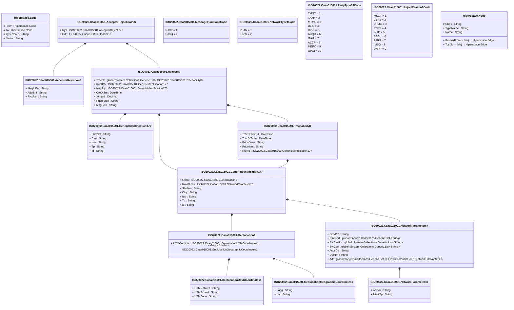

# caaa.015.001.06

> The tables below contain descriptions of the members of each Element. 
> The first column indicates the type of the member:
> A ‘#’ indicates that the field is a key to the element, and a ‘+’ indicates that the field is a value.
> The ‘*’ column contains a description for the element member.  
> The ‘@’ column contains any properties for the member.
> The ‘=’ column contains calculated values; or in the case of an enum, the serialized value.

---

## View Hiperspace.Edge
edge between nodes

| |Name|Type|*|@|=|
|-|-|-|-|-|-|
|#|From|Hiperspace.Node||||
|#|To|Hiperspace.Node||||
|#|TypeName|String||||
|+|Name|String||||

---

## Value ISO20022.Caaa015001.AcceptorRejection2

| |Name|Type|*|@|=|
|-|-|-|-|-|-|
|+|MsgInErr|String||XmlElement()||
|+|AddtlInf|String||XmlElement()||
|+|RjctRsn|String||XmlElement()||
||Validation|Some(String)||XmlIgnore(), JsonIgnore()|""|

---

## Aspect ISO20022.Caaa015001.AcceptorRejectionV06

| |Name|Type|*|@|=|
|-|-|-|-|-|-|
|+|Rjct|ISO20022.Caaa015001.AcceptorRejection2||XmlElement()||
|+|Hdr|ISO20022.Caaa015001.Header57||XmlElement()||
||Validation|Some(String)||XmlIgnore(), JsonIgnore()|validation(validElement(Rjct),validElement(Hdr))|

---

## Type ISO20022.Caaa015001.Document

| |Name|Type|*|@|=|
|-|-|-|-|-|-|
|+|AccptrRjctn|ISO20022.Caaa015001.AcceptorRejectionV06||XmlElement()||
||Validation|Some(String)||XmlIgnore(), JsonIgnore()|validation(validElement(AccptrRjctn))|

---

## Value ISO20022.Caaa015001.GenericIdentification176

| |Name|Type|*|@|=|
|-|-|-|-|-|-|
|+|ShrtNm|String||XmlElement()||
|+|Ctry|String||XmlElement()||
|+|Issr|String||XmlElement()||
|+|Tp|String||XmlElement()||
|+|Id|String||XmlElement()||
||Validation|Some(String)||XmlIgnore(), JsonIgnore()|validation(validPattern("""Ctry""",Ctry,"""[a-zA-Z]{2,3}"""))|

---

## Value ISO20022.Caaa015001.GenericIdentification177

| |Name|Type|*|@|=|
|-|-|-|-|-|-|
|+|Glctn|ISO20022.Caaa015001.Geolocation1||XmlElement()||
|+|RmotAccs|ISO20022.Caaa015001.NetworkParameters7||XmlElement()||
|+|ShrtNm|String||XmlElement()||
|+|Ctry|String||XmlElement()||
|+|Issr|String||XmlElement()||
|+|Tp|String||XmlElement()||
|+|Id|String||XmlElement()||
||Validation|Some(String)||XmlIgnore(), JsonIgnore()|validation(validElement(Glctn),validElement(RmotAccs),validPattern("""Ctry""",Ctry,"""[a-zA-Z]{2,3}"""))|

---

## Value ISO20022.Caaa015001.Geolocation1

| |Name|Type|*|@|=|
|-|-|-|-|-|-|
|+|UTMCordints|ISO20022.Caaa015001.GeolocationUTMCoordinates1||XmlElement()||
|+|GeogcCordints|ISO20022.Caaa015001.GeolocationGeographicCoordinates1||XmlElement()||
||Validation|Some(String)||XmlIgnore(), JsonIgnore()|validation(validElement(UTMCordints),validElement(GeogcCordints))|

---

## Value ISO20022.Caaa015001.GeolocationGeographicCoordinates1

| |Name|Type|*|@|=|
|-|-|-|-|-|-|
|+|Long|String||XmlElement()||
|+|Lat|String||XmlElement()||
||Validation|Some(String)||XmlIgnore(), JsonIgnore()|""|

---

## Value ISO20022.Caaa015001.GeolocationUTMCoordinates1

| |Name|Type|*|@|=|
|-|-|-|-|-|-|
|+|UTMNrthwrd|String||XmlElement()||
|+|UTMEstwrd|String||XmlElement()||
|+|UTMZone|String||XmlElement()||
||Validation|Some(String)||XmlIgnore(), JsonIgnore()|""|

---

## Value ISO20022.Caaa015001.Header57

| |Name|Type|*|@|=|
|-|-|-|-|-|-|
|+|Tracblt|global::System.Collections.Generic.List<ISO20022.Caaa015001.Traceability8>||XmlElement()||
|+|RcptPty|ISO20022.Caaa015001.GenericIdentification177||XmlElement()||
|+|InitgPty|ISO20022.Caaa015001.GenericIdentification176||XmlElement()||
|+|CreDtTm|DateTime||XmlElement()||
|+|XchgId|Decimal||XmlElement()||
|+|PrtcolVrsn|String||XmlElement()||
|+|MsgFctn|String||XmlElement()||
||Validation|Some(String)||XmlIgnore(), JsonIgnore()|validation(validList("""Tracblt""",Tracblt),validElement(Tracblt),validElement(RcptPty),validElement(InitgPty))|

---

## Enum ISO20022.Caaa015001.MessageFunction9Code

| |Name|Type|*|@|=|
|-|-|-|-|-|-|
||RJCP|Int32||XmlEnum("""RJCP""")|1|
||RJCQ|Int32||XmlEnum("""RJCQ""")|2|

---

## Value ISO20022.Caaa015001.NetworkParameters7

| |Name|Type|*|@|=|
|-|-|-|-|-|-|
|+|SctyPrfl|String||XmlElement()||
|+|ClntCert|global::System.Collections.Generic.List<String>||XmlElement()||
|+|SvrCertIdr|global::System.Collections.Generic.List<String>||XmlElement()||
|+|SvrCert|global::System.Collections.Generic.List<String>||XmlElement()||
|+|AccsCd|String||XmlElement()||
|+|UsrNm|String||XmlElement()||
|+|Adr|global::System.Collections.Generic.List<ISO20022.Caaa015001.NetworkParameters9>||XmlElement()||
||Validation|Some(String)||XmlIgnore(), JsonIgnore()|validation(validRequired("""Adr""",Adr),validList("""Adr""",Adr),validElement(Adr))|

---

## Value ISO20022.Caaa015001.NetworkParameters9

| |Name|Type|*|@|=|
|-|-|-|-|-|-|
|+|AdrVal|String||XmlElement()||
|+|NtwkTp|String||XmlElement()||
||Validation|Some(String)||XmlIgnore(), JsonIgnore()|""|

---

## Enum ISO20022.Caaa015001.NetworkType1Code

| |Name|Type|*|@|=|
|-|-|-|-|-|-|
||PSTN|Int32||XmlEnum("""PSTN""")|1|
||IPNW|Int32||XmlEnum("""IPNW""")|2|

---

## Enum ISO20022.Caaa015001.PartyType33Code

| |Name|Type|*|@|=|
|-|-|-|-|-|-|
||TMGT|Int32||XmlEnum("""TMGT""")|1|
||TAXH|Int32||XmlEnum("""TAXH""")|2|
||MTMG|Int32||XmlEnum("""MTMG""")|3|
||DLIS|Int32||XmlEnum("""DLIS""")|4|
||CISS|Int32||XmlEnum("""CISS""")|5|
||ACQR|Int32||XmlEnum("""ACQR""")|6|
||ITAG|Int32||XmlEnum("""ITAG""")|7|
||ACCP|Int32||XmlEnum("""ACCP""")|8|
||MERC|Int32||XmlEnum("""MERC""")|9|
||OPOI|Int32||XmlEnum("""OPOI""")|10|

---

## Enum ISO20022.Caaa015001.RejectReason1Code

| |Name|Type|*|@|=|
|-|-|-|-|-|-|
||MSGT|Int32||XmlEnum("""MSGT""")|1|
||VERS|Int32||XmlEnum("""VERS""")|2|
||DPMG|Int32||XmlEnum("""DPMG""")|3|
||RCPP|Int32||XmlEnum("""RCPP""")|4|
||INTP|Int32||XmlEnum("""INTP""")|5|
||SECU|Int32||XmlEnum("""SECU""")|6|
||PARS|Int32||XmlEnum("""PARS""")|7|
||IMSG|Int32||XmlEnum("""IMSG""")|8|
||UNPR|Int32||XmlEnum("""UNPR""")|9|

---

## Value ISO20022.Caaa015001.Traceability8

| |Name|Type|*|@|=|
|-|-|-|-|-|-|
|+|TracDtTmOut|DateTime||XmlElement()||
|+|TracDtTmIn|DateTime||XmlElement()||
|+|PrtcolVrsn|String||XmlElement()||
|+|PrtcolNm|String||XmlElement()||
|+|RlayId|ISO20022.Caaa015001.GenericIdentification177||XmlElement()||
||Validation|Some(String)||XmlIgnore(), JsonIgnore()|validation(validElement(RlayId))|

---

## View Hiperspace.Node
node in a graph view of data

| |Name|Type|*|@|=|
|-|-|-|-|-|-|
|#|SKey|String||||
|+|TypeName|String||||
|+|Name|String||||
||Froms|Hiperspace.Edge|||From = this|
||Tos|Hiperspace.Edge|||To = this|

