# caad.010.001.02-physical

```mermaid
classDiagram
    class ISO20022.Caad010001.Document {
        # Uri  : String
        + CstmRpt () : ISO20022.Caad010001.CustomReportV02
        + Validation () = validation(validElement(CstmRpt))
    }
    class ISO20022.Caad010001.CustomReportV02 {
        # owner  : ISO20022.Caad010001.Document
        + SctyTrlr  : ISO20022.Caad010001.ContentInformationType41
        + SplmtryData  : List~ISO20022.Caad010001.SupplementaryData1~
        + AddtlData  : List~ISO20022.Caad010001.AdditionalData2~
        + RptCntt  : List~ISO20022.Caad010001.ReportContent2~
        + Rpt  : ISO20022.Caad010001.ReportData7
        + Crrctn  : ISO20022.Caad010001.CorrectionIdentification1
        + Rcncltn  : ISO20022.Caad010001.Reconciliation4
        + SttlmSvc  : ISO20022.Caad010001.SettlementService6
        + Jursdctn  : ISO20022.Caad010001.Jurisdiction2
        + Prgrmm  : List~ISO20022.Caad010001.ProgrammeMode5~
        + Dstn  : ISO20022.Caad010001.PartyIdentification286
        + Rcvr  : ISO20022.Caad010001.PartyIdentification286
        + Sndr  : ISO20022.Caad010001.PartyIdentification286
        + Orgtr  : ISO20022.Caad010001.PartyIdentification286
        + Hdr  : ISO20022.Caad010001.Header71
        + Validation () = validation(validElement(SctyTrlr),validList("""SplmtryData""",SplmtryData),validElement(SplmtryData),validList("""AddtlData""",AddtlData),validElement(AddtlData),validList("""RptCntt""",RptCntt),validElement(RptCntt),validElement(Rpt),validElement(Crrctn),validElement(Rcncltn),validElement(SttlmSvc),validElement(Jursdctn),validList("""Prgrmm""",Prgrmm),validElement(Prgrmm),validElement(Dstn),validElement(Rcvr),validElement(Sndr),validElement(Orgtr),validElement(Hdr))
    }
```

> The tables below contain descriptions of the members of each Element. 
> The first column indicates the type of the member:
> A ‘#’ indicates that the field is a key to the element, and a ‘+’ indicates that the field is a value.
> The ‘*’ column contains a description for the element member.  
> The ‘@’ column contains any properties for the member.
> The ‘=’ column contains calculated values; or in the case of an enum, the serialized value.

---

## EntityImpl ISO20022.Caad010001.Document

| |Name|Type|*|@|=|
|-|-|-|-|-|-|
|#|Uri|String||XmlIgnore(), JsonIgnore()||
|+|CstmRpt|ISO20022.Caad010001.CustomReportV02||XmlElement()||
||Validation|Some(String)||XmlIgnore(), JsonIgnore()|validation(validElement(CstmRpt))|

---

## AspectImpl ISO20022.Caad010001.CustomReportV02

| |Name|Type|*|@|=|
|-|-|-|-|-|-|
|#|owner|ISO20022.Caad010001.Document||||
|+|SctyTrlr|ISO20022.Caad010001.ContentInformationType41||XmlElement()||
|+|SplmtryData|List<ISO20022.Caad010001.SupplementaryData1>||XmlElement()||
|+|AddtlData|List<ISO20022.Caad010001.AdditionalData2>||XmlElement()||
|+|RptCntt|List<ISO20022.Caad010001.ReportContent2>||XmlElement()||
|+|Rpt|ISO20022.Caad010001.ReportData7||XmlElement()||
|+|Crrctn|ISO20022.Caad010001.CorrectionIdentification1||XmlElement()||
|+|Rcncltn|ISO20022.Caad010001.Reconciliation4||XmlElement()||
|+|SttlmSvc|ISO20022.Caad010001.SettlementService6||XmlElement()||
|+|Jursdctn|ISO20022.Caad010001.Jurisdiction2||XmlElement()||
|+|Prgrmm|List<ISO20022.Caad010001.ProgrammeMode5>||XmlElement()||
|+|Dstn|ISO20022.Caad010001.PartyIdentification286||XmlElement()||
|+|Rcvr|ISO20022.Caad010001.PartyIdentification286||XmlElement()||
|+|Sndr|ISO20022.Caad010001.PartyIdentification286||XmlElement()||
|+|Orgtr|ISO20022.Caad010001.PartyIdentification286||XmlElement()||
|+|Hdr|ISO20022.Caad010001.Header71||XmlElement()||
||Validation|Some(String)||XmlIgnore(), JsonIgnore()|validation(validElement(SctyTrlr),validList("""SplmtryData""",SplmtryData),validElement(SplmtryData),validList("""AddtlData""",AddtlData),validElement(AddtlData),validList("""RptCntt""",RptCntt),validElement(RptCntt),validElement(Rpt),validElement(Crrctn),validElement(Rcncltn),validElement(SttlmSvc),validElement(Jursdctn),validList("""Prgrmm""",Prgrmm),validElement(Prgrmm),validElement(Dstn),validElement(Rcvr),validElement(Sndr),validElement(Orgtr),validElement(Hdr))|

