# caam.008.001.01

```mermaid
classDiagram
    class Hiperspace.Edge {
        # From  : Hiperspace.Node
        # To  : Hiperspace.Node
        # TypeName  : String
        + Name  : String
    }
    class ISO20022.Caam008001.ATMEnvironment9 {
        + ATM  : ISO20022.Caam008001.AutomatedTellerMachine7
        + ATMMgrId  : String
        + Acqrr  : ISO20022.Caam008001.Acquirer7
    }
    ISO20022.Caam008001.ATMEnvironment9 *-- ISO20022.Caam008001.AutomatedTellerMachine7
    ISO20022.Caam008001.ATMEnvironment9 *-- ISO20022.Caam008001.Acquirer7
    class ISO20022.Caam008001.ATMMessageFunction1 {
        + HstSvcCd  : String
        + ATMSvcCd  : String
        + Fctn  : String
    }
    class ISO20022.Caam008001.Acquirer7 {
        + Brnch  : String
        + AcqrgInstn  : String
    }
    class ISO20022.Caam008001.Algorithm11Code {
        HS01 = 1
        HS51 = 2
        HS38 = 3
        HS25 = 4
    }
    class ISO20022.Caam008001.Algorithm12Code {
        CMA5 = 1
        CMA9 = 2
        MCC1 = 3
        CMA1 = 4
        MCCS = 5
        MACC = 6
    }
    class ISO20022.Caam008001.Algorithm13Code {
        EA5C = 1
        EA9C = 2
        UKA1 = 3
        UKPT = 4
        DKP9 = 5
        E3DC = 6
        EA2C = 7
    }
    class ISO20022.Caam008001.Algorithm15Code {
        EA5C = 1
        EA9C = 2
        E3DC = 3
        EA2C = 4
    }
    class ISO20022.Caam008001.Algorithm7Code {
        RSAO = 1
        ERSA = 2
    }
    class ISO20022.Caam008001.Algorithm8Code {
        MGF1 = 1
    }
    class ISO20022.Caam008001.AlgorithmIdentification11 {
        + Param  : ISO20022.Caam008001.Parameter4
        + Algo  : String
    }
    ISO20022.Caam008001.AlgorithmIdentification11 *-- ISO20022.Caam008001.Parameter4
    class ISO20022.Caam008001.AlgorithmIdentification12 {
        + Param  : ISO20022.Caam008001.Parameter5
        + Algo  : String
    }
    ISO20022.Caam008001.AlgorithmIdentification12 *-- ISO20022.Caam008001.Parameter5
    class ISO20022.Caam008001.AlgorithmIdentification13 {
        + Param  : ISO20022.Caam008001.Parameter6
        + Algo  : String
    }
    ISO20022.Caam008001.AlgorithmIdentification13 *-- ISO20022.Caam008001.Parameter6
    class ISO20022.Caam008001.AlgorithmIdentification14 {
        + Param  : ISO20022.Caam008001.Parameter6
        + Algo  : String
    }
    ISO20022.Caam008001.AlgorithmIdentification14 *-- ISO20022.Caam008001.Parameter6
    class ISO20022.Caam008001.AlgorithmIdentification15 {
        + Param  : ISO20022.Caam008001.Parameter7
        + Algo  : String
    }
    ISO20022.Caam008001.AlgorithmIdentification15 *-- ISO20022.Caam008001.Parameter7
    class ISO20022.Caam008001.AttributeType1Code {
        CATT = 1
        OUAT = 2
        OATT = 3
        LATT = 4
        CNAT = 5
    }
    class ISO20022.Caam008001.AuthenticatedData4 {
        + MAC  : String
        + NcpsltdCntt  : ISO20022.Caam008001.EncapsulatedContent3
        + MACAlgo  : ISO20022.Caam008001.AlgorithmIdentification15
        + Rcpt  : global::System.Collections.Generic.List~ISO20022.Caam008001.Recipient4Choice~
        + Vrsn  : Decimal
    }
    ISO20022.Caam008001.AuthenticatedData4 *-- ISO20022.Caam008001.EncapsulatedContent3
    ISO20022.Caam008001.AuthenticatedData4 *-- ISO20022.Caam008001.AlgorithmIdentification15
    ISO20022.Caam008001.AuthenticatedData4 *-- ISO20022.Caam008001.Recipient4Choice
    class ISO20022.Caam008001.AutomatedTellerMachine7 {
        + SeqNb  : String
        + AddtlId  : String
        + Id  : String
    }
    class ISO20022.Caam008001.BytePadding1Code {
        RAND = 1
        NULL = 2
        NULG = 3
        NUL8 = 4
        LNGT = 5
    }
    class ISO20022.Caam008001.CertificateIssuer1 {
        + RltvDstngshdNm  : global::System.Collections.Generic.List~ISO20022.Caam008001.RelativeDistinguishedName1~
    }
    ISO20022.Caam008001.CertificateIssuer1 *-- ISO20022.Caam008001.RelativeDistinguishedName1
    class ISO20022.Caam008001.ContentInformationType10 {
        + EnvlpdData  : ISO20022.Caam008001.EnvelopedData4
        + CnttTp  : String
    }
    ISO20022.Caam008001.ContentInformationType10 *-- ISO20022.Caam008001.EnvelopedData4
    class ISO20022.Caam008001.ContentInformationType15 {
        + AuthntcdData  : ISO20022.Caam008001.AuthenticatedData4
        + CnttTp  : String
    }
    ISO20022.Caam008001.ContentInformationType15 *-- ISO20022.Caam008001.AuthenticatedData4
    class ISO20022.Caam008001.ContentType2Code {
        AUTH = 1
        DGST = 2
        EVLP = 3
        SIGN = 4
        DATA = 5
    }
    class ISO20022.Caam008001.EncapsulatedContent3 {
        + Cntt  : String
        + CnttTp  : String
    }
    class ISO20022.Caam008001.EncryptedContent3 {
        + NcrptdData  : String
        + CnttNcrptnAlgo  : ISO20022.Caam008001.AlgorithmIdentification14
        + CnttTp  : String
    }
    ISO20022.Caam008001.EncryptedContent3 *-- ISO20022.Caam008001.AlgorithmIdentification14
    class ISO20022.Caam008001.EncryptionFormat1Code {
        TR34 = 1
        TR31 = 2
    }
    class ISO20022.Caam008001.EnvelopedData4 {
        + NcrptdCntt  : ISO20022.Caam008001.EncryptedContent3
        + Rcpt  : global::System.Collections.Generic.List~ISO20022.Caam008001.Recipient4Choice~
        + Vrsn  : Decimal
    }
    ISO20022.Caam008001.EnvelopedData4 *-- ISO20022.Caam008001.EncryptedContent3
    ISO20022.Caam008001.EnvelopedData4 *-- ISO20022.Caam008001.Recipient4Choice
    class ISO20022.Caam008001.GenericIdentification77 {
        + ShrtNm  : String
        + Ctry  : String
        + Issr  : String
        + Tp  : String
        + Id  : String
    }
    class ISO20022.Caam008001.Header20 {
        + Tracblt  : global::System.Collections.Generic.List~ISO20022.Caam008001.Traceability4~
        + PrcStat  : String
        + RcptPty  : String
        + InitgPty  : String
        + CreDtTm  : DateTime
        + XchgId  : String
        + PrtcolVrsn  : String
        + MsgFctn  : ISO20022.Caam008001.ATMMessageFunction1
    }
    ISO20022.Caam008001.Header20 *-- ISO20022.Caam008001.Traceability4
    ISO20022.Caam008001.Header20 *-- ISO20022.Caam008001.ATMMessageFunction1
    class ISO20022.Caam008001.HostToATMAcknowledgement1 {
        + Envt  : ISO20022.Caam008001.ATMEnvironment9
    }
    ISO20022.Caam008001.HostToATMAcknowledgement1 *-- ISO20022.Caam008001.ATMEnvironment9
    class ISO20022.Caam008001.HostToATMAcknowledgementV01 {
        + SctyTrlr  : ISO20022.Caam008001.ContentInformationType15
        + HstToATMAck  : ISO20022.Caam008001.HostToATMAcknowledgement1
        + PrtctdHstToATMAck  : ISO20022.Caam008001.ContentInformationType10
        + Hdr  : ISO20022.Caam008001.Header20
    }
    ISO20022.Caam008001.HostToATMAcknowledgementV01 *-- ISO20022.Caam008001.ContentInformationType15
    ISO20022.Caam008001.HostToATMAcknowledgementV01 *-- ISO20022.Caam008001.HostToATMAcknowledgement1
    ISO20022.Caam008001.HostToATMAcknowledgementV01 *-- ISO20022.Caam008001.ContentInformationType10
    ISO20022.Caam008001.HostToATMAcknowledgementV01 *-- ISO20022.Caam008001.Header20
    class ISO20022.Caam008001.IssuerAndSerialNumber1 {
        + SrlNb  : String
        + Issr  : ISO20022.Caam008001.CertificateIssuer1
    }
    ISO20022.Caam008001.IssuerAndSerialNumber1 *-- ISO20022.Caam008001.CertificateIssuer1
    class ISO20022.Caam008001.KEK4 {
        + NcrptdKey  : String
        + KeyNcrptnAlgo  : ISO20022.Caam008001.AlgorithmIdentification13
        + KEKId  : ISO20022.Caam008001.KEKIdentifier2
        + Vrsn  : Decimal
    }
    ISO20022.Caam008001.KEK4 *-- ISO20022.Caam008001.AlgorithmIdentification13
    ISO20022.Caam008001.KEK4 *-- ISO20022.Caam008001.KEKIdentifier2
    class ISO20022.Caam008001.KEKIdentifier2 {
        + DerivtnId  : String
        + SeqNb  : Decimal
        + KeyVrsn  : String
        + KeyId  : String
    }
    class ISO20022.Caam008001.KeyTransport4 {
        + NcrptdKey  : String
        + KeyNcrptnAlgo  : ISO20022.Caam008001.AlgorithmIdentification11
        + RcptId  : ISO20022.Caam008001.Recipient5Choice
        + Vrsn  : Decimal
    }
    ISO20022.Caam008001.KeyTransport4 *-- ISO20022.Caam008001.AlgorithmIdentification11
    ISO20022.Caam008001.KeyTransport4 *-- ISO20022.Caam008001.Recipient5Choice
    class ISO20022.Caam008001.MessageFunction7Code {
        SSTS = 1
        SKSC = 2
        DSEC = 3
        CSEC = 4
        TMOP = 5
        H2AQ = 6
        H2AP = 7
        INQC = 8
        WITP = 9
        WITQ = 10
        WITK = 11
        WITV = 12
        RJAP = 13
        RJAQ = 14
        PINP = 15
        PINQ = 16
        KYAP = 17
        KYAQ = 18
        INQP = 19
        INQQ = 20
        GSTS = 21
        DIAP = 22
        DIAQ = 23
        DVCC = 24
        ACMD = 25
        CMPD = 26
        CMPA = 27
        BALN = 28
    }
    class ISO20022.Caam008001.Parameter4 {
        + MskGnrtrAlgo  : ISO20022.Caam008001.AlgorithmIdentification12
        + DgstAlgo  : String
        + NcrptnFrmt  : String
    }
    ISO20022.Caam008001.Parameter4 *-- ISO20022.Caam008001.AlgorithmIdentification12
    class ISO20022.Caam008001.Parameter5 {
        + DgstAlgo  : String
    }
    class ISO20022.Caam008001.Parameter6 {
        + BPddg  : String
        + InitlstnVctr  : String
        + NcrptnFrmt  : String
    }
    class ISO20022.Caam008001.Parameter7 {
        + BPddg  : String
        + InitlstnVctr  : String
    }
    class ISO20022.Caam008001.PartyType12Code {
        OATM = 1
        ITAG = 2
        HSTG = 3
        DLIS = 4
        CISP = 5
        ATMG = 6
        ACQR = 7
    }
    class ISO20022.Caam008001.Recipient4Choice {
        + KeyIdr  : ISO20022.Caam008001.KEKIdentifier2
        + KEK  : ISO20022.Caam008001.KEK4
        + KeyTrnsprt  : ISO20022.Caam008001.KeyTransport4
    }
    ISO20022.Caam008001.Recipient4Choice *-- ISO20022.Caam008001.KEKIdentifier2
    ISO20022.Caam008001.Recipient4Choice *-- ISO20022.Caam008001.KEK4
    ISO20022.Caam008001.Recipient4Choice *-- ISO20022.Caam008001.KeyTransport4
    class ISO20022.Caam008001.Recipient5Choice {
        + KeyIdr  : ISO20022.Caam008001.KEKIdentifier2
        + IssrAndSrlNb  : ISO20022.Caam008001.IssuerAndSerialNumber1
    }
    ISO20022.Caam008001.Recipient5Choice *-- ISO20022.Caam008001.KEKIdentifier2
    ISO20022.Caam008001.Recipient5Choice *-- ISO20022.Caam008001.IssuerAndSerialNumber1
    class ISO20022.Caam008001.RelativeDistinguishedName1 {
        + AttrVal  : String
        + AttrTp  : String
    }
    class ISO20022.Caam008001.Traceability4 {
        + TracDtTmOut  : DateTime
        + TracDtTmIn  : DateTime
        + SeqNb  : String
        + RlayId  : ISO20022.Caam008001.GenericIdentification77
    }
    ISO20022.Caam008001.Traceability4 *-- ISO20022.Caam008001.GenericIdentification77
    class Hiperspace.Node {
        # SKey  : String
        + TypeName  : String
        + Name  : String
        + Froms (From = this) : Hiperspace.Edge
        + Tos (To = this) : Hiperspace.Edge
    }
```

> The tables below contain descriptions of the members of each Element. 
> The first column indicates the type of the member:
> A ‘#’ indicates that the field is a key to the element, and a ‘+’ indicates that the field is a value.
> The ‘*’ column contains a description for the element member.  
> The ‘@’ column contains any properties for the member.
> The ‘=’ column contains calculated values; or in the case of an enum, the serialized value.

---

## View Hiperspace.Edge
edge between nodes

| |Name|Type|*|@|=|
|-|-|-|-|-|-|
|#|From|Hiperspace.Node||||
|#|To|Hiperspace.Node||||
|#|TypeName|String||||
|+|Name|String||||

---

## Value ISO20022.Caam008001.ATMEnvironment9

| |Name|Type|*|@|=|
|-|-|-|-|-|-|
|+|ATM|ISO20022.Caam008001.AutomatedTellerMachine7||XmlElement()||
|+|ATMMgrId|String||XmlElement()||
|+|Acqrr|ISO20022.Caam008001.Acquirer7||XmlElement()||
||Validation|Some(String)||XmlIgnore(), JsonIgnore()|validation(validElement(ATM),validElement(Acqrr))|

---

## Value ISO20022.Caam008001.ATMMessageFunction1

| |Name|Type|*|@|=|
|-|-|-|-|-|-|
|+|HstSvcCd|String||XmlElement()||
|+|ATMSvcCd|String||XmlElement()||
|+|Fctn|String||XmlElement()||
||Validation|Some(String)||XmlIgnore(), JsonIgnore()|""|

---

## Value ISO20022.Caam008001.Acquirer7

| |Name|Type|*|@|=|
|-|-|-|-|-|-|
|+|Brnch|String||XmlElement()||
|+|AcqrgInstn|String||XmlElement()||
||Validation|Some(String)||XmlIgnore(), JsonIgnore()|""|

---

## Enum ISO20022.Caam008001.Algorithm11Code

| |Name|Type|*|@|=|
|-|-|-|-|-|-|
||HS01|Int32||XmlEnum("""HS01""")|1|
||HS51|Int32||XmlEnum("""HS51""")|2|
||HS38|Int32||XmlEnum("""HS38""")|3|
||HS25|Int32||XmlEnum("""HS25""")|4|

---

## Enum ISO20022.Caam008001.Algorithm12Code

| |Name|Type|*|@|=|
|-|-|-|-|-|-|
||CMA5|Int32||XmlEnum("""CMA5""")|1|
||CMA9|Int32||XmlEnum("""CMA9""")|2|
||MCC1|Int32||XmlEnum("""MCC1""")|3|
||CMA1|Int32||XmlEnum("""CMA1""")|4|
||MCCS|Int32||XmlEnum("""MCCS""")|5|
||MACC|Int32||XmlEnum("""MACC""")|6|

---

## Enum ISO20022.Caam008001.Algorithm13Code

| |Name|Type|*|@|=|
|-|-|-|-|-|-|
||EA5C|Int32||XmlEnum("""EA5C""")|1|
||EA9C|Int32||XmlEnum("""EA9C""")|2|
||UKA1|Int32||XmlEnum("""UKA1""")|3|
||UKPT|Int32||XmlEnum("""UKPT""")|4|
||DKP9|Int32||XmlEnum("""DKP9""")|5|
||E3DC|Int32||XmlEnum("""E3DC""")|6|
||EA2C|Int32||XmlEnum("""EA2C""")|7|

---

## Enum ISO20022.Caam008001.Algorithm15Code

| |Name|Type|*|@|=|
|-|-|-|-|-|-|
||EA5C|Int32||XmlEnum("""EA5C""")|1|
||EA9C|Int32||XmlEnum("""EA9C""")|2|
||E3DC|Int32||XmlEnum("""E3DC""")|3|
||EA2C|Int32||XmlEnum("""EA2C""")|4|

---

## Enum ISO20022.Caam008001.Algorithm7Code

| |Name|Type|*|@|=|
|-|-|-|-|-|-|
||RSAO|Int32||XmlEnum("""RSAO""")|1|
||ERSA|Int32||XmlEnum("""ERSA""")|2|

---

## Enum ISO20022.Caam008001.Algorithm8Code

| |Name|Type|*|@|=|
|-|-|-|-|-|-|
||MGF1|Int32||XmlEnum("""MGF1""")|1|

---

## Value ISO20022.Caam008001.AlgorithmIdentification11

| |Name|Type|*|@|=|
|-|-|-|-|-|-|
|+|Param|ISO20022.Caam008001.Parameter4||XmlElement()||
|+|Algo|String||XmlElement()||
||Validation|Some(String)||XmlIgnore(), JsonIgnore()|validation(validElement(Param))|

---

## Value ISO20022.Caam008001.AlgorithmIdentification12

| |Name|Type|*|@|=|
|-|-|-|-|-|-|
|+|Param|ISO20022.Caam008001.Parameter5||XmlElement()||
|+|Algo|String||XmlElement()||
||Validation|Some(String)||XmlIgnore(), JsonIgnore()|validation(validElement(Param))|

---

## Value ISO20022.Caam008001.AlgorithmIdentification13

| |Name|Type|*|@|=|
|-|-|-|-|-|-|
|+|Param|ISO20022.Caam008001.Parameter6||XmlElement()||
|+|Algo|String||XmlElement()||
||Validation|Some(String)||XmlIgnore(), JsonIgnore()|validation(validElement(Param))|

---

## Value ISO20022.Caam008001.AlgorithmIdentification14

| |Name|Type|*|@|=|
|-|-|-|-|-|-|
|+|Param|ISO20022.Caam008001.Parameter6||XmlElement()||
|+|Algo|String||XmlElement()||
||Validation|Some(String)||XmlIgnore(), JsonIgnore()|validation(validElement(Param))|

---

## Value ISO20022.Caam008001.AlgorithmIdentification15

| |Name|Type|*|@|=|
|-|-|-|-|-|-|
|+|Param|ISO20022.Caam008001.Parameter7||XmlElement()||
|+|Algo|String||XmlElement()||
||Validation|Some(String)||XmlIgnore(), JsonIgnore()|validation(validElement(Param))|

---

## Enum ISO20022.Caam008001.AttributeType1Code

| |Name|Type|*|@|=|
|-|-|-|-|-|-|
||CATT|Int32||XmlEnum("""CATT""")|1|
||OUAT|Int32||XmlEnum("""OUAT""")|2|
||OATT|Int32||XmlEnum("""OATT""")|3|
||LATT|Int32||XmlEnum("""LATT""")|4|
||CNAT|Int32||XmlEnum("""CNAT""")|5|

---

## Value ISO20022.Caam008001.AuthenticatedData4

| |Name|Type|*|@|=|
|-|-|-|-|-|-|
|+|MAC|String||XmlElement()||
|+|NcpsltdCntt|ISO20022.Caam008001.EncapsulatedContent3||XmlElement()||
|+|MACAlgo|ISO20022.Caam008001.AlgorithmIdentification15||XmlElement()||
|+|Rcpt|global::System.Collections.Generic.List<ISO20022.Caam008001.Recipient4Choice>||XmlElement()||
|+|Vrsn|Decimal||XmlElement()||
||Validation|Some(String)||XmlIgnore(), JsonIgnore()|validation(validElement(NcpsltdCntt),validElement(MACAlgo),validRequired("""Rcpt""",Rcpt),validList("""Rcpt""",Rcpt),validElement(Rcpt))|

---

## Value ISO20022.Caam008001.AutomatedTellerMachine7

| |Name|Type|*|@|=|
|-|-|-|-|-|-|
|+|SeqNb|String||XmlElement()||
|+|AddtlId|String||XmlElement()||
|+|Id|String||XmlElement()||
||Validation|Some(String)||XmlIgnore(), JsonIgnore()|""|

---

## Enum ISO20022.Caam008001.BytePadding1Code

| |Name|Type|*|@|=|
|-|-|-|-|-|-|
||RAND|Int32||XmlEnum("""RAND""")|1|
||NULL|Int32||XmlEnum("""NULL""")|2|
||NULG|Int32||XmlEnum("""NULG""")|3|
||NUL8|Int32||XmlEnum("""NUL8""")|4|
||LNGT|Int32||XmlEnum("""LNGT""")|5|

---

## Value ISO20022.Caam008001.CertificateIssuer1

| |Name|Type|*|@|=|
|-|-|-|-|-|-|
|+|RltvDstngshdNm|global::System.Collections.Generic.List<ISO20022.Caam008001.RelativeDistinguishedName1>||XmlElement()||
||Validation|Some(String)||XmlIgnore(), JsonIgnore()|validation(validRequired("""RltvDstngshdNm""",RltvDstngshdNm),validList("""RltvDstngshdNm""",RltvDstngshdNm),validElement(RltvDstngshdNm))|

---

## Value ISO20022.Caam008001.ContentInformationType10

| |Name|Type|*|@|=|
|-|-|-|-|-|-|
|+|EnvlpdData|ISO20022.Caam008001.EnvelopedData4||XmlElement()||
|+|CnttTp|String||XmlElement()||
||Validation|Some(String)||XmlIgnore(), JsonIgnore()|validation(validElement(EnvlpdData))|

---

## Value ISO20022.Caam008001.ContentInformationType15

| |Name|Type|*|@|=|
|-|-|-|-|-|-|
|+|AuthntcdData|ISO20022.Caam008001.AuthenticatedData4||XmlElement()||
|+|CnttTp|String||XmlElement()||
||Validation|Some(String)||XmlIgnore(), JsonIgnore()|validation(validElement(AuthntcdData))|

---

## Enum ISO20022.Caam008001.ContentType2Code

| |Name|Type|*|@|=|
|-|-|-|-|-|-|
||AUTH|Int32||XmlEnum("""AUTH""")|1|
||DGST|Int32||XmlEnum("""DGST""")|2|
||EVLP|Int32||XmlEnum("""EVLP""")|3|
||SIGN|Int32||XmlEnum("""SIGN""")|4|
||DATA|Int32||XmlEnum("""DATA""")|5|

---

## Type ISO20022.Caam008001.Document

| |Name|Type|*|@|=|
|-|-|-|-|-|-|
|+|HstToATMAck|ISO20022.Caam008001.HostToATMAcknowledgementV01||XmlElement()||
||Validation|Some(String)||XmlIgnore(), JsonIgnore()|validation(validElement(HstToATMAck))|

---

## Value ISO20022.Caam008001.EncapsulatedContent3

| |Name|Type|*|@|=|
|-|-|-|-|-|-|
|+|Cntt|String||XmlElement()||
|+|CnttTp|String||XmlElement()||
||Validation|Some(String)||XmlIgnore(), JsonIgnore()|""|

---

## Value ISO20022.Caam008001.EncryptedContent3

| |Name|Type|*|@|=|
|-|-|-|-|-|-|
|+|NcrptdData|String||XmlElement()||
|+|CnttNcrptnAlgo|ISO20022.Caam008001.AlgorithmIdentification14||XmlElement()||
|+|CnttTp|String||XmlElement()||
||Validation|Some(String)||XmlIgnore(), JsonIgnore()|validation(validElement(CnttNcrptnAlgo))|

---

## Enum ISO20022.Caam008001.EncryptionFormat1Code

| |Name|Type|*|@|=|
|-|-|-|-|-|-|
||TR34|Int32||XmlEnum("""TR34""")|1|
||TR31|Int32||XmlEnum("""TR31""")|2|

---

## Value ISO20022.Caam008001.EnvelopedData4

| |Name|Type|*|@|=|
|-|-|-|-|-|-|
|+|NcrptdCntt|ISO20022.Caam008001.EncryptedContent3||XmlElement()||
|+|Rcpt|global::System.Collections.Generic.List<ISO20022.Caam008001.Recipient4Choice>||XmlElement()||
|+|Vrsn|Decimal||XmlElement()||
||Validation|Some(String)||XmlIgnore(), JsonIgnore()|validation(validElement(NcrptdCntt),validRequired("""Rcpt""",Rcpt),validList("""Rcpt""",Rcpt),validElement(Rcpt))|

---

## Value ISO20022.Caam008001.GenericIdentification77

| |Name|Type|*|@|=|
|-|-|-|-|-|-|
|+|ShrtNm|String||XmlElement()||
|+|Ctry|String||XmlElement()||
|+|Issr|String||XmlElement()||
|+|Tp|String||XmlElement()||
|+|Id|String||XmlElement()||
||Validation|Some(String)||XmlIgnore(), JsonIgnore()|validation(validPattern("""Ctry""",Ctry,"""[a-zA-Z]{2,3}"""))|

---

## Value ISO20022.Caam008001.Header20

| |Name|Type|*|@|=|
|-|-|-|-|-|-|
|+|Tracblt|global::System.Collections.Generic.List<ISO20022.Caam008001.Traceability4>||XmlElement()||
|+|PrcStat|String||XmlElement()||
|+|RcptPty|String||XmlElement()||
|+|InitgPty|String||XmlElement()||
|+|CreDtTm|DateTime||XmlElement()||
|+|XchgId|String||XmlElement()||
|+|PrtcolVrsn|String||XmlElement()||
|+|MsgFctn|ISO20022.Caam008001.ATMMessageFunction1||XmlElement()||
||Validation|Some(String)||XmlIgnore(), JsonIgnore()|validation(validList("""Tracblt""",Tracblt),validElement(Tracblt),validPattern("""XchgId""",XchgId,"""[0-9]{1,3}"""),validElement(MsgFctn))|

---

## Value ISO20022.Caam008001.HostToATMAcknowledgement1

| |Name|Type|*|@|=|
|-|-|-|-|-|-|
|+|Envt|ISO20022.Caam008001.ATMEnvironment9||XmlElement()||
||Validation|Some(String)||XmlIgnore(), JsonIgnore()|validation(validElement(Envt))|

---

## Aspect ISO20022.Caam008001.HostToATMAcknowledgementV01

| |Name|Type|*|@|=|
|-|-|-|-|-|-|
|+|SctyTrlr|ISO20022.Caam008001.ContentInformationType15||XmlElement()||
|+|HstToATMAck|ISO20022.Caam008001.HostToATMAcknowledgement1||XmlElement()||
|+|PrtctdHstToATMAck|ISO20022.Caam008001.ContentInformationType10||XmlElement()||
|+|Hdr|ISO20022.Caam008001.Header20||XmlElement()||
||Validation|Some(String)||XmlIgnore(), JsonIgnore()|validation(validElement(SctyTrlr),validElement(HstToATMAck),validElement(PrtctdHstToATMAck),validElement(Hdr))|

---

## Value ISO20022.Caam008001.IssuerAndSerialNumber1

| |Name|Type|*|@|=|
|-|-|-|-|-|-|
|+|SrlNb|String||XmlElement()||
|+|Issr|ISO20022.Caam008001.CertificateIssuer1||XmlElement()||
||Validation|Some(String)||XmlIgnore(), JsonIgnore()|validation(validElement(Issr))|

---

## Value ISO20022.Caam008001.KEK4

| |Name|Type|*|@|=|
|-|-|-|-|-|-|
|+|NcrptdKey|String||XmlElement()||
|+|KeyNcrptnAlgo|ISO20022.Caam008001.AlgorithmIdentification13||XmlElement()||
|+|KEKId|ISO20022.Caam008001.KEKIdentifier2||XmlElement()||
|+|Vrsn|Decimal||XmlElement()||
||Validation|Some(String)||XmlIgnore(), JsonIgnore()|validation(validElement(KeyNcrptnAlgo),validElement(KEKId))|

---

## Value ISO20022.Caam008001.KEKIdentifier2

| |Name|Type|*|@|=|
|-|-|-|-|-|-|
|+|DerivtnId|String||XmlElement()||
|+|SeqNb|Decimal||XmlElement()||
|+|KeyVrsn|String||XmlElement()||
|+|KeyId|String||XmlElement()||
||Validation|Some(String)||XmlIgnore(), JsonIgnore()|""|

---

## Value ISO20022.Caam008001.KeyTransport4

| |Name|Type|*|@|=|
|-|-|-|-|-|-|
|+|NcrptdKey|String||XmlElement()||
|+|KeyNcrptnAlgo|ISO20022.Caam008001.AlgorithmIdentification11||XmlElement()||
|+|RcptId|ISO20022.Caam008001.Recipient5Choice||XmlElement()||
|+|Vrsn|Decimal||XmlElement()||
||Validation|Some(String)||XmlIgnore(), JsonIgnore()|validation(validElement(KeyNcrptnAlgo),validElement(RcptId))|

---

## Enum ISO20022.Caam008001.MessageFunction7Code

| |Name|Type|*|@|=|
|-|-|-|-|-|-|
||SSTS|Int32||XmlEnum("""SSTS""")|1|
||SKSC|Int32||XmlEnum("""SKSC""")|2|
||DSEC|Int32||XmlEnum("""DSEC""")|3|
||CSEC|Int32||XmlEnum("""CSEC""")|4|
||TMOP|Int32||XmlEnum("""TMOP""")|5|
||H2AQ|Int32||XmlEnum("""H2AQ""")|6|
||H2AP|Int32||XmlEnum("""H2AP""")|7|
||INQC|Int32||XmlEnum("""INQC""")|8|
||WITP|Int32||XmlEnum("""WITP""")|9|
||WITQ|Int32||XmlEnum("""WITQ""")|10|
||WITK|Int32||XmlEnum("""WITK""")|11|
||WITV|Int32||XmlEnum("""WITV""")|12|
||RJAP|Int32||XmlEnum("""RJAP""")|13|
||RJAQ|Int32||XmlEnum("""RJAQ""")|14|
||PINP|Int32||XmlEnum("""PINP""")|15|
||PINQ|Int32||XmlEnum("""PINQ""")|16|
||KYAP|Int32||XmlEnum("""KYAP""")|17|
||KYAQ|Int32||XmlEnum("""KYAQ""")|18|
||INQP|Int32||XmlEnum("""INQP""")|19|
||INQQ|Int32||XmlEnum("""INQQ""")|20|
||GSTS|Int32||XmlEnum("""GSTS""")|21|
||DIAP|Int32||XmlEnum("""DIAP""")|22|
||DIAQ|Int32||XmlEnum("""DIAQ""")|23|
||DVCC|Int32||XmlEnum("""DVCC""")|24|
||ACMD|Int32||XmlEnum("""ACMD""")|25|
||CMPD|Int32||XmlEnum("""CMPD""")|26|
||CMPA|Int32||XmlEnum("""CMPA""")|27|
||BALN|Int32||XmlEnum("""BALN""")|28|

---

## Value ISO20022.Caam008001.Parameter4

| |Name|Type|*|@|=|
|-|-|-|-|-|-|
|+|MskGnrtrAlgo|ISO20022.Caam008001.AlgorithmIdentification12||XmlElement()||
|+|DgstAlgo|String||XmlElement()||
|+|NcrptnFrmt|String||XmlElement()||
||Validation|Some(String)||XmlIgnore(), JsonIgnore()|validation(validElement(MskGnrtrAlgo))|

---

## Value ISO20022.Caam008001.Parameter5

| |Name|Type|*|@|=|
|-|-|-|-|-|-|
|+|DgstAlgo|String||XmlElement()||
||Validation|Some(String)||XmlIgnore(), JsonIgnore()|""|

---

## Value ISO20022.Caam008001.Parameter6

| |Name|Type|*|@|=|
|-|-|-|-|-|-|
|+|BPddg|String||XmlElement()||
|+|InitlstnVctr|String||XmlElement()||
|+|NcrptnFrmt|String||XmlElement()||
||Validation|Some(String)||XmlIgnore(), JsonIgnore()|""|

---

## Value ISO20022.Caam008001.Parameter7

| |Name|Type|*|@|=|
|-|-|-|-|-|-|
|+|BPddg|String||XmlElement()||
|+|InitlstnVctr|String||XmlElement()||
||Validation|Some(String)||XmlIgnore(), JsonIgnore()|""|

---

## Enum ISO20022.Caam008001.PartyType12Code

| |Name|Type|*|@|=|
|-|-|-|-|-|-|
||OATM|Int32||XmlEnum("""OATM""")|1|
||ITAG|Int32||XmlEnum("""ITAG""")|2|
||HSTG|Int32||XmlEnum("""HSTG""")|3|
||DLIS|Int32||XmlEnum("""DLIS""")|4|
||CISP|Int32||XmlEnum("""CISP""")|5|
||ATMG|Int32||XmlEnum("""ATMG""")|6|
||ACQR|Int32||XmlEnum("""ACQR""")|7|

---

## Value ISO20022.Caam008001.Recipient4Choice

| |Name|Type|*|@|=|
|-|-|-|-|-|-|
|+|KeyIdr|ISO20022.Caam008001.KEKIdentifier2||XmlElement()||
|+|KEK|ISO20022.Caam008001.KEK4||XmlElement()||
|+|KeyTrnsprt|ISO20022.Caam008001.KeyTransport4||XmlElement()||
||Validation|Some(String)||XmlIgnore(), JsonIgnore()|validation(validElement(KeyIdr),validElement(KEK),validElement(KeyTrnsprt),validChoice(KeyIdr,KEK,KeyTrnsprt))|

---

## Value ISO20022.Caam008001.Recipient5Choice

| |Name|Type|*|@|=|
|-|-|-|-|-|-|
|+|KeyIdr|ISO20022.Caam008001.KEKIdentifier2||XmlElement()||
|+|IssrAndSrlNb|ISO20022.Caam008001.IssuerAndSerialNumber1||XmlElement()||
||Validation|Some(String)||XmlIgnore(), JsonIgnore()|validation(validElement(KeyIdr),validElement(IssrAndSrlNb),validChoice(KeyIdr,IssrAndSrlNb))|

---

## Value ISO20022.Caam008001.RelativeDistinguishedName1

| |Name|Type|*|@|=|
|-|-|-|-|-|-|
|+|AttrVal|String||XmlElement()||
|+|AttrTp|String||XmlElement()||
||Validation|Some(String)||XmlIgnore(), JsonIgnore()|""|

---

## Value ISO20022.Caam008001.Traceability4

| |Name|Type|*|@|=|
|-|-|-|-|-|-|
|+|TracDtTmOut|DateTime||XmlElement()||
|+|TracDtTmIn|DateTime||XmlElement()||
|+|SeqNb|String||XmlElement()||
|+|RlayId|ISO20022.Caam008001.GenericIdentification77||XmlElement()||
||Validation|Some(String)||XmlIgnore(), JsonIgnore()|validation(validElement(RlayId))|

---

## View Hiperspace.Node
node in a graph view of data

| |Name|Type|*|@|=|
|-|-|-|-|-|-|
|#|SKey|String||||
|+|TypeName|String||||
|+|Name|String||||
||Froms|Hiperspace.Edge|||From = this|
||Tos|Hiperspace.Edge|||To = this|

