# caam.015.001.01

```mermaid
classDiagram
    class Hiperspace.Edge {
        # From  : Hiperspace.Node
        # To  : Hiperspace.Node
        # TypeName  : String
        + Name  : String
    }
    class ISO20022.Caam015001.ATMCassette3 {
        + CssttSts  : String
        + MdiaCntrs  : global::System.Collections.Generic.List~ISO20022.Caam015001.ATMCassetteCounters6~
        + MdiaTp  : String
        + SubTp  : global::System.Collections.Generic.List~String~
        + Tp  : String
        + SrlNb  : String
        + LogclId  : String
        + PhysId  : String
    }
    ISO20022.Caam015001.ATMCassette3 *-- ISO20022.Caam015001.ATMCassetteCounters6
    class ISO20022.Caam015001.ATMCassetteCounters5 {
        + InitlAmt  : Decimal
        + InitlNb  : Decimal
        + PresntdNb  : Decimal
        + RjctdNb  : Decimal
        + RtrctdAmt  : Decimal
        + RtrctdNb  : Decimal
        + RcycldNb  : Decimal
        + DpstdAmt  : Decimal
        + DpstdNb  : Decimal
        + DspnsdNb  : Decimal
        + RmvdAmt  : Decimal
        + RmvdNb  : Decimal
        + AddedNb  : Decimal
        + Tp  : String
    }
    class ISO20022.Caam015001.ATMCassetteCounters6 {
        + FlowTtls  : global::System.Collections.Generic.List~ISO20022.Caam015001.ATMCassetteCounters5~
        + CurAmt  : Decimal
        + CurNb  : Decimal
        + InitlCnt  : Decimal
        + MdiaCtgy  : String
        + Ccy  : String
        + UnitVal  : Decimal
    }
    ISO20022.Caam015001.ATMCassetteCounters6 *-- ISO20022.Caam015001.ATMCassetteCounters5
    class ISO20022.Caam015001.ATMCassetteStatus1Code {
        CUMP = 1
        CUNR = 2
        CUNA = 3
        CUMS = 4
        CUNP = 5
        CUMT = 6
        CULW = 7
        CUHG = 8
        CUFL = 9
        CUOK = 10
    }
    class ISO20022.Caam015001.ATMCassetteType1Code {
        RTRC = 1
        RPLT = 2
        RJCT = 3
        RCYC = 4
        DISP = 5
        DPST = 6
    }
    class ISO20022.Caam015001.ATMCounterType3Code {
        SLRP = 1
        OPER = 2
        PRTN = 3
        BDAY = 4
        CTOF = 5
        CTXN = 6
        INQU = 7
    }
    class ISO20022.Caam015001.ATMEnvironment7 {
        + ATM  : ISO20022.Caam015001.AutomatedTellerMachine3
        + HstgNtty  : ISO20022.Caam015001.TerminalHosting1
        + ATMMgr  : ISO20022.Caam015001.Acquirer8
        + Acqrr  : ISO20022.Caam015001.Acquirer7
    }
    ISO20022.Caam015001.ATMEnvironment7 *-- ISO20022.Caam015001.AutomatedTellerMachine3
    ISO20022.Caam015001.ATMEnvironment7 *-- ISO20022.Caam015001.TerminalHosting1
    ISO20022.Caam015001.ATMEnvironment7 *-- ISO20022.Caam015001.Acquirer8
    ISO20022.Caam015001.ATMEnvironment7 *-- ISO20022.Caam015001.Acquirer7
    class ISO20022.Caam015001.ATMMediaType3Code {
        UNRG = 1
        UNFT = 2
        SPCT = 3
        FITU = 4
        FITN = 5
        CNTR = 6
    }
    class ISO20022.Caam015001.ATMMediaType4Code {
        MLTP = 1
        ENVP = 2
        CHCK = 3
        UDTM = 4
        STMP = 5
        NOTE = 6
        CPNS = 7
        CMDT = 8
        COIN = 9
        CARD = 10
    }
    class ISO20022.Caam015001.ATMMessageFunction2 {
        + HstSvcCd  : String
        + ATMSvcCd  : String
        + Fctn  : String
    }
    class ISO20022.Caam015001.ATMNoteType1Code {
        UNFT = 1
        SCNT = 2
        IDVD = 3
        CNTR = 4
        ALLT = 5
    }
    class ISO20022.Caam015001.ATMOperation2Code {
        SWAP = 1
        RCUP = 2
        UNLD = 3
        REMV = 4
        LOAD = 5
        INSR = 6
        ADJU = 7
    }
    class ISO20022.Caam015001.ATMReconciliationRequestComponent1 {
        + Tx  : ISO20022.Caam015001.ATMTransaction30
        + Envt  : ISO20022.Caam015001.ATMEnvironment7
    }
    ISO20022.Caam015001.ATMReconciliationRequestComponent1 *-- ISO20022.Caam015001.ATMTransaction30
    ISO20022.Caam015001.ATMReconciliationRequestComponent1 *-- ISO20022.Caam015001.ATMEnvironment7
    class ISO20022.Caam015001.ATMReconciliationRequestV01 {
        + SctyTrlr  : ISO20022.Caam015001.ContentInformationType15
        + ATMRcncltnReq  : ISO20022.Caam015001.ATMReconciliationRequestComponent1
        + PrtctdATMRcncltnReq  : ISO20022.Caam015001.ContentInformationType10
        + Hdr  : ISO20022.Caam015001.Header31
    }
    ISO20022.Caam015001.ATMReconciliationRequestV01 *-- ISO20022.Caam015001.ContentInformationType15
    ISO20022.Caam015001.ATMReconciliationRequestV01 *-- ISO20022.Caam015001.ATMReconciliationRequestComponent1
    ISO20022.Caam015001.ATMReconciliationRequestV01 *-- ISO20022.Caam015001.ContentInformationType10
    ISO20022.Caam015001.ATMReconciliationRequestV01 *-- ISO20022.Caam015001.Header31
    class ISO20022.Caam015001.ATMTransaction30 {
        + Csstt  : global::System.Collections.Generic.List~ISO20022.Caam015001.ATMCassette3~
        + RcncltnId  : String
        + TxId  : ISO20022.Caam015001.TransactionIdentifier3
        + TpOfOpr  : String
    }
    ISO20022.Caam015001.ATMTransaction30 *-- ISO20022.Caam015001.ATMCassette3
    ISO20022.Caam015001.ATMTransaction30 *-- ISO20022.Caam015001.TransactionIdentifier3
    class ISO20022.Caam015001.Acquirer7 {
        + Brnch  : String
        + AcqrgInstn  : String
    }
    class ISO20022.Caam015001.Acquirer8 {
        + ApplVrsn  : String
        + Id  : String
    }
    class ISO20022.Caam015001.Algorithm11Code {
        HS01 = 1
        HS51 = 2
        HS38 = 3
        HS25 = 4
    }
    class ISO20022.Caam015001.Algorithm12Code {
        CMA5 = 1
        CMA9 = 2
        MCC1 = 3
        CMA1 = 4
        MCCS = 5
        MACC = 6
    }
    class ISO20022.Caam015001.Algorithm13Code {
        EA5C = 1
        EA9C = 2
        UKA1 = 3
        UKPT = 4
        DKP9 = 5
        E3DC = 6
        EA2C = 7
    }
    class ISO20022.Caam015001.Algorithm15Code {
        EA5C = 1
        EA9C = 2
        E3DC = 3
        EA2C = 4
    }
    class ISO20022.Caam015001.Algorithm7Code {
        RSAO = 1
        ERSA = 2
    }
    class ISO20022.Caam015001.Algorithm8Code {
        MGF1 = 1
    }
    class ISO20022.Caam015001.AlgorithmIdentification11 {
        + Param  : ISO20022.Caam015001.Parameter4
        + Algo  : String
    }
    ISO20022.Caam015001.AlgorithmIdentification11 *-- ISO20022.Caam015001.Parameter4
    class ISO20022.Caam015001.AlgorithmIdentification12 {
        + Param  : ISO20022.Caam015001.Parameter5
        + Algo  : String
    }
    ISO20022.Caam015001.AlgorithmIdentification12 *-- ISO20022.Caam015001.Parameter5
    class ISO20022.Caam015001.AlgorithmIdentification13 {
        + Param  : ISO20022.Caam015001.Parameter6
        + Algo  : String
    }
    ISO20022.Caam015001.AlgorithmIdentification13 *-- ISO20022.Caam015001.Parameter6
    class ISO20022.Caam015001.AlgorithmIdentification14 {
        + Param  : ISO20022.Caam015001.Parameter6
        + Algo  : String
    }
    ISO20022.Caam015001.AlgorithmIdentification14 *-- ISO20022.Caam015001.Parameter6
    class ISO20022.Caam015001.AlgorithmIdentification15 {
        + Param  : ISO20022.Caam015001.Parameter7
        + Algo  : String
    }
    ISO20022.Caam015001.AlgorithmIdentification15 *-- ISO20022.Caam015001.Parameter7
    class ISO20022.Caam015001.AttributeType1Code {
        CATT = 1
        OUAT = 2
        OATT = 3
        LATT = 4
        CNAT = 5
    }
    class ISO20022.Caam015001.AuthenticatedData4 {
        + MAC  : String
        + NcpsltdCntt  : ISO20022.Caam015001.EncapsulatedContent3
        + MACAlgo  : ISO20022.Caam015001.AlgorithmIdentification15
        + Rcpt  : global::System.Collections.Generic.List~ISO20022.Caam015001.Recipient4Choice~
        + Vrsn  : Decimal
    }
    ISO20022.Caam015001.AuthenticatedData4 *-- ISO20022.Caam015001.EncapsulatedContent3
    ISO20022.Caam015001.AuthenticatedData4 *-- ISO20022.Caam015001.AlgorithmIdentification15
    ISO20022.Caam015001.AuthenticatedData4 *-- ISO20022.Caam015001.Recipient4Choice
    class ISO20022.Caam015001.AutomatedTellerMachine3 {
        + Lctn  : ISO20022.Caam015001.PostalAddress17
        + SeqNb  : String
        + AddtlId  : String
        + Id  : String
    }
    ISO20022.Caam015001.AutomatedTellerMachine3 *-- ISO20022.Caam015001.PostalAddress17
    class ISO20022.Caam015001.BytePadding1Code {
        RAND = 1
        NULL = 2
        NULG = 3
        NUL8 = 4
        LNGT = 5
    }
    class ISO20022.Caam015001.CertificateIssuer1 {
        + RltvDstngshdNm  : global::System.Collections.Generic.List~ISO20022.Caam015001.RelativeDistinguishedName1~
    }
    ISO20022.Caam015001.CertificateIssuer1 *-- ISO20022.Caam015001.RelativeDistinguishedName1
    class ISO20022.Caam015001.ContentInformationType10 {
        + EnvlpdData  : ISO20022.Caam015001.EnvelopedData4
        + CnttTp  : String
    }
    ISO20022.Caam015001.ContentInformationType10 *-- ISO20022.Caam015001.EnvelopedData4
    class ISO20022.Caam015001.ContentInformationType15 {
        + AuthntcdData  : ISO20022.Caam015001.AuthenticatedData4
        + CnttTp  : String
    }
    ISO20022.Caam015001.ContentInformationType15 *-- ISO20022.Caam015001.AuthenticatedData4
    class ISO20022.Caam015001.ContentType2Code {
        AUTH = 1
        DGST = 2
        EVLP = 3
        SIGN = 4
        DATA = 5
    }
    class ISO20022.Caam015001.EncapsulatedContent3 {
        + Cntt  : String
        + CnttTp  : String
    }
    class ISO20022.Caam015001.EncryptedContent3 {
        + NcrptdData  : String
        + CnttNcrptnAlgo  : ISO20022.Caam015001.AlgorithmIdentification14
        + CnttTp  : String
    }
    ISO20022.Caam015001.EncryptedContent3 *-- ISO20022.Caam015001.AlgorithmIdentification14
    class ISO20022.Caam015001.EncryptionFormat1Code {
        TR34 = 1
        TR31 = 2
    }
    class ISO20022.Caam015001.EnvelopedData4 {
        + NcrptdCntt  : ISO20022.Caam015001.EncryptedContent3
        + Rcpt  : global::System.Collections.Generic.List~ISO20022.Caam015001.Recipient4Choice~
        + Vrsn  : Decimal
    }
    ISO20022.Caam015001.EnvelopedData4 *-- ISO20022.Caam015001.EncryptedContent3
    ISO20022.Caam015001.EnvelopedData4 *-- ISO20022.Caam015001.Recipient4Choice
    class ISO20022.Caam015001.GenericIdentification77 {
        + ShrtNm  : String
        + Ctry  : String
        + Issr  : String
        + Tp  : String
        + Id  : String
    }
    class ISO20022.Caam015001.GeographicCoordinates1 {
        + Long  : String
        + Lat  : String
    }
    class ISO20022.Caam015001.GeographicLocation1Choice {
        + UTMCordints  : ISO20022.Caam015001.UTMCoordinates1
        + GeogcCordints  : ISO20022.Caam015001.GeographicCoordinates1
    }
    ISO20022.Caam015001.GeographicLocation1Choice *-- ISO20022.Caam015001.UTMCoordinates1
    ISO20022.Caam015001.GeographicLocation1Choice *-- ISO20022.Caam015001.GeographicCoordinates1
    class ISO20022.Caam015001.Header31 {
        + Tracblt  : global::System.Collections.Generic.List~ISO20022.Caam015001.Traceability4~
        + PrcStat  : String
        + RcptPty  : String
        + InitgPty  : String
        + CreDtTm  : DateTime
        + XchgId  : String
        + PrtcolVrsn  : String
        + MsgFctn  : ISO20022.Caam015001.ATMMessageFunction2
    }
    ISO20022.Caam015001.Header31 *-- ISO20022.Caam015001.Traceability4
    ISO20022.Caam015001.Header31 *-- ISO20022.Caam015001.ATMMessageFunction2
    class ISO20022.Caam015001.IssuerAndSerialNumber1 {
        + SrlNb  : String
        + Issr  : ISO20022.Caam015001.CertificateIssuer1
    }
    ISO20022.Caam015001.IssuerAndSerialNumber1 *-- ISO20022.Caam015001.CertificateIssuer1
    class ISO20022.Caam015001.KEK4 {
        + NcrptdKey  : String
        + KeyNcrptnAlgo  : ISO20022.Caam015001.AlgorithmIdentification13
        + KEKId  : ISO20022.Caam015001.KEKIdentifier2
        + Vrsn  : Decimal
    }
    ISO20022.Caam015001.KEK4 *-- ISO20022.Caam015001.AlgorithmIdentification13
    ISO20022.Caam015001.KEK4 *-- ISO20022.Caam015001.KEKIdentifier2
    class ISO20022.Caam015001.KEKIdentifier2 {
        + DerivtnId  : String
        + SeqNb  : Decimal
        + KeyVrsn  : String
        + KeyId  : String
    }
    class ISO20022.Caam015001.KeyTransport4 {
        + NcrptdKey  : String
        + KeyNcrptnAlgo  : ISO20022.Caam015001.AlgorithmIdentification11
        + RcptId  : ISO20022.Caam015001.Recipient5Choice
        + Vrsn  : Decimal
    }
    ISO20022.Caam015001.KeyTransport4 *-- ISO20022.Caam015001.AlgorithmIdentification11
    ISO20022.Caam015001.KeyTransport4 *-- ISO20022.Caam015001.Recipient5Choice
    class ISO20022.Caam015001.MessageFunction11Code {
        RPTC = 1
        TRFP = 2
        TRFQ = 3
        EXPV = 4
        EXPK = 5
        DPSP = 6
        DPSQ = 7
        DPSV = 8
        DPSK = 9
        SSTS = 10
        SKSC = 11
        DSEC = 12
        CSEC = 13
        TMOP = 14
        H2AQ = 15
        H2AP = 16
        INQC = 17
        WITP = 18
        WITQ = 19
        WITK = 20
        WITV = 21
        RJAP = 22
        RJAQ = 23
        PINP = 24
        PINQ = 25
        KYAP = 26
        KYAQ = 27
        INQP = 28
        INQQ = 29
        GSTS = 30
        DIAP = 31
        DIAQ = 32
        DVCC = 33
        ACMD = 34
        CMPD = 35
        CMPA = 36
        BALN = 37
    }
    class ISO20022.Caam015001.Parameter4 {
        + MskGnrtrAlgo  : ISO20022.Caam015001.AlgorithmIdentification12
        + DgstAlgo  : String
        + NcrptnFrmt  : String
    }
    ISO20022.Caam015001.Parameter4 *-- ISO20022.Caam015001.AlgorithmIdentification12
    class ISO20022.Caam015001.Parameter5 {
        + DgstAlgo  : String
    }
    class ISO20022.Caam015001.Parameter6 {
        + BPddg  : String
        + InitlstnVctr  : String
        + NcrptnFrmt  : String
    }
    class ISO20022.Caam015001.Parameter7 {
        + BPddg  : String
        + InitlstnVctr  : String
    }
    class ISO20022.Caam015001.PartyType12Code {
        OATM = 1
        ITAG = 2
        HSTG = 3
        DLIS = 4
        CISP = 5
        ATMG = 6
        ACQR = 7
    }
    class ISO20022.Caam015001.PostalAddress17 {
        + GLctn  : ISO20022.Caam015001.GeographicLocation1Choice
        + Ctry  : String
        + CtrySubDvsn  : global::System.Collections.Generic.List~String~
        + TwnNm  : String
        + PstCd  : String
        + BldgNb  : String
        + StrtNm  : String
        + AdrLine  : global::System.Collections.Generic.List~String~
    }
    ISO20022.Caam015001.PostalAddress17 *-- ISO20022.Caam015001.GeographicLocation1Choice
    class ISO20022.Caam015001.Recipient4Choice {
        + KeyIdr  : ISO20022.Caam015001.KEKIdentifier2
        + KEK  : ISO20022.Caam015001.KEK4
        + KeyTrnsprt  : ISO20022.Caam015001.KeyTransport4
    }
    ISO20022.Caam015001.Recipient4Choice *-- ISO20022.Caam015001.KEKIdentifier2
    ISO20022.Caam015001.Recipient4Choice *-- ISO20022.Caam015001.KEK4
    ISO20022.Caam015001.Recipient4Choice *-- ISO20022.Caam015001.KeyTransport4
    class ISO20022.Caam015001.Recipient5Choice {
        + KeyIdr  : ISO20022.Caam015001.KEKIdentifier2
        + IssrAndSrlNb  : ISO20022.Caam015001.IssuerAndSerialNumber1
    }
    ISO20022.Caam015001.Recipient5Choice *-- ISO20022.Caam015001.KEKIdentifier2
    ISO20022.Caam015001.Recipient5Choice *-- ISO20022.Caam015001.IssuerAndSerialNumber1
    class ISO20022.Caam015001.RelativeDistinguishedName1 {
        + AttrVal  : String
        + AttrTp  : String
    }
    class ISO20022.Caam015001.TerminalHosting1 {
        + Id  : String
        + Ctgy  : String
    }
    class ISO20022.Caam015001.Traceability4 {
        + TracDtTmOut  : DateTime
        + TracDtTmIn  : DateTime
        + SeqNb  : String
        + RlayId  : ISO20022.Caam015001.GenericIdentification77
    }
    ISO20022.Caam015001.Traceability4 *-- ISO20022.Caam015001.GenericIdentification77
    class ISO20022.Caam015001.TransactionEnvironment3Code {
        OTHR = 1
        MERC = 2
        BRCH = 3
    }
    class ISO20022.Caam015001.TransactionIdentifier3 {
        + TxRef  : String
        + HstTxDtTm  : DateTime
        + TxDtTm  : DateTime
    }
    class ISO20022.Caam015001.UTMCoordinates1 {
        + UTMNrthwrd  : Decimal
        + UTMEstwrd  : Decimal
        + UTMZone  : String
    }
    class Hiperspace.Node {
        # SKey  : String
        + TypeName  : String
        + Name  : String
        + Froms (From = this) : Hiperspace.Edge
        + Tos (To = this) : Hiperspace.Edge
    }
```

> The tables below contain descriptions of the members of each Element. 
> The first column indicates the type of the member:
> A ‘#’ indicates that the field is a key to the element, and a ‘+’ indicates that the field is a value.
> The ‘*’ column contains a description for the element member.  
> The ‘@’ column contains any properties for the member.
> The ‘=’ column contains calculated values; or in the case of an enum, the serialized value.

---

## View Hiperspace.Edge
edge between nodes

| |Name|Type|*|@|=|
|-|-|-|-|-|-|
|#|From|Hiperspace.Node||||
|#|To|Hiperspace.Node||||
|#|TypeName|String||||
|+|Name|String||||

---

## Value ISO20022.Caam015001.ATMCassette3

| |Name|Type|*|@|=|
|-|-|-|-|-|-|
|+|CssttSts|String||XmlElement()||
|+|MdiaCntrs|global::System.Collections.Generic.List<ISO20022.Caam015001.ATMCassetteCounters6>||XmlElement()||
|+|MdiaTp|String||XmlElement()||
|+|SubTp|global::System.Collections.Generic.List<String>||XmlElement()||
|+|Tp|String||XmlElement()||
|+|SrlNb|String||XmlElement()||
|+|LogclId|String||XmlElement()||
|+|PhysId|String||XmlElement()||
||Validation|Some(String)||XmlIgnore(), JsonIgnore()|validation(validList("""MdiaCntrs""",MdiaCntrs),validElement(MdiaCntrs))|

---

## Value ISO20022.Caam015001.ATMCassetteCounters5

| |Name|Type|*|@|=|
|-|-|-|-|-|-|
|+|InitlAmt|Decimal||XmlElement()||
|+|InitlNb|Decimal||XmlElement()||
|+|PresntdNb|Decimal||XmlElement()||
|+|RjctdNb|Decimal||XmlElement()||
|+|RtrctdAmt|Decimal||XmlElement()||
|+|RtrctdNb|Decimal||XmlElement()||
|+|RcycldNb|Decimal||XmlElement()||
|+|DpstdAmt|Decimal||XmlElement()||
|+|DpstdNb|Decimal||XmlElement()||
|+|DspnsdNb|Decimal||XmlElement()||
|+|RmvdAmt|Decimal||XmlElement()||
|+|RmvdNb|Decimal||XmlElement()||
|+|AddedNb|Decimal||XmlElement()||
|+|Tp|String||XmlElement()||
||Validation|Some(String)||XmlIgnore(), JsonIgnore()|""|

---

## Value ISO20022.Caam015001.ATMCassetteCounters6

| |Name|Type|*|@|=|
|-|-|-|-|-|-|
|+|FlowTtls|global::System.Collections.Generic.List<ISO20022.Caam015001.ATMCassetteCounters5>||XmlElement()||
|+|CurAmt|Decimal||XmlElement()||
|+|CurNb|Decimal||XmlElement()||
|+|InitlCnt|Decimal||XmlElement()||
|+|MdiaCtgy|String||XmlElement()||
|+|Ccy|String||XmlElement()||
|+|UnitVal|Decimal||XmlElement()||
||Validation|Some(String)||XmlIgnore(), JsonIgnore()|validation(validList("""FlowTtls""",FlowTtls),validElement(FlowTtls),validPattern("""Ccy""",Ccy,"""[A-Z]{3,3}"""))|

---

## Enum ISO20022.Caam015001.ATMCassetteStatus1Code

| |Name|Type|*|@|=|
|-|-|-|-|-|-|
||CUMP|Int32||XmlEnum("""CUMP""")|1|
||CUNR|Int32||XmlEnum("""CUNR""")|2|
||CUNA|Int32||XmlEnum("""CUNA""")|3|
||CUMS|Int32||XmlEnum("""CUMS""")|4|
||CUNP|Int32||XmlEnum("""CUNP""")|5|
||CUMT|Int32||XmlEnum("""CUMT""")|6|
||CULW|Int32||XmlEnum("""CULW""")|7|
||CUHG|Int32||XmlEnum("""CUHG""")|8|
||CUFL|Int32||XmlEnum("""CUFL""")|9|
||CUOK|Int32||XmlEnum("""CUOK""")|10|

---

## Enum ISO20022.Caam015001.ATMCassetteType1Code

| |Name|Type|*|@|=|
|-|-|-|-|-|-|
||RTRC|Int32||XmlEnum("""RTRC""")|1|
||RPLT|Int32||XmlEnum("""RPLT""")|2|
||RJCT|Int32||XmlEnum("""RJCT""")|3|
||RCYC|Int32||XmlEnum("""RCYC""")|4|
||DISP|Int32||XmlEnum("""DISP""")|5|
||DPST|Int32||XmlEnum("""DPST""")|6|

---

## Enum ISO20022.Caam015001.ATMCounterType3Code

| |Name|Type|*|@|=|
|-|-|-|-|-|-|
||SLRP|Int32||XmlEnum("""SLRP""")|1|
||OPER|Int32||XmlEnum("""OPER""")|2|
||PRTN|Int32||XmlEnum("""PRTN""")|3|
||BDAY|Int32||XmlEnum("""BDAY""")|4|
||CTOF|Int32||XmlEnum("""CTOF""")|5|
||CTXN|Int32||XmlEnum("""CTXN""")|6|
||INQU|Int32||XmlEnum("""INQU""")|7|

---

## Value ISO20022.Caam015001.ATMEnvironment7

| |Name|Type|*|@|=|
|-|-|-|-|-|-|
|+|ATM|ISO20022.Caam015001.AutomatedTellerMachine3||XmlElement()||
|+|HstgNtty|ISO20022.Caam015001.TerminalHosting1||XmlElement()||
|+|ATMMgr|ISO20022.Caam015001.Acquirer8||XmlElement()||
|+|Acqrr|ISO20022.Caam015001.Acquirer7||XmlElement()||
||Validation|Some(String)||XmlIgnore(), JsonIgnore()|validation(validElement(ATM),validElement(HstgNtty),validElement(ATMMgr),validElement(Acqrr))|

---

## Enum ISO20022.Caam015001.ATMMediaType3Code

| |Name|Type|*|@|=|
|-|-|-|-|-|-|
||UNRG|Int32||XmlEnum("""UNRG""")|1|
||UNFT|Int32||XmlEnum("""UNFT""")|2|
||SPCT|Int32||XmlEnum("""SPCT""")|3|
||FITU|Int32||XmlEnum("""FITU""")|4|
||FITN|Int32||XmlEnum("""FITN""")|5|
||CNTR|Int32||XmlEnum("""CNTR""")|6|

---

## Enum ISO20022.Caam015001.ATMMediaType4Code

| |Name|Type|*|@|=|
|-|-|-|-|-|-|
||MLTP|Int32||XmlEnum("""MLTP""")|1|
||ENVP|Int32||XmlEnum("""ENVP""")|2|
||CHCK|Int32||XmlEnum("""CHCK""")|3|
||UDTM|Int32||XmlEnum("""UDTM""")|4|
||STMP|Int32||XmlEnum("""STMP""")|5|
||NOTE|Int32||XmlEnum("""NOTE""")|6|
||CPNS|Int32||XmlEnum("""CPNS""")|7|
||CMDT|Int32||XmlEnum("""CMDT""")|8|
||COIN|Int32||XmlEnum("""COIN""")|9|
||CARD|Int32||XmlEnum("""CARD""")|10|

---

## Value ISO20022.Caam015001.ATMMessageFunction2

| |Name|Type|*|@|=|
|-|-|-|-|-|-|
|+|HstSvcCd|String||XmlElement()||
|+|ATMSvcCd|String||XmlElement()||
|+|Fctn|String||XmlElement()||
||Validation|Some(String)||XmlIgnore(), JsonIgnore()|""|

---

## Enum ISO20022.Caam015001.ATMNoteType1Code

| |Name|Type|*|@|=|
|-|-|-|-|-|-|
||UNFT|Int32||XmlEnum("""UNFT""")|1|
||SCNT|Int32||XmlEnum("""SCNT""")|2|
||IDVD|Int32||XmlEnum("""IDVD""")|3|
||CNTR|Int32||XmlEnum("""CNTR""")|4|
||ALLT|Int32||XmlEnum("""ALLT""")|5|

---

## Enum ISO20022.Caam015001.ATMOperation2Code

| |Name|Type|*|@|=|
|-|-|-|-|-|-|
||SWAP|Int32||XmlEnum("""SWAP""")|1|
||RCUP|Int32||XmlEnum("""RCUP""")|2|
||UNLD|Int32||XmlEnum("""UNLD""")|3|
||REMV|Int32||XmlEnum("""REMV""")|4|
||LOAD|Int32||XmlEnum("""LOAD""")|5|
||INSR|Int32||XmlEnum("""INSR""")|6|
||ADJU|Int32||XmlEnum("""ADJU""")|7|

---

## Value ISO20022.Caam015001.ATMReconciliationRequestComponent1

| |Name|Type|*|@|=|
|-|-|-|-|-|-|
|+|Tx|ISO20022.Caam015001.ATMTransaction30||XmlElement()||
|+|Envt|ISO20022.Caam015001.ATMEnvironment7||XmlElement()||
||Validation|Some(String)||XmlIgnore(), JsonIgnore()|validation(validElement(Tx),validElement(Envt))|

---

## Aspect ISO20022.Caam015001.ATMReconciliationRequestV01

| |Name|Type|*|@|=|
|-|-|-|-|-|-|
|+|SctyTrlr|ISO20022.Caam015001.ContentInformationType15||XmlElement()||
|+|ATMRcncltnReq|ISO20022.Caam015001.ATMReconciliationRequestComponent1||XmlElement()||
|+|PrtctdATMRcncltnReq|ISO20022.Caam015001.ContentInformationType10||XmlElement()||
|+|Hdr|ISO20022.Caam015001.Header31||XmlElement()||
||Validation|Some(String)||XmlIgnore(), JsonIgnore()|validation(validElement(SctyTrlr),validElement(ATMRcncltnReq),validElement(PrtctdATMRcncltnReq),validElement(Hdr))|

---

## Value ISO20022.Caam015001.ATMTransaction30

| |Name|Type|*|@|=|
|-|-|-|-|-|-|
|+|Csstt|global::System.Collections.Generic.List<ISO20022.Caam015001.ATMCassette3>||XmlElement()||
|+|RcncltnId|String||XmlElement()||
|+|TxId|ISO20022.Caam015001.TransactionIdentifier3||XmlElement()||
|+|TpOfOpr|String||XmlElement()||
||Validation|Some(String)||XmlIgnore(), JsonIgnore()|validation(validList("""Csstt""",Csstt),validElement(Csstt),validElement(TxId))|

---

## Value ISO20022.Caam015001.Acquirer7

| |Name|Type|*|@|=|
|-|-|-|-|-|-|
|+|Brnch|String||XmlElement()||
|+|AcqrgInstn|String||XmlElement()||
||Validation|Some(String)||XmlIgnore(), JsonIgnore()|""|

---

## Value ISO20022.Caam015001.Acquirer8

| |Name|Type|*|@|=|
|-|-|-|-|-|-|
|+|ApplVrsn|String||XmlElement()||
|+|Id|String||XmlElement()||
||Validation|Some(String)||XmlIgnore(), JsonIgnore()|""|

---

## Enum ISO20022.Caam015001.Algorithm11Code

| |Name|Type|*|@|=|
|-|-|-|-|-|-|
||HS01|Int32||XmlEnum("""HS01""")|1|
||HS51|Int32||XmlEnum("""HS51""")|2|
||HS38|Int32||XmlEnum("""HS38""")|3|
||HS25|Int32||XmlEnum("""HS25""")|4|

---

## Enum ISO20022.Caam015001.Algorithm12Code

| |Name|Type|*|@|=|
|-|-|-|-|-|-|
||CMA5|Int32||XmlEnum("""CMA5""")|1|
||CMA9|Int32||XmlEnum("""CMA9""")|2|
||MCC1|Int32||XmlEnum("""MCC1""")|3|
||CMA1|Int32||XmlEnum("""CMA1""")|4|
||MCCS|Int32||XmlEnum("""MCCS""")|5|
||MACC|Int32||XmlEnum("""MACC""")|6|

---

## Enum ISO20022.Caam015001.Algorithm13Code

| |Name|Type|*|@|=|
|-|-|-|-|-|-|
||EA5C|Int32||XmlEnum("""EA5C""")|1|
||EA9C|Int32||XmlEnum("""EA9C""")|2|
||UKA1|Int32||XmlEnum("""UKA1""")|3|
||UKPT|Int32||XmlEnum("""UKPT""")|4|
||DKP9|Int32||XmlEnum("""DKP9""")|5|
||E3DC|Int32||XmlEnum("""E3DC""")|6|
||EA2C|Int32||XmlEnum("""EA2C""")|7|

---

## Enum ISO20022.Caam015001.Algorithm15Code

| |Name|Type|*|@|=|
|-|-|-|-|-|-|
||EA5C|Int32||XmlEnum("""EA5C""")|1|
||EA9C|Int32||XmlEnum("""EA9C""")|2|
||E3DC|Int32||XmlEnum("""E3DC""")|3|
||EA2C|Int32||XmlEnum("""EA2C""")|4|

---

## Enum ISO20022.Caam015001.Algorithm7Code

| |Name|Type|*|@|=|
|-|-|-|-|-|-|
||RSAO|Int32||XmlEnum("""RSAO""")|1|
||ERSA|Int32||XmlEnum("""ERSA""")|2|

---

## Enum ISO20022.Caam015001.Algorithm8Code

| |Name|Type|*|@|=|
|-|-|-|-|-|-|
||MGF1|Int32||XmlEnum("""MGF1""")|1|

---

## Value ISO20022.Caam015001.AlgorithmIdentification11

| |Name|Type|*|@|=|
|-|-|-|-|-|-|
|+|Param|ISO20022.Caam015001.Parameter4||XmlElement()||
|+|Algo|String||XmlElement()||
||Validation|Some(String)||XmlIgnore(), JsonIgnore()|validation(validElement(Param))|

---

## Value ISO20022.Caam015001.AlgorithmIdentification12

| |Name|Type|*|@|=|
|-|-|-|-|-|-|
|+|Param|ISO20022.Caam015001.Parameter5||XmlElement()||
|+|Algo|String||XmlElement()||
||Validation|Some(String)||XmlIgnore(), JsonIgnore()|validation(validElement(Param))|

---

## Value ISO20022.Caam015001.AlgorithmIdentification13

| |Name|Type|*|@|=|
|-|-|-|-|-|-|
|+|Param|ISO20022.Caam015001.Parameter6||XmlElement()||
|+|Algo|String||XmlElement()||
||Validation|Some(String)||XmlIgnore(), JsonIgnore()|validation(validElement(Param))|

---

## Value ISO20022.Caam015001.AlgorithmIdentification14

| |Name|Type|*|@|=|
|-|-|-|-|-|-|
|+|Param|ISO20022.Caam015001.Parameter6||XmlElement()||
|+|Algo|String||XmlElement()||
||Validation|Some(String)||XmlIgnore(), JsonIgnore()|validation(validElement(Param))|

---

## Value ISO20022.Caam015001.AlgorithmIdentification15

| |Name|Type|*|@|=|
|-|-|-|-|-|-|
|+|Param|ISO20022.Caam015001.Parameter7||XmlElement()||
|+|Algo|String||XmlElement()||
||Validation|Some(String)||XmlIgnore(), JsonIgnore()|validation(validElement(Param))|

---

## Enum ISO20022.Caam015001.AttributeType1Code

| |Name|Type|*|@|=|
|-|-|-|-|-|-|
||CATT|Int32||XmlEnum("""CATT""")|1|
||OUAT|Int32||XmlEnum("""OUAT""")|2|
||OATT|Int32||XmlEnum("""OATT""")|3|
||LATT|Int32||XmlEnum("""LATT""")|4|
||CNAT|Int32||XmlEnum("""CNAT""")|5|

---

## Value ISO20022.Caam015001.AuthenticatedData4

| |Name|Type|*|@|=|
|-|-|-|-|-|-|
|+|MAC|String||XmlElement()||
|+|NcpsltdCntt|ISO20022.Caam015001.EncapsulatedContent3||XmlElement()||
|+|MACAlgo|ISO20022.Caam015001.AlgorithmIdentification15||XmlElement()||
|+|Rcpt|global::System.Collections.Generic.List<ISO20022.Caam015001.Recipient4Choice>||XmlElement()||
|+|Vrsn|Decimal||XmlElement()||
||Validation|Some(String)||XmlIgnore(), JsonIgnore()|validation(validElement(NcpsltdCntt),validElement(MACAlgo),validRequired("""Rcpt""",Rcpt),validList("""Rcpt""",Rcpt),validElement(Rcpt))|

---

## Value ISO20022.Caam015001.AutomatedTellerMachine3

| |Name|Type|*|@|=|
|-|-|-|-|-|-|
|+|Lctn|ISO20022.Caam015001.PostalAddress17||XmlElement()||
|+|SeqNb|String||XmlElement()||
|+|AddtlId|String||XmlElement()||
|+|Id|String||XmlElement()||
||Validation|Some(String)||XmlIgnore(), JsonIgnore()|validation(validElement(Lctn))|

---

## Enum ISO20022.Caam015001.BytePadding1Code

| |Name|Type|*|@|=|
|-|-|-|-|-|-|
||RAND|Int32||XmlEnum("""RAND""")|1|
||NULL|Int32||XmlEnum("""NULL""")|2|
||NULG|Int32||XmlEnum("""NULG""")|3|
||NUL8|Int32||XmlEnum("""NUL8""")|4|
||LNGT|Int32||XmlEnum("""LNGT""")|5|

---

## Value ISO20022.Caam015001.CertificateIssuer1

| |Name|Type|*|@|=|
|-|-|-|-|-|-|
|+|RltvDstngshdNm|global::System.Collections.Generic.List<ISO20022.Caam015001.RelativeDistinguishedName1>||XmlElement()||
||Validation|Some(String)||XmlIgnore(), JsonIgnore()|validation(validRequired("""RltvDstngshdNm""",RltvDstngshdNm),validList("""RltvDstngshdNm""",RltvDstngshdNm),validElement(RltvDstngshdNm))|

---

## Value ISO20022.Caam015001.ContentInformationType10

| |Name|Type|*|@|=|
|-|-|-|-|-|-|
|+|EnvlpdData|ISO20022.Caam015001.EnvelopedData4||XmlElement()||
|+|CnttTp|String||XmlElement()||
||Validation|Some(String)||XmlIgnore(), JsonIgnore()|validation(validElement(EnvlpdData))|

---

## Value ISO20022.Caam015001.ContentInformationType15

| |Name|Type|*|@|=|
|-|-|-|-|-|-|
|+|AuthntcdData|ISO20022.Caam015001.AuthenticatedData4||XmlElement()||
|+|CnttTp|String||XmlElement()||
||Validation|Some(String)||XmlIgnore(), JsonIgnore()|validation(validElement(AuthntcdData))|

---

## Enum ISO20022.Caam015001.ContentType2Code

| |Name|Type|*|@|=|
|-|-|-|-|-|-|
||AUTH|Int32||XmlEnum("""AUTH""")|1|
||DGST|Int32||XmlEnum("""DGST""")|2|
||EVLP|Int32||XmlEnum("""EVLP""")|3|
||SIGN|Int32||XmlEnum("""SIGN""")|4|
||DATA|Int32||XmlEnum("""DATA""")|5|

---

## Type ISO20022.Caam015001.Document

| |Name|Type|*|@|=|
|-|-|-|-|-|-|
|+|ATMRcncltnReq|ISO20022.Caam015001.ATMReconciliationRequestV01||XmlElement()||
||Validation|Some(String)||XmlIgnore(), JsonIgnore()|validation(validElement(ATMRcncltnReq))|

---

## Value ISO20022.Caam015001.EncapsulatedContent3

| |Name|Type|*|@|=|
|-|-|-|-|-|-|
|+|Cntt|String||XmlElement()||
|+|CnttTp|String||XmlElement()||
||Validation|Some(String)||XmlIgnore(), JsonIgnore()|""|

---

## Value ISO20022.Caam015001.EncryptedContent3

| |Name|Type|*|@|=|
|-|-|-|-|-|-|
|+|NcrptdData|String||XmlElement()||
|+|CnttNcrptnAlgo|ISO20022.Caam015001.AlgorithmIdentification14||XmlElement()||
|+|CnttTp|String||XmlElement()||
||Validation|Some(String)||XmlIgnore(), JsonIgnore()|validation(validElement(CnttNcrptnAlgo))|

---

## Enum ISO20022.Caam015001.EncryptionFormat1Code

| |Name|Type|*|@|=|
|-|-|-|-|-|-|
||TR34|Int32||XmlEnum("""TR34""")|1|
||TR31|Int32||XmlEnum("""TR31""")|2|

---

## Value ISO20022.Caam015001.EnvelopedData4

| |Name|Type|*|@|=|
|-|-|-|-|-|-|
|+|NcrptdCntt|ISO20022.Caam015001.EncryptedContent3||XmlElement()||
|+|Rcpt|global::System.Collections.Generic.List<ISO20022.Caam015001.Recipient4Choice>||XmlElement()||
|+|Vrsn|Decimal||XmlElement()||
||Validation|Some(String)||XmlIgnore(), JsonIgnore()|validation(validElement(NcrptdCntt),validRequired("""Rcpt""",Rcpt),validList("""Rcpt""",Rcpt),validElement(Rcpt))|

---

## Value ISO20022.Caam015001.GenericIdentification77

| |Name|Type|*|@|=|
|-|-|-|-|-|-|
|+|ShrtNm|String||XmlElement()||
|+|Ctry|String||XmlElement()||
|+|Issr|String||XmlElement()||
|+|Tp|String||XmlElement()||
|+|Id|String||XmlElement()||
||Validation|Some(String)||XmlIgnore(), JsonIgnore()|validation(validPattern("""Ctry""",Ctry,"""[a-zA-Z]{2,3}"""))|

---

## Value ISO20022.Caam015001.GeographicCoordinates1

| |Name|Type|*|@|=|
|-|-|-|-|-|-|
|+|Long|String||XmlElement()||
|+|Lat|String||XmlElement()||
||Validation|Some(String)||XmlIgnore(), JsonIgnore()|""|

---

## Value ISO20022.Caam015001.GeographicLocation1Choice

| |Name|Type|*|@|=|
|-|-|-|-|-|-|
|+|UTMCordints|ISO20022.Caam015001.UTMCoordinates1||XmlElement()||
|+|GeogcCordints|ISO20022.Caam015001.GeographicCoordinates1||XmlElement()||
||Validation|Some(String)||XmlIgnore(), JsonIgnore()|validation(validElement(UTMCordints),validElement(GeogcCordints),validChoice(UTMCordints,GeogcCordints))|

---

## Value ISO20022.Caam015001.Header31

| |Name|Type|*|@|=|
|-|-|-|-|-|-|
|+|Tracblt|global::System.Collections.Generic.List<ISO20022.Caam015001.Traceability4>||XmlElement()||
|+|PrcStat|String||XmlElement()||
|+|RcptPty|String||XmlElement()||
|+|InitgPty|String||XmlElement()||
|+|CreDtTm|DateTime||XmlElement()||
|+|XchgId|String||XmlElement()||
|+|PrtcolVrsn|String||XmlElement()||
|+|MsgFctn|ISO20022.Caam015001.ATMMessageFunction2||XmlElement()||
||Validation|Some(String)||XmlIgnore(), JsonIgnore()|validation(validList("""Tracblt""",Tracblt),validElement(Tracblt),validPattern("""XchgId""",XchgId,"""[0-9]{1,3}"""),validElement(MsgFctn))|

---

## Value ISO20022.Caam015001.IssuerAndSerialNumber1

| |Name|Type|*|@|=|
|-|-|-|-|-|-|
|+|SrlNb|String||XmlElement()||
|+|Issr|ISO20022.Caam015001.CertificateIssuer1||XmlElement()||
||Validation|Some(String)||XmlIgnore(), JsonIgnore()|validation(validElement(Issr))|

---

## Value ISO20022.Caam015001.KEK4

| |Name|Type|*|@|=|
|-|-|-|-|-|-|
|+|NcrptdKey|String||XmlElement()||
|+|KeyNcrptnAlgo|ISO20022.Caam015001.AlgorithmIdentification13||XmlElement()||
|+|KEKId|ISO20022.Caam015001.KEKIdentifier2||XmlElement()||
|+|Vrsn|Decimal||XmlElement()||
||Validation|Some(String)||XmlIgnore(), JsonIgnore()|validation(validElement(KeyNcrptnAlgo),validElement(KEKId))|

---

## Value ISO20022.Caam015001.KEKIdentifier2

| |Name|Type|*|@|=|
|-|-|-|-|-|-|
|+|DerivtnId|String||XmlElement()||
|+|SeqNb|Decimal||XmlElement()||
|+|KeyVrsn|String||XmlElement()||
|+|KeyId|String||XmlElement()||
||Validation|Some(String)||XmlIgnore(), JsonIgnore()|""|

---

## Value ISO20022.Caam015001.KeyTransport4

| |Name|Type|*|@|=|
|-|-|-|-|-|-|
|+|NcrptdKey|String||XmlElement()||
|+|KeyNcrptnAlgo|ISO20022.Caam015001.AlgorithmIdentification11||XmlElement()||
|+|RcptId|ISO20022.Caam015001.Recipient5Choice||XmlElement()||
|+|Vrsn|Decimal||XmlElement()||
||Validation|Some(String)||XmlIgnore(), JsonIgnore()|validation(validElement(KeyNcrptnAlgo),validElement(RcptId))|

---

## Enum ISO20022.Caam015001.MessageFunction11Code

| |Name|Type|*|@|=|
|-|-|-|-|-|-|
||RPTC|Int32||XmlEnum("""RPTC""")|1|
||TRFP|Int32||XmlEnum("""TRFP""")|2|
||TRFQ|Int32||XmlEnum("""TRFQ""")|3|
||EXPV|Int32||XmlEnum("""EXPV""")|4|
||EXPK|Int32||XmlEnum("""EXPK""")|5|
||DPSP|Int32||XmlEnum("""DPSP""")|6|
||DPSQ|Int32||XmlEnum("""DPSQ""")|7|
||DPSV|Int32||XmlEnum("""DPSV""")|8|
||DPSK|Int32||XmlEnum("""DPSK""")|9|
||SSTS|Int32||XmlEnum("""SSTS""")|10|
||SKSC|Int32||XmlEnum("""SKSC""")|11|
||DSEC|Int32||XmlEnum("""DSEC""")|12|
||CSEC|Int32||XmlEnum("""CSEC""")|13|
||TMOP|Int32||XmlEnum("""TMOP""")|14|
||H2AQ|Int32||XmlEnum("""H2AQ""")|15|
||H2AP|Int32||XmlEnum("""H2AP""")|16|
||INQC|Int32||XmlEnum("""INQC""")|17|
||WITP|Int32||XmlEnum("""WITP""")|18|
||WITQ|Int32||XmlEnum("""WITQ""")|19|
||WITK|Int32||XmlEnum("""WITK""")|20|
||WITV|Int32||XmlEnum("""WITV""")|21|
||RJAP|Int32||XmlEnum("""RJAP""")|22|
||RJAQ|Int32||XmlEnum("""RJAQ""")|23|
||PINP|Int32||XmlEnum("""PINP""")|24|
||PINQ|Int32||XmlEnum("""PINQ""")|25|
||KYAP|Int32||XmlEnum("""KYAP""")|26|
||KYAQ|Int32||XmlEnum("""KYAQ""")|27|
||INQP|Int32||XmlEnum("""INQP""")|28|
||INQQ|Int32||XmlEnum("""INQQ""")|29|
||GSTS|Int32||XmlEnum("""GSTS""")|30|
||DIAP|Int32||XmlEnum("""DIAP""")|31|
||DIAQ|Int32||XmlEnum("""DIAQ""")|32|
||DVCC|Int32||XmlEnum("""DVCC""")|33|
||ACMD|Int32||XmlEnum("""ACMD""")|34|
||CMPD|Int32||XmlEnum("""CMPD""")|35|
||CMPA|Int32||XmlEnum("""CMPA""")|36|
||BALN|Int32||XmlEnum("""BALN""")|37|

---

## Value ISO20022.Caam015001.Parameter4

| |Name|Type|*|@|=|
|-|-|-|-|-|-|
|+|MskGnrtrAlgo|ISO20022.Caam015001.AlgorithmIdentification12||XmlElement()||
|+|DgstAlgo|String||XmlElement()||
|+|NcrptnFrmt|String||XmlElement()||
||Validation|Some(String)||XmlIgnore(), JsonIgnore()|validation(validElement(MskGnrtrAlgo))|

---

## Value ISO20022.Caam015001.Parameter5

| |Name|Type|*|@|=|
|-|-|-|-|-|-|
|+|DgstAlgo|String||XmlElement()||
||Validation|Some(String)||XmlIgnore(), JsonIgnore()|""|

---

## Value ISO20022.Caam015001.Parameter6

| |Name|Type|*|@|=|
|-|-|-|-|-|-|
|+|BPddg|String||XmlElement()||
|+|InitlstnVctr|String||XmlElement()||
|+|NcrptnFrmt|String||XmlElement()||
||Validation|Some(String)||XmlIgnore(), JsonIgnore()|""|

---

## Value ISO20022.Caam015001.Parameter7

| |Name|Type|*|@|=|
|-|-|-|-|-|-|
|+|BPddg|String||XmlElement()||
|+|InitlstnVctr|String||XmlElement()||
||Validation|Some(String)||XmlIgnore(), JsonIgnore()|""|

---

## Enum ISO20022.Caam015001.PartyType12Code

| |Name|Type|*|@|=|
|-|-|-|-|-|-|
||OATM|Int32||XmlEnum("""OATM""")|1|
||ITAG|Int32||XmlEnum("""ITAG""")|2|
||HSTG|Int32||XmlEnum("""HSTG""")|3|
||DLIS|Int32||XmlEnum("""DLIS""")|4|
||CISP|Int32||XmlEnum("""CISP""")|5|
||ATMG|Int32||XmlEnum("""ATMG""")|6|
||ACQR|Int32||XmlEnum("""ACQR""")|7|

---

## Value ISO20022.Caam015001.PostalAddress17

| |Name|Type|*|@|=|
|-|-|-|-|-|-|
|+|GLctn|ISO20022.Caam015001.GeographicLocation1Choice||XmlElement()||
|+|Ctry|String||XmlElement()||
|+|CtrySubDvsn|global::System.Collections.Generic.List<String>||XmlElement()||
|+|TwnNm|String||XmlElement()||
|+|PstCd|String||XmlElement()||
|+|BldgNb|String||XmlElement()||
|+|StrtNm|String||XmlElement()||
|+|AdrLine|global::System.Collections.Generic.List<String>||XmlElement()||
||Validation|Some(String)||XmlIgnore(), JsonIgnore()|validation(validElement(GLctn),validPattern("""Ctry""",Ctry,"""[A-Z]{2,2}"""),validListMax("""CtrySubDvsn""",CtrySubDvsn,2),validListMax("""AdrLine""",AdrLine,2))|

---

## Value ISO20022.Caam015001.Recipient4Choice

| |Name|Type|*|@|=|
|-|-|-|-|-|-|
|+|KeyIdr|ISO20022.Caam015001.KEKIdentifier2||XmlElement()||
|+|KEK|ISO20022.Caam015001.KEK4||XmlElement()||
|+|KeyTrnsprt|ISO20022.Caam015001.KeyTransport4||XmlElement()||
||Validation|Some(String)||XmlIgnore(), JsonIgnore()|validation(validElement(KeyIdr),validElement(KEK),validElement(KeyTrnsprt),validChoice(KeyIdr,KEK,KeyTrnsprt))|

---

## Value ISO20022.Caam015001.Recipient5Choice

| |Name|Type|*|@|=|
|-|-|-|-|-|-|
|+|KeyIdr|ISO20022.Caam015001.KEKIdentifier2||XmlElement()||
|+|IssrAndSrlNb|ISO20022.Caam015001.IssuerAndSerialNumber1||XmlElement()||
||Validation|Some(String)||XmlIgnore(), JsonIgnore()|validation(validElement(KeyIdr),validElement(IssrAndSrlNb),validChoice(KeyIdr,IssrAndSrlNb))|

---

## Value ISO20022.Caam015001.RelativeDistinguishedName1

| |Name|Type|*|@|=|
|-|-|-|-|-|-|
|+|AttrVal|String||XmlElement()||
|+|AttrTp|String||XmlElement()||
||Validation|Some(String)||XmlIgnore(), JsonIgnore()|""|

---

## Value ISO20022.Caam015001.TerminalHosting1

| |Name|Type|*|@|=|
|-|-|-|-|-|-|
|+|Id|String||XmlElement()||
|+|Ctgy|String||XmlElement()||
||Validation|Some(String)||XmlIgnore(), JsonIgnore()|""|

---

## Value ISO20022.Caam015001.Traceability4

| |Name|Type|*|@|=|
|-|-|-|-|-|-|
|+|TracDtTmOut|DateTime||XmlElement()||
|+|TracDtTmIn|DateTime||XmlElement()||
|+|SeqNb|String||XmlElement()||
|+|RlayId|ISO20022.Caam015001.GenericIdentification77||XmlElement()||
||Validation|Some(String)||XmlIgnore(), JsonIgnore()|validation(validElement(RlayId))|

---

## Enum ISO20022.Caam015001.TransactionEnvironment3Code

| |Name|Type|*|@|=|
|-|-|-|-|-|-|
||OTHR|Int32||XmlEnum("""OTHR""")|1|
||MERC|Int32||XmlEnum("""MERC""")|2|
||BRCH|Int32||XmlEnum("""BRCH""")|3|

---

## Value ISO20022.Caam015001.TransactionIdentifier3

| |Name|Type|*|@|=|
|-|-|-|-|-|-|
|+|TxRef|String||XmlElement()||
|+|HstTxDtTm|DateTime||XmlElement()||
|+|TxDtTm|DateTime||XmlElement()||
||Validation|Some(String)||XmlIgnore(), JsonIgnore()|""|

---

## Value ISO20022.Caam015001.UTMCoordinates1

| |Name|Type|*|@|=|
|-|-|-|-|-|-|
|+|UTMNrthwrd|Decimal||XmlElement()||
|+|UTMEstwrd|Decimal||XmlElement()||
|+|UTMZone|String||XmlElement()||
||Validation|Some(String)||XmlIgnore(), JsonIgnore()|""|

---

## View Hiperspace.Node
node in a graph view of data

| |Name|Type|*|@|=|
|-|-|-|-|-|-|
|#|SKey|String||||
|+|TypeName|String||||
|+|Name|String||||
||Froms|Hiperspace.Edge|||From = this|
||Tos|Hiperspace.Edge|||To = this|

