# cafc.001.001.03-physical

```mermaid
classDiagram
    class ISO20022.Cafc001001.Document {
        # Uri  : String
        + FeeColltnInitn () : ISO20022.Cafc001001.FeeCollectionInitiationV03
        + Validation () = validation(validElement(FeeColltnInitn))
    }
    class ISO20022.Cafc001001.FeeCollectionInitiationV03 {
        # owner  : ISO20022.Cafc001001.Document
        + AddtlData  : List~ISO20022.Cafc001001.AdditionalData2~
        + SctyTrlr  : ISO20022.Cafc001001.ContentInformationType41
        + SplmtryData  : List~ISO20022.Cafc001001.SupplementaryData1~
        + PrtctdData  : List~ISO20022.Cafc001001.ProtectedData2~
        + PrcgRslt  : ISO20022.Cafc001001.ProcessingResult26
        + Rcncltn  : ISO20022.Cafc001001.Reconciliation4
        + AddtlFee  : List~ISO20022.Cafc001001.AdditionalFee3~
        + SttlmSvc  : ISO20022.Cafc001001.SettlementService6
        + Jursdctn  : ISO20022.Cafc001001.Jurisdiction2
        + SpclPrgrmmQlfctn  : List~ISO20022.Cafc001001.SpecialProgrammeQualification2~
        + Tkn  : ISO20022.Cafc001001.Token2
        + FeeColltnRef  : ISO20022.Cafc001001.FeeCollectionReference2
        + OrgnlDataElmts  : ISO20022.Cafc001001.OriginalDataElements3
        + AddtlAmt  : List~ISO20022.Cafc001001.AdditionalAmounts4~
        + TxAmts  : ISO20022.Cafc001001.TransactionAmounts3
        + Cntxt  : ISO20022.Cafc001001.Context22
        + Accptr  : ISO20022.Cafc001001.PartyIdentification285
        + ConvsDtTm  : ISO20022.Cafc001001.DateTime2
        + TxId  : ISO20022.Cafc001001.TransactionIdentification57
        + Prgrmm  : ISO20022.Cafc001001.ProgrammeMode5
        + Dstn  : ISO20022.Cafc001001.PartyIdentification286
        + Issr  : ISO20022.Cafc001001.PartyIdentification286
        + Rcvr  : ISO20022.Cafc001001.PartyIdentification286
        + Card  : ISO20022.Cafc001001.CardData14
        + Sndr  : ISO20022.Cafc001001.PartyIdentification286
        + Acqrr  : ISO20022.Cafc001001.PartyIdentification286
        + Orgtr  : ISO20022.Cafc001001.PartyIdentification286
        + TxChrtcs  : ISO20022.Cafc001001.TransactionCharacteristics4
        + Hdr  : ISO20022.Cafc001001.Header71
        + Validation () = validation(validList("""AddtlData""",AddtlData),validElement(AddtlData),validElement(SctyTrlr),validList("""SplmtryData""",SplmtryData),validElement(SplmtryData),validList("""PrtctdData""",PrtctdData),validElement(PrtctdData),validElement(PrcgRslt),validElement(Rcncltn),validList("""AddtlFee""",AddtlFee),validElement(AddtlFee),validElement(SttlmSvc),validElement(Jursdctn),validList("""SpclPrgrmmQlfctn""",SpclPrgrmmQlfctn),validElement(SpclPrgrmmQlfctn),validElement(Tkn),validElement(FeeColltnRef),validElement(OrgnlDataElmts),validList("""AddtlAmt""",AddtlAmt),validElement(AddtlAmt),validElement(TxAmts),validElement(Cntxt),validElement(Accptr),validElement(ConvsDtTm),validElement(TxId),validElement(Prgrmm),validElement(Dstn),validElement(Issr),validElement(Rcvr),validElement(Card),validElement(Sndr),validElement(Acqrr),validElement(Orgtr),validElement(TxChrtcs),validElement(Hdr))
    }
```

> The tables below contain descriptions of the members of each Element. 
> The first column indicates the type of the member:
> A ‘#’ indicates that the field is a key to the element, and a ‘+’ indicates that the field is a value.
> The ‘*’ column contains a description for the element member.  
> The ‘@’ column contains any properties for the member.
> The ‘=’ column contains calculated values; or in the case of an enum, the serialized value.

---

## EntityImpl ISO20022.Cafc001001.Document

| |Name|Type|*|@|=|
|-|-|-|-|-|-|
|#|Uri|String||XmlIgnore(), JsonIgnore()||
|+|FeeColltnInitn|ISO20022.Cafc001001.FeeCollectionInitiationV03||XmlElement()||
||Validation|Some(String)||XmlIgnore(), JsonIgnore()|validation(validElement(FeeColltnInitn))|

---

## AspectImpl ISO20022.Cafc001001.FeeCollectionInitiationV03

| |Name|Type|*|@|=|
|-|-|-|-|-|-|
|#|owner|ISO20022.Cafc001001.Document||||
|+|AddtlData|List<ISO20022.Cafc001001.AdditionalData2>||XmlElement()||
|+|SctyTrlr|ISO20022.Cafc001001.ContentInformationType41||XmlElement()||
|+|SplmtryData|List<ISO20022.Cafc001001.SupplementaryData1>||XmlElement()||
|+|PrtctdData|List<ISO20022.Cafc001001.ProtectedData2>||XmlElement()||
|+|PrcgRslt|ISO20022.Cafc001001.ProcessingResult26||XmlElement()||
|+|Rcncltn|ISO20022.Cafc001001.Reconciliation4||XmlElement()||
|+|AddtlFee|List<ISO20022.Cafc001001.AdditionalFee3>||XmlElement()||
|+|SttlmSvc|ISO20022.Cafc001001.SettlementService6||XmlElement()||
|+|Jursdctn|ISO20022.Cafc001001.Jurisdiction2||XmlElement()||
|+|SpclPrgrmmQlfctn|List<ISO20022.Cafc001001.SpecialProgrammeQualification2>||XmlElement()||
|+|Tkn|ISO20022.Cafc001001.Token2||XmlElement()||
|+|FeeColltnRef|ISO20022.Cafc001001.FeeCollectionReference2||XmlElement()||
|+|OrgnlDataElmts|ISO20022.Cafc001001.OriginalDataElements3||XmlElement()||
|+|AddtlAmt|List<ISO20022.Cafc001001.AdditionalAmounts4>||XmlElement()||
|+|TxAmts|ISO20022.Cafc001001.TransactionAmounts3||XmlElement()||
|+|Cntxt|ISO20022.Cafc001001.Context22||XmlElement()||
|+|Accptr|ISO20022.Cafc001001.PartyIdentification285||XmlElement()||
|+|ConvsDtTm|ISO20022.Cafc001001.DateTime2||XmlElement()||
|+|TxId|ISO20022.Cafc001001.TransactionIdentification57||XmlElement()||
|+|Prgrmm|ISO20022.Cafc001001.ProgrammeMode5||XmlElement()||
|+|Dstn|ISO20022.Cafc001001.PartyIdentification286||XmlElement()||
|+|Issr|ISO20022.Cafc001001.PartyIdentification286||XmlElement()||
|+|Rcvr|ISO20022.Cafc001001.PartyIdentification286||XmlElement()||
|+|Card|ISO20022.Cafc001001.CardData14||XmlElement()||
|+|Sndr|ISO20022.Cafc001001.PartyIdentification286||XmlElement()||
|+|Acqrr|ISO20022.Cafc001001.PartyIdentification286||XmlElement()||
|+|Orgtr|ISO20022.Cafc001001.PartyIdentification286||XmlElement()||
|+|TxChrtcs|ISO20022.Cafc001001.TransactionCharacteristics4||XmlElement()||
|+|Hdr|ISO20022.Cafc001001.Header71||XmlElement()||
||Validation|Some(String)||XmlIgnore(), JsonIgnore()|validation(validList("""AddtlData""",AddtlData),validElement(AddtlData),validElement(SctyTrlr),validList("""SplmtryData""",SplmtryData),validElement(SplmtryData),validList("""PrtctdData""",PrtctdData),validElement(PrtctdData),validElement(PrcgRslt),validElement(Rcncltn),validList("""AddtlFee""",AddtlFee),validElement(AddtlFee),validElement(SttlmSvc),validElement(Jursdctn),validList("""SpclPrgrmmQlfctn""",SpclPrgrmmQlfctn),validElement(SpclPrgrmmQlfctn),validElement(Tkn),validElement(FeeColltnRef),validElement(OrgnlDataElmts),validList("""AddtlAmt""",AddtlAmt),validElement(AddtlAmt),validElement(TxAmts),validElement(Cntxt),validElement(Accptr),validElement(ConvsDtTm),validElement(TxId),validElement(Prgrmm),validElement(Dstn),validElement(Issr),validElement(Rcvr),validElement(Card),validElement(Sndr),validElement(Acqrr),validElement(Orgtr),validElement(TxChrtcs),validElement(Hdr))|

