# cafr.001.001.03-physical

```mermaid
classDiagram
    class ISO20022.Cafr001001.Document {
        # Uri  : String
        + FrdRptgInitn () : ISO20022.Cafr001001.FraudReportingInitiationV03
        + Validation () = validation(validElement(FrdRptgInitn))
    }
    class ISO20022.Cafr001001.FraudReportingInitiationV03 {
        # owner  : ISO20022.Cafr001001.Document
        + SctyTrlr  : ISO20022.Cafr001001.ContentInformationType41
        + SplmtryData  : List~ISO20022.Cafr001001.SupplementaryData1~
        + PrtctdData  : List~ISO20022.Cafr001001.ProtectedData2~
        + AddtlData  : List~ISO20022.Cafr001001.AdditionalData2~
        + Rcncltn  : ISO20022.Cafr001001.Reconciliation4
        + AddtlFee  : List~ISO20022.Cafr001001.AdditionalFee3~
        + SttlmSvc  : ISO20022.Cafr001001.SettlementService6
        + Jursdctn  : ISO20022.Cafr001001.Jurisdiction2
        + Crdhldr  : ISO20022.Cafr001001.Cardholder22
        + Tkn  : ISO20022.Cafr001001.Token2
        + LclData  : ISO20022.Cafr001001.LocalData16
        + AddtlInf  : List~ISO20022.Cafr001001.AdditionalInformation22~
        + TxCrdhldrNm  : ISO20022.Cafr001001.CardholderName3
        + CardNotRcvdDtls  : ISO20022.Cafr001001.CardNotReceivedDetails3
        + FrdTxId  : String
        + Prgrmm  : ISO20022.Cafr001001.ProgrammeMode5
        + Dstn  : ISO20022.Cafr001001.PartyIdentification286
        + Issr  : ISO20022.Cafr001001.PartyIdentification286
        + Rcvr  : ISO20022.Cafr001001.PartyIdentification286
        + FrdlntTxData  : ISO20022.Cafr001001.FraudulentTransactionData3
        + Card  : ISO20022.Cafr001001.CardData15
        + Sndr  : ISO20022.Cafr001001.PartyIdentification286
        + Acqrr  : ISO20022.Cafr001001.PartyIdentification286
        + Orgtr  : ISO20022.Cafr001001.PartyIdentification286
        + RptdFrd  : ISO20022.Cafr001001.ReportedFraud4
        + Hdr  : ISO20022.Cafr001001.Header71
        + Validation () = validation(validElement(SctyTrlr),validList("""SplmtryData""",SplmtryData),validElement(SplmtryData),validList("""PrtctdData""",PrtctdData),validElement(PrtctdData),validList("""AddtlData""",AddtlData),validElement(AddtlData),validElement(Rcncltn),validList("""AddtlFee""",AddtlFee),validElement(AddtlFee),validElement(SttlmSvc),validElement(Jursdctn),validElement(Crdhldr),validElement(Tkn),validElement(LclData),validList("""AddtlInf""",AddtlInf),validElement(AddtlInf),validElement(TxCrdhldrNm),validElement(CardNotRcvdDtls),validElement(Prgrmm),validElement(Dstn),validElement(Issr),validElement(Rcvr),validElement(FrdlntTxData),validElement(Card),validElement(Sndr),validElement(Acqrr),validElement(Orgtr),validElement(RptdFrd),validElement(Hdr))
    }
```

> The tables below contain descriptions of the members of each Element. 
> The first column indicates the type of the member:
> A ‘#’ indicates that the field is a key to the element, and a ‘+’ indicates that the field is a value.
> The ‘*’ column contains a description for the element member.  
> The ‘@’ column contains any properties for the member.
> The ‘=’ column contains calculated values; or in the case of an enum, the serialized value.

---

## EntityImpl ISO20022.Cafr001001.Document

| |Name|Type|*|@|=|
|-|-|-|-|-|-|
|#|Uri|String||XmlIgnore(), JsonIgnore()||
|+|FrdRptgInitn|ISO20022.Cafr001001.FraudReportingInitiationV03||XmlElement()||
||Validation|Some(String)||XmlIgnore(), JsonIgnore()|validation(validElement(FrdRptgInitn))|

---

## AspectImpl ISO20022.Cafr001001.FraudReportingInitiationV03

| |Name|Type|*|@|=|
|-|-|-|-|-|-|
|#|owner|ISO20022.Cafr001001.Document||||
|+|SctyTrlr|ISO20022.Cafr001001.ContentInformationType41||XmlElement()||
|+|SplmtryData|List<ISO20022.Cafr001001.SupplementaryData1>||XmlElement()||
|+|PrtctdData|List<ISO20022.Cafr001001.ProtectedData2>||XmlElement()||
|+|AddtlData|List<ISO20022.Cafr001001.AdditionalData2>||XmlElement()||
|+|Rcncltn|ISO20022.Cafr001001.Reconciliation4||XmlElement()||
|+|AddtlFee|List<ISO20022.Cafr001001.AdditionalFee3>||XmlElement()||
|+|SttlmSvc|ISO20022.Cafr001001.SettlementService6||XmlElement()||
|+|Jursdctn|ISO20022.Cafr001001.Jurisdiction2||XmlElement()||
|+|Crdhldr|ISO20022.Cafr001001.Cardholder22||XmlElement()||
|+|Tkn|ISO20022.Cafr001001.Token2||XmlElement()||
|+|LclData|ISO20022.Cafr001001.LocalData16||XmlElement()||
|+|AddtlInf|List<ISO20022.Cafr001001.AdditionalInformation22>||XmlElement()||
|+|TxCrdhldrNm|ISO20022.Cafr001001.CardholderName3||XmlElement()||
|+|CardNotRcvdDtls|ISO20022.Cafr001001.CardNotReceivedDetails3||XmlElement()||
|+|FrdTxId|String||XmlElement()||
|+|Prgrmm|ISO20022.Cafr001001.ProgrammeMode5||XmlElement()||
|+|Dstn|ISO20022.Cafr001001.PartyIdentification286||XmlElement()||
|+|Issr|ISO20022.Cafr001001.PartyIdentification286||XmlElement()||
|+|Rcvr|ISO20022.Cafr001001.PartyIdentification286||XmlElement()||
|+|FrdlntTxData|ISO20022.Cafr001001.FraudulentTransactionData3||XmlElement()||
|+|Card|ISO20022.Cafr001001.CardData15||XmlElement()||
|+|Sndr|ISO20022.Cafr001001.PartyIdentification286||XmlElement()||
|+|Acqrr|ISO20022.Cafr001001.PartyIdentification286||XmlElement()||
|+|Orgtr|ISO20022.Cafr001001.PartyIdentification286||XmlElement()||
|+|RptdFrd|ISO20022.Cafr001001.ReportedFraud4||XmlElement()||
|+|Hdr|ISO20022.Cafr001001.Header71||XmlElement()||
||Validation|Some(String)||XmlIgnore(), JsonIgnore()|validation(validElement(SctyTrlr),validList("""SplmtryData""",SplmtryData),validElement(SplmtryData),validList("""PrtctdData""",PrtctdData),validElement(PrtctdData),validList("""AddtlData""",AddtlData),validElement(AddtlData),validElement(Rcncltn),validList("""AddtlFee""",AddtlFee),validElement(AddtlFee),validElement(SttlmSvc),validElement(Jursdctn),validElement(Crdhldr),validElement(Tkn),validElement(LclData),validList("""AddtlInf""",AddtlInf),validElement(AddtlInf),validElement(TxCrdhldrNm),validElement(CardNotRcvdDtls),validElement(Prgrmm),validElement(Dstn),validElement(Issr),validElement(Rcvr),validElement(FrdlntTxData),validElement(Card),validElement(Sndr),validElement(Acqrr),validElement(Orgtr),validElement(RptdFrd),validElement(Hdr))|

