# cain.025.001.03-physical

```mermaid
classDiagram
    class ISO20022.Cain025001.Document {
        # Uri  : String
        + AdddmInitn () : ISO20022.Cain025001.AddendumInitiationV03
        + Validation () = validation(validElement(AdddmInitn))
    }
    class ISO20022.Cain025001.AddendumInitiationV03 {
        # owner  : ISO20022.Cain025001.Document
        + SctyTrlr  : ISO20022.Cain025001.ContentInformationType41
        + SplmtryData  : List~ISO20022.Cain025001.SupplementaryData1~
        + PrtctdData  : List~ISO20022.Cain025001.ProtectedData2~
        + AdddmData  : ISO20022.Cain025001.AddendumData6
        + AddtlData  : List~ISO20022.Cain025001.AdditionalData2~
        + Rcncltn  : ISO20022.Cain025001.Reconciliation4
        + AddtlFee  : List~ISO20022.Cain025001.AdditionalFee3~
        + SttlmSvc  : ISO20022.Cain025001.SettlementService6
        + Jursdctn  : ISO20022.Cain025001.Jurisdiction2
        + Cstmr  : ISO20022.Cain025001.Customer4
        + Accptr  : ISO20022.Cain025001.PartyIdentification288
        + OrgnlDataElmts  : ISO20022.Cain025001.OriginalDataElements3
        + Tkn  : ISO20022.Cain025001.Token2
        + TxId  : ISO20022.Cain025001.TransactionIdentification53
        + Prgrmm  : List~ISO20022.Cain025001.ProgrammeMode5~
        + Dstn  : ISO20022.Cain025001.PartyIdentification286
        + Issr  : ISO20022.Cain025001.PartyIdentification286
        + Rcvr  : ISO20022.Cain025001.PartyIdentification286
        + Card  : ISO20022.Cain025001.CardData14
        + Sndr  : ISO20022.Cain025001.PartyIdentification286
        + Acqrr  : ISO20022.Cain025001.PartyIdentification286
        + Orgtr  : ISO20022.Cain025001.PartyIdentification286
        + TxDesc  : String
        + DataSrc  : String
        + Hdr  : ISO20022.Cain025001.Header71
        + Validation () = validation(validElement(SctyTrlr),validList("""SplmtryData""",SplmtryData),validElement(SplmtryData),validList("""PrtctdData""",PrtctdData),validElement(PrtctdData),validElement(AdddmData),validList("""AddtlData""",AddtlData),validElement(AddtlData),validElement(Rcncltn),validList("""AddtlFee""",AddtlFee),validElement(AddtlFee),validElement(SttlmSvc),validElement(Jursdctn),validElement(Cstmr),validElement(Accptr),validElement(OrgnlDataElmts),validElement(Tkn),validElement(TxId),validList("""Prgrmm""",Prgrmm),validElement(Prgrmm),validElement(Dstn),validElement(Issr),validElement(Rcvr),validElement(Card),validElement(Sndr),validElement(Acqrr),validElement(Orgtr),validElement(Hdr))
    }
```

> The tables below contain descriptions of the members of each Element. 
> The first column indicates the type of the member:
> A ‘#’ indicates that the field is a key to the element, and a ‘+’ indicates that the field is a value.
> The ‘*’ column contains a description for the element member.  
> The ‘@’ column contains any properties for the member.
> The ‘=’ column contains calculated values; or in the case of an enum, the serialized value.

---

## EntityImpl ISO20022.Cain025001.Document

| |Name|Type|*|@|=|
|-|-|-|-|-|-|
|#|Uri|String||XmlIgnore(), JsonIgnore()||
|+|AdddmInitn|ISO20022.Cain025001.AddendumInitiationV03||XmlElement()||
||Validation|Some(String)||XmlIgnore(), JsonIgnore()|validation(validElement(AdddmInitn))|

---

## AspectImpl ISO20022.Cain025001.AddendumInitiationV03

| |Name|Type|*|@|=|
|-|-|-|-|-|-|
|#|owner|ISO20022.Cain025001.Document||||
|+|SctyTrlr|ISO20022.Cain025001.ContentInformationType41||XmlElement()||
|+|SplmtryData|List<ISO20022.Cain025001.SupplementaryData1>||XmlElement()||
|+|PrtctdData|List<ISO20022.Cain025001.ProtectedData2>||XmlElement()||
|+|AdddmData|ISO20022.Cain025001.AddendumData6||XmlElement()||
|+|AddtlData|List<ISO20022.Cain025001.AdditionalData2>||XmlElement()||
|+|Rcncltn|ISO20022.Cain025001.Reconciliation4||XmlElement()||
|+|AddtlFee|List<ISO20022.Cain025001.AdditionalFee3>||XmlElement()||
|+|SttlmSvc|ISO20022.Cain025001.SettlementService6||XmlElement()||
|+|Jursdctn|ISO20022.Cain025001.Jurisdiction2||XmlElement()||
|+|Cstmr|ISO20022.Cain025001.Customer4||XmlElement()||
|+|Accptr|ISO20022.Cain025001.PartyIdentification288||XmlElement()||
|+|OrgnlDataElmts|ISO20022.Cain025001.OriginalDataElements3||XmlElement()||
|+|Tkn|ISO20022.Cain025001.Token2||XmlElement()||
|+|TxId|ISO20022.Cain025001.TransactionIdentification53||XmlElement()||
|+|Prgrmm|List<ISO20022.Cain025001.ProgrammeMode5>||XmlElement()||
|+|Dstn|ISO20022.Cain025001.PartyIdentification286||XmlElement()||
|+|Issr|ISO20022.Cain025001.PartyIdentification286||XmlElement()||
|+|Rcvr|ISO20022.Cain025001.PartyIdentification286||XmlElement()||
|+|Card|ISO20022.Cain025001.CardData14||XmlElement()||
|+|Sndr|ISO20022.Cain025001.PartyIdentification286||XmlElement()||
|+|Acqrr|ISO20022.Cain025001.PartyIdentification286||XmlElement()||
|+|Orgtr|ISO20022.Cain025001.PartyIdentification286||XmlElement()||
|+|TxDesc|String||XmlElement()||
|+|DataSrc|String||XmlElement()||
|+|Hdr|ISO20022.Cain025001.Header71||XmlElement()||
||Validation|Some(String)||XmlIgnore(), JsonIgnore()|validation(validElement(SctyTrlr),validList("""SplmtryData""",SplmtryData),validElement(SplmtryData),validList("""PrtctdData""",PrtctdData),validElement(PrtctdData),validElement(AdddmData),validList("""AddtlData""",AddtlData),validElement(AddtlData),validElement(Rcncltn),validList("""AddtlFee""",AddtlFee),validElement(AddtlFee),validElement(SttlmSvc),validElement(Jursdctn),validElement(Cstmr),validElement(Accptr),validElement(OrgnlDataElmts),validElement(Tkn),validElement(TxId),validList("""Prgrmm""",Prgrmm),validElement(Prgrmm),validElement(Dstn),validElement(Issr),validElement(Rcvr),validElement(Card),validElement(Sndr),validElement(Acqrr),validElement(Orgtr),validElement(Hdr))|

