# camt.007.001.10

```mermaid
classDiagram
    class Hiperspace.Edge {
        # From  : Hiperspace.Node
        # To  : Hiperspace.Node
        # TypeName  : String
        + Name  : String
    }
    class ISO20022.Camt007001.AddressType2Code {
        DLVY = 1
        MLTO = 2
        BIZZ = 3
        HOME = 4
        PBOX = 5
        ADDR = 6
    }
    class ISO20022.Camt007001.AddressType3Choice {
        + Prtry  : ISO20022.Camt007001.GenericIdentification30
        + Cd  : String
    }
    ISO20022.Camt007001.AddressType3Choice *-- ISO20022.Camt007001.GenericIdentification30
    class ISO20022.Camt007001.BranchAndFinancialInstitutionIdentification8 {
        + BrnchId  : ISO20022.Camt007001.BranchData5
        + FinInstnId  : ISO20022.Camt007001.FinancialInstitutionIdentification23
    }
    ISO20022.Camt007001.BranchAndFinancialInstitutionIdentification8 *-- ISO20022.Camt007001.BranchData5
    ISO20022.Camt007001.BranchAndFinancialInstitutionIdentification8 *-- ISO20022.Camt007001.FinancialInstitutionIdentification23
    class ISO20022.Camt007001.BranchData5 {
        + PstlAdr  : ISO20022.Camt007001.PostalAddress27
        + Nm  : String
        + LEI  : String
        + Id  : String
    }
    ISO20022.Camt007001.BranchData5 *-- ISO20022.Camt007001.PostalAddress27
    class ISO20022.Camt007001.ClearingSystemIdentification2Choice {
        + Prtry  : String
        + Cd  : String
    }
    class ISO20022.Camt007001.ClearingSystemMemberIdentification2 {
        + MmbId  : String
        + ClrSysId  : ISO20022.Camt007001.ClearingSystemIdentification2Choice
    }
    ISO20022.Camt007001.ClearingSystemMemberIdentification2 *-- ISO20022.Camt007001.ClearingSystemIdentification2Choice
    class ISO20022.Camt007001.DateTimePeriod1 {
        + ToDtTm  : DateTime
        + FrDtTm  : DateTime
    }
    class ISO20022.Camt007001.DateTimePeriod1Choice {
        + DtTmRg  : ISO20022.Camt007001.DateTimePeriod1
        + ToDtTm  : DateTime
        + FrDtTm  : DateTime
    }
    ISO20022.Camt007001.DateTimePeriod1Choice *-- ISO20022.Camt007001.DateTimePeriod1
    class ISO20022.Camt007001.FinancialIdentificationSchemeName1Choice {
        + Prtry  : String
        + Cd  : String
    }
    class ISO20022.Camt007001.FinancialInstitutionIdentification23 {
        + Othr  : ISO20022.Camt007001.GenericFinancialIdentification1
        + PstlAdr  : ISO20022.Camt007001.PostalAddress27
        + Nm  : String
        + LEI  : String
        + ClrSysMmbId  : ISO20022.Camt007001.ClearingSystemMemberIdentification2
        + BICFI  : String
    }
    ISO20022.Camt007001.FinancialInstitutionIdentification23 *-- ISO20022.Camt007001.GenericFinancialIdentification1
    ISO20022.Camt007001.FinancialInstitutionIdentification23 *-- ISO20022.Camt007001.PostalAddress27
    ISO20022.Camt007001.FinancialInstitutionIdentification23 *-- ISO20022.Camt007001.ClearingSystemMemberIdentification2
    class ISO20022.Camt007001.GenericFinancialIdentification1 {
        + Issr  : String
        + SchmeNm  : ISO20022.Camt007001.FinancialIdentificationSchemeName1Choice
        + Id  : String
    }
    ISO20022.Camt007001.GenericFinancialIdentification1 *-- ISO20022.Camt007001.FinancialIdentificationSchemeName1Choice
    class ISO20022.Camt007001.GenericIdentification30 {
        + SchmeNm  : String
        + Issr  : String
        + Id  : String
    }
    class ISO20022.Camt007001.Instruction1Code {
        TFRO = 1
        TTIL = 2
        PBEN = 3
    }
    class ISO20022.Camt007001.LongPaymentIdentification4 {
        + EndToEndId  : String
        + NtryTp  : String
        + InstdAgt  : ISO20022.Camt007001.BranchAndFinancialInstitutionIdentification8
        + InstgAgt  : ISO20022.Camt007001.BranchAndFinancialInstitutionIdentification8
        + PmtMtd  : ISO20022.Camt007001.PaymentOrigin1Choice
        + IntrBkSttlmDt  : DateTime
        + IntrBkSttlmAmt  : Decimal
        + UETR  : String
        + TxId  : String
    }
    ISO20022.Camt007001.LongPaymentIdentification4 *-- ISO20022.Camt007001.BranchAndFinancialInstitutionIdentification8
    ISO20022.Camt007001.LongPaymentIdentification4 *-- ISO20022.Camt007001.BranchAndFinancialInstitutionIdentification8
    ISO20022.Camt007001.LongPaymentIdentification4 *-- ISO20022.Camt007001.PaymentOrigin1Choice
    class ISO20022.Camt007001.MessageHeader1 {
        + CreDtTm  : DateTime
        + MsgId  : String
    }
    class ISO20022.Camt007001.ModifyTransactionV10 {
        + SplmtryData  : global::System.Collections.Generic.List~ISO20022.Camt007001.SupplementaryData1~
        + Mod  : global::System.Collections.Generic.List~ISO20022.Camt007001.TransactionModification7~
        + MsgHdr  : ISO20022.Camt007001.MessageHeader1
    }
    ISO20022.Camt007001.ModifyTransactionV10 *-- ISO20022.Camt007001.SupplementaryData1
    ISO20022.Camt007001.ModifyTransactionV10 *-- ISO20022.Camt007001.TransactionModification7
    ISO20022.Camt007001.ModifyTransactionV10 *-- ISO20022.Camt007001.MessageHeader1
    class ISO20022.Camt007001.PaymentIdentification8Choice {
        + PrtryId  : String
        + ShrtBizId  : ISO20022.Camt007001.ShortPaymentIdentification4
        + LngBizId  : ISO20022.Camt007001.LongPaymentIdentification4
        + QId  : ISO20022.Camt007001.QueueTransactionIdentification1
        + UETR  : String
        + TxId  : String
    }
    ISO20022.Camt007001.PaymentIdentification8Choice *-- ISO20022.Camt007001.ShortPaymentIdentification4
    ISO20022.Camt007001.PaymentIdentification8Choice *-- ISO20022.Camt007001.LongPaymentIdentification4
    ISO20022.Camt007001.PaymentIdentification8Choice *-- ISO20022.Camt007001.QueueTransactionIdentification1
    class ISO20022.Camt007001.PaymentInstruction33 {
        + PrcgVldtyTm  : ISO20022.Camt007001.DateTimePeriod1Choice
        + Prty  : ISO20022.Camt007001.Priority1Choice
        + Tp  : ISO20022.Camt007001.PaymentType4Choice
        + Instr  : String
    }
    ISO20022.Camt007001.PaymentInstruction33 *-- ISO20022.Camt007001.DateTimePeriod1Choice
    ISO20022.Camt007001.PaymentInstruction33 *-- ISO20022.Camt007001.Priority1Choice
    ISO20022.Camt007001.PaymentInstruction33 *-- ISO20022.Camt007001.PaymentType4Choice
    class ISO20022.Camt007001.PaymentInstrument1Code {
        CAN = 1
        RTI = 2
        CCP = 3
        DCP = 4
        BKT = 5
        CHK = 6
        CCT = 7
        CDT = 8
        BCT = 9
        BDT = 10
    }
    class ISO20022.Camt007001.PaymentOrigin1Choice {
        + Instrm  : String
        + Prtry  : String
        + XMLMsgNm  : String
        + FINMT  : String
    }
    class ISO20022.Camt007001.PaymentType3Code {
        MGL = 1
        OND = 2
        TCP = 3
        LOR = 4
        LOA = 5
        TCS = 6
        TRP = 7
        STF = 8
        DPS = 9
        DPH = 10
        DPP = 11
        LIQ = 12
        LMT = 13
        TCH = 14
        EXP = 15
        DPN = 16
        DPG = 17
        CBP = 18
        CBH = 19
        CTR = 20
        CLS = 21
        BAL = 22
        BCK = 23
        CBS = 24
    }
    class ISO20022.Camt007001.PaymentType4Choice {
        + Prtry  : String
        + Cd  : String
    }
    class ISO20022.Camt007001.PostalAddress27 {
        + AdrLine  : global::System.Collections.Generic.List~String~
        + Ctry  : String
        + CtrySubDvsn  : String
        + DstrctNm  : String
        + TwnLctnNm  : String
        + TwnNm  : String
        + PstCd  : String
        + Room  : String
        + PstBx  : String
        + UnitNb  : String
        + Flr  : String
        + BldgNm  : String
        + BldgNb  : String
        + StrtNm  : String
        + SubDept  : String
        + Dept  : String
        + CareOf  : String
        + AdrTp  : ISO20022.Camt007001.AddressType3Choice
    }
    ISO20022.Camt007001.PostalAddress27 *-- ISO20022.Camt007001.AddressType3Choice
    class ISO20022.Camt007001.Priority1Choice {
        + Prtry  : String
        + Cd  : String
    }
    class ISO20022.Camt007001.Priority5Code {
        URGT = 1
        NORM = 2
        LOWW = 3
        HIGH = 4
    }
    class ISO20022.Camt007001.QueueTransactionIdentification1 {
        + PosInQ  : String
        + QId  : String
    }
    class ISO20022.Camt007001.ShortPaymentIdentification4 {
        + InstgAgt  : ISO20022.Camt007001.BranchAndFinancialInstitutionIdentification8
        + IntrBkSttlmDt  : DateTime
        + UETR  : String
        + TxId  : String
    }
    ISO20022.Camt007001.ShortPaymentIdentification4 *-- ISO20022.Camt007001.BranchAndFinancialInstitutionIdentification8
    class ISO20022.Camt007001.SupplementaryData1 {
        + Envlp  : ISO20022.Camt007001.SupplementaryDataEnvelope1
        + PlcAndNm  : String
    }
    ISO20022.Camt007001.SupplementaryData1 *-- ISO20022.Camt007001.SupplementaryDataEnvelope1
    class ISO20022.Camt007001.SupplementaryDataEnvelope1 {
    }
    class ISO20022.Camt007001.TransactionModification7 {
        + NewPmtValSet  : ISO20022.Camt007001.PaymentInstruction33
        + PmtId  : ISO20022.Camt007001.PaymentIdentification8Choice
    }
    ISO20022.Camt007001.TransactionModification7 *-- ISO20022.Camt007001.PaymentInstruction33
    ISO20022.Camt007001.TransactionModification7 *-- ISO20022.Camt007001.PaymentIdentification8Choice
    class Hiperspace.Node {
        # SKey  : String
        + TypeName  : String
        + Name  : String
        + Froms (From = this) : Hiperspace.Edge
        + Tos (To = this) : Hiperspace.Edge
    }
```

> The tables below contain descriptions of the members of each Element. 
> The first column indicates the type of the member:
> A ‘#’ indicates that the field is a key to the element, and a ‘+’ indicates that the field is a value.
> The ‘*’ column contains a description for the element member.  
> The ‘@’ column contains any properties for the member.
> The ‘=’ column contains calculated values; or in the case of an enum, the serialized value.

---

## View Hiperspace.Edge
edge between nodes

| |Name|Type|*|@|=|
|-|-|-|-|-|-|
|#|From|Hiperspace.Node||||
|#|To|Hiperspace.Node||||
|#|TypeName|String||||
|+|Name|String||||

---

## Enum ISO20022.Camt007001.AddressType2Code

| |Name|Type|*|@|=|
|-|-|-|-|-|-|
||DLVY|Int32||XmlEnum("""DLVY""")|1|
||MLTO|Int32||XmlEnum("""MLTO""")|2|
||BIZZ|Int32||XmlEnum("""BIZZ""")|3|
||HOME|Int32||XmlEnum("""HOME""")|4|
||PBOX|Int32||XmlEnum("""PBOX""")|5|
||ADDR|Int32||XmlEnum("""ADDR""")|6|

---

## Value ISO20022.Camt007001.AddressType3Choice

| |Name|Type|*|@|=|
|-|-|-|-|-|-|
|+|Prtry|ISO20022.Camt007001.GenericIdentification30||XmlElement()||
|+|Cd|String||XmlElement()||
||Validation|Some(String)||XmlIgnore(), JsonIgnore()|validation(validElement(Prtry),validChoice(Prtry,Cd))|

---

## Value ISO20022.Camt007001.BranchAndFinancialInstitutionIdentification8

| |Name|Type|*|@|=|
|-|-|-|-|-|-|
|+|BrnchId|ISO20022.Camt007001.BranchData5||XmlElement()||
|+|FinInstnId|ISO20022.Camt007001.FinancialInstitutionIdentification23||XmlElement()||
||Validation|Some(String)||XmlIgnore(), JsonIgnore()|validation(validElement(BrnchId),validElement(FinInstnId))|

---

## Value ISO20022.Camt007001.BranchData5

| |Name|Type|*|@|=|
|-|-|-|-|-|-|
|+|PstlAdr|ISO20022.Camt007001.PostalAddress27||XmlElement()||
|+|Nm|String||XmlElement()||
|+|LEI|String||XmlElement()||
|+|Id|String||XmlElement()||
||Validation|Some(String)||XmlIgnore(), JsonIgnore()|validation(validElement(PstlAdr),validPattern("""LEI""",LEI,"""[A-Z0-9]{18,18}[0-9]{2,2}"""))|

---

## Value ISO20022.Camt007001.ClearingSystemIdentification2Choice

| |Name|Type|*|@|=|
|-|-|-|-|-|-|
|+|Prtry|String||XmlElement()||
|+|Cd|String||XmlElement()||
||Validation|Some(String)||XmlIgnore(), JsonIgnore()|validation(validChoice(Prtry,Cd))|

---

## Value ISO20022.Camt007001.ClearingSystemMemberIdentification2

| |Name|Type|*|@|=|
|-|-|-|-|-|-|
|+|MmbId|String||XmlElement()||
|+|ClrSysId|ISO20022.Camt007001.ClearingSystemIdentification2Choice||XmlElement()||
||Validation|Some(String)||XmlIgnore(), JsonIgnore()|validation(validElement(ClrSysId))|

---

## Value ISO20022.Camt007001.DateTimePeriod1

| |Name|Type|*|@|=|
|-|-|-|-|-|-|
|+|ToDtTm|DateTime||XmlElement()||
|+|FrDtTm|DateTime||XmlElement()||
||Validation|Some(String)||XmlIgnore(), JsonIgnore()|""|

---

## Value ISO20022.Camt007001.DateTimePeriod1Choice

| |Name|Type|*|@|=|
|-|-|-|-|-|-|
|+|DtTmRg|ISO20022.Camt007001.DateTimePeriod1||XmlElement()||
|+|ToDtTm|DateTime||XmlElement()||
|+|FrDtTm|DateTime||XmlElement()||
||Validation|Some(String)||XmlIgnore(), JsonIgnore()|validation(validElement(DtTmRg),validChoice(DtTmRg,ToDtTm,FrDtTm))|

---

## Type ISO20022.Camt007001.Document

| |Name|Type|*|@|=|
|-|-|-|-|-|-|
|+|ModfyTx|ISO20022.Camt007001.ModifyTransactionV10||XmlElement()||
||Validation|Some(String)||XmlIgnore(), JsonIgnore()|validation(validElement(ModfyTx))|

---

## Value ISO20022.Camt007001.FinancialIdentificationSchemeName1Choice

| |Name|Type|*|@|=|
|-|-|-|-|-|-|
|+|Prtry|String||XmlElement()||
|+|Cd|String||XmlElement()||
||Validation|Some(String)||XmlIgnore(), JsonIgnore()|validation(validChoice(Prtry,Cd))|

---

## Value ISO20022.Camt007001.FinancialInstitutionIdentification23

| |Name|Type|*|@|=|
|-|-|-|-|-|-|
|+|Othr|ISO20022.Camt007001.GenericFinancialIdentification1||XmlElement()||
|+|PstlAdr|ISO20022.Camt007001.PostalAddress27||XmlElement()||
|+|Nm|String||XmlElement()||
|+|LEI|String||XmlElement()||
|+|ClrSysMmbId|ISO20022.Camt007001.ClearingSystemMemberIdentification2||XmlElement()||
|+|BICFI|String||XmlElement()||
||Validation|Some(String)||XmlIgnore(), JsonIgnore()|validation(validElement(Othr),validElement(PstlAdr),validPattern("""LEI""",LEI,"""[A-Z0-9]{18,18}[0-9]{2,2}"""),validElement(ClrSysMmbId),validPattern("""BICFI""",BICFI,"""[A-Z0-9]{4,4}[A-Z]{2,2}[A-Z0-9]{2,2}([A-Z0-9]{3,3}){0,1}"""))|

---

## Value ISO20022.Camt007001.GenericFinancialIdentification1

| |Name|Type|*|@|=|
|-|-|-|-|-|-|
|+|Issr|String||XmlElement()||
|+|SchmeNm|ISO20022.Camt007001.FinancialIdentificationSchemeName1Choice||XmlElement()||
|+|Id|String||XmlElement()||
||Validation|Some(String)||XmlIgnore(), JsonIgnore()|validation(validElement(SchmeNm))|

---

## Value ISO20022.Camt007001.GenericIdentification30

| |Name|Type|*|@|=|
|-|-|-|-|-|-|
|+|SchmeNm|String||XmlElement()||
|+|Issr|String||XmlElement()||
|+|Id|String||XmlElement()||
||Validation|Some(String)||XmlIgnore(), JsonIgnore()|validation(validPattern("""Id""",Id,"""[a-zA-Z0-9]{4}"""))|

---

## Enum ISO20022.Camt007001.Instruction1Code

| |Name|Type|*|@|=|
|-|-|-|-|-|-|
||TFRO|Int32||XmlEnum("""TFRO""")|1|
||TTIL|Int32||XmlEnum("""TTIL""")|2|
||PBEN|Int32||XmlEnum("""PBEN""")|3|

---

## Value ISO20022.Camt007001.LongPaymentIdentification4

| |Name|Type|*|@|=|
|-|-|-|-|-|-|
|+|EndToEndId|String||XmlElement()||
|+|NtryTp|String||XmlElement()||
|+|InstdAgt|ISO20022.Camt007001.BranchAndFinancialInstitutionIdentification8||XmlElement()||
|+|InstgAgt|ISO20022.Camt007001.BranchAndFinancialInstitutionIdentification8||XmlElement()||
|+|PmtMtd|ISO20022.Camt007001.PaymentOrigin1Choice||XmlElement()||
|+|IntrBkSttlmDt|DateTime||XmlElement()||
|+|IntrBkSttlmAmt|Decimal||XmlElement()||
|+|UETR|String||XmlElement()||
|+|TxId|String||XmlElement()||
||Validation|Some(String)||XmlIgnore(), JsonIgnore()|validation(validPattern("""NtryTp""",NtryTp,"""[BEOVW]{1,1}[0-9]{2,2}\|DUM"""),validElement(InstdAgt),validElement(InstgAgt),validElement(PmtMtd),validPattern("""UETR""",UETR,"""[a-f0-9]{8}-[a-f0-9]{4}-4[a-f0-9]{3}-[89ab][a-f0-9]{3}-[a-f0-9]{12}"""))|

---

## Value ISO20022.Camt007001.MessageHeader1

| |Name|Type|*|@|=|
|-|-|-|-|-|-|
|+|CreDtTm|DateTime||XmlElement()||
|+|MsgId|String||XmlElement()||
||Validation|Some(String)||XmlIgnore(), JsonIgnore()|""|

---

## Aspect ISO20022.Camt007001.ModifyTransactionV10

| |Name|Type|*|@|=|
|-|-|-|-|-|-|
|+|SplmtryData|global::System.Collections.Generic.List<ISO20022.Camt007001.SupplementaryData1>||XmlElement()||
|+|Mod|global::System.Collections.Generic.List<ISO20022.Camt007001.TransactionModification7>||XmlElement()||
|+|MsgHdr|ISO20022.Camt007001.MessageHeader1||XmlElement()||
||Validation|Some(String)||XmlIgnore(), JsonIgnore()|validation(validList("""SplmtryData""",SplmtryData),validElement(SplmtryData),validRequired("""Mod""",Mod),validList("""Mod""",Mod),validElement(Mod),validElement(MsgHdr))|

---

## Value ISO20022.Camt007001.PaymentIdentification8Choice

| |Name|Type|*|@|=|
|-|-|-|-|-|-|
|+|PrtryId|String||XmlElement()||
|+|ShrtBizId|ISO20022.Camt007001.ShortPaymentIdentification4||XmlElement()||
|+|LngBizId|ISO20022.Camt007001.LongPaymentIdentification4||XmlElement()||
|+|QId|ISO20022.Camt007001.QueueTransactionIdentification1||XmlElement()||
|+|UETR|String||XmlElement()||
|+|TxId|String||XmlElement()||
||Validation|Some(String)||XmlIgnore(), JsonIgnore()|validation(validElement(ShrtBizId),validElement(LngBizId),validElement(QId),validPattern("""UETR""",UETR,"""[a-f0-9]{8}-[a-f0-9]{4}-4[a-f0-9]{3}-[89ab][a-f0-9]{3}-[a-f0-9]{12}"""),validChoice(PrtryId,ShrtBizId,LngBizId,QId,UETR,TxId))|

---

## Value ISO20022.Camt007001.PaymentInstruction33

| |Name|Type|*|@|=|
|-|-|-|-|-|-|
|+|PrcgVldtyTm|ISO20022.Camt007001.DateTimePeriod1Choice||XmlElement()||
|+|Prty|ISO20022.Camt007001.Priority1Choice||XmlElement()||
|+|Tp|ISO20022.Camt007001.PaymentType4Choice||XmlElement()||
|+|Instr|String||XmlElement()||
||Validation|Some(String)||XmlIgnore(), JsonIgnore()|validation(validElement(PrcgVldtyTm),validElement(Prty),validElement(Tp))|

---

## Enum ISO20022.Camt007001.PaymentInstrument1Code

| |Name|Type|*|@|=|
|-|-|-|-|-|-|
||CAN|Int32||XmlEnum("""CAN""")|1|
||RTI|Int32||XmlEnum("""RTI""")|2|
||CCP|Int32||XmlEnum("""CCP""")|3|
||DCP|Int32||XmlEnum("""DCP""")|4|
||BKT|Int32||XmlEnum("""BKT""")|5|
||CHK|Int32||XmlEnum("""CHK""")|6|
||CCT|Int32||XmlEnum("""CCT""")|7|
||CDT|Int32||XmlEnum("""CDT""")|8|
||BCT|Int32||XmlEnum("""BCT""")|9|
||BDT|Int32||XmlEnum("""BDT""")|10|

---

## Value ISO20022.Camt007001.PaymentOrigin1Choice

| |Name|Type|*|@|=|
|-|-|-|-|-|-|
|+|Instrm|String||XmlElement()||
|+|Prtry|String||XmlElement()||
|+|XMLMsgNm|String||XmlElement()||
|+|FINMT|String||XmlElement()||
||Validation|Some(String)||XmlIgnore(), JsonIgnore()|validation(validPattern("""FINMT""",FINMT,"""[0-9]{1,3}"""),validChoice(Instrm,Prtry,XMLMsgNm,FINMT))|

---

## Enum ISO20022.Camt007001.PaymentType3Code

| |Name|Type|*|@|=|
|-|-|-|-|-|-|
||MGL|Int32||XmlEnum("""MGL""")|1|
||OND|Int32||XmlEnum("""OND""")|2|
||TCP|Int32||XmlEnum("""TCP""")|3|
||LOR|Int32||XmlEnum("""LOR""")|4|
||LOA|Int32||XmlEnum("""LOA""")|5|
||TCS|Int32||XmlEnum("""TCS""")|6|
||TRP|Int32||XmlEnum("""TRP""")|7|
||STF|Int32||XmlEnum("""STF""")|8|
||DPS|Int32||XmlEnum("""DPS""")|9|
||DPH|Int32||XmlEnum("""DPH""")|10|
||DPP|Int32||XmlEnum("""DPP""")|11|
||LIQ|Int32||XmlEnum("""LIQ""")|12|
||LMT|Int32||XmlEnum("""LMT""")|13|
||TCH|Int32||XmlEnum("""TCH""")|14|
||EXP|Int32||XmlEnum("""EXP""")|15|
||DPN|Int32||XmlEnum("""DPN""")|16|
||DPG|Int32||XmlEnum("""DPG""")|17|
||CBP|Int32||XmlEnum("""CBP""")|18|
||CBH|Int32||XmlEnum("""CBH""")|19|
||CTR|Int32||XmlEnum("""CTR""")|20|
||CLS|Int32||XmlEnum("""CLS""")|21|
||BAL|Int32||XmlEnum("""BAL""")|22|
||BCK|Int32||XmlEnum("""BCK""")|23|
||CBS|Int32||XmlEnum("""CBS""")|24|

---

## Value ISO20022.Camt007001.PaymentType4Choice

| |Name|Type|*|@|=|
|-|-|-|-|-|-|
|+|Prtry|String||XmlElement()||
|+|Cd|String||XmlElement()||
||Validation|Some(String)||XmlIgnore(), JsonIgnore()|validation(validChoice(Prtry,Cd))|

---

## Value ISO20022.Camt007001.PostalAddress27

| |Name|Type|*|@|=|
|-|-|-|-|-|-|
|+|AdrLine|global::System.Collections.Generic.List<String>||XmlElement()||
|+|Ctry|String||XmlElement()||
|+|CtrySubDvsn|String||XmlElement()||
|+|DstrctNm|String||XmlElement()||
|+|TwnLctnNm|String||XmlElement()||
|+|TwnNm|String||XmlElement()||
|+|PstCd|String||XmlElement()||
|+|Room|String||XmlElement()||
|+|PstBx|String||XmlElement()||
|+|UnitNb|String||XmlElement()||
|+|Flr|String||XmlElement()||
|+|BldgNm|String||XmlElement()||
|+|BldgNb|String||XmlElement()||
|+|StrtNm|String||XmlElement()||
|+|SubDept|String||XmlElement()||
|+|Dept|String||XmlElement()||
|+|CareOf|String||XmlElement()||
|+|AdrTp|ISO20022.Camt007001.AddressType3Choice||XmlElement()||
||Validation|Some(String)||XmlIgnore(), JsonIgnore()|validation(validListMax("""AdrLine""",AdrLine,7),validPattern("""Ctry""",Ctry,"""[A-Z]{2,2}"""),validElement(AdrTp))|

---

## Value ISO20022.Camt007001.Priority1Choice

| |Name|Type|*|@|=|
|-|-|-|-|-|-|
|+|Prtry|String||XmlElement()||
|+|Cd|String||XmlElement()||
||Validation|Some(String)||XmlIgnore(), JsonIgnore()|validation(validChoice(Prtry,Cd))|

---

## Enum ISO20022.Camt007001.Priority5Code

| |Name|Type|*|@|=|
|-|-|-|-|-|-|
||URGT|Int32||XmlEnum("""URGT""")|1|
||NORM|Int32||XmlEnum("""NORM""")|2|
||LOWW|Int32||XmlEnum("""LOWW""")|3|
||HIGH|Int32||XmlEnum("""HIGH""")|4|

---

## Value ISO20022.Camt007001.QueueTransactionIdentification1

| |Name|Type|*|@|=|
|-|-|-|-|-|-|
|+|PosInQ|String||XmlElement()||
|+|QId|String||XmlElement()||
||Validation|Some(String)||XmlIgnore(), JsonIgnore()|""|

---

## Value ISO20022.Camt007001.ShortPaymentIdentification4

| |Name|Type|*|@|=|
|-|-|-|-|-|-|
|+|InstgAgt|ISO20022.Camt007001.BranchAndFinancialInstitutionIdentification8||XmlElement()||
|+|IntrBkSttlmDt|DateTime||XmlElement()||
|+|UETR|String||XmlElement()||
|+|TxId|String||XmlElement()||
||Validation|Some(String)||XmlIgnore(), JsonIgnore()|validation(validElement(InstgAgt),validPattern("""UETR""",UETR,"""[a-f0-9]{8}-[a-f0-9]{4}-4[a-f0-9]{3}-[89ab][a-f0-9]{3}-[a-f0-9]{12}"""))|

---

## Value ISO20022.Camt007001.SupplementaryData1

| |Name|Type|*|@|=|
|-|-|-|-|-|-|
|+|Envlp|ISO20022.Camt007001.SupplementaryDataEnvelope1||XmlElement()||
|+|PlcAndNm|String||XmlElement()||
||Validation|Some(String)||XmlIgnore(), JsonIgnore()|validation(validElement(Envlp))|

---

## Value ISO20022.Camt007001.SupplementaryDataEnvelope1

| |Name|Type|*|@|=|
|-|-|-|-|-|-|
||Validation|Some(String)||XmlIgnore(), JsonIgnore()|""|

---

## Value ISO20022.Camt007001.TransactionModification7

| |Name|Type|*|@|=|
|-|-|-|-|-|-|
|+|NewPmtValSet|ISO20022.Camt007001.PaymentInstruction33||XmlElement()||
|+|PmtId|ISO20022.Camt007001.PaymentIdentification8Choice||XmlElement()||
||Validation|Some(String)||XmlIgnore(), JsonIgnore()|validation(validElement(NewPmtValSet),validElement(PmtId))|

---

## View Hiperspace.Node
node in a graph view of data

| |Name|Type|*|@|=|
|-|-|-|-|-|-|
|#|SKey|String||||
|+|TypeName|String||||
|+|Name|String||||
||Froms|Hiperspace.Edge|||From = this|
||Tos|Hiperspace.Edge|||To = this|

