# camt.009.001.08

```mermaid
classDiagram
    class Hiperspace.Edge {
        # From  : Hiperspace.Node
        # To  : Hiperspace.Node
        # TypeName  : String
        + Name  : String
    }
    class ISO20022.Camt009001.AccountIdentification4Choice {
        + Othr  : ISO20022.Camt009001.GenericAccountIdentification1
        + IBAN  : String
    }
    ISO20022.Camt009001.AccountIdentification4Choice *-- ISO20022.Camt009001.GenericAccountIdentification1
    class ISO20022.Camt009001.AccountSchemeName1Choice {
        + Prtry  : String
        + Cd  : String
    }
    class ISO20022.Camt009001.ActiveAmountRange3Choice {
        + CcyAndAmtRg  : ISO20022.Camt009001.ActiveCurrencyAndAmountRange3
        + ImpldCcyAndAmtRg  : ISO20022.Camt009001.ImpliedCurrencyAndAmountRange1
    }
    ISO20022.Camt009001.ActiveAmountRange3Choice *-- ISO20022.Camt009001.ActiveCurrencyAndAmountRange3
    ISO20022.Camt009001.ActiveAmountRange3Choice *-- ISO20022.Camt009001.ImpliedCurrencyAndAmountRange1
    class ISO20022.Camt009001.ActiveCurrencyAndAmountRange3 {
        + Ccy  : String
        + CdtDbtInd  : String
        + Amt  : ISO20022.Camt009001.ImpliedCurrencyAmountRange1Choice
    }
    ISO20022.Camt009001.ActiveCurrencyAndAmountRange3 *-- ISO20022.Camt009001.ImpliedCurrencyAmountRange1Choice
    class ISO20022.Camt009001.AddressType2Code {
        DLVY = 1
        MLTO = 2
        BIZZ = 3
        HOME = 4
        PBOX = 5
        ADDR = 6
    }
    class ISO20022.Camt009001.AddressType3Choice {
        + Prtry  : ISO20022.Camt009001.GenericIdentification30
        + Cd  : String
    }
    ISO20022.Camt009001.AddressType3Choice *-- ISO20022.Camt009001.GenericIdentification30
    class ISO20022.Camt009001.AmountRangeBoundary1 {
        + Incl  : String
        + BdryAmt  : Decimal
    }
    class ISO20022.Camt009001.BranchAndFinancialInstitutionIdentification8 {
        + BrnchId  : ISO20022.Camt009001.BranchData5
        + FinInstnId  : ISO20022.Camt009001.FinancialInstitutionIdentification23
    }
    ISO20022.Camt009001.BranchAndFinancialInstitutionIdentification8 *-- ISO20022.Camt009001.BranchData5
    ISO20022.Camt009001.BranchAndFinancialInstitutionIdentification8 *-- ISO20022.Camt009001.FinancialInstitutionIdentification23
    class ISO20022.Camt009001.BranchData5 {
        + PstlAdr  : ISO20022.Camt009001.PostalAddress27
        + Nm  : String
        + LEI  : String
        + Id  : String
    }
    ISO20022.Camt009001.BranchData5 *-- ISO20022.Camt009001.PostalAddress27
    class ISO20022.Camt009001.ClearingSystemIdentification2Choice {
        + Prtry  : String
        + Cd  : String
    }
    class ISO20022.Camt009001.ClearingSystemMemberIdentification2 {
        + MmbId  : String
        + ClrSysId  : ISO20022.Camt009001.ClearingSystemIdentification2Choice
    }
    ISO20022.Camt009001.ClearingSystemMemberIdentification2 *-- ISO20022.Camt009001.ClearingSystemIdentification2Choice
    class ISO20022.Camt009001.CreditDebitCode {
        DBIT = 1
        CRDT = 2
    }
    class ISO20022.Camt009001.DateAndPeriod2Choice {
        + ToDt  : DateTime
        + FrDt  : DateTime
        + Prd  : ISO20022.Camt009001.Period2
        + Dt  : DateTime
    }
    ISO20022.Camt009001.DateAndPeriod2Choice *-- ISO20022.Camt009001.Period2
    class ISO20022.Camt009001.FinancialIdentificationSchemeName1Choice {
        + Prtry  : String
        + Cd  : String
    }
    class ISO20022.Camt009001.FinancialInstitutionIdentification23 {
        + Othr  : ISO20022.Camt009001.GenericFinancialIdentification1
        + PstlAdr  : ISO20022.Camt009001.PostalAddress27
        + Nm  : String
        + LEI  : String
        + ClrSysMmbId  : ISO20022.Camt009001.ClearingSystemMemberIdentification2
        + BICFI  : String
    }
    ISO20022.Camt009001.FinancialInstitutionIdentification23 *-- ISO20022.Camt009001.GenericFinancialIdentification1
    ISO20022.Camt009001.FinancialInstitutionIdentification23 *-- ISO20022.Camt009001.PostalAddress27
    ISO20022.Camt009001.FinancialInstitutionIdentification23 *-- ISO20022.Camt009001.ClearingSystemMemberIdentification2
    class ISO20022.Camt009001.FromToAmountRange1 {
        + ToAmt  : ISO20022.Camt009001.AmountRangeBoundary1
        + FrAmt  : ISO20022.Camt009001.AmountRangeBoundary1
    }
    ISO20022.Camt009001.FromToAmountRange1 *-- ISO20022.Camt009001.AmountRangeBoundary1
    ISO20022.Camt009001.FromToAmountRange1 *-- ISO20022.Camt009001.AmountRangeBoundary1
    class ISO20022.Camt009001.FromToPercentageRange1 {
        + To  : ISO20022.Camt009001.PercentageRangeBoundary1
        + Fr  : ISO20022.Camt009001.PercentageRangeBoundary1
    }
    ISO20022.Camt009001.FromToPercentageRange1 *-- ISO20022.Camt009001.PercentageRangeBoundary1
    ISO20022.Camt009001.FromToPercentageRange1 *-- ISO20022.Camt009001.PercentageRangeBoundary1
    class ISO20022.Camt009001.GenericAccountIdentification1 {
        + Issr  : String
        + SchmeNm  : ISO20022.Camt009001.AccountSchemeName1Choice
        + Id  : String
    }
    ISO20022.Camt009001.GenericAccountIdentification1 *-- ISO20022.Camt009001.AccountSchemeName1Choice
    class ISO20022.Camt009001.GenericFinancialIdentification1 {
        + Issr  : String
        + SchmeNm  : ISO20022.Camt009001.FinancialIdentificationSchemeName1Choice
        + Id  : String
    }
    ISO20022.Camt009001.GenericFinancialIdentification1 *-- ISO20022.Camt009001.FinancialIdentificationSchemeName1Choice
    class ISO20022.Camt009001.GenericIdentification1 {
        + Issr  : String
        + SchmeNm  : String
        + Id  : String
    }
    class ISO20022.Camt009001.GenericIdentification30 {
        + SchmeNm  : String
        + Issr  : String
        + Id  : String
    }
    class ISO20022.Camt009001.GetLimitV08 {
        + SplmtryData  : global::System.Collections.Generic.List~ISO20022.Camt009001.SupplementaryData1~
        + LmtQryDef  : ISO20022.Camt009001.LimitQuery5
        + MsgHdr  : ISO20022.Camt009001.MessageHeader9
    }
    ISO20022.Camt009001.GetLimitV08 *-- ISO20022.Camt009001.SupplementaryData1
    ISO20022.Camt009001.GetLimitV08 *-- ISO20022.Camt009001.LimitQuery5
    ISO20022.Camt009001.GetLimitV08 *-- ISO20022.Camt009001.MessageHeader9
    class ISO20022.Camt009001.ImpliedCurrencyAmountRange1Choice {
        + NEQAmt  : Decimal
        + EQAmt  : Decimal
        + FrToAmt  : ISO20022.Camt009001.FromToAmountRange1
        + ToAmt  : ISO20022.Camt009001.AmountRangeBoundary1
        + FrAmt  : ISO20022.Camt009001.AmountRangeBoundary1
    }
    ISO20022.Camt009001.ImpliedCurrencyAmountRange1Choice *-- ISO20022.Camt009001.FromToAmountRange1
    ISO20022.Camt009001.ImpliedCurrencyAmountRange1Choice *-- ISO20022.Camt009001.AmountRangeBoundary1
    ISO20022.Camt009001.ImpliedCurrencyAmountRange1Choice *-- ISO20022.Camt009001.AmountRangeBoundary1
    class ISO20022.Camt009001.ImpliedCurrencyAndAmountRange1 {
        + CdtDbtInd  : String
        + Amt  : ISO20022.Camt009001.ImpliedCurrencyAmountRange1Choice
    }
    ISO20022.Camt009001.ImpliedCurrencyAndAmountRange1 *-- ISO20022.Camt009001.ImpliedCurrencyAmountRange1Choice
    class ISO20022.Camt009001.LimitCriteria7 {
        + RtrCrit  : ISO20022.Camt009001.LimitReturnCriteria2
        + SchCrit  : global::System.Collections.Generic.List~ISO20022.Camt009001.LimitSearchCriteria7~
        + NewQryNm  : String
    }
    ISO20022.Camt009001.LimitCriteria7 *-- ISO20022.Camt009001.LimitReturnCriteria2
    ISO20022.Camt009001.LimitCriteria7 *-- ISO20022.Camt009001.LimitSearchCriteria7
    class ISO20022.Camt009001.LimitCriteria7Choice {
        + NewCrit  : ISO20022.Camt009001.LimitCriteria7
        + QryNm  : String
    }
    ISO20022.Camt009001.LimitCriteria7Choice *-- ISO20022.Camt009001.LimitCriteria7
    class ISO20022.Camt009001.LimitQuery5 {
        + LmtCrit  : ISO20022.Camt009001.LimitCriteria7Choice
        + QryTp  : String
    }
    ISO20022.Camt009001.LimitQuery5 *-- ISO20022.Camt009001.LimitCriteria7Choice
    class ISO20022.Camt009001.LimitReturnCriteria2 {
        + UsdPctgInd  : String
        + UsdAmtInd  : String
        + StsInd  : String
        + StartDtTmInd  : String
    }
    class ISO20022.Camt009001.LimitSearchCriteria7 {
        + LmtVldAsOfDt  : ISO20022.Camt009001.DateAndPeriod2Choice
        + LmtAmt  : ISO20022.Camt009001.ActiveAmountRange3Choice
        + LmtCcy  : String
        + UsdPctg  : ISO20022.Camt009001.PercentageRange1Choice
        + UsdAmt  : ISO20022.Camt009001.ActiveAmountRange3Choice
        + AcctId  : ISO20022.Camt009001.AccountIdentification4Choice
        + AcctOwnr  : ISO20022.Camt009001.BranchAndFinancialInstitutionIdentification8
        + CurLmtTp  : global::System.Collections.Generic.List~ISO20022.Camt009001.LimitType1Choice~
        + DfltLmtTp  : global::System.Collections.Generic.List~ISO20022.Camt009001.LimitType1Choice~
        + BilLmtCtrPtyId  : global::System.Collections.Generic.List~ISO20022.Camt009001.BranchAndFinancialInstitutionIdentification8~
        + SysId  : ISO20022.Camt009001.SystemIdentification2Choice
    }
    ISO20022.Camt009001.LimitSearchCriteria7 *-- ISO20022.Camt009001.DateAndPeriod2Choice
    ISO20022.Camt009001.LimitSearchCriteria7 *-- ISO20022.Camt009001.ActiveAmountRange3Choice
    ISO20022.Camt009001.LimitSearchCriteria7 *-- ISO20022.Camt009001.PercentageRange1Choice
    ISO20022.Camt009001.LimitSearchCriteria7 *-- ISO20022.Camt009001.ActiveAmountRange3Choice
    ISO20022.Camt009001.LimitSearchCriteria7 *-- ISO20022.Camt009001.AccountIdentification4Choice
    ISO20022.Camt009001.LimitSearchCriteria7 *-- ISO20022.Camt009001.BranchAndFinancialInstitutionIdentification8
    ISO20022.Camt009001.LimitSearchCriteria7 *-- ISO20022.Camt009001.LimitType1Choice
    ISO20022.Camt009001.LimitSearchCriteria7 *-- ISO20022.Camt009001.LimitType1Choice
    ISO20022.Camt009001.LimitSearchCriteria7 *-- ISO20022.Camt009001.BranchAndFinancialInstitutionIdentification8
    ISO20022.Camt009001.LimitSearchCriteria7 *-- ISO20022.Camt009001.SystemIdentification2Choice
    class ISO20022.Camt009001.LimitType1Choice {
        + Prtry  : String
        + Cd  : String
    }
    class ISO20022.Camt009001.LimitType3Code {
        EXGT = 1
        ACOL = 2
        UCDT = 3
        TDLF = 4
        TDLC = 5
        SPLF = 6
        SPLC = 7
        DIDB = 8
        GLBL = 9
        INBI = 10
        NELI = 11
        DISC = 12
        MAND = 13
        BILI = 14
        MULT = 15
    }
    class ISO20022.Camt009001.MarketInfrastructureIdentification1Choice {
        + Prtry  : String
        + Cd  : String
    }
    class ISO20022.Camt009001.MessageHeader9 {
        + ReqTp  : ISO20022.Camt009001.RequestType4Choice
        + CreDtTm  : DateTime
        + MsgId  : String
    }
    ISO20022.Camt009001.MessageHeader9 *-- ISO20022.Camt009001.RequestType4Choice
    class ISO20022.Camt009001.PercentageRange1Choice {
        + NEQ  : Decimal
        + EQ  : Decimal
        + FrTo  : ISO20022.Camt009001.FromToPercentageRange1
        + To  : ISO20022.Camt009001.PercentageRangeBoundary1
        + Fr  : ISO20022.Camt009001.PercentageRangeBoundary1
    }
    ISO20022.Camt009001.PercentageRange1Choice *-- ISO20022.Camt009001.FromToPercentageRange1
    ISO20022.Camt009001.PercentageRange1Choice *-- ISO20022.Camt009001.PercentageRangeBoundary1
    ISO20022.Camt009001.PercentageRange1Choice *-- ISO20022.Camt009001.PercentageRangeBoundary1
    class ISO20022.Camt009001.PercentageRangeBoundary1 {
        + Incl  : String
        + BdryRate  : Decimal
    }
    class ISO20022.Camt009001.Period2 {
        + ToDt  : DateTime
        + FrDt  : DateTime
    }
    class ISO20022.Camt009001.PostalAddress27 {
        + AdrLine  : global::System.Collections.Generic.List~String~
        + Ctry  : String
        + CtrySubDvsn  : String
        + DstrctNm  : String
        + TwnLctnNm  : String
        + TwnNm  : String
        + PstCd  : String
        + Room  : String
        + PstBx  : String
        + UnitNb  : String
        + Flr  : String
        + BldgNm  : String
        + BldgNb  : String
        + StrtNm  : String
        + SubDept  : String
        + Dept  : String
        + CareOf  : String
        + AdrTp  : ISO20022.Camt009001.AddressType3Choice
    }
    ISO20022.Camt009001.PostalAddress27 *-- ISO20022.Camt009001.AddressType3Choice
    class ISO20022.Camt009001.QueryType2Code {
        DELD = 1
        MODF = 2
        CHNG = 3
        ALLL = 4
    }
    class ISO20022.Camt009001.RequestType4Choice {
        + Prtry  : ISO20022.Camt009001.GenericIdentification1
        + Enqry  : String
        + PmtCtrl  : String
    }
    ISO20022.Camt009001.RequestType4Choice *-- ISO20022.Camt009001.GenericIdentification1
    class ISO20022.Camt009001.SupplementaryData1 {
        + Envlp  : ISO20022.Camt009001.SupplementaryDataEnvelope1
        + PlcAndNm  : String
    }
    ISO20022.Camt009001.SupplementaryData1 *-- ISO20022.Camt009001.SupplementaryDataEnvelope1
    class ISO20022.Camt009001.SupplementaryDataEnvelope1 {
    }
    class ISO20022.Camt009001.SystemIdentification2Choice {
        + Ctry  : String
        + MktInfrstrctrId  : ISO20022.Camt009001.MarketInfrastructureIdentification1Choice
    }
    ISO20022.Camt009001.SystemIdentification2Choice *-- ISO20022.Camt009001.MarketInfrastructureIdentification1Choice
    class Hiperspace.Node {
        # SKey  : String
        + TypeName  : String
        + Name  : String
        + Froms (From = this) : Hiperspace.Edge
        + Tos (To = this) : Hiperspace.Edge
    }
```

> The tables below contain descriptions of the members of each Element. 
> The first column indicates the type of the member:
> A ‘#’ indicates that the field is a key to the element, and a ‘+’ indicates that the field is a value.
> The ‘*’ column contains a description for the element member.  
> The ‘@’ column contains any properties for the member.
> The ‘=’ column contains calculated values; or in the case of an enum, the serialized value.

---

## View Hiperspace.Edge
edge between nodes

| |Name|Type|*|@|=|
|-|-|-|-|-|-|
|#|From|Hiperspace.Node||||
|#|To|Hiperspace.Node||||
|#|TypeName|String||||
|+|Name|String||||

---

## Value ISO20022.Camt009001.AccountIdentification4Choice

| |Name|Type|*|@|=|
|-|-|-|-|-|-|
|+|Othr|ISO20022.Camt009001.GenericAccountIdentification1||XmlElement()||
|+|IBAN|String||XmlElement()||
||Validation|Some(String)||XmlIgnore(), JsonIgnore()|validation(validElement(Othr),validPattern("""IBAN""",IBAN,"""[A-Z]{2,2}[0-9]{2,2}[a-zA-Z0-9]{1,30}"""),validChoice(Othr,IBAN))|

---

## Value ISO20022.Camt009001.AccountSchemeName1Choice

| |Name|Type|*|@|=|
|-|-|-|-|-|-|
|+|Prtry|String||XmlElement()||
|+|Cd|String||XmlElement()||
||Validation|Some(String)||XmlIgnore(), JsonIgnore()|validation(validChoice(Prtry,Cd))|

---

## Value ISO20022.Camt009001.ActiveAmountRange3Choice

| |Name|Type|*|@|=|
|-|-|-|-|-|-|
|+|CcyAndAmtRg|ISO20022.Camt009001.ActiveCurrencyAndAmountRange3||XmlElement()||
|+|ImpldCcyAndAmtRg|ISO20022.Camt009001.ImpliedCurrencyAndAmountRange1||XmlElement()||
||Validation|Some(String)||XmlIgnore(), JsonIgnore()|validation(validElement(CcyAndAmtRg),validElement(ImpldCcyAndAmtRg),validChoice(CcyAndAmtRg,ImpldCcyAndAmtRg))|

---

## Value ISO20022.Camt009001.ActiveCurrencyAndAmountRange3

| |Name|Type|*|@|=|
|-|-|-|-|-|-|
|+|Ccy|String||XmlElement()||
|+|CdtDbtInd|String||XmlElement()||
|+|Amt|ISO20022.Camt009001.ImpliedCurrencyAmountRange1Choice||XmlElement()||
||Validation|Some(String)||XmlIgnore(), JsonIgnore()|validation(validPattern("""Ccy""",Ccy,"""[A-Z]{3,3}"""),validElement(Amt))|

---

## Enum ISO20022.Camt009001.AddressType2Code

| |Name|Type|*|@|=|
|-|-|-|-|-|-|
||DLVY|Int32||XmlEnum("""DLVY""")|1|
||MLTO|Int32||XmlEnum("""MLTO""")|2|
||BIZZ|Int32||XmlEnum("""BIZZ""")|3|
||HOME|Int32||XmlEnum("""HOME""")|4|
||PBOX|Int32||XmlEnum("""PBOX""")|5|
||ADDR|Int32||XmlEnum("""ADDR""")|6|

---

## Value ISO20022.Camt009001.AddressType3Choice

| |Name|Type|*|@|=|
|-|-|-|-|-|-|
|+|Prtry|ISO20022.Camt009001.GenericIdentification30||XmlElement()||
|+|Cd|String||XmlElement()||
||Validation|Some(String)||XmlIgnore(), JsonIgnore()|validation(validElement(Prtry),validChoice(Prtry,Cd))|

---

## Value ISO20022.Camt009001.AmountRangeBoundary1

| |Name|Type|*|@|=|
|-|-|-|-|-|-|
|+|Incl|String||XmlElement()||
|+|BdryAmt|Decimal||XmlElement()||
||Validation|Some(String)||XmlIgnore(), JsonIgnore()|""|

---

## Value ISO20022.Camt009001.BranchAndFinancialInstitutionIdentification8

| |Name|Type|*|@|=|
|-|-|-|-|-|-|
|+|BrnchId|ISO20022.Camt009001.BranchData5||XmlElement()||
|+|FinInstnId|ISO20022.Camt009001.FinancialInstitutionIdentification23||XmlElement()||
||Validation|Some(String)||XmlIgnore(), JsonIgnore()|validation(validElement(BrnchId),validElement(FinInstnId))|

---

## Value ISO20022.Camt009001.BranchData5

| |Name|Type|*|@|=|
|-|-|-|-|-|-|
|+|PstlAdr|ISO20022.Camt009001.PostalAddress27||XmlElement()||
|+|Nm|String||XmlElement()||
|+|LEI|String||XmlElement()||
|+|Id|String||XmlElement()||
||Validation|Some(String)||XmlIgnore(), JsonIgnore()|validation(validElement(PstlAdr),validPattern("""LEI""",LEI,"""[A-Z0-9]{18,18}[0-9]{2,2}"""))|

---

## Value ISO20022.Camt009001.ClearingSystemIdentification2Choice

| |Name|Type|*|@|=|
|-|-|-|-|-|-|
|+|Prtry|String||XmlElement()||
|+|Cd|String||XmlElement()||
||Validation|Some(String)||XmlIgnore(), JsonIgnore()|validation(validChoice(Prtry,Cd))|

---

## Value ISO20022.Camt009001.ClearingSystemMemberIdentification2

| |Name|Type|*|@|=|
|-|-|-|-|-|-|
|+|MmbId|String||XmlElement()||
|+|ClrSysId|ISO20022.Camt009001.ClearingSystemIdentification2Choice||XmlElement()||
||Validation|Some(String)||XmlIgnore(), JsonIgnore()|validation(validElement(ClrSysId))|

---

## Enum ISO20022.Camt009001.CreditDebitCode

| |Name|Type|*|@|=|
|-|-|-|-|-|-|
||DBIT|Int32||XmlEnum("""DBIT""")|1|
||CRDT|Int32||XmlEnum("""CRDT""")|2|

---

## Value ISO20022.Camt009001.DateAndPeriod2Choice

| |Name|Type|*|@|=|
|-|-|-|-|-|-|
|+|ToDt|DateTime||XmlElement()||
|+|FrDt|DateTime||XmlElement()||
|+|Prd|ISO20022.Camt009001.Period2||XmlElement()||
|+|Dt|DateTime||XmlElement()||
||Validation|Some(String)||XmlIgnore(), JsonIgnore()|validation(validElement(Prd),validChoice(ToDt,FrDt,Prd,Dt))|

---

## Type ISO20022.Camt009001.Document

| |Name|Type|*|@|=|
|-|-|-|-|-|-|
|+|GetLmt|ISO20022.Camt009001.GetLimitV08||XmlElement()||
||Validation|Some(String)||XmlIgnore(), JsonIgnore()|validation(validElement(GetLmt))|

---

## Value ISO20022.Camt009001.FinancialIdentificationSchemeName1Choice

| |Name|Type|*|@|=|
|-|-|-|-|-|-|
|+|Prtry|String||XmlElement()||
|+|Cd|String||XmlElement()||
||Validation|Some(String)||XmlIgnore(), JsonIgnore()|validation(validChoice(Prtry,Cd))|

---

## Value ISO20022.Camt009001.FinancialInstitutionIdentification23

| |Name|Type|*|@|=|
|-|-|-|-|-|-|
|+|Othr|ISO20022.Camt009001.GenericFinancialIdentification1||XmlElement()||
|+|PstlAdr|ISO20022.Camt009001.PostalAddress27||XmlElement()||
|+|Nm|String||XmlElement()||
|+|LEI|String||XmlElement()||
|+|ClrSysMmbId|ISO20022.Camt009001.ClearingSystemMemberIdentification2||XmlElement()||
|+|BICFI|String||XmlElement()||
||Validation|Some(String)||XmlIgnore(), JsonIgnore()|validation(validElement(Othr),validElement(PstlAdr),validPattern("""LEI""",LEI,"""[A-Z0-9]{18,18}[0-9]{2,2}"""),validElement(ClrSysMmbId),validPattern("""BICFI""",BICFI,"""[A-Z0-9]{4,4}[A-Z]{2,2}[A-Z0-9]{2,2}([A-Z0-9]{3,3}){0,1}"""))|

---

## Value ISO20022.Camt009001.FromToAmountRange1

| |Name|Type|*|@|=|
|-|-|-|-|-|-|
|+|ToAmt|ISO20022.Camt009001.AmountRangeBoundary1||XmlElement()||
|+|FrAmt|ISO20022.Camt009001.AmountRangeBoundary1||XmlElement()||
||Validation|Some(String)||XmlIgnore(), JsonIgnore()|validation(validElement(ToAmt),validElement(FrAmt))|

---

## Value ISO20022.Camt009001.FromToPercentageRange1

| |Name|Type|*|@|=|
|-|-|-|-|-|-|
|+|To|ISO20022.Camt009001.PercentageRangeBoundary1||XmlElement()||
|+|Fr|ISO20022.Camt009001.PercentageRangeBoundary1||XmlElement()||
||Validation|Some(String)||XmlIgnore(), JsonIgnore()|validation(validElement(To),validElement(Fr))|

---

## Value ISO20022.Camt009001.GenericAccountIdentification1

| |Name|Type|*|@|=|
|-|-|-|-|-|-|
|+|Issr|String||XmlElement()||
|+|SchmeNm|ISO20022.Camt009001.AccountSchemeName1Choice||XmlElement()||
|+|Id|String||XmlElement()||
||Validation|Some(String)||XmlIgnore(), JsonIgnore()|validation(validElement(SchmeNm))|

---

## Value ISO20022.Camt009001.GenericFinancialIdentification1

| |Name|Type|*|@|=|
|-|-|-|-|-|-|
|+|Issr|String||XmlElement()||
|+|SchmeNm|ISO20022.Camt009001.FinancialIdentificationSchemeName1Choice||XmlElement()||
|+|Id|String||XmlElement()||
||Validation|Some(String)||XmlIgnore(), JsonIgnore()|validation(validElement(SchmeNm))|

---

## Value ISO20022.Camt009001.GenericIdentification1

| |Name|Type|*|@|=|
|-|-|-|-|-|-|
|+|Issr|String||XmlElement()||
|+|SchmeNm|String||XmlElement()||
|+|Id|String||XmlElement()||
||Validation|Some(String)||XmlIgnore(), JsonIgnore()|""|

---

## Value ISO20022.Camt009001.GenericIdentification30

| |Name|Type|*|@|=|
|-|-|-|-|-|-|
|+|SchmeNm|String||XmlElement()||
|+|Issr|String||XmlElement()||
|+|Id|String||XmlElement()||
||Validation|Some(String)||XmlIgnore(), JsonIgnore()|validation(validPattern("""Id""",Id,"""[a-zA-Z0-9]{4}"""))|

---

## Aspect ISO20022.Camt009001.GetLimitV08

| |Name|Type|*|@|=|
|-|-|-|-|-|-|
|+|SplmtryData|global::System.Collections.Generic.List<ISO20022.Camt009001.SupplementaryData1>||XmlElement()||
|+|LmtQryDef|ISO20022.Camt009001.LimitQuery5||XmlElement()||
|+|MsgHdr|ISO20022.Camt009001.MessageHeader9||XmlElement()||
||Validation|Some(String)||XmlIgnore(), JsonIgnore()|validation(validList("""SplmtryData""",SplmtryData),validElement(SplmtryData),validElement(LmtQryDef),validElement(MsgHdr))|

---

## Value ISO20022.Camt009001.ImpliedCurrencyAmountRange1Choice

| |Name|Type|*|@|=|
|-|-|-|-|-|-|
|+|NEQAmt|Decimal||XmlElement()||
|+|EQAmt|Decimal||XmlElement()||
|+|FrToAmt|ISO20022.Camt009001.FromToAmountRange1||XmlElement()||
|+|ToAmt|ISO20022.Camt009001.AmountRangeBoundary1||XmlElement()||
|+|FrAmt|ISO20022.Camt009001.AmountRangeBoundary1||XmlElement()||
||Validation|Some(String)||XmlIgnore(), JsonIgnore()|validation(validElement(FrToAmt),validElement(ToAmt),validElement(FrAmt),validChoice(NEQAmt,EQAmt,FrToAmt,ToAmt,FrAmt))|

---

## Value ISO20022.Camt009001.ImpliedCurrencyAndAmountRange1

| |Name|Type|*|@|=|
|-|-|-|-|-|-|
|+|CdtDbtInd|String||XmlElement()||
|+|Amt|ISO20022.Camt009001.ImpliedCurrencyAmountRange1Choice||XmlElement()||
||Validation|Some(String)||XmlIgnore(), JsonIgnore()|validation(validElement(Amt))|

---

## Value ISO20022.Camt009001.LimitCriteria7

| |Name|Type|*|@|=|
|-|-|-|-|-|-|
|+|RtrCrit|ISO20022.Camt009001.LimitReturnCriteria2||XmlElement()||
|+|SchCrit|global::System.Collections.Generic.List<ISO20022.Camt009001.LimitSearchCriteria7>||XmlElement()||
|+|NewQryNm|String||XmlElement()||
||Validation|Some(String)||XmlIgnore(), JsonIgnore()|validation(validElement(RtrCrit),validList("""SchCrit""",SchCrit),validElement(SchCrit))|

---

## Value ISO20022.Camt009001.LimitCriteria7Choice

| |Name|Type|*|@|=|
|-|-|-|-|-|-|
|+|NewCrit|ISO20022.Camt009001.LimitCriteria7||XmlElement()||
|+|QryNm|String||XmlElement()||
||Validation|Some(String)||XmlIgnore(), JsonIgnore()|validation(validElement(NewCrit),validChoice(NewCrit,QryNm))|

---

## Value ISO20022.Camt009001.LimitQuery5

| |Name|Type|*|@|=|
|-|-|-|-|-|-|
|+|LmtCrit|ISO20022.Camt009001.LimitCriteria7Choice||XmlElement()||
|+|QryTp|String||XmlElement()||
||Validation|Some(String)||XmlIgnore(), JsonIgnore()|validation(validElement(LmtCrit))|

---

## Value ISO20022.Camt009001.LimitReturnCriteria2

| |Name|Type|*|@|=|
|-|-|-|-|-|-|
|+|UsdPctgInd|String||XmlElement()||
|+|UsdAmtInd|String||XmlElement()||
|+|StsInd|String||XmlElement()||
|+|StartDtTmInd|String||XmlElement()||
||Validation|Some(String)||XmlIgnore(), JsonIgnore()|""|

---

## Value ISO20022.Camt009001.LimitSearchCriteria7

| |Name|Type|*|@|=|
|-|-|-|-|-|-|
|+|LmtVldAsOfDt|ISO20022.Camt009001.DateAndPeriod2Choice||XmlElement()||
|+|LmtAmt|ISO20022.Camt009001.ActiveAmountRange3Choice||XmlElement()||
|+|LmtCcy|String||XmlElement()||
|+|UsdPctg|ISO20022.Camt009001.PercentageRange1Choice||XmlElement()||
|+|UsdAmt|ISO20022.Camt009001.ActiveAmountRange3Choice||XmlElement()||
|+|AcctId|ISO20022.Camt009001.AccountIdentification4Choice||XmlElement()||
|+|AcctOwnr|ISO20022.Camt009001.BranchAndFinancialInstitutionIdentification8||XmlElement()||
|+|CurLmtTp|global::System.Collections.Generic.List<ISO20022.Camt009001.LimitType1Choice>||XmlElement()||
|+|DfltLmtTp|global::System.Collections.Generic.List<ISO20022.Camt009001.LimitType1Choice>||XmlElement()||
|+|BilLmtCtrPtyId|global::System.Collections.Generic.List<ISO20022.Camt009001.BranchAndFinancialInstitutionIdentification8>||XmlElement()||
|+|SysId|ISO20022.Camt009001.SystemIdentification2Choice||XmlElement()||
||Validation|Some(String)||XmlIgnore(), JsonIgnore()|validation(validElement(LmtVldAsOfDt),validElement(LmtAmt),validPattern("""LmtCcy""",LmtCcy,"""[A-Z]{3,3}"""),validElement(UsdPctg),validElement(UsdAmt),validElement(AcctId),validElement(AcctOwnr),validList("""CurLmtTp""",CurLmtTp),validElement(CurLmtTp),validList("""DfltLmtTp""",DfltLmtTp),validElement(DfltLmtTp),validList("""BilLmtCtrPtyId""",BilLmtCtrPtyId),validElement(BilLmtCtrPtyId),validElement(SysId))|

---

## Value ISO20022.Camt009001.LimitType1Choice

| |Name|Type|*|@|=|
|-|-|-|-|-|-|
|+|Prtry|String||XmlElement()||
|+|Cd|String||XmlElement()||
||Validation|Some(String)||XmlIgnore(), JsonIgnore()|validation(validChoice(Prtry,Cd))|

---

## Enum ISO20022.Camt009001.LimitType3Code

| |Name|Type|*|@|=|
|-|-|-|-|-|-|
||EXGT|Int32||XmlEnum("""EXGT""")|1|
||ACOL|Int32||XmlEnum("""ACOL""")|2|
||UCDT|Int32||XmlEnum("""UCDT""")|3|
||TDLF|Int32||XmlEnum("""TDLF""")|4|
||TDLC|Int32||XmlEnum("""TDLC""")|5|
||SPLF|Int32||XmlEnum("""SPLF""")|6|
||SPLC|Int32||XmlEnum("""SPLC""")|7|
||DIDB|Int32||XmlEnum("""DIDB""")|8|
||GLBL|Int32||XmlEnum("""GLBL""")|9|
||INBI|Int32||XmlEnum("""INBI""")|10|
||NELI|Int32||XmlEnum("""NELI""")|11|
||DISC|Int32||XmlEnum("""DISC""")|12|
||MAND|Int32||XmlEnum("""MAND""")|13|
||BILI|Int32||XmlEnum("""BILI""")|14|
||MULT|Int32||XmlEnum("""MULT""")|15|

---

## Value ISO20022.Camt009001.MarketInfrastructureIdentification1Choice

| |Name|Type|*|@|=|
|-|-|-|-|-|-|
|+|Prtry|String||XmlElement()||
|+|Cd|String||XmlElement()||
||Validation|Some(String)||XmlIgnore(), JsonIgnore()|validation(validChoice(Prtry,Cd))|

---

## Value ISO20022.Camt009001.MessageHeader9

| |Name|Type|*|@|=|
|-|-|-|-|-|-|
|+|ReqTp|ISO20022.Camt009001.RequestType4Choice||XmlElement()||
|+|CreDtTm|DateTime||XmlElement()||
|+|MsgId|String||XmlElement()||
||Validation|Some(String)||XmlIgnore(), JsonIgnore()|validation(validElement(ReqTp))|

---

## Value ISO20022.Camt009001.PercentageRange1Choice

| |Name|Type|*|@|=|
|-|-|-|-|-|-|
|+|NEQ|Decimal||XmlElement()||
|+|EQ|Decimal||XmlElement()||
|+|FrTo|ISO20022.Camt009001.FromToPercentageRange1||XmlElement()||
|+|To|ISO20022.Camt009001.PercentageRangeBoundary1||XmlElement()||
|+|Fr|ISO20022.Camt009001.PercentageRangeBoundary1||XmlElement()||
||Validation|Some(String)||XmlIgnore(), JsonIgnore()|validation(validElement(FrTo),validElement(To),validElement(Fr),validChoice(NEQ,EQ,FrTo,To,Fr))|

---

## Value ISO20022.Camt009001.PercentageRangeBoundary1

| |Name|Type|*|@|=|
|-|-|-|-|-|-|
|+|Incl|String||XmlElement()||
|+|BdryRate|Decimal||XmlElement()||
||Validation|Some(String)||XmlIgnore(), JsonIgnore()|""|

---

## Value ISO20022.Camt009001.Period2

| |Name|Type|*|@|=|
|-|-|-|-|-|-|
|+|ToDt|DateTime||XmlElement()||
|+|FrDt|DateTime||XmlElement()||
||Validation|Some(String)||XmlIgnore(), JsonIgnore()|""|

---

## Value ISO20022.Camt009001.PostalAddress27

| |Name|Type|*|@|=|
|-|-|-|-|-|-|
|+|AdrLine|global::System.Collections.Generic.List<String>||XmlElement()||
|+|Ctry|String||XmlElement()||
|+|CtrySubDvsn|String||XmlElement()||
|+|DstrctNm|String||XmlElement()||
|+|TwnLctnNm|String||XmlElement()||
|+|TwnNm|String||XmlElement()||
|+|PstCd|String||XmlElement()||
|+|Room|String||XmlElement()||
|+|PstBx|String||XmlElement()||
|+|UnitNb|String||XmlElement()||
|+|Flr|String||XmlElement()||
|+|BldgNm|String||XmlElement()||
|+|BldgNb|String||XmlElement()||
|+|StrtNm|String||XmlElement()||
|+|SubDept|String||XmlElement()||
|+|Dept|String||XmlElement()||
|+|CareOf|String||XmlElement()||
|+|AdrTp|ISO20022.Camt009001.AddressType3Choice||XmlElement()||
||Validation|Some(String)||XmlIgnore(), JsonIgnore()|validation(validListMax("""AdrLine""",AdrLine,7),validPattern("""Ctry""",Ctry,"""[A-Z]{2,2}"""),validElement(AdrTp))|

---

## Enum ISO20022.Camt009001.QueryType2Code

| |Name|Type|*|@|=|
|-|-|-|-|-|-|
||DELD|Int32||XmlEnum("""DELD""")|1|
||MODF|Int32||XmlEnum("""MODF""")|2|
||CHNG|Int32||XmlEnum("""CHNG""")|3|
||ALLL|Int32||XmlEnum("""ALLL""")|4|

---

## Value ISO20022.Camt009001.RequestType4Choice

| |Name|Type|*|@|=|
|-|-|-|-|-|-|
|+|Prtry|ISO20022.Camt009001.GenericIdentification1||XmlElement()||
|+|Enqry|String||XmlElement()||
|+|PmtCtrl|String||XmlElement()||
||Validation|Some(String)||XmlIgnore(), JsonIgnore()|validation(validElement(Prtry),validChoice(Prtry,Enqry,PmtCtrl))|

---

## Value ISO20022.Camt009001.SupplementaryData1

| |Name|Type|*|@|=|
|-|-|-|-|-|-|
|+|Envlp|ISO20022.Camt009001.SupplementaryDataEnvelope1||XmlElement()||
|+|PlcAndNm|String||XmlElement()||
||Validation|Some(String)||XmlIgnore(), JsonIgnore()|validation(validElement(Envlp))|

---

## Value ISO20022.Camt009001.SupplementaryDataEnvelope1

| |Name|Type|*|@|=|
|-|-|-|-|-|-|
||Validation|Some(String)||XmlIgnore(), JsonIgnore()|""|

---

## Value ISO20022.Camt009001.SystemIdentification2Choice

| |Name|Type|*|@|=|
|-|-|-|-|-|-|
|+|Ctry|String||XmlElement()||
|+|MktInfrstrctrId|ISO20022.Camt009001.MarketInfrastructureIdentification1Choice||XmlElement()||
||Validation|Some(String)||XmlIgnore(), JsonIgnore()|validation(validPattern("""Ctry""",Ctry,"""[A-Z]{2,2}"""),validElement(MktInfrstrctrId),validChoice(Ctry,MktInfrstrctrId))|

---

## View Hiperspace.Node
node in a graph view of data

| |Name|Type|*|@|=|
|-|-|-|-|-|-|
|#|SKey|String||||
|+|TypeName|String||||
|+|Name|String||||
||Froms|Hiperspace.Edge|||From = this|
||Tos|Hiperspace.Edge|||To = this|

