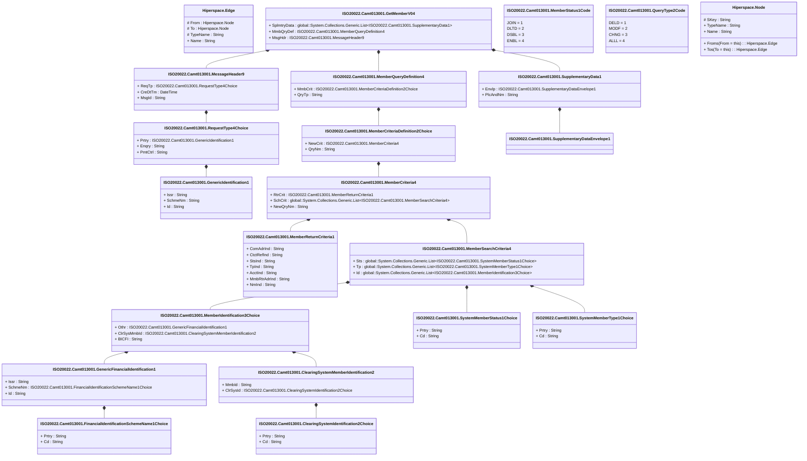

# camt.013.001.04

> The tables below contain descriptions of the members of each Element. 
> The first column indicates the type of the member:
> A ‘#’ indicates that the field is a key to the element, and a ‘+’ indicates that the field is a value.
> The ‘*’ column contains a description for the element member.  
> The ‘@’ column contains any properties for the member.
> The ‘=’ column contains calculated values; or in the case of an enum, the serialized value.

---

## View Hiperspace.Edge
edge between nodes

| |Name|Type|*|@|=|
|-|-|-|-|-|-|
|#|From|Hiperspace.Node||||
|#|To|Hiperspace.Node||||
|#|TypeName|String||||
|+|Name|String||||

---

## Value ISO20022.Camt013001.ClearingSystemIdentification2Choice

| |Name|Type|*|@|=|
|-|-|-|-|-|-|
|+|Prtry|String||XmlElement()||
|+|Cd|String||XmlElement()||
||Validation|Some(String)||XmlIgnore(), JsonIgnore()|validation(validChoice(Prtry,Cd))|

---

## Value ISO20022.Camt013001.ClearingSystemMemberIdentification2

| |Name|Type|*|@|=|
|-|-|-|-|-|-|
|+|MmbId|String||XmlElement()||
|+|ClrSysId|ISO20022.Camt013001.ClearingSystemIdentification2Choice||XmlElement()||
||Validation|Some(String)||XmlIgnore(), JsonIgnore()|validation(validElement(ClrSysId))|

---

## Type ISO20022.Camt013001.Document

| |Name|Type|*|@|=|
|-|-|-|-|-|-|
|+|GetMmb|ISO20022.Camt013001.GetMemberV04||XmlElement()||
||Validation|Some(String)||XmlIgnore(), JsonIgnore()|validation(validElement(GetMmb))|

---

## Value ISO20022.Camt013001.FinancialIdentificationSchemeName1Choice

| |Name|Type|*|@|=|
|-|-|-|-|-|-|
|+|Prtry|String||XmlElement()||
|+|Cd|String||XmlElement()||
||Validation|Some(String)||XmlIgnore(), JsonIgnore()|validation(validChoice(Prtry,Cd))|

---

## Value ISO20022.Camt013001.GenericFinancialIdentification1

| |Name|Type|*|@|=|
|-|-|-|-|-|-|
|+|Issr|String||XmlElement()||
|+|SchmeNm|ISO20022.Camt013001.FinancialIdentificationSchemeName1Choice||XmlElement()||
|+|Id|String||XmlElement()||
||Validation|Some(String)||XmlIgnore(), JsonIgnore()|validation(validElement(SchmeNm))|

---

## Value ISO20022.Camt013001.GenericIdentification1

| |Name|Type|*|@|=|
|-|-|-|-|-|-|
|+|Issr|String||XmlElement()||
|+|SchmeNm|String||XmlElement()||
|+|Id|String||XmlElement()||
||Validation|Some(String)||XmlIgnore(), JsonIgnore()|""|

---

## Aspect ISO20022.Camt013001.GetMemberV04

| |Name|Type|*|@|=|
|-|-|-|-|-|-|
|+|SplmtryData|global::System.Collections.Generic.List<ISO20022.Camt013001.SupplementaryData1>||XmlElement()||
|+|MmbQryDef|ISO20022.Camt013001.MemberQueryDefinition4||XmlElement()||
|+|MsgHdr|ISO20022.Camt013001.MessageHeader9||XmlElement()||
||Validation|Some(String)||XmlIgnore(), JsonIgnore()|validation(validList("""SplmtryData""",SplmtryData),validElement(SplmtryData),validElement(MmbQryDef),validElement(MsgHdr))|

---

## Value ISO20022.Camt013001.MemberCriteria4

| |Name|Type|*|@|=|
|-|-|-|-|-|-|
|+|RtrCrit|ISO20022.Camt013001.MemberReturnCriteria1||XmlElement()||
|+|SchCrit|global::System.Collections.Generic.List<ISO20022.Camt013001.MemberSearchCriteria4>||XmlElement()||
|+|NewQryNm|String||XmlElement()||
||Validation|Some(String)||XmlIgnore(), JsonIgnore()|validation(validElement(RtrCrit),validList("""SchCrit""",SchCrit),validElement(SchCrit))|

---

## Value ISO20022.Camt013001.MemberCriteriaDefinition2Choice

| |Name|Type|*|@|=|
|-|-|-|-|-|-|
|+|NewCrit|ISO20022.Camt013001.MemberCriteria4||XmlElement()||
|+|QryNm|String||XmlElement()||
||Validation|Some(String)||XmlIgnore(), JsonIgnore()|validation(validElement(NewCrit),validChoice(NewCrit,QryNm))|

---

## Value ISO20022.Camt013001.MemberIdentification3Choice

| |Name|Type|*|@|=|
|-|-|-|-|-|-|
|+|Othr|ISO20022.Camt013001.GenericFinancialIdentification1||XmlElement()||
|+|ClrSysMmbId|ISO20022.Camt013001.ClearingSystemMemberIdentification2||XmlElement()||
|+|BICFI|String||XmlElement()||
||Validation|Some(String)||XmlIgnore(), JsonIgnore()|validation(validElement(Othr),validElement(ClrSysMmbId),validPattern("""BICFI""",BICFI,"""[A-Z0-9]{4,4}[A-Z]{2,2}[A-Z0-9]{2,2}([A-Z0-9]{3,3}){0,1}"""),validChoice(Othr,ClrSysMmbId,BICFI))|

---

## Value ISO20022.Camt013001.MemberQueryDefinition4

| |Name|Type|*|@|=|
|-|-|-|-|-|-|
|+|MmbCrit|ISO20022.Camt013001.MemberCriteriaDefinition2Choice||XmlElement()||
|+|QryTp|String||XmlElement()||
||Validation|Some(String)||XmlIgnore(), JsonIgnore()|validation(validElement(MmbCrit))|

---

## Value ISO20022.Camt013001.MemberReturnCriteria1

| |Name|Type|*|@|=|
|-|-|-|-|-|-|
|+|ComAdrInd|String||XmlElement()||
|+|CtctRefInd|String||XmlElement()||
|+|StsInd|String||XmlElement()||
|+|TpInd|String||XmlElement()||
|+|AcctInd|String||XmlElement()||
|+|MmbRtrAdrInd|String||XmlElement()||
|+|NmInd|String||XmlElement()||
||Validation|Some(String)||XmlIgnore(), JsonIgnore()|""|

---

## Value ISO20022.Camt013001.MemberSearchCriteria4

| |Name|Type|*|@|=|
|-|-|-|-|-|-|
|+|Sts|global::System.Collections.Generic.List<ISO20022.Camt013001.SystemMemberStatus1Choice>||XmlElement()||
|+|Tp|global::System.Collections.Generic.List<ISO20022.Camt013001.SystemMemberType1Choice>||XmlElement()||
|+|Id|global::System.Collections.Generic.List<ISO20022.Camt013001.MemberIdentification3Choice>||XmlElement()||
||Validation|Some(String)||XmlIgnore(), JsonIgnore()|validation(validList("""Sts""",Sts),validElement(Sts),validList("""Tp""",Tp),validElement(Tp),validList("""Id""",Id),validElement(Id))|

---

## Enum ISO20022.Camt013001.MemberStatus1Code

| |Name|Type|*|@|=|
|-|-|-|-|-|-|
||JOIN|Int32||XmlEnum("""JOIN""")|1|
||DLTD|Int32||XmlEnum("""DLTD""")|2|
||DSBL|Int32||XmlEnum("""DSBL""")|3|
||ENBL|Int32||XmlEnum("""ENBL""")|4|

---

## Value ISO20022.Camt013001.MessageHeader9

| |Name|Type|*|@|=|
|-|-|-|-|-|-|
|+|ReqTp|ISO20022.Camt013001.RequestType4Choice||XmlElement()||
|+|CreDtTm|DateTime||XmlElement()||
|+|MsgId|String||XmlElement()||
||Validation|Some(String)||XmlIgnore(), JsonIgnore()|validation(validElement(ReqTp))|

---

## Enum ISO20022.Camt013001.QueryType2Code

| |Name|Type|*|@|=|
|-|-|-|-|-|-|
||DELD|Int32||XmlEnum("""DELD""")|1|
||MODF|Int32||XmlEnum("""MODF""")|2|
||CHNG|Int32||XmlEnum("""CHNG""")|3|
||ALLL|Int32||XmlEnum("""ALLL""")|4|

---

## Value ISO20022.Camt013001.RequestType4Choice

| |Name|Type|*|@|=|
|-|-|-|-|-|-|
|+|Prtry|ISO20022.Camt013001.GenericIdentification1||XmlElement()||
|+|Enqry|String||XmlElement()||
|+|PmtCtrl|String||XmlElement()||
||Validation|Some(String)||XmlIgnore(), JsonIgnore()|validation(validElement(Prtry),validChoice(Prtry,Enqry,PmtCtrl))|

---

## Value ISO20022.Camt013001.SupplementaryData1

| |Name|Type|*|@|=|
|-|-|-|-|-|-|
|+|Envlp|ISO20022.Camt013001.SupplementaryDataEnvelope1||XmlElement()||
|+|PlcAndNm|String||XmlElement()||
||Validation|Some(String)||XmlIgnore(), JsonIgnore()|validation(validElement(Envlp))|

---

## Value ISO20022.Camt013001.SupplementaryDataEnvelope1

| |Name|Type|*|@|=|
|-|-|-|-|-|-|
||Validation|Some(String)||XmlIgnore(), JsonIgnore()|""|

---

## Value ISO20022.Camt013001.SystemMemberStatus1Choice

| |Name|Type|*|@|=|
|-|-|-|-|-|-|
|+|Prtry|String||XmlElement()||
|+|Cd|String||XmlElement()||
||Validation|Some(String)||XmlIgnore(), JsonIgnore()|validation(validChoice(Prtry,Cd))|

---

## Value ISO20022.Camt013001.SystemMemberType1Choice

| |Name|Type|*|@|=|
|-|-|-|-|-|-|
|+|Prtry|String||XmlElement()||
|+|Cd|String||XmlElement()||
||Validation|Some(String)||XmlIgnore(), JsonIgnore()|validation(validChoice(Prtry,Cd))|

---

## View Hiperspace.Node
node in a graph view of data

| |Name|Type|*|@|=|
|-|-|-|-|-|-|
|#|SKey|String||||
|+|TypeName|String||||
|+|Name|String||||
||Froms|Hiperspace.Edge|||From = this|
||Tos|Hiperspace.Edge|||To = this|

