# camt.014.001.05

```mermaid
classDiagram
    class Hiperspace.Edge {
        # From  : Hiperspace.Node
        # To  : Hiperspace.Node
        # TypeName  : String
        + Name  : String
    }
    class ISO20022.Camt014001.AccountIdentification4Choice {
        + Othr  : ISO20022.Camt014001.GenericAccountIdentification1
        + IBAN  : String
    }
    ISO20022.Camt014001.AccountIdentification4Choice *-- ISO20022.Camt014001.GenericAccountIdentification1
    class ISO20022.Camt014001.AccountSchemeName1Choice {
        + Prtry  : String
        + Cd  : String
    }
    class ISO20022.Camt014001.CashAccount40 {
        + Prxy  : ISO20022.Camt014001.ProxyAccountIdentification1
        + Nm  : String
        + Ccy  : String
        + Tp  : ISO20022.Camt014001.CashAccountType2Choice
        + Id  : ISO20022.Camt014001.AccountIdentification4Choice
    }
    ISO20022.Camt014001.CashAccount40 *-- ISO20022.Camt014001.ProxyAccountIdentification1
    ISO20022.Camt014001.CashAccount40 *-- ISO20022.Camt014001.CashAccountType2Choice
    ISO20022.Camt014001.CashAccount40 *-- ISO20022.Camt014001.AccountIdentification4Choice
    class ISO20022.Camt014001.CashAccountType2Choice {
        + Prtry  : String
        + Cd  : String
    }
    class ISO20022.Camt014001.ClearingSystemIdentification2Choice {
        + Prtry  : String
        + Cd  : String
    }
    class ISO20022.Camt014001.ClearingSystemMemberIdentification2 {
        + MmbId  : String
        + ClrSysId  : ISO20022.Camt014001.ClearingSystemIdentification2Choice
    }
    ISO20022.Camt014001.ClearingSystemMemberIdentification2 *-- ISO20022.Camt014001.ClearingSystemIdentification2Choice
    class ISO20022.Camt014001.CommunicationAddress10 {
        + EmailAdr  : String
        + FaxNb  : String
        + PhneNb  : String
        + PstlAdr  : ISO20022.Camt014001.LongPostalAddress1Choice
    }
    ISO20022.Camt014001.CommunicationAddress10 *-- ISO20022.Camt014001.LongPostalAddress1Choice
    class ISO20022.Camt014001.ContactIdentificationAndAddress2 {
        + ComAdr  : ISO20022.Camt014001.CommunicationAddress10
        + Role  : ISO20022.Camt014001.PaymentRole1Choice
        + Nm  : String
    }
    ISO20022.Camt014001.ContactIdentificationAndAddress2 *-- ISO20022.Camt014001.CommunicationAddress10
    ISO20022.Camt014001.ContactIdentificationAndAddress2 *-- ISO20022.Camt014001.PaymentRole1Choice
    class ISO20022.Camt014001.ErrorHandling1Choice {
        + Prtry  : String
        + Cd  : String
    }
    class ISO20022.Camt014001.ErrorHandling1Code {
        X050 = 1
        X030 = 2
        X020 = 3
    }
    class ISO20022.Camt014001.ErrorHandling3 {
        + Desc  : String
        + Err  : ISO20022.Camt014001.ErrorHandling1Choice
    }
    ISO20022.Camt014001.ErrorHandling3 *-- ISO20022.Camt014001.ErrorHandling1Choice
    class ISO20022.Camt014001.FinancialIdentificationSchemeName1Choice {
        + Prtry  : String
        + Cd  : String
    }
    class ISO20022.Camt014001.GenericAccountIdentification1 {
        + Issr  : String
        + SchmeNm  : ISO20022.Camt014001.AccountSchemeName1Choice
        + Id  : String
    }
    ISO20022.Camt014001.GenericAccountIdentification1 *-- ISO20022.Camt014001.AccountSchemeName1Choice
    class ISO20022.Camt014001.GenericFinancialIdentification1 {
        + Issr  : String
        + SchmeNm  : ISO20022.Camt014001.FinancialIdentificationSchemeName1Choice
        + Id  : String
    }
    ISO20022.Camt014001.GenericFinancialIdentification1 *-- ISO20022.Camt014001.FinancialIdentificationSchemeName1Choice
    class ISO20022.Camt014001.GenericIdentification1 {
        + Issr  : String
        + SchmeNm  : String
        + Id  : String
    }
    class ISO20022.Camt014001.LongPostalAddress1Choice {
        + Strd  : ISO20022.Camt014001.StructuredLongPostalAddress1
        + Ustrd  : String
    }
    ISO20022.Camt014001.LongPostalAddress1Choice *-- ISO20022.Camt014001.StructuredLongPostalAddress1
    class ISO20022.Camt014001.Member7 {
        + ComAdr  : ISO20022.Camt014001.CommunicationAddress10
        + CtctRef  : global::System.Collections.Generic.List~ISO20022.Camt014001.ContactIdentificationAndAddress2~
        + Sts  : ISO20022.Camt014001.SystemMemberStatus1Choice
        + Tp  : ISO20022.Camt014001.SystemMemberType1Choice
        + Acct  : global::System.Collections.Generic.List~ISO20022.Camt014001.CashAccount40~
        + RtrAdr  : global::System.Collections.Generic.List~ISO20022.Camt014001.MemberIdentification3Choice~
        + Nm  : String
    }
    ISO20022.Camt014001.Member7 *-- ISO20022.Camt014001.CommunicationAddress10
    ISO20022.Camt014001.Member7 *-- ISO20022.Camt014001.ContactIdentificationAndAddress2
    ISO20022.Camt014001.Member7 *-- ISO20022.Camt014001.SystemMemberStatus1Choice
    ISO20022.Camt014001.Member7 *-- ISO20022.Camt014001.SystemMemberType1Choice
    ISO20022.Camt014001.Member7 *-- ISO20022.Camt014001.CashAccount40
    ISO20022.Camt014001.Member7 *-- ISO20022.Camt014001.MemberIdentification3Choice
    class ISO20022.Camt014001.MemberIdentification3Choice {
        + Othr  : ISO20022.Camt014001.GenericFinancialIdentification1
        + ClrSysMmbId  : ISO20022.Camt014001.ClearingSystemMemberIdentification2
        + BICFI  : String
    }
    ISO20022.Camt014001.MemberIdentification3Choice *-- ISO20022.Camt014001.GenericFinancialIdentification1
    ISO20022.Camt014001.MemberIdentification3Choice *-- ISO20022.Camt014001.ClearingSystemMemberIdentification2
    class ISO20022.Camt014001.MemberReport6 {
        + MmbOrErr  : ISO20022.Camt014001.MemberReportOrError8Choice
        + MmbId  : ISO20022.Camt014001.MemberIdentification3Choice
    }
    ISO20022.Camt014001.MemberReport6 *-- ISO20022.Camt014001.MemberReportOrError8Choice
    ISO20022.Camt014001.MemberReport6 *-- ISO20022.Camt014001.MemberIdentification3Choice
    class ISO20022.Camt014001.MemberReportOrError7Choice {
        + OprlErr  : global::System.Collections.Generic.List~ISO20022.Camt014001.ErrorHandling3~
        + Rpt  : global::System.Collections.Generic.List~ISO20022.Camt014001.MemberReport6~
    }
    ISO20022.Camt014001.MemberReportOrError7Choice *-- ISO20022.Camt014001.ErrorHandling3
    ISO20022.Camt014001.MemberReportOrError7Choice *-- ISO20022.Camt014001.MemberReport6
    class ISO20022.Camt014001.MemberReportOrError8Choice {
        + BizErr  : ISO20022.Camt014001.ErrorHandling3
        + Mmb  : ISO20022.Camt014001.Member7
    }
    ISO20022.Camt014001.MemberReportOrError8Choice *-- ISO20022.Camt014001.ErrorHandling3
    ISO20022.Camt014001.MemberReportOrError8Choice *-- ISO20022.Camt014001.Member7
    class ISO20022.Camt014001.MemberStatus1Code {
        JOIN = 1
        DLTD = 2
        DSBL = 3
        ENBL = 4
    }
    class ISO20022.Camt014001.MessageHeader7 {
        + QryNm  : String
        + OrgnlBizQry  : ISO20022.Camt014001.OriginalBusinessQuery1
        + ReqTp  : ISO20022.Camt014001.RequestType4Choice
        + CreDtTm  : DateTime
        + MsgId  : String
    }
    ISO20022.Camt014001.MessageHeader7 *-- ISO20022.Camt014001.OriginalBusinessQuery1
    ISO20022.Camt014001.MessageHeader7 *-- ISO20022.Camt014001.RequestType4Choice
    class ISO20022.Camt014001.OriginalBusinessQuery1 {
        + CreDtTm  : DateTime
        + MsgNmId  : String
        + MsgId  : String
    }
    class ISO20022.Camt014001.PaymentRole1Choice {
        + Prtry  : String
        + Cd  : String
    }
    class ISO20022.Camt014001.ProxyAccountIdentification1 {
        + Id  : String
        + Tp  : ISO20022.Camt014001.ProxyAccountType1Choice
    }
    ISO20022.Camt014001.ProxyAccountIdentification1 *-- ISO20022.Camt014001.ProxyAccountType1Choice
    class ISO20022.Camt014001.ProxyAccountType1Choice {
        + Prtry  : String
        + Cd  : String
    }
    class ISO20022.Camt014001.RequestType4Choice {
        + Prtry  : ISO20022.Camt014001.GenericIdentification1
        + Enqry  : String
        + PmtCtrl  : String
    }
    ISO20022.Camt014001.RequestType4Choice *-- ISO20022.Camt014001.GenericIdentification1
    class ISO20022.Camt014001.ReturnMemberV05 {
        + SplmtryData  : global::System.Collections.Generic.List~ISO20022.Camt014001.SupplementaryData1~
        + RptOrErr  : ISO20022.Camt014001.MemberReportOrError7Choice
        + MsgHdr  : ISO20022.Camt014001.MessageHeader7
    }
    ISO20022.Camt014001.ReturnMemberV05 *-- ISO20022.Camt014001.SupplementaryData1
    ISO20022.Camt014001.ReturnMemberV05 *-- ISO20022.Camt014001.MemberReportOrError7Choice
    ISO20022.Camt014001.ReturnMemberV05 *-- ISO20022.Camt014001.MessageHeader7
    class ISO20022.Camt014001.StructuredLongPostalAddress1 {
        + POB  : String
        + PstCdId  : String
        + Ctry  : String
        + CtyId  : String
        + Stat  : String
        + RgnId  : String
        + DstrctNm  : String
        + TwnNm  : String
        + Flr  : String
        + StrtBldgId  : String
        + StrtNm  : String
        + BldgNm  : String
    }
    class ISO20022.Camt014001.SupplementaryData1 {
        + Envlp  : ISO20022.Camt014001.SupplementaryDataEnvelope1
        + PlcAndNm  : String
    }
    ISO20022.Camt014001.SupplementaryData1 *-- ISO20022.Camt014001.SupplementaryDataEnvelope1
    class ISO20022.Camt014001.SupplementaryDataEnvelope1 {
    }
    class ISO20022.Camt014001.SystemMemberStatus1Choice {
        + Prtry  : String
        + Cd  : String
    }
    class ISO20022.Camt014001.SystemMemberType1Choice {
        + Prtry  : String
        + Cd  : String
    }
    class Hiperspace.Node {
        # SKey  : String
        + TypeName  : String
        + Name  : String
        + Froms (From = this) : Hiperspace.Edge
        + Tos (To = this) : Hiperspace.Edge
    }
```

> The tables below contain descriptions of the members of each Element. 
> The first column indicates the type of the member:
> A ‘#’ indicates that the field is a key to the element, and a ‘+’ indicates that the field is a value.
> The ‘*’ column contains a description for the element member.  
> The ‘@’ column contains any properties for the member.
> The ‘=’ column contains calculated values; or in the case of an enum, the serialized value.

---

## View Hiperspace.Edge
edge between nodes

| |Name|Type|*|@|=|
|-|-|-|-|-|-|
|#|From|Hiperspace.Node||||
|#|To|Hiperspace.Node||||
|#|TypeName|String||||
|+|Name|String||||

---

## Value ISO20022.Camt014001.AccountIdentification4Choice

| |Name|Type|*|@|=|
|-|-|-|-|-|-|
|+|Othr|ISO20022.Camt014001.GenericAccountIdentification1||XmlElement()||
|+|IBAN|String||XmlElement()||
||Validation|Some(String)||XmlIgnore(), JsonIgnore()|validation(validElement(Othr),validPattern("""IBAN""",IBAN,"""[A-Z]{2,2}[0-9]{2,2}[a-zA-Z0-9]{1,30}"""),validChoice(Othr,IBAN))|

---

## Value ISO20022.Camt014001.AccountSchemeName1Choice

| |Name|Type|*|@|=|
|-|-|-|-|-|-|
|+|Prtry|String||XmlElement()||
|+|Cd|String||XmlElement()||
||Validation|Some(String)||XmlIgnore(), JsonIgnore()|validation(validChoice(Prtry,Cd))|

---

## Value ISO20022.Camt014001.CashAccount40

| |Name|Type|*|@|=|
|-|-|-|-|-|-|
|+|Prxy|ISO20022.Camt014001.ProxyAccountIdentification1||XmlElement()||
|+|Nm|String||XmlElement()||
|+|Ccy|String||XmlElement()||
|+|Tp|ISO20022.Camt014001.CashAccountType2Choice||XmlElement()||
|+|Id|ISO20022.Camt014001.AccountIdentification4Choice||XmlElement()||
||Validation|Some(String)||XmlIgnore(), JsonIgnore()|validation(validElement(Prxy),validPattern("""Ccy""",Ccy,"""[A-Z]{3,3}"""),validElement(Tp),validElement(Id))|

---

## Value ISO20022.Camt014001.CashAccountType2Choice

| |Name|Type|*|@|=|
|-|-|-|-|-|-|
|+|Prtry|String||XmlElement()||
|+|Cd|String||XmlElement()||
||Validation|Some(String)||XmlIgnore(), JsonIgnore()|validation(validChoice(Prtry,Cd))|

---

## Value ISO20022.Camt014001.ClearingSystemIdentification2Choice

| |Name|Type|*|@|=|
|-|-|-|-|-|-|
|+|Prtry|String||XmlElement()||
|+|Cd|String||XmlElement()||
||Validation|Some(String)||XmlIgnore(), JsonIgnore()|validation(validChoice(Prtry,Cd))|

---

## Value ISO20022.Camt014001.ClearingSystemMemberIdentification2

| |Name|Type|*|@|=|
|-|-|-|-|-|-|
|+|MmbId|String||XmlElement()||
|+|ClrSysId|ISO20022.Camt014001.ClearingSystemIdentification2Choice||XmlElement()||
||Validation|Some(String)||XmlIgnore(), JsonIgnore()|validation(validElement(ClrSysId))|

---

## Value ISO20022.Camt014001.CommunicationAddress10

| |Name|Type|*|@|=|
|-|-|-|-|-|-|
|+|EmailAdr|String||XmlElement()||
|+|FaxNb|String||XmlElement()||
|+|PhneNb|String||XmlElement()||
|+|PstlAdr|ISO20022.Camt014001.LongPostalAddress1Choice||XmlElement()||
||Validation|Some(String)||XmlIgnore(), JsonIgnore()|validation(validPattern("""FaxNb""",FaxNb,"""\+[0-9]{1,3}-[0-9()+\-]{1,30}"""),validPattern("""PhneNb""",PhneNb,"""\+[0-9]{1,3}-[0-9()+\-]{1,30}"""),validElement(PstlAdr))|

---

## Value ISO20022.Camt014001.ContactIdentificationAndAddress2

| |Name|Type|*|@|=|
|-|-|-|-|-|-|
|+|ComAdr|ISO20022.Camt014001.CommunicationAddress10||XmlElement()||
|+|Role|ISO20022.Camt014001.PaymentRole1Choice||XmlElement()||
|+|Nm|String||XmlElement()||
||Validation|Some(String)||XmlIgnore(), JsonIgnore()|validation(validElement(ComAdr),validElement(Role))|

---

## Type ISO20022.Camt014001.Document

| |Name|Type|*|@|=|
|-|-|-|-|-|-|
|+|RtrMmb|ISO20022.Camt014001.ReturnMemberV05||XmlElement()||
||Validation|Some(String)||XmlIgnore(), JsonIgnore()|validation(validElement(RtrMmb))|

---

## Value ISO20022.Camt014001.ErrorHandling1Choice

| |Name|Type|*|@|=|
|-|-|-|-|-|-|
|+|Prtry|String||XmlElement()||
|+|Cd|String||XmlElement()||
||Validation|Some(String)||XmlIgnore(), JsonIgnore()|validation(validPattern("""Prtry""",Prtry,"""[a-zA-Z0-9]{1,4}"""),validChoice(Prtry,Cd))|

---

## Enum ISO20022.Camt014001.ErrorHandling1Code

| |Name|Type|*|@|=|
|-|-|-|-|-|-|
||X050|Int32||XmlEnum("""X050""")|1|
||X030|Int32||XmlEnum("""X030""")|2|
||X020|Int32||XmlEnum("""X020""")|3|

---

## Value ISO20022.Camt014001.ErrorHandling3

| |Name|Type|*|@|=|
|-|-|-|-|-|-|
|+|Desc|String||XmlElement()||
|+|Err|ISO20022.Camt014001.ErrorHandling1Choice||XmlElement()||
||Validation|Some(String)||XmlIgnore(), JsonIgnore()|validation(validElement(Err))|

---

## Value ISO20022.Camt014001.FinancialIdentificationSchemeName1Choice

| |Name|Type|*|@|=|
|-|-|-|-|-|-|
|+|Prtry|String||XmlElement()||
|+|Cd|String||XmlElement()||
||Validation|Some(String)||XmlIgnore(), JsonIgnore()|validation(validChoice(Prtry,Cd))|

---

## Value ISO20022.Camt014001.GenericAccountIdentification1

| |Name|Type|*|@|=|
|-|-|-|-|-|-|
|+|Issr|String||XmlElement()||
|+|SchmeNm|ISO20022.Camt014001.AccountSchemeName1Choice||XmlElement()||
|+|Id|String||XmlElement()||
||Validation|Some(String)||XmlIgnore(), JsonIgnore()|validation(validElement(SchmeNm))|

---

## Value ISO20022.Camt014001.GenericFinancialIdentification1

| |Name|Type|*|@|=|
|-|-|-|-|-|-|
|+|Issr|String||XmlElement()||
|+|SchmeNm|ISO20022.Camt014001.FinancialIdentificationSchemeName1Choice||XmlElement()||
|+|Id|String||XmlElement()||
||Validation|Some(String)||XmlIgnore(), JsonIgnore()|validation(validElement(SchmeNm))|

---

## Value ISO20022.Camt014001.GenericIdentification1

| |Name|Type|*|@|=|
|-|-|-|-|-|-|
|+|Issr|String||XmlElement()||
|+|SchmeNm|String||XmlElement()||
|+|Id|String||XmlElement()||
||Validation|Some(String)||XmlIgnore(), JsonIgnore()|""|

---

## Value ISO20022.Camt014001.LongPostalAddress1Choice

| |Name|Type|*|@|=|
|-|-|-|-|-|-|
|+|Strd|ISO20022.Camt014001.StructuredLongPostalAddress1||XmlElement()||
|+|Ustrd|String||XmlElement()||
||Validation|Some(String)||XmlIgnore(), JsonIgnore()|validation(validElement(Strd),validChoice(Strd,Ustrd))|

---

## Value ISO20022.Camt014001.Member7

| |Name|Type|*|@|=|
|-|-|-|-|-|-|
|+|ComAdr|ISO20022.Camt014001.CommunicationAddress10||XmlElement()||
|+|CtctRef|global::System.Collections.Generic.List<ISO20022.Camt014001.ContactIdentificationAndAddress2>||XmlElement()||
|+|Sts|ISO20022.Camt014001.SystemMemberStatus1Choice||XmlElement()||
|+|Tp|ISO20022.Camt014001.SystemMemberType1Choice||XmlElement()||
|+|Acct|global::System.Collections.Generic.List<ISO20022.Camt014001.CashAccount40>||XmlElement()||
|+|RtrAdr|global::System.Collections.Generic.List<ISO20022.Camt014001.MemberIdentification3Choice>||XmlElement()||
|+|Nm|String||XmlElement()||
||Validation|Some(String)||XmlIgnore(), JsonIgnore()|validation(validElement(ComAdr),validList("""CtctRef""",CtctRef),validElement(CtctRef),validElement(Sts),validElement(Tp),validList("""Acct""",Acct),validElement(Acct),validList("""RtrAdr""",RtrAdr),validElement(RtrAdr))|

---

## Value ISO20022.Camt014001.MemberIdentification3Choice

| |Name|Type|*|@|=|
|-|-|-|-|-|-|
|+|Othr|ISO20022.Camt014001.GenericFinancialIdentification1||XmlElement()||
|+|ClrSysMmbId|ISO20022.Camt014001.ClearingSystemMemberIdentification2||XmlElement()||
|+|BICFI|String||XmlElement()||
||Validation|Some(String)||XmlIgnore(), JsonIgnore()|validation(validElement(Othr),validElement(ClrSysMmbId),validPattern("""BICFI""",BICFI,"""[A-Z0-9]{4,4}[A-Z]{2,2}[A-Z0-9]{2,2}([A-Z0-9]{3,3}){0,1}"""),validChoice(Othr,ClrSysMmbId,BICFI))|

---

## Value ISO20022.Camt014001.MemberReport6

| |Name|Type|*|@|=|
|-|-|-|-|-|-|
|+|MmbOrErr|ISO20022.Camt014001.MemberReportOrError8Choice||XmlElement()||
|+|MmbId|ISO20022.Camt014001.MemberIdentification3Choice||XmlElement()||
||Validation|Some(String)||XmlIgnore(), JsonIgnore()|validation(validElement(MmbOrErr),validElement(MmbId))|

---

## Value ISO20022.Camt014001.MemberReportOrError7Choice

| |Name|Type|*|@|=|
|-|-|-|-|-|-|
|+|OprlErr|global::System.Collections.Generic.List<ISO20022.Camt014001.ErrorHandling3>||XmlElement()||
|+|Rpt|global::System.Collections.Generic.List<ISO20022.Camt014001.MemberReport6>||XmlElement()||
||Validation|Some(String)||XmlIgnore(), JsonIgnore()|validation(validRequired("""OprlErr""",OprlErr),validList("""OprlErr""",OprlErr),validElement(OprlErr),validRequired("""Rpt""",Rpt),validList("""Rpt""",Rpt),validElement(Rpt),validChoice(OprlErr,Rpt))|

---

## Value ISO20022.Camt014001.MemberReportOrError8Choice

| |Name|Type|*|@|=|
|-|-|-|-|-|-|
|+|BizErr|ISO20022.Camt014001.ErrorHandling3||XmlElement()||
|+|Mmb|ISO20022.Camt014001.Member7||XmlElement()||
||Validation|Some(String)||XmlIgnore(), JsonIgnore()|validation(validElement(BizErr),validElement(Mmb),validChoice(BizErr,Mmb))|

---

## Enum ISO20022.Camt014001.MemberStatus1Code

| |Name|Type|*|@|=|
|-|-|-|-|-|-|
||JOIN|Int32||XmlEnum("""JOIN""")|1|
||DLTD|Int32||XmlEnum("""DLTD""")|2|
||DSBL|Int32||XmlEnum("""DSBL""")|3|
||ENBL|Int32||XmlEnum("""ENBL""")|4|

---

## Value ISO20022.Camt014001.MessageHeader7

| |Name|Type|*|@|=|
|-|-|-|-|-|-|
|+|QryNm|String||XmlElement()||
|+|OrgnlBizQry|ISO20022.Camt014001.OriginalBusinessQuery1||XmlElement()||
|+|ReqTp|ISO20022.Camt014001.RequestType4Choice||XmlElement()||
|+|CreDtTm|DateTime||XmlElement()||
|+|MsgId|String||XmlElement()||
||Validation|Some(String)||XmlIgnore(), JsonIgnore()|validation(validElement(OrgnlBizQry),validElement(ReqTp))|

---

## Value ISO20022.Camt014001.OriginalBusinessQuery1

| |Name|Type|*|@|=|
|-|-|-|-|-|-|
|+|CreDtTm|DateTime||XmlElement()||
|+|MsgNmId|String||XmlElement()||
|+|MsgId|String||XmlElement()||
||Validation|Some(String)||XmlIgnore(), JsonIgnore()|""|

---

## Value ISO20022.Camt014001.PaymentRole1Choice

| |Name|Type|*|@|=|
|-|-|-|-|-|-|
|+|Prtry|String||XmlElement()||
|+|Cd|String||XmlElement()||
||Validation|Some(String)||XmlIgnore(), JsonIgnore()|validation(validChoice(Prtry,Cd))|

---

## Value ISO20022.Camt014001.ProxyAccountIdentification1

| |Name|Type|*|@|=|
|-|-|-|-|-|-|
|+|Id|String||XmlElement()||
|+|Tp|ISO20022.Camt014001.ProxyAccountType1Choice||XmlElement()||
||Validation|Some(String)||XmlIgnore(), JsonIgnore()|validation(validElement(Tp))|

---

## Value ISO20022.Camt014001.ProxyAccountType1Choice

| |Name|Type|*|@|=|
|-|-|-|-|-|-|
|+|Prtry|String||XmlElement()||
|+|Cd|String||XmlElement()||
||Validation|Some(String)||XmlIgnore(), JsonIgnore()|validation(validChoice(Prtry,Cd))|

---

## Value ISO20022.Camt014001.RequestType4Choice

| |Name|Type|*|@|=|
|-|-|-|-|-|-|
|+|Prtry|ISO20022.Camt014001.GenericIdentification1||XmlElement()||
|+|Enqry|String||XmlElement()||
|+|PmtCtrl|String||XmlElement()||
||Validation|Some(String)||XmlIgnore(), JsonIgnore()|validation(validElement(Prtry),validChoice(Prtry,Enqry,PmtCtrl))|

---

## Aspect ISO20022.Camt014001.ReturnMemberV05

| |Name|Type|*|@|=|
|-|-|-|-|-|-|
|+|SplmtryData|global::System.Collections.Generic.List<ISO20022.Camt014001.SupplementaryData1>||XmlElement()||
|+|RptOrErr|ISO20022.Camt014001.MemberReportOrError7Choice||XmlElement()||
|+|MsgHdr|ISO20022.Camt014001.MessageHeader7||XmlElement()||
||Validation|Some(String)||XmlIgnore(), JsonIgnore()|validation(validList("""SplmtryData""",SplmtryData),validElement(SplmtryData),validElement(RptOrErr),validElement(MsgHdr))|

---

## Value ISO20022.Camt014001.StructuredLongPostalAddress1

| |Name|Type|*|@|=|
|-|-|-|-|-|-|
|+|POB|String||XmlElement()||
|+|PstCdId|String||XmlElement()||
|+|Ctry|String||XmlElement()||
|+|CtyId|String||XmlElement()||
|+|Stat|String||XmlElement()||
|+|RgnId|String||XmlElement()||
|+|DstrctNm|String||XmlElement()||
|+|TwnNm|String||XmlElement()||
|+|Flr|String||XmlElement()||
|+|StrtBldgId|String||XmlElement()||
|+|StrtNm|String||XmlElement()||
|+|BldgNm|String||XmlElement()||
||Validation|Some(String)||XmlIgnore(), JsonIgnore()|validation(validPattern("""Ctry""",Ctry,"""[A-Z]{2,2}"""))|

---

## Value ISO20022.Camt014001.SupplementaryData1

| |Name|Type|*|@|=|
|-|-|-|-|-|-|
|+|Envlp|ISO20022.Camt014001.SupplementaryDataEnvelope1||XmlElement()||
|+|PlcAndNm|String||XmlElement()||
||Validation|Some(String)||XmlIgnore(), JsonIgnore()|validation(validElement(Envlp))|

---

## Value ISO20022.Camt014001.SupplementaryDataEnvelope1

| |Name|Type|*|@|=|
|-|-|-|-|-|-|
||Validation|Some(String)||XmlIgnore(), JsonIgnore()|""|

---

## Value ISO20022.Camt014001.SystemMemberStatus1Choice

| |Name|Type|*|@|=|
|-|-|-|-|-|-|
|+|Prtry|String||XmlElement()||
|+|Cd|String||XmlElement()||
||Validation|Some(String)||XmlIgnore(), JsonIgnore()|validation(validChoice(Prtry,Cd))|

---

## Value ISO20022.Camt014001.SystemMemberType1Choice

| |Name|Type|*|@|=|
|-|-|-|-|-|-|
|+|Prtry|String||XmlElement()||
|+|Cd|String||XmlElement()||
||Validation|Some(String)||XmlIgnore(), JsonIgnore()|validation(validChoice(Prtry,Cd))|

---

## View Hiperspace.Node
node in a graph view of data

| |Name|Type|*|@|=|
|-|-|-|-|-|-|
|#|SKey|String||||
|+|TypeName|String||||
|+|Name|String||||
||Froms|Hiperspace.Edge|||From = this|
||Tos|Hiperspace.Edge|||To = this|

