# camt.015.001.04

```mermaid
classDiagram
    class Hiperspace.Edge {
        # From  : Hiperspace.Node
        # To  : Hiperspace.Node
        # TypeName  : String
        + Name  : String
    }
    class ISO20022.Camt015001.ClearingSystemIdentification2Choice {
        + Prtry  : String
        + Cd  : String
    }
    class ISO20022.Camt015001.ClearingSystemMemberIdentification2 {
        + MmbId  : String
        + ClrSysId  : ISO20022.Camt015001.ClearingSystemIdentification2Choice
    }
    ISO20022.Camt015001.ClearingSystemMemberIdentification2 *-- ISO20022.Camt015001.ClearingSystemIdentification2Choice
    class ISO20022.Camt015001.CommunicationAddress8 {
        + EmailAdr  : String
        + FaxNb  : String
        + PhneNb  : String
        + PstlAdr  : ISO20022.Camt015001.LongPostalAddress1Choice
    }
    ISO20022.Camt015001.CommunicationAddress8 *-- ISO20022.Camt015001.LongPostalAddress1Choice
    class ISO20022.Camt015001.ContactIdentificationAndAddress1 {
        + ComAdr  : ISO20022.Camt015001.CommunicationAddress8
        + Role  : String
        + Nm  : String
    }
    ISO20022.Camt015001.ContactIdentificationAndAddress1 *-- ISO20022.Camt015001.CommunicationAddress8
    class ISO20022.Camt015001.FinancialIdentificationSchemeName1Choice {
        + Prtry  : String
        + Cd  : String
    }
    class ISO20022.Camt015001.GenericFinancialIdentification1 {
        + Issr  : String
        + SchmeNm  : ISO20022.Camt015001.FinancialIdentificationSchemeName1Choice
        + Id  : String
    }
    ISO20022.Camt015001.GenericFinancialIdentification1 *-- ISO20022.Camt015001.FinancialIdentificationSchemeName1Choice
    class ISO20022.Camt015001.LongPostalAddress1Choice {
        + Strd  : ISO20022.Camt015001.StructuredLongPostalAddress1
        + Ustrd  : String
    }
    ISO20022.Camt015001.LongPostalAddress1Choice *-- ISO20022.Camt015001.StructuredLongPostalAddress1
    class ISO20022.Camt015001.Member6 {
        + ComAdr  : ISO20022.Camt015001.CommunicationAddress8
        + CtctRef  : global::System.Collections.Generic.List~ISO20022.Camt015001.ContactIdentificationAndAddress1~
        + MmbRtrAdr  : global::System.Collections.Generic.List~ISO20022.Camt015001.MemberIdentification3Choice~
    }
    ISO20022.Camt015001.Member6 *-- ISO20022.Camt015001.CommunicationAddress8
    ISO20022.Camt015001.Member6 *-- ISO20022.Camt015001.ContactIdentificationAndAddress1
    ISO20022.Camt015001.Member6 *-- ISO20022.Camt015001.MemberIdentification3Choice
    class ISO20022.Camt015001.MemberIdentification3Choice {
        + Othr  : ISO20022.Camt015001.GenericFinancialIdentification1
        + ClrSysMmbId  : ISO20022.Camt015001.ClearingSystemMemberIdentification2
        + BICFI  : String
    }
    ISO20022.Camt015001.MemberIdentification3Choice *-- ISO20022.Camt015001.GenericFinancialIdentification1
    ISO20022.Camt015001.MemberIdentification3Choice *-- ISO20022.Camt015001.ClearingSystemMemberIdentification2
    class ISO20022.Camt015001.MessageHeader1 {
        + CreDtTm  : DateTime
        + MsgId  : String
    }
    class ISO20022.Camt015001.ModifyMemberV04 {
        + SplmtryData  : global::System.Collections.Generic.List~ISO20022.Camt015001.SupplementaryData1~
        + NewMmbValSet  : ISO20022.Camt015001.Member6
        + MmbId  : ISO20022.Camt015001.MemberIdentification3Choice
        + MsgHdr  : ISO20022.Camt015001.MessageHeader1
    }
    ISO20022.Camt015001.ModifyMemberV04 *-- ISO20022.Camt015001.SupplementaryData1
    ISO20022.Camt015001.ModifyMemberV04 *-- ISO20022.Camt015001.Member6
    ISO20022.Camt015001.ModifyMemberV04 *-- ISO20022.Camt015001.MemberIdentification3Choice
    ISO20022.Camt015001.ModifyMemberV04 *-- ISO20022.Camt015001.MessageHeader1
    class ISO20022.Camt015001.PaymentRole1Code {
        STMG = 1
        BKMG = 2
        REDR = 3
        PYMG = 4
        LMMG = 5
        LQMG = 6
    }
    class ISO20022.Camt015001.StructuredLongPostalAddress1 {
        + POB  : String
        + PstCdId  : String
        + Ctry  : String
        + CtyId  : String
        + Stat  : String
        + RgnId  : String
        + DstrctNm  : String
        + TwnNm  : String
        + Flr  : String
        + StrtBldgId  : String
        + StrtNm  : String
        + BldgNm  : String
    }
    class ISO20022.Camt015001.SupplementaryData1 {
        + Envlp  : ISO20022.Camt015001.SupplementaryDataEnvelope1
        + PlcAndNm  : String
    }
    ISO20022.Camt015001.SupplementaryData1 *-- ISO20022.Camt015001.SupplementaryDataEnvelope1
    class ISO20022.Camt015001.SupplementaryDataEnvelope1 {
    }
    class Hiperspace.Node {
        # SKey  : String
        + TypeName  : String
        + Name  : String
        + Froms (From = this) : Hiperspace.Edge
        + Tos (To = this) : Hiperspace.Edge
    }
```

> The tables below contain descriptions of the members of each Element. 
> The first column indicates the type of the member:
> A ‘#’ indicates that the field is a key to the element, and a ‘+’ indicates that the field is a value.
> The ‘*’ column contains a description for the element member.  
> The ‘@’ column contains any properties for the member.
> The ‘=’ column contains calculated values; or in the case of an enum, the serialized value.

---

## View Hiperspace.Edge
edge between nodes

| |Name|Type|*|@|=|
|-|-|-|-|-|-|
|#|From|Hiperspace.Node||||
|#|To|Hiperspace.Node||||
|#|TypeName|String||||
|+|Name|String||||

---

## Value ISO20022.Camt015001.ClearingSystemIdentification2Choice

| |Name|Type|*|@|=|
|-|-|-|-|-|-|
|+|Prtry|String||XmlElement()||
|+|Cd|String||XmlElement()||
||Validation|Some(String)||XmlIgnore(), JsonIgnore()|validation(validChoice(Prtry,Cd))|

---

## Value ISO20022.Camt015001.ClearingSystemMemberIdentification2

| |Name|Type|*|@|=|
|-|-|-|-|-|-|
|+|MmbId|String||XmlElement()||
|+|ClrSysId|ISO20022.Camt015001.ClearingSystemIdentification2Choice||XmlElement()||
||Validation|Some(String)||XmlIgnore(), JsonIgnore()|validation(validElement(ClrSysId))|

---

## Value ISO20022.Camt015001.CommunicationAddress8

| |Name|Type|*|@|=|
|-|-|-|-|-|-|
|+|EmailAdr|String||XmlElement()||
|+|FaxNb|String||XmlElement()||
|+|PhneNb|String||XmlElement()||
|+|PstlAdr|ISO20022.Camt015001.LongPostalAddress1Choice||XmlElement()||
||Validation|Some(String)||XmlIgnore(), JsonIgnore()|validation(validPattern("""FaxNb""",FaxNb,"""\+[0-9]{1,3}-[0-9()+\-]{1,30}"""),validPattern("""PhneNb""",PhneNb,"""\+[0-9]{1,3}-[0-9()+\-]{1,30}"""),validElement(PstlAdr))|

---

## Value ISO20022.Camt015001.ContactIdentificationAndAddress1

| |Name|Type|*|@|=|
|-|-|-|-|-|-|
|+|ComAdr|ISO20022.Camt015001.CommunicationAddress8||XmlElement()||
|+|Role|String||XmlElement()||
|+|Nm|String||XmlElement()||
||Validation|Some(String)||XmlIgnore(), JsonIgnore()|validation(validElement(ComAdr))|

---

## Type ISO20022.Camt015001.Document

| |Name|Type|*|@|=|
|-|-|-|-|-|-|
|+|ModfyMmb|ISO20022.Camt015001.ModifyMemberV04||XmlElement()||
||Validation|Some(String)||XmlIgnore(), JsonIgnore()|validation(validElement(ModfyMmb))|

---

## Value ISO20022.Camt015001.FinancialIdentificationSchemeName1Choice

| |Name|Type|*|@|=|
|-|-|-|-|-|-|
|+|Prtry|String||XmlElement()||
|+|Cd|String||XmlElement()||
||Validation|Some(String)||XmlIgnore(), JsonIgnore()|validation(validChoice(Prtry,Cd))|

---

## Value ISO20022.Camt015001.GenericFinancialIdentification1

| |Name|Type|*|@|=|
|-|-|-|-|-|-|
|+|Issr|String||XmlElement()||
|+|SchmeNm|ISO20022.Camt015001.FinancialIdentificationSchemeName1Choice||XmlElement()||
|+|Id|String||XmlElement()||
||Validation|Some(String)||XmlIgnore(), JsonIgnore()|validation(validElement(SchmeNm))|

---

## Value ISO20022.Camt015001.LongPostalAddress1Choice

| |Name|Type|*|@|=|
|-|-|-|-|-|-|
|+|Strd|ISO20022.Camt015001.StructuredLongPostalAddress1||XmlElement()||
|+|Ustrd|String||XmlElement()||
||Validation|Some(String)||XmlIgnore(), JsonIgnore()|validation(validElement(Strd),validChoice(Strd,Ustrd))|

---

## Value ISO20022.Camt015001.Member6

| |Name|Type|*|@|=|
|-|-|-|-|-|-|
|+|ComAdr|ISO20022.Camt015001.CommunicationAddress8||XmlElement()||
|+|CtctRef|global::System.Collections.Generic.List<ISO20022.Camt015001.ContactIdentificationAndAddress1>||XmlElement()||
|+|MmbRtrAdr|global::System.Collections.Generic.List<ISO20022.Camt015001.MemberIdentification3Choice>||XmlElement()||
||Validation|Some(String)||XmlIgnore(), JsonIgnore()|validation(validElement(ComAdr),validList("""CtctRef""",CtctRef),validElement(CtctRef),validList("""MmbRtrAdr""",MmbRtrAdr),validElement(MmbRtrAdr))|

---

## Value ISO20022.Camt015001.MemberIdentification3Choice

| |Name|Type|*|@|=|
|-|-|-|-|-|-|
|+|Othr|ISO20022.Camt015001.GenericFinancialIdentification1||XmlElement()||
|+|ClrSysMmbId|ISO20022.Camt015001.ClearingSystemMemberIdentification2||XmlElement()||
|+|BICFI|String||XmlElement()||
||Validation|Some(String)||XmlIgnore(), JsonIgnore()|validation(validElement(Othr),validElement(ClrSysMmbId),validPattern("""BICFI""",BICFI,"""[A-Z0-9]{4,4}[A-Z]{2,2}[A-Z0-9]{2,2}([A-Z0-9]{3,3}){0,1}"""),validChoice(Othr,ClrSysMmbId,BICFI))|

---

## Value ISO20022.Camt015001.MessageHeader1

| |Name|Type|*|@|=|
|-|-|-|-|-|-|
|+|CreDtTm|DateTime||XmlElement()||
|+|MsgId|String||XmlElement()||
||Validation|Some(String)||XmlIgnore(), JsonIgnore()|""|

---

## Aspect ISO20022.Camt015001.ModifyMemberV04

| |Name|Type|*|@|=|
|-|-|-|-|-|-|
|+|SplmtryData|global::System.Collections.Generic.List<ISO20022.Camt015001.SupplementaryData1>||XmlElement()||
|+|NewMmbValSet|ISO20022.Camt015001.Member6||XmlElement()||
|+|MmbId|ISO20022.Camt015001.MemberIdentification3Choice||XmlElement()||
|+|MsgHdr|ISO20022.Camt015001.MessageHeader1||XmlElement()||
||Validation|Some(String)||XmlIgnore(), JsonIgnore()|validation(validList("""SplmtryData""",SplmtryData),validElement(SplmtryData),validElement(NewMmbValSet),validElement(MmbId),validElement(MsgHdr))|

---

## Enum ISO20022.Camt015001.PaymentRole1Code

| |Name|Type|*|@|=|
|-|-|-|-|-|-|
||STMG|Int32||XmlEnum("""STMG""")|1|
||BKMG|Int32||XmlEnum("""BKMG""")|2|
||REDR|Int32||XmlEnum("""REDR""")|3|
||PYMG|Int32||XmlEnum("""PYMG""")|4|
||LMMG|Int32||XmlEnum("""LMMG""")|5|
||LQMG|Int32||XmlEnum("""LQMG""")|6|

---

## Value ISO20022.Camt015001.StructuredLongPostalAddress1

| |Name|Type|*|@|=|
|-|-|-|-|-|-|
|+|POB|String||XmlElement()||
|+|PstCdId|String||XmlElement()||
|+|Ctry|String||XmlElement()||
|+|CtyId|String||XmlElement()||
|+|Stat|String||XmlElement()||
|+|RgnId|String||XmlElement()||
|+|DstrctNm|String||XmlElement()||
|+|TwnNm|String||XmlElement()||
|+|Flr|String||XmlElement()||
|+|StrtBldgId|String||XmlElement()||
|+|StrtNm|String||XmlElement()||
|+|BldgNm|String||XmlElement()||
||Validation|Some(String)||XmlIgnore(), JsonIgnore()|validation(validPattern("""Ctry""",Ctry,"""[A-Z]{2,2}"""))|

---

## Value ISO20022.Camt015001.SupplementaryData1

| |Name|Type|*|@|=|
|-|-|-|-|-|-|
|+|Envlp|ISO20022.Camt015001.SupplementaryDataEnvelope1||XmlElement()||
|+|PlcAndNm|String||XmlElement()||
||Validation|Some(String)||XmlIgnore(), JsonIgnore()|validation(validElement(Envlp))|

---

## Value ISO20022.Camt015001.SupplementaryDataEnvelope1

| |Name|Type|*|@|=|
|-|-|-|-|-|-|
||Validation|Some(String)||XmlIgnore(), JsonIgnore()|""|

---

## View Hiperspace.Node
node in a graph view of data

| |Name|Type|*|@|=|
|-|-|-|-|-|-|
|#|SKey|String||||
|+|TypeName|String||||
|+|Name|String||||
||Froms|Hiperspace.Edge|||From = this|
||Tos|Hiperspace.Edge|||To = this|

