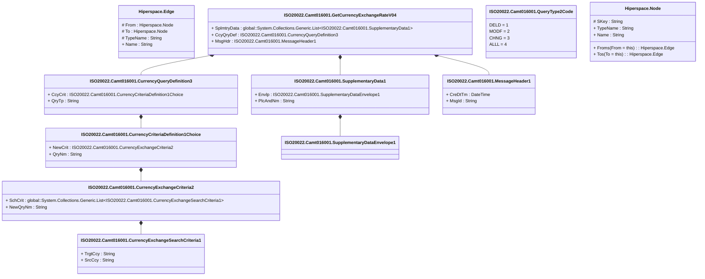

# camt.016.001.04

> The tables below contain descriptions of the members of each Element. 
> The first column indicates the type of the member:
> A ‘#’ indicates that the field is a key to the element, and a ‘+’ indicates that the field is a value.
> The ‘*’ column contains a description for the element member.  
> The ‘@’ column contains any properties for the member.
> The ‘=’ column contains calculated values; or in the case of an enum, the serialized value.

---

## View Hiperspace.Edge
edge between nodes

| |Name|Type|*|@|=|
|-|-|-|-|-|-|
|#|From|Hiperspace.Node||||
|#|To|Hiperspace.Node||||
|#|TypeName|String||||
|+|Name|String||||

---

## Value ISO20022.Camt016001.CurrencyCriteriaDefinition1Choice

| |Name|Type|*|@|=|
|-|-|-|-|-|-|
|+|NewCrit|ISO20022.Camt016001.CurrencyExchangeCriteria2||XmlElement()||
|+|QryNm|String||XmlElement()||
||Validation|Some(String)||XmlIgnore(), JsonIgnore()|validation(validElement(NewCrit),validChoice(NewCrit,QryNm))|

---

## Value ISO20022.Camt016001.CurrencyExchangeCriteria2

| |Name|Type|*|@|=|
|-|-|-|-|-|-|
|+|SchCrit|global::System.Collections.Generic.List<ISO20022.Camt016001.CurrencyExchangeSearchCriteria1>||XmlElement()||
|+|NewQryNm|String||XmlElement()||
||Validation|Some(String)||XmlIgnore(), JsonIgnore()|validation(validRequired("""SchCrit""",SchCrit),validList("""SchCrit""",SchCrit),validElement(SchCrit))|

---

## Value ISO20022.Camt016001.CurrencyExchangeSearchCriteria1

| |Name|Type|*|@|=|
|-|-|-|-|-|-|
|+|TrgtCcy|String||XmlElement()||
|+|SrcCcy|String||XmlElement()||
||Validation|Some(String)||XmlIgnore(), JsonIgnore()|validation(validPattern("""TrgtCcy""",TrgtCcy,"""[A-Z]{3,3}"""),validPattern("""SrcCcy""",SrcCcy,"""[A-Z]{3,3}"""))|

---

## Value ISO20022.Camt016001.CurrencyQueryDefinition3

| |Name|Type|*|@|=|
|-|-|-|-|-|-|
|+|CcyCrit|ISO20022.Camt016001.CurrencyCriteriaDefinition1Choice||XmlElement()||
|+|QryTp|String||XmlElement()||
||Validation|Some(String)||XmlIgnore(), JsonIgnore()|validation(validElement(CcyCrit))|

---

## Type ISO20022.Camt016001.Document

| |Name|Type|*|@|=|
|-|-|-|-|-|-|
|+|GetCcyXchgRate|ISO20022.Camt016001.GetCurrencyExchangeRateV04||XmlElement()||
||Validation|Some(String)||XmlIgnore(), JsonIgnore()|validation(validElement(GetCcyXchgRate))|

---

## Aspect ISO20022.Camt016001.GetCurrencyExchangeRateV04

| |Name|Type|*|@|=|
|-|-|-|-|-|-|
|+|SplmtryData|global::System.Collections.Generic.List<ISO20022.Camt016001.SupplementaryData1>||XmlElement()||
|+|CcyQryDef|ISO20022.Camt016001.CurrencyQueryDefinition3||XmlElement()||
|+|MsgHdr|ISO20022.Camt016001.MessageHeader1||XmlElement()||
||Validation|Some(String)||XmlIgnore(), JsonIgnore()|validation(validList("""SplmtryData""",SplmtryData),validElement(SplmtryData),validElement(CcyQryDef),validElement(MsgHdr))|

---

## Value ISO20022.Camt016001.MessageHeader1

| |Name|Type|*|@|=|
|-|-|-|-|-|-|
|+|CreDtTm|DateTime||XmlElement()||
|+|MsgId|String||XmlElement()||
||Validation|Some(String)||XmlIgnore(), JsonIgnore()|""|

---

## Enum ISO20022.Camt016001.QueryType2Code

| |Name|Type|*|@|=|
|-|-|-|-|-|-|
||DELD|Int32||XmlEnum("""DELD""")|1|
||MODF|Int32||XmlEnum("""MODF""")|2|
||CHNG|Int32||XmlEnum("""CHNG""")|3|
||ALLL|Int32||XmlEnum("""ALLL""")|4|

---

## Value ISO20022.Camt016001.SupplementaryData1

| |Name|Type|*|@|=|
|-|-|-|-|-|-|
|+|Envlp|ISO20022.Camt016001.SupplementaryDataEnvelope1||XmlElement()||
|+|PlcAndNm|String||XmlElement()||
||Validation|Some(String)||XmlIgnore(), JsonIgnore()|validation(validElement(Envlp))|

---

## Value ISO20022.Camt016001.SupplementaryDataEnvelope1

| |Name|Type|*|@|=|
|-|-|-|-|-|-|
||Validation|Some(String)||XmlIgnore(), JsonIgnore()|""|

---

## View Hiperspace.Node
node in a graph view of data

| |Name|Type|*|@|=|
|-|-|-|-|-|-|
|#|SKey|String||||
|+|TypeName|String||||
|+|Name|String||||
||Froms|Hiperspace.Edge|||From = this|
||Tos|Hiperspace.Edge|||To = this|

