# camt.017.001.05

```mermaid
classDiagram
    class Hiperspace.Edge {
        # From  : Hiperspace.Node
        # To  : Hiperspace.Node
        # TypeName  : String
        + Name  : String
    }
    class ISO20022.Camt017001.CurrencyExchange20 {
        + HghLmt  : ISO20022.Camt017001.ExchangeRateOrPercentage1Choice
        + LwLmt  : ISO20022.Camt017001.ExchangeRateOrPercentage1Choice
        + QtnDt  : DateTime
        + QtdCcy  : String
        + XchgRate  : Decimal
    }
    ISO20022.Camt017001.CurrencyExchange20 *-- ISO20022.Camt017001.ExchangeRateOrPercentage1Choice
    ISO20022.Camt017001.CurrencyExchange20 *-- ISO20022.Camt017001.ExchangeRateOrPercentage1Choice
    class ISO20022.Camt017001.CurrencyExchangeReport4 {
        + CcyXchgOrErr  : ISO20022.Camt017001.ExchangeRateReportOrError4Choice
        + CcyRef  : ISO20022.Camt017001.CurrencySourceTarget1
    }
    ISO20022.Camt017001.CurrencyExchangeReport4 *-- ISO20022.Camt017001.ExchangeRateReportOrError4Choice
    ISO20022.Camt017001.CurrencyExchangeReport4 *-- ISO20022.Camt017001.CurrencySourceTarget1
    class ISO20022.Camt017001.CurrencySourceTarget1 {
        + TrgtCcy  : String
        + SrcCcy  : String
    }
    class ISO20022.Camt017001.ErrorHandling1Choice {
        + Prtry  : String
        + Cd  : String
    }
    class ISO20022.Camt017001.ErrorHandling1Code {
        X050 = 1
        X030 = 2
        X020 = 3
    }
    class ISO20022.Camt017001.ErrorHandling3 {
        + Desc  : String
        + Err  : ISO20022.Camt017001.ErrorHandling1Choice
    }
    ISO20022.Camt017001.ErrorHandling3 *-- ISO20022.Camt017001.ErrorHandling1Choice
    class ISO20022.Camt017001.ExchangeRateOrPercentage1Choice {
        + Pctg  : Decimal
        + Rate  : Decimal
    }
    class ISO20022.Camt017001.ExchangeRateReportOrError3Choice {
        + OprlErr  : global::System.Collections.Generic.List~ISO20022.Camt017001.ErrorHandling3~
        + CcyXchgRpt  : global::System.Collections.Generic.List~ISO20022.Camt017001.CurrencyExchangeReport4~
    }
    ISO20022.Camt017001.ExchangeRateReportOrError3Choice *-- ISO20022.Camt017001.ErrorHandling3
    ISO20022.Camt017001.ExchangeRateReportOrError3Choice *-- ISO20022.Camt017001.CurrencyExchangeReport4
    class ISO20022.Camt017001.ExchangeRateReportOrError4Choice {
        + CcyXchg  : ISO20022.Camt017001.CurrencyExchange20
        + BizErr  : global::System.Collections.Generic.List~ISO20022.Camt017001.ErrorHandling3~
    }
    ISO20022.Camt017001.ExchangeRateReportOrError4Choice *-- ISO20022.Camt017001.CurrencyExchange20
    ISO20022.Camt017001.ExchangeRateReportOrError4Choice *-- ISO20022.Camt017001.ErrorHandling3
    class ISO20022.Camt017001.GenericIdentification1 {
        + Issr  : String
        + SchmeNm  : String
        + Id  : String
    }
    class ISO20022.Camt017001.MessageHeader7 {
        + QryNm  : String
        + OrgnlBizQry  : ISO20022.Camt017001.OriginalBusinessQuery1
        + ReqTp  : ISO20022.Camt017001.RequestType4Choice
        + CreDtTm  : DateTime
        + MsgId  : String
    }
    ISO20022.Camt017001.MessageHeader7 *-- ISO20022.Camt017001.OriginalBusinessQuery1
    ISO20022.Camt017001.MessageHeader7 *-- ISO20022.Camt017001.RequestType4Choice
    class ISO20022.Camt017001.OriginalBusinessQuery1 {
        + CreDtTm  : DateTime
        + MsgNmId  : String
        + MsgId  : String
    }
    class ISO20022.Camt017001.RequestType4Choice {
        + Prtry  : ISO20022.Camt017001.GenericIdentification1
        + Enqry  : String
        + PmtCtrl  : String
    }
    ISO20022.Camt017001.RequestType4Choice *-- ISO20022.Camt017001.GenericIdentification1
    class ISO20022.Camt017001.ReturnCurrencyExchangeRateV05 {
        + SplmtryData  : global::System.Collections.Generic.List~ISO20022.Camt017001.SupplementaryData1~
        + RptOrErr  : ISO20022.Camt017001.ExchangeRateReportOrError3Choice
        + MsgHdr  : ISO20022.Camt017001.MessageHeader7
    }
    ISO20022.Camt017001.ReturnCurrencyExchangeRateV05 *-- ISO20022.Camt017001.SupplementaryData1
    ISO20022.Camt017001.ReturnCurrencyExchangeRateV05 *-- ISO20022.Camt017001.ExchangeRateReportOrError3Choice
    ISO20022.Camt017001.ReturnCurrencyExchangeRateV05 *-- ISO20022.Camt017001.MessageHeader7
    class ISO20022.Camt017001.SupplementaryData1 {
        + Envlp  : ISO20022.Camt017001.SupplementaryDataEnvelope1
        + PlcAndNm  : String
    }
    ISO20022.Camt017001.SupplementaryData1 *-- ISO20022.Camt017001.SupplementaryDataEnvelope1
    class ISO20022.Camt017001.SupplementaryDataEnvelope1 {
    }
    class Hiperspace.Node {
        # SKey  : String
        + TypeName  : String
        + Name  : String
        + Froms (From = this) : Hiperspace.Edge
        + Tos (To = this) : Hiperspace.Edge
    }
```

> The tables below contain descriptions of the members of each Element. 
> The first column indicates the type of the member:
> A ‘#’ indicates that the field is a key to the element, and a ‘+’ indicates that the field is a value.
> The ‘*’ column contains a description for the element member.  
> The ‘@’ column contains any properties for the member.
> The ‘=’ column contains calculated values; or in the case of an enum, the serialized value.

---

## View Hiperspace.Edge
edge between nodes

| |Name|Type|*|@|=|
|-|-|-|-|-|-|
|#|From|Hiperspace.Node||||
|#|To|Hiperspace.Node||||
|#|TypeName|String||||
|+|Name|String||||

---

## Value ISO20022.Camt017001.CurrencyExchange20

| |Name|Type|*|@|=|
|-|-|-|-|-|-|
|+|HghLmt|ISO20022.Camt017001.ExchangeRateOrPercentage1Choice||XmlElement()||
|+|LwLmt|ISO20022.Camt017001.ExchangeRateOrPercentage1Choice||XmlElement()||
|+|QtnDt|DateTime||XmlElement()||
|+|QtdCcy|String||XmlElement()||
|+|XchgRate|Decimal||XmlElement()||
||Validation|Some(String)||XmlIgnore(), JsonIgnore()|validation(validElement(HghLmt),validElement(LwLmt),validPattern("""QtdCcy""",QtdCcy,"""[A-Z]{3,3}"""))|

---

## Value ISO20022.Camt017001.CurrencyExchangeReport4

| |Name|Type|*|@|=|
|-|-|-|-|-|-|
|+|CcyXchgOrErr|ISO20022.Camt017001.ExchangeRateReportOrError4Choice||XmlElement()||
|+|CcyRef|ISO20022.Camt017001.CurrencySourceTarget1||XmlElement()||
||Validation|Some(String)||XmlIgnore(), JsonIgnore()|validation(validElement(CcyXchgOrErr),validElement(CcyRef))|

---

## Value ISO20022.Camt017001.CurrencySourceTarget1

| |Name|Type|*|@|=|
|-|-|-|-|-|-|
|+|TrgtCcy|String||XmlElement()||
|+|SrcCcy|String||XmlElement()||
||Validation|Some(String)||XmlIgnore(), JsonIgnore()|validation(validPattern("""TrgtCcy""",TrgtCcy,"""[A-Z]{3,3}"""),validPattern("""SrcCcy""",SrcCcy,"""[A-Z]{3,3}"""))|

---

## Type ISO20022.Camt017001.Document

| |Name|Type|*|@|=|
|-|-|-|-|-|-|
|+|RtrCcyXchgRate|ISO20022.Camt017001.ReturnCurrencyExchangeRateV05||XmlElement()||
||Validation|Some(String)||XmlIgnore(), JsonIgnore()|validation(validElement(RtrCcyXchgRate))|

---

## Value ISO20022.Camt017001.ErrorHandling1Choice

| |Name|Type|*|@|=|
|-|-|-|-|-|-|
|+|Prtry|String||XmlElement()||
|+|Cd|String||XmlElement()||
||Validation|Some(String)||XmlIgnore(), JsonIgnore()|validation(validPattern("""Prtry""",Prtry,"""[a-zA-Z0-9]{1,4}"""),validChoice(Prtry,Cd))|

---

## Enum ISO20022.Camt017001.ErrorHandling1Code

| |Name|Type|*|@|=|
|-|-|-|-|-|-|
||X050|Int32||XmlEnum("""X050""")|1|
||X030|Int32||XmlEnum("""X030""")|2|
||X020|Int32||XmlEnum("""X020""")|3|

---

## Value ISO20022.Camt017001.ErrorHandling3

| |Name|Type|*|@|=|
|-|-|-|-|-|-|
|+|Desc|String||XmlElement()||
|+|Err|ISO20022.Camt017001.ErrorHandling1Choice||XmlElement()||
||Validation|Some(String)||XmlIgnore(), JsonIgnore()|validation(validElement(Err))|

---

## Value ISO20022.Camt017001.ExchangeRateOrPercentage1Choice

| |Name|Type|*|@|=|
|-|-|-|-|-|-|
|+|Pctg|Decimal||XmlElement()||
|+|Rate|Decimal||XmlElement()||
||Validation|Some(String)||XmlIgnore(), JsonIgnore()|validation(validChoice(Pctg,Rate))|

---

## Value ISO20022.Camt017001.ExchangeRateReportOrError3Choice

| |Name|Type|*|@|=|
|-|-|-|-|-|-|
|+|OprlErr|global::System.Collections.Generic.List<ISO20022.Camt017001.ErrorHandling3>||XmlElement()||
|+|CcyXchgRpt|global::System.Collections.Generic.List<ISO20022.Camt017001.CurrencyExchangeReport4>||XmlElement()||
||Validation|Some(String)||XmlIgnore(), JsonIgnore()|validation(validRequired("""OprlErr""",OprlErr),validList("""OprlErr""",OprlErr),validElement(OprlErr),validRequired("""CcyXchgRpt""",CcyXchgRpt),validList("""CcyXchgRpt""",CcyXchgRpt),validElement(CcyXchgRpt),validChoice(OprlErr,CcyXchgRpt))|

---

## Value ISO20022.Camt017001.ExchangeRateReportOrError4Choice

| |Name|Type|*|@|=|
|-|-|-|-|-|-|
|+|CcyXchg|ISO20022.Camt017001.CurrencyExchange20||XmlElement()||
|+|BizErr|global::System.Collections.Generic.List<ISO20022.Camt017001.ErrorHandling3>||XmlElement()||
||Validation|Some(String)||XmlIgnore(), JsonIgnore()|validation(validElement(CcyXchg),validRequired("""BizErr""",BizErr),validList("""BizErr""",BizErr),validElement(BizErr),validChoice(CcyXchg,BizErr))|

---

## Value ISO20022.Camt017001.GenericIdentification1

| |Name|Type|*|@|=|
|-|-|-|-|-|-|
|+|Issr|String||XmlElement()||
|+|SchmeNm|String||XmlElement()||
|+|Id|String||XmlElement()||
||Validation|Some(String)||XmlIgnore(), JsonIgnore()|""|

---

## Value ISO20022.Camt017001.MessageHeader7

| |Name|Type|*|@|=|
|-|-|-|-|-|-|
|+|QryNm|String||XmlElement()||
|+|OrgnlBizQry|ISO20022.Camt017001.OriginalBusinessQuery1||XmlElement()||
|+|ReqTp|ISO20022.Camt017001.RequestType4Choice||XmlElement()||
|+|CreDtTm|DateTime||XmlElement()||
|+|MsgId|String||XmlElement()||
||Validation|Some(String)||XmlIgnore(), JsonIgnore()|validation(validElement(OrgnlBizQry),validElement(ReqTp))|

---

## Value ISO20022.Camt017001.OriginalBusinessQuery1

| |Name|Type|*|@|=|
|-|-|-|-|-|-|
|+|CreDtTm|DateTime||XmlElement()||
|+|MsgNmId|String||XmlElement()||
|+|MsgId|String||XmlElement()||
||Validation|Some(String)||XmlIgnore(), JsonIgnore()|""|

---

## Value ISO20022.Camt017001.RequestType4Choice

| |Name|Type|*|@|=|
|-|-|-|-|-|-|
|+|Prtry|ISO20022.Camt017001.GenericIdentification1||XmlElement()||
|+|Enqry|String||XmlElement()||
|+|PmtCtrl|String||XmlElement()||
||Validation|Some(String)||XmlIgnore(), JsonIgnore()|validation(validElement(Prtry),validChoice(Prtry,Enqry,PmtCtrl))|

---

## Aspect ISO20022.Camt017001.ReturnCurrencyExchangeRateV05

| |Name|Type|*|@|=|
|-|-|-|-|-|-|
|+|SplmtryData|global::System.Collections.Generic.List<ISO20022.Camt017001.SupplementaryData1>||XmlElement()||
|+|RptOrErr|ISO20022.Camt017001.ExchangeRateReportOrError3Choice||XmlElement()||
|+|MsgHdr|ISO20022.Camt017001.MessageHeader7||XmlElement()||
||Validation|Some(String)||XmlIgnore(), JsonIgnore()|validation(validList("""SplmtryData""",SplmtryData),validElement(SplmtryData),validElement(RptOrErr),validElement(MsgHdr))|

---

## Value ISO20022.Camt017001.SupplementaryData1

| |Name|Type|*|@|=|
|-|-|-|-|-|-|
|+|Envlp|ISO20022.Camt017001.SupplementaryDataEnvelope1||XmlElement()||
|+|PlcAndNm|String||XmlElement()||
||Validation|Some(String)||XmlIgnore(), JsonIgnore()|validation(validElement(Envlp))|

---

## Value ISO20022.Camt017001.SupplementaryDataEnvelope1

| |Name|Type|*|@|=|
|-|-|-|-|-|-|
||Validation|Some(String)||XmlIgnore(), JsonIgnore()|""|

---

## View Hiperspace.Node
node in a graph view of data

| |Name|Type|*|@|=|
|-|-|-|-|-|-|
|#|SKey|String||||
|+|TypeName|String||||
|+|Name|String||||
||Froms|Hiperspace.Edge|||From = this|
||Tos|Hiperspace.Edge|||To = this|

