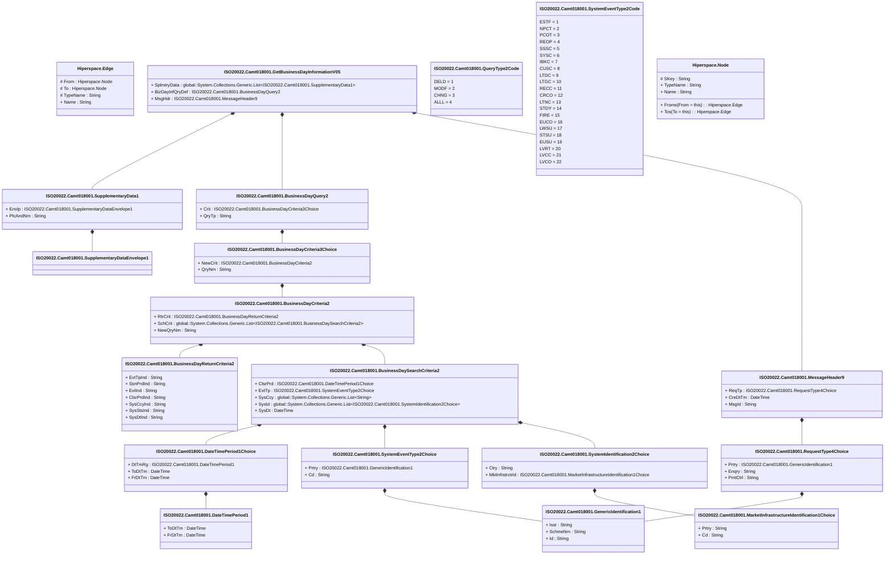

# camt.018.001.05

> The tables below contain descriptions of the members of each Element. 
> The first column indicates the type of the member:
> A ‘#’ indicates that the field is a key to the element, and a ‘+’ indicates that the field is a value.
> The ‘*’ column contains a description for the element member.  
> The ‘@’ column contains any properties for the member.
> The ‘=’ column contains calculated values; or in the case of an enum, the serialized value.

---

## View Hiperspace.Edge
edge between nodes

| |Name|Type|*|@|=|
|-|-|-|-|-|-|
|#|From|Hiperspace.Node||||
|#|To|Hiperspace.Node||||
|#|TypeName|String||||
|+|Name|String||||

---

## Value ISO20022.Camt018001.BusinessDayCriteria2

| |Name|Type|*|@|=|
|-|-|-|-|-|-|
|+|RtrCrit|ISO20022.Camt018001.BusinessDayReturnCriteria2||XmlElement()||
|+|SchCrit|global::System.Collections.Generic.List<ISO20022.Camt018001.BusinessDaySearchCriteria2>||XmlElement()||
|+|NewQryNm|String||XmlElement()||
||Validation|Some(String)||XmlIgnore(), JsonIgnore()|validation(validElement(RtrCrit),validList("""SchCrit""",SchCrit),validElement(SchCrit))|

---

## Value ISO20022.Camt018001.BusinessDayCriteria3Choice

| |Name|Type|*|@|=|
|-|-|-|-|-|-|
|+|NewCrit|ISO20022.Camt018001.BusinessDayCriteria2||XmlElement()||
|+|QryNm|String||XmlElement()||
||Validation|Some(String)||XmlIgnore(), JsonIgnore()|validation(validElement(NewCrit),validChoice(NewCrit,QryNm))|

---

## Value ISO20022.Camt018001.BusinessDayQuery2

| |Name|Type|*|@|=|
|-|-|-|-|-|-|
|+|Crit|ISO20022.Camt018001.BusinessDayCriteria3Choice||XmlElement()||
|+|QryTp|String||XmlElement()||
||Validation|Some(String)||XmlIgnore(), JsonIgnore()|validation(validElement(Crit))|

---

## Value ISO20022.Camt018001.BusinessDayReturnCriteria2

| |Name|Type|*|@|=|
|-|-|-|-|-|-|
|+|EvtTpInd|String||XmlElement()||
|+|SsnPrdInd|String||XmlElement()||
|+|EvtInd|String||XmlElement()||
|+|ClsrPrdInd|String||XmlElement()||
|+|SysCcyInd|String||XmlElement()||
|+|SysStsInd|String||XmlElement()||
|+|SysDtInd|String||XmlElement()||
||Validation|Some(String)||XmlIgnore(), JsonIgnore()|""|

---

## Value ISO20022.Camt018001.BusinessDaySearchCriteria2

| |Name|Type|*|@|=|
|-|-|-|-|-|-|
|+|ClsrPrd|ISO20022.Camt018001.DateTimePeriod1Choice||XmlElement()||
|+|EvtTp|ISO20022.Camt018001.SystemEventType2Choice||XmlElement()||
|+|SysCcy|global::System.Collections.Generic.List<String>||XmlElement()||
|+|SysId|global::System.Collections.Generic.List<ISO20022.Camt018001.SystemIdentification2Choice>||XmlElement()||
|+|SysDt|DateTime||XmlElement()||
||Validation|Some(String)||XmlIgnore(), JsonIgnore()|validation(validElement(ClsrPrd),validElement(EvtTp),validPattern("""SysCcy""",SysCcy,"""[A-Z]{3,3}"""),validList("""SysId""",SysId),validElement(SysId))|

---

## Value ISO20022.Camt018001.DateTimePeriod1

| |Name|Type|*|@|=|
|-|-|-|-|-|-|
|+|ToDtTm|DateTime||XmlElement()||
|+|FrDtTm|DateTime||XmlElement()||
||Validation|Some(String)||XmlIgnore(), JsonIgnore()|""|

---

## Value ISO20022.Camt018001.DateTimePeriod1Choice

| |Name|Type|*|@|=|
|-|-|-|-|-|-|
|+|DtTmRg|ISO20022.Camt018001.DateTimePeriod1||XmlElement()||
|+|ToDtTm|DateTime||XmlElement()||
|+|FrDtTm|DateTime||XmlElement()||
||Validation|Some(String)||XmlIgnore(), JsonIgnore()|validation(validElement(DtTmRg),validChoice(DtTmRg,ToDtTm,FrDtTm))|

---

## Type ISO20022.Camt018001.Document

| |Name|Type|*|@|=|
|-|-|-|-|-|-|
|+|GetBizDayInf|ISO20022.Camt018001.GetBusinessDayInformationV05||XmlElement()||
||Validation|Some(String)||XmlIgnore(), JsonIgnore()|validation(validElement(GetBizDayInf))|

---

## Value ISO20022.Camt018001.GenericIdentification1

| |Name|Type|*|@|=|
|-|-|-|-|-|-|
|+|Issr|String||XmlElement()||
|+|SchmeNm|String||XmlElement()||
|+|Id|String||XmlElement()||
||Validation|Some(String)||XmlIgnore(), JsonIgnore()|""|

---

## Aspect ISO20022.Camt018001.GetBusinessDayInformationV05

| |Name|Type|*|@|=|
|-|-|-|-|-|-|
|+|SplmtryData|global::System.Collections.Generic.List<ISO20022.Camt018001.SupplementaryData1>||XmlElement()||
|+|BizDayInfQryDef|ISO20022.Camt018001.BusinessDayQuery2||XmlElement()||
|+|MsgHdr|ISO20022.Camt018001.MessageHeader9||XmlElement()||
||Validation|Some(String)||XmlIgnore(), JsonIgnore()|validation(validList("""SplmtryData""",SplmtryData),validElement(SplmtryData),validElement(BizDayInfQryDef),validElement(MsgHdr))|

---

## Value ISO20022.Camt018001.MarketInfrastructureIdentification1Choice

| |Name|Type|*|@|=|
|-|-|-|-|-|-|
|+|Prtry|String||XmlElement()||
|+|Cd|String||XmlElement()||
||Validation|Some(String)||XmlIgnore(), JsonIgnore()|validation(validChoice(Prtry,Cd))|

---

## Value ISO20022.Camt018001.MessageHeader9

| |Name|Type|*|@|=|
|-|-|-|-|-|-|
|+|ReqTp|ISO20022.Camt018001.RequestType4Choice||XmlElement()||
|+|CreDtTm|DateTime||XmlElement()||
|+|MsgId|String||XmlElement()||
||Validation|Some(String)||XmlIgnore(), JsonIgnore()|validation(validElement(ReqTp))|

---

## Enum ISO20022.Camt018001.QueryType2Code

| |Name|Type|*|@|=|
|-|-|-|-|-|-|
||DELD|Int32||XmlEnum("""DELD""")|1|
||MODF|Int32||XmlEnum("""MODF""")|2|
||CHNG|Int32||XmlEnum("""CHNG""")|3|
||ALLL|Int32||XmlEnum("""ALLL""")|4|

---

## Value ISO20022.Camt018001.RequestType4Choice

| |Name|Type|*|@|=|
|-|-|-|-|-|-|
|+|Prtry|ISO20022.Camt018001.GenericIdentification1||XmlElement()||
|+|Enqry|String||XmlElement()||
|+|PmtCtrl|String||XmlElement()||
||Validation|Some(String)||XmlIgnore(), JsonIgnore()|validation(validElement(Prtry),validChoice(Prtry,Enqry,PmtCtrl))|

---

## Value ISO20022.Camt018001.SupplementaryData1

| |Name|Type|*|@|=|
|-|-|-|-|-|-|
|+|Envlp|ISO20022.Camt018001.SupplementaryDataEnvelope1||XmlElement()||
|+|PlcAndNm|String||XmlElement()||
||Validation|Some(String)||XmlIgnore(), JsonIgnore()|validation(validElement(Envlp))|

---

## Value ISO20022.Camt018001.SupplementaryDataEnvelope1

| |Name|Type|*|@|=|
|-|-|-|-|-|-|
||Validation|Some(String)||XmlIgnore(), JsonIgnore()|""|

---

## Value ISO20022.Camt018001.SystemEventType2Choice

| |Name|Type|*|@|=|
|-|-|-|-|-|-|
|+|Prtry|ISO20022.Camt018001.GenericIdentification1||XmlElement()||
|+|Cd|String||XmlElement()||
||Validation|Some(String)||XmlIgnore(), JsonIgnore()|validation(validElement(Prtry),validChoice(Prtry,Cd))|

---

## Enum ISO20022.Camt018001.SystemEventType2Code

| |Name|Type|*|@|=|
|-|-|-|-|-|-|
||ESTF|Int32||XmlEnum("""ESTF""")|1|
||NPCT|Int32||XmlEnum("""NPCT""")|2|
||PCOT|Int32||XmlEnum("""PCOT""")|3|
||REOP|Int32||XmlEnum("""REOP""")|4|
||SSSC|Int32||XmlEnum("""SSSC""")|5|
||SYSC|Int32||XmlEnum("""SYSC""")|6|
||IBKC|Int32||XmlEnum("""IBKC""")|7|
||CUSC|Int32||XmlEnum("""CUSC""")|8|
||LTDC|Int32||XmlEnum("""LTDC""")|9|
||LTGC|Int32||XmlEnum("""LTGC""")|10|
||RECC|Int32||XmlEnum("""RECC""")|11|
||CRCO|Int32||XmlEnum("""CRCO""")|12|
||LTNC|Int32||XmlEnum("""LTNC""")|13|
||STDY|Int32||XmlEnum("""STDY""")|14|
||FIRE|Int32||XmlEnum("""FIRE""")|15|
||EUCO|Int32||XmlEnum("""EUCO""")|16|
||LWSU|Int32||XmlEnum("""LWSU""")|17|
||STSU|Int32||XmlEnum("""STSU""")|18|
||EUSU|Int32||XmlEnum("""EUSU""")|19|
||LVRT|Int32||XmlEnum("""LVRT""")|20|
||LVCC|Int32||XmlEnum("""LVCC""")|21|
||LVCO|Int32||XmlEnum("""LVCO""")|22|

---

## Value ISO20022.Camt018001.SystemIdentification2Choice

| |Name|Type|*|@|=|
|-|-|-|-|-|-|
|+|Ctry|String||XmlElement()||
|+|MktInfrstrctrId|ISO20022.Camt018001.MarketInfrastructureIdentification1Choice||XmlElement()||
||Validation|Some(String)||XmlIgnore(), JsonIgnore()|validation(validPattern("""Ctry""",Ctry,"""[A-Z]{2,2}"""),validElement(MktInfrstrctrId),validChoice(Ctry,MktInfrstrctrId))|

---

## View Hiperspace.Node
node in a graph view of data

| |Name|Type|*|@|=|
|-|-|-|-|-|-|
|#|SKey|String||||
|+|TypeName|String||||
|+|Name|String||||
||Froms|Hiperspace.Edge|||From = this|
||Tos|Hiperspace.Edge|||To = this|

