# camt.019.001.07

```mermaid
classDiagram
    class Hiperspace.Edge {
        # From  : Hiperspace.Node
        # To  : Hiperspace.Node
        # TypeName  : String
        + Name  : String
    }
    class ISO20022.Camt019001.BusinessDay8 {
        + BizDayOrErr  : ISO20022.Camt019001.BusinessDayReportOrError10Choice
        + SysId  : global::System.Collections.Generic.List~ISO20022.Camt019001.SystemIdentification2Choice~
    }
    ISO20022.Camt019001.BusinessDay8 *-- ISO20022.Camt019001.BusinessDayReportOrError10Choice
    ISO20022.Camt019001.BusinessDay8 *-- ISO20022.Camt019001.SystemIdentification2Choice
    class ISO20022.Camt019001.BusinessDay9 {
        + SysInfPerCcy  : global::System.Collections.Generic.List~ISO20022.Camt019001.SystemAvailabilityAndEvents3~
        + SysSts  : ISO20022.Camt019001.SystemStatus3
        + SysDt  : ISO20022.Camt019001.DateAndDateTime2Choice
    }
    ISO20022.Camt019001.BusinessDay9 *-- ISO20022.Camt019001.SystemAvailabilityAndEvents3
    ISO20022.Camt019001.BusinessDay9 *-- ISO20022.Camt019001.SystemStatus3
    ISO20022.Camt019001.BusinessDay9 *-- ISO20022.Camt019001.DateAndDateTime2Choice
    class ISO20022.Camt019001.BusinessDayReportOrError10Choice {
        + BizErr  : global::System.Collections.Generic.List~ISO20022.Camt019001.ErrorHandling5~
        + BizDayInf  : ISO20022.Camt019001.BusinessDay9
    }
    ISO20022.Camt019001.BusinessDayReportOrError10Choice *-- ISO20022.Camt019001.ErrorHandling5
    ISO20022.Camt019001.BusinessDayReportOrError10Choice *-- ISO20022.Camt019001.BusinessDay9
    class ISO20022.Camt019001.BusinessDayReportOrError9Choice {
        + OprlErr  : global::System.Collections.Generic.List~ISO20022.Camt019001.ErrorHandling5~
        + BizRpt  : global::System.Collections.Generic.List~ISO20022.Camt019001.BusinessDay8~
    }
    ISO20022.Camt019001.BusinessDayReportOrError9Choice *-- ISO20022.Camt019001.ErrorHandling5
    ISO20022.Camt019001.BusinessDayReportOrError9Choice *-- ISO20022.Camt019001.BusinessDay8
    class ISO20022.Camt019001.ClosureReason2Choice {
        + Prtry  : String
        + Cd  : String
    }
    class ISO20022.Camt019001.DateAndDateTime2Choice {
        + DtTm  : DateTime
        + Dt  : DateTime
    }
    class ISO20022.Camt019001.DateTimePeriod1 {
        + ToDtTm  : DateTime
        + FrDtTm  : DateTime
    }
    class ISO20022.Camt019001.DateTimePeriod1Choice {
        + DtTmRg  : ISO20022.Camt019001.DateTimePeriod1
        + ToDtTm  : DateTime
        + FrDtTm  : DateTime
    }
    ISO20022.Camt019001.DateTimePeriod1Choice *-- ISO20022.Camt019001.DateTimePeriod1
    class ISO20022.Camt019001.ErrorHandling3Choice {
        + Prtry  : String
        + Cd  : String
    }
    class ISO20022.Camt019001.ErrorHandling5 {
        + Desc  : String
        + Err  : ISO20022.Camt019001.ErrorHandling3Choice
    }
    ISO20022.Camt019001.ErrorHandling5 *-- ISO20022.Camt019001.ErrorHandling3Choice
    class ISO20022.Camt019001.GenericIdentification1 {
        + Issr  : String
        + SchmeNm  : String
        + Id  : String
    }
    class ISO20022.Camt019001.MarketInfrastructureIdentification1Choice {
        + Prtry  : String
        + Cd  : String
    }
    class ISO20022.Camt019001.MessageHeader7 {
        + QryNm  : String
        + OrgnlBizQry  : ISO20022.Camt019001.OriginalBusinessQuery1
        + ReqTp  : ISO20022.Camt019001.RequestType4Choice
        + CreDtTm  : DateTime
        + MsgId  : String
    }
    ISO20022.Camt019001.MessageHeader7 *-- ISO20022.Camt019001.OriginalBusinessQuery1
    ISO20022.Camt019001.MessageHeader7 *-- ISO20022.Camt019001.RequestType4Choice
    class ISO20022.Camt019001.OriginalBusinessQuery1 {
        + CreDtTm  : DateTime
        + MsgNmId  : String
        + MsgId  : String
    }
    class ISO20022.Camt019001.RequestType4Choice {
        + Prtry  : ISO20022.Camt019001.GenericIdentification1
        + Enqry  : String
        + PmtCtrl  : String
    }
    ISO20022.Camt019001.RequestType4Choice *-- ISO20022.Camt019001.GenericIdentification1
    class ISO20022.Camt019001.ReturnBusinessDayInformationV07 {
        + SplmtryData  : global::System.Collections.Generic.List~ISO20022.Camt019001.SupplementaryData1~
        + RptOrErr  : ISO20022.Camt019001.BusinessDayReportOrError9Choice
        + MsgHdr  : ISO20022.Camt019001.MessageHeader7
    }
    ISO20022.Camt019001.ReturnBusinessDayInformationV07 *-- ISO20022.Camt019001.SupplementaryData1
    ISO20022.Camt019001.ReturnBusinessDayInformationV07 *-- ISO20022.Camt019001.BusinessDayReportOrError9Choice
    ISO20022.Camt019001.ReturnBusinessDayInformationV07 *-- ISO20022.Camt019001.MessageHeader7
    class ISO20022.Camt019001.SupplementaryData1 {
        + Envlp  : ISO20022.Camt019001.SupplementaryDataEnvelope1
        + PlcAndNm  : String
    }
    ISO20022.Camt019001.SupplementaryData1 *-- ISO20022.Camt019001.SupplementaryDataEnvelope1
    class ISO20022.Camt019001.SupplementaryDataEnvelope1 {
    }
    class ISO20022.Camt019001.SystemAvailabilityAndEvents3 {
        + ClsrInf  : global::System.Collections.Generic.List~ISO20022.Camt019001.SystemClosure2~
        + Evt  : global::System.Collections.Generic.List~ISO20022.Camt019001.SystemEvent3~
        + SsnPrd  : ISO20022.Camt019001.TimePeriod1
        + SysCcy  : String
    }
    ISO20022.Camt019001.SystemAvailabilityAndEvents3 *-- ISO20022.Camt019001.SystemClosure2
    ISO20022.Camt019001.SystemAvailabilityAndEvents3 *-- ISO20022.Camt019001.SystemEvent3
    ISO20022.Camt019001.SystemAvailabilityAndEvents3 *-- ISO20022.Camt019001.TimePeriod1
    class ISO20022.Camt019001.SystemClosure2 {
        + Rsn  : ISO20022.Camt019001.ClosureReason2Choice
        + Prd  : ISO20022.Camt019001.DateTimePeriod1Choice
    }
    ISO20022.Camt019001.SystemClosure2 *-- ISO20022.Camt019001.ClosureReason2Choice
    ISO20022.Camt019001.SystemClosure2 *-- ISO20022.Camt019001.DateTimePeriod1Choice
    class ISO20022.Camt019001.SystemClosureReason1Code {
        ADTW = 1
        RCVR = 2
        NOOP = 3
        SMTN = 4
        BHOL = 5
    }
    class ISO20022.Camt019001.SystemEvent3 {
        + EndTm  : DateTime
        + StartTm  : DateTime
        + FctvTm  : DateTime
        + SchdldTm  : DateTime
        + Tp  : ISO20022.Camt019001.SystemEventType4Choice
    }
    ISO20022.Camt019001.SystemEvent3 *-- ISO20022.Camt019001.SystemEventType4Choice
    class ISO20022.Camt019001.SystemEventType4Choice {
        + Prtry  : ISO20022.Camt019001.GenericIdentification1
        + Cd  : String
    }
    ISO20022.Camt019001.SystemEventType4Choice *-- ISO20022.Camt019001.GenericIdentification1
    class ISO20022.Camt019001.SystemIdentification2Choice {
        + Ctry  : String
        + MktInfrstrctrId  : ISO20022.Camt019001.MarketInfrastructureIdentification1Choice
    }
    ISO20022.Camt019001.SystemIdentification2Choice *-- ISO20022.Camt019001.MarketInfrastructureIdentification1Choice
    class ISO20022.Camt019001.SystemStatus2Choice {
        + Prtry  : ISO20022.Camt019001.GenericIdentification1
        + Cd  : String
    }
    ISO20022.Camt019001.SystemStatus2Choice *-- ISO20022.Camt019001.GenericIdentification1
    class ISO20022.Camt019001.SystemStatus2Code {
        CLSG = 1
        CLSD = 2
        ACTV = 3
        SUSP = 4
    }
    class ISO20022.Camt019001.SystemStatus3 {
        + VldtyTm  : ISO20022.Camt019001.DateTimePeriod1Choice
        + Sts  : ISO20022.Camt019001.SystemStatus2Choice
    }
    ISO20022.Camt019001.SystemStatus3 *-- ISO20022.Camt019001.DateTimePeriod1Choice
    ISO20022.Camt019001.SystemStatus3 *-- ISO20022.Camt019001.SystemStatus2Choice
    class ISO20022.Camt019001.TimePeriod1 {
        + ToTm  : DateTime
        + FrTm  : DateTime
    }
    class Hiperspace.Node {
        # SKey  : String
        + TypeName  : String
        + Name  : String
        + Froms (From = this) : Hiperspace.Edge
        + Tos (To = this) : Hiperspace.Edge
    }
```

> The tables below contain descriptions of the members of each Element. 
> The first column indicates the type of the member:
> A ‘#’ indicates that the field is a key to the element, and a ‘+’ indicates that the field is a value.
> The ‘*’ column contains a description for the element member.  
> The ‘@’ column contains any properties for the member.
> The ‘=’ column contains calculated values; or in the case of an enum, the serialized value.

---

## View Hiperspace.Edge
edge between nodes

| |Name|Type|*|@|=|
|-|-|-|-|-|-|
|#|From|Hiperspace.Node||||
|#|To|Hiperspace.Node||||
|#|TypeName|String||||
|+|Name|String||||

---

## Value ISO20022.Camt019001.BusinessDay8

| |Name|Type|*|@|=|
|-|-|-|-|-|-|
|+|BizDayOrErr|ISO20022.Camt019001.BusinessDayReportOrError10Choice||XmlElement()||
|+|SysId|global::System.Collections.Generic.List<ISO20022.Camt019001.SystemIdentification2Choice>||XmlElement()||
||Validation|Some(String)||XmlIgnore(), JsonIgnore()|validation(validElement(BizDayOrErr),validRequired("""SysId""",SysId),validList("""SysId""",SysId),validElement(SysId))|

---

## Value ISO20022.Camt019001.BusinessDay9

| |Name|Type|*|@|=|
|-|-|-|-|-|-|
|+|SysInfPerCcy|global::System.Collections.Generic.List<ISO20022.Camt019001.SystemAvailabilityAndEvents3>||XmlElement()||
|+|SysSts|ISO20022.Camt019001.SystemStatus3||XmlElement()||
|+|SysDt|ISO20022.Camt019001.DateAndDateTime2Choice||XmlElement()||
||Validation|Some(String)||XmlIgnore(), JsonIgnore()|validation(validList("""SysInfPerCcy""",SysInfPerCcy),validElement(SysInfPerCcy),validElement(SysSts),validElement(SysDt))|

---

## Value ISO20022.Camt019001.BusinessDayReportOrError10Choice

| |Name|Type|*|@|=|
|-|-|-|-|-|-|
|+|BizErr|global::System.Collections.Generic.List<ISO20022.Camt019001.ErrorHandling5>||XmlElement()||
|+|BizDayInf|ISO20022.Camt019001.BusinessDay9||XmlElement()||
||Validation|Some(String)||XmlIgnore(), JsonIgnore()|validation(validRequired("""BizErr""",BizErr),validList("""BizErr""",BizErr),validElement(BizErr),validElement(BizDayInf),validChoice(BizErr,BizDayInf))|

---

## Value ISO20022.Camt019001.BusinessDayReportOrError9Choice

| |Name|Type|*|@|=|
|-|-|-|-|-|-|
|+|OprlErr|global::System.Collections.Generic.List<ISO20022.Camt019001.ErrorHandling5>||XmlElement()||
|+|BizRpt|global::System.Collections.Generic.List<ISO20022.Camt019001.BusinessDay8>||XmlElement()||
||Validation|Some(String)||XmlIgnore(), JsonIgnore()|validation(validRequired("""OprlErr""",OprlErr),validList("""OprlErr""",OprlErr),validElement(OprlErr),validRequired("""BizRpt""",BizRpt),validList("""BizRpt""",BizRpt),validElement(BizRpt),validChoice(OprlErr,BizRpt))|

---

## Value ISO20022.Camt019001.ClosureReason2Choice

| |Name|Type|*|@|=|
|-|-|-|-|-|-|
|+|Prtry|String||XmlElement()||
|+|Cd|String||XmlElement()||
||Validation|Some(String)||XmlIgnore(), JsonIgnore()|validation(validChoice(Prtry,Cd))|

---

## Value ISO20022.Camt019001.DateAndDateTime2Choice

| |Name|Type|*|@|=|
|-|-|-|-|-|-|
|+|DtTm|DateTime||XmlElement()||
|+|Dt|DateTime||XmlElement()||
||Validation|Some(String)||XmlIgnore(), JsonIgnore()|validation(validChoice(DtTm,Dt))|

---

## Value ISO20022.Camt019001.DateTimePeriod1

| |Name|Type|*|@|=|
|-|-|-|-|-|-|
|+|ToDtTm|DateTime||XmlElement()||
|+|FrDtTm|DateTime||XmlElement()||
||Validation|Some(String)||XmlIgnore(), JsonIgnore()|""|

---

## Value ISO20022.Camt019001.DateTimePeriod1Choice

| |Name|Type|*|@|=|
|-|-|-|-|-|-|
|+|DtTmRg|ISO20022.Camt019001.DateTimePeriod1||XmlElement()||
|+|ToDtTm|DateTime||XmlElement()||
|+|FrDtTm|DateTime||XmlElement()||
||Validation|Some(String)||XmlIgnore(), JsonIgnore()|validation(validElement(DtTmRg),validChoice(DtTmRg,ToDtTm,FrDtTm))|

---

## Type ISO20022.Camt019001.Document

| |Name|Type|*|@|=|
|-|-|-|-|-|-|
|+|RtrBizDayInf|ISO20022.Camt019001.ReturnBusinessDayInformationV07||XmlElement()||
||Validation|Some(String)||XmlIgnore(), JsonIgnore()|validation(validElement(RtrBizDayInf))|

---

## Value ISO20022.Camt019001.ErrorHandling3Choice

| |Name|Type|*|@|=|
|-|-|-|-|-|-|
|+|Prtry|String||XmlElement()||
|+|Cd|String||XmlElement()||
||Validation|Some(String)||XmlIgnore(), JsonIgnore()|validation(validChoice(Prtry,Cd))|

---

## Value ISO20022.Camt019001.ErrorHandling5

| |Name|Type|*|@|=|
|-|-|-|-|-|-|
|+|Desc|String||XmlElement()||
|+|Err|ISO20022.Camt019001.ErrorHandling3Choice||XmlElement()||
||Validation|Some(String)||XmlIgnore(), JsonIgnore()|validation(validElement(Err))|

---

## Value ISO20022.Camt019001.GenericIdentification1

| |Name|Type|*|@|=|
|-|-|-|-|-|-|
|+|Issr|String||XmlElement()||
|+|SchmeNm|String||XmlElement()||
|+|Id|String||XmlElement()||
||Validation|Some(String)||XmlIgnore(), JsonIgnore()|""|

---

## Value ISO20022.Camt019001.MarketInfrastructureIdentification1Choice

| |Name|Type|*|@|=|
|-|-|-|-|-|-|
|+|Prtry|String||XmlElement()||
|+|Cd|String||XmlElement()||
||Validation|Some(String)||XmlIgnore(), JsonIgnore()|validation(validChoice(Prtry,Cd))|

---

## Value ISO20022.Camt019001.MessageHeader7

| |Name|Type|*|@|=|
|-|-|-|-|-|-|
|+|QryNm|String||XmlElement()||
|+|OrgnlBizQry|ISO20022.Camt019001.OriginalBusinessQuery1||XmlElement()||
|+|ReqTp|ISO20022.Camt019001.RequestType4Choice||XmlElement()||
|+|CreDtTm|DateTime||XmlElement()||
|+|MsgId|String||XmlElement()||
||Validation|Some(String)||XmlIgnore(), JsonIgnore()|validation(validElement(OrgnlBizQry),validElement(ReqTp))|

---

## Value ISO20022.Camt019001.OriginalBusinessQuery1

| |Name|Type|*|@|=|
|-|-|-|-|-|-|
|+|CreDtTm|DateTime||XmlElement()||
|+|MsgNmId|String||XmlElement()||
|+|MsgId|String||XmlElement()||
||Validation|Some(String)||XmlIgnore(), JsonIgnore()|""|

---

## Value ISO20022.Camt019001.RequestType4Choice

| |Name|Type|*|@|=|
|-|-|-|-|-|-|
|+|Prtry|ISO20022.Camt019001.GenericIdentification1||XmlElement()||
|+|Enqry|String||XmlElement()||
|+|PmtCtrl|String||XmlElement()||
||Validation|Some(String)||XmlIgnore(), JsonIgnore()|validation(validElement(Prtry),validChoice(Prtry,Enqry,PmtCtrl))|

---

## Aspect ISO20022.Camt019001.ReturnBusinessDayInformationV07

| |Name|Type|*|@|=|
|-|-|-|-|-|-|
|+|SplmtryData|global::System.Collections.Generic.List<ISO20022.Camt019001.SupplementaryData1>||XmlElement()||
|+|RptOrErr|ISO20022.Camt019001.BusinessDayReportOrError9Choice||XmlElement()||
|+|MsgHdr|ISO20022.Camt019001.MessageHeader7||XmlElement()||
||Validation|Some(String)||XmlIgnore(), JsonIgnore()|validation(validList("""SplmtryData""",SplmtryData),validElement(SplmtryData),validElement(RptOrErr),validElement(MsgHdr))|

---

## Value ISO20022.Camt019001.SupplementaryData1

| |Name|Type|*|@|=|
|-|-|-|-|-|-|
|+|Envlp|ISO20022.Camt019001.SupplementaryDataEnvelope1||XmlElement()||
|+|PlcAndNm|String||XmlElement()||
||Validation|Some(String)||XmlIgnore(), JsonIgnore()|validation(validElement(Envlp))|

---

## Value ISO20022.Camt019001.SupplementaryDataEnvelope1

| |Name|Type|*|@|=|
|-|-|-|-|-|-|
||Validation|Some(String)||XmlIgnore(), JsonIgnore()|""|

---

## Value ISO20022.Camt019001.SystemAvailabilityAndEvents3

| |Name|Type|*|@|=|
|-|-|-|-|-|-|
|+|ClsrInf|global::System.Collections.Generic.List<ISO20022.Camt019001.SystemClosure2>||XmlElement()||
|+|Evt|global::System.Collections.Generic.List<ISO20022.Camt019001.SystemEvent3>||XmlElement()||
|+|SsnPrd|ISO20022.Camt019001.TimePeriod1||XmlElement()||
|+|SysCcy|String||XmlElement()||
||Validation|Some(String)||XmlIgnore(), JsonIgnore()|validation(validList("""ClsrInf""",ClsrInf),validElement(ClsrInf),validList("""Evt""",Evt),validElement(Evt),validElement(SsnPrd),validPattern("""SysCcy""",SysCcy,"""[A-Z]{3,3}"""))|

---

## Value ISO20022.Camt019001.SystemClosure2

| |Name|Type|*|@|=|
|-|-|-|-|-|-|
|+|Rsn|ISO20022.Camt019001.ClosureReason2Choice||XmlElement()||
|+|Prd|ISO20022.Camt019001.DateTimePeriod1Choice||XmlElement()||
||Validation|Some(String)||XmlIgnore(), JsonIgnore()|validation(validElement(Rsn),validElement(Prd))|

---

## Enum ISO20022.Camt019001.SystemClosureReason1Code

| |Name|Type|*|@|=|
|-|-|-|-|-|-|
||ADTW|Int32||XmlEnum("""ADTW""")|1|
||RCVR|Int32||XmlEnum("""RCVR""")|2|
||NOOP|Int32||XmlEnum("""NOOP""")|3|
||SMTN|Int32||XmlEnum("""SMTN""")|4|
||BHOL|Int32||XmlEnum("""BHOL""")|5|

---

## Value ISO20022.Camt019001.SystemEvent3

| |Name|Type|*|@|=|
|-|-|-|-|-|-|
|+|EndTm|DateTime||XmlElement()||
|+|StartTm|DateTime||XmlElement()||
|+|FctvTm|DateTime||XmlElement()||
|+|SchdldTm|DateTime||XmlElement()||
|+|Tp|ISO20022.Camt019001.SystemEventType4Choice||XmlElement()||
||Validation|Some(String)||XmlIgnore(), JsonIgnore()|validation(validElement(Tp))|

---

## Value ISO20022.Camt019001.SystemEventType4Choice

| |Name|Type|*|@|=|
|-|-|-|-|-|-|
|+|Prtry|ISO20022.Camt019001.GenericIdentification1||XmlElement()||
|+|Cd|String||XmlElement()||
||Validation|Some(String)||XmlIgnore(), JsonIgnore()|validation(validElement(Prtry),validChoice(Prtry,Cd))|

---

## Value ISO20022.Camt019001.SystemIdentification2Choice

| |Name|Type|*|@|=|
|-|-|-|-|-|-|
|+|Ctry|String||XmlElement()||
|+|MktInfrstrctrId|ISO20022.Camt019001.MarketInfrastructureIdentification1Choice||XmlElement()||
||Validation|Some(String)||XmlIgnore(), JsonIgnore()|validation(validPattern("""Ctry""",Ctry,"""[A-Z]{2,2}"""),validElement(MktInfrstrctrId),validChoice(Ctry,MktInfrstrctrId))|

---

## Value ISO20022.Camt019001.SystemStatus2Choice

| |Name|Type|*|@|=|
|-|-|-|-|-|-|
|+|Prtry|ISO20022.Camt019001.GenericIdentification1||XmlElement()||
|+|Cd|String||XmlElement()||
||Validation|Some(String)||XmlIgnore(), JsonIgnore()|validation(validElement(Prtry),validChoice(Prtry,Cd))|

---

## Enum ISO20022.Camt019001.SystemStatus2Code

| |Name|Type|*|@|=|
|-|-|-|-|-|-|
||CLSG|Int32||XmlEnum("""CLSG""")|1|
||CLSD|Int32||XmlEnum("""CLSD""")|2|
||ACTV|Int32||XmlEnum("""ACTV""")|3|
||SUSP|Int32||XmlEnum("""SUSP""")|4|

---

## Value ISO20022.Camt019001.SystemStatus3

| |Name|Type|*|@|=|
|-|-|-|-|-|-|
|+|VldtyTm|ISO20022.Camt019001.DateTimePeriod1Choice||XmlElement()||
|+|Sts|ISO20022.Camt019001.SystemStatus2Choice||XmlElement()||
||Validation|Some(String)||XmlIgnore(), JsonIgnore()|validation(validElement(VldtyTm),validElement(Sts))|

---

## Value ISO20022.Camt019001.TimePeriod1

| |Name|Type|*|@|=|
|-|-|-|-|-|-|
|+|ToTm|DateTime||XmlElement()||
|+|FrTm|DateTime||XmlElement()||
||Validation|Some(String)||XmlIgnore(), JsonIgnore()|""|

---

## View Hiperspace.Node
node in a graph view of data

| |Name|Type|*|@|=|
|-|-|-|-|-|-|
|#|SKey|String||||
|+|TypeName|String||||
|+|Name|String||||
||Froms|Hiperspace.Edge|||From = this|
||Tos|Hiperspace.Edge|||To = this|

