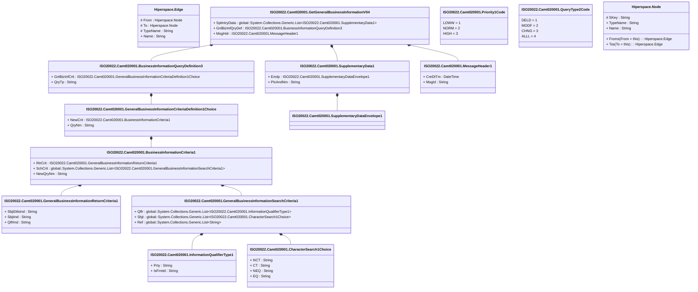

# camt.020.001.04

> The tables below contain descriptions of the members of each Element. 
> The first column indicates the type of the member:
> A ‘#’ indicates that the field is a key to the element, and a ‘+’ indicates that the field is a value.
> The ‘*’ column contains a description for the element member.  
> The ‘@’ column contains any properties for the member.
> The ‘=’ column contains calculated values; or in the case of an enum, the serialized value.

---

## View Hiperspace.Edge
edge between nodes

| |Name|Type|*|@|=|
|-|-|-|-|-|-|
|#|From|Hiperspace.Node||||
|#|To|Hiperspace.Node||||
|#|TypeName|String||||
|+|Name|String||||

---

## Value ISO20022.Camt020001.BusinessInformationCriteria1

| |Name|Type|*|@|=|
|-|-|-|-|-|-|
|+|RtrCrit|ISO20022.Camt020001.GeneralBusinessInformationReturnCriteria1||XmlElement()||
|+|SchCrit|global::System.Collections.Generic.List<ISO20022.Camt020001.GeneralBusinessInformationSearchCriteria1>||XmlElement()||
|+|NewQryNm|String||XmlElement()||
||Validation|Some(String)||XmlIgnore(), JsonIgnore()|validation(validElement(RtrCrit),validList("""SchCrit""",SchCrit),validElement(SchCrit))|

---

## Value ISO20022.Camt020001.BusinessInformationQueryDefinition3

| |Name|Type|*|@|=|
|-|-|-|-|-|-|
|+|GnlBizInfCrit|ISO20022.Camt020001.GeneralBusinessInformationCriteriaDefinition1Choice||XmlElement()||
|+|QryTp|String||XmlElement()||
||Validation|Some(String)||XmlIgnore(), JsonIgnore()|validation(validElement(GnlBizInfCrit))|

---

## Value ISO20022.Camt020001.CharacterSearch1Choice

| |Name|Type|*|@|=|
|-|-|-|-|-|-|
|+|NCT|String||XmlElement()||
|+|CT|String||XmlElement()||
|+|NEQ|String||XmlElement()||
|+|EQ|String||XmlElement()||
||Validation|Some(String)||XmlIgnore(), JsonIgnore()|validation(validChoice(NCT,CT,NEQ,EQ))|

---

## Type ISO20022.Camt020001.Document

| |Name|Type|*|@|=|
|-|-|-|-|-|-|
|+|GetGnlBizInf|ISO20022.Camt020001.GetGeneralBusinessInformationV04||XmlElement()||
||Validation|Some(String)||XmlIgnore(), JsonIgnore()|validation(validElement(GetGnlBizInf))|

---

## Value ISO20022.Camt020001.GeneralBusinessInformationCriteriaDefinition1Choice

| |Name|Type|*|@|=|
|-|-|-|-|-|-|
|+|NewCrit|ISO20022.Camt020001.BusinessInformationCriteria1||XmlElement()||
|+|QryNm|String||XmlElement()||
||Validation|Some(String)||XmlIgnore(), JsonIgnore()|validation(validElement(NewCrit),validChoice(NewCrit,QryNm))|

---

## Value ISO20022.Camt020001.GeneralBusinessInformationReturnCriteria1

| |Name|Type|*|@|=|
|-|-|-|-|-|-|
|+|SbjtDtlsInd|String||XmlElement()||
|+|SbjtInd|String||XmlElement()||
|+|QlfrInd|String||XmlElement()||
||Validation|Some(String)||XmlIgnore(), JsonIgnore()|""|

---

## Value ISO20022.Camt020001.GeneralBusinessInformationSearchCriteria1

| |Name|Type|*|@|=|
|-|-|-|-|-|-|
|+|Qlfr|global::System.Collections.Generic.List<ISO20022.Camt020001.InformationQualifierType1>||XmlElement()||
|+|Sbjt|global::System.Collections.Generic.List<ISO20022.Camt020001.CharacterSearch1Choice>||XmlElement()||
|+|Ref|global::System.Collections.Generic.List<String>||XmlElement()||
||Validation|Some(String)||XmlIgnore(), JsonIgnore()|validation(validList("""Qlfr""",Qlfr),validElement(Qlfr),validList("""Sbjt""",Sbjt),validElement(Sbjt))|

---

## Aspect ISO20022.Camt020001.GetGeneralBusinessInformationV04

| |Name|Type|*|@|=|
|-|-|-|-|-|-|
|+|SplmtryData|global::System.Collections.Generic.List<ISO20022.Camt020001.SupplementaryData1>||XmlElement()||
|+|GnlBizInfQryDef|ISO20022.Camt020001.BusinessInformationQueryDefinition3||XmlElement()||
|+|MsgHdr|ISO20022.Camt020001.MessageHeader1||XmlElement()||
||Validation|Some(String)||XmlIgnore(), JsonIgnore()|validation(validList("""SplmtryData""",SplmtryData),validElement(SplmtryData),validElement(GnlBizInfQryDef),validElement(MsgHdr))|

---

## Value ISO20022.Camt020001.InformationQualifierType1

| |Name|Type|*|@|=|
|-|-|-|-|-|-|
|+|Prty|String||XmlElement()||
|+|IsFrmtd|String||XmlElement()||
||Validation|Some(String)||XmlIgnore(), JsonIgnore()|""|

---

## Value ISO20022.Camt020001.MessageHeader1

| |Name|Type|*|@|=|
|-|-|-|-|-|-|
|+|CreDtTm|DateTime||XmlElement()||
|+|MsgId|String||XmlElement()||
||Validation|Some(String)||XmlIgnore(), JsonIgnore()|""|

---

## Enum ISO20022.Camt020001.Priority1Code

| |Name|Type|*|@|=|
|-|-|-|-|-|-|
||LOWW|Int32||XmlEnum("""LOWW""")|1|
||NORM|Int32||XmlEnum("""NORM""")|2|
||HIGH|Int32||XmlEnum("""HIGH""")|3|

---

## Enum ISO20022.Camt020001.QueryType2Code

| |Name|Type|*|@|=|
|-|-|-|-|-|-|
||DELD|Int32||XmlEnum("""DELD""")|1|
||MODF|Int32||XmlEnum("""MODF""")|2|
||CHNG|Int32||XmlEnum("""CHNG""")|3|
||ALLL|Int32||XmlEnum("""ALLL""")|4|

---

## Value ISO20022.Camt020001.SupplementaryData1

| |Name|Type|*|@|=|
|-|-|-|-|-|-|
|+|Envlp|ISO20022.Camt020001.SupplementaryDataEnvelope1||XmlElement()||
|+|PlcAndNm|String||XmlElement()||
||Validation|Some(String)||XmlIgnore(), JsonIgnore()|validation(validElement(Envlp))|

---

## Value ISO20022.Camt020001.SupplementaryDataEnvelope1

| |Name|Type|*|@|=|
|-|-|-|-|-|-|
||Validation|Some(String)||XmlIgnore(), JsonIgnore()|""|

---

## View Hiperspace.Node
node in a graph view of data

| |Name|Type|*|@|=|
|-|-|-|-|-|-|
|#|SKey|String||||
|+|TypeName|String||||
|+|Name|String||||
||Froms|Hiperspace.Edge|||From = this|
||Tos|Hiperspace.Edge|||To = this|

