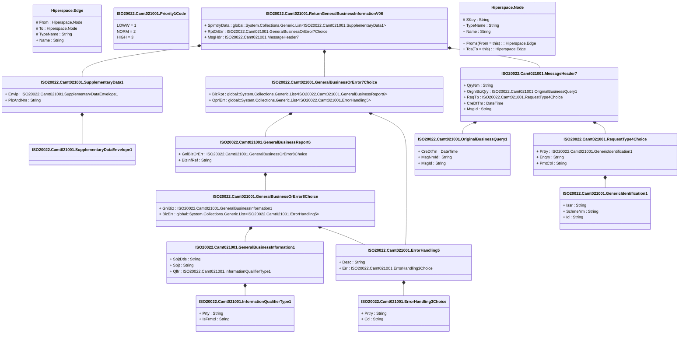

# camt.021.001.06

> The tables below contain descriptions of the members of each Element. 
> The first column indicates the type of the member:
> A ‘#’ indicates that the field is a key to the element, and a ‘+’ indicates that the field is a value.
> The ‘*’ column contains a description for the element member.  
> The ‘@’ column contains any properties for the member.
> The ‘=’ column contains calculated values; or in the case of an enum, the serialized value.

---

## View Hiperspace.Edge
edge between nodes

| |Name|Type|*|@|=|
|-|-|-|-|-|-|
|#|From|Hiperspace.Node||||
|#|To|Hiperspace.Node||||
|#|TypeName|String||||
|+|Name|String||||

---

## Type ISO20022.Camt021001.Document

| |Name|Type|*|@|=|
|-|-|-|-|-|-|
|+|RtrGnlBizInf|ISO20022.Camt021001.ReturnGeneralBusinessInformationV06||XmlElement()||
||Validation|Some(String)||XmlIgnore(), JsonIgnore()|validation(validElement(RtrGnlBizInf))|

---

## Value ISO20022.Camt021001.ErrorHandling3Choice

| |Name|Type|*|@|=|
|-|-|-|-|-|-|
|+|Prtry|String||XmlElement()||
|+|Cd|String||XmlElement()||
||Validation|Some(String)||XmlIgnore(), JsonIgnore()|validation(validChoice(Prtry,Cd))|

---

## Value ISO20022.Camt021001.ErrorHandling5

| |Name|Type|*|@|=|
|-|-|-|-|-|-|
|+|Desc|String||XmlElement()||
|+|Err|ISO20022.Camt021001.ErrorHandling3Choice||XmlElement()||
||Validation|Some(String)||XmlIgnore(), JsonIgnore()|validation(validElement(Err))|

---

## Value ISO20022.Camt021001.GeneralBusinessInformation1

| |Name|Type|*|@|=|
|-|-|-|-|-|-|
|+|SbjtDtls|String||XmlElement()||
|+|Sbjt|String||XmlElement()||
|+|Qlfr|ISO20022.Camt021001.InformationQualifierType1||XmlElement()||
||Validation|Some(String)||XmlIgnore(), JsonIgnore()|validation(validElement(Qlfr))|

---

## Value ISO20022.Camt021001.GeneralBusinessOrError7Choice

| |Name|Type|*|@|=|
|-|-|-|-|-|-|
|+|BizRpt|global::System.Collections.Generic.List<ISO20022.Camt021001.GeneralBusinessReport6>||XmlElement()||
|+|OprlErr|global::System.Collections.Generic.List<ISO20022.Camt021001.ErrorHandling5>||XmlElement()||
||Validation|Some(String)||XmlIgnore(), JsonIgnore()|validation(validRequired("""BizRpt""",BizRpt),validList("""BizRpt""",BizRpt),validElement(BizRpt),validRequired("""OprlErr""",OprlErr),validList("""OprlErr""",OprlErr),validElement(OprlErr),validChoice(BizRpt,OprlErr))|

---

## Value ISO20022.Camt021001.GeneralBusinessOrError8Choice

| |Name|Type|*|@|=|
|-|-|-|-|-|-|
|+|GnlBiz|ISO20022.Camt021001.GeneralBusinessInformation1||XmlElement()||
|+|BizErr|global::System.Collections.Generic.List<ISO20022.Camt021001.ErrorHandling5>||XmlElement()||
||Validation|Some(String)||XmlIgnore(), JsonIgnore()|validation(validElement(GnlBiz),validRequired("""BizErr""",BizErr),validList("""BizErr""",BizErr),validElement(BizErr),validChoice(GnlBiz,BizErr))|

---

## Value ISO20022.Camt021001.GeneralBusinessReport6

| |Name|Type|*|@|=|
|-|-|-|-|-|-|
|+|GnlBizOrErr|ISO20022.Camt021001.GeneralBusinessOrError8Choice||XmlElement()||
|+|BizInfRef|String||XmlElement()||
||Validation|Some(String)||XmlIgnore(), JsonIgnore()|validation(validElement(GnlBizOrErr))|

---

## Value ISO20022.Camt021001.GenericIdentification1

| |Name|Type|*|@|=|
|-|-|-|-|-|-|
|+|Issr|String||XmlElement()||
|+|SchmeNm|String||XmlElement()||
|+|Id|String||XmlElement()||
||Validation|Some(String)||XmlIgnore(), JsonIgnore()|""|

---

## Value ISO20022.Camt021001.InformationQualifierType1

| |Name|Type|*|@|=|
|-|-|-|-|-|-|
|+|Prty|String||XmlElement()||
|+|IsFrmtd|String||XmlElement()||
||Validation|Some(String)||XmlIgnore(), JsonIgnore()|""|

---

## Value ISO20022.Camt021001.MessageHeader7

| |Name|Type|*|@|=|
|-|-|-|-|-|-|
|+|QryNm|String||XmlElement()||
|+|OrgnlBizQry|ISO20022.Camt021001.OriginalBusinessQuery1||XmlElement()||
|+|ReqTp|ISO20022.Camt021001.RequestType4Choice||XmlElement()||
|+|CreDtTm|DateTime||XmlElement()||
|+|MsgId|String||XmlElement()||
||Validation|Some(String)||XmlIgnore(), JsonIgnore()|validation(validElement(OrgnlBizQry),validElement(ReqTp))|

---

## Value ISO20022.Camt021001.OriginalBusinessQuery1

| |Name|Type|*|@|=|
|-|-|-|-|-|-|
|+|CreDtTm|DateTime||XmlElement()||
|+|MsgNmId|String||XmlElement()||
|+|MsgId|String||XmlElement()||
||Validation|Some(String)||XmlIgnore(), JsonIgnore()|""|

---

## Enum ISO20022.Camt021001.Priority1Code

| |Name|Type|*|@|=|
|-|-|-|-|-|-|
||LOWW|Int32||XmlEnum("""LOWW""")|1|
||NORM|Int32||XmlEnum("""NORM""")|2|
||HIGH|Int32||XmlEnum("""HIGH""")|3|

---

## Value ISO20022.Camt021001.RequestType4Choice

| |Name|Type|*|@|=|
|-|-|-|-|-|-|
|+|Prtry|ISO20022.Camt021001.GenericIdentification1||XmlElement()||
|+|Enqry|String||XmlElement()||
|+|PmtCtrl|String||XmlElement()||
||Validation|Some(String)||XmlIgnore(), JsonIgnore()|validation(validElement(Prtry),validChoice(Prtry,Enqry,PmtCtrl))|

---

## Aspect ISO20022.Camt021001.ReturnGeneralBusinessInformationV06

| |Name|Type|*|@|=|
|-|-|-|-|-|-|
|+|SplmtryData|global::System.Collections.Generic.List<ISO20022.Camt021001.SupplementaryData1>||XmlElement()||
|+|RptOrErr|ISO20022.Camt021001.GeneralBusinessOrError7Choice||XmlElement()||
|+|MsgHdr|ISO20022.Camt021001.MessageHeader7||XmlElement()||
||Validation|Some(String)||XmlIgnore(), JsonIgnore()|validation(validList("""SplmtryData""",SplmtryData),validElement(SplmtryData),validElement(RptOrErr),validElement(MsgHdr))|

---

## Value ISO20022.Camt021001.SupplementaryData1

| |Name|Type|*|@|=|
|-|-|-|-|-|-|
|+|Envlp|ISO20022.Camt021001.SupplementaryDataEnvelope1||XmlElement()||
|+|PlcAndNm|String||XmlElement()||
||Validation|Some(String)||XmlIgnore(), JsonIgnore()|validation(validElement(Envlp))|

---

## Value ISO20022.Camt021001.SupplementaryDataEnvelope1

| |Name|Type|*|@|=|
|-|-|-|-|-|-|
||Validation|Some(String)||XmlIgnore(), JsonIgnore()|""|

---

## View Hiperspace.Node
node in a graph view of data

| |Name|Type|*|@|=|
|-|-|-|-|-|-|
|#|SKey|String||||
|+|TypeName|String||||
|+|Name|String||||
||Froms|Hiperspace.Edge|||From = this|
||Tos|Hiperspace.Edge|||To = this|

