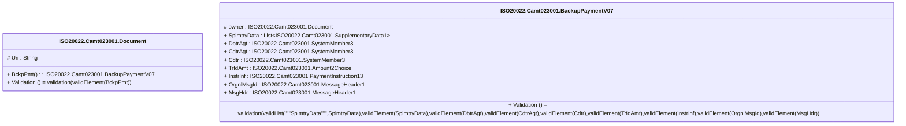

# camt.023.001.07-physical

> The tables below contain descriptions of the members of each Element. 
> The first column indicates the type of the member:
> A ‘#’ indicates that the field is a key to the element, and a ‘+’ indicates that the field is a value.
> The ‘*’ column contains a description for the element member.  
> The ‘@’ column contains any properties for the member.
> The ‘=’ column contains calculated values; or in the case of an enum, the serialized value.

---

## EntityImpl ISO20022.Camt023001.Document

| |Name|Type|*|@|=|
|-|-|-|-|-|-|
|#|Uri|String||XmlIgnore(), JsonIgnore()||
|+|BckpPmt|ISO20022.Camt023001.BackupPaymentV07||XmlElement()||
||Validation|Some(String)||XmlIgnore(), JsonIgnore()|validation(validElement(BckpPmt))|

---

## AspectImpl ISO20022.Camt023001.BackupPaymentV07

| |Name|Type|*|@|=|
|-|-|-|-|-|-|
|#|owner|ISO20022.Camt023001.Document||||
|+|SplmtryData|List<ISO20022.Camt023001.SupplementaryData1>||XmlElement()||
|+|DbtrAgt|ISO20022.Camt023001.SystemMember3||XmlElement()||
|+|CdtrAgt|ISO20022.Camt023001.SystemMember3||XmlElement()||
|+|Cdtr|ISO20022.Camt023001.SystemMember3||XmlElement()||
|+|TrfdAmt|ISO20022.Camt023001.Amount2Choice||XmlElement()||
|+|InstrInf|ISO20022.Camt023001.PaymentInstruction13||XmlElement()||
|+|OrgnlMsgId|ISO20022.Camt023001.MessageHeader1||XmlElement()||
|+|MsgHdr|ISO20022.Camt023001.MessageHeader1||XmlElement()||
||Validation|Some(String)||XmlIgnore(), JsonIgnore()|validation(validList("""SplmtryData""",SplmtryData),validElement(SplmtryData),validElement(DbtrAgt),validElement(CdtrAgt),validElement(Cdtr),validElement(TrfdAmt),validElement(InstrInf),validElement(OrgnlMsgId),validElement(MsgHdr))|

