# camt.023.001.07

```mermaid
classDiagram
    class Hiperspace.Edge {
        # From  : Hiperspace.Node
        # To  : Hiperspace.Node
        # TypeName  : String
        + Name  : String
    }
    class ISO20022.Camt023001.ActiveCurrencyAndAmount {
        + Value  : Decimal
        + Ccy  : String
    }
    class ISO20022.Camt023001.Amount2Choice {
        + AmtWthCcy  : ISO20022.Camt023001.ActiveCurrencyAndAmount
        + AmtWthtCcy  : Decimal
    }
    ISO20022.Camt023001.Amount2Choice *-- ISO20022.Camt023001.ActiveCurrencyAndAmount
    class ISO20022.Camt023001.BackupPaymentV07 {
        + SplmtryData  : global::System.Collections.Generic.List~ISO20022.Camt023001.SupplementaryData1~
        + DbtrAgt  : ISO20022.Camt023001.SystemMember3
        + CdtrAgt  : ISO20022.Camt023001.SystemMember3
        + Cdtr  : ISO20022.Camt023001.SystemMember3
        + TrfdAmt  : ISO20022.Camt023001.Amount2Choice
        + InstrInf  : ISO20022.Camt023001.PaymentInstruction13
        + OrgnlMsgId  : ISO20022.Camt023001.MessageHeader1
        + MsgHdr  : ISO20022.Camt023001.MessageHeader1
    }
    ISO20022.Camt023001.BackupPaymentV07 *-- ISO20022.Camt023001.SupplementaryData1
    ISO20022.Camt023001.BackupPaymentV07 *-- ISO20022.Camt023001.SystemMember3
    ISO20022.Camt023001.BackupPaymentV07 *-- ISO20022.Camt023001.SystemMember3
    ISO20022.Camt023001.BackupPaymentV07 *-- ISO20022.Camt023001.SystemMember3
    ISO20022.Camt023001.BackupPaymentV07 *-- ISO20022.Camt023001.Amount2Choice
    ISO20022.Camt023001.BackupPaymentV07 *-- ISO20022.Camt023001.PaymentInstruction13
    ISO20022.Camt023001.BackupPaymentV07 *-- ISO20022.Camt023001.MessageHeader1
    ISO20022.Camt023001.BackupPaymentV07 *-- ISO20022.Camt023001.MessageHeader1
    class ISO20022.Camt023001.ClearingSystemIdentification2Choice {
        + Prtry  : String
        + Cd  : String
    }
    class ISO20022.Camt023001.ClearingSystemMemberIdentification2 {
        + MmbId  : String
        + ClrSysId  : ISO20022.Camt023001.ClearingSystemIdentification2Choice
    }
    ISO20022.Camt023001.ClearingSystemMemberIdentification2 *-- ISO20022.Camt023001.ClearingSystemIdentification2Choice
    class ISO20022.Camt023001.FinancialIdentificationSchemeName1Choice {
        + Prtry  : String
        + Cd  : String
    }
    class ISO20022.Camt023001.GenericFinancialIdentification1 {
        + Issr  : String
        + SchmeNm  : ISO20022.Camt023001.FinancialIdentificationSchemeName1Choice
        + Id  : String
    }
    ISO20022.Camt023001.GenericFinancialIdentification1 *-- ISO20022.Camt023001.FinancialIdentificationSchemeName1Choice
    class ISO20022.Camt023001.MarketInfrastructureIdentification1Choice {
        + Prtry  : String
        + Cd  : String
    }
    class ISO20022.Camt023001.MemberIdentification3Choice {
        + Othr  : ISO20022.Camt023001.GenericFinancialIdentification1
        + ClrSysMmbId  : ISO20022.Camt023001.ClearingSystemMemberIdentification2
        + BICFI  : String
    }
    ISO20022.Camt023001.MemberIdentification3Choice *-- ISO20022.Camt023001.GenericFinancialIdentification1
    ISO20022.Camt023001.MemberIdentification3Choice *-- ISO20022.Camt023001.ClearingSystemMemberIdentification2
    class ISO20022.Camt023001.MessageHeader1 {
        + CreDtTm  : DateTime
        + MsgId  : String
    }
    class ISO20022.Camt023001.PaymentInstruction13 {
        + PmtTp  : ISO20022.Camt023001.PaymentType4Choice
        + ReqdExctnDtTm  : DateTime
    }
    ISO20022.Camt023001.PaymentInstruction13 *-- ISO20022.Camt023001.PaymentType4Choice
    class ISO20022.Camt023001.PaymentType3Code {
        MGL = 1
        OND = 2
        TCP = 3
        LOR = 4
        LOA = 5
        TCS = 6
        TRP = 7
        STF = 8
        DPS = 9
        DPH = 10
        DPP = 11
        LIQ = 12
        LMT = 13
        TCH = 14
        EXP = 15
        DPN = 16
        DPG = 17
        CBP = 18
        CBH = 19
        CTR = 20
        CLS = 21
        BAL = 22
        BCK = 23
        CBS = 24
    }
    class ISO20022.Camt023001.PaymentType4Choice {
        + Prtry  : String
        + Cd  : String
    }
    class ISO20022.Camt023001.SupplementaryData1 {
        + Envlp  : ISO20022.Camt023001.SupplementaryDataEnvelope1
        + PlcAndNm  : String
    }
    ISO20022.Camt023001.SupplementaryData1 *-- ISO20022.Camt023001.SupplementaryDataEnvelope1
    class ISO20022.Camt023001.SupplementaryDataEnvelope1 {
    }
    class ISO20022.Camt023001.SystemIdentification2Choice {
        + Ctry  : String
        + MktInfrstrctrId  : ISO20022.Camt023001.MarketInfrastructureIdentification1Choice
    }
    ISO20022.Camt023001.SystemIdentification2Choice *-- ISO20022.Camt023001.MarketInfrastructureIdentification1Choice
    class ISO20022.Camt023001.SystemMember3 {
        + MmbId  : ISO20022.Camt023001.MemberIdentification3Choice
        + SysId  : ISO20022.Camt023001.SystemIdentification2Choice
    }
    ISO20022.Camt023001.SystemMember3 *-- ISO20022.Camt023001.MemberIdentification3Choice
    ISO20022.Camt023001.SystemMember3 *-- ISO20022.Camt023001.SystemIdentification2Choice
    class Hiperspace.Node {
        # SKey  : String
        + TypeName  : String
        + Name  : String
        + Froms (From = this) : Hiperspace.Edge
        + Tos (To = this) : Hiperspace.Edge
    }
```

> The tables below contain descriptions of the members of each Element. 
> The first column indicates the type of the member:
> A ‘#’ indicates that the field is a key to the element, and a ‘+’ indicates that the field is a value.
> The ‘*’ column contains a description for the element member.  
> The ‘@’ column contains any properties for the member.
> The ‘=’ column contains calculated values; or in the case of an enum, the serialized value.

---

## View Hiperspace.Edge
edge between nodes

| |Name|Type|*|@|=|
|-|-|-|-|-|-|
|#|From|Hiperspace.Node||||
|#|To|Hiperspace.Node||||
|#|TypeName|String||||
|+|Name|String||||

---

## Value ISO20022.Camt023001.ActiveCurrencyAndAmount

| |Name|Type|*|@|=|
|-|-|-|-|-|-|
|+|Value|Decimal||XmlElement()||
|+|Ccy|String||XmlAttribute()||
||Validation|Some(String)||XmlIgnore(), JsonIgnore()|validation(validRequired("""Value""",Value),validRequired("""Ccy""",Ccy),validPattern("""Ccy""",Ccy,"""[A-Z]{3,3}"""))|

---

## Value ISO20022.Camt023001.Amount2Choice

| |Name|Type|*|@|=|
|-|-|-|-|-|-|
|+|AmtWthCcy|ISO20022.Camt023001.ActiveCurrencyAndAmount||XmlElement()||
|+|AmtWthtCcy|Decimal||XmlElement()||
||Validation|Some(String)||XmlIgnore(), JsonIgnore()|validation(validElement(AmtWthCcy),validChoice(AmtWthCcy,AmtWthtCcy))|

---

## Aspect ISO20022.Camt023001.BackupPaymentV07

| |Name|Type|*|@|=|
|-|-|-|-|-|-|
|+|SplmtryData|global::System.Collections.Generic.List<ISO20022.Camt023001.SupplementaryData1>||XmlElement()||
|+|DbtrAgt|ISO20022.Camt023001.SystemMember3||XmlElement()||
|+|CdtrAgt|ISO20022.Camt023001.SystemMember3||XmlElement()||
|+|Cdtr|ISO20022.Camt023001.SystemMember3||XmlElement()||
|+|TrfdAmt|ISO20022.Camt023001.Amount2Choice||XmlElement()||
|+|InstrInf|ISO20022.Camt023001.PaymentInstruction13||XmlElement()||
|+|OrgnlMsgId|ISO20022.Camt023001.MessageHeader1||XmlElement()||
|+|MsgHdr|ISO20022.Camt023001.MessageHeader1||XmlElement()||
||Validation|Some(String)||XmlIgnore(), JsonIgnore()|validation(validList("""SplmtryData""",SplmtryData),validElement(SplmtryData),validElement(DbtrAgt),validElement(CdtrAgt),validElement(Cdtr),validElement(TrfdAmt),validElement(InstrInf),validElement(OrgnlMsgId),validElement(MsgHdr))|

---

## Value ISO20022.Camt023001.ClearingSystemIdentification2Choice

| |Name|Type|*|@|=|
|-|-|-|-|-|-|
|+|Prtry|String||XmlElement()||
|+|Cd|String||XmlElement()||
||Validation|Some(String)||XmlIgnore(), JsonIgnore()|validation(validChoice(Prtry,Cd))|

---

## Value ISO20022.Camt023001.ClearingSystemMemberIdentification2

| |Name|Type|*|@|=|
|-|-|-|-|-|-|
|+|MmbId|String||XmlElement()||
|+|ClrSysId|ISO20022.Camt023001.ClearingSystemIdentification2Choice||XmlElement()||
||Validation|Some(String)||XmlIgnore(), JsonIgnore()|validation(validElement(ClrSysId))|

---

## Type ISO20022.Camt023001.Document

| |Name|Type|*|@|=|
|-|-|-|-|-|-|
|+|BckpPmt|ISO20022.Camt023001.BackupPaymentV07||XmlElement()||
||Validation|Some(String)||XmlIgnore(), JsonIgnore()|validation(validElement(BckpPmt))|

---

## Value ISO20022.Camt023001.FinancialIdentificationSchemeName1Choice

| |Name|Type|*|@|=|
|-|-|-|-|-|-|
|+|Prtry|String||XmlElement()||
|+|Cd|String||XmlElement()||
||Validation|Some(String)||XmlIgnore(), JsonIgnore()|validation(validChoice(Prtry,Cd))|

---

## Value ISO20022.Camt023001.GenericFinancialIdentification1

| |Name|Type|*|@|=|
|-|-|-|-|-|-|
|+|Issr|String||XmlElement()||
|+|SchmeNm|ISO20022.Camt023001.FinancialIdentificationSchemeName1Choice||XmlElement()||
|+|Id|String||XmlElement()||
||Validation|Some(String)||XmlIgnore(), JsonIgnore()|validation(validElement(SchmeNm))|

---

## Value ISO20022.Camt023001.MarketInfrastructureIdentification1Choice

| |Name|Type|*|@|=|
|-|-|-|-|-|-|
|+|Prtry|String||XmlElement()||
|+|Cd|String||XmlElement()||
||Validation|Some(String)||XmlIgnore(), JsonIgnore()|validation(validChoice(Prtry,Cd))|

---

## Value ISO20022.Camt023001.MemberIdentification3Choice

| |Name|Type|*|@|=|
|-|-|-|-|-|-|
|+|Othr|ISO20022.Camt023001.GenericFinancialIdentification1||XmlElement()||
|+|ClrSysMmbId|ISO20022.Camt023001.ClearingSystemMemberIdentification2||XmlElement()||
|+|BICFI|String||XmlElement()||
||Validation|Some(String)||XmlIgnore(), JsonIgnore()|validation(validElement(Othr),validElement(ClrSysMmbId),validPattern("""BICFI""",BICFI,"""[A-Z0-9]{4,4}[A-Z]{2,2}[A-Z0-9]{2,2}([A-Z0-9]{3,3}){0,1}"""),validChoice(Othr,ClrSysMmbId,BICFI))|

---

## Value ISO20022.Camt023001.MessageHeader1

| |Name|Type|*|@|=|
|-|-|-|-|-|-|
|+|CreDtTm|DateTime||XmlElement()||
|+|MsgId|String||XmlElement()||
||Validation|Some(String)||XmlIgnore(), JsonIgnore()|""|

---

## Value ISO20022.Camt023001.PaymentInstruction13

| |Name|Type|*|@|=|
|-|-|-|-|-|-|
|+|PmtTp|ISO20022.Camt023001.PaymentType4Choice||XmlElement()||
|+|ReqdExctnDtTm|DateTime||XmlElement()||
||Validation|Some(String)||XmlIgnore(), JsonIgnore()|validation(validElement(PmtTp))|

---

## Enum ISO20022.Camt023001.PaymentType3Code

| |Name|Type|*|@|=|
|-|-|-|-|-|-|
||MGL|Int32||XmlEnum("""MGL""")|1|
||OND|Int32||XmlEnum("""OND""")|2|
||TCP|Int32||XmlEnum("""TCP""")|3|
||LOR|Int32||XmlEnum("""LOR""")|4|
||LOA|Int32||XmlEnum("""LOA""")|5|
||TCS|Int32||XmlEnum("""TCS""")|6|
||TRP|Int32||XmlEnum("""TRP""")|7|
||STF|Int32||XmlEnum("""STF""")|8|
||DPS|Int32||XmlEnum("""DPS""")|9|
||DPH|Int32||XmlEnum("""DPH""")|10|
||DPP|Int32||XmlEnum("""DPP""")|11|
||LIQ|Int32||XmlEnum("""LIQ""")|12|
||LMT|Int32||XmlEnum("""LMT""")|13|
||TCH|Int32||XmlEnum("""TCH""")|14|
||EXP|Int32||XmlEnum("""EXP""")|15|
||DPN|Int32||XmlEnum("""DPN""")|16|
||DPG|Int32||XmlEnum("""DPG""")|17|
||CBP|Int32||XmlEnum("""CBP""")|18|
||CBH|Int32||XmlEnum("""CBH""")|19|
||CTR|Int32||XmlEnum("""CTR""")|20|
||CLS|Int32||XmlEnum("""CLS""")|21|
||BAL|Int32||XmlEnum("""BAL""")|22|
||BCK|Int32||XmlEnum("""BCK""")|23|
||CBS|Int32||XmlEnum("""CBS""")|24|

---

## Value ISO20022.Camt023001.PaymentType4Choice

| |Name|Type|*|@|=|
|-|-|-|-|-|-|
|+|Prtry|String||XmlElement()||
|+|Cd|String||XmlElement()||
||Validation|Some(String)||XmlIgnore(), JsonIgnore()|validation(validChoice(Prtry,Cd))|

---

## Value ISO20022.Camt023001.SupplementaryData1

| |Name|Type|*|@|=|
|-|-|-|-|-|-|
|+|Envlp|ISO20022.Camt023001.SupplementaryDataEnvelope1||XmlElement()||
|+|PlcAndNm|String||XmlElement()||
||Validation|Some(String)||XmlIgnore(), JsonIgnore()|validation(validElement(Envlp))|

---

## Value ISO20022.Camt023001.SupplementaryDataEnvelope1

| |Name|Type|*|@|=|
|-|-|-|-|-|-|
||Validation|Some(String)||XmlIgnore(), JsonIgnore()|""|

---

## Value ISO20022.Camt023001.SystemIdentification2Choice

| |Name|Type|*|@|=|
|-|-|-|-|-|-|
|+|Ctry|String||XmlElement()||
|+|MktInfrstrctrId|ISO20022.Camt023001.MarketInfrastructureIdentification1Choice||XmlElement()||
||Validation|Some(String)||XmlIgnore(), JsonIgnore()|validation(validPattern("""Ctry""",Ctry,"""[A-Z]{2,2}"""),validElement(MktInfrstrctrId),validChoice(Ctry,MktInfrstrctrId))|

---

## Value ISO20022.Camt023001.SystemMember3

| |Name|Type|*|@|=|
|-|-|-|-|-|-|
|+|MmbId|ISO20022.Camt023001.MemberIdentification3Choice||XmlElement()||
|+|SysId|ISO20022.Camt023001.SystemIdentification2Choice||XmlElement()||
||Validation|Some(String)||XmlIgnore(), JsonIgnore()|validation(validElement(MmbId),validElement(SysId))|

---

## View Hiperspace.Node
node in a graph view of data

| |Name|Type|*|@|=|
|-|-|-|-|-|-|
|#|SKey|String||||
|+|TypeName|String||||
|+|Name|String||||
||Froms|Hiperspace.Edge|||From = this|
||Tos|Hiperspace.Edge|||To = this|

