# camt.024.001.08

```mermaid
classDiagram
    class Hiperspace.Edge {
        # From  : Hiperspace.Node
        # To  : Hiperspace.Node
        # TypeName  : String
        + Name  : String
    }
    class ISO20022.Camt024001.AccountIdentification4Choice {
        + Othr  : ISO20022.Camt024001.GenericAccountIdentification1
        + IBAN  : String
    }
    ISO20022.Camt024001.AccountIdentification4Choice *-- ISO20022.Camt024001.GenericAccountIdentification1
    class ISO20022.Camt024001.AccountSchemeName1Choice {
        + Prtry  : String
        + Cd  : String
    }
    class ISO20022.Camt024001.ActiveCurrencyAndAmount {
        + Value  : Decimal
        + Ccy  : String
    }
    class ISO20022.Camt024001.AddressType2Code {
        DLVY = 1
        MLTO = 2
        BIZZ = 3
        HOME = 4
        PBOX = 5
        ADDR = 6
    }
    class ISO20022.Camt024001.AddressType3Choice {
        + Prtry  : ISO20022.Camt024001.GenericIdentification30
        + Cd  : String
    }
    ISO20022.Camt024001.AddressType3Choice *-- ISO20022.Camt024001.GenericIdentification30
    class ISO20022.Camt024001.Amount2Choice {
        + AmtWthCcy  : ISO20022.Camt024001.ActiveCurrencyAndAmount
        + AmtWthtCcy  : Decimal
    }
    ISO20022.Camt024001.Amount2Choice *-- ISO20022.Camt024001.ActiveCurrencyAndAmount
    class ISO20022.Camt024001.BranchAndFinancialInstitutionIdentification8 {
        + BrnchId  : ISO20022.Camt024001.BranchData5
        + FinInstnId  : ISO20022.Camt024001.FinancialInstitutionIdentification23
    }
    ISO20022.Camt024001.BranchAndFinancialInstitutionIdentification8 *-- ISO20022.Camt024001.BranchData5
    ISO20022.Camt024001.BranchAndFinancialInstitutionIdentification8 *-- ISO20022.Camt024001.FinancialInstitutionIdentification23
    class ISO20022.Camt024001.BranchData5 {
        + PstlAdr  : ISO20022.Camt024001.PostalAddress27
        + Nm  : String
        + LEI  : String
        + Id  : String
    }
    ISO20022.Camt024001.BranchData5 *-- ISO20022.Camt024001.PostalAddress27
    class ISO20022.Camt024001.CashAccount40 {
        + Prxy  : ISO20022.Camt024001.ProxyAccountIdentification1
        + Nm  : String
        + Ccy  : String
        + Tp  : ISO20022.Camt024001.CashAccountType2Choice
        + Id  : ISO20022.Camt024001.AccountIdentification4Choice
    }
    ISO20022.Camt024001.CashAccount40 *-- ISO20022.Camt024001.ProxyAccountIdentification1
    ISO20022.Camt024001.CashAccount40 *-- ISO20022.Camt024001.CashAccountType2Choice
    ISO20022.Camt024001.CashAccount40 *-- ISO20022.Camt024001.AccountIdentification4Choice
    class ISO20022.Camt024001.CashAccountType2Choice {
        + Prtry  : String
        + Cd  : String
    }
    class ISO20022.Camt024001.ClearingSystemIdentification2Choice {
        + Prtry  : String
        + Cd  : String
    }
    class ISO20022.Camt024001.ClearingSystemMemberIdentification2 {
        + MmbId  : String
        + ClrSysId  : ISO20022.Camt024001.ClearingSystemIdentification2Choice
    }
    ISO20022.Camt024001.ClearingSystemMemberIdentification2 *-- ISO20022.Camt024001.ClearingSystemIdentification2Choice
    class ISO20022.Camt024001.DatePeriod2 {
        + ToDt  : DateTime
        + FrDt  : DateTime
    }
    class ISO20022.Camt024001.DatePeriod2Choice {
        + FrToDt  : ISO20022.Camt024001.DatePeriod2
        + ToDt  : DateTime
        + FrDt  : DateTime
    }
    ISO20022.Camt024001.DatePeriod2Choice *-- ISO20022.Camt024001.DatePeriod2
    class ISO20022.Camt024001.EventType1Choice {
        + Prtry  : String
        + Cd  : String
    }
    class ISO20022.Camt024001.ExecutionType1Choice {
        + Evt  : ISO20022.Camt024001.EventType1Choice
        + Tm  : DateTime
    }
    ISO20022.Camt024001.ExecutionType1Choice *-- ISO20022.Camt024001.EventType1Choice
    class ISO20022.Camt024001.FinancialIdentificationSchemeName1Choice {
        + Prtry  : String
        + Cd  : String
    }
    class ISO20022.Camt024001.FinancialInstitutionIdentification23 {
        + Othr  : ISO20022.Camt024001.GenericFinancialIdentification1
        + PstlAdr  : ISO20022.Camt024001.PostalAddress27
        + Nm  : String
        + LEI  : String
        + ClrSysMmbId  : ISO20022.Camt024001.ClearingSystemMemberIdentification2
        + BICFI  : String
    }
    ISO20022.Camt024001.FinancialInstitutionIdentification23 *-- ISO20022.Camt024001.GenericFinancialIdentification1
    ISO20022.Camt024001.FinancialInstitutionIdentification23 *-- ISO20022.Camt024001.PostalAddress27
    ISO20022.Camt024001.FinancialInstitutionIdentification23 *-- ISO20022.Camt024001.ClearingSystemMemberIdentification2
    class ISO20022.Camt024001.Frequency2Code {
        OVNG = 1
        INDA = 2
        ADHO = 3
        DAIL = 4
        WEEK = 5
        MIAN = 6
        QURT = 7
        MNTH = 8
        YEAR = 9
    }
    class ISO20022.Camt024001.GenericAccountIdentification1 {
        + Issr  : String
        + SchmeNm  : ISO20022.Camt024001.AccountSchemeName1Choice
        + Id  : String
    }
    ISO20022.Camt024001.GenericAccountIdentification1 *-- ISO20022.Camt024001.AccountSchemeName1Choice
    class ISO20022.Camt024001.GenericFinancialIdentification1 {
        + Issr  : String
        + SchmeNm  : ISO20022.Camt024001.FinancialIdentificationSchemeName1Choice
        + Id  : String
    }
    ISO20022.Camt024001.GenericFinancialIdentification1 *-- ISO20022.Camt024001.FinancialIdentificationSchemeName1Choice
    class ISO20022.Camt024001.GenericIdentification30 {
        + SchmeNm  : String
        + Issr  : String
        + Id  : String
    }
    class ISO20022.Camt024001.MessageHeader1 {
        + CreDtTm  : DateTime
        + MsgId  : String
    }
    class ISO20022.Camt024001.ModifyStandingOrderV08 {
        + SplmtryData  : global::System.Collections.Generic.List~ISO20022.Camt024001.SupplementaryData1~
        + NewStgOrdrValSet  : ISO20022.Camt024001.StandingOrder10
        + StgOrdrId  : ISO20022.Camt024001.StandingOrderIdentification8
        + MsgHdr  : ISO20022.Camt024001.MessageHeader1
    }
    ISO20022.Camt024001.ModifyStandingOrderV08 *-- ISO20022.Camt024001.SupplementaryData1
    ISO20022.Camt024001.ModifyStandingOrderV08 *-- ISO20022.Camt024001.StandingOrder10
    ISO20022.Camt024001.ModifyStandingOrderV08 *-- ISO20022.Camt024001.StandingOrderIdentification8
    ISO20022.Camt024001.ModifyStandingOrderV08 *-- ISO20022.Camt024001.MessageHeader1
    class ISO20022.Camt024001.PostalAddress27 {
        + AdrLine  : global::System.Collections.Generic.List~String~
        + Ctry  : String
        + CtrySubDvsn  : String
        + DstrctNm  : String
        + TwnLctnNm  : String
        + TwnNm  : String
        + PstCd  : String
        + Room  : String
        + PstBx  : String
        + UnitNb  : String
        + Flr  : String
        + BldgNm  : String
        + BldgNb  : String
        + StrtNm  : String
        + SubDept  : String
        + Dept  : String
        + CareOf  : String
        + AdrTp  : ISO20022.Camt024001.AddressType3Choice
    }
    ISO20022.Camt024001.PostalAddress27 *-- ISO20022.Camt024001.AddressType3Choice
    class ISO20022.Camt024001.ProxyAccountIdentification1 {
        + Id  : String
        + Tp  : ISO20022.Camt024001.ProxyAccountType1Choice
    }
    ISO20022.Camt024001.ProxyAccountIdentification1 *-- ISO20022.Camt024001.ProxyAccountType1Choice
    class ISO20022.Camt024001.ProxyAccountType1Choice {
        + Prtry  : String
        + Cd  : String
    }
    class ISO20022.Camt024001.StandingOrder10 {
        + ZeroSweepInd  : String
        + VldtyPrd  : ISO20022.Camt024001.DatePeriod2Choice
        + Frqcy  : String
        + ExctnTp  : ISO20022.Camt024001.ExecutionType1Choice
        + DbtrAcct  : ISO20022.Camt024001.CashAccount40
        + Dbtr  : ISO20022.Camt024001.BranchAndFinancialInstitutionIdentification8
        + CdtrAcct  : ISO20022.Camt024001.CashAccount40
        + Cdtr  : ISO20022.Camt024001.BranchAndFinancialInstitutionIdentification8
        + Amt  : ISO20022.Camt024001.Amount2Choice
    }
    ISO20022.Camt024001.StandingOrder10 *-- ISO20022.Camt024001.DatePeriod2Choice
    ISO20022.Camt024001.StandingOrder10 *-- ISO20022.Camt024001.ExecutionType1Choice
    ISO20022.Camt024001.StandingOrder10 *-- ISO20022.Camt024001.CashAccount40
    ISO20022.Camt024001.StandingOrder10 *-- ISO20022.Camt024001.BranchAndFinancialInstitutionIdentification8
    ISO20022.Camt024001.StandingOrder10 *-- ISO20022.Camt024001.CashAccount40
    ISO20022.Camt024001.StandingOrder10 *-- ISO20022.Camt024001.BranchAndFinancialInstitutionIdentification8
    ISO20022.Camt024001.StandingOrder10 *-- ISO20022.Camt024001.Amount2Choice
    class ISO20022.Camt024001.StandingOrderIdentification8 {
        + AcctOwnr  : ISO20022.Camt024001.BranchAndFinancialInstitutionIdentification8
        + Acct  : ISO20022.Camt024001.CashAccount40
        + Id  : String
    }
    ISO20022.Camt024001.StandingOrderIdentification8 *-- ISO20022.Camt024001.BranchAndFinancialInstitutionIdentification8
    ISO20022.Camt024001.StandingOrderIdentification8 *-- ISO20022.Camt024001.CashAccount40
    class ISO20022.Camt024001.SupplementaryData1 {
        + Envlp  : ISO20022.Camt024001.SupplementaryDataEnvelope1
        + PlcAndNm  : String
    }
    ISO20022.Camt024001.SupplementaryData1 *-- ISO20022.Camt024001.SupplementaryDataEnvelope1
    class ISO20022.Camt024001.SupplementaryDataEnvelope1 {
    }
    class Hiperspace.Node {
        # SKey  : String
        + TypeName  : String
        + Name  : String
        + Froms (From = this) : Hiperspace.Edge
        + Tos (To = this) : Hiperspace.Edge
    }
```

> The tables below contain descriptions of the members of each Element. 
> The first column indicates the type of the member:
> A ‘#’ indicates that the field is a key to the element, and a ‘+’ indicates that the field is a value.
> The ‘*’ column contains a description for the element member.  
> The ‘@’ column contains any properties for the member.
> The ‘=’ column contains calculated values; or in the case of an enum, the serialized value.

---

## View Hiperspace.Edge
edge between nodes

| |Name|Type|*|@|=|
|-|-|-|-|-|-|
|#|From|Hiperspace.Node||||
|#|To|Hiperspace.Node||||
|#|TypeName|String||||
|+|Name|String||||

---

## Value ISO20022.Camt024001.AccountIdentification4Choice

| |Name|Type|*|@|=|
|-|-|-|-|-|-|
|+|Othr|ISO20022.Camt024001.GenericAccountIdentification1||XmlElement()||
|+|IBAN|String||XmlElement()||
||Validation|Some(String)||XmlIgnore(), JsonIgnore()|validation(validElement(Othr),validPattern("""IBAN""",IBAN,"""[A-Z]{2,2}[0-9]{2,2}[a-zA-Z0-9]{1,30}"""),validChoice(Othr,IBAN))|

---

## Value ISO20022.Camt024001.AccountSchemeName1Choice

| |Name|Type|*|@|=|
|-|-|-|-|-|-|
|+|Prtry|String||XmlElement()||
|+|Cd|String||XmlElement()||
||Validation|Some(String)||XmlIgnore(), JsonIgnore()|validation(validChoice(Prtry,Cd))|

---

## Value ISO20022.Camt024001.ActiveCurrencyAndAmount

| |Name|Type|*|@|=|
|-|-|-|-|-|-|
|+|Value|Decimal||XmlElement()||
|+|Ccy|String||XmlAttribute()||
||Validation|Some(String)||XmlIgnore(), JsonIgnore()|validation(validRequired("""Value""",Value),validRequired("""Ccy""",Ccy),validPattern("""Ccy""",Ccy,"""[A-Z]{3,3}"""))|

---

## Enum ISO20022.Camt024001.AddressType2Code

| |Name|Type|*|@|=|
|-|-|-|-|-|-|
||DLVY|Int32||XmlEnum("""DLVY""")|1|
||MLTO|Int32||XmlEnum("""MLTO""")|2|
||BIZZ|Int32||XmlEnum("""BIZZ""")|3|
||HOME|Int32||XmlEnum("""HOME""")|4|
||PBOX|Int32||XmlEnum("""PBOX""")|5|
||ADDR|Int32||XmlEnum("""ADDR""")|6|

---

## Value ISO20022.Camt024001.AddressType3Choice

| |Name|Type|*|@|=|
|-|-|-|-|-|-|
|+|Prtry|ISO20022.Camt024001.GenericIdentification30||XmlElement()||
|+|Cd|String||XmlElement()||
||Validation|Some(String)||XmlIgnore(), JsonIgnore()|validation(validElement(Prtry),validChoice(Prtry,Cd))|

---

## Value ISO20022.Camt024001.Amount2Choice

| |Name|Type|*|@|=|
|-|-|-|-|-|-|
|+|AmtWthCcy|ISO20022.Camt024001.ActiveCurrencyAndAmount||XmlElement()||
|+|AmtWthtCcy|Decimal||XmlElement()||
||Validation|Some(String)||XmlIgnore(), JsonIgnore()|validation(validElement(AmtWthCcy),validChoice(AmtWthCcy,AmtWthtCcy))|

---

## Value ISO20022.Camt024001.BranchAndFinancialInstitutionIdentification8

| |Name|Type|*|@|=|
|-|-|-|-|-|-|
|+|BrnchId|ISO20022.Camt024001.BranchData5||XmlElement()||
|+|FinInstnId|ISO20022.Camt024001.FinancialInstitutionIdentification23||XmlElement()||
||Validation|Some(String)||XmlIgnore(), JsonIgnore()|validation(validElement(BrnchId),validElement(FinInstnId))|

---

## Value ISO20022.Camt024001.BranchData5

| |Name|Type|*|@|=|
|-|-|-|-|-|-|
|+|PstlAdr|ISO20022.Camt024001.PostalAddress27||XmlElement()||
|+|Nm|String||XmlElement()||
|+|LEI|String||XmlElement()||
|+|Id|String||XmlElement()||
||Validation|Some(String)||XmlIgnore(), JsonIgnore()|validation(validElement(PstlAdr),validPattern("""LEI""",LEI,"""[A-Z0-9]{18,18}[0-9]{2,2}"""))|

---

## Value ISO20022.Camt024001.CashAccount40

| |Name|Type|*|@|=|
|-|-|-|-|-|-|
|+|Prxy|ISO20022.Camt024001.ProxyAccountIdentification1||XmlElement()||
|+|Nm|String||XmlElement()||
|+|Ccy|String||XmlElement()||
|+|Tp|ISO20022.Camt024001.CashAccountType2Choice||XmlElement()||
|+|Id|ISO20022.Camt024001.AccountIdentification4Choice||XmlElement()||
||Validation|Some(String)||XmlIgnore(), JsonIgnore()|validation(validElement(Prxy),validPattern("""Ccy""",Ccy,"""[A-Z]{3,3}"""),validElement(Tp),validElement(Id))|

---

## Value ISO20022.Camt024001.CashAccountType2Choice

| |Name|Type|*|@|=|
|-|-|-|-|-|-|
|+|Prtry|String||XmlElement()||
|+|Cd|String||XmlElement()||
||Validation|Some(String)||XmlIgnore(), JsonIgnore()|validation(validChoice(Prtry,Cd))|

---

## Value ISO20022.Camt024001.ClearingSystemIdentification2Choice

| |Name|Type|*|@|=|
|-|-|-|-|-|-|
|+|Prtry|String||XmlElement()||
|+|Cd|String||XmlElement()||
||Validation|Some(String)||XmlIgnore(), JsonIgnore()|validation(validChoice(Prtry,Cd))|

---

## Value ISO20022.Camt024001.ClearingSystemMemberIdentification2

| |Name|Type|*|@|=|
|-|-|-|-|-|-|
|+|MmbId|String||XmlElement()||
|+|ClrSysId|ISO20022.Camt024001.ClearingSystemIdentification2Choice||XmlElement()||
||Validation|Some(String)||XmlIgnore(), JsonIgnore()|validation(validElement(ClrSysId))|

---

## Value ISO20022.Camt024001.DatePeriod2

| |Name|Type|*|@|=|
|-|-|-|-|-|-|
|+|ToDt|DateTime||XmlElement()||
|+|FrDt|DateTime||XmlElement()||
||Validation|Some(String)||XmlIgnore(), JsonIgnore()|""|

---

## Value ISO20022.Camt024001.DatePeriod2Choice

| |Name|Type|*|@|=|
|-|-|-|-|-|-|
|+|FrToDt|ISO20022.Camt024001.DatePeriod2||XmlElement()||
|+|ToDt|DateTime||XmlElement()||
|+|FrDt|DateTime||XmlElement()||
||Validation|Some(String)||XmlIgnore(), JsonIgnore()|validation(validElement(FrToDt),validChoice(FrToDt,ToDt,FrDt))|

---

## Type ISO20022.Camt024001.Document

| |Name|Type|*|@|=|
|-|-|-|-|-|-|
|+|ModfyStgOrdr|ISO20022.Camt024001.ModifyStandingOrderV08||XmlElement()||
||Validation|Some(String)||XmlIgnore(), JsonIgnore()|validation(validElement(ModfyStgOrdr))|

---

## Value ISO20022.Camt024001.EventType1Choice

| |Name|Type|*|@|=|
|-|-|-|-|-|-|
|+|Prtry|String||XmlElement()||
|+|Cd|String||XmlElement()||
||Validation|Some(String)||XmlIgnore(), JsonIgnore()|validation(validChoice(Prtry,Cd))|

---

## Value ISO20022.Camt024001.ExecutionType1Choice

| |Name|Type|*|@|=|
|-|-|-|-|-|-|
|+|Evt|ISO20022.Camt024001.EventType1Choice||XmlElement()||
|+|Tm|DateTime||XmlElement()||
||Validation|Some(String)||XmlIgnore(), JsonIgnore()|validation(validElement(Evt),validChoice(Evt,Tm))|

---

## Value ISO20022.Camt024001.FinancialIdentificationSchemeName1Choice

| |Name|Type|*|@|=|
|-|-|-|-|-|-|
|+|Prtry|String||XmlElement()||
|+|Cd|String||XmlElement()||
||Validation|Some(String)||XmlIgnore(), JsonIgnore()|validation(validChoice(Prtry,Cd))|

---

## Value ISO20022.Camt024001.FinancialInstitutionIdentification23

| |Name|Type|*|@|=|
|-|-|-|-|-|-|
|+|Othr|ISO20022.Camt024001.GenericFinancialIdentification1||XmlElement()||
|+|PstlAdr|ISO20022.Camt024001.PostalAddress27||XmlElement()||
|+|Nm|String||XmlElement()||
|+|LEI|String||XmlElement()||
|+|ClrSysMmbId|ISO20022.Camt024001.ClearingSystemMemberIdentification2||XmlElement()||
|+|BICFI|String||XmlElement()||
||Validation|Some(String)||XmlIgnore(), JsonIgnore()|validation(validElement(Othr),validElement(PstlAdr),validPattern("""LEI""",LEI,"""[A-Z0-9]{18,18}[0-9]{2,2}"""),validElement(ClrSysMmbId),validPattern("""BICFI""",BICFI,"""[A-Z0-9]{4,4}[A-Z]{2,2}[A-Z0-9]{2,2}([A-Z0-9]{3,3}){0,1}"""))|

---

## Enum ISO20022.Camt024001.Frequency2Code

| |Name|Type|*|@|=|
|-|-|-|-|-|-|
||OVNG|Int32||XmlEnum("""OVNG""")|1|
||INDA|Int32||XmlEnum("""INDA""")|2|
||ADHO|Int32||XmlEnum("""ADHO""")|3|
||DAIL|Int32||XmlEnum("""DAIL""")|4|
||WEEK|Int32||XmlEnum("""WEEK""")|5|
||MIAN|Int32||XmlEnum("""MIAN""")|6|
||QURT|Int32||XmlEnum("""QURT""")|7|
||MNTH|Int32||XmlEnum("""MNTH""")|8|
||YEAR|Int32||XmlEnum("""YEAR""")|9|

---

## Value ISO20022.Camt024001.GenericAccountIdentification1

| |Name|Type|*|@|=|
|-|-|-|-|-|-|
|+|Issr|String||XmlElement()||
|+|SchmeNm|ISO20022.Camt024001.AccountSchemeName1Choice||XmlElement()||
|+|Id|String||XmlElement()||
||Validation|Some(String)||XmlIgnore(), JsonIgnore()|validation(validElement(SchmeNm))|

---

## Value ISO20022.Camt024001.GenericFinancialIdentification1

| |Name|Type|*|@|=|
|-|-|-|-|-|-|
|+|Issr|String||XmlElement()||
|+|SchmeNm|ISO20022.Camt024001.FinancialIdentificationSchemeName1Choice||XmlElement()||
|+|Id|String||XmlElement()||
||Validation|Some(String)||XmlIgnore(), JsonIgnore()|validation(validElement(SchmeNm))|

---

## Value ISO20022.Camt024001.GenericIdentification30

| |Name|Type|*|@|=|
|-|-|-|-|-|-|
|+|SchmeNm|String||XmlElement()||
|+|Issr|String||XmlElement()||
|+|Id|String||XmlElement()||
||Validation|Some(String)||XmlIgnore(), JsonIgnore()|validation(validPattern("""Id""",Id,"""[a-zA-Z0-9]{4}"""))|

---

## Value ISO20022.Camt024001.MessageHeader1

| |Name|Type|*|@|=|
|-|-|-|-|-|-|
|+|CreDtTm|DateTime||XmlElement()||
|+|MsgId|String||XmlElement()||
||Validation|Some(String)||XmlIgnore(), JsonIgnore()|""|

---

## Aspect ISO20022.Camt024001.ModifyStandingOrderV08

| |Name|Type|*|@|=|
|-|-|-|-|-|-|
|+|SplmtryData|global::System.Collections.Generic.List<ISO20022.Camt024001.SupplementaryData1>||XmlElement()||
|+|NewStgOrdrValSet|ISO20022.Camt024001.StandingOrder10||XmlElement()||
|+|StgOrdrId|ISO20022.Camt024001.StandingOrderIdentification8||XmlElement()||
|+|MsgHdr|ISO20022.Camt024001.MessageHeader1||XmlElement()||
||Validation|Some(String)||XmlIgnore(), JsonIgnore()|validation(validList("""SplmtryData""",SplmtryData),validElement(SplmtryData),validElement(NewStgOrdrValSet),validElement(StgOrdrId),validElement(MsgHdr))|

---

## Value ISO20022.Camt024001.PostalAddress27

| |Name|Type|*|@|=|
|-|-|-|-|-|-|
|+|AdrLine|global::System.Collections.Generic.List<String>||XmlElement()||
|+|Ctry|String||XmlElement()||
|+|CtrySubDvsn|String||XmlElement()||
|+|DstrctNm|String||XmlElement()||
|+|TwnLctnNm|String||XmlElement()||
|+|TwnNm|String||XmlElement()||
|+|PstCd|String||XmlElement()||
|+|Room|String||XmlElement()||
|+|PstBx|String||XmlElement()||
|+|UnitNb|String||XmlElement()||
|+|Flr|String||XmlElement()||
|+|BldgNm|String||XmlElement()||
|+|BldgNb|String||XmlElement()||
|+|StrtNm|String||XmlElement()||
|+|SubDept|String||XmlElement()||
|+|Dept|String||XmlElement()||
|+|CareOf|String||XmlElement()||
|+|AdrTp|ISO20022.Camt024001.AddressType3Choice||XmlElement()||
||Validation|Some(String)||XmlIgnore(), JsonIgnore()|validation(validListMax("""AdrLine""",AdrLine,7),validPattern("""Ctry""",Ctry,"""[A-Z]{2,2}"""),validElement(AdrTp))|

---

## Value ISO20022.Camt024001.ProxyAccountIdentification1

| |Name|Type|*|@|=|
|-|-|-|-|-|-|
|+|Id|String||XmlElement()||
|+|Tp|ISO20022.Camt024001.ProxyAccountType1Choice||XmlElement()||
||Validation|Some(String)||XmlIgnore(), JsonIgnore()|validation(validElement(Tp))|

---

## Value ISO20022.Camt024001.ProxyAccountType1Choice

| |Name|Type|*|@|=|
|-|-|-|-|-|-|
|+|Prtry|String||XmlElement()||
|+|Cd|String||XmlElement()||
||Validation|Some(String)||XmlIgnore(), JsonIgnore()|validation(validChoice(Prtry,Cd))|

---

## Value ISO20022.Camt024001.StandingOrder10

| |Name|Type|*|@|=|
|-|-|-|-|-|-|
|+|ZeroSweepInd|String||XmlElement()||
|+|VldtyPrd|ISO20022.Camt024001.DatePeriod2Choice||XmlElement()||
|+|Frqcy|String||XmlElement()||
|+|ExctnTp|ISO20022.Camt024001.ExecutionType1Choice||XmlElement()||
|+|DbtrAcct|ISO20022.Camt024001.CashAccount40||XmlElement()||
|+|Dbtr|ISO20022.Camt024001.BranchAndFinancialInstitutionIdentification8||XmlElement()||
|+|CdtrAcct|ISO20022.Camt024001.CashAccount40||XmlElement()||
|+|Cdtr|ISO20022.Camt024001.BranchAndFinancialInstitutionIdentification8||XmlElement()||
|+|Amt|ISO20022.Camt024001.Amount2Choice||XmlElement()||
||Validation|Some(String)||XmlIgnore(), JsonIgnore()|validation(validElement(VldtyPrd),validElement(ExctnTp),validElement(DbtrAcct),validElement(Dbtr),validElement(CdtrAcct),validElement(Cdtr),validElement(Amt))|

---

## Value ISO20022.Camt024001.StandingOrderIdentification8

| |Name|Type|*|@|=|
|-|-|-|-|-|-|
|+|AcctOwnr|ISO20022.Camt024001.BranchAndFinancialInstitutionIdentification8||XmlElement()||
|+|Acct|ISO20022.Camt024001.CashAccount40||XmlElement()||
|+|Id|String||XmlElement()||
||Validation|Some(String)||XmlIgnore(), JsonIgnore()|validation(validElement(AcctOwnr),validElement(Acct))|

---

## Value ISO20022.Camt024001.SupplementaryData1

| |Name|Type|*|@|=|
|-|-|-|-|-|-|
|+|Envlp|ISO20022.Camt024001.SupplementaryDataEnvelope1||XmlElement()||
|+|PlcAndNm|String||XmlElement()||
||Validation|Some(String)||XmlIgnore(), JsonIgnore()|validation(validElement(Envlp))|

---

## Value ISO20022.Camt024001.SupplementaryDataEnvelope1

| |Name|Type|*|@|=|
|-|-|-|-|-|-|
||Validation|Some(String)||XmlIgnore(), JsonIgnore()|""|

---

## View Hiperspace.Node
node in a graph view of data

| |Name|Type|*|@|=|
|-|-|-|-|-|-|
|#|SKey|String||||
|+|TypeName|String||||
|+|Name|String||||
||Froms|Hiperspace.Edge|||From = this|
||Tos|Hiperspace.Edge|||To = this|

