# camt.029.001.13-physical

```mermaid
classDiagram
    class ISO20022.Camt029001.Document {
        # Uri  : String
        + RsltnOfInvstgtn () : ISO20022.Camt029001.ResolutionOfInvestigationV13
        + Validation () = validation(validElement(RsltnOfInvstgtn))
    }
    class ISO20022.Camt029001.ResolutionOfInvestigationV13 {
        # owner  : ISO20022.Camt029001.Document
        + SplmtryData  : List~ISO20022.Camt029001.SupplementaryData1~
        + RsltnRltdInf  : ISO20022.Camt029001.ResolutionData5
        + CrrctnTx  : ISO20022.Camt029001.CorrectiveTransaction5Choice
        + StmtDtls  : ISO20022.Camt029001.StatementResolutionEntry5
        + ClmNonRctDtls  : ISO20022.Camt029001.ClaimNonReceipt3Choice
        + ModDtls  : ISO20022.Camt029001.PaymentTransaction157
        + CxlDtls  : List~ISO20022.Camt029001.UnderlyingTransaction32~
        + Sts  : ISO20022.Camt029001.InvestigationStatus6Choice
        + RslvdCase  : ISO20022.Camt029001.Case6
        + Assgnmt  : ISO20022.Camt029001.CaseAssignment6
        + Validation () = validation(validList("""SplmtryData""",SplmtryData),validElement(SplmtryData),validElement(RsltnRltdInf),validElement(CrrctnTx),validElement(StmtDtls),validElement(ClmNonRctDtls),validElement(ModDtls),validList("""CxlDtls""",CxlDtls),validElement(CxlDtls),validElement(Sts),validElement(RslvdCase),validElement(Assgnmt))
    }
```

> The tables below contain descriptions of the members of each Element. 
> The first column indicates the type of the member:
> A ‘#’ indicates that the field is a key to the element, and a ‘+’ indicates that the field is a value.
> The ‘*’ column contains a description for the element member.  
> The ‘@’ column contains any properties for the member.
> The ‘=’ column contains calculated values; or in the case of an enum, the serialized value.

---

## EntityImpl ISO20022.Camt029001.Document

| |Name|Type|*|@|=|
|-|-|-|-|-|-|
|#|Uri|String||XmlIgnore(), JsonIgnore()||
|+|RsltnOfInvstgtn|ISO20022.Camt029001.ResolutionOfInvestigationV13||XmlElement()||
||Validation|Some(String)||XmlIgnore(), JsonIgnore()|validation(validElement(RsltnOfInvstgtn))|

---

## AspectImpl ISO20022.Camt029001.ResolutionOfInvestigationV13

| |Name|Type|*|@|=|
|-|-|-|-|-|-|
|#|owner|ISO20022.Camt029001.Document||||
|+|SplmtryData|List<ISO20022.Camt029001.SupplementaryData1>||XmlElement()||
|+|RsltnRltdInf|ISO20022.Camt029001.ResolutionData5||XmlElement()||
|+|CrrctnTx|ISO20022.Camt029001.CorrectiveTransaction5Choice||XmlElement()||
|+|StmtDtls|ISO20022.Camt029001.StatementResolutionEntry5||XmlElement()||
|+|ClmNonRctDtls|ISO20022.Camt029001.ClaimNonReceipt3Choice||XmlElement()||
|+|ModDtls|ISO20022.Camt029001.PaymentTransaction157||XmlElement()||
|+|CxlDtls|List<ISO20022.Camt029001.UnderlyingTransaction32>||XmlElement()||
|+|Sts|ISO20022.Camt029001.InvestigationStatus6Choice||XmlElement()||
|+|RslvdCase|ISO20022.Camt029001.Case6||XmlElement()||
|+|Assgnmt|ISO20022.Camt029001.CaseAssignment6||XmlElement()||
||Validation|Some(String)||XmlIgnore(), JsonIgnore()|validation(validList("""SplmtryData""",SplmtryData),validElement(SplmtryData),validElement(RsltnRltdInf),validElement(CrrctnTx),validElement(StmtDtls),validElement(ClmNonRctDtls),validElement(ModDtls),validList("""CxlDtls""",CxlDtls),validElement(CxlDtls),validElement(Sts),validElement(RslvdCase),validElement(Assgnmt))|

