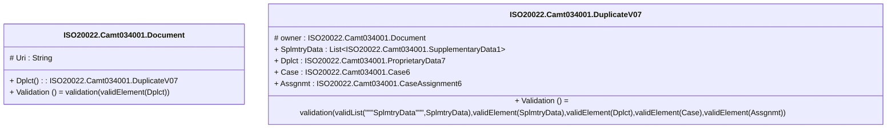

# camt.034.001.07-physical

> The tables below contain descriptions of the members of each Element. 
> The first column indicates the type of the member:
> A ‘#’ indicates that the field is a key to the element, and a ‘+’ indicates that the field is a value.
> The ‘*’ column contains a description for the element member.  
> The ‘@’ column contains any properties for the member.
> The ‘=’ column contains calculated values; or in the case of an enum, the serialized value.

---

## EntityImpl ISO20022.Camt034001.Document

| |Name|Type|*|@|=|
|-|-|-|-|-|-|
|#|Uri|String||XmlIgnore(), JsonIgnore()||
|+|Dplct|ISO20022.Camt034001.DuplicateV07||XmlElement()||
||Validation|Some(String)||XmlIgnore(), JsonIgnore()|validation(validElement(Dplct))|

---

## AspectImpl ISO20022.Camt034001.DuplicateV07

| |Name|Type|*|@|=|
|-|-|-|-|-|-|
|#|owner|ISO20022.Camt034001.Document||||
|+|SplmtryData|List<ISO20022.Camt034001.SupplementaryData1>||XmlElement()||
|+|Dplct|ISO20022.Camt034001.ProprietaryData7||XmlElement()||
|+|Case|ISO20022.Camt034001.Case6||XmlElement()||
|+|Assgnmt|ISO20022.Camt034001.CaseAssignment6||XmlElement()||
||Validation|Some(String)||XmlIgnore(), JsonIgnore()|validation(validList("""SplmtryData""",SplmtryData),validElement(SplmtryData),validElement(Dplct),validElement(Case),validElement(Assgnmt))|

