# camt.041.001.04-physical

```mermaid
classDiagram
    class ISO20022.Camt041001.Document {
        # Uri  : String
        + FndConfdCshFcstRpt () : ISO20022.Camt041001.FundConfirmedCashForecastReportV04
        + Validation () = validation(validElement(FndConfdCshFcstRpt))
    }
    class ISO20022.Camt041001.FundConfirmedCashForecastReportV04 {
        # owner  : ISO20022.Camt041001.Document
        + Xtnsn  : List~ISO20022.Camt041001.Extension1~
        + CnsltdNetCshFcst  : ISO20022.Camt041001.NetCashForecast3
        + FndCshFcstDtls  : List~ISO20022.Camt041001.FundCashForecast7~
        + FndOrSubFndDtls  : List~ISO20022.Camt041001.Fund2~
        + MsgPgntn  : ISO20022.Camt041001.Pagination
        + RltdRef  : List~ISO20022.Camt041001.AdditionalReference3~
        + PrvsRef  : List~ISO20022.Camt041001.AdditionalReference3~
        + PoolRef  : ISO20022.Camt041001.AdditionalReference3
        + MsgId  : ISO20022.Camt041001.MessageIdentification1
        + Validation () = validation(validList("""Xtnsn""",Xtnsn),validElement(Xtnsn),validElement(CnsltdNetCshFcst),validList("""FndCshFcstDtls""",FndCshFcstDtls),validElement(FndCshFcstDtls),validList("""FndOrSubFndDtls""",FndOrSubFndDtls),validElement(FndOrSubFndDtls),validElement(MsgPgntn),validList("""RltdRef""",RltdRef),validElement(RltdRef),validList("""PrvsRef""",PrvsRef),validElement(PrvsRef),validElement(PoolRef),validElement(MsgId))
    }
```

> The tables below contain descriptions of the members of each Element. 
> The first column indicates the type of the member:
> A ‘#’ indicates that the field is a key to the element, and a ‘+’ indicates that the field is a value.
> The ‘*’ column contains a description for the element member.  
> The ‘@’ column contains any properties for the member.
> The ‘=’ column contains calculated values; or in the case of an enum, the serialized value.

---

## EntityImpl ISO20022.Camt041001.Document

| |Name|Type|*|@|=|
|-|-|-|-|-|-|
|#|Uri|String||XmlIgnore(), JsonIgnore()||
|+|FndConfdCshFcstRpt|ISO20022.Camt041001.FundConfirmedCashForecastReportV04||XmlElement()||
||Validation|Some(String)||XmlIgnore(), JsonIgnore()|validation(validElement(FndConfdCshFcstRpt))|

---

## AspectImpl ISO20022.Camt041001.FundConfirmedCashForecastReportV04

| |Name|Type|*|@|=|
|-|-|-|-|-|-|
|#|owner|ISO20022.Camt041001.Document||||
|+|Xtnsn|List<ISO20022.Camt041001.Extension1>||XmlElement()||
|+|CnsltdNetCshFcst|ISO20022.Camt041001.NetCashForecast3||XmlElement()||
|+|FndCshFcstDtls|List<ISO20022.Camt041001.FundCashForecast7>||XmlElement()||
|+|FndOrSubFndDtls|List<ISO20022.Camt041001.Fund2>||XmlElement()||
|+|MsgPgntn|ISO20022.Camt041001.Pagination||XmlElement()||
|+|RltdRef|List<ISO20022.Camt041001.AdditionalReference3>||XmlElement()||
|+|PrvsRef|List<ISO20022.Camt041001.AdditionalReference3>||XmlElement()||
|+|PoolRef|ISO20022.Camt041001.AdditionalReference3||XmlElement()||
|+|MsgId|ISO20022.Camt041001.MessageIdentification1||XmlElement()||
||Validation|Some(String)||XmlIgnore(), JsonIgnore()|validation(validList("""Xtnsn""",Xtnsn),validElement(Xtnsn),validElement(CnsltdNetCshFcst),validList("""FndCshFcstDtls""",FndCshFcstDtls),validElement(FndCshFcstDtls),validList("""FndOrSubFndDtls""",FndOrSubFndDtls),validElement(FndOrSubFndDtls),validElement(MsgPgntn),validList("""RltdRef""",RltdRef),validElement(RltdRef),validList("""PrvsRef""",PrvsRef),validElement(PrvsRef),validElement(PoolRef),validElement(MsgId))|

