# camt.044.001.03

```mermaid
classDiagram
    class Hiperspace.Edge {
        # From  : Hiperspace.Node
        # To  : Hiperspace.Node
        # TypeName  : String
        + Name  : String
    }
    class ISO20022.Camt044001.ActiveCurrencyAnd13DecimalAmount {
        + Value  : Decimal
        + Ccy  : String
    }
    class ISO20022.Camt044001.ActiveOrHistoricCurrencyAndAmount {
        + Value  : Decimal
        + Ccy  : String
    }
    class ISO20022.Camt044001.AdditionalReference3 {
        + MsgNm  : String
        + RefIssr  : ISO20022.Camt044001.PartyIdentification2Choice
        + Ref  : String
    }
    ISO20022.Camt044001.AdditionalReference3 *-- ISO20022.Camt044001.PartyIdentification2Choice
    class ISO20022.Camt044001.AddressType2Code {
        DLVY = 1
        MLTO = 2
        BIZZ = 3
        HOME = 4
        PBOX = 5
        ADDR = 6
    }
    class ISO20022.Camt044001.AlternateSecurityIdentification1 {
        + PrtryIdSrc  : String
        + DmstIdSrc  : String
        + Id  : String
    }
    class ISO20022.Camt044001.CashInForecast6 {
        + AddtlBal  : ISO20022.Camt044001.FundBalance1
        + XcptnlCshFlowInd  : String
        + SubTtlUnitsNb  : ISO20022.Camt044001.FinancialInstrumentQuantity1
        + SubTtlAmt  : ISO20022.Camt044001.ActiveOrHistoricCurrencyAndAmount
        + CshSttlmDt  : DateTime
    }
    ISO20022.Camt044001.CashInForecast6 *-- ISO20022.Camt044001.FundBalance1
    ISO20022.Camt044001.CashInForecast6 *-- ISO20022.Camt044001.FinancialInstrumentQuantity1
    ISO20022.Camt044001.CashInForecast6 *-- ISO20022.Camt044001.ActiveOrHistoricCurrencyAndAmount
    class ISO20022.Camt044001.CashInOutForecast7 {
        + Amt  : ISO20022.Camt044001.ActiveOrHistoricCurrencyAndAmount
        + CshSttlmDt  : DateTime
    }
    ISO20022.Camt044001.CashInOutForecast7 *-- ISO20022.Camt044001.ActiveOrHistoricCurrencyAndAmount
    class ISO20022.Camt044001.CashOutForecast6 {
        + AddtlBal  : ISO20022.Camt044001.FundBalance1
        + XcptnlCshFlowInd  : String
        + SubTtlUnitsNb  : ISO20022.Camt044001.FinancialInstrumentQuantity1
        + SubTtlAmt  : ISO20022.Camt044001.ActiveOrHistoricCurrencyAndAmount
        + CshSttlmDt  : DateTime
    }
    ISO20022.Camt044001.CashOutForecast6 *-- ISO20022.Camt044001.FundBalance1
    ISO20022.Camt044001.CashOutForecast6 *-- ISO20022.Camt044001.FinancialInstrumentQuantity1
    ISO20022.Camt044001.CashOutForecast6 *-- ISO20022.Camt044001.ActiveOrHistoricCurrencyAndAmount
    class ISO20022.Camt044001.CurrencyDesignation1 {
        + AddtlInf  : String
        + Lctn  : String
        + CcyDsgnt  : String
    }
    class ISO20022.Camt044001.CurrencyDesignation1Code {
        OFFS = 1
        ONSH = 2
    }
    class ISO20022.Camt044001.DateAndDateTimeChoice {
        + DtTm  : DateTime
        + Dt  : DateTime
    }
    class ISO20022.Camt044001.DistributionPolicy1Code {
        ACCU = 1
        DIST = 2
    }
    class ISO20022.Camt044001.Extension1 {
        + Txt  : String
        + PlcAndNm  : String
    }
    class ISO20022.Camt044001.FinancialInstrument9 {
        + DualFndInd  : String
        + DstrbtnPlcy  : String
        + SctiesForm  : String
        + ClssTp  : String
        + ReqdNAVCcy  : String
        + SplmtryId  : String
        + Nm  : String
        + Id  : ISO20022.Camt044001.SecurityIdentification3Choice
    }
    ISO20022.Camt044001.FinancialInstrument9 *-- ISO20022.Camt044001.SecurityIdentification3Choice
    class ISO20022.Camt044001.FinancialInstrumentQuantity1 {
        + Unit  : Decimal
    }
    class ISO20022.Camt044001.FlowDirectionType1Code {
        OUTG = 1
        INCG = 2
    }
    class ISO20022.Camt044001.ForeignExchangeTerms19 {
        + XchgRate  : Decimal
        + QtdCcy  : String
        + UnitCcy  : String
    }
    class ISO20022.Camt044001.FormOfSecurity1Code {
        REGD = 1
        BEAR = 2
    }
    class ISO20022.Camt044001.Fund2 {
        + NetCshFcstDtls  : global::System.Collections.Generic.List~ISO20022.Camt044001.NetCashForecast5~
        + CshOutFcstDtls  : global::System.Collections.Generic.List~ISO20022.Camt044001.CashInOutForecast7~
        + CshInFcstDtls  : global::System.Collections.Generic.List~ISO20022.Camt044001.CashInOutForecast7~
        + PctgOfFndTtlNAV  : Decimal
        + PrvsTtlUnitsNb  : ISO20022.Camt044001.FinancialInstrumentQuantity1
        + TtlUnitsNb  : ISO20022.Camt044001.FinancialInstrumentQuantity1
        + PrvsTtlNAV  : ISO20022.Camt044001.ActiveOrHistoricCurrencyAndAmount
        + TtlNAV  : ISO20022.Camt044001.ActiveOrHistoricCurrencyAndAmount
        + PrvsTradDtTm  : ISO20022.Camt044001.DateAndDateTimeChoice
        + TradDtTm  : ISO20022.Camt044001.DateAndDateTimeChoice
        + Ccy  : String
        + Id  : ISO20022.Camt044001.OtherIdentification4
        + LglNttyIdr  : String
        + Nm  : String
    }
    ISO20022.Camt044001.Fund2 *-- ISO20022.Camt044001.NetCashForecast5
    ISO20022.Camt044001.Fund2 *-- ISO20022.Camt044001.CashInOutForecast7
    ISO20022.Camt044001.Fund2 *-- ISO20022.Camt044001.CashInOutForecast7
    ISO20022.Camt044001.Fund2 *-- ISO20022.Camt044001.FinancialInstrumentQuantity1
    ISO20022.Camt044001.Fund2 *-- ISO20022.Camt044001.FinancialInstrumentQuantity1
    ISO20022.Camt044001.Fund2 *-- ISO20022.Camt044001.ActiveOrHistoricCurrencyAndAmount
    ISO20022.Camt044001.Fund2 *-- ISO20022.Camt044001.ActiveOrHistoricCurrencyAndAmount
    ISO20022.Camt044001.Fund2 *-- ISO20022.Camt044001.DateAndDateTimeChoice
    ISO20022.Camt044001.Fund2 *-- ISO20022.Camt044001.DateAndDateTimeChoice
    ISO20022.Camt044001.Fund2 *-- ISO20022.Camt044001.OtherIdentification4
    class ISO20022.Camt044001.FundBalance1 {
        + TtlCshFrCshOrdrs  : ISO20022.Camt044001.ActiveOrHistoricCurrencyAndAmount
        + TtlCshFrUnitOrdrs  : ISO20022.Camt044001.ActiveOrHistoricCurrencyAndAmount
        + TtlUnitsFrCshOrdrs  : ISO20022.Camt044001.FinancialInstrumentQuantity1
        + TtlUnitsFrUnitOrdrs  : ISO20022.Camt044001.FinancialInstrumentQuantity1
    }
    ISO20022.Camt044001.FundBalance1 *-- ISO20022.Camt044001.ActiveOrHistoricCurrencyAndAmount
    ISO20022.Camt044001.FundBalance1 *-- ISO20022.Camt044001.ActiveOrHistoricCurrencyAndAmount
    ISO20022.Camt044001.FundBalance1 *-- ISO20022.Camt044001.FinancialInstrumentQuantity1
    ISO20022.Camt044001.FundBalance1 *-- ISO20022.Camt044001.FinancialInstrumentQuantity1
    class ISO20022.Camt044001.FundCashForecast7 {
        + NetCshFcstDtls  : global::System.Collections.Generic.List~ISO20022.Camt044001.NetCashForecast4~
        + CshOutFcstDtls  : global::System.Collections.Generic.List~ISO20022.Camt044001.CashOutForecast6~
        + CshInFcstDtls  : global::System.Collections.Generic.List~ISO20022.Camt044001.CashInForecast6~
        + PctgOfShrClssTtlNAV  : Decimal
        + FXRate  : ISO20022.Camt044001.ForeignExchangeTerms19
        + Pric  : ISO20022.Camt044001.UnitPrice19
        + XcptnlNetCshFlowInd  : String
        + CcySts  : ISO20022.Camt044001.CurrencyDesignation1
        + InvstmtCcy  : global::System.Collections.Generic.List~String~
        + TtlNAVChngRate  : Decimal
        + PrvsTtlUnitsNb  : ISO20022.Camt044001.FinancialInstrumentQuantity1
        + TtlUnitsNb  : ISO20022.Camt044001.FinancialInstrumentQuantity1
        + PrvsTtlNAV  : global::System.Collections.Generic.List~ISO20022.Camt044001.ActiveOrHistoricCurrencyAndAmount~
        + TtlNAV  : global::System.Collections.Generic.List~ISO20022.Camt044001.ActiveOrHistoricCurrencyAndAmount~
        + FinInstrmDtls  : ISO20022.Camt044001.FinancialInstrument9
        + PrvsTradDtTm  : ISO20022.Camt044001.DateAndDateTimeChoice
        + TradDtTm  : ISO20022.Camt044001.DateAndDateTimeChoice
        + Id  : String
    }
    ISO20022.Camt044001.FundCashForecast7 *-- ISO20022.Camt044001.NetCashForecast4
    ISO20022.Camt044001.FundCashForecast7 *-- ISO20022.Camt044001.CashOutForecast6
    ISO20022.Camt044001.FundCashForecast7 *-- ISO20022.Camt044001.CashInForecast6
    ISO20022.Camt044001.FundCashForecast7 *-- ISO20022.Camt044001.ForeignExchangeTerms19
    ISO20022.Camt044001.FundCashForecast7 *-- ISO20022.Camt044001.UnitPrice19
    ISO20022.Camt044001.FundCashForecast7 *-- ISO20022.Camt044001.CurrencyDesignation1
    ISO20022.Camt044001.FundCashForecast7 *-- ISO20022.Camt044001.FinancialInstrumentQuantity1
    ISO20022.Camt044001.FundCashForecast7 *-- ISO20022.Camt044001.FinancialInstrumentQuantity1
    ISO20022.Camt044001.FundCashForecast7 *-- ISO20022.Camt044001.ActiveOrHistoricCurrencyAndAmount
    ISO20022.Camt044001.FundCashForecast7 *-- ISO20022.Camt044001.ActiveOrHistoricCurrencyAndAmount
    ISO20022.Camt044001.FundCashForecast7 *-- ISO20022.Camt044001.FinancialInstrument9
    ISO20022.Camt044001.FundCashForecast7 *-- ISO20022.Camt044001.DateAndDateTimeChoice
    ISO20022.Camt044001.FundCashForecast7 *-- ISO20022.Camt044001.DateAndDateTimeChoice
    class ISO20022.Camt044001.FundConfirmedCashForecastReport3 {
        + Xtnsn  : global::System.Collections.Generic.List~ISO20022.Camt044001.Extension1~
        + CnsltdNetCshFcst  : ISO20022.Camt044001.NetCashForecast3
        + FndCshFcstDtls  : global::System.Collections.Generic.List~ISO20022.Camt044001.FundCashForecast7~
        + FndOrSubFndDtls  : global::System.Collections.Generic.List~ISO20022.Camt044001.Fund2~
    }
    ISO20022.Camt044001.FundConfirmedCashForecastReport3 *-- ISO20022.Camt044001.Extension1
    ISO20022.Camt044001.FundConfirmedCashForecastReport3 *-- ISO20022.Camt044001.NetCashForecast3
    ISO20022.Camt044001.FundConfirmedCashForecastReport3 *-- ISO20022.Camt044001.FundCashForecast7
    ISO20022.Camt044001.FundConfirmedCashForecastReport3 *-- ISO20022.Camt044001.Fund2
    class ISO20022.Camt044001.FundConfirmedCashForecastReportCancellationV03 {
        + CshFcstRptToBeCanc  : ISO20022.Camt044001.FundConfirmedCashForecastReport3
        + MsgPgntn  : ISO20022.Camt044001.Pagination
        + RltdRef  : global::System.Collections.Generic.List~ISO20022.Camt044001.AdditionalReference3~
        + PrvsRef  : ISO20022.Camt044001.AdditionalReference3
        + PoolRef  : ISO20022.Camt044001.AdditionalReference3
        + MsgId  : ISO20022.Camt044001.MessageIdentification1
    }
    ISO20022.Camt044001.FundConfirmedCashForecastReportCancellationV03 *-- ISO20022.Camt044001.FundConfirmedCashForecastReport3
    ISO20022.Camt044001.FundConfirmedCashForecastReportCancellationV03 *-- ISO20022.Camt044001.Pagination
    ISO20022.Camt044001.FundConfirmedCashForecastReportCancellationV03 *-- ISO20022.Camt044001.AdditionalReference3
    ISO20022.Camt044001.FundConfirmedCashForecastReportCancellationV03 *-- ISO20022.Camt044001.AdditionalReference3
    ISO20022.Camt044001.FundConfirmedCashForecastReportCancellationV03 *-- ISO20022.Camt044001.AdditionalReference3
    ISO20022.Camt044001.FundConfirmedCashForecastReportCancellationV03 *-- ISO20022.Camt044001.MessageIdentification1
    class ISO20022.Camt044001.GenericIdentification1 {
        + Issr  : String
        + SchmeNm  : String
        + Id  : String
    }
    class ISO20022.Camt044001.GenericIdentification47 {
        + SchmeNm  : String
        + Issr  : String
        + Id  : String
    }
    class ISO20022.Camt044001.IdentificationSource5Choice {
        + PrtryIdSrc  : String
        + DmstIdSrc  : String
    }
    class ISO20022.Camt044001.MessageIdentification1 {
        + CreDtTm  : DateTime
        + Id  : String
    }
    class ISO20022.Camt044001.NameAndAddress5 {
        + Adr  : ISO20022.Camt044001.PostalAddress1
        + Nm  : String
    }
    ISO20022.Camt044001.NameAndAddress5 *-- ISO20022.Camt044001.PostalAddress1
    class ISO20022.Camt044001.NetCashForecast3 {
        + FlowDrctn  : String
        + NetUnitsNb  : ISO20022.Camt044001.FinancialInstrumentQuantity1
        + NetAmt  : ISO20022.Camt044001.ActiveOrHistoricCurrencyAndAmount
    }
    ISO20022.Camt044001.NetCashForecast3 *-- ISO20022.Camt044001.FinancialInstrumentQuantity1
    ISO20022.Camt044001.NetCashForecast3 *-- ISO20022.Camt044001.ActiveOrHistoricCurrencyAndAmount
    class ISO20022.Camt044001.NetCashForecast4 {
        + AddtlBal  : ISO20022.Camt044001.FundBalance1
        + FlowDrctn  : String
        + NetUnitsNb  : ISO20022.Camt044001.FinancialInstrumentQuantity1
        + NetAmt  : ISO20022.Camt044001.ActiveOrHistoricCurrencyAndAmount
        + CshSttlmDt  : DateTime
    }
    ISO20022.Camt044001.NetCashForecast4 *-- ISO20022.Camt044001.FundBalance1
    ISO20022.Camt044001.NetCashForecast4 *-- ISO20022.Camt044001.FinancialInstrumentQuantity1
    ISO20022.Camt044001.NetCashForecast4 *-- ISO20022.Camt044001.ActiveOrHistoricCurrencyAndAmount
    class ISO20022.Camt044001.NetCashForecast5 {
        + FlowDrctn  : String
        + NetUnitsNb  : ISO20022.Camt044001.FinancialInstrumentQuantity1
        + NetAmt  : ISO20022.Camt044001.ActiveOrHistoricCurrencyAndAmount
        + CshSttlmDt  : DateTime
    }
    ISO20022.Camt044001.NetCashForecast5 *-- ISO20022.Camt044001.FinancialInstrumentQuantity1
    ISO20022.Camt044001.NetCashForecast5 *-- ISO20022.Camt044001.ActiveOrHistoricCurrencyAndAmount
    class ISO20022.Camt044001.OtherIdentification4 {
        + Tp  : ISO20022.Camt044001.IdentificationSource5Choice
        + Id  : String
    }
    ISO20022.Camt044001.OtherIdentification4 *-- ISO20022.Camt044001.IdentificationSource5Choice
    class ISO20022.Camt044001.Pagination {
        + LastPgInd  : String
        + PgNb  : String
    }
    class ISO20022.Camt044001.PartyIdentification2Choice {
        + NmAndAdr  : ISO20022.Camt044001.NameAndAddress5
        + PrtryId  : ISO20022.Camt044001.GenericIdentification1
        + BICOrBEI  : String
    }
    ISO20022.Camt044001.PartyIdentification2Choice *-- ISO20022.Camt044001.NameAndAddress5
    ISO20022.Camt044001.PartyIdentification2Choice *-- ISO20022.Camt044001.GenericIdentification1
    class ISO20022.Camt044001.PostalAddress1 {
        + Ctry  : String
        + CtrySubDvsn  : String
        + TwnNm  : String
        + PstCd  : String
        + BldgNb  : String
        + StrtNm  : String
        + AdrLine  : global::System.Collections.Generic.List~String~
        + AdrTp  : String
    }
    class ISO20022.Camt044001.PriceValue1 {
        + Amt  : ISO20022.Camt044001.ActiveCurrencyAnd13DecimalAmount
    }
    ISO20022.Camt044001.PriceValue1 *-- ISO20022.Camt044001.ActiveCurrencyAnd13DecimalAmount
    class ISO20022.Camt044001.SecurityIdentification3Choice {
        + OthrPrtryId  : ISO20022.Camt044001.AlternateSecurityIdentification1
        + Cmon  : String
        + Belgn  : String
        + SCVM  : String
        + Vlrn  : String
        + Dtch  : String
        + Wrtppr  : String
        + QUICK  : String
        + CTA  : String
        + Blmbrg  : String
        + TckrSymb  : String
        + RIC  : String
        + CUSIP  : String
        + SEDOL  : String
        + ISIN  : String
    }
    ISO20022.Camt044001.SecurityIdentification3Choice *-- ISO20022.Camt044001.AlternateSecurityIdentification1
    class ISO20022.Camt044001.TypeOfPrice10Code {
        ACTU = 1
        DDVR = 2
        SWIC = 3
        RINV = 4
        MIDD = 5
        SWNG = 6
        INTE = 7
        CANC = 8
        CREA = 9
        NAVL = 10
        OFFR = 11
        BIDE = 12
    }
    class ISO20022.Camt044001.UnitPrice19 {
        + Val  : ISO20022.Camt044001.PriceValue1
        + PricTp  : ISO20022.Camt044001.UnitPriceType2Choice
    }
    ISO20022.Camt044001.UnitPrice19 *-- ISO20022.Camt044001.PriceValue1
    ISO20022.Camt044001.UnitPrice19 *-- ISO20022.Camt044001.UnitPriceType2Choice
    class ISO20022.Camt044001.UnitPriceType2Choice {
        + Prtry  : ISO20022.Camt044001.GenericIdentification47
        + Cd  : String
    }
    ISO20022.Camt044001.UnitPriceType2Choice *-- ISO20022.Camt044001.GenericIdentification47
    class Hiperspace.Node {
        # SKey  : String
        + TypeName  : String
        + Name  : String
        + Froms (From = this) : Hiperspace.Edge
        + Tos (To = this) : Hiperspace.Edge
    }
```

> The tables below contain descriptions of the members of each Element. 
> The first column indicates the type of the member:
> A ‘#’ indicates that the field is a key to the element, and a ‘+’ indicates that the field is a value.
> The ‘*’ column contains a description for the element member.  
> The ‘@’ column contains any properties for the member.
> The ‘=’ column contains calculated values; or in the case of an enum, the serialized value.

---

## View Hiperspace.Edge
edge between nodes

| |Name|Type|*|@|=|
|-|-|-|-|-|-|
|#|From|Hiperspace.Node||||
|#|To|Hiperspace.Node||||
|#|TypeName|String||||
|+|Name|String||||

---

## Value ISO20022.Camt044001.ActiveCurrencyAnd13DecimalAmount

| |Name|Type|*|@|=|
|-|-|-|-|-|-|
|+|Value|Decimal||XmlElement()||
|+|Ccy|String||XmlAttribute()||
||Validation|Some(String)||XmlIgnore(), JsonIgnore()|validation(validRequired("""Value""",Value),validRequired("""Ccy""",Ccy),validPattern("""Ccy""",Ccy,"""[A-Z]{3,3}"""))|

---

## Value ISO20022.Camt044001.ActiveOrHistoricCurrencyAndAmount

| |Name|Type|*|@|=|
|-|-|-|-|-|-|
|+|Value|Decimal||XmlElement()||
|+|Ccy|String||XmlAttribute()||
||Validation|Some(String)||XmlIgnore(), JsonIgnore()|validation(validRequired("""Value""",Value),validRequired("""Ccy""",Ccy),validPattern("""Ccy""",Ccy,"""[A-Z]{3,3}"""))|

---

## Value ISO20022.Camt044001.AdditionalReference3

| |Name|Type|*|@|=|
|-|-|-|-|-|-|
|+|MsgNm|String||XmlElement()||
|+|RefIssr|ISO20022.Camt044001.PartyIdentification2Choice||XmlElement()||
|+|Ref|String||XmlElement()||
||Validation|Some(String)||XmlIgnore(), JsonIgnore()|validation(validElement(RefIssr))|

---

## Enum ISO20022.Camt044001.AddressType2Code

| |Name|Type|*|@|=|
|-|-|-|-|-|-|
||DLVY|Int32||XmlEnum("""DLVY""")|1|
||MLTO|Int32||XmlEnum("""MLTO""")|2|
||BIZZ|Int32||XmlEnum("""BIZZ""")|3|
||HOME|Int32||XmlEnum("""HOME""")|4|
||PBOX|Int32||XmlEnum("""PBOX""")|5|
||ADDR|Int32||XmlEnum("""ADDR""")|6|

---

## Value ISO20022.Camt044001.AlternateSecurityIdentification1

| |Name|Type|*|@|=|
|-|-|-|-|-|-|
|+|PrtryIdSrc|String||XmlElement()||
|+|DmstIdSrc|String||XmlElement()||
|+|Id|String||XmlElement()||
||Validation|Some(String)||XmlIgnore(), JsonIgnore()|validation(validPattern("""DmstIdSrc""",DmstIdSrc,"""[A-Z]{2,2}"""),validChoice(PrtryIdSrc,DmstIdSrc,Id))|

---

## Value ISO20022.Camt044001.CashInForecast6

| |Name|Type|*|@|=|
|-|-|-|-|-|-|
|+|AddtlBal|ISO20022.Camt044001.FundBalance1||XmlElement()||
|+|XcptnlCshFlowInd|String||XmlElement()||
|+|SubTtlUnitsNb|ISO20022.Camt044001.FinancialInstrumentQuantity1||XmlElement()||
|+|SubTtlAmt|ISO20022.Camt044001.ActiveOrHistoricCurrencyAndAmount||XmlElement()||
|+|CshSttlmDt|DateTime||XmlElement()||
||Validation|Some(String)||XmlIgnore(), JsonIgnore()|validation(validElement(AddtlBal),validElement(SubTtlUnitsNb),validElement(SubTtlAmt))|

---

## Value ISO20022.Camt044001.CashInOutForecast7

| |Name|Type|*|@|=|
|-|-|-|-|-|-|
|+|Amt|ISO20022.Camt044001.ActiveOrHistoricCurrencyAndAmount||XmlElement()||
|+|CshSttlmDt|DateTime||XmlElement()||
||Validation|Some(String)||XmlIgnore(), JsonIgnore()|validation(validElement(Amt))|

---

## Value ISO20022.Camt044001.CashOutForecast6

| |Name|Type|*|@|=|
|-|-|-|-|-|-|
|+|AddtlBal|ISO20022.Camt044001.FundBalance1||XmlElement()||
|+|XcptnlCshFlowInd|String||XmlElement()||
|+|SubTtlUnitsNb|ISO20022.Camt044001.FinancialInstrumentQuantity1||XmlElement()||
|+|SubTtlAmt|ISO20022.Camt044001.ActiveOrHistoricCurrencyAndAmount||XmlElement()||
|+|CshSttlmDt|DateTime||XmlElement()||
||Validation|Some(String)||XmlIgnore(), JsonIgnore()|validation(validElement(AddtlBal),validElement(SubTtlUnitsNb),validElement(SubTtlAmt))|

---

## Value ISO20022.Camt044001.CurrencyDesignation1

| |Name|Type|*|@|=|
|-|-|-|-|-|-|
|+|AddtlInf|String||XmlElement()||
|+|Lctn|String||XmlElement()||
|+|CcyDsgnt|String||XmlElement()||
||Validation|Some(String)||XmlIgnore(), JsonIgnore()|validation(validPattern("""Lctn""",Lctn,"""[A-Z]{2,2}"""))|

---

## Enum ISO20022.Camt044001.CurrencyDesignation1Code

| |Name|Type|*|@|=|
|-|-|-|-|-|-|
||OFFS|Int32||XmlEnum("""OFFS""")|1|
||ONSH|Int32||XmlEnum("""ONSH""")|2|

---

## Value ISO20022.Camt044001.DateAndDateTimeChoice

| |Name|Type|*|@|=|
|-|-|-|-|-|-|
|+|DtTm|DateTime||XmlElement()||
|+|Dt|DateTime||XmlElement()||
||Validation|Some(String)||XmlIgnore(), JsonIgnore()|validation(validChoice(DtTm,Dt))|

---

## Enum ISO20022.Camt044001.DistributionPolicy1Code

| |Name|Type|*|@|=|
|-|-|-|-|-|-|
||ACCU|Int32||XmlEnum("""ACCU""")|1|
||DIST|Int32||XmlEnum("""DIST""")|2|

---

## Type ISO20022.Camt044001.Document

| |Name|Type|*|@|=|
|-|-|-|-|-|-|
|+|FndConfdCshFcstRptCxl|ISO20022.Camt044001.FundConfirmedCashForecastReportCancellationV03||XmlElement()||
||Validation|Some(String)||XmlIgnore(), JsonIgnore()|validation(validElement(FndConfdCshFcstRptCxl))|

---

## Value ISO20022.Camt044001.Extension1

| |Name|Type|*|@|=|
|-|-|-|-|-|-|
|+|Txt|String||XmlElement()||
|+|PlcAndNm|String||XmlElement()||
||Validation|Some(String)||XmlIgnore(), JsonIgnore()|""|

---

## Value ISO20022.Camt044001.FinancialInstrument9

| |Name|Type|*|@|=|
|-|-|-|-|-|-|
|+|DualFndInd|String||XmlElement()||
|+|DstrbtnPlcy|String||XmlElement()||
|+|SctiesForm|String||XmlElement()||
|+|ClssTp|String||XmlElement()||
|+|ReqdNAVCcy|String||XmlElement()||
|+|SplmtryId|String||XmlElement()||
|+|Nm|String||XmlElement()||
|+|Id|ISO20022.Camt044001.SecurityIdentification3Choice||XmlElement()||
||Validation|Some(String)||XmlIgnore(), JsonIgnore()|validation(validPattern("""ReqdNAVCcy""",ReqdNAVCcy,"""[A-Z]{3,3}"""),validElement(Id))|

---

## Value ISO20022.Camt044001.FinancialInstrumentQuantity1

| |Name|Type|*|@|=|
|-|-|-|-|-|-|
|+|Unit|Decimal||XmlElement()||
||Validation|Some(String)||XmlIgnore(), JsonIgnore()|""|

---

## Enum ISO20022.Camt044001.FlowDirectionType1Code

| |Name|Type|*|@|=|
|-|-|-|-|-|-|
||OUTG|Int32||XmlEnum("""OUTG""")|1|
||INCG|Int32||XmlEnum("""INCG""")|2|

---

## Value ISO20022.Camt044001.ForeignExchangeTerms19

| |Name|Type|*|@|=|
|-|-|-|-|-|-|
|+|XchgRate|Decimal||XmlElement()||
|+|QtdCcy|String||XmlElement()||
|+|UnitCcy|String||XmlElement()||
||Validation|Some(String)||XmlIgnore(), JsonIgnore()|validation(validPattern("""QtdCcy""",QtdCcy,"""[A-Z]{3,3}"""),validPattern("""UnitCcy""",UnitCcy,"""[A-Z]{3,3}"""))|

---

## Enum ISO20022.Camt044001.FormOfSecurity1Code

| |Name|Type|*|@|=|
|-|-|-|-|-|-|
||REGD|Int32||XmlEnum("""REGD""")|1|
||BEAR|Int32||XmlEnum("""BEAR""")|2|

---

## Value ISO20022.Camt044001.Fund2

| |Name|Type|*|@|=|
|-|-|-|-|-|-|
|+|NetCshFcstDtls|global::System.Collections.Generic.List<ISO20022.Camt044001.NetCashForecast5>||XmlElement()||
|+|CshOutFcstDtls|global::System.Collections.Generic.List<ISO20022.Camt044001.CashInOutForecast7>||XmlElement()||
|+|CshInFcstDtls|global::System.Collections.Generic.List<ISO20022.Camt044001.CashInOutForecast7>||XmlElement()||
|+|PctgOfFndTtlNAV|Decimal||XmlElement()||
|+|PrvsTtlUnitsNb|ISO20022.Camt044001.FinancialInstrumentQuantity1||XmlElement()||
|+|TtlUnitsNb|ISO20022.Camt044001.FinancialInstrumentQuantity1||XmlElement()||
|+|PrvsTtlNAV|ISO20022.Camt044001.ActiveOrHistoricCurrencyAndAmount||XmlElement()||
|+|TtlNAV|ISO20022.Camt044001.ActiveOrHistoricCurrencyAndAmount||XmlElement()||
|+|PrvsTradDtTm|ISO20022.Camt044001.DateAndDateTimeChoice||XmlElement()||
|+|TradDtTm|ISO20022.Camt044001.DateAndDateTimeChoice||XmlElement()||
|+|Ccy|String||XmlElement()||
|+|Id|ISO20022.Camt044001.OtherIdentification4||XmlElement()||
|+|LglNttyIdr|String||XmlElement()||
|+|Nm|String||XmlElement()||
||Validation|Some(String)||XmlIgnore(), JsonIgnore()|validation(validList("""NetCshFcstDtls""",NetCshFcstDtls),validElement(NetCshFcstDtls),validList("""CshOutFcstDtls""",CshOutFcstDtls),validElement(CshOutFcstDtls),validList("""CshInFcstDtls""",CshInFcstDtls),validElement(CshInFcstDtls),validElement(PrvsTtlUnitsNb),validElement(TtlUnitsNb),validElement(PrvsTtlNAV),validElement(TtlNAV),validElement(PrvsTradDtTm),validElement(TradDtTm),validPattern("""Ccy""",Ccy,"""[A-Z]{3,3}"""),validElement(Id),validPattern("""LglNttyIdr""",LglNttyIdr,"""[A-Z0-9]{18,18}[0-9]{2,2}"""))|

---

## Value ISO20022.Camt044001.FundBalance1

| |Name|Type|*|@|=|
|-|-|-|-|-|-|
|+|TtlCshFrCshOrdrs|ISO20022.Camt044001.ActiveOrHistoricCurrencyAndAmount||XmlElement()||
|+|TtlCshFrUnitOrdrs|ISO20022.Camt044001.ActiveOrHistoricCurrencyAndAmount||XmlElement()||
|+|TtlUnitsFrCshOrdrs|ISO20022.Camt044001.FinancialInstrumentQuantity1||XmlElement()||
|+|TtlUnitsFrUnitOrdrs|ISO20022.Camt044001.FinancialInstrumentQuantity1||XmlElement()||
||Validation|Some(String)||XmlIgnore(), JsonIgnore()|validation(validElement(TtlCshFrCshOrdrs),validElement(TtlCshFrUnitOrdrs),validElement(TtlUnitsFrCshOrdrs),validElement(TtlUnitsFrUnitOrdrs))|

---

## Value ISO20022.Camt044001.FundCashForecast7

| |Name|Type|*|@|=|
|-|-|-|-|-|-|
|+|NetCshFcstDtls|global::System.Collections.Generic.List<ISO20022.Camt044001.NetCashForecast4>||XmlElement()||
|+|CshOutFcstDtls|global::System.Collections.Generic.List<ISO20022.Camt044001.CashOutForecast6>||XmlElement()||
|+|CshInFcstDtls|global::System.Collections.Generic.List<ISO20022.Camt044001.CashInForecast6>||XmlElement()||
|+|PctgOfShrClssTtlNAV|Decimal||XmlElement()||
|+|FXRate|ISO20022.Camt044001.ForeignExchangeTerms19||XmlElement()||
|+|Pric|ISO20022.Camt044001.UnitPrice19||XmlElement()||
|+|XcptnlNetCshFlowInd|String||XmlElement()||
|+|CcySts|ISO20022.Camt044001.CurrencyDesignation1||XmlElement()||
|+|InvstmtCcy|global::System.Collections.Generic.List<String>||XmlElement()||
|+|TtlNAVChngRate|Decimal||XmlElement()||
|+|PrvsTtlUnitsNb|ISO20022.Camt044001.FinancialInstrumentQuantity1||XmlElement()||
|+|TtlUnitsNb|ISO20022.Camt044001.FinancialInstrumentQuantity1||XmlElement()||
|+|PrvsTtlNAV|global::System.Collections.Generic.List<ISO20022.Camt044001.ActiveOrHistoricCurrencyAndAmount>||XmlElement()||
|+|TtlNAV|global::System.Collections.Generic.List<ISO20022.Camt044001.ActiveOrHistoricCurrencyAndAmount>||XmlElement()||
|+|FinInstrmDtls|ISO20022.Camt044001.FinancialInstrument9||XmlElement()||
|+|PrvsTradDtTm|ISO20022.Camt044001.DateAndDateTimeChoice||XmlElement()||
|+|TradDtTm|ISO20022.Camt044001.DateAndDateTimeChoice||XmlElement()||
|+|Id|String||XmlElement()||
||Validation|Some(String)||XmlIgnore(), JsonIgnore()|validation(validList("""NetCshFcstDtls""",NetCshFcstDtls),validElement(NetCshFcstDtls),validList("""CshOutFcstDtls""",CshOutFcstDtls),validElement(CshOutFcstDtls),validList("""CshInFcstDtls""",CshInFcstDtls),validElement(CshInFcstDtls),validElement(FXRate),validElement(Pric),validElement(CcySts),validPattern("""InvstmtCcy""",InvstmtCcy,"""[A-Z]{3,3}"""),validElement(PrvsTtlUnitsNb),validElement(TtlUnitsNb),validList("""PrvsTtlNAV""",PrvsTtlNAV),validElement(PrvsTtlNAV),validList("""TtlNAV""",TtlNAV),validElement(TtlNAV),validElement(FinInstrmDtls),validElement(PrvsTradDtTm),validElement(TradDtTm))|

---

## Value ISO20022.Camt044001.FundConfirmedCashForecastReport3

| |Name|Type|*|@|=|
|-|-|-|-|-|-|
|+|Xtnsn|global::System.Collections.Generic.List<ISO20022.Camt044001.Extension1>||XmlElement()||
|+|CnsltdNetCshFcst|ISO20022.Camt044001.NetCashForecast3||XmlElement()||
|+|FndCshFcstDtls|global::System.Collections.Generic.List<ISO20022.Camt044001.FundCashForecast7>||XmlElement()||
|+|FndOrSubFndDtls|global::System.Collections.Generic.List<ISO20022.Camt044001.Fund2>||XmlElement()||
||Validation|Some(String)||XmlIgnore(), JsonIgnore()|validation(validList("""Xtnsn""",Xtnsn),validElement(Xtnsn),validElement(CnsltdNetCshFcst),validList("""FndCshFcstDtls""",FndCshFcstDtls),validElement(FndCshFcstDtls),validList("""FndOrSubFndDtls""",FndOrSubFndDtls),validElement(FndOrSubFndDtls))|

---

## Aspect ISO20022.Camt044001.FundConfirmedCashForecastReportCancellationV03

| |Name|Type|*|@|=|
|-|-|-|-|-|-|
|+|CshFcstRptToBeCanc|ISO20022.Camt044001.FundConfirmedCashForecastReport3||XmlElement()||
|+|MsgPgntn|ISO20022.Camt044001.Pagination||XmlElement()||
|+|RltdRef|global::System.Collections.Generic.List<ISO20022.Camt044001.AdditionalReference3>||XmlElement()||
|+|PrvsRef|ISO20022.Camt044001.AdditionalReference3||XmlElement()||
|+|PoolRef|ISO20022.Camt044001.AdditionalReference3||XmlElement()||
|+|MsgId|ISO20022.Camt044001.MessageIdentification1||XmlElement()||
||Validation|Some(String)||XmlIgnore(), JsonIgnore()|validation(validElement(CshFcstRptToBeCanc),validElement(MsgPgntn),validList("""RltdRef""",RltdRef),validElement(RltdRef),validElement(PrvsRef),validElement(PoolRef),validElement(MsgId))|

---

## Value ISO20022.Camt044001.GenericIdentification1

| |Name|Type|*|@|=|
|-|-|-|-|-|-|
|+|Issr|String||XmlElement()||
|+|SchmeNm|String||XmlElement()||
|+|Id|String||XmlElement()||
||Validation|Some(String)||XmlIgnore(), JsonIgnore()|""|

---

## Value ISO20022.Camt044001.GenericIdentification47

| |Name|Type|*|@|=|
|-|-|-|-|-|-|
|+|SchmeNm|String||XmlElement()||
|+|Issr|String||XmlElement()||
|+|Id|String||XmlElement()||
||Validation|Some(String)||XmlIgnore(), JsonIgnore()|validation(validPattern("""SchmeNm""",SchmeNm,"""[a-zA-Z0-9]{1,4}"""),validPattern("""Issr""",Issr,"""[a-zA-Z0-9]{1,4}"""),validPattern("""Id""",Id,"""[a-zA-Z0-9]{4}"""))|

---

## Value ISO20022.Camt044001.IdentificationSource5Choice

| |Name|Type|*|@|=|
|-|-|-|-|-|-|
|+|PrtryIdSrc|String||XmlElement()||
|+|DmstIdSrc|String||XmlElement()||
||Validation|Some(String)||XmlIgnore(), JsonIgnore()|validation(validPattern("""DmstIdSrc""",DmstIdSrc,"""[A-Z]{2,2}"""),validChoice(PrtryIdSrc,DmstIdSrc))|

---

## Value ISO20022.Camt044001.MessageIdentification1

| |Name|Type|*|@|=|
|-|-|-|-|-|-|
|+|CreDtTm|DateTime||XmlElement()||
|+|Id|String||XmlElement()||
||Validation|Some(String)||XmlIgnore(), JsonIgnore()|""|

---

## Value ISO20022.Camt044001.NameAndAddress5

| |Name|Type|*|@|=|
|-|-|-|-|-|-|
|+|Adr|ISO20022.Camt044001.PostalAddress1||XmlElement()||
|+|Nm|String||XmlElement()||
||Validation|Some(String)||XmlIgnore(), JsonIgnore()|validation(validElement(Adr))|

---

## Value ISO20022.Camt044001.NetCashForecast3

| |Name|Type|*|@|=|
|-|-|-|-|-|-|
|+|FlowDrctn|String||XmlElement()||
|+|NetUnitsNb|ISO20022.Camt044001.FinancialInstrumentQuantity1||XmlElement()||
|+|NetAmt|ISO20022.Camt044001.ActiveOrHistoricCurrencyAndAmount||XmlElement()||
||Validation|Some(String)||XmlIgnore(), JsonIgnore()|validation(validElement(NetUnitsNb),validElement(NetAmt))|

---

## Value ISO20022.Camt044001.NetCashForecast4

| |Name|Type|*|@|=|
|-|-|-|-|-|-|
|+|AddtlBal|ISO20022.Camt044001.FundBalance1||XmlElement()||
|+|FlowDrctn|String||XmlElement()||
|+|NetUnitsNb|ISO20022.Camt044001.FinancialInstrumentQuantity1||XmlElement()||
|+|NetAmt|ISO20022.Camt044001.ActiveOrHistoricCurrencyAndAmount||XmlElement()||
|+|CshSttlmDt|DateTime||XmlElement()||
||Validation|Some(String)||XmlIgnore(), JsonIgnore()|validation(validElement(AddtlBal),validElement(NetUnitsNb),validElement(NetAmt))|

---

## Value ISO20022.Camt044001.NetCashForecast5

| |Name|Type|*|@|=|
|-|-|-|-|-|-|
|+|FlowDrctn|String||XmlElement()||
|+|NetUnitsNb|ISO20022.Camt044001.FinancialInstrumentQuantity1||XmlElement()||
|+|NetAmt|ISO20022.Camt044001.ActiveOrHistoricCurrencyAndAmount||XmlElement()||
|+|CshSttlmDt|DateTime||XmlElement()||
||Validation|Some(String)||XmlIgnore(), JsonIgnore()|validation(validElement(NetUnitsNb),validElement(NetAmt))|

---

## Value ISO20022.Camt044001.OtherIdentification4

| |Name|Type|*|@|=|
|-|-|-|-|-|-|
|+|Tp|ISO20022.Camt044001.IdentificationSource5Choice||XmlElement()||
|+|Id|String||XmlElement()||
||Validation|Some(String)||XmlIgnore(), JsonIgnore()|validation(validElement(Tp))|

---

## Value ISO20022.Camt044001.Pagination

| |Name|Type|*|@|=|
|-|-|-|-|-|-|
|+|LastPgInd|String||XmlElement()||
|+|PgNb|String||XmlElement()||
||Validation|Some(String)||XmlIgnore(), JsonIgnore()|validation(validPattern("""PgNb""",PgNb,"""[0-9]{1,5}"""))|

---

## Value ISO20022.Camt044001.PartyIdentification2Choice

| |Name|Type|*|@|=|
|-|-|-|-|-|-|
|+|NmAndAdr|ISO20022.Camt044001.NameAndAddress5||XmlElement()||
|+|PrtryId|ISO20022.Camt044001.GenericIdentification1||XmlElement()||
|+|BICOrBEI|String||XmlElement()||
||Validation|Some(String)||XmlIgnore(), JsonIgnore()|validation(validElement(NmAndAdr),validElement(PrtryId),validPattern("""BICOrBEI""",BICOrBEI,"""[A-Z]{6,6}[A-Z2-9][A-NP-Z0-9]([A-Z0-9]{3,3}){0,1}"""),validChoice(NmAndAdr,PrtryId,BICOrBEI))|

---

## Value ISO20022.Camt044001.PostalAddress1

| |Name|Type|*|@|=|
|-|-|-|-|-|-|
|+|Ctry|String||XmlElement()||
|+|CtrySubDvsn|String||XmlElement()||
|+|TwnNm|String||XmlElement()||
|+|PstCd|String||XmlElement()||
|+|BldgNb|String||XmlElement()||
|+|StrtNm|String||XmlElement()||
|+|AdrLine|global::System.Collections.Generic.List<String>||XmlElement()||
|+|AdrTp|String||XmlElement()||
||Validation|Some(String)||XmlIgnore(), JsonIgnore()|validation(validPattern("""Ctry""",Ctry,"""[A-Z]{2,2}"""),validListMax("""AdrLine""",AdrLine,5))|

---

## Value ISO20022.Camt044001.PriceValue1

| |Name|Type|*|@|=|
|-|-|-|-|-|-|
|+|Amt|ISO20022.Camt044001.ActiveCurrencyAnd13DecimalAmount||XmlElement()||
||Validation|Some(String)||XmlIgnore(), JsonIgnore()|validation(validElement(Amt))|

---

## Value ISO20022.Camt044001.SecurityIdentification3Choice

| |Name|Type|*|@|=|
|-|-|-|-|-|-|
|+|OthrPrtryId|ISO20022.Camt044001.AlternateSecurityIdentification1||XmlElement()||
|+|Cmon|String||XmlElement()||
|+|Belgn|String||XmlElement()||
|+|SCVM|String||XmlElement()||
|+|Vlrn|String||XmlElement()||
|+|Dtch|String||XmlElement()||
|+|Wrtppr|String||XmlElement()||
|+|QUICK|String||XmlElement()||
|+|CTA|String||XmlElement()||
|+|Blmbrg|String||XmlElement()||
|+|TckrSymb|String||XmlElement()||
|+|RIC|String||XmlElement()||
|+|CUSIP|String||XmlElement()||
|+|SEDOL|String||XmlElement()||
|+|ISIN|String||XmlElement()||
||Validation|Some(String)||XmlIgnore(), JsonIgnore()|validation(validElement(OthrPrtryId),validPattern("""ISIN""",ISIN,"""[A-Z0-9]{12,12}"""),validChoice(OthrPrtryId,Cmon,Belgn,SCVM,Vlrn,Dtch,Wrtppr,QUICK,CTA,Blmbrg,TckrSymb,RIC,CUSIP,SEDOL,ISIN))|

---

## Enum ISO20022.Camt044001.TypeOfPrice10Code

| |Name|Type|*|@|=|
|-|-|-|-|-|-|
||ACTU|Int32||XmlEnum("""ACTU""")|1|
||DDVR|Int32||XmlEnum("""DDVR""")|2|
||SWIC|Int32||XmlEnum("""SWIC""")|3|
||RINV|Int32||XmlEnum("""RINV""")|4|
||MIDD|Int32||XmlEnum("""MIDD""")|5|
||SWNG|Int32||XmlEnum("""SWNG""")|6|
||INTE|Int32||XmlEnum("""INTE""")|7|
||CANC|Int32||XmlEnum("""CANC""")|8|
||CREA|Int32||XmlEnum("""CREA""")|9|
||NAVL|Int32||XmlEnum("""NAVL""")|10|
||OFFR|Int32||XmlEnum("""OFFR""")|11|
||BIDE|Int32||XmlEnum("""BIDE""")|12|

---

## Value ISO20022.Camt044001.UnitPrice19

| |Name|Type|*|@|=|
|-|-|-|-|-|-|
|+|Val|ISO20022.Camt044001.PriceValue1||XmlElement()||
|+|PricTp|ISO20022.Camt044001.UnitPriceType2Choice||XmlElement()||
||Validation|Some(String)||XmlIgnore(), JsonIgnore()|validation(validElement(Val),validElement(PricTp))|

---

## Value ISO20022.Camt044001.UnitPriceType2Choice

| |Name|Type|*|@|=|
|-|-|-|-|-|-|
|+|Prtry|ISO20022.Camt044001.GenericIdentification47||XmlElement()||
|+|Cd|String||XmlElement()||
||Validation|Some(String)||XmlIgnore(), JsonIgnore()|validation(validElement(Prtry),validChoice(Prtry,Cd))|

---

## View Hiperspace.Node
node in a graph view of data

| |Name|Type|*|@|=|
|-|-|-|-|-|-|
|#|SKey|String||||
|+|TypeName|String||||
|+|Name|String||||
||Froms|Hiperspace.Edge|||From = this|
||Tos|Hiperspace.Edge|||To = this|

