# camt.047.001.08

```mermaid
classDiagram
    class Hiperspace.Edge {
        # From  : Hiperspace.Node
        # To  : Hiperspace.Node
        # TypeName  : String
        + Name  : String
    }
    class ISO20022.Camt047001.AccountIdentification4Choice {
        + Othr  : ISO20022.Camt047001.GenericAccountIdentification1
        + IBAN  : String
    }
    ISO20022.Camt047001.AccountIdentification4Choice *-- ISO20022.Camt047001.GenericAccountIdentification1
    class ISO20022.Camt047001.AccountSchemeName1Choice {
        + Prtry  : String
        + Cd  : String
    }
    class ISO20022.Camt047001.ActiveCurrencyAndAmount {
        + Value  : Decimal
        + Ccy  : String
    }
    class ISO20022.Camt047001.AddressType2Code {
        DLVY = 1
        MLTO = 2
        BIZZ = 3
        HOME = 4
        PBOX = 5
        ADDR = 6
    }
    class ISO20022.Camt047001.AddressType3Choice {
        + Prtry  : ISO20022.Camt047001.GenericIdentification30
        + Cd  : String
    }
    ISO20022.Camt047001.AddressType3Choice *-- ISO20022.Camt047001.GenericIdentification30
    class ISO20022.Camt047001.Amount2Choice {
        + AmtWthCcy  : ISO20022.Camt047001.ActiveCurrencyAndAmount
        + AmtWthtCcy  : Decimal
    }
    ISO20022.Camt047001.Amount2Choice *-- ISO20022.Camt047001.ActiveCurrencyAndAmount
    class ISO20022.Camt047001.BranchAndFinancialInstitutionIdentification8 {
        + BrnchId  : ISO20022.Camt047001.BranchData5
        + FinInstnId  : ISO20022.Camt047001.FinancialInstitutionIdentification23
    }
    ISO20022.Camt047001.BranchAndFinancialInstitutionIdentification8 *-- ISO20022.Camt047001.BranchData5
    ISO20022.Camt047001.BranchAndFinancialInstitutionIdentification8 *-- ISO20022.Camt047001.FinancialInstitutionIdentification23
    class ISO20022.Camt047001.BranchData5 {
        + PstlAdr  : ISO20022.Camt047001.PostalAddress27
        + Nm  : String
        + LEI  : String
        + Id  : String
    }
    ISO20022.Camt047001.BranchData5 *-- ISO20022.Camt047001.PostalAddress27
    class ISO20022.Camt047001.ClearingSystemIdentification2Choice {
        + Prtry  : String
        + Cd  : String
    }
    class ISO20022.Camt047001.ClearingSystemMemberIdentification2 {
        + MmbId  : String
        + ClrSysId  : ISO20022.Camt047001.ClearingSystemIdentification2Choice
    }
    ISO20022.Camt047001.ClearingSystemMemberIdentification2 *-- ISO20022.Camt047001.ClearingSystemIdentification2Choice
    class ISO20022.Camt047001.CurrentAndDefaultReservation6 {
        + DfltRsvatn  : global::System.Collections.Generic.List~ISO20022.Camt047001.ReservationReport8~
        + CurRsvatn  : global::System.Collections.Generic.List~ISO20022.Camt047001.ReservationReport8~
    }
    ISO20022.Camt047001.CurrentAndDefaultReservation6 *-- ISO20022.Camt047001.ReservationReport8
    ISO20022.Camt047001.CurrentAndDefaultReservation6 *-- ISO20022.Camt047001.ReservationReport8
    class ISO20022.Camt047001.DateAndDateTime2Choice {
        + DtTm  : DateTime
        + Dt  : DateTime
    }
    class ISO20022.Camt047001.ErrorHandling3Choice {
        + Prtry  : String
        + Cd  : String
    }
    class ISO20022.Camt047001.ErrorHandling5 {
        + Desc  : String
        + Err  : ISO20022.Camt047001.ErrorHandling3Choice
    }
    ISO20022.Camt047001.ErrorHandling5 *-- ISO20022.Camt047001.ErrorHandling3Choice
    class ISO20022.Camt047001.FinancialIdentificationSchemeName1Choice {
        + Prtry  : String
        + Cd  : String
    }
    class ISO20022.Camt047001.FinancialInstitutionIdentification23 {
        + Othr  : ISO20022.Camt047001.GenericFinancialIdentification1
        + PstlAdr  : ISO20022.Camt047001.PostalAddress27
        + Nm  : String
        + LEI  : String
        + ClrSysMmbId  : ISO20022.Camt047001.ClearingSystemMemberIdentification2
        + BICFI  : String
    }
    ISO20022.Camt047001.FinancialInstitutionIdentification23 *-- ISO20022.Camt047001.GenericFinancialIdentification1
    ISO20022.Camt047001.FinancialInstitutionIdentification23 *-- ISO20022.Camt047001.PostalAddress27
    ISO20022.Camt047001.FinancialInstitutionIdentification23 *-- ISO20022.Camt047001.ClearingSystemMemberIdentification2
    class ISO20022.Camt047001.GenericAccountIdentification1 {
        + Issr  : String
        + SchmeNm  : ISO20022.Camt047001.AccountSchemeName1Choice
        + Id  : String
    }
    ISO20022.Camt047001.GenericAccountIdentification1 *-- ISO20022.Camt047001.AccountSchemeName1Choice
    class ISO20022.Camt047001.GenericFinancialIdentification1 {
        + Issr  : String
        + SchmeNm  : ISO20022.Camt047001.FinancialIdentificationSchemeName1Choice
        + Id  : String
    }
    ISO20022.Camt047001.GenericFinancialIdentification1 *-- ISO20022.Camt047001.FinancialIdentificationSchemeName1Choice
    class ISO20022.Camt047001.GenericIdentification1 {
        + Issr  : String
        + SchmeNm  : String
        + Id  : String
    }
    class ISO20022.Camt047001.GenericIdentification30 {
        + SchmeNm  : String
        + Issr  : String
        + Id  : String
    }
    class ISO20022.Camt047001.MarketInfrastructureIdentification1Choice {
        + Prtry  : String
        + Cd  : String
    }
    class ISO20022.Camt047001.MessageHeader7 {
        + QryNm  : String
        + OrgnlBizQry  : ISO20022.Camt047001.OriginalBusinessQuery1
        + ReqTp  : ISO20022.Camt047001.RequestType4Choice
        + CreDtTm  : DateTime
        + MsgId  : String
    }
    ISO20022.Camt047001.MessageHeader7 *-- ISO20022.Camt047001.OriginalBusinessQuery1
    ISO20022.Camt047001.MessageHeader7 *-- ISO20022.Camt047001.RequestType4Choice
    class ISO20022.Camt047001.OriginalBusinessQuery1 {
        + CreDtTm  : DateTime
        + MsgNmId  : String
        + MsgId  : String
    }
    class ISO20022.Camt047001.PostalAddress27 {
        + AdrLine  : global::System.Collections.Generic.List~String~
        + Ctry  : String
        + CtrySubDvsn  : String
        + DstrctNm  : String
        + TwnLctnNm  : String
        + TwnNm  : String
        + PstCd  : String
        + Room  : String
        + PstBx  : String
        + UnitNb  : String
        + Flr  : String
        + BldgNm  : String
        + BldgNb  : String
        + StrtNm  : String
        + SubDept  : String
        + Dept  : String
        + CareOf  : String
        + AdrTp  : ISO20022.Camt047001.AddressType3Choice
    }
    ISO20022.Camt047001.PostalAddress27 *-- ISO20022.Camt047001.AddressType3Choice
    class ISO20022.Camt047001.RequestType4Choice {
        + Prtry  : ISO20022.Camt047001.GenericIdentification1
        + Enqry  : String
        + PmtCtrl  : String
    }
    ISO20022.Camt047001.RequestType4Choice *-- ISO20022.Camt047001.GenericIdentification1
    class ISO20022.Camt047001.Reservation3 {
        + StartDtTm  : ISO20022.Camt047001.DateAndDateTime2Choice
        + Sts  : ISO20022.Camt047001.ReservationStatus1Choice
        + Amt  : ISO20022.Camt047001.Amount2Choice
    }
    ISO20022.Camt047001.Reservation3 *-- ISO20022.Camt047001.DateAndDateTime2Choice
    ISO20022.Camt047001.Reservation3 *-- ISO20022.Camt047001.ReservationStatus1Choice
    ISO20022.Camt047001.Reservation3 *-- ISO20022.Camt047001.Amount2Choice
    class ISO20022.Camt047001.ReservationIdentification4 {
        + AcctId  : ISO20022.Camt047001.AccountIdentification4Choice
        + AcctOwnr  : ISO20022.Camt047001.BranchAndFinancialInstitutionIdentification8
        + Tp  : ISO20022.Camt047001.ReservationType2Choice
        + SysId  : ISO20022.Camt047001.SystemIdentification2Choice
        + RsvatnId  : String
    }
    ISO20022.Camt047001.ReservationIdentification4 *-- ISO20022.Camt047001.AccountIdentification4Choice
    ISO20022.Camt047001.ReservationIdentification4 *-- ISO20022.Camt047001.BranchAndFinancialInstitutionIdentification8
    ISO20022.Camt047001.ReservationIdentification4 *-- ISO20022.Camt047001.ReservationType2Choice
    ISO20022.Camt047001.ReservationIdentification4 *-- ISO20022.Camt047001.SystemIdentification2Choice
    class ISO20022.Camt047001.ReservationOrError11Choice {
        + OprlErr  : global::System.Collections.Generic.List~ISO20022.Camt047001.ErrorHandling5~
        + BizRpt  : ISO20022.Camt047001.CurrentAndDefaultReservation6
    }
    ISO20022.Camt047001.ReservationOrError11Choice *-- ISO20022.Camt047001.ErrorHandling5
    ISO20022.Camt047001.ReservationOrError11Choice *-- ISO20022.Camt047001.CurrentAndDefaultReservation6
    class ISO20022.Camt047001.ReservationOrError9Choice {
        + BizErr  : global::System.Collections.Generic.List~ISO20022.Camt047001.ErrorHandling5~
        + Rsvatn  : ISO20022.Camt047001.Reservation3
    }
    ISO20022.Camt047001.ReservationOrError9Choice *-- ISO20022.Camt047001.ErrorHandling5
    ISO20022.Camt047001.ReservationOrError9Choice *-- ISO20022.Camt047001.Reservation3
    class ISO20022.Camt047001.ReservationReport8 {
        + RsvatnOrErr  : ISO20022.Camt047001.ReservationOrError9Choice
        + RsvatnId  : ISO20022.Camt047001.ReservationIdentification4
    }
    ISO20022.Camt047001.ReservationReport8 *-- ISO20022.Camt047001.ReservationOrError9Choice
    ISO20022.Camt047001.ReservationReport8 *-- ISO20022.Camt047001.ReservationIdentification4
    class ISO20022.Camt047001.ReservationStatus1Choice {
        + Prtry  : String
        + Cd  : String
    }
    class ISO20022.Camt047001.ReservationStatus1Code {
        BLKD = 1
        REQD = 2
        DELD = 3
        DISA = 4
        ENAB = 5
    }
    class ISO20022.Camt047001.ReservationType2Choice {
        + Prtry  : String
        + Cd  : String
    }
    class ISO20022.Camt047001.ReturnReservationV08 {
        + SplmtryData  : global::System.Collections.Generic.List~ISO20022.Camt047001.SupplementaryData1~
        + RptOrErr  : ISO20022.Camt047001.ReservationOrError11Choice
        + MsgHdr  : ISO20022.Camt047001.MessageHeader7
    }
    ISO20022.Camt047001.ReturnReservationV08 *-- ISO20022.Camt047001.SupplementaryData1
    ISO20022.Camt047001.ReturnReservationV08 *-- ISO20022.Camt047001.ReservationOrError11Choice
    ISO20022.Camt047001.ReturnReservationV08 *-- ISO20022.Camt047001.MessageHeader7
    class ISO20022.Camt047001.SupplementaryData1 {
        + Envlp  : ISO20022.Camt047001.SupplementaryDataEnvelope1
        + PlcAndNm  : String
    }
    ISO20022.Camt047001.SupplementaryData1 *-- ISO20022.Camt047001.SupplementaryDataEnvelope1
    class ISO20022.Camt047001.SupplementaryDataEnvelope1 {
    }
    class ISO20022.Camt047001.SystemIdentification2Choice {
        + Ctry  : String
        + MktInfrstrctrId  : ISO20022.Camt047001.MarketInfrastructureIdentification1Choice
    }
    ISO20022.Camt047001.SystemIdentification2Choice *-- ISO20022.Camt047001.MarketInfrastructureIdentification1Choice
    class Hiperspace.Node {
        # SKey  : String
        + TypeName  : String
        + Name  : String
        + Froms (From = this) : Hiperspace.Edge
        + Tos (To = this) : Hiperspace.Edge
    }
```

> The tables below contain descriptions of the members of each Element. 
> The first column indicates the type of the member:
> A ‘#’ indicates that the field is a key to the element, and a ‘+’ indicates that the field is a value.
> The ‘*’ column contains a description for the element member.  
> The ‘@’ column contains any properties for the member.
> The ‘=’ column contains calculated values; or in the case of an enum, the serialized value.

---

## View Hiperspace.Edge
edge between nodes

| |Name|Type|*|@|=|
|-|-|-|-|-|-|
|#|From|Hiperspace.Node||||
|#|To|Hiperspace.Node||||
|#|TypeName|String||||
|+|Name|String||||

---

## Value ISO20022.Camt047001.AccountIdentification4Choice

| |Name|Type|*|@|=|
|-|-|-|-|-|-|
|+|Othr|ISO20022.Camt047001.GenericAccountIdentification1||XmlElement()||
|+|IBAN|String||XmlElement()||
||Validation|Some(String)||XmlIgnore(), JsonIgnore()|validation(validElement(Othr),validPattern("""IBAN""",IBAN,"""[A-Z]{2,2}[0-9]{2,2}[a-zA-Z0-9]{1,30}"""),validChoice(Othr,IBAN))|

---

## Value ISO20022.Camt047001.AccountSchemeName1Choice

| |Name|Type|*|@|=|
|-|-|-|-|-|-|
|+|Prtry|String||XmlElement()||
|+|Cd|String||XmlElement()||
||Validation|Some(String)||XmlIgnore(), JsonIgnore()|validation(validChoice(Prtry,Cd))|

---

## Value ISO20022.Camt047001.ActiveCurrencyAndAmount

| |Name|Type|*|@|=|
|-|-|-|-|-|-|
|+|Value|Decimal||XmlElement()||
|+|Ccy|String||XmlAttribute()||
||Validation|Some(String)||XmlIgnore(), JsonIgnore()|validation(validRequired("""Value""",Value),validRequired("""Ccy""",Ccy),validPattern("""Ccy""",Ccy,"""[A-Z]{3,3}"""))|

---

## Enum ISO20022.Camt047001.AddressType2Code

| |Name|Type|*|@|=|
|-|-|-|-|-|-|
||DLVY|Int32||XmlEnum("""DLVY""")|1|
||MLTO|Int32||XmlEnum("""MLTO""")|2|
||BIZZ|Int32||XmlEnum("""BIZZ""")|3|
||HOME|Int32||XmlEnum("""HOME""")|4|
||PBOX|Int32||XmlEnum("""PBOX""")|5|
||ADDR|Int32||XmlEnum("""ADDR""")|6|

---

## Value ISO20022.Camt047001.AddressType3Choice

| |Name|Type|*|@|=|
|-|-|-|-|-|-|
|+|Prtry|ISO20022.Camt047001.GenericIdentification30||XmlElement()||
|+|Cd|String||XmlElement()||
||Validation|Some(String)||XmlIgnore(), JsonIgnore()|validation(validElement(Prtry),validChoice(Prtry,Cd))|

---

## Value ISO20022.Camt047001.Amount2Choice

| |Name|Type|*|@|=|
|-|-|-|-|-|-|
|+|AmtWthCcy|ISO20022.Camt047001.ActiveCurrencyAndAmount||XmlElement()||
|+|AmtWthtCcy|Decimal||XmlElement()||
||Validation|Some(String)||XmlIgnore(), JsonIgnore()|validation(validElement(AmtWthCcy),validChoice(AmtWthCcy,AmtWthtCcy))|

---

## Value ISO20022.Camt047001.BranchAndFinancialInstitutionIdentification8

| |Name|Type|*|@|=|
|-|-|-|-|-|-|
|+|BrnchId|ISO20022.Camt047001.BranchData5||XmlElement()||
|+|FinInstnId|ISO20022.Camt047001.FinancialInstitutionIdentification23||XmlElement()||
||Validation|Some(String)||XmlIgnore(), JsonIgnore()|validation(validElement(BrnchId),validElement(FinInstnId))|

---

## Value ISO20022.Camt047001.BranchData5

| |Name|Type|*|@|=|
|-|-|-|-|-|-|
|+|PstlAdr|ISO20022.Camt047001.PostalAddress27||XmlElement()||
|+|Nm|String||XmlElement()||
|+|LEI|String||XmlElement()||
|+|Id|String||XmlElement()||
||Validation|Some(String)||XmlIgnore(), JsonIgnore()|validation(validElement(PstlAdr),validPattern("""LEI""",LEI,"""[A-Z0-9]{18,18}[0-9]{2,2}"""))|

---

## Value ISO20022.Camt047001.ClearingSystemIdentification2Choice

| |Name|Type|*|@|=|
|-|-|-|-|-|-|
|+|Prtry|String||XmlElement()||
|+|Cd|String||XmlElement()||
||Validation|Some(String)||XmlIgnore(), JsonIgnore()|validation(validChoice(Prtry,Cd))|

---

## Value ISO20022.Camt047001.ClearingSystemMemberIdentification2

| |Name|Type|*|@|=|
|-|-|-|-|-|-|
|+|MmbId|String||XmlElement()||
|+|ClrSysId|ISO20022.Camt047001.ClearingSystemIdentification2Choice||XmlElement()||
||Validation|Some(String)||XmlIgnore(), JsonIgnore()|validation(validElement(ClrSysId))|

---

## Value ISO20022.Camt047001.CurrentAndDefaultReservation6

| |Name|Type|*|@|=|
|-|-|-|-|-|-|
|+|DfltRsvatn|global::System.Collections.Generic.List<ISO20022.Camt047001.ReservationReport8>||XmlElement()||
|+|CurRsvatn|global::System.Collections.Generic.List<ISO20022.Camt047001.ReservationReport8>||XmlElement()||
||Validation|Some(String)||XmlIgnore(), JsonIgnore()|validation(validList("""DfltRsvatn""",DfltRsvatn),validElement(DfltRsvatn),validList("""CurRsvatn""",CurRsvatn),validElement(CurRsvatn))|

---

## Value ISO20022.Camt047001.DateAndDateTime2Choice

| |Name|Type|*|@|=|
|-|-|-|-|-|-|
|+|DtTm|DateTime||XmlElement()||
|+|Dt|DateTime||XmlElement()||
||Validation|Some(String)||XmlIgnore(), JsonIgnore()|validation(validChoice(DtTm,Dt))|

---

## Type ISO20022.Camt047001.Document

| |Name|Type|*|@|=|
|-|-|-|-|-|-|
|+|RtrRsvatn|ISO20022.Camt047001.ReturnReservationV08||XmlElement()||
||Validation|Some(String)||XmlIgnore(), JsonIgnore()|validation(validElement(RtrRsvatn))|

---

## Value ISO20022.Camt047001.ErrorHandling3Choice

| |Name|Type|*|@|=|
|-|-|-|-|-|-|
|+|Prtry|String||XmlElement()||
|+|Cd|String||XmlElement()||
||Validation|Some(String)||XmlIgnore(), JsonIgnore()|validation(validChoice(Prtry,Cd))|

---

## Value ISO20022.Camt047001.ErrorHandling5

| |Name|Type|*|@|=|
|-|-|-|-|-|-|
|+|Desc|String||XmlElement()||
|+|Err|ISO20022.Camt047001.ErrorHandling3Choice||XmlElement()||
||Validation|Some(String)||XmlIgnore(), JsonIgnore()|validation(validElement(Err))|

---

## Value ISO20022.Camt047001.FinancialIdentificationSchemeName1Choice

| |Name|Type|*|@|=|
|-|-|-|-|-|-|
|+|Prtry|String||XmlElement()||
|+|Cd|String||XmlElement()||
||Validation|Some(String)||XmlIgnore(), JsonIgnore()|validation(validChoice(Prtry,Cd))|

---

## Value ISO20022.Camt047001.FinancialInstitutionIdentification23

| |Name|Type|*|@|=|
|-|-|-|-|-|-|
|+|Othr|ISO20022.Camt047001.GenericFinancialIdentification1||XmlElement()||
|+|PstlAdr|ISO20022.Camt047001.PostalAddress27||XmlElement()||
|+|Nm|String||XmlElement()||
|+|LEI|String||XmlElement()||
|+|ClrSysMmbId|ISO20022.Camt047001.ClearingSystemMemberIdentification2||XmlElement()||
|+|BICFI|String||XmlElement()||
||Validation|Some(String)||XmlIgnore(), JsonIgnore()|validation(validElement(Othr),validElement(PstlAdr),validPattern("""LEI""",LEI,"""[A-Z0-9]{18,18}[0-9]{2,2}"""),validElement(ClrSysMmbId),validPattern("""BICFI""",BICFI,"""[A-Z0-9]{4,4}[A-Z]{2,2}[A-Z0-9]{2,2}([A-Z0-9]{3,3}){0,1}"""))|

---

## Value ISO20022.Camt047001.GenericAccountIdentification1

| |Name|Type|*|@|=|
|-|-|-|-|-|-|
|+|Issr|String||XmlElement()||
|+|SchmeNm|ISO20022.Camt047001.AccountSchemeName1Choice||XmlElement()||
|+|Id|String||XmlElement()||
||Validation|Some(String)||XmlIgnore(), JsonIgnore()|validation(validElement(SchmeNm))|

---

## Value ISO20022.Camt047001.GenericFinancialIdentification1

| |Name|Type|*|@|=|
|-|-|-|-|-|-|
|+|Issr|String||XmlElement()||
|+|SchmeNm|ISO20022.Camt047001.FinancialIdentificationSchemeName1Choice||XmlElement()||
|+|Id|String||XmlElement()||
||Validation|Some(String)||XmlIgnore(), JsonIgnore()|validation(validElement(SchmeNm))|

---

## Value ISO20022.Camt047001.GenericIdentification1

| |Name|Type|*|@|=|
|-|-|-|-|-|-|
|+|Issr|String||XmlElement()||
|+|SchmeNm|String||XmlElement()||
|+|Id|String||XmlElement()||
||Validation|Some(String)||XmlIgnore(), JsonIgnore()|""|

---

## Value ISO20022.Camt047001.GenericIdentification30

| |Name|Type|*|@|=|
|-|-|-|-|-|-|
|+|SchmeNm|String||XmlElement()||
|+|Issr|String||XmlElement()||
|+|Id|String||XmlElement()||
||Validation|Some(String)||XmlIgnore(), JsonIgnore()|validation(validPattern("""Id""",Id,"""[a-zA-Z0-9]{4}"""))|

---

## Value ISO20022.Camt047001.MarketInfrastructureIdentification1Choice

| |Name|Type|*|@|=|
|-|-|-|-|-|-|
|+|Prtry|String||XmlElement()||
|+|Cd|String||XmlElement()||
||Validation|Some(String)||XmlIgnore(), JsonIgnore()|validation(validChoice(Prtry,Cd))|

---

## Value ISO20022.Camt047001.MessageHeader7

| |Name|Type|*|@|=|
|-|-|-|-|-|-|
|+|QryNm|String||XmlElement()||
|+|OrgnlBizQry|ISO20022.Camt047001.OriginalBusinessQuery1||XmlElement()||
|+|ReqTp|ISO20022.Camt047001.RequestType4Choice||XmlElement()||
|+|CreDtTm|DateTime||XmlElement()||
|+|MsgId|String||XmlElement()||
||Validation|Some(String)||XmlIgnore(), JsonIgnore()|validation(validElement(OrgnlBizQry),validElement(ReqTp))|

---

## Value ISO20022.Camt047001.OriginalBusinessQuery1

| |Name|Type|*|@|=|
|-|-|-|-|-|-|
|+|CreDtTm|DateTime||XmlElement()||
|+|MsgNmId|String||XmlElement()||
|+|MsgId|String||XmlElement()||
||Validation|Some(String)||XmlIgnore(), JsonIgnore()|""|

---

## Value ISO20022.Camt047001.PostalAddress27

| |Name|Type|*|@|=|
|-|-|-|-|-|-|
|+|AdrLine|global::System.Collections.Generic.List<String>||XmlElement()||
|+|Ctry|String||XmlElement()||
|+|CtrySubDvsn|String||XmlElement()||
|+|DstrctNm|String||XmlElement()||
|+|TwnLctnNm|String||XmlElement()||
|+|TwnNm|String||XmlElement()||
|+|PstCd|String||XmlElement()||
|+|Room|String||XmlElement()||
|+|PstBx|String||XmlElement()||
|+|UnitNb|String||XmlElement()||
|+|Flr|String||XmlElement()||
|+|BldgNm|String||XmlElement()||
|+|BldgNb|String||XmlElement()||
|+|StrtNm|String||XmlElement()||
|+|SubDept|String||XmlElement()||
|+|Dept|String||XmlElement()||
|+|CareOf|String||XmlElement()||
|+|AdrTp|ISO20022.Camt047001.AddressType3Choice||XmlElement()||
||Validation|Some(String)||XmlIgnore(), JsonIgnore()|validation(validListMax("""AdrLine""",AdrLine,7),validPattern("""Ctry""",Ctry,"""[A-Z]{2,2}"""),validElement(AdrTp))|

---

## Value ISO20022.Camt047001.RequestType4Choice

| |Name|Type|*|@|=|
|-|-|-|-|-|-|
|+|Prtry|ISO20022.Camt047001.GenericIdentification1||XmlElement()||
|+|Enqry|String||XmlElement()||
|+|PmtCtrl|String||XmlElement()||
||Validation|Some(String)||XmlIgnore(), JsonIgnore()|validation(validElement(Prtry),validChoice(Prtry,Enqry,PmtCtrl))|

---

## Value ISO20022.Camt047001.Reservation3

| |Name|Type|*|@|=|
|-|-|-|-|-|-|
|+|StartDtTm|ISO20022.Camt047001.DateAndDateTime2Choice||XmlElement()||
|+|Sts|ISO20022.Camt047001.ReservationStatus1Choice||XmlElement()||
|+|Amt|ISO20022.Camt047001.Amount2Choice||XmlElement()||
||Validation|Some(String)||XmlIgnore(), JsonIgnore()|validation(validElement(StartDtTm),validElement(Sts),validElement(Amt))|

---

## Value ISO20022.Camt047001.ReservationIdentification4

| |Name|Type|*|@|=|
|-|-|-|-|-|-|
|+|AcctId|ISO20022.Camt047001.AccountIdentification4Choice||XmlElement()||
|+|AcctOwnr|ISO20022.Camt047001.BranchAndFinancialInstitutionIdentification8||XmlElement()||
|+|Tp|ISO20022.Camt047001.ReservationType2Choice||XmlElement()||
|+|SysId|ISO20022.Camt047001.SystemIdentification2Choice||XmlElement()||
|+|RsvatnId|String||XmlElement()||
||Validation|Some(String)||XmlIgnore(), JsonIgnore()|validation(validElement(AcctId),validElement(AcctOwnr),validElement(Tp),validElement(SysId))|

---

## Value ISO20022.Camt047001.ReservationOrError11Choice

| |Name|Type|*|@|=|
|-|-|-|-|-|-|
|+|OprlErr|global::System.Collections.Generic.List<ISO20022.Camt047001.ErrorHandling5>||XmlElement()||
|+|BizRpt|ISO20022.Camt047001.CurrentAndDefaultReservation6||XmlElement()||
||Validation|Some(String)||XmlIgnore(), JsonIgnore()|validation(validRequired("""OprlErr""",OprlErr),validList("""OprlErr""",OprlErr),validElement(OprlErr),validElement(BizRpt),validChoice(OprlErr,BizRpt))|

---

## Value ISO20022.Camt047001.ReservationOrError9Choice

| |Name|Type|*|@|=|
|-|-|-|-|-|-|
|+|BizErr|global::System.Collections.Generic.List<ISO20022.Camt047001.ErrorHandling5>||XmlElement()||
|+|Rsvatn|ISO20022.Camt047001.Reservation3||XmlElement()||
||Validation|Some(String)||XmlIgnore(), JsonIgnore()|validation(validRequired("""BizErr""",BizErr),validList("""BizErr""",BizErr),validElement(BizErr),validElement(Rsvatn),validChoice(BizErr,Rsvatn))|

---

## Value ISO20022.Camt047001.ReservationReport8

| |Name|Type|*|@|=|
|-|-|-|-|-|-|
|+|RsvatnOrErr|ISO20022.Camt047001.ReservationOrError9Choice||XmlElement()||
|+|RsvatnId|ISO20022.Camt047001.ReservationIdentification4||XmlElement()||
||Validation|Some(String)||XmlIgnore(), JsonIgnore()|validation(validElement(RsvatnOrErr),validElement(RsvatnId))|

---

## Value ISO20022.Camt047001.ReservationStatus1Choice

| |Name|Type|*|@|=|
|-|-|-|-|-|-|
|+|Prtry|String||XmlElement()||
|+|Cd|String||XmlElement()||
||Validation|Some(String)||XmlIgnore(), JsonIgnore()|validation(validChoice(Prtry,Cd))|

---

## Enum ISO20022.Camt047001.ReservationStatus1Code

| |Name|Type|*|@|=|
|-|-|-|-|-|-|
||BLKD|Int32||XmlEnum("""BLKD""")|1|
||REQD|Int32||XmlEnum("""REQD""")|2|
||DELD|Int32||XmlEnum("""DELD""")|3|
||DISA|Int32||XmlEnum("""DISA""")|4|
||ENAB|Int32||XmlEnum("""ENAB""")|5|

---

## Value ISO20022.Camt047001.ReservationType2Choice

| |Name|Type|*|@|=|
|-|-|-|-|-|-|
|+|Prtry|String||XmlElement()||
|+|Cd|String||XmlElement()||
||Validation|Some(String)||XmlIgnore(), JsonIgnore()|validation(validChoice(Prtry,Cd))|

---

## Aspect ISO20022.Camt047001.ReturnReservationV08

| |Name|Type|*|@|=|
|-|-|-|-|-|-|
|+|SplmtryData|global::System.Collections.Generic.List<ISO20022.Camt047001.SupplementaryData1>||XmlElement()||
|+|RptOrErr|ISO20022.Camt047001.ReservationOrError11Choice||XmlElement()||
|+|MsgHdr|ISO20022.Camt047001.MessageHeader7||XmlElement()||
||Validation|Some(String)||XmlIgnore(), JsonIgnore()|validation(validList("""SplmtryData""",SplmtryData),validElement(SplmtryData),validElement(RptOrErr),validElement(MsgHdr))|

---

## Value ISO20022.Camt047001.SupplementaryData1

| |Name|Type|*|@|=|
|-|-|-|-|-|-|
|+|Envlp|ISO20022.Camt047001.SupplementaryDataEnvelope1||XmlElement()||
|+|PlcAndNm|String||XmlElement()||
||Validation|Some(String)||XmlIgnore(), JsonIgnore()|validation(validElement(Envlp))|

---

## Value ISO20022.Camt047001.SupplementaryDataEnvelope1

| |Name|Type|*|@|=|
|-|-|-|-|-|-|
||Validation|Some(String)||XmlIgnore(), JsonIgnore()|""|

---

## Value ISO20022.Camt047001.SystemIdentification2Choice

| |Name|Type|*|@|=|
|-|-|-|-|-|-|
|+|Ctry|String||XmlElement()||
|+|MktInfrstrctrId|ISO20022.Camt047001.MarketInfrastructureIdentification1Choice||XmlElement()||
||Validation|Some(String)||XmlIgnore(), JsonIgnore()|validation(validPattern("""Ctry""",Ctry,"""[A-Z]{2,2}"""),validElement(MktInfrstrctrId),validChoice(Ctry,MktInfrstrctrId))|

---

## View Hiperspace.Node
node in a graph view of data

| |Name|Type|*|@|=|
|-|-|-|-|-|-|
|#|SKey|String||||
|+|TypeName|String||||
|+|Name|String||||
||Froms|Hiperspace.Edge|||From = this|
||Tos|Hiperspace.Edge|||To = this|

