# camt.060.001.07

```mermaid
classDiagram
    class Hiperspace.Edge {
        # From  : Hiperspace.Node
        # To  : Hiperspace.Node
        # TypeName  : String
        + Name  : String
    }
    class ISO20022.Camt060001.AccountIdentification4Choice {
        + Othr  : ISO20022.Camt060001.GenericAccountIdentification1
        + IBAN  : String
    }
    ISO20022.Camt060001.AccountIdentification4Choice *-- ISO20022.Camt060001.GenericAccountIdentification1
    class ISO20022.Camt060001.AccountReportingRequestV07 {
        + SplmtryData  : global::System.Collections.Generic.List~ISO20022.Camt060001.SupplementaryData1~
        + RptgReq  : global::System.Collections.Generic.List~ISO20022.Camt060001.ReportingRequest7~
        + GrpHdr  : ISO20022.Camt060001.GroupHeader117
    }
    ISO20022.Camt060001.AccountReportingRequestV07 *-- ISO20022.Camt060001.SupplementaryData1
    ISO20022.Camt060001.AccountReportingRequestV07 *-- ISO20022.Camt060001.ReportingRequest7
    ISO20022.Camt060001.AccountReportingRequestV07 *-- ISO20022.Camt060001.GroupHeader117
    class ISO20022.Camt060001.AccountSchemeName1Choice {
        + Prtry  : String
        + Cd  : String
    }
    class ISO20022.Camt060001.ActiveOrHistoricCurrencyAndAmount {
        + Value  : Decimal
        + Ccy  : String
    }
    class ISO20022.Camt060001.AddressType2Code {
        DLVY = 1
        MLTO = 2
        BIZZ = 3
        HOME = 4
        PBOX = 5
        ADDR = 6
    }
    class ISO20022.Camt060001.AddressType3Choice {
        + Prtry  : ISO20022.Camt060001.GenericIdentification30
        + Cd  : String
    }
    ISO20022.Camt060001.AddressType3Choice *-- ISO20022.Camt060001.GenericIdentification30
    class ISO20022.Camt060001.BalanceSubType1Choice {
        + Prtry  : String
        + Cd  : String
    }
    class ISO20022.Camt060001.BalanceType10Choice {
        + Prtry  : String
        + Cd  : String
    }
    class ISO20022.Camt060001.BalanceType13 {
        + SubTp  : ISO20022.Camt060001.BalanceSubType1Choice
        + CdOrPrtry  : ISO20022.Camt060001.BalanceType10Choice
    }
    ISO20022.Camt060001.BalanceType13 *-- ISO20022.Camt060001.BalanceSubType1Choice
    ISO20022.Camt060001.BalanceType13 *-- ISO20022.Camt060001.BalanceType10Choice
    class ISO20022.Camt060001.BranchAndFinancialInstitutionIdentification8 {
        + BrnchId  : ISO20022.Camt060001.BranchData5
        + FinInstnId  : ISO20022.Camt060001.FinancialInstitutionIdentification23
    }
    ISO20022.Camt060001.BranchAndFinancialInstitutionIdentification8 *-- ISO20022.Camt060001.BranchData5
    ISO20022.Camt060001.BranchAndFinancialInstitutionIdentification8 *-- ISO20022.Camt060001.FinancialInstitutionIdentification23
    class ISO20022.Camt060001.BranchData5 {
        + PstlAdr  : ISO20022.Camt060001.PostalAddress27
        + Nm  : String
        + LEI  : String
        + Id  : String
    }
    ISO20022.Camt060001.BranchData5 *-- ISO20022.Camt060001.PostalAddress27
    class ISO20022.Camt060001.CashAccount40 {
        + Prxy  : ISO20022.Camt060001.ProxyAccountIdentification1
        + Nm  : String
        + Ccy  : String
        + Tp  : ISO20022.Camt060001.CashAccountType2Choice
        + Id  : ISO20022.Camt060001.AccountIdentification4Choice
    }
    ISO20022.Camt060001.CashAccount40 *-- ISO20022.Camt060001.ProxyAccountIdentification1
    ISO20022.Camt060001.CashAccount40 *-- ISO20022.Camt060001.CashAccountType2Choice
    ISO20022.Camt060001.CashAccount40 *-- ISO20022.Camt060001.AccountIdentification4Choice
    class ISO20022.Camt060001.CashAccountType2Choice {
        + Prtry  : String
        + Cd  : String
    }
    class ISO20022.Camt060001.ClearingSystemIdentification2Choice {
        + Prtry  : String
        + Cd  : String
    }
    class ISO20022.Camt060001.ClearingSystemMemberIdentification2 {
        + MmbId  : String
        + ClrSysId  : ISO20022.Camt060001.ClearingSystemIdentification2Choice
    }
    ISO20022.Camt060001.ClearingSystemMemberIdentification2 *-- ISO20022.Camt060001.ClearingSystemIdentification2Choice
    class ISO20022.Camt060001.Contact13 {
        + PrefrdMtd  : String
        + Othr  : global::System.Collections.Generic.List~ISO20022.Camt060001.OtherContact1~
        + Dept  : String
        + Rspnsblty  : String
        + JobTitl  : String
        + EmailPurp  : String
        + EmailAdr  : String
        + URLAdr  : String
        + FaxNb  : String
        + MobNb  : String
        + PhneNb  : String
        + Nm  : String
        + NmPrfx  : String
    }
    ISO20022.Camt060001.Contact13 *-- ISO20022.Camt060001.OtherContact1
    class ISO20022.Camt060001.CreditDebitCode {
        DBIT = 1
        CRDT = 2
    }
    class ISO20022.Camt060001.DateAndPlaceOfBirth1 {
        + CtryOfBirth  : String
        + CityOfBirth  : String
        + PrvcOfBirth  : String
        + BirthDt  : DateTime
    }
    class ISO20022.Camt060001.DatePeriod3 {
        + ToDt  : DateTime
        + FrDt  : DateTime
    }
    class ISO20022.Camt060001.EntryStatus1Choice {
        + Prtry  : String
        + Cd  : String
    }
    class ISO20022.Camt060001.FinancialIdentificationSchemeName1Choice {
        + Prtry  : String
        + Cd  : String
    }
    class ISO20022.Camt060001.FinancialInstitutionIdentification23 {
        + Othr  : ISO20022.Camt060001.GenericFinancialIdentification1
        + PstlAdr  : ISO20022.Camt060001.PostalAddress27
        + Nm  : String
        + LEI  : String
        + ClrSysMmbId  : ISO20022.Camt060001.ClearingSystemMemberIdentification2
        + BICFI  : String
    }
    ISO20022.Camt060001.FinancialInstitutionIdentification23 *-- ISO20022.Camt060001.GenericFinancialIdentification1
    ISO20022.Camt060001.FinancialInstitutionIdentification23 *-- ISO20022.Camt060001.PostalAddress27
    ISO20022.Camt060001.FinancialInstitutionIdentification23 *-- ISO20022.Camt060001.ClearingSystemMemberIdentification2
    class ISO20022.Camt060001.FloorLimitType1Code {
        BOTH = 1
        DEBT = 2
        CRED = 3
    }
    class ISO20022.Camt060001.GenericAccountIdentification1 {
        + Issr  : String
        + SchmeNm  : ISO20022.Camt060001.AccountSchemeName1Choice
        + Id  : String
    }
    ISO20022.Camt060001.GenericAccountIdentification1 *-- ISO20022.Camt060001.AccountSchemeName1Choice
    class ISO20022.Camt060001.GenericFinancialIdentification1 {
        + Issr  : String
        + SchmeNm  : ISO20022.Camt060001.FinancialIdentificationSchemeName1Choice
        + Id  : String
    }
    ISO20022.Camt060001.GenericFinancialIdentification1 *-- ISO20022.Camt060001.FinancialIdentificationSchemeName1Choice
    class ISO20022.Camt060001.GenericIdentification30 {
        + SchmeNm  : String
        + Issr  : String
        + Id  : String
    }
    class ISO20022.Camt060001.GenericOrganisationIdentification3 {
        + Issr  : String
        + SchmeNm  : ISO20022.Camt060001.OrganisationIdentificationSchemeName1Choice
        + Id  : String
    }
    ISO20022.Camt060001.GenericOrganisationIdentification3 *-- ISO20022.Camt060001.OrganisationIdentificationSchemeName1Choice
    class ISO20022.Camt060001.GenericPersonIdentification2 {
        + Issr  : String
        + SchmeNm  : ISO20022.Camt060001.PersonIdentificationSchemeName1Choice
        + Id  : String
    }
    ISO20022.Camt060001.GenericPersonIdentification2 *-- ISO20022.Camt060001.PersonIdentificationSchemeName1Choice
    class ISO20022.Camt060001.GroupHeader117 {
        + MsgSndr  : ISO20022.Camt060001.Party50Choice
        + CreDtTm  : DateTime
        + MsgId  : String
    }
    ISO20022.Camt060001.GroupHeader117 *-- ISO20022.Camt060001.Party50Choice
    class ISO20022.Camt060001.Limit2 {
        + CdtDbtInd  : String
        + Amt  : ISO20022.Camt060001.ActiveOrHistoricCurrencyAndAmount
    }
    ISO20022.Camt060001.Limit2 *-- ISO20022.Camt060001.ActiveOrHistoricCurrencyAndAmount
    class ISO20022.Camt060001.NamePrefix2Code {
        MIKS = 1
        MIST = 2
        MISS = 3
        MADM = 4
        DOCT = 5
    }
    class ISO20022.Camt060001.OrganisationIdentification39 {
        + Othr  : global::System.Collections.Generic.List~ISO20022.Camt060001.GenericOrganisationIdentification3~
        + LEI  : String
        + AnyBIC  : String
    }
    ISO20022.Camt060001.OrganisationIdentification39 *-- ISO20022.Camt060001.GenericOrganisationIdentification3
    class ISO20022.Camt060001.OrganisationIdentificationSchemeName1Choice {
        + Prtry  : String
        + Cd  : String
    }
    class ISO20022.Camt060001.OtherContact1 {
        + Id  : String
        + ChanlTp  : String
    }
    class ISO20022.Camt060001.Party50Choice {
        + Agt  : ISO20022.Camt060001.BranchAndFinancialInstitutionIdentification8
        + Pty  : ISO20022.Camt060001.PartyIdentification272
    }
    ISO20022.Camt060001.Party50Choice *-- ISO20022.Camt060001.BranchAndFinancialInstitutionIdentification8
    ISO20022.Camt060001.Party50Choice *-- ISO20022.Camt060001.PartyIdentification272
    class ISO20022.Camt060001.Party52Choice {
        + PrvtId  : ISO20022.Camt060001.PersonIdentification18
        + OrgId  : ISO20022.Camt060001.OrganisationIdentification39
    }
    ISO20022.Camt060001.Party52Choice *-- ISO20022.Camt060001.PersonIdentification18
    ISO20022.Camt060001.Party52Choice *-- ISO20022.Camt060001.OrganisationIdentification39
    class ISO20022.Camt060001.PartyIdentification272 {
        + CtctDtls  : ISO20022.Camt060001.Contact13
        + CtryOfRes  : String
        + Id  : ISO20022.Camt060001.Party52Choice
        + PstlAdr  : ISO20022.Camt060001.PostalAddress27
        + Nm  : String
    }
    ISO20022.Camt060001.PartyIdentification272 *-- ISO20022.Camt060001.Contact13
    ISO20022.Camt060001.PartyIdentification272 *-- ISO20022.Camt060001.Party52Choice
    ISO20022.Camt060001.PartyIdentification272 *-- ISO20022.Camt060001.PostalAddress27
    class ISO20022.Camt060001.PersonIdentification18 {
        + Othr  : global::System.Collections.Generic.List~ISO20022.Camt060001.GenericPersonIdentification2~
        + DtAndPlcOfBirth  : ISO20022.Camt060001.DateAndPlaceOfBirth1
    }
    ISO20022.Camt060001.PersonIdentification18 *-- ISO20022.Camt060001.GenericPersonIdentification2
    ISO20022.Camt060001.PersonIdentification18 *-- ISO20022.Camt060001.DateAndPlaceOfBirth1
    class ISO20022.Camt060001.PersonIdentificationSchemeName1Choice {
        + Prtry  : String
        + Cd  : String
    }
    class ISO20022.Camt060001.PostalAddress27 {
        + AdrLine  : global::System.Collections.Generic.List~String~
        + Ctry  : String
        + CtrySubDvsn  : String
        + DstrctNm  : String
        + TwnLctnNm  : String
        + TwnNm  : String
        + PstCd  : String
        + Room  : String
        + PstBx  : String
        + UnitNb  : String
        + Flr  : String
        + BldgNm  : String
        + BldgNb  : String
        + StrtNm  : String
        + SubDept  : String
        + Dept  : String
        + CareOf  : String
        + AdrTp  : ISO20022.Camt060001.AddressType3Choice
    }
    ISO20022.Camt060001.PostalAddress27 *-- ISO20022.Camt060001.AddressType3Choice
    class ISO20022.Camt060001.PreferredContactMethod2Code {
        PHON = 1
        ONLI = 2
        CELL = 3
        LETT = 4
        FAXX = 5
        MAIL = 6
    }
    class ISO20022.Camt060001.ProxyAccountIdentification1 {
        + Id  : String
        + Tp  : ISO20022.Camt060001.ProxyAccountType1Choice
    }
    ISO20022.Camt060001.ProxyAccountIdentification1 *-- ISO20022.Camt060001.ProxyAccountType1Choice
    class ISO20022.Camt060001.ProxyAccountType1Choice {
        + Prtry  : String
        + Cd  : String
    }
    class ISO20022.Camt060001.QueryType3Code {
        MODF = 1
        CHNG = 2
        ALLL = 3
    }
    class ISO20022.Camt060001.ReportingPeriod5 {
        + Tp  : String
        + FrToTm  : ISO20022.Camt060001.TimePeriodDetails1
        + FrToDt  : ISO20022.Camt060001.DatePeriod3
    }
    ISO20022.Camt060001.ReportingPeriod5 *-- ISO20022.Camt060001.TimePeriodDetails1
    ISO20022.Camt060001.ReportingPeriod5 *-- ISO20022.Camt060001.DatePeriod3
    class ISO20022.Camt060001.ReportingRequest7 {
        + ReqdBalTp  : global::System.Collections.Generic.List~ISO20022.Camt060001.BalanceType13~
        + ReqdTxTp  : ISO20022.Camt060001.TransactionType2
        + RptgSeq  : ISO20022.Camt060001.SequenceRange1Choice
        + RptgPrd  : ISO20022.Camt060001.ReportingPeriod5
        + AcctSvcr  : ISO20022.Camt060001.BranchAndFinancialInstitutionIdentification8
        + AcctOwnr  : ISO20022.Camt060001.Party50Choice
        + Acct  : ISO20022.Camt060001.CashAccount40
        + ReqdMsgNmId  : String
        + Id  : String
    }
    ISO20022.Camt060001.ReportingRequest7 *-- ISO20022.Camt060001.BalanceType13
    ISO20022.Camt060001.ReportingRequest7 *-- ISO20022.Camt060001.TransactionType2
    ISO20022.Camt060001.ReportingRequest7 *-- ISO20022.Camt060001.SequenceRange1Choice
    ISO20022.Camt060001.ReportingRequest7 *-- ISO20022.Camt060001.ReportingPeriod5
    ISO20022.Camt060001.ReportingRequest7 *-- ISO20022.Camt060001.BranchAndFinancialInstitutionIdentification8
    ISO20022.Camt060001.ReportingRequest7 *-- ISO20022.Camt060001.Party50Choice
    ISO20022.Camt060001.ReportingRequest7 *-- ISO20022.Camt060001.CashAccount40
    class ISO20022.Camt060001.SequenceRange1 {
        + ToSeq  : String
        + FrSeq  : String
    }
    class ISO20022.Camt060001.SequenceRange1Choice {
        + NEQSeq  : global::System.Collections.Generic.List~String~
        + EQSeq  : global::System.Collections.Generic.List~String~
        + FrToSeq  : global::System.Collections.Generic.List~ISO20022.Camt060001.SequenceRange1~
        + ToSeq  : String
        + FrSeq  : String
    }
    ISO20022.Camt060001.SequenceRange1Choice *-- ISO20022.Camt060001.SequenceRange1
    class ISO20022.Camt060001.SupplementaryData1 {
        + Envlp  : ISO20022.Camt060001.SupplementaryDataEnvelope1
        + PlcAndNm  : String
    }
    ISO20022.Camt060001.SupplementaryData1 *-- ISO20022.Camt060001.SupplementaryDataEnvelope1
    class ISO20022.Camt060001.SupplementaryDataEnvelope1 {
    }
    class ISO20022.Camt060001.TimePeriodDetails1 {
        + ToTm  : DateTime
        + FrTm  : DateTime
    }
    class ISO20022.Camt060001.TransactionType2 {
        + FlrLmt  : global::System.Collections.Generic.List~ISO20022.Camt060001.Limit2~
        + CdtDbtInd  : String
        + Sts  : ISO20022.Camt060001.EntryStatus1Choice
    }
    ISO20022.Camt060001.TransactionType2 *-- ISO20022.Camt060001.Limit2
    ISO20022.Camt060001.TransactionType2 *-- ISO20022.Camt060001.EntryStatus1Choice
    class Hiperspace.Node {
        # SKey  : String
        + TypeName  : String
        + Name  : String
        + Froms (From = this) : Hiperspace.Edge
        + Tos (To = this) : Hiperspace.Edge
    }
```

> The tables below contain descriptions of the members of each Element. 
> The first column indicates the type of the member:
> A ‘#’ indicates that the field is a key to the element, and a ‘+’ indicates that the field is a value.
> The ‘*’ column contains a description for the element member.  
> The ‘@’ column contains any properties for the member.
> The ‘=’ column contains calculated values; or in the case of an enum, the serialized value.

---

## View Hiperspace.Edge
edge between nodes

| |Name|Type|*|@|=|
|-|-|-|-|-|-|
|#|From|Hiperspace.Node||||
|#|To|Hiperspace.Node||||
|#|TypeName|String||||
|+|Name|String||||

---

## Value ISO20022.Camt060001.AccountIdentification4Choice

| |Name|Type|*|@|=|
|-|-|-|-|-|-|
|+|Othr|ISO20022.Camt060001.GenericAccountIdentification1||XmlElement()||
|+|IBAN|String||XmlElement()||
||Validation|Some(String)||XmlIgnore(), JsonIgnore()|validation(validElement(Othr),validPattern("""IBAN""",IBAN,"""[A-Z]{2,2}[0-9]{2,2}[a-zA-Z0-9]{1,30}"""),validChoice(Othr,IBAN))|

---

## Aspect ISO20022.Camt060001.AccountReportingRequestV07

| |Name|Type|*|@|=|
|-|-|-|-|-|-|
|+|SplmtryData|global::System.Collections.Generic.List<ISO20022.Camt060001.SupplementaryData1>||XmlElement()||
|+|RptgReq|global::System.Collections.Generic.List<ISO20022.Camt060001.ReportingRequest7>||XmlElement()||
|+|GrpHdr|ISO20022.Camt060001.GroupHeader117||XmlElement()||
||Validation|Some(String)||XmlIgnore(), JsonIgnore()|validation(validList("""SplmtryData""",SplmtryData),validElement(SplmtryData),validRequired("""RptgReq""",RptgReq),validList("""RptgReq""",RptgReq),validElement(RptgReq),validElement(GrpHdr))|

---

## Value ISO20022.Camt060001.AccountSchemeName1Choice

| |Name|Type|*|@|=|
|-|-|-|-|-|-|
|+|Prtry|String||XmlElement()||
|+|Cd|String||XmlElement()||
||Validation|Some(String)||XmlIgnore(), JsonIgnore()|validation(validChoice(Prtry,Cd))|

---

## Value ISO20022.Camt060001.ActiveOrHistoricCurrencyAndAmount

| |Name|Type|*|@|=|
|-|-|-|-|-|-|
|+|Value|Decimal||XmlElement()||
|+|Ccy|String||XmlAttribute()||
||Validation|Some(String)||XmlIgnore(), JsonIgnore()|validation(validRequired("""Value""",Value),validRequired("""Ccy""",Ccy),validPattern("""Ccy""",Ccy,"""[A-Z]{3,3}"""))|

---

## Enum ISO20022.Camt060001.AddressType2Code

| |Name|Type|*|@|=|
|-|-|-|-|-|-|
||DLVY|Int32||XmlEnum("""DLVY""")|1|
||MLTO|Int32||XmlEnum("""MLTO""")|2|
||BIZZ|Int32||XmlEnum("""BIZZ""")|3|
||HOME|Int32||XmlEnum("""HOME""")|4|
||PBOX|Int32||XmlEnum("""PBOX""")|5|
||ADDR|Int32||XmlEnum("""ADDR""")|6|

---

## Value ISO20022.Camt060001.AddressType3Choice

| |Name|Type|*|@|=|
|-|-|-|-|-|-|
|+|Prtry|ISO20022.Camt060001.GenericIdentification30||XmlElement()||
|+|Cd|String||XmlElement()||
||Validation|Some(String)||XmlIgnore(), JsonIgnore()|validation(validElement(Prtry),validChoice(Prtry,Cd))|

---

## Value ISO20022.Camt060001.BalanceSubType1Choice

| |Name|Type|*|@|=|
|-|-|-|-|-|-|
|+|Prtry|String||XmlElement()||
|+|Cd|String||XmlElement()||
||Validation|Some(String)||XmlIgnore(), JsonIgnore()|validation(validChoice(Prtry,Cd))|

---

## Value ISO20022.Camt060001.BalanceType10Choice

| |Name|Type|*|@|=|
|-|-|-|-|-|-|
|+|Prtry|String||XmlElement()||
|+|Cd|String||XmlElement()||
||Validation|Some(String)||XmlIgnore(), JsonIgnore()|validation(validChoice(Prtry,Cd))|

---

## Value ISO20022.Camt060001.BalanceType13

| |Name|Type|*|@|=|
|-|-|-|-|-|-|
|+|SubTp|ISO20022.Camt060001.BalanceSubType1Choice||XmlElement()||
|+|CdOrPrtry|ISO20022.Camt060001.BalanceType10Choice||XmlElement()||
||Validation|Some(String)||XmlIgnore(), JsonIgnore()|validation(validElement(SubTp),validElement(CdOrPrtry))|

---

## Value ISO20022.Camt060001.BranchAndFinancialInstitutionIdentification8

| |Name|Type|*|@|=|
|-|-|-|-|-|-|
|+|BrnchId|ISO20022.Camt060001.BranchData5||XmlElement()||
|+|FinInstnId|ISO20022.Camt060001.FinancialInstitutionIdentification23||XmlElement()||
||Validation|Some(String)||XmlIgnore(), JsonIgnore()|validation(validElement(BrnchId),validElement(FinInstnId))|

---

## Value ISO20022.Camt060001.BranchData5

| |Name|Type|*|@|=|
|-|-|-|-|-|-|
|+|PstlAdr|ISO20022.Camt060001.PostalAddress27||XmlElement()||
|+|Nm|String||XmlElement()||
|+|LEI|String||XmlElement()||
|+|Id|String||XmlElement()||
||Validation|Some(String)||XmlIgnore(), JsonIgnore()|validation(validElement(PstlAdr),validPattern("""LEI""",LEI,"""[A-Z0-9]{18,18}[0-9]{2,2}"""))|

---

## Value ISO20022.Camt060001.CashAccount40

| |Name|Type|*|@|=|
|-|-|-|-|-|-|
|+|Prxy|ISO20022.Camt060001.ProxyAccountIdentification1||XmlElement()||
|+|Nm|String||XmlElement()||
|+|Ccy|String||XmlElement()||
|+|Tp|ISO20022.Camt060001.CashAccountType2Choice||XmlElement()||
|+|Id|ISO20022.Camt060001.AccountIdentification4Choice||XmlElement()||
||Validation|Some(String)||XmlIgnore(), JsonIgnore()|validation(validElement(Prxy),validPattern("""Ccy""",Ccy,"""[A-Z]{3,3}"""),validElement(Tp),validElement(Id))|

---

## Value ISO20022.Camt060001.CashAccountType2Choice

| |Name|Type|*|@|=|
|-|-|-|-|-|-|
|+|Prtry|String||XmlElement()||
|+|Cd|String||XmlElement()||
||Validation|Some(String)||XmlIgnore(), JsonIgnore()|validation(validChoice(Prtry,Cd))|

---

## Value ISO20022.Camt060001.ClearingSystemIdentification2Choice

| |Name|Type|*|@|=|
|-|-|-|-|-|-|
|+|Prtry|String||XmlElement()||
|+|Cd|String||XmlElement()||
||Validation|Some(String)||XmlIgnore(), JsonIgnore()|validation(validChoice(Prtry,Cd))|

---

## Value ISO20022.Camt060001.ClearingSystemMemberIdentification2

| |Name|Type|*|@|=|
|-|-|-|-|-|-|
|+|MmbId|String||XmlElement()||
|+|ClrSysId|ISO20022.Camt060001.ClearingSystemIdentification2Choice||XmlElement()||
||Validation|Some(String)||XmlIgnore(), JsonIgnore()|validation(validElement(ClrSysId))|

---

## Value ISO20022.Camt060001.Contact13

| |Name|Type|*|@|=|
|-|-|-|-|-|-|
|+|PrefrdMtd|String||XmlElement()||
|+|Othr|global::System.Collections.Generic.List<ISO20022.Camt060001.OtherContact1>||XmlElement()||
|+|Dept|String||XmlElement()||
|+|Rspnsblty|String||XmlElement()||
|+|JobTitl|String||XmlElement()||
|+|EmailPurp|String||XmlElement()||
|+|EmailAdr|String||XmlElement()||
|+|URLAdr|String||XmlElement()||
|+|FaxNb|String||XmlElement()||
|+|MobNb|String||XmlElement()||
|+|PhneNb|String||XmlElement()||
|+|Nm|String||XmlElement()||
|+|NmPrfx|String||XmlElement()||
||Validation|Some(String)||XmlIgnore(), JsonIgnore()|validation(validList("""Othr""",Othr),validElement(Othr),validPattern("""FaxNb""",FaxNb,"""\+[0-9]{1,3}-[0-9()+\-]{1,30}"""),validPattern("""MobNb""",MobNb,"""\+[0-9]{1,3}-[0-9()+\-]{1,30}"""),validPattern("""PhneNb""",PhneNb,"""\+[0-9]{1,3}-[0-9()+\-]{1,30}"""))|

---

## Enum ISO20022.Camt060001.CreditDebitCode

| |Name|Type|*|@|=|
|-|-|-|-|-|-|
||DBIT|Int32||XmlEnum("""DBIT""")|1|
||CRDT|Int32||XmlEnum("""CRDT""")|2|

---

## Value ISO20022.Camt060001.DateAndPlaceOfBirth1

| |Name|Type|*|@|=|
|-|-|-|-|-|-|
|+|CtryOfBirth|String||XmlElement()||
|+|CityOfBirth|String||XmlElement()||
|+|PrvcOfBirth|String||XmlElement()||
|+|BirthDt|DateTime||XmlElement()||
||Validation|Some(String)||XmlIgnore(), JsonIgnore()|validation(validPattern("""CtryOfBirth""",CtryOfBirth,"""[A-Z]{2,2}"""))|

---

## Value ISO20022.Camt060001.DatePeriod3

| |Name|Type|*|@|=|
|-|-|-|-|-|-|
|+|ToDt|DateTime||XmlElement()||
|+|FrDt|DateTime||XmlElement()||
||Validation|Some(String)||XmlIgnore(), JsonIgnore()|""|

---

## Type ISO20022.Camt060001.Document

| |Name|Type|*|@|=|
|-|-|-|-|-|-|
|+|AcctRptgReq|ISO20022.Camt060001.AccountReportingRequestV07||XmlElement()||
||Validation|Some(String)||XmlIgnore(), JsonIgnore()|validation(validElement(AcctRptgReq))|

---

## Value ISO20022.Camt060001.EntryStatus1Choice

| |Name|Type|*|@|=|
|-|-|-|-|-|-|
|+|Prtry|String||XmlElement()||
|+|Cd|String||XmlElement()||
||Validation|Some(String)||XmlIgnore(), JsonIgnore()|validation(validChoice(Prtry,Cd))|

---

## Value ISO20022.Camt060001.FinancialIdentificationSchemeName1Choice

| |Name|Type|*|@|=|
|-|-|-|-|-|-|
|+|Prtry|String||XmlElement()||
|+|Cd|String||XmlElement()||
||Validation|Some(String)||XmlIgnore(), JsonIgnore()|validation(validChoice(Prtry,Cd))|

---

## Value ISO20022.Camt060001.FinancialInstitutionIdentification23

| |Name|Type|*|@|=|
|-|-|-|-|-|-|
|+|Othr|ISO20022.Camt060001.GenericFinancialIdentification1||XmlElement()||
|+|PstlAdr|ISO20022.Camt060001.PostalAddress27||XmlElement()||
|+|Nm|String||XmlElement()||
|+|LEI|String||XmlElement()||
|+|ClrSysMmbId|ISO20022.Camt060001.ClearingSystemMemberIdentification2||XmlElement()||
|+|BICFI|String||XmlElement()||
||Validation|Some(String)||XmlIgnore(), JsonIgnore()|validation(validElement(Othr),validElement(PstlAdr),validPattern("""LEI""",LEI,"""[A-Z0-9]{18,18}[0-9]{2,2}"""),validElement(ClrSysMmbId),validPattern("""BICFI""",BICFI,"""[A-Z0-9]{4,4}[A-Z]{2,2}[A-Z0-9]{2,2}([A-Z0-9]{3,3}){0,1}"""))|

---

## Enum ISO20022.Camt060001.FloorLimitType1Code

| |Name|Type|*|@|=|
|-|-|-|-|-|-|
||BOTH|Int32||XmlEnum("""BOTH""")|1|
||DEBT|Int32||XmlEnum("""DEBT""")|2|
||CRED|Int32||XmlEnum("""CRED""")|3|

---

## Value ISO20022.Camt060001.GenericAccountIdentification1

| |Name|Type|*|@|=|
|-|-|-|-|-|-|
|+|Issr|String||XmlElement()||
|+|SchmeNm|ISO20022.Camt060001.AccountSchemeName1Choice||XmlElement()||
|+|Id|String||XmlElement()||
||Validation|Some(String)||XmlIgnore(), JsonIgnore()|validation(validElement(SchmeNm))|

---

## Value ISO20022.Camt060001.GenericFinancialIdentification1

| |Name|Type|*|@|=|
|-|-|-|-|-|-|
|+|Issr|String||XmlElement()||
|+|SchmeNm|ISO20022.Camt060001.FinancialIdentificationSchemeName1Choice||XmlElement()||
|+|Id|String||XmlElement()||
||Validation|Some(String)||XmlIgnore(), JsonIgnore()|validation(validElement(SchmeNm))|

---

## Value ISO20022.Camt060001.GenericIdentification30

| |Name|Type|*|@|=|
|-|-|-|-|-|-|
|+|SchmeNm|String||XmlElement()||
|+|Issr|String||XmlElement()||
|+|Id|String||XmlElement()||
||Validation|Some(String)||XmlIgnore(), JsonIgnore()|validation(validPattern("""Id""",Id,"""[a-zA-Z0-9]{4}"""))|

---

## Value ISO20022.Camt060001.GenericOrganisationIdentification3

| |Name|Type|*|@|=|
|-|-|-|-|-|-|
|+|Issr|String||XmlElement()||
|+|SchmeNm|ISO20022.Camt060001.OrganisationIdentificationSchemeName1Choice||XmlElement()||
|+|Id|String||XmlElement()||
||Validation|Some(String)||XmlIgnore(), JsonIgnore()|validation(validElement(SchmeNm))|

---

## Value ISO20022.Camt060001.GenericPersonIdentification2

| |Name|Type|*|@|=|
|-|-|-|-|-|-|
|+|Issr|String||XmlElement()||
|+|SchmeNm|ISO20022.Camt060001.PersonIdentificationSchemeName1Choice||XmlElement()||
|+|Id|String||XmlElement()||
||Validation|Some(String)||XmlIgnore(), JsonIgnore()|validation(validElement(SchmeNm))|

---

## Value ISO20022.Camt060001.GroupHeader117

| |Name|Type|*|@|=|
|-|-|-|-|-|-|
|+|MsgSndr|ISO20022.Camt060001.Party50Choice||XmlElement()||
|+|CreDtTm|DateTime||XmlElement()||
|+|MsgId|String||XmlElement()||
||Validation|Some(String)||XmlIgnore(), JsonIgnore()|validation(validElement(MsgSndr))|

---

## Value ISO20022.Camt060001.Limit2

| |Name|Type|*|@|=|
|-|-|-|-|-|-|
|+|CdtDbtInd|String||XmlElement()||
|+|Amt|ISO20022.Camt060001.ActiveOrHistoricCurrencyAndAmount||XmlElement()||
||Validation|Some(String)||XmlIgnore(), JsonIgnore()|validation(validElement(Amt))|

---

## Enum ISO20022.Camt060001.NamePrefix2Code

| |Name|Type|*|@|=|
|-|-|-|-|-|-|
||MIKS|Int32||XmlEnum("""MIKS""")|1|
||MIST|Int32||XmlEnum("""MIST""")|2|
||MISS|Int32||XmlEnum("""MISS""")|3|
||MADM|Int32||XmlEnum("""MADM""")|4|
||DOCT|Int32||XmlEnum("""DOCT""")|5|

---

## Value ISO20022.Camt060001.OrganisationIdentification39

| |Name|Type|*|@|=|
|-|-|-|-|-|-|
|+|Othr|global::System.Collections.Generic.List<ISO20022.Camt060001.GenericOrganisationIdentification3>||XmlElement()||
|+|LEI|String||XmlElement()||
|+|AnyBIC|String||XmlElement()||
||Validation|Some(String)||XmlIgnore(), JsonIgnore()|validation(validList("""Othr""",Othr),validElement(Othr),validPattern("""LEI""",LEI,"""[A-Z0-9]{18,18}[0-9]{2,2}"""),validPattern("""AnyBIC""",AnyBIC,"""[A-Z0-9]{4,4}[A-Z]{2,2}[A-Z0-9]{2,2}([A-Z0-9]{3,3}){0,1}"""))|

---

## Value ISO20022.Camt060001.OrganisationIdentificationSchemeName1Choice

| |Name|Type|*|@|=|
|-|-|-|-|-|-|
|+|Prtry|String||XmlElement()||
|+|Cd|String||XmlElement()||
||Validation|Some(String)||XmlIgnore(), JsonIgnore()|validation(validChoice(Prtry,Cd))|

---

## Value ISO20022.Camt060001.OtherContact1

| |Name|Type|*|@|=|
|-|-|-|-|-|-|
|+|Id|String||XmlElement()||
|+|ChanlTp|String||XmlElement()||
||Validation|Some(String)||XmlIgnore(), JsonIgnore()|""|

---

## Value ISO20022.Camt060001.Party50Choice

| |Name|Type|*|@|=|
|-|-|-|-|-|-|
|+|Agt|ISO20022.Camt060001.BranchAndFinancialInstitutionIdentification8||XmlElement()||
|+|Pty|ISO20022.Camt060001.PartyIdentification272||XmlElement()||
||Validation|Some(String)||XmlIgnore(), JsonIgnore()|validation(validElement(Agt),validElement(Pty),validChoice(Agt,Pty))|

---

## Value ISO20022.Camt060001.Party52Choice

| |Name|Type|*|@|=|
|-|-|-|-|-|-|
|+|PrvtId|ISO20022.Camt060001.PersonIdentification18||XmlElement()||
|+|OrgId|ISO20022.Camt060001.OrganisationIdentification39||XmlElement()||
||Validation|Some(String)||XmlIgnore(), JsonIgnore()|validation(validElement(PrvtId),validElement(OrgId),validChoice(PrvtId,OrgId))|

---

## Value ISO20022.Camt060001.PartyIdentification272

| |Name|Type|*|@|=|
|-|-|-|-|-|-|
|+|CtctDtls|ISO20022.Camt060001.Contact13||XmlElement()||
|+|CtryOfRes|String||XmlElement()||
|+|Id|ISO20022.Camt060001.Party52Choice||XmlElement()||
|+|PstlAdr|ISO20022.Camt060001.PostalAddress27||XmlElement()||
|+|Nm|String||XmlElement()||
||Validation|Some(String)||XmlIgnore(), JsonIgnore()|validation(validElement(CtctDtls),validPattern("""CtryOfRes""",CtryOfRes,"""[A-Z]{2,2}"""),validElement(Id),validElement(PstlAdr))|

---

## Value ISO20022.Camt060001.PersonIdentification18

| |Name|Type|*|@|=|
|-|-|-|-|-|-|
|+|Othr|global::System.Collections.Generic.List<ISO20022.Camt060001.GenericPersonIdentification2>||XmlElement()||
|+|DtAndPlcOfBirth|ISO20022.Camt060001.DateAndPlaceOfBirth1||XmlElement()||
||Validation|Some(String)||XmlIgnore(), JsonIgnore()|validation(validList("""Othr""",Othr),validElement(Othr),validElement(DtAndPlcOfBirth))|

---

## Value ISO20022.Camt060001.PersonIdentificationSchemeName1Choice

| |Name|Type|*|@|=|
|-|-|-|-|-|-|
|+|Prtry|String||XmlElement()||
|+|Cd|String||XmlElement()||
||Validation|Some(String)||XmlIgnore(), JsonIgnore()|validation(validChoice(Prtry,Cd))|

---

## Value ISO20022.Camt060001.PostalAddress27

| |Name|Type|*|@|=|
|-|-|-|-|-|-|
|+|AdrLine|global::System.Collections.Generic.List<String>||XmlElement()||
|+|Ctry|String||XmlElement()||
|+|CtrySubDvsn|String||XmlElement()||
|+|DstrctNm|String||XmlElement()||
|+|TwnLctnNm|String||XmlElement()||
|+|TwnNm|String||XmlElement()||
|+|PstCd|String||XmlElement()||
|+|Room|String||XmlElement()||
|+|PstBx|String||XmlElement()||
|+|UnitNb|String||XmlElement()||
|+|Flr|String||XmlElement()||
|+|BldgNm|String||XmlElement()||
|+|BldgNb|String||XmlElement()||
|+|StrtNm|String||XmlElement()||
|+|SubDept|String||XmlElement()||
|+|Dept|String||XmlElement()||
|+|CareOf|String||XmlElement()||
|+|AdrTp|ISO20022.Camt060001.AddressType3Choice||XmlElement()||
||Validation|Some(String)||XmlIgnore(), JsonIgnore()|validation(validListMax("""AdrLine""",AdrLine,7),validPattern("""Ctry""",Ctry,"""[A-Z]{2,2}"""),validElement(AdrTp))|

---

## Enum ISO20022.Camt060001.PreferredContactMethod2Code

| |Name|Type|*|@|=|
|-|-|-|-|-|-|
||PHON|Int32||XmlEnum("""PHON""")|1|
||ONLI|Int32||XmlEnum("""ONLI""")|2|
||CELL|Int32||XmlEnum("""CELL""")|3|
||LETT|Int32||XmlEnum("""LETT""")|4|
||FAXX|Int32||XmlEnum("""FAXX""")|5|
||MAIL|Int32||XmlEnum("""MAIL""")|6|

---

## Value ISO20022.Camt060001.ProxyAccountIdentification1

| |Name|Type|*|@|=|
|-|-|-|-|-|-|
|+|Id|String||XmlElement()||
|+|Tp|ISO20022.Camt060001.ProxyAccountType1Choice||XmlElement()||
||Validation|Some(String)||XmlIgnore(), JsonIgnore()|validation(validElement(Tp))|

---

## Value ISO20022.Camt060001.ProxyAccountType1Choice

| |Name|Type|*|@|=|
|-|-|-|-|-|-|
|+|Prtry|String||XmlElement()||
|+|Cd|String||XmlElement()||
||Validation|Some(String)||XmlIgnore(), JsonIgnore()|validation(validChoice(Prtry,Cd))|

---

## Enum ISO20022.Camt060001.QueryType3Code

| |Name|Type|*|@|=|
|-|-|-|-|-|-|
||MODF|Int32||XmlEnum("""MODF""")|1|
||CHNG|Int32||XmlEnum("""CHNG""")|2|
||ALLL|Int32||XmlEnum("""ALLL""")|3|

---

## Value ISO20022.Camt060001.ReportingPeriod5

| |Name|Type|*|@|=|
|-|-|-|-|-|-|
|+|Tp|String||XmlElement()||
|+|FrToTm|ISO20022.Camt060001.TimePeriodDetails1||XmlElement()||
|+|FrToDt|ISO20022.Camt060001.DatePeriod3||XmlElement()||
||Validation|Some(String)||XmlIgnore(), JsonIgnore()|validation(validElement(FrToTm),validElement(FrToDt))|

---

## Value ISO20022.Camt060001.ReportingRequest7

| |Name|Type|*|@|=|
|-|-|-|-|-|-|
|+|ReqdBalTp|global::System.Collections.Generic.List<ISO20022.Camt060001.BalanceType13>||XmlElement()||
|+|ReqdTxTp|ISO20022.Camt060001.TransactionType2||XmlElement()||
|+|RptgSeq|ISO20022.Camt060001.SequenceRange1Choice||XmlElement()||
|+|RptgPrd|ISO20022.Camt060001.ReportingPeriod5||XmlElement()||
|+|AcctSvcr|ISO20022.Camt060001.BranchAndFinancialInstitutionIdentification8||XmlElement()||
|+|AcctOwnr|ISO20022.Camt060001.Party50Choice||XmlElement()||
|+|Acct|ISO20022.Camt060001.CashAccount40||XmlElement()||
|+|ReqdMsgNmId|String||XmlElement()||
|+|Id|String||XmlElement()||
||Validation|Some(String)||XmlIgnore(), JsonIgnore()|validation(validList("""ReqdBalTp""",ReqdBalTp),validElement(ReqdBalTp),validElement(ReqdTxTp),validElement(RptgSeq),validElement(RptgPrd),validElement(AcctSvcr),validElement(AcctOwnr),validElement(Acct))|

---

## Value ISO20022.Camt060001.SequenceRange1

| |Name|Type|*|@|=|
|-|-|-|-|-|-|
|+|ToSeq|String||XmlElement()||
|+|FrSeq|String||XmlElement()||
||Validation|Some(String)||XmlIgnore(), JsonIgnore()|""|

---

## Value ISO20022.Camt060001.SequenceRange1Choice

| |Name|Type|*|@|=|
|-|-|-|-|-|-|
|+|NEQSeq|global::System.Collections.Generic.List<String>||XmlElement()||
|+|EQSeq|global::System.Collections.Generic.List<String>||XmlElement()||
|+|FrToSeq|global::System.Collections.Generic.List<ISO20022.Camt060001.SequenceRange1>||XmlElement()||
|+|ToSeq|String||XmlElement()||
|+|FrSeq|String||XmlElement()||
||Validation|Some(String)||XmlIgnore(), JsonIgnore()|validation(validRequired("""NEQSeq""",NEQSeq),validRequired("""EQSeq""",EQSeq),validRequired("""FrToSeq""",FrToSeq),validList("""FrToSeq""",FrToSeq),validElement(FrToSeq),validChoice(NEQSeq,EQSeq,FrToSeq,ToSeq,FrSeq))|

---

## Value ISO20022.Camt060001.SupplementaryData1

| |Name|Type|*|@|=|
|-|-|-|-|-|-|
|+|Envlp|ISO20022.Camt060001.SupplementaryDataEnvelope1||XmlElement()||
|+|PlcAndNm|String||XmlElement()||
||Validation|Some(String)||XmlIgnore(), JsonIgnore()|validation(validElement(Envlp))|

---

## Value ISO20022.Camt060001.SupplementaryDataEnvelope1

| |Name|Type|*|@|=|
|-|-|-|-|-|-|
||Validation|Some(String)||XmlIgnore(), JsonIgnore()|""|

---

## Value ISO20022.Camt060001.TimePeriodDetails1

| |Name|Type|*|@|=|
|-|-|-|-|-|-|
|+|ToTm|DateTime||XmlElement()||
|+|FrTm|DateTime||XmlElement()||
||Validation|Some(String)||XmlIgnore(), JsonIgnore()|""|

---

## Value ISO20022.Camt060001.TransactionType2

| |Name|Type|*|@|=|
|-|-|-|-|-|-|
|+|FlrLmt|global::System.Collections.Generic.List<ISO20022.Camt060001.Limit2>||XmlElement()||
|+|CdtDbtInd|String||XmlElement()||
|+|Sts|ISO20022.Camt060001.EntryStatus1Choice||XmlElement()||
||Validation|Some(String)||XmlIgnore(), JsonIgnore()|validation(validList("""FlrLmt""",FlrLmt),validElement(FlrLmt),validElement(Sts))|

---

## View Hiperspace.Node
node in a graph view of data

| |Name|Type|*|@|=|
|-|-|-|-|-|-|
|#|SKey|String||||
|+|TypeName|String||||
|+|Name|String||||
||Froms|Hiperspace.Edge|||From = this|
||Tos|Hiperspace.Edge|||To = this|

