# camt.061.001.02

```mermaid
classDiagram
    class Hiperspace.Edge {
        # From  : Hiperspace.Node
        # To  : Hiperspace.Node
        # TypeName  : String
        + Name  : String
    }
    class ISO20022.Camt061001.ActiveOrHistoricCurrencyAndAmount {
        + Value  : Decimal
        + Ccy  : String
    }
    class ISO20022.Camt061001.AddressType2Code {
        DLVY = 1
        MLTO = 2
        BIZZ = 3
        HOME = 4
        PBOX = 5
        ADDR = 6
    }
    class ISO20022.Camt061001.CallIn1Code {
        CFCC = 1
        CFST = 2
        CFAV = 3
    }
    class ISO20022.Camt061001.ClearingSystemIdentification2Choice {
        + Prtry  : String
        + Cd  : String
    }
    class ISO20022.Camt061001.NameAndAddress8 {
        + AltrntvIdr  : global::System.Collections.Generic.List~String~
        + Adr  : ISO20022.Camt061001.PostalAddress1
        + Nm  : String
    }
    ISO20022.Camt061001.NameAndAddress8 *-- ISO20022.Camt061001.PostalAddress1
    class ISO20022.Camt061001.PartyIdentification44 {
        + AltrntvIdr  : global::System.Collections.Generic.List~String~
        + AnyBIC  : String
    }
    class ISO20022.Camt061001.PartyIdentification59 {
        + LglNttyIdr  : String
        + ClrSysId  : ISO20022.Camt061001.ClearingSystemIdentification2Choice
        + Adr  : String
        + AcctNb  : String
        + AnyBIC  : ISO20022.Camt061001.PartyIdentification44
        + PtyNm  : String
    }
    ISO20022.Camt061001.PartyIdentification59 *-- ISO20022.Camt061001.ClearingSystemIdentification2Choice
    ISO20022.Camt061001.PartyIdentification59 *-- ISO20022.Camt061001.PartyIdentification44
    class ISO20022.Camt061001.PartyIdentification73Choice {
        + PtyId  : ISO20022.Camt061001.PartyIdentification59
        + AnyBIC  : ISO20022.Camt061001.PartyIdentification44
        + NmAndAdr  : ISO20022.Camt061001.NameAndAddress8
    }
    ISO20022.Camt061001.PartyIdentification73Choice *-- ISO20022.Camt061001.PartyIdentification59
    ISO20022.Camt061001.PartyIdentification73Choice *-- ISO20022.Camt061001.PartyIdentification44
    ISO20022.Camt061001.PartyIdentification73Choice *-- ISO20022.Camt061001.NameAndAddress8
    class ISO20022.Camt061001.PayInCallItem {
        + Amt  : ISO20022.Camt061001.ActiveOrHistoricCurrencyAndAmount
    }
    ISO20022.Camt061001.PayInCallItem *-- ISO20022.Camt061001.ActiveOrHistoricCurrencyAndAmount
    class ISO20022.Camt061001.PayInCallV02 {
        + SplmtryData  : global::System.Collections.Generic.List~ISO20022.Camt061001.SupplementaryData1~
        + SttlmSsnIdr  : String
        + RptData  : ISO20022.Camt061001.ReportData5
        + PtyId  : ISO20022.Camt061001.PartyIdentification73Choice
    }
    ISO20022.Camt061001.PayInCallV02 *-- ISO20022.Camt061001.SupplementaryData1
    ISO20022.Camt061001.PayInCallV02 *-- ISO20022.Camt061001.ReportData5
    ISO20022.Camt061001.PayInCallV02 *-- ISO20022.Camt061001.PartyIdentification73Choice
    class ISO20022.Camt061001.PostalAddress1 {
        + Ctry  : String
        + CtrySubDvsn  : String
        + TwnNm  : String
        + PstCd  : String
        + BldgNb  : String
        + StrtNm  : String
        + AdrLine  : global::System.Collections.Generic.List~String~
        + AdrTp  : String
    }
    class ISO20022.Camt061001.ReportData5 {
        + AcctVal  : ISO20022.Camt061001.Value
        + SttlmSsnIdr  : String
        + PayInCallAmt  : global::System.Collections.Generic.List~ISO20022.Camt061001.PayInCallItem~
        + Tp  : String
        + DtAndTmStmp  : DateTime
        + ValDt  : DateTime
        + MsgId  : String
    }
    ISO20022.Camt061001.ReportData5 *-- ISO20022.Camt061001.Value
    ISO20022.Camt061001.ReportData5 *-- ISO20022.Camt061001.PayInCallItem
    class ISO20022.Camt061001.SupplementaryData1 {
        + Envlp  : ISO20022.Camt061001.SupplementaryDataEnvelope1
        + PlcAndNm  : String
    }
    ISO20022.Camt061001.SupplementaryData1 *-- ISO20022.Camt061001.SupplementaryDataEnvelope1
    class ISO20022.Camt061001.SupplementaryDataEnvelope1 {
    }
    class ISO20022.Camt061001.Value {
        + AltrnCcyItm  : global::System.Collections.Generic.List~ISO20022.Camt061001.ActiveOrHistoricCurrencyAndAmount~
        + BaseCcyItm  : ISO20022.Camt061001.ActiveOrHistoricCurrencyAndAmount
    }
    ISO20022.Camt061001.Value *-- ISO20022.Camt061001.ActiveOrHistoricCurrencyAndAmount
    ISO20022.Camt061001.Value *-- ISO20022.Camt061001.ActiveOrHistoricCurrencyAndAmount
    class Hiperspace.Node {
        # SKey  : String
        + TypeName  : String
        + Name  : String
        + Froms (From = this) : Hiperspace.Edge
        + Tos (To = this) : Hiperspace.Edge
    }
```

> The tables below contain descriptions of the members of each Element. 
> The first column indicates the type of the member:
> A ‘#’ indicates that the field is a key to the element, and a ‘+’ indicates that the field is a value.
> The ‘*’ column contains a description for the element member.  
> The ‘@’ column contains any properties for the member.
> The ‘=’ column contains calculated values; or in the case of an enum, the serialized value.

---

## View Hiperspace.Edge
edge between nodes

| |Name|Type|*|@|=|
|-|-|-|-|-|-|
|#|From|Hiperspace.Node||||
|#|To|Hiperspace.Node||||
|#|TypeName|String||||
|+|Name|String||||

---

## Value ISO20022.Camt061001.ActiveOrHistoricCurrencyAndAmount

| |Name|Type|*|@|=|
|-|-|-|-|-|-|
|+|Value|Decimal||XmlElement()||
|+|Ccy|String||XmlAttribute()||
||Validation|Some(String)||XmlIgnore(), JsonIgnore()|validation(validRequired("""Value""",Value),validRequired("""Ccy""",Ccy),validPattern("""Ccy""",Ccy,"""[A-Z]{3,3}"""))|

---

## Enum ISO20022.Camt061001.AddressType2Code

| |Name|Type|*|@|=|
|-|-|-|-|-|-|
||DLVY|Int32||XmlEnum("""DLVY""")|1|
||MLTO|Int32||XmlEnum("""MLTO""")|2|
||BIZZ|Int32||XmlEnum("""BIZZ""")|3|
||HOME|Int32||XmlEnum("""HOME""")|4|
||PBOX|Int32||XmlEnum("""PBOX""")|5|
||ADDR|Int32||XmlEnum("""ADDR""")|6|

---

## Enum ISO20022.Camt061001.CallIn1Code

| |Name|Type|*|@|=|
|-|-|-|-|-|-|
||CFCC|Int32||XmlEnum("""CFCC""")|1|
||CFST|Int32||XmlEnum("""CFST""")|2|
||CFAV|Int32||XmlEnum("""CFAV""")|3|

---

## Value ISO20022.Camt061001.ClearingSystemIdentification2Choice

| |Name|Type|*|@|=|
|-|-|-|-|-|-|
|+|Prtry|String||XmlElement()||
|+|Cd|String||XmlElement()||
||Validation|Some(String)||XmlIgnore(), JsonIgnore()|validation(validChoice(Prtry,Cd))|

---

## Type ISO20022.Camt061001.Document

| |Name|Type|*|@|=|
|-|-|-|-|-|-|
|+|PayInCall|ISO20022.Camt061001.PayInCallV02||XmlElement()||
||Validation|Some(String)||XmlIgnore(), JsonIgnore()|validation(validElement(PayInCall))|

---

## Value ISO20022.Camt061001.NameAndAddress8

| |Name|Type|*|@|=|
|-|-|-|-|-|-|
|+|AltrntvIdr|global::System.Collections.Generic.List<String>||XmlElement()||
|+|Adr|ISO20022.Camt061001.PostalAddress1||XmlElement()||
|+|Nm|String||XmlElement()||
||Validation|Some(String)||XmlIgnore(), JsonIgnore()|validation(validListMax("""AltrntvIdr""",AltrntvIdr,10),validElement(Adr))|

---

## Value ISO20022.Camt061001.PartyIdentification44

| |Name|Type|*|@|=|
|-|-|-|-|-|-|
|+|AltrntvIdr|global::System.Collections.Generic.List<String>||XmlElement()||
|+|AnyBIC|String||XmlElement()||
||Validation|Some(String)||XmlIgnore(), JsonIgnore()|validation(validListMax("""AltrntvIdr""",AltrntvIdr,10),validPattern("""AnyBIC""",AnyBIC,"""[A-Z]{6,6}[A-Z2-9][A-NP-Z0-9]([A-Z0-9]{3,3}){0,1}"""))|

---

## Value ISO20022.Camt061001.PartyIdentification59

| |Name|Type|*|@|=|
|-|-|-|-|-|-|
|+|LglNttyIdr|String||XmlElement()||
|+|ClrSysId|ISO20022.Camt061001.ClearingSystemIdentification2Choice||XmlElement()||
|+|Adr|String||XmlElement()||
|+|AcctNb|String||XmlElement()||
|+|AnyBIC|ISO20022.Camt061001.PartyIdentification44||XmlElement()||
|+|PtyNm|String||XmlElement()||
||Validation|Some(String)||XmlIgnore(), JsonIgnore()|validation(validPattern("""LglNttyIdr""",LglNttyIdr,"""[A-Z0-9]{18,18}[0-9]{2,2}"""),validElement(ClrSysId),validElement(AnyBIC))|

---

## Value ISO20022.Camt061001.PartyIdentification73Choice

| |Name|Type|*|@|=|
|-|-|-|-|-|-|
|+|PtyId|ISO20022.Camt061001.PartyIdentification59||XmlElement()||
|+|AnyBIC|ISO20022.Camt061001.PartyIdentification44||XmlElement()||
|+|NmAndAdr|ISO20022.Camt061001.NameAndAddress8||XmlElement()||
||Validation|Some(String)||XmlIgnore(), JsonIgnore()|validation(validElement(PtyId),validElement(AnyBIC),validElement(NmAndAdr),validChoice(PtyId,AnyBIC,NmAndAdr))|

---

## Value ISO20022.Camt061001.PayInCallItem

| |Name|Type|*|@|=|
|-|-|-|-|-|-|
|+|Amt|ISO20022.Camt061001.ActiveOrHistoricCurrencyAndAmount||XmlElement()||
||Validation|Some(String)||XmlIgnore(), JsonIgnore()|validation(validElement(Amt))|

---

## Aspect ISO20022.Camt061001.PayInCallV02

| |Name|Type|*|@|=|
|-|-|-|-|-|-|
|+|SplmtryData|global::System.Collections.Generic.List<ISO20022.Camt061001.SupplementaryData1>||XmlElement()||
|+|SttlmSsnIdr|String||XmlElement()||
|+|RptData|ISO20022.Camt061001.ReportData5||XmlElement()||
|+|PtyId|ISO20022.Camt061001.PartyIdentification73Choice||XmlElement()||
||Validation|Some(String)||XmlIgnore(), JsonIgnore()|validation(validList("""SplmtryData""",SplmtryData),validElement(SplmtryData),validPattern("""SttlmSsnIdr""",SttlmSsnIdr,"""[a-zA-Z0-9]{4}"""),validElement(RptData),validElement(PtyId))|

---

## Value ISO20022.Camt061001.PostalAddress1

| |Name|Type|*|@|=|
|-|-|-|-|-|-|
|+|Ctry|String||XmlElement()||
|+|CtrySubDvsn|String||XmlElement()||
|+|TwnNm|String||XmlElement()||
|+|PstCd|String||XmlElement()||
|+|BldgNb|String||XmlElement()||
|+|StrtNm|String||XmlElement()||
|+|AdrLine|global::System.Collections.Generic.List<String>||XmlElement()||
|+|AdrTp|String||XmlElement()||
||Validation|Some(String)||XmlIgnore(), JsonIgnore()|validation(validPattern("""Ctry""",Ctry,"""[A-Z]{2,2}"""),validListMax("""AdrLine""",AdrLine,5))|

---

## Value ISO20022.Camt061001.ReportData5

| |Name|Type|*|@|=|
|-|-|-|-|-|-|
|+|AcctVal|ISO20022.Camt061001.Value||XmlElement()||
|+|SttlmSsnIdr|String||XmlElement()||
|+|PayInCallAmt|global::System.Collections.Generic.List<ISO20022.Camt061001.PayInCallItem>||XmlElement()||
|+|Tp|String||XmlElement()||
|+|DtAndTmStmp|DateTime||XmlElement()||
|+|ValDt|DateTime||XmlElement()||
|+|MsgId|String||XmlElement()||
||Validation|Some(String)||XmlIgnore(), JsonIgnore()|validation(validElement(AcctVal),validPattern("""SttlmSsnIdr""",SttlmSsnIdr,"""[a-zA-Z0-9]{4}"""),validList("""PayInCallAmt""",PayInCallAmt),validElement(PayInCallAmt))|

---

## Value ISO20022.Camt061001.SupplementaryData1

| |Name|Type|*|@|=|
|-|-|-|-|-|-|
|+|Envlp|ISO20022.Camt061001.SupplementaryDataEnvelope1||XmlElement()||
|+|PlcAndNm|String||XmlElement()||
||Validation|Some(String)||XmlIgnore(), JsonIgnore()|validation(validElement(Envlp))|

---

## Value ISO20022.Camt061001.SupplementaryDataEnvelope1

| |Name|Type|*|@|=|
|-|-|-|-|-|-|
||Validation|Some(String)||XmlIgnore(), JsonIgnore()|""|

---

## Value ISO20022.Camt061001.Value

| |Name|Type|*|@|=|
|-|-|-|-|-|-|
|+|AltrnCcyItm|global::System.Collections.Generic.List<ISO20022.Camt061001.ActiveOrHistoricCurrencyAndAmount>||XmlElement()||
|+|BaseCcyItm|ISO20022.Camt061001.ActiveOrHistoricCurrencyAndAmount||XmlElement()||
||Validation|Some(String)||XmlIgnore(), JsonIgnore()|validation(validRequired("""AltrnCcyItm""",AltrnCcyItm),validList("""AltrnCcyItm""",AltrnCcyItm),validElement(AltrnCcyItm),validElement(BaseCcyItm))|

---

## View Hiperspace.Node
node in a graph view of data

| |Name|Type|*|@|=|
|-|-|-|-|-|-|
|#|SKey|String||||
|+|TypeName|String||||
|+|Name|String||||
||Froms|Hiperspace.Edge|||From = this|
||Tos|Hiperspace.Edge|||To = this|

