# camt.062.001.03-physical

```mermaid
classDiagram
    class ISO20022.Camt062001.Document {
        # Uri  : String
        + PayInSchdl () : ISO20022.Camt062001.PayInScheduleV03
        + Validation () = validation(validElement(PayInSchdl))
    }
    class ISO20022.Camt062001.PayInScheduleV03 {
        # owner  : ISO20022.Camt062001.Document
        + SplmtryData  : List~ISO20022.Camt062001.SupplementaryData1~
        + PayInFctrs  : ISO20022.Camt062001.PayInFactors1
        + PayInSchdlItm  : List~ISO20022.Camt062001.PayInScheduleItems1~
        + PayInSchdlLngBal  : List~ISO20022.Camt062001.BalanceStatus2~
        + RptData  : ISO20022.Camt062001.ReportData4
        + PtyId  : ISO20022.Camt062001.PartyIdentification73Choice
        + Validation () = validation(validList("""SplmtryData""",SplmtryData),validElement(SplmtryData),validElement(PayInFctrs),validList("""PayInSchdlItm""",PayInSchdlItm),validElement(PayInSchdlItm),validList("""PayInSchdlLngBal""",PayInSchdlLngBal),validElement(PayInSchdlLngBal),validElement(RptData),validElement(PtyId))
    }
```

> The tables below contain descriptions of the members of each Element. 
> The first column indicates the type of the member:
> A ‘#’ indicates that the field is a key to the element, and a ‘+’ indicates that the field is a value.
> The ‘*’ column contains a description for the element member.  
> The ‘@’ column contains any properties for the member.
> The ‘=’ column contains calculated values; or in the case of an enum, the serialized value.

---

## EntityImpl ISO20022.Camt062001.Document

| |Name|Type|*|@|=|
|-|-|-|-|-|-|
|#|Uri|String||XmlIgnore(), JsonIgnore()||
|+|PayInSchdl|ISO20022.Camt062001.PayInScheduleV03||XmlElement()||
||Validation|Some(String)||XmlIgnore(), JsonIgnore()|validation(validElement(PayInSchdl))|

---

## AspectImpl ISO20022.Camt062001.PayInScheduleV03

| |Name|Type|*|@|=|
|-|-|-|-|-|-|
|#|owner|ISO20022.Camt062001.Document||||
|+|SplmtryData|List<ISO20022.Camt062001.SupplementaryData1>||XmlElement()||
|+|PayInFctrs|ISO20022.Camt062001.PayInFactors1||XmlElement()||
|+|PayInSchdlItm|List<ISO20022.Camt062001.PayInScheduleItems1>||XmlElement()||
|+|PayInSchdlLngBal|List<ISO20022.Camt062001.BalanceStatus2>||XmlElement()||
|+|RptData|ISO20022.Camt062001.ReportData4||XmlElement()||
|+|PtyId|ISO20022.Camt062001.PartyIdentification73Choice||XmlElement()||
||Validation|Some(String)||XmlIgnore(), JsonIgnore()|validation(validList("""SplmtryData""",SplmtryData),validElement(SplmtryData),validElement(PayInFctrs),validList("""PayInSchdlItm""",PayInSchdlItm),validElement(PayInSchdlItm),validList("""PayInSchdlLngBal""",PayInSchdlLngBal),validElement(PayInSchdlLngBal),validElement(RptData),validElement(PtyId))|

