# camt.065.001.01

```mermaid
classDiagram
    class Hiperspace.Edge {
        # From  : Hiperspace.Node
        # To  : Hiperspace.Node
        # TypeName  : String
        + Name  : String
    }
    class ISO20022.Camt065001.AccountIdentification4Choice {
        + Othr  : ISO20022.Camt065001.GenericAccountIdentification1
        + IBAN  : String
    }
    ISO20022.Camt065001.AccountIdentification4Choice *-- ISO20022.Camt065001.GenericAccountIdentification1
    class ISO20022.Camt065001.AccountSchemeName1Choice {
        + Prtry  : String
        + Cd  : String
    }
    class ISO20022.Camt065001.ActiveCurrencyAndAmount {
        + Value  : Decimal
        + Ccy  : String
    }
    class ISO20022.Camt065001.AddressType2Code {
        DLVY = 1
        MLTO = 2
        BIZZ = 3
        HOME = 4
        PBOX = 5
        ADDR = 6
    }
    class ISO20022.Camt065001.Amount2Choice {
        + AmtWthCcy  : ISO20022.Camt065001.ActiveCurrencyAndAmount
        + AmtWthtCcy  : Decimal
    }
    ISO20022.Camt065001.Amount2Choice *-- ISO20022.Camt065001.ActiveCurrencyAndAmount
    class ISO20022.Camt065001.CreditDebitAmount1 {
        + CdtDbtInd  : String
        + Amt  : ISO20022.Camt065001.Amount2Choice
    }
    ISO20022.Camt065001.CreditDebitAmount1 *-- ISO20022.Camt065001.Amount2Choice
    class ISO20022.Camt065001.CreditDebitCode {
        DBIT = 1
        CRDT = 2
    }
    class ISO20022.Camt065001.DateAndDateTime2Choice {
        + DtTm  : DateTime
        + Dt  : DateTime
    }
    class ISO20022.Camt065001.ErrorHandling3Choice {
        + Prtry  : String
        + Cd  : String
    }
    class ISO20022.Camt065001.ErrorHandling5 {
        + Desc  : String
        + Err  : ISO20022.Camt065001.ErrorHandling3Choice
    }
    ISO20022.Camt065001.ErrorHandling5 *-- ISO20022.Camt065001.ErrorHandling3Choice
    class ISO20022.Camt065001.GenericAccountIdentification1 {
        + Issr  : String
        + SchmeNm  : ISO20022.Camt065001.AccountSchemeName1Choice
        + Id  : String
    }
    ISO20022.Camt065001.GenericAccountIdentification1 *-- ISO20022.Camt065001.AccountSchemeName1Choice
    class ISO20022.Camt065001.GenericIdentification36 {
        + SchmeNm  : String
        + Issr  : String
        + Id  : String
    }
    class ISO20022.Camt065001.LimitAmount1 {
        + AvlblAmt  : ISO20022.Camt065001.CreditDebitAmount1
        + UtlstnAmt  : ISO20022.Camt065001.CreditDebitAmount1
        + Amt  : ISO20022.Camt065001.CreditDebitAmount1
    }
    ISO20022.Camt065001.LimitAmount1 *-- ISO20022.Camt065001.CreditDebitAmount1
    ISO20022.Camt065001.LimitAmount1 *-- ISO20022.Camt065001.CreditDebitAmount1
    ISO20022.Camt065001.LimitAmount1 *-- ISO20022.Camt065001.CreditDebitAmount1
    class ISO20022.Camt065001.LimitIdentification7 {
        + BilLmtCtrPtyId  : ISO20022.Camt065001.SystemPartyIdentification8
        + AcctOwnr  : ISO20022.Camt065001.PartyIdentification136
        + LmtCcy  : String
        + Tp  : String
        + AcctId  : ISO20022.Camt065001.AccountIdentification4Choice
    }
    ISO20022.Camt065001.LimitIdentification7 *-- ISO20022.Camt065001.SystemPartyIdentification8
    ISO20022.Camt065001.LimitIdentification7 *-- ISO20022.Camt065001.PartyIdentification136
    ISO20022.Camt065001.LimitIdentification7 *-- ISO20022.Camt065001.AccountIdentification4Choice
    class ISO20022.Camt065001.LimitJournal3 {
        + JrnlNtry  : global::System.Collections.Generic.List~ISO20022.Camt065001.LimitJournalEntry3~
        + JrnlActvtyDt  : DateTime
        + Lmt  : ISO20022.Camt065001.LimitAmount1
    }
    ISO20022.Camt065001.LimitJournal3 *-- ISO20022.Camt065001.LimitJournalEntry3
    ISO20022.Camt065001.LimitJournal3 *-- ISO20022.Camt065001.LimitAmount1
    class ISO20022.Camt065001.LimitJournalEntry3 {
        + AddtlNtryInf  : String
        + PrcrTxId  : String
        + AcctSvcrRef  : String
        + TxId  : String
        + MktInfrstrctrTxId  : String
        + Amt  : ISO20022.Camt065001.Amount2Choice
        + CdtDbtInd  : String
        + JrnlDt  : ISO20022.Camt065001.DateAndDateTime2Choice
    }
    ISO20022.Camt065001.LimitJournalEntry3 *-- ISO20022.Camt065001.Amount2Choice
    ISO20022.Camt065001.LimitJournalEntry3 *-- ISO20022.Camt065001.DateAndDateTime2Choice
    class ISO20022.Camt065001.LimitJournalReport4 {
        + LmtRpt  : ISO20022.Camt065001.LimitJournalReportOrError8Choice
        + LmtId  : ISO20022.Camt065001.LimitIdentification7
    }
    ISO20022.Camt065001.LimitJournalReport4 *-- ISO20022.Camt065001.LimitJournalReportOrError8Choice
    ISO20022.Camt065001.LimitJournalReport4 *-- ISO20022.Camt065001.LimitIdentification7
    class ISO20022.Camt065001.LimitJournalReportOrError7Choice {
        + OprlErr  : global::System.Collections.Generic.List~ISO20022.Camt065001.ErrorHandling5~
        + BizRpt  : global::System.Collections.Generic.List~ISO20022.Camt065001.LimitJournalReport4~
    }
    ISO20022.Camt065001.LimitJournalReportOrError7Choice *-- ISO20022.Camt065001.ErrorHandling5
    ISO20022.Camt065001.LimitJournalReportOrError7Choice *-- ISO20022.Camt065001.LimitJournalReport4
    class ISO20022.Camt065001.LimitJournalReportOrError8Choice {
        + BizErr  : global::System.Collections.Generic.List~ISO20022.Camt065001.ErrorHandling5~
        + LmtJrnl  : ISO20022.Camt065001.LimitJournal3
    }
    ISO20022.Camt065001.LimitJournalReportOrError8Choice *-- ISO20022.Camt065001.ErrorHandling5
    ISO20022.Camt065001.LimitJournalReportOrError8Choice *-- ISO20022.Camt065001.LimitJournal3
    class ISO20022.Camt065001.LimitType4Code {
        ACOL = 1
        UCDT = 2
        EXGT = 3
    }
    class ISO20022.Camt065001.LimitUtilisationJournalReportV01 {
        + SplmtryData  : global::System.Collections.Generic.List~ISO20022.Camt065001.SupplementaryData1~
        + RptOrErr  : ISO20022.Camt065001.LimitJournalReportOrError7Choice
        + Pgntn  : ISO20022.Camt065001.Pagination1
        + MsgHdr  : ISO20022.Camt065001.MessageHeader12
    }
    ISO20022.Camt065001.LimitUtilisationJournalReportV01 *-- ISO20022.Camt065001.SupplementaryData1
    ISO20022.Camt065001.LimitUtilisationJournalReportV01 *-- ISO20022.Camt065001.LimitJournalReportOrError7Choice
    ISO20022.Camt065001.LimitUtilisationJournalReportV01 *-- ISO20022.Camt065001.Pagination1
    ISO20022.Camt065001.LimitUtilisationJournalReportV01 *-- ISO20022.Camt065001.MessageHeader12
    class ISO20022.Camt065001.MessageHeader12 {
        + OrgnlBizInstr  : ISO20022.Camt065001.OriginalBusinessInstruction1
        + CreDtTm  : DateTime
        + MsgId  : String
    }
    ISO20022.Camt065001.MessageHeader12 *-- ISO20022.Camt065001.OriginalBusinessInstruction1
    class ISO20022.Camt065001.NameAndAddress5 {
        + Adr  : ISO20022.Camt065001.PostalAddress1
        + Nm  : String
    }
    ISO20022.Camt065001.NameAndAddress5 *-- ISO20022.Camt065001.PostalAddress1
    class ISO20022.Camt065001.OriginalBusinessInstruction1 {
        + CreDtTm  : DateTime
        + MsgNmId  : String
        + MsgId  : String
    }
    class ISO20022.Camt065001.Pagination1 {
        + LastPgInd  : String
        + PgNb  : String
    }
    class ISO20022.Camt065001.PartyIdentification120Choice {
        + NmAndAdr  : ISO20022.Camt065001.NameAndAddress5
        + PrtryId  : ISO20022.Camt065001.GenericIdentification36
        + AnyBIC  : String
    }
    ISO20022.Camt065001.PartyIdentification120Choice *-- ISO20022.Camt065001.NameAndAddress5
    ISO20022.Camt065001.PartyIdentification120Choice *-- ISO20022.Camt065001.GenericIdentification36
    class ISO20022.Camt065001.PartyIdentification136 {
        + LEI  : String
        + Id  : ISO20022.Camt065001.PartyIdentification120Choice
    }
    ISO20022.Camt065001.PartyIdentification136 *-- ISO20022.Camt065001.PartyIdentification120Choice
    class ISO20022.Camt065001.PostalAddress1 {
        + Ctry  : String
        + CtrySubDvsn  : String
        + TwnNm  : String
        + PstCd  : String
        + BldgNb  : String
        + StrtNm  : String
        + AdrLine  : global::System.Collections.Generic.List~String~
        + AdrTp  : String
    }
    class ISO20022.Camt065001.SupplementaryData1 {
        + Envlp  : ISO20022.Camt065001.SupplementaryDataEnvelope1
        + PlcAndNm  : String
    }
    ISO20022.Camt065001.SupplementaryData1 *-- ISO20022.Camt065001.SupplementaryDataEnvelope1
    class ISO20022.Camt065001.SupplementaryDataEnvelope1 {
    }
    class ISO20022.Camt065001.SystemPartyIdentification8 {
        + RspnsblPtyId  : ISO20022.Camt065001.PartyIdentification136
        + Id  : ISO20022.Camt065001.PartyIdentification136
    }
    ISO20022.Camt065001.SystemPartyIdentification8 *-- ISO20022.Camt065001.PartyIdentification136
    ISO20022.Camt065001.SystemPartyIdentification8 *-- ISO20022.Camt065001.PartyIdentification136
    class Hiperspace.Node {
        # SKey  : String
        + TypeName  : String
        + Name  : String
        + Froms (From = this) : Hiperspace.Edge
        + Tos (To = this) : Hiperspace.Edge
    }
```

> The tables below contain descriptions of the members of each Element. 
> The first column indicates the type of the member:
> A ‘#’ indicates that the field is a key to the element, and a ‘+’ indicates that the field is a value.
> The ‘*’ column contains a description for the element member.  
> The ‘@’ column contains any properties for the member.
> The ‘=’ column contains calculated values; or in the case of an enum, the serialized value.

---

## View Hiperspace.Edge
edge between nodes

| |Name|Type|*|@|=|
|-|-|-|-|-|-|
|#|From|Hiperspace.Node||||
|#|To|Hiperspace.Node||||
|#|TypeName|String||||
|+|Name|String||||

---

## Value ISO20022.Camt065001.AccountIdentification4Choice

| |Name|Type|*|@|=|
|-|-|-|-|-|-|
|+|Othr|ISO20022.Camt065001.GenericAccountIdentification1||XmlElement()||
|+|IBAN|String||XmlElement()||
||Validation|Some(String)||XmlIgnore(), JsonIgnore()|validation(validElement(Othr),validPattern("""IBAN""",IBAN,"""[A-Z]{2,2}[0-9]{2,2}[a-zA-Z0-9]{1,30}"""),validChoice(Othr,IBAN))|

---

## Value ISO20022.Camt065001.AccountSchemeName1Choice

| |Name|Type|*|@|=|
|-|-|-|-|-|-|
|+|Prtry|String||XmlElement()||
|+|Cd|String||XmlElement()||
||Validation|Some(String)||XmlIgnore(), JsonIgnore()|validation(validChoice(Prtry,Cd))|

---

## Value ISO20022.Camt065001.ActiveCurrencyAndAmount

| |Name|Type|*|@|=|
|-|-|-|-|-|-|
|+|Value|Decimal||XmlElement()||
|+|Ccy|String||XmlAttribute()||
||Validation|Some(String)||XmlIgnore(), JsonIgnore()|validation(validRequired("""Value""",Value),validRequired("""Ccy""",Ccy),validPattern("""Ccy""",Ccy,"""[A-Z]{3,3}"""))|

---

## Enum ISO20022.Camt065001.AddressType2Code

| |Name|Type|*|@|=|
|-|-|-|-|-|-|
||DLVY|Int32||XmlEnum("""DLVY""")|1|
||MLTO|Int32||XmlEnum("""MLTO""")|2|
||BIZZ|Int32||XmlEnum("""BIZZ""")|3|
||HOME|Int32||XmlEnum("""HOME""")|4|
||PBOX|Int32||XmlEnum("""PBOX""")|5|
||ADDR|Int32||XmlEnum("""ADDR""")|6|

---

## Value ISO20022.Camt065001.Amount2Choice

| |Name|Type|*|@|=|
|-|-|-|-|-|-|
|+|AmtWthCcy|ISO20022.Camt065001.ActiveCurrencyAndAmount||XmlElement()||
|+|AmtWthtCcy|Decimal||XmlElement()||
||Validation|Some(String)||XmlIgnore(), JsonIgnore()|validation(validElement(AmtWthCcy),validChoice(AmtWthCcy,AmtWthtCcy))|

---

## Value ISO20022.Camt065001.CreditDebitAmount1

| |Name|Type|*|@|=|
|-|-|-|-|-|-|
|+|CdtDbtInd|String||XmlElement()||
|+|Amt|ISO20022.Camt065001.Amount2Choice||XmlElement()||
||Validation|Some(String)||XmlIgnore(), JsonIgnore()|validation(validElement(Amt))|

---

## Enum ISO20022.Camt065001.CreditDebitCode

| |Name|Type|*|@|=|
|-|-|-|-|-|-|
||DBIT|Int32||XmlEnum("""DBIT""")|1|
||CRDT|Int32||XmlEnum("""CRDT""")|2|

---

## Value ISO20022.Camt065001.DateAndDateTime2Choice

| |Name|Type|*|@|=|
|-|-|-|-|-|-|
|+|DtTm|DateTime||XmlElement()||
|+|Dt|DateTime||XmlElement()||
||Validation|Some(String)||XmlIgnore(), JsonIgnore()|validation(validChoice(DtTm,Dt))|

---

## Type ISO20022.Camt065001.Document

| |Name|Type|*|@|=|
|-|-|-|-|-|-|
|+|LmtUtlstnJrnlRpt|ISO20022.Camt065001.LimitUtilisationJournalReportV01||XmlElement()||
||Validation|Some(String)||XmlIgnore(), JsonIgnore()|validation(validElement(LmtUtlstnJrnlRpt))|

---

## Value ISO20022.Camt065001.ErrorHandling3Choice

| |Name|Type|*|@|=|
|-|-|-|-|-|-|
|+|Prtry|String||XmlElement()||
|+|Cd|String||XmlElement()||
||Validation|Some(String)||XmlIgnore(), JsonIgnore()|validation(validChoice(Prtry,Cd))|

---

## Value ISO20022.Camt065001.ErrorHandling5

| |Name|Type|*|@|=|
|-|-|-|-|-|-|
|+|Desc|String||XmlElement()||
|+|Err|ISO20022.Camt065001.ErrorHandling3Choice||XmlElement()||
||Validation|Some(String)||XmlIgnore(), JsonIgnore()|validation(validElement(Err))|

---

## Value ISO20022.Camt065001.GenericAccountIdentification1

| |Name|Type|*|@|=|
|-|-|-|-|-|-|
|+|Issr|String||XmlElement()||
|+|SchmeNm|ISO20022.Camt065001.AccountSchemeName1Choice||XmlElement()||
|+|Id|String||XmlElement()||
||Validation|Some(String)||XmlIgnore(), JsonIgnore()|validation(validElement(SchmeNm))|

---

## Value ISO20022.Camt065001.GenericIdentification36

| |Name|Type|*|@|=|
|-|-|-|-|-|-|
|+|SchmeNm|String||XmlElement()||
|+|Issr|String||XmlElement()||
|+|Id|String||XmlElement()||
||Validation|Some(String)||XmlIgnore(), JsonIgnore()|""|

---

## Value ISO20022.Camt065001.LimitAmount1

| |Name|Type|*|@|=|
|-|-|-|-|-|-|
|+|AvlblAmt|ISO20022.Camt065001.CreditDebitAmount1||XmlElement()||
|+|UtlstnAmt|ISO20022.Camt065001.CreditDebitAmount1||XmlElement()||
|+|Amt|ISO20022.Camt065001.CreditDebitAmount1||XmlElement()||
||Validation|Some(String)||XmlIgnore(), JsonIgnore()|validation(validElement(AvlblAmt),validElement(UtlstnAmt),validElement(Amt))|

---

## Value ISO20022.Camt065001.LimitIdentification7

| |Name|Type|*|@|=|
|-|-|-|-|-|-|
|+|BilLmtCtrPtyId|ISO20022.Camt065001.SystemPartyIdentification8||XmlElement()||
|+|AcctOwnr|ISO20022.Camt065001.PartyIdentification136||XmlElement()||
|+|LmtCcy|String||XmlElement()||
|+|Tp|String||XmlElement()||
|+|AcctId|ISO20022.Camt065001.AccountIdentification4Choice||XmlElement()||
||Validation|Some(String)||XmlIgnore(), JsonIgnore()|validation(validElement(BilLmtCtrPtyId),validElement(AcctOwnr),validPattern("""LmtCcy""",LmtCcy,"""[A-Z]{3,3}"""),validElement(AcctId))|

---

## Value ISO20022.Camt065001.LimitJournal3

| |Name|Type|*|@|=|
|-|-|-|-|-|-|
|+|JrnlNtry|global::System.Collections.Generic.List<ISO20022.Camt065001.LimitJournalEntry3>||XmlElement()||
|+|JrnlActvtyDt|DateTime||XmlElement()||
|+|Lmt|ISO20022.Camt065001.LimitAmount1||XmlElement()||
||Validation|Some(String)||XmlIgnore(), JsonIgnore()|validation(validList("""JrnlNtry""",JrnlNtry),validElement(JrnlNtry),validElement(Lmt))|

---

## Value ISO20022.Camt065001.LimitJournalEntry3

| |Name|Type|*|@|=|
|-|-|-|-|-|-|
|+|AddtlNtryInf|String||XmlElement()||
|+|PrcrTxId|String||XmlElement()||
|+|AcctSvcrRef|String||XmlElement()||
|+|TxId|String||XmlElement()||
|+|MktInfrstrctrTxId|String||XmlElement()||
|+|Amt|ISO20022.Camt065001.Amount2Choice||XmlElement()||
|+|CdtDbtInd|String||XmlElement()||
|+|JrnlDt|ISO20022.Camt065001.DateAndDateTime2Choice||XmlElement()||
||Validation|Some(String)||XmlIgnore(), JsonIgnore()|validation(validElement(Amt),validElement(JrnlDt))|

---

## Value ISO20022.Camt065001.LimitJournalReport4

| |Name|Type|*|@|=|
|-|-|-|-|-|-|
|+|LmtRpt|ISO20022.Camt065001.LimitJournalReportOrError8Choice||XmlElement()||
|+|LmtId|ISO20022.Camt065001.LimitIdentification7||XmlElement()||
||Validation|Some(String)||XmlIgnore(), JsonIgnore()|validation(validElement(LmtRpt),validElement(LmtId))|

---

## Value ISO20022.Camt065001.LimitJournalReportOrError7Choice

| |Name|Type|*|@|=|
|-|-|-|-|-|-|
|+|OprlErr|global::System.Collections.Generic.List<ISO20022.Camt065001.ErrorHandling5>||XmlElement()||
|+|BizRpt|global::System.Collections.Generic.List<ISO20022.Camt065001.LimitJournalReport4>||XmlElement()||
||Validation|Some(String)||XmlIgnore(), JsonIgnore()|validation(validRequired("""OprlErr""",OprlErr),validList("""OprlErr""",OprlErr),validElement(OprlErr),validRequired("""BizRpt""",BizRpt),validList("""BizRpt""",BizRpt),validElement(BizRpt),validChoice(OprlErr,BizRpt))|

---

## Value ISO20022.Camt065001.LimitJournalReportOrError8Choice

| |Name|Type|*|@|=|
|-|-|-|-|-|-|
|+|BizErr|global::System.Collections.Generic.List<ISO20022.Camt065001.ErrorHandling5>||XmlElement()||
|+|LmtJrnl|ISO20022.Camt065001.LimitJournal3||XmlElement()||
||Validation|Some(String)||XmlIgnore(), JsonIgnore()|validation(validRequired("""BizErr""",BizErr),validList("""BizErr""",BizErr),validElement(BizErr),validElement(LmtJrnl),validChoice(BizErr,LmtJrnl))|

---

## Enum ISO20022.Camt065001.LimitType4Code

| |Name|Type|*|@|=|
|-|-|-|-|-|-|
||ACOL|Int32||XmlEnum("""ACOL""")|1|
||UCDT|Int32||XmlEnum("""UCDT""")|2|
||EXGT|Int32||XmlEnum("""EXGT""")|3|

---

## Aspect ISO20022.Camt065001.LimitUtilisationJournalReportV01

| |Name|Type|*|@|=|
|-|-|-|-|-|-|
|+|SplmtryData|global::System.Collections.Generic.List<ISO20022.Camt065001.SupplementaryData1>||XmlElement()||
|+|RptOrErr|ISO20022.Camt065001.LimitJournalReportOrError7Choice||XmlElement()||
|+|Pgntn|ISO20022.Camt065001.Pagination1||XmlElement()||
|+|MsgHdr|ISO20022.Camt065001.MessageHeader12||XmlElement()||
||Validation|Some(String)||XmlIgnore(), JsonIgnore()|validation(validList("""SplmtryData""",SplmtryData),validElement(SplmtryData),validElement(RptOrErr),validElement(Pgntn),validElement(MsgHdr))|

---

## Value ISO20022.Camt065001.MessageHeader12

| |Name|Type|*|@|=|
|-|-|-|-|-|-|
|+|OrgnlBizInstr|ISO20022.Camt065001.OriginalBusinessInstruction1||XmlElement()||
|+|CreDtTm|DateTime||XmlElement()||
|+|MsgId|String||XmlElement()||
||Validation|Some(String)||XmlIgnore(), JsonIgnore()|validation(validElement(OrgnlBizInstr))|

---

## Value ISO20022.Camt065001.NameAndAddress5

| |Name|Type|*|@|=|
|-|-|-|-|-|-|
|+|Adr|ISO20022.Camt065001.PostalAddress1||XmlElement()||
|+|Nm|String||XmlElement()||
||Validation|Some(String)||XmlIgnore(), JsonIgnore()|validation(validElement(Adr))|

---

## Value ISO20022.Camt065001.OriginalBusinessInstruction1

| |Name|Type|*|@|=|
|-|-|-|-|-|-|
|+|CreDtTm|DateTime||XmlElement()||
|+|MsgNmId|String||XmlElement()||
|+|MsgId|String||XmlElement()||
||Validation|Some(String)||XmlIgnore(), JsonIgnore()|""|

---

## Value ISO20022.Camt065001.Pagination1

| |Name|Type|*|@|=|
|-|-|-|-|-|-|
|+|LastPgInd|String||XmlElement()||
|+|PgNb|String||XmlElement()||
||Validation|Some(String)||XmlIgnore(), JsonIgnore()|validation(validPattern("""PgNb""",PgNb,"""[0-9]{1,5}"""))|

---

## Value ISO20022.Camt065001.PartyIdentification120Choice

| |Name|Type|*|@|=|
|-|-|-|-|-|-|
|+|NmAndAdr|ISO20022.Camt065001.NameAndAddress5||XmlElement()||
|+|PrtryId|ISO20022.Camt065001.GenericIdentification36||XmlElement()||
|+|AnyBIC|String||XmlElement()||
||Validation|Some(String)||XmlIgnore(), JsonIgnore()|validation(validElement(NmAndAdr),validElement(PrtryId),validPattern("""AnyBIC""",AnyBIC,"""[A-Z0-9]{4,4}[A-Z]{2,2}[A-Z0-9]{2,2}([A-Z0-9]{3,3}){0,1}"""),validChoice(NmAndAdr,PrtryId,AnyBIC))|

---

## Value ISO20022.Camt065001.PartyIdentification136

| |Name|Type|*|@|=|
|-|-|-|-|-|-|
|+|LEI|String||XmlElement()||
|+|Id|ISO20022.Camt065001.PartyIdentification120Choice||XmlElement()||
||Validation|Some(String)||XmlIgnore(), JsonIgnore()|validation(validPattern("""LEI""",LEI,"""[A-Z0-9]{18,18}[0-9]{2,2}"""),validElement(Id))|

---

## Value ISO20022.Camt065001.PostalAddress1

| |Name|Type|*|@|=|
|-|-|-|-|-|-|
|+|Ctry|String||XmlElement()||
|+|CtrySubDvsn|String||XmlElement()||
|+|TwnNm|String||XmlElement()||
|+|PstCd|String||XmlElement()||
|+|BldgNb|String||XmlElement()||
|+|StrtNm|String||XmlElement()||
|+|AdrLine|global::System.Collections.Generic.List<String>||XmlElement()||
|+|AdrTp|String||XmlElement()||
||Validation|Some(String)||XmlIgnore(), JsonIgnore()|validation(validPattern("""Ctry""",Ctry,"""[A-Z]{2,2}"""),validListMax("""AdrLine""",AdrLine,5))|

---

## Value ISO20022.Camt065001.SupplementaryData1

| |Name|Type|*|@|=|
|-|-|-|-|-|-|
|+|Envlp|ISO20022.Camt065001.SupplementaryDataEnvelope1||XmlElement()||
|+|PlcAndNm|String||XmlElement()||
||Validation|Some(String)||XmlIgnore(), JsonIgnore()|validation(validElement(Envlp))|

---

## Value ISO20022.Camt065001.SupplementaryDataEnvelope1

| |Name|Type|*|@|=|
|-|-|-|-|-|-|
||Validation|Some(String)||XmlIgnore(), JsonIgnore()|""|

---

## Value ISO20022.Camt065001.SystemPartyIdentification8

| |Name|Type|*|@|=|
|-|-|-|-|-|-|
|+|RspnsblPtyId|ISO20022.Camt065001.PartyIdentification136||XmlElement()||
|+|Id|ISO20022.Camt065001.PartyIdentification136||XmlElement()||
||Validation|Some(String)||XmlIgnore(), JsonIgnore()|validation(validElement(RspnsblPtyId),validElement(Id))|

---

## View Hiperspace.Node
node in a graph view of data

| |Name|Type|*|@|=|
|-|-|-|-|-|-|
|#|SKey|String||||
|+|TypeName|String||||
|+|Name|String||||
||Froms|Hiperspace.Edge|||From = this|
||Tos|Hiperspace.Edge|||To = this|

