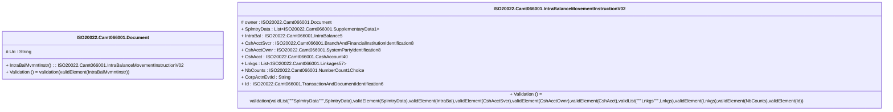

# camt.066.001.02-physical

> The tables below contain descriptions of the members of each Element. 
> The first column indicates the type of the member:
> A ‘#’ indicates that the field is a key to the element, and a ‘+’ indicates that the field is a value.
> The ‘*’ column contains a description for the element member.  
> The ‘@’ column contains any properties for the member.
> The ‘=’ column contains calculated values; or in the case of an enum, the serialized value.

---

## EntityImpl ISO20022.Camt066001.Document

| |Name|Type|*|@|=|
|-|-|-|-|-|-|
|#|Uri|String||XmlIgnore(), JsonIgnore()||
|+|IntraBalMvmntInstr|ISO20022.Camt066001.IntraBalanceMovementInstructionV02||XmlElement()||
||Validation|Some(String)||XmlIgnore(), JsonIgnore()|validation(validElement(IntraBalMvmntInstr))|

---

## AspectImpl ISO20022.Camt066001.IntraBalanceMovementInstructionV02

| |Name|Type|*|@|=|
|-|-|-|-|-|-|
|#|owner|ISO20022.Camt066001.Document||||
|+|SplmtryData|List<ISO20022.Camt066001.SupplementaryData1>||XmlElement()||
|+|IntraBal|ISO20022.Camt066001.IntraBalance5||XmlElement()||
|+|CshAcctSvcr|ISO20022.Camt066001.BranchAndFinancialInstitutionIdentification8||XmlElement()||
|+|CshAcctOwnr|ISO20022.Camt066001.SystemPartyIdentification8||XmlElement()||
|+|CshAcct|ISO20022.Camt066001.CashAccount40||XmlElement()||
|+|Lnkgs|List<ISO20022.Camt066001.Linkages57>||XmlElement()||
|+|NbCounts|ISO20022.Camt066001.NumberCount1Choice||XmlElement()||
|+|CorpActnEvtId|String||XmlElement()||
|+|Id|ISO20022.Camt066001.TransactionAndDocumentIdentification6||XmlElement()||
||Validation|Some(String)||XmlIgnore(), JsonIgnore()|validation(validList("""SplmtryData""",SplmtryData),validElement(SplmtryData),validElement(IntraBal),validElement(CshAcctSvcr),validElement(CshAcctOwnr),validElement(CshAcct),validList("""Lnkgs""",Lnkgs),validElement(Lnkgs),validElement(NbCounts),validElement(Id))|

